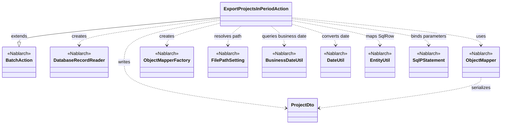
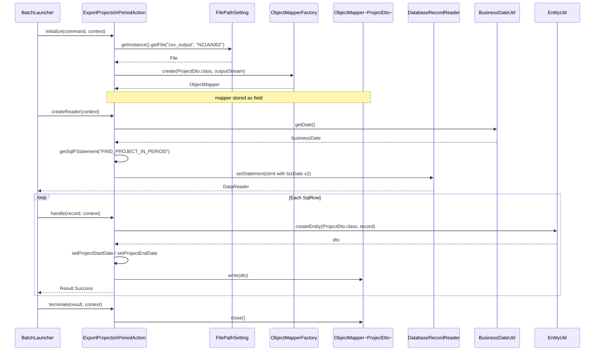

# Code Analysis: ExportProjectsInPeriodAction

**Generated**: 2026-04-24 15:10:30
**Target**: 期間内プロジェクト一覧出力の都度起動バッチアクション
**Modules**: proman-batch
**Analysis Duration**: unknown

---

## Overview

`ExportProjectsInPeriodAction` は、業務日付時点で有効な期間内のプロジェクト情報をデータベースから取得し、CSVファイルとして出力する都度起動バッチアクションです。Nablarchの `BatchAction` を継承し、`DatabaseRecordReader` でDB検索結果を1件ずつ読み込み、`ObjectMapper` を用いて `ProjectDto` をCSVへシリアライズします。出力ファイルのパスは `FilePathSetting` により論理名 `csv_output` から解決され、処理件数分ループ出力した後に `terminate()` でリソースを解放します。

---

## Architecture

### Dependency Graph



**Note**: This diagram uses Mermaid `classDiagram` syntax to show class names and their relationships. Use `--|>` for inheritance (extends/implements) and `..>` for dependencies (uses/creates).

### Component Summary

| Component | Role | Type | Dependencies |
|-----------|------|------|--------------|
| ExportProjectsInPeriodAction | 期間内プロジェクトCSV出力バッチ | Action (BatchAction) | ProjectDto, DatabaseRecordReader, ObjectMapper, FilePathSetting, BusinessDateUtil |
| ProjectDto | CSV出力用Bean (@Csv/@CsvFormat) | Bean/DTO | なし (DateUtilで日付整形) |
| FIND_PROJECT_IN_PERIOD | 期間内プロジェクト検索SQL | SQL ID | なし |

---

## Flow

### Processing Flow

本アクションは `BatchAction` のライフサイクルに沿って以下の順で処理されます。

1. **initialize() (Line 44-54)**: `FilePathSetting.getInstance().getFile("csv_output", OUTPUT_FILE_NAME)` で出力ファイル `N21AA002` のパスを解決し、`FileOutputStream` を生成。これを `ObjectMapperFactory.create(ProjectDto.class, outputStream)` に渡して `ObjectMapper<ProjectDto>` を構築します。`FileNotFoundException` は `IllegalStateException` にラップして送出。
2. **createReader() (Line 57-65)**: `DatabaseRecordReader` を生成し、`getSqlPStatement("FIND_PROJECT_IN_PERIOD")` で `SqlPStatement` を取得。`BusinessDateUtil.getDate()` で得た業務日付を `DateUtil.getDate()` で `java.util.Date` に変換し、`java.sql.Date` に詰めて第1・第2パラメータにセット。リーダーに statement をセットして返却します。
3. **handle(SqlRow, ExecutionContext) (Line 68-75)**: フレームワークが1レコードごとに本メソッドを呼び出します。`EntityUtil.createEntity(ProjectDto.class, record)` で `SqlRow` を `ProjectDto` に変換。ただし `projectStartDate` / `projectEndDate` は `ProjectDto` 側で `Date` を受け取る setter が文字列整形するため、`record.getDate(...)` の結果を明示的に setter 経由で設定。最後に `mapper.write(dto)` でCSV1行を出力し、`Result.Success` を返します。
4. **terminate(Result, ExecutionContext) (Line 78-80)**: 処理完了時（正常/異常問わず）に呼ばれ、`mapper.close()` でバッファフラッシュとストリーム解放を実施します。

### Sequence Diagram



---

## Components

### 1. ExportProjectsInPeriodAction

**File**: [ExportProjectsInPeriodAction.java](../../.lw/nab-official/v6/nablarch-system-development-guide/Sample_Project/Source_Code/proman-project/proman-batch/src/main/java/com/nablarch/example/proman/batch/project/ExportProjectsInPeriodAction.java)

**Role**: 期間内プロジェクト一覧をCSVへ出力する都度起動バッチアクション。`BatchAction<SqlRow>` を継承し、DB検索結果の各行をCSV1行として書き出す「DB to FILE」パターン。

**Key methods**:
- `initialize(CommandLine, ExecutionContext)` (Line 44-54): 出力ファイルパス解決と `ObjectMapper` 生成。論理名 `csv_output` + 物理ファイル名 `N21AA002` から出力先を決定。
- `createReader(ExecutionContext)` (Line 57-65): `DatabaseRecordReader` を生成し、SQL ID `FIND_PROJECT_IN_PERIOD` に業務日付を2箇所バインド。
- `handle(SqlRow, ExecutionContext)` (Line 68-75): `EntityUtil.createEntity` で `SqlRow→ProjectDto` 変換し `mapper.write(dto)` で出力。日付項目のみ型差異のため手動 setter 呼び出し。
- `terminate(Result, ExecutionContext)` (Line 78-80): `mapper.close()` でリソース解放。

**Dependencies**: `BatchAction`, `DatabaseRecordReader`, `SqlPStatement`, `ObjectMapper`, `ObjectMapperFactory`, `FilePathSetting`, `BusinessDateUtil`, `DateUtil`, `EntityUtil`, `ProjectDto`, `Result.Success`

### 2. ProjectDto

**File**: [ProjectDto.java](../../.lw/nab-official/v6/nablarch-system-development-guide/Sample_Project/Source_Code/proman-project/proman-batch/src/main/java/com/nablarch/example/proman/batch/project/ProjectDto.java)

**Role**: CSV出力1行分を表すBean。`@Csv` でプロパティ順・ヘッダ、`@CsvFormat` で区切り文字・クォート・文字コードを宣言。

**Key points**:
- `@Csv(type = CUSTOM, properties = {...}, headers = {...})` (Line 16-20): 13項目をCSV列として宣言。
- `@CsvFormat(fieldSeparator = ',', lineSeparator = "\r\n", quote = '"', charset = "UTF-8", quoteMode = ALL)` (Line 21-22): 全フィールドをダブルクォート囲み、UTF-8、CRLF改行で出力。
- `setProjectStartDate(Date)` / `setProjectEndDate(Date)` (Line 129, 145): `DateUtil.formatDate(date, "yyyy/MM/dd")` で文字列整形してフィールドへ格納。getter は `String` 型のため型差異が生じる。

**Dependencies**: `DateUtil`, `@Csv`, `@CsvFormat`, `CsvDataBindConfig.QuoteMode`

---

## Nablarch Framework Usage

### BatchAction

**Class**: `nablarch.fw.action.BatchAction<TData>`

**Description**: 都度起動バッチ／常駐バッチの業務アクション基底クラス。`initialize` → `createReader` → `handle`（レコード分繰り返し）→ `terminate` のライフサイクルで動作する。

**Usage**:
```java
public class ExportProjectsInPeriodAction extends BatchAction<SqlRow> {
    @Override public DataReader<SqlRow> createReader(ExecutionContext context) { ... }
    @Override public Result handle(SqlRow record, ExecutionContext context) { ... }
}
```

**Important points**:
- ✅ **createReader の実装必須**: `DataReader` を返し、フレームワークがレコード単位に `handle` を呼び出す。
- 💡 **ライフサイクル活用**: `initialize` で資源確保、`terminate` で必ず解放することでリソースリークを防ぐ。
- 🎯 **DB to FILE**: 本アクションのように DB から読み込んで CSV 出力するパターンで典型的に使用。

**Usage in this code**: 4メソッド (`initialize`/`createReader`/`handle`/`terminate`) を `@Override` し、DB to FILE のライフサイクルに沿って実装。

**Details**: [Nablarchバッチ Getting Started](../../.claude/skills/nabledge-6/docs/processing-pattern/nablarch-batch/nablarch-batch-getting-started-nablarch-batch.md)

### DatabaseRecordReader

**Class**: `nablarch.fw.reader.DatabaseRecordReader`

**Description**: `SqlPStatement` を実行して得られる結果セットを1行ずつ `SqlRow` として返却する Nablarch 標準の `DataReader` 実装。

**Usage**:
```java
DatabaseRecordReader reader = new DatabaseRecordReader();
SqlPStatement statement = getSqlPStatement("FIND_PROJECT_IN_PERIOD");
statement.setDate(1, bizDate);
statement.setDate(2, bizDate);
reader.setStatement(statement);
return reader;
```

**Important points**:
- ✅ **SqlPStatement をセット**: `setStatement()` で検索用 statement を渡す。パラメータは呼び出し側でバインド。
- 💡 **SQL ID 連携**: `BatchAction#getSqlPStatement(sqlId)` と組み合わせて、SQL を外部ファイル化できる。
- ⚠️ **データリーダ選択**: データバインド（`ObjectMapper`）を使う場合、ファイル系の `FileDataReader` / `ValidatableFileDataReader` は使用不可。DB 読み込みでは本クラスが推奨。

**Usage in this code**: `createReader()` で生成し、`FIND_PROJECT_IN_PERIOD` に業務日付を2回バインドして返却（Line 57-65）。

**Details**: [Nablarchバッチ アーキテクチャ](../../.claude/skills/nabledge-6/docs/processing-pattern/nablarch-batch/nablarch-batch-architecture.md)

### ObjectMapper / ObjectMapperFactory

**Class**: `nablarch.common.databind.ObjectMapper<T>`, `nablarch.common.databind.ObjectMapperFactory`

**Description**: CSV・TSV・固定長データを Java Beans にバインドして読み書きする汎用データバインド機構。`@Csv` / `@CsvFormat` を解釈してファイル出力を行う。

**Usage**:
```java
ObjectMapper<ProjectDto> mapper = ObjectMapperFactory.create(ProjectDto.class, outputStream);
mapper.write(dto);
mapper.close();
```

**Important points**:
- ✅ **必ず `close()` を呼ぶ**: バッファをフラッシュしリソースを解放。本アクションでは `terminate()` で実施。
- ⚠️ **スレッドアンセーフ**: 複数スレッドから同時呼び出し不可。本アクションは単一スレッドのバッチのため問題なし。
- 💡 **アノテーション駆動**: `@Csv(type = CUSTOM, properties = {...}, headers = {...})` と `@CsvFormat` でフォーマットを宣言的に定義。
- ⚡ **大量データ対応**: 1件ずつ書き込むためメモリに全データを保持せず、大量出力でも安全。

**Usage in this code**: `initialize()` で `ProjectDto` 用の `ObjectMapper` を生成 (Line 49-50)、`handle()` で `mapper.write(dto)` (Line 73)、`terminate()` で `mapper.close()` (Line 79)。

**Details**: [データバインド](../../.claude/skills/nabledge-6/docs/component/libraries/libraries-data-bind.md)

### FilePathSetting

**Class**: `nablarch.core.util.FilePathSetting`

**Description**: 論理名とディレクトリ・拡張子をコンポーネント設定で紐づけ、物理パスを解決するユーティリティ。環境差異を設定ファイルに閉じ込める。

**Usage**:
```java
FilePathSetting filePathSetting = FilePathSetting.getInstance();
File output = filePathSetting.getFile("csv_output", "N21AA002");
```

**Important points**:
- ✅ **コンポーネント名は `filePathSetting` 固定**: `basePathSettings` でディレクトリ、`fileExtensions` で拡張子を設定。
- 💡 **環境非依存**: ソースコードから物理パスを排除し、環境切替（開発/本番）を設定変更のみで実現。
- ⚠️ **classpath スキームの制限**: 一部 AP サーバ (JBoss/Wildfly の VFS) では `classpath` スキームが使えないため `file` スキームを推奨。

**Usage in this code**: `initialize()` で `getFile("csv_output", OUTPUT_FILE_NAME)` を呼び出し、論理名 `csv_output` 配下の `N21AA002.csv`（拡張子は設定で付与）を解決 (Line 45-47)。

**Details**: [ファイルパス管理](../../.claude/skills/nabledge-6/docs/component/libraries/libraries-file-path-management.md)

### BusinessDateUtil / DateUtil

**Class**: `nablarch.core.date.BusinessDateUtil`, `nablarch.core.util.DateUtil`

**Description**: `BusinessDateUtil` はシステム共通の業務日付を返し、`DateUtil` は文字列⇔`Date` 変換や整形を行う。

**Usage**:
```java
Date bizDate = new Date(DateUtil.getDate(BusinessDateUtil.getDate()).getTime());
```

**Important points**:
- ✅ **業務日付の一元化**: `BusinessDateUtil.getDate()` は `yyyyMMdd` 文字列を返し、全アクションで同一日付を使える。
- 💡 **テスト容易性**: 業務日付を差し替えるだけで日付境界テストが可能。
- ⚠️ **型変換の経路**: `BusinessDateUtil.getDate()` → 文字列 → `DateUtil.getDate()` で `java.util.Date` → `java.sql.Date` とラップする必要あり。

**Usage in this code**: `createReader()` で業務日付を取得し、SQLパラメータ（開始／終了比較）に同値でバインド (Line 60-62)。

**Details**: [Nablarchバッチ Getting Started](../../.claude/skills/nabledge-6/docs/processing-pattern/nablarch-batch/nablarch-batch-getting-started-nablarch-batch.md)

### EntityUtil

**Class**: `nablarch.common.dao.EntityUtil`

**Description**: `SqlRow`（検索結果の Map ライクな行）をエンティティ/DTO クラスへフィールドマッピングするユーティリティ。

**Usage**:
```java
ProjectDto dto = EntityUtil.createEntity(ProjectDto.class, record);
```

**Important points**:
- ✅ **型が一致するカラムのみ自動設定**: カラム型と DTO のプロパティ型が一致する項目のみがコピーされる。
- ⚠️ **型不一致は手動設定**: 本コードのように `SqlRow` の `Date` 型を `ProjectDto` の `String` 型に入れる場合は setter を明示的に呼ぶ必要がある (Line 70-71)。
- 💡 **ボイラープレート削減**: 大多数のカラムを一度に詰め替え、例外項目だけ個別対応する設計になる。

**Usage in this code**: `handle()` 冒頭で `SqlRow → ProjectDto` 変換、その後 `projectStartDate` / `projectEndDate` のみ個別 setter で上書き (Line 69-72)。

**Details**: [Nablarchバッチ Getting Started](../../.claude/skills/nabledge-6/docs/processing-pattern/nablarch-batch/nablarch-batch-getting-started-nablarch-batch.md)

---

## References

### Source Files

- [ExportProjectsInPeriodAction.java (.lw/nab-official/v5/nablarch-system-development-guide/en/Sample_Project/Source_Code/proman-project/proman-batch/src/main/java/com/nablarch/example/proman/batch/project)](../../.lw/nab-official/v5/nablarch-system-development-guide/en/Sample_Project/Source_Code/proman-project/proman-batch/src/main/java/com/nablarch/example/proman/batch/project/ExportProjectsInPeriodAction.java) - ExportProjectsInPeriodAction
- [ExportProjectsInPeriodAction.java (.lw/nab-official/v5/nablarch-system-development-guide/Sample_Project/Source_Code/proman-project/proman-batch/src/main/java/com/nablarch/example/proman/batch/project)](../../.lw/nab-official/v5/nablarch-system-development-guide/Sample_Project/Source_Code/proman-project/proman-batch/src/main/java/com/nablarch/example/proman/batch/project/ExportProjectsInPeriodAction.java) - ExportProjectsInPeriodAction
- [ExportProjectsInPeriodAction.java (.lw/nab-official/v6/nablarch-system-development-guide/en/Sample_Project/Source_Code/proman-project/proman-batch/src/main/java/com/nablarch/example/proman/batch/project)](../../.lw/nab-official/v6/nablarch-system-development-guide/en/Sample_Project/Source_Code/proman-project/proman-batch/src/main/java/com/nablarch/example/proman/batch/project/ExportProjectsInPeriodAction.java) - ExportProjectsInPeriodAction
- [ExportProjectsInPeriodAction.java (.lw/nab-official/v6/nablarch-system-development-guide/Sample_Project/Source_Code/proman-project/proman-batch/src/main/java/com/nablarch/example/proman/batch/project)](../../.lw/nab-official/v6/nablarch-system-development-guide/Sample_Project/Source_Code/proman-project/proman-batch/src/main/java/com/nablarch/example/proman/batch/project/ExportProjectsInPeriodAction.java) - ExportProjectsInPeriodAction
- [ProjectDto.java (.lw/nab-official/v5/nablarch-system-development-guide/en/Sample_Project/Source_Code/proman-project/proman-batch/src/main/java/com/nablarch/example/proman/batch/project)](../../.lw/nab-official/v5/nablarch-system-development-guide/en/Sample_Project/Source_Code/proman-project/proman-batch/src/main/java/com/nablarch/example/proman/batch/project/ProjectDto.java) - ProjectDto
- [ProjectDto.java (.lw/nab-official/v5/nablarch-system-development-guide/Sample_Project/Source_Code/proman-project/proman-batch/src/main/java/com/nablarch/example/proman/batch/project)](../../.lw/nab-official/v5/nablarch-system-development-guide/Sample_Project/Source_Code/proman-project/proman-batch/src/main/java/com/nablarch/example/proman/batch/project/ProjectDto.java) - ProjectDto
- [ProjectDto.java (.lw/nab-official/v5/nablarch-example-web/src/main/java/com/nablarch/example/app/web/dto)](../../.lw/nab-official/v5/nablarch-example-web/src/main/java/com/nablarch/example/app/web/dto/ProjectDto.java) - ProjectDto
- [ProjectDto.java (.lw/nab-official/v6/nablarch-system-development-guide/en/Sample_Project/Source_Code/proman-project/proman-batch/src/main/java/com/nablarch/example/proman/batch/project)](../../.lw/nab-official/v6/nablarch-system-development-guide/en/Sample_Project/Source_Code/proman-project/proman-batch/src/main/java/com/nablarch/example/proman/batch/project/ProjectDto.java) - ProjectDto
- [ProjectDto.java (.lw/nab-official/v6/nablarch-system-development-guide/Sample_Project/Source_Code/proman-project/proman-batch/src/main/java/com/nablarch/example/proman/batch/project)](../../.lw/nab-official/v6/nablarch-system-development-guide/Sample_Project/Source_Code/proman-project/proman-batch/src/main/java/com/nablarch/example/proman/batch/project/ProjectDto.java) - ProjectDto
- [ProjectDto.java (.lw/nab-official/v6/nablarch-example-web/src/main/java/com/nablarch/example/app/web/dto)](../../.lw/nab-official/v6/nablarch-example-web/src/main/java/com/nablarch/example/app/web/dto/ProjectDto.java) - ProjectDto

### Knowledge Base (Nabledge-6)

- [Nablarch Batch Getting Started Nablarch Batch](../../.claude/skills/nabledge-6/docs/processing-pattern/nablarch-batch/nablarch-batch-getting-started-nablarch-batch.md)
- [Nablarch Batch Architecture](../../.claude/skills/nabledge-6/docs/processing-pattern/nablarch-batch/nablarch-batch-architecture.md)
- [Libraries Data Bind](../../.claude/skills/nabledge-6/docs/component/libraries/libraries-data-bind.md)
- [Libraries File Path Management](../../.claude/skills/nabledge-6/docs/component/libraries/libraries-file-path-management.md)

### Official Documentation

(No official documentation links available)

---

**Output**: `.nabledge/20260424/code-analysis-ExportProjectsInPeriodAction.md`

**Note**: This documentation was generated by the code-analysis workflow of the nabledge-6 skill.
