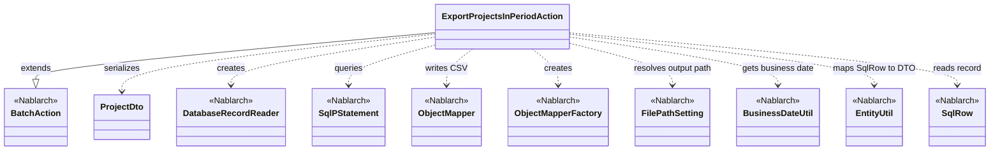
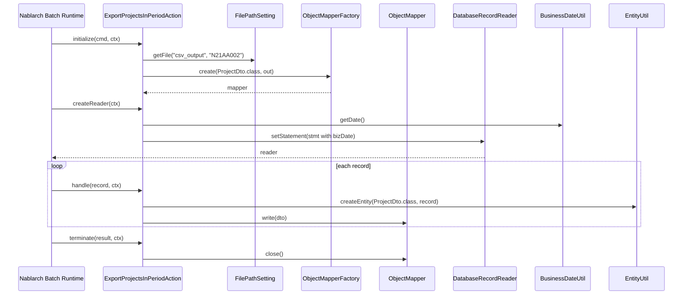

# Code Analysis: ExportProjectsInPeriodAction

**Generated**: 2026-04-24 15:10:30
**Target**: 期間内プロジェクト一覧を CSV に出力する都度起動バッチアクション
**Modules**: proman-batch
**Analysis Duration**: unknown

---

## Overview

`ExportProjectsInPeriodAction` は Nablarch バッチ (`BatchAction`) として実装された都度起動バッチで、業務日付時点で有効なプロジェクトをデータベースから検索し CSV ファイルへ出力する。`DatabaseRecordReader` で検索結果を一行ずつ取得し、`ProjectDto` へ詰め替えて `ObjectMapper` 経由で CSV として書き出す構成になっている。出力ファイル名は `N21AA002` 固定で、出力先は `FilePathSetting` の論理名 `csv_output` により解決される。

---

## Architecture

### Dependency Graph

### Component Summary

| Component | Role | Type | Dependencies |
|-----------|------|------|--------------|
| ExportProjectsInPeriodAction | 期間内プロジェクト一覧の CSV 出力バッチ | Action (BatchAction) | ProjectDto, DatabaseRecordReader, ObjectMapper, FilePathSetting, BusinessDateUtil, EntityUtil |
| ProjectDto | CSV 出力用 Java Beans (13 列) | Dto (databind @Csv) | DateUtil |

---

## Flow

### Processing Flow

1. **initialize(CommandLine, ExecutionContext)**: `FilePathSetting.getInstance().getFile("csv_output", "N21AA002")` で出力ファイルを解決し、`FileOutputStream` を生成。`ObjectMapperFactory.create(ProjectDto.class, outputStream)` で `ObjectMapper<ProjectDto>` を組み立てる。
2. **createReader(ExecutionContext)**: `DatabaseRecordReader` を生成、`getSqlPStatement("FIND_PROJECT_IN_PERIOD")` を取得、`BusinessDateUtil.getDate()` で業務日付をバインド。
3. **handle(SqlRow, ExecutionContext)**: `EntityUtil.createEntity(ProjectDto.class, record)` で DTO 生成。`setProjectStartDate` / `setProjectEndDate` を明示呼出（型差異のため）。`mapper.write(dto)` で CSV 出力。
4. **terminate(Result, ExecutionContext)**: `mapper.close()` でストリーム解放。

### Sequence Diagram

---

## Components

### ExportProjectsInPeriodAction
- BatchAction を継承する業務アクション
- Key methods: initialize / createReader / handle / terminate

### ProjectDto
- @Csv / @CsvFormat アノテーションで列順とフォーマット宣言

---

## Nablarch Framework Usage

### BatchAction

**Class**: `nablarch.fw.action.BatchAction`

Usage: `extends BatchAction<SqlRow>` + `initialize / createReader / handle / terminate` を実装。

### DatabaseRecordReader

**Class**: `nablarch.fw.reader.DatabaseRecordReader`

Usage: `new DatabaseRecordReader()` + `reader.setStatement(statement)`.

### ObjectMapper / ObjectMapperFactory

**Class**: `nablarch.common.databind.ObjectMapper`

Usage: `ObjectMapperFactory.create(ProjectDto.class, outputStream)` → `mapper.write(dto)` → `mapper.close()`.

### FilePathSetting

**Class**: `nablarch.core.util.FilePathSetting`

Usage: `FilePathSetting.getInstance().getFile("csv_output", OUTPUT_FILE_NAME)` で論理名からファイル解決。

### BusinessDateUtil

**Class**: `nablarch.core.date.BusinessDateUtil`

Usage: `BusinessDateUtil.getDate()` で業務日付取得 → `DateUtil.getDate()` 経由で `java.sql.Date` に変換。

### EntityUtil

**Class**: `nablarch.common.dao.EntityUtil`

Usage: `EntityUtil.createEntity(ProjectDto.class, record)` で `SqlRow` → DTO 詰め替え。

---

Output: `/home/tie303177/work/nabledge/work2/.nabledge/20260424/code-analysis-ExportProjectsInPeriodAction.md`
