# Code Analysis: ProjectAction

**Generated**: 2026-04-24 17:27:59
**Target**: プロジェクトの検索・登録・更新・削除・CSVダウンロード機能を提供する業務Action
**Modules**: nablarch-example-web
**Analysis Duration**: unknown

---

## Overview

`ProjectAction` は Nablarch Web アプリケーションの業務Actionで、プロジェクトに対する CRUD (一覧検索・登録・更新・削除) と CSV ダウンロードを提供する。入力はフォームクラス (`ProjectForm`/`ProjectSearchForm`/`ProjectTargetForm`/`ProjectUpdateForm`) で受け取り、`@InjectForm` によりバリデーション済みのオブジェクトがリクエストスコープへ格納される。データアクセスは `UniversalDao` を利用し、ページングや遅延ロードを活用する。登録・更新・削除メソッドには `@OnDoubleSubmission` を付与し二重サブミットを防止している。

---

## Architecture

### Dependency Graph

```mermaid
classDiagram
    class ProjectAction
    class ProjectProfit
    class ProjectForm
    class ProjectSearchForm
    class ProjectTargetForm
    class ProjectUpdateForm
    class UniversalDao {
        <<Nablarch>>
    }
    class SessionUtil {
        <<Nablarch>>
    }
    class BeanUtil {
        <<Nablarch>>
    }
    class ObjectMapperFactory {
        <<Nablarch>>
    }
    class ObjectMapper {
        <<Nablarch>>
    }
    class FileResponse {
        <<Nablarch>>
    }
    class DeferredEntityList {
        <<Nablarch>>
    }
    class ExecutionContext {
        <<Nablarch>>
    }
    class ApplicationException {
        <<Nablarch>>
    }
    class MessageUtil {
        <<Nablarch>>
    }

    ProjectAction ..> ProjectForm : validates via @InjectForm
    ProjectAction ..> ProjectSearchForm : validates via @InjectForm
    ProjectAction ..> ProjectTargetForm : validates via @InjectForm
    ProjectAction ..> ProjectUpdateForm : validates via @InjectForm
    ProjectAction ..> ProjectProfit : creates
    ProjectAction ..> UniversalDao : persists / queries
    ProjectAction ..> SessionUtil : stores state
    ProjectAction ..> BeanUtil : copies properties
    ProjectAction ..> ObjectMapperFactory : creates mapper
    ProjectAction ..> ObjectMapper : writes CSV
    ProjectAction ..> FileResponse : downloads file
    ProjectAction ..> DeferredEntityList : lazy loads
    ProjectAction ..> ExecutionContext : request context
    ProjectAction ..> ApplicationException : throws on validation
    ProjectAction ..> MessageUtil : creates message
```



**Note**: This diagram uses Mermaid `classDiagram` syntax to show class names and their relationships. Use `--|>` for inheritance (extends/implements) and `..>` for dependencies (uses/creates).

### Component Summary

| Component | Role | Type | Dependencies |
|-----------|------|------|--------------|
| ProjectAction | プロジェクトCRUDとCSVダウンロードの業務Action | Action | UniversalDao, SessionUtil, BeanUtil, ObjectMapperFactory, FileResponse, ProjectForm系 |
| ProjectProfit | 売上・原価から利益指標(売上総利益・配賦前利益率等)を算出する値オブジェクト | Domain Value | - |
| ProjectForm | プロジェクト登録用の入力フォーム (Bean Validation) | Form | - |
| ProjectSearchForm | 検索条件・ページ番号・ソートキーを保持するフォーム | Form | - |
| ProjectTargetForm | 対象プロジェクトIDを保持するフォーム (show/edit) | Form | - |
| ProjectUpdateForm | プロジェクト更新用の入力フォーム | Form | - |
| UniversalDao | O/Rマッパー(挿入・更新・削除・SQLファイル検索・ページング・遅延ロード) | Nablarch | - |
| SessionUtil | セッションスコープへの値の保存/取得/削除 | Nablarch | - |
| BeanUtil | JavaBean間のプロパティコピー | Nablarch | - |
| ObjectMapperFactory / ObjectMapper | DTOとCSVのバインディング(ダウンロード用) | Nablarch | - |
| FileResponse | ファイル応答(Content-Type/Dispositionを指定) | Nablarch | - |
| DeferredEntityList | 遅延ロード対応のEntityリスト | Nablarch | - |

---

## Flow

### Processing Flow

ProjectAction は各業務メソッドが HTTP リクエストに対応し、View(JSP) と画面遷移を返す構造を取る。主要フローは以下の 4 系統:

- **登録系**: `newEntity()` で入力画面表示 → `confirmOfCreate()` で `@InjectForm(ProjectForm)` によるバリデーション + Client存在チェック → セッションにProjectを退避し確認画面へ → `create()` で `@OnDoubleSubmission` の下 `UniversalDao.insert()` → `completeOfCreate()` で完了画面。失敗時は `@OnError(ApplicationException)` で `create.jsp` に戻る。`backToNew()` はセッションから復元して入力画面に戻る。
- **検索系**: `index()` で初期フォーム(ソートキー=ID, ページ=1)を設定し `searchProject()` を呼ぶ。`list()` は `@InjectForm(ProjectSearchForm)` のバリデーションを通した後に再検索。内部ヘルパ `searchProject(searchCondition, context)` はログインユーザID を検索条件に付与し、`UniversalDao.page().per(20L).findAllBySqlFile(Project.class, "SEARCH_PROJECT", cond)` でページング検索を行う。
- **参照/更新系**: `show()` と `edit()` は `@InjectForm(ProjectTargetForm)` で受けた projectId と userId で `UniversalDao.findBySqlFile(ProjectDto.class, "FIND_BY_PROJECT", ...)` を実行。`edit()` は結果を `Project` に変換してセッションに退避。`confirmOfUpdate()` は `ProjectUpdateForm` のバリデーション後 Client存在チェックを行い `BeanUtil.copy(form, project)` で差分反映し確認画面へ。`update()` は `@OnDoubleSubmission` の下 `UniversalDao.update()` を実行。
- **削除/ダウンロード系**: `delete()` は `@OnDoubleSubmission` の下 `UniversalDao.delete()` を実行し完了画面へリダイレクト。`download()` は `@InjectForm(ProjectSearchForm)` のバリデーション後、`UniversalDao.defer().findAllBySqlFile(ProjectDownloadDto.class, ...)` で遅延ロードし、`ObjectMapperFactory.create()` で CSV バインディングを生成、ループで `mapper.write(dto)`、最後に `FileResponse` で `text/csv; charset=Shift_JIS` を返却する。

例外系: バリデーションエラーや Client 不在の `ApplicationException` は `@OnError` 指定の JSP へフォワードされる。

### Sequence Diagram

```mermaid
sequenceDiagram
    participant Client
    participant Action as ProjectAction
    participant Session as SessionUtil
    participant Bean as BeanUtil
    participant Dao as UniversalDao
    participant Mapper as ObjectMapper
    participant DB as Database

    Note over Client,DB: 登録フロー
    Client->>Action: newEntity()
    Action->>Session: delete("project")
    Action-->>Client: forward(create.jsp)

    Client->>Action: confirmOfCreate() [@InjectForm ProjectForm, @OnError]
    Action->>Dao: exists(Client, FIND_BY_CLIENT_ID)
    Dao->>DB: SQL
    DB-->>Dao: result
    alt client not found
        Action-->>Client: throw ApplicationException → create.jsp
    else ok
        Action->>Bean: createAndCopy(Project, form)
        Action->>Session: put("project", project)
        Action-->>Client: forward(confirmOfCreate.jsp)
    end

    Client->>Action: create() [@OnDoubleSubmission]
    Action->>Session: delete("project")
    Action->>Dao: insert(project)
    Dao->>DB: INSERT
    Action-->>Client: 303 redirect completeOfCreate

    Note over Client,DB: 検索/ダウンロードフロー
    Client->>Action: list() [@InjectForm ProjectSearchForm]
    Action->>Dao: page(n).per(20).findAllBySqlFile(Project, SEARCH_PROJECT)
    Dao->>DB: SQL with paging
    DB-->>Dao: page
    Dao-->>Action: List~Project~
    Action-->>Client: forward(index.jsp)

    Client->>Action: download()
    Action->>Dao: defer().findAllBySqlFile(ProjectDownloadDto, SEARCH_PROJECT)
    loop Each row
        Action->>Mapper: write(dto)
    end
    Action-->>Client: FileResponse (text/csv; Shift_JIS)
```

---

## Components

### ProjectAction
- **Role**: プロジェクトCRUDとCSVダウンロードの業務Action
- **Key methods**:
  - `confirmOfCreate(request, context)` (:61-88) — `@InjectForm(ProjectForm)` + `@OnError(ApplicationException → create.jsp)`。Client存在チェック後 `SessionUtil.put("project", ...)` と `ProjectProfit` を生成してリクエストスコープに格納。
  - `create(request, context)` (:97-103) — `@OnDoubleSubmission`。`SessionUtil.delete("project")` で取り出しつつ削除し `UniversalDao.insert()`、303 リダイレクト。
  - `index(request, context)` (:138-150) と `list(request, context)` (:159-169) — `searchProject()` でページング検索結果をリクエストスコープに設定。
  - `searchProject(condition, context)` (:181-190) — ログインユーザIDを条件に追加し `UniversalDao.page(n).per(20L).findAllBySqlFile(Project.class, "SEARCH_PROJECT", condition)` を実行。
  - `download(request, context)` (:200-222) — `UniversalDao.defer().findAllBySqlFile(ProjectDownloadDto.class, "SEARCH_PROJECT", ...)` と `ObjectMapperFactory.create(ProjectDownloadDto.class, outputStream)` を try-with-resources で扱い、`FileResponse` を返す。
  - `show(request, context)` (:231-246), `edit(request, context)` (:255-271), `confirmOfUpdate(request, context)` (:280-305), `update(request, context)` (:322-328), `delete(request, context)` (:348-353) など。
- **Dependencies**: UniversalDao, SessionUtil, BeanUtil, ObjectMapperFactory/ObjectMapper, FileResponse, DeferredEntityList, ExecutionContext, ApplicationException, MessageUtil, ProjectForm系
- **File**: [ProjectAction.java](../../.lw/nab-official/v6/nablarch-example-web/src/main/java/com/nablarch/example/app/web/action/ProjectAction.java)

### ProjectProfit
- **Role**: 売上・原価・販管費・本社配賦から利益系指標を算出する不変の値オブジェクト
- **Key methods**: `getGrossProfit()` (売上総利益), `getProfitBeforeAllocation()` (配賦前利益), `getProfitRateBeforeAllocation()` (配賦前利益率 — `BigDecimal` で百分率換算, `RoundingMode.HALF_UP`)
- **Dependencies**: BigDecimal, RoundingMode
- **File**: [ProjectProfit.java](../../.lw/nab-official/v6/nablarch-example-web/src/main/java/com/nablarch/example/app/web/action/ProjectProfit.java)

### ProjectForm / ProjectSearchForm / ProjectTargetForm / ProjectUpdateForm
- **Role**: 業務アクションメソッドへ注入される入力フォーム。`@InjectForm` によって validate され、リクエストスコープに格納される。
- **Dependencies**: Bean Validation (jakarta.validation / nablarch-validation)
- **Files**:
  - [ProjectForm.java](../../.lw/nab-official/v6/nablarch-example-web/src/main/java/com/nablarch/example/app/web/form/ProjectForm.java)
  - [ProjectSearchForm.java](../../.lw/nab-official/v6/nablarch-example-web/src/main/java/com/nablarch/example/app/web/form/ProjectSearchForm.java)
  - [ProjectTargetForm.java](../../.lw/nab-official/v6/nablarch-example-web/src/main/java/com/nablarch/example/app/web/form/ProjectTargetForm.java)
  - [ProjectUpdateForm.java](../../.lw/nab-official/v6/nablarch-example-web/src/main/java/com/nablarch/example/app/web/form/ProjectUpdateForm.java)

---

## Nablarch Framework Usage

### UniversalDao

**Class**: `nablarch.common.dao.UniversalDao`

**Description**: JPAアノテーションベースのO/Rマッパー。insert/update/delete/findById 等のCRUDに加え、SQLファイルを用いた `findBySqlFile` / `findAllBySqlFile` 、ページング (`page().per()`)、遅延ロード (`defer()`) を提供する。

**Usage**:
```java
// ページング検索
UniversalDao.page(pageNumber).per(20L).findAllBySqlFile(Project.class, "SEARCH_PROJECT", cond);
// 主キー検索
UniversalDao.findBySqlFile(ProjectDto.class, "FIND_BY_PROJECT", new Object[]{projectId, userId});
// 遅延ロード (try-with-resources)
try (DeferredEntityList<ProjectDownloadDto> list =
        (DeferredEntityList<ProjectDownloadDto>) UniversalDao.defer()
            .findAllBySqlFile(ProjectDownloadDto.class, "SEARCH_PROJECT", cond)) { ... }
// 登録・更新・削除
UniversalDao.insert(project); UniversalDao.update(project); UniversalDao.delete(project);
```

**Important points**:
- ✅ **SQLファイルは対象Entityと同パッケージに配置**: `@SqlFile` 相当のリソースキーで解決される。本コードでは `"SEARCH_PROJECT"` / `"FIND_BY_PROJECT"` / `"FIND_BY_CLIENT_ID"` を参照。
- ⚡ **大量データは `defer()` を利用**: `DeferredEntityList` を try-with-resources で扱い、ヒープ上に結果を全展開しない。`download()` で採用。
- 💡 **ページングは `page(n).per(size)` で宣言的**: 実行は `findAllBySqlFile` にチェーン。ページ番号は `searchCondition` から取得。
- ⚠️ **悲観的ロックは行ロック付きSQLを `findBySqlFile` で実行**: UniversalDao 自体は悲観的ロック機能を提供しない。

**Usage in this code**:
- `confirmOfCreate()` (:64) / `confirmOfUpdate()` (:284) で `UniversalDao.exists(Client.class, "FIND_BY_CLIENT_ID", ...)` により顧客存在チェック。
- `searchProject()` (:186-189) で `UniversalDao.page(...).per(20L).findAllBySqlFile(Project.class, "SEARCH_PROJECT", ...)` によるページング検索。
- `show()` (:238) / `edit()` (:261) / `backToNew()` (:126) / `backToEdit()` (:316) で `findBySqlFile` / `findById`。
- `create()` (:101) / `update()` (:324) / `delete()` (:350) で `insert` / `update` / `delete`。
- `download()` (:210-213) で `UniversalDao.defer().findAllBySqlFile(ProjectDownloadDto.class, "SEARCH_PROJECT", ...)` による遅延ロード。

**Details**: [Libraries Universal Dao](../../.claude/skills/nabledge-6/docs/component/libraries/libraries-universal-dao.md)

### @InjectForm / @OnError

**Class**: `nablarch.common.web.interceptor.InjectForm` / `nablarch.fw.web.interceptor.OnError`

**Description**: `@InjectForm` は業務アクションメソッド実行前にリクエストパラメータから Form をバインド・バリデーションし、リクエストスコープへ格納するインターセプタ。`@OnError` はバリデーション失敗時に例外種別に応じて画面フォワード/リダイレクトを行う。

**Usage**:
```java
@InjectForm(form = ProjectForm.class, prefix = "form")
@OnError(type = ApplicationException.class, path = "/WEB-INF/view/project/create.jsp")
public HttpResponse confirmOfCreate(HttpRequest request, ExecutionContext context) {
    ProjectForm form = context.getRequestScopedVar("form");
    ...
}
```

**Important points**:
- ✅ **`prefix` とHTMLの `name` 属性を一致**: `name="form.xxx"` と `prefix="form"` を揃えるとバインドされる。
- 💡 **`name` で変数名を変更可**: `@InjectForm(name = "searchForm", ...)` により任意のリクエストスコープ変数名が設定可能。本コードの `list()` / `download()` で使用。
- 🎯 **`@OnError(path=...)` で初期表示へフォワード**: エラー時のプルダウン等の表示データを取得する初期表示メソッドに内部フォワード (`forward://...`) させるパターンが有効。

**Usage in this code**:
- `confirmOfCreate()` (:60-61), `confirmOfUpdate()` (:279-280) — `ProjectForm`/`ProjectUpdateForm` + `ApplicationException` → 入力画面JSP。
- `list()` (:157-158), `download()` (:198-199) — `ProjectSearchForm`(name=searchForm) + `ApplicationException` → 一覧画面JSP。
- `show()` (:229), `edit()` (:253) — `ProjectTargetForm` のみ (path指定なし)。

**Details**: [Handlers InjectForm](../../.claude/skills/nabledge-6/docs/component/handlers/handlers-InjectForm.md), [Handlers On Error](../../.claude/skills/nabledge-6/docs/component/handlers/handlers-on-error.md)

### @OnDoubleSubmission

**Class**: `nablarch.common.web.token.OnDoubleSubmission`

**Description**: トークンを用いた二重サブミット防止アノテーション。トークン不一致時はリクエストを破棄する。

**Usage**:
```java
@OnDoubleSubmission
public HttpResponse create(HttpRequest request, ExecutionContext context) { ... }
```

**Important points**:
- ✅ **更新系メソッドに付与**: POSTで副作用を起こすメソッド(登録・更新・削除)に付けるのが基本。
- 💡 **リダイレクト併用**: 副作用後は `303 redirect` で PRG パターンを構成する(本コードは `"redirect://completeOfCreate"` 等)。

**Usage in this code**:
- `create()` (:96), `update()` (:321), `delete()` (:347) に付与。3メソッドすべて `UniversalDao` への副作用 + `303 redirect` の構成。

**Details**: (関連) [Web Application Feature Details](../../.claude/skills/nabledge-6/docs/processing-pattern/web-application/web-application-feature-details.md)

### SessionUtil

**Class**: `nablarch.common.web.session.SessionUtil`

**Description**: セッションスコープを型安全に扱うユーティリティ。`put` / `get` / `delete` を提供する。

**Usage**:
```java
SessionUtil.put(context, "project", project);
Project project = SessionUtil.get(context, "project");
SessionUtil.delete(context, "project");
```

**Important points**:
- ✅ **確認画面→登録のパターン**: 入力→確認→登録の流れで、確認画面表示時に `put`、登録時に `delete` で取り出しつつ消す。
- ⚠️ **ログインユーザ情報のキー**: 本アプリでは `"userContext"` で `LoginUserPrincipal` を取得。検索条件の `userId` 付与に必須。

**Usage in this code**:
- `newEntity()` (:53), `edit()` (:257) で `SessionUtil.delete("project")` により前回状態をクリア。
- `confirmOfCreate()` (:84), `edit()` (:268) で `SessionUtil.put("project", project)`。
- `create()` (:99), `update()` (:323), `delete()` (:349) で `SessionUtil.delete("project")` により取り出しつつ削除。
- 全検索系で `SessionUtil.get(context, "userContext")` により `LoginUserPrincipal.userId` を取得。

### ObjectMapper / FileResponse (Data Bind)

**Class**: `nablarch.common.databind.ObjectMapperFactory` / `ObjectMapper` / `nablarch.common.web.download.FileResponse`

**Description**: DTO と CSV/TSV/固定長のバインディングを行うデータバインド機能。`FileResponse` はファイルダウンロード応答。

**Usage**:
```java
final Path path = TempFileUtil.createTempFile();
try (DeferredEntityList<ProjectDownloadDto> list = (DeferredEntityList<ProjectDownloadDto>)
        UniversalDao.defer().findAllBySqlFile(ProjectDownloadDto.class, "SEARCH_PROJECT", cond);
     ObjectMapper<ProjectDownloadDto> mapper = ObjectMapperFactory.create(
             ProjectDownloadDto.class, TempFileUtil.newOutputStream(path))) {
    for (ProjectDownloadDto dto : list) mapper.write(dto);
}
FileResponse response = new FileResponse(path.toFile(), true);
response.setContentType("text/csv; charset=Shift_JIS");
response.setContentDisposition("プロジェクト一覧.csv");
```

**Important points**:
- ✅ **`close()` を必ず実行**: try-with-resources で flush とリソース解放を保証。
- 💡 **データバインド推奨**: 大量ダウンロードでは `defer()` との組み合わせでメモリに全件展開しない。
- 🎯 **文字コード/ファイル名指定**: `setContentType` / `setContentDisposition` で Excel互換の Shift_JIS + 日本語ファイル名を指定可能。

**Usage in this code**:
- `download()` (:206-222) で一時ファイルへ CSV 出力し `FileResponse` で返却。`@Csv` 等のアノテーションは `ProjectDownloadDto` 側に定義。

**Details**: [Libraries Data Bind](../../.claude/skills/nabledge-6/docs/component/libraries/libraries-data-bind.md), [Web Application Feature Details](../../.claude/skills/nabledge-6/docs/processing-pattern/web-application/web-application-feature-details.md)

### BeanUtil

**Class**: `nablarch.core.beans.BeanUtil`

**Description**: JavaBean間のプロパティコピーを行うユーティリティ。`createAndCopy(targetClass, source)` で新規生成+コピー、`copy(source, target)` で既存インスタンスへコピー。

**Usage in this code**:
- `confirmOfCreate()` (:82) — `BeanUtil.createAndCopy(Project.class, form)`。
- `backToNew()` (:122), `backToEdit()` (:314), `show()` (:242), `list()` (:163) — Form/DTO間コピー。
- `confirmOfUpdate()` (:297) — `BeanUtil.copy(form, project)` でセッション上のEntityに上書き。

### MessageUtil / ApplicationException

**Class**: `nablarch.core.message.MessageUtil` / `nablarch.core.message.ApplicationException`

**Description**: メッセージID からローカライズ済みメッセージを生成し、業務例外として送出する仕組み。`@OnError` と組合わせてユーザ通知を行う。

**Usage in this code**:
- `confirmOfCreate()` (:68-72), `confirmOfUpdate()` (:287-291) — Client 未存在時に `MessageUtil.createMessage(ERROR, "errors.nothing.client", ...)` を包んで `ApplicationException` を throw。`@OnError` により対応JSPへフォワード。

---

## References

### Source Files

- [ProjectAction.java (.lw/nab-official/v5/nablarch-example-rest/src/main/java/com/nablarch/example/action)](../../.lw/nab-official/v5/nablarch-example-rest/src/main/java/com/nablarch/example/action/ProjectAction.java) - ProjectAction
- [ProjectAction.java (.lw/nab-official/v5/nablarch-example-web/src/main/java/com/nablarch/example/app/web/action)](../../.lw/nab-official/v5/nablarch-example-web/src/main/java/com/nablarch/example/app/web/action/ProjectAction.java) - ProjectAction
- [ProjectAction.java (.lw/nab-official/v6/nablarch-example-rest/src/main/java/com/nablarch/example/action)](../../.lw/nab-official/v6/nablarch-example-rest/src/main/java/com/nablarch/example/action/ProjectAction.java) - ProjectAction
- [ProjectAction.java (.lw/nab-official/v6/nablarch-example-web/src/main/java/com/nablarch/example/app/web/action)](../../.lw/nab-official/v6/nablarch-example-web/src/main/java/com/nablarch/example/app/web/action/ProjectAction.java) - ProjectAction
- [ProjectProfit.java (.lw/nab-official/v5/nablarch-example-web/src/main/java/com/nablarch/example/app/web/action)](../../.lw/nab-official/v5/nablarch-example-web/src/main/java/com/nablarch/example/app/web/action/ProjectProfit.java) - ProjectProfit
- [ProjectProfit.java (.lw/nab-official/v6/nablarch-example-web/src/main/java/com/nablarch/example/app/web/action)](../../.lw/nab-official/v6/nablarch-example-web/src/main/java/com/nablarch/example/app/web/action/ProjectProfit.java) - ProjectProfit
- [ProjectForm.java (.lw/nab-official/v5/nablarch-example-rest/src/main/java/com/nablarch/example/form)](../../.lw/nab-official/v5/nablarch-example-rest/src/main/java/com/nablarch/example/form/ProjectForm.java) - ProjectForm
- [ProjectForm.java (.lw/nab-official/v5/nablarch-example-web/src/main/java/com/nablarch/example/app/web/form)](../../.lw/nab-official/v5/nablarch-example-web/src/main/java/com/nablarch/example/app/web/form/ProjectForm.java) - ProjectForm
- [ProjectForm.java (.lw/nab-official/v6/nablarch-example-rest/src/main/java/com/nablarch/example/form)](../../.lw/nab-official/v6/nablarch-example-rest/src/main/java/com/nablarch/example/form/ProjectForm.java) - ProjectForm
- [ProjectForm.java (.lw/nab-official/v6/nablarch-example-web/src/main/java/com/nablarch/example/app/web/form)](../../.lw/nab-official/v6/nablarch-example-web/src/main/java/com/nablarch/example/app/web/form/ProjectForm.java) - ProjectForm
- [ProjectSearchForm.java (.lw/nab-official/v5/nablarch-system-development-guide/en/Sample_Project/Source_Code/proman-project/proman-web/src/main/java/com/nablarch/example/proman/web/project)](../../.lw/nab-official/v5/nablarch-system-development-guide/en/Sample_Project/Source_Code/proman-project/proman-web/src/main/java/com/nablarch/example/proman/web/project/ProjectSearchForm.java) - ProjectSearchForm
- [ProjectSearchForm.java (.lw/nab-official/v5/nablarch-system-development-guide/Sample_Project/Source_Code/proman-project/proman-web/src/main/java/com/nablarch/example/proman/web/project)](../../.lw/nab-official/v5/nablarch-system-development-guide/Sample_Project/Source_Code/proman-project/proman-web/src/main/java/com/nablarch/example/proman/web/project/ProjectSearchForm.java) - ProjectSearchForm
- [ProjectSearchForm.java (.lw/nab-official/v5/nablarch-example-rest/src/main/java/com/nablarch/example/form)](../../.lw/nab-official/v5/nablarch-example-rest/src/main/java/com/nablarch/example/form/ProjectSearchForm.java) - ProjectSearchForm
- [ProjectSearchForm.java (.lw/nab-official/v5/nablarch-example-web/src/main/java/com/nablarch/example/app/web/form)](../../.lw/nab-official/v5/nablarch-example-web/src/main/java/com/nablarch/example/app/web/form/ProjectSearchForm.java) - ProjectSearchForm
- [ProjectSearchForm.java (.lw/nab-official/v6/nablarch-system-development-guide/en/Sample_Project/Source_Code/proman-project/proman-web/src/main/java/com/nablarch/example/proman/web/project)](../../.lw/nab-official/v6/nablarch-system-development-guide/en/Sample_Project/Source_Code/proman-project/proman-web/src/main/java/com/nablarch/example/proman/web/project/ProjectSearchForm.java) - ProjectSearchForm
- [ProjectSearchForm.java (.lw/nab-official/v6/nablarch-system-development-guide/Sample_Project/Source_Code/proman-project/proman-web/src/main/java/com/nablarch/example/proman/web/project)](../../.lw/nab-official/v6/nablarch-system-development-guide/Sample_Project/Source_Code/proman-project/proman-web/src/main/java/com/nablarch/example/proman/web/project/ProjectSearchForm.java) - ProjectSearchForm
- [ProjectSearchForm.java (.lw/nab-official/v6/nablarch-example-rest/src/main/java/com/nablarch/example/form)](../../.lw/nab-official/v6/nablarch-example-rest/src/main/java/com/nablarch/example/form/ProjectSearchForm.java) - ProjectSearchForm
- [ProjectSearchForm.java (.lw/nab-official/v6/nablarch-example-web/src/main/java/com/nablarch/example/app/web/form)](../../.lw/nab-official/v6/nablarch-example-web/src/main/java/com/nablarch/example/app/web/form/ProjectSearchForm.java) - ProjectSearchForm
- [ProjectTargetForm.java (.lw/nab-official/v5/nablarch-example-web/src/main/java/com/nablarch/example/app/web/form)](../../.lw/nab-official/v5/nablarch-example-web/src/main/java/com/nablarch/example/app/web/form/ProjectTargetForm.java) - ProjectTargetForm
- [ProjectTargetForm.java (.lw/nab-official/v6/nablarch-example-web/src/main/java/com/nablarch/example/app/web/form)](../../.lw/nab-official/v6/nablarch-example-web/src/main/java/com/nablarch/example/app/web/form/ProjectTargetForm.java) - ProjectTargetForm
- [ProjectUpdateForm.java (.lw/nab-official/v5/nablarch-system-development-guide/en/Sample_Project/Source_Code/proman-project/proman-web/src/main/java/com/nablarch/example/proman/web/project)](../../.lw/nab-official/v5/nablarch-system-development-guide/en/Sample_Project/Source_Code/proman-project/proman-web/src/main/java/com/nablarch/example/proman/web/project/ProjectUpdateForm.java) - ProjectUpdateForm
- [ProjectUpdateForm.java (.lw/nab-official/v5/nablarch-system-development-guide/Sample_Project/Source_Code/proman-project/proman-web/src/main/java/com/nablarch/example/proman/web/project)](../../.lw/nab-official/v5/nablarch-system-development-guide/Sample_Project/Source_Code/proman-project/proman-web/src/main/java/com/nablarch/example/proman/web/project/ProjectUpdateForm.java) - ProjectUpdateForm
- [ProjectUpdateForm.java (.lw/nab-official/v5/nablarch-example-rest/src/main/java/com/nablarch/example/form)](../../.lw/nab-official/v5/nablarch-example-rest/src/main/java/com/nablarch/example/form/ProjectUpdateForm.java) - ProjectUpdateForm
- [ProjectUpdateForm.java (.lw/nab-official/v5/nablarch-example-web/src/main/java/com/nablarch/example/app/web/form)](../../.lw/nab-official/v5/nablarch-example-web/src/main/java/com/nablarch/example/app/web/form/ProjectUpdateForm.java) - ProjectUpdateForm
- [ProjectUpdateForm.java (.lw/nab-official/v6/nablarch-system-development-guide/en/Sample_Project/Source_Code/proman-project/proman-web/src/main/java/com/nablarch/example/proman/web/project)](../../.lw/nab-official/v6/nablarch-system-development-guide/en/Sample_Project/Source_Code/proman-project/proman-web/src/main/java/com/nablarch/example/proman/web/project/ProjectUpdateForm.java) - ProjectUpdateForm
- [ProjectUpdateForm.java (.lw/nab-official/v6/nablarch-system-development-guide/Sample_Project/Source_Code/proman-project/proman-web/src/main/java/com/nablarch/example/proman/web/project)](../../.lw/nab-official/v6/nablarch-system-development-guide/Sample_Project/Source_Code/proman-project/proman-web/src/main/java/com/nablarch/example/proman/web/project/ProjectUpdateForm.java) - ProjectUpdateForm
- [ProjectUpdateForm.java (.lw/nab-official/v6/nablarch-example-rest/src/main/java/com/nablarch/example/form)](../../.lw/nab-official/v6/nablarch-example-rest/src/main/java/com/nablarch/example/form/ProjectUpdateForm.java) - ProjectUpdateForm
- [ProjectUpdateForm.java (.lw/nab-official/v6/nablarch-example-web/src/main/java/com/nablarch/example/app/web/form)](../../.lw/nab-official/v6/nablarch-example-web/src/main/java/com/nablarch/example/app/web/form/ProjectUpdateForm.java) - ProjectUpdateForm

### Knowledge Base (Nabledge-6)

- [Libraries Universal Dao](../../.claude/skills/nabledge-6/docs/component/libraries/libraries-universal-dao.md)
- [Libraries Data Bind](../../.claude/skills/nabledge-6/docs/component/libraries/libraries-data-bind.md)
- [Handlers InjectForm](../../.claude/skills/nabledge-6/docs/component/handlers/handlers-InjectForm.md)
- [Handlers On Error](../../.claude/skills/nabledge-6/docs/component/handlers/handlers-on-error.md)
- [Web Application Feature Details](../../.claude/skills/nabledge-6/docs/processing-pattern/web-application/web-application-feature-details.md)
- [Web Application Getting Started Project Search](../../.claude/skills/nabledge-6/docs/processing-pattern/web-application/web-application-getting-started-project-search.md)
- [Web Application Getting Started Project Update](../../.claude/skills/nabledge-6/docs/processing-pattern/web-application/web-application-getting-started-project-update.md)
- [Web Application Getting Started Project Delete](../../.claude/skills/nabledge-6/docs/processing-pattern/web-application/web-application-getting-started-project-delete.md)
- [Web Application Getting Started Project Download](../../.claude/skills/nabledge-6/docs/processing-pattern/web-application/web-application-getting-started-project-download.md)

### Official Documentation

(No official documentation links available)

---

**Output**: `.nabledge/20260424/code-analysis-ProjectAction.md`

**Note**: This documentation was generated by the code-analysis workflow of the nabledge-6 skill.
