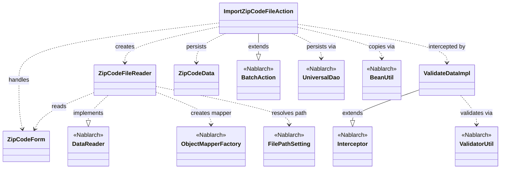
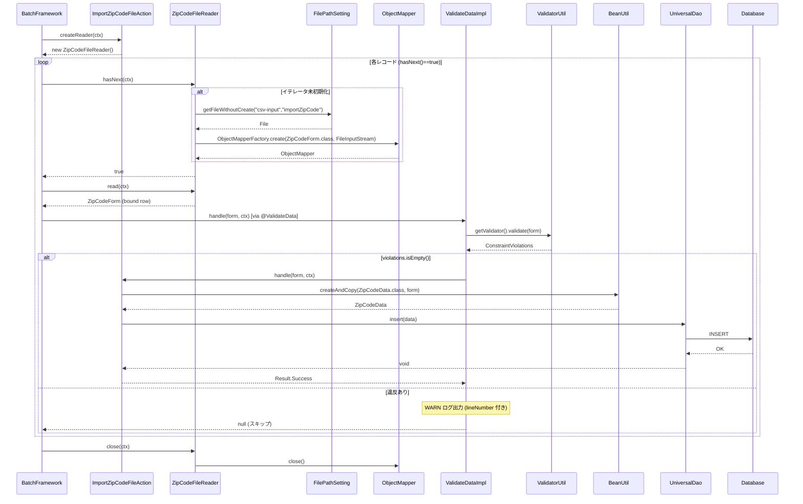

# Code Analysis: ImportZipCodeFileAction

**Generated**: 2026-04-24 17:28:03
**Target**: 住所ファイル（CSV）をDBに登録するバッチアクション
**Modules**: nablarch-example-batch
**Analysis Duration**: approx. 2m 22s

---

## Overview

`ImportZipCodeFileAction` は、Nablarch の `BatchAction` を継承した業務アクションクラスで、日本郵便が提供する住所ファイル（CSV）を1行ずつ読み込み、データベースの住所エンティティテーブルに登録するバッチ処理を実装している。データリーダ(`ZipCodeFileReader`) が CSV ファイルを `ZipCodeForm` にバインドして行単位で渡し、`@ValidateData` インターセプタによる Bean Validation を経由した後、`UniversalDao#insert` で DB に登録する、Nablarch の典型的な「ファイル to DB」バッチパターンである。

---

## Architecture

### Dependency Graph



**Note**: This diagram uses Mermaid `classDiagram` syntax to show class names and their relationships. Use `--|>` for inheritance (extends/implements) and `..>` for dependencies (uses/creates).

### Component Summary

| Component | Role | Type | Dependencies |
|-----------|------|------|--------------|
| ImportZipCodeFileAction | 住所ファイル登録バッチアクション | Action (BatchAction) | ZipCodeForm, ZipCodeFileReader, ZipCodeData, UniversalDao, BeanUtil, ValidateData |
| ZipCodeForm | 住所1行分をバインドする CSV フォーム | Form (Bean) | Bean Validation アノテーション (@Domain, @Required) |
| ZipCodeFileReader | 住所 CSV ファイルを1行ずつ読むデータリーダ | DataReader | ObjectMapperFactory, FilePathSetting, ObjectMapperIterator |
| ValidateData (ValidateDataImpl) | Bean Validation を共通化するインターセプタ | Interceptor | ValidatorUtil, BeanUtil, MessageUtil, Logger |
| ZipCodeData | DB 登録用の住所エンティティ | Entity | なし |

---

## Flow

### Processing Flow

Nablarch のバッチフレームワークは、`BatchAction#createReader` で取得した `DataReader` から `read()` で1件データを取り出し、`handle()` を1件ずつ呼び出すループを制御する。本アクションでは以下の順序で処理が進む。

1. フレームワークが `createReader(ctx)` を呼び、`ZipCodeFileReader` を取得する。
2. `ZipCodeFileReader#hasNext` 初回呼び出し時に `initialize()` が走り、`FilePathSetting#getFileWithoutCreate("csv-input", "importZipCode")` で住所ファイルを解決し、`ObjectMapperFactory.create(ZipCodeForm.class, FileInputStream)` からイテレータを生成する。
3. 各行について `read()` が呼ばれ、CSV の1行が `ZipCodeForm` にバインドされて返る。`@LineNumber` 付き getter により行番号も自動設定される。
4. フレームワークは `ImportZipCodeFileAction#handle(inputData, ctx)` を呼び出すが、メソッドに付与された `@ValidateData` により `ValidateDataImpl#handle` が先に実行される。ここで `ValidatorUtil.getValidator().validate(data)` により Bean Validation を実施し、違反があれば `lineNumber` とともに WARN ログを出力して後続処理を中止する（`null` を返す）。
5. バリデーション成功時のみ、元の `ImportZipCodeFileAction#handle` が実行され、`BeanUtil.createAndCopy(ZipCodeData.class, inputData)` で DTO から Entity へコピーし、`UniversalDao.insert(data)` で DB に登録して `Result.Success` を返す。
6. 全行処理後、フレームワークが `close(ctx)` を呼び、`ObjectMapperIterator#close()` 経由でストリームが閉じられる。

### Sequence Diagram



---

## Components

### ImportZipCodeFileAction

**File**: [ImportZipCodeFileAction.java](../../.lw/nab-official/v6/nablarch-example-batch/src/main/java/com/nablarch/example/app/batch/action/ImportZipCodeFileAction.java)

**Role**: 住所 CSV をレコード単位で受け取り DB に登録するバッチ業務アクション。`BatchAction<ZipCodeForm>` を継承。

**Key methods**:
- `handle(ZipCodeForm inputData, ExecutionContext ctx)` (L36-42): 1行分の登録処理。`@ValidateData` でバリデーション後、`BeanUtil.createAndCopy` で Entity に詰め替え `UniversalDao.insert` で登録。`Result.Success` を返却。
- `createReader(ExecutionContext ctx)` (L50-53): `ZipCodeFileReader` を生成して返却。フレームワークから初回のみ呼ばれる。

**Dependencies**: `ZipCodeForm`, `ZipCodeFileReader`, `ZipCodeData`, `UniversalDao`, `BeanUtil`, `@ValidateData`。

### ZipCodeForm

**File**: [ZipCodeForm.java](../../.lw/nab-official/v6/nablarch-example-batch/src/main/java/com/nablarch/example/app/batch/form/ZipCodeForm.java)

**Role**: 日本郵便住所 CSV の1レコードをバインドする Bean。`@Csv` と `@CsvFormat` でフォーマットを宣言し、`@Domain` + `@Required` で Bean Validation ルールを付与。`@LineNumber` 付き `getLineNumber()` により処理行番号を自動保持する。

**Key fields**: `localGovernmentCode`, `zipCode5digit`, `zipCode7digit`, `prefectureKana/Kanji`, `cityKana/Kanji`, `addressKana/Kanji`, `multipleZipCodes`, `numberedEveryKoaza`, `addressWithChome`, `multipleAddress`, `updateData`, `updateDataReason`, `lineNumber`。

### ZipCodeFileReader

**File**: [ZipCodeFileReader.java](../../.lw/nab-official/v6/nablarch-example-batch/src/main/java/com/nablarch/example/app/batch/reader/ZipCodeFileReader.java)

**Role**: 住所 CSV を逐次読むデータリーダ。`DataReader<ZipCodeForm>` を実装し、内部で `ObjectMapperIterator` をラップして `hasNext`/`next`/`close` を提供する。

**Key methods**:
- `read(ExecutionContext ctx)` (L34-40): 未初期化なら `initialize()` 後、イテレータから1件返す。
- `hasNext(ExecutionContext ctx)` (L48-54): 未初期化なら `initialize()` 後、次行有無を返す。
- `close(ExecutionContext ctx)` (L62-64): `ObjectMapperIterator#close` でストリーム解放。
- `initialize()` (L71-82): `FilePathSetting.getInstance().getFileWithoutCreate("csv-input", "importZipCode")` でファイル解決、`ObjectMapperFactory.create(ZipCodeForm.class, FileInputStream)` から `ObjectMapperIterator` を生成。`FileNotFoundException` は `IllegalStateException` にラップ。

### ValidateData (Interceptor)

**File**: [ValidateData.java](../../.lw/nab-official/v6/nablarch-example-batch/src/main/java/com/nablarch/example/app/batch/interceptor/ValidateData.java)

**Role**: ハンドラの入力データに対して Bean Validation を実施するメソッド単位インターセプタ。`@Interceptor(ValidateData.ValidateDataImpl.class)` で実装クラスを紐付け。

**Key methods**:
- `ValidateDataImpl#handle(Object data, ExecutionContext context)`: `ValidatorUtil.getValidator().validate(data)` で検証し、違反なしなら `getOriginalHandler().handle(data, context)` へ委譲。違反がある場合は `BeanUtil.getProperty(data, "lineNumber")` で行番号を取り出し、`MessageUtil.createMessage(MessageLevel.WARN, "invalid_data_record", ...)` で WARN ログを出して `null` を返し後続処理を抑止する。

### ZipCodeData (参考)

**Role**: DB 登録用のエンティティ。`ImportZipCodeFileAction#handle` で `BeanUtil.createAndCopy` により `ZipCodeForm` からコピーされ、`UniversalDao.insert` に渡される。本リポジトリには含まれないが `com.nablarch.example.app.entity.ZipCodeData` として定義。

---

## Nablarch Framework Usage

### BatchAction

**Class**: `nablarch.fw.action.BatchAction`

**Description**: Nablarch のバッチ処理における業務ハンドラの基底クラス。`DataReader` が返すレコード1件ごとに `handle` を呼ぶ、ループ制御付きのアクション基盤。

**Usage**:
```java
public class ImportZipCodeFileAction extends BatchAction<ZipCodeForm> {
    @Override
    public Result handle(ZipCodeForm inputData, ExecutionContext ctx) { ... }
    @Override
    public DataReader<ZipCodeForm> createReader(ExecutionContext ctx) {
        return new ZipCodeFileReader();
    }
}
```

**Important points**:
- ✅ **`createReader` と `handle` を必ず実装**: `createReader` で使用するデータリーダを返し、`handle` にレコード単位の業務処理を実装する。
- 🎯 **DB 登録型ファイル処理の標準パターン**: CSV/固定長ファイルを行単位で読み、Bean Validation → DB 登録という用途に最適。
- 💡 **ループ制御はフレームワーク側**: ハンドラ側でループや例外トランザクション境界を書く必要がなく、業務ロジックに集中できる。

**Usage in this code**: `ImportZipCodeFileAction` が直接継承。`handle` で `UniversalDao.insert`、`createReader` で `ZipCodeFileReader` を返す (L20, L37, L52)。

**Details**: [Nablarch Batch Getting Started](../../.claude/skills/nabledge-6/docs/processing-pattern/nablarch-batch/nablarch-batch-getting-started-nablarch-batch.md)

### DataReader / ObjectMapperFactory (データバインド)

**Class**: `nablarch.fw.DataReader` / `nablarch.common.databind.ObjectMapperFactory`

**Description**: `DataReader` はバッチでの逐次読込み IF。`ObjectMapperFactory.create(Class, InputStream)` で `@Csv`/`@CsvFormat` を持つ Bean に CSV を自動バインドする `ObjectMapper` を生成する。

**Usage**:
```java
ObjectMapper<ZipCodeForm> mapper = ObjectMapperFactory.create(
    ZipCodeForm.class, new FileInputStream(zipCodeFile));
```

**Important points**:
- ✅ **`hasNext`/`read`/`close` を実装**: `close` は必ずストリームを閉じる。本コードでは `ObjectMapperIterator` を介して委譲。
- 💡 **アノテーション駆動**: `@Csv(properties=..., type=CsvType.CUSTOM)` と `@CsvFormat(charset, fieldSeparator, lineSeparator, quote, emptyToNull, ...)` でフォーマットを宣言的に定義できる。
- 💡 **`@LineNumber`**: Bean の getter に付与すると、読み込んだ行番号が自動設定され、バリデーションエラー時の原因特定に役立つ。
- ⚠️ **ファイル未存在**: `ObjectMapperFactory.create(Class, InputStream)` に渡す `FileInputStream` が `FileNotFoundException` を投げ得るため、本コードでは `IllegalStateException` にラップしている。

**Usage in this code**: `ZipCodeFileReader#initialize` で `FilePathSetting` によりファイルを解決し、`ObjectMapperFactory.create` で `ObjectMapper` を生成、`ObjectMapperIterator` でラップ (L71-81)。

**Details**: [Libraries Data Bind](../../.claude/skills/nabledge-6/docs/component/libraries/libraries-data-bind.md)

### Bean Validation (@ValidateData + ValidatorUtil)

**Class**: `nablarch.core.validation.ee.ValidatorUtil` / `nablarch.fw.Interceptor`

**Description**: Jakarta Bean Validation を Nablarch バッチのハンドラ前段で実行する共通インターセプタ。`@Interceptor(ValidateData.ValidateDataImpl.class)` メタアノテーションで、`handle` メソッドをラップする。

**Usage**:
```java
@Override
@ValidateData
public Result handle(ZipCodeForm inputData, ExecutionContext ctx) { ... }
```

**Important points**:
- ✅ **バリデーション済みを前提にハンドラを書ける**: 違反がある行は WARN ログ出力後スキップされるため、`handle` 側では常に検証済みの入力を扱える。
- ✅ **`@Domain` + `@Required` で宣言**: `ZipCodeForm` のフィールドに `@Domain("zipCode")` などを付けるだけで検査ルールが適用される。
- 💡 **バッチ共通化**: Example アプリではインターセプタにすることで、バッチごとに同じ検証ロジックを書かずに済む。
- ⚠️ **エラー時の挙動**: `ValidateDataImpl#handle` は違反時 `null` を返し後続を実行しない。エラー件数の集計やリトライが必要なら拡張が必要。

**Usage in this code**: `ImportZipCodeFileAction#handle` に `@ValidateData` を付与 (L35)。実装側 `ValidateDataImpl#handle` で `ValidatorUtil.getValidator().validate(data)` を実行、違反時は `MessageUtil.createMessage(MessageLevel.WARN, "invalid_data_record", propertyPath, message, lineNumber)` をログ出力。

**Details**: [Libraries Bean Validation](../../.claude/skills/nabledge-6/docs/component/libraries/libraries-bean-validation.md)

### UniversalDao + BeanUtil

**Class**: `nablarch.common.dao.UniversalDao` / `nablarch.core.beans.BeanUtil`

**Description**: `UniversalDao` は Entity を CRUD する汎用 DAO（`insert`/`update`/`delete`/`findAll*` など）。`BeanUtil.createAndCopy` は2つの Bean 間でプロパティ名一致に基づきコピーするユーティリティ。

**Usage**:
```java
ZipCodeData data = BeanUtil.createAndCopy(ZipCodeData.class, inputData);
UniversalDao.insert(data);
```

**Important points**:
- ✅ **Entity を渡すだけで INSERT 可能**: `@Table`/`@Id` などの JPA 互換アノテーション付き Entity を `insert` に渡す。
- 💡 **Form → Entity 変換に `BeanUtil.createAndCopy`**: Form と Entity を別クラスにし、プロパティ名で機械的にコピーすることで層の責務分離を保てる。
- ⚠️ **トランザクション境界**: バッチでは `handler-queue` のトランザクションハンドラがコミット境界を管理する。`UniversalDao.insert` 自体はコミット/ロールバックを制御しない。

**Usage in this code**: `ImportZipCodeFileAction#handle` で `BeanUtil.createAndCopy(ZipCodeData.class, inputData)` → `UniversalDao.insert(data)` の2行で DB 登録を完結 (L39-40)。

**Details**: [Libraries Universal Dao](../../.claude/skills/nabledge-6/docs/component/libraries/libraries-universal-dao.md)

### FilePathSetting

**Class**: `nablarch.core.util.FilePathSetting`

**Description**: 論理名（例: `csv-input`）から物理ファイルパスを解決するコンポーネント。環境差分（開発／本番）をコンポーネント設定で吸収する。

**Usage**:
```java
File zipCodeFile = FilePathSetting.getInstance()
        .getFileWithoutCreate("csv-input", "importZipCode");
```

**Important points**:
- ✅ **`getFileWithoutCreate` は存在保証なし**: 返された `File` は存在しないことがあるため、呼出側で `FileNotFoundException` を適切に扱う。
- 💡 **設定ファイルで差し替え可能**: コンポーネント定義で `csv-input` のベースディレクトリを切り替えれば、コード変更なしで配置先を変えられる。

**Usage in this code**: `ZipCodeFileReader#initialize` で `csv-input` 論理名 + `importZipCode` ファイル名から住所 CSV を解決 (L72-73)。

**Details**: [Libraries Data Bind](../../.claude/skills/nabledge-6/docs/component/libraries/libraries-data-bind.md)

---

## References

### Source Files

- [ImportZipCodeFileAction.java (.lw/nab-official/v5/nablarch-example-batch/src/main/java/com/nablarch/example/app/batch/action)](../../.lw/nab-official/v5/nablarch-example-batch/src/main/java/com/nablarch/example/app/batch/action/ImportZipCodeFileAction.java) - ImportZipCodeFileAction
- [ImportZipCodeFileAction.java (.lw/nab-official/v6/nablarch-example-batch/src/main/java/com/nablarch/example/app/batch/action)](../../.lw/nab-official/v6/nablarch-example-batch/src/main/java/com/nablarch/example/app/batch/action/ImportZipCodeFileAction.java) - ImportZipCodeFileAction
- [ZipCodeForm.java (.lw/nab-official/v5/nablarch-example-batch/src/main/java/com/nablarch/example/app/batch/form)](../../.lw/nab-official/v5/nablarch-example-batch/src/main/java/com/nablarch/example/app/batch/form/ZipCodeForm.java) - ZipCodeForm
- [ZipCodeForm.java (.lw/nab-official/v6/nablarch-example-batch/src/main/java/com/nablarch/example/app/batch/form)](../../.lw/nab-official/v6/nablarch-example-batch/src/main/java/com/nablarch/example/app/batch/form/ZipCodeForm.java) - ZipCodeForm
- [ZipCodeFileReader.java (.lw/nab-official/v5/nablarch-example-batch/src/main/java/com/nablarch/example/app/batch/reader)](../../.lw/nab-official/v5/nablarch-example-batch/src/main/java/com/nablarch/example/app/batch/reader/ZipCodeFileReader.java) - ZipCodeFileReader
- [ZipCodeFileReader.java (.lw/nab-official/v6/nablarch-example-batch/src/main/java/com/nablarch/example/app/batch/reader)](../../.lw/nab-official/v6/nablarch-example-batch/src/main/java/com/nablarch/example/app/batch/reader/ZipCodeFileReader.java) - ZipCodeFileReader
- [ValidateData.java (.lw/nab-official/v5/nablarch-example-batch/src/main/java/com/nablarch/example/app/batch/interceptor)](../../.lw/nab-official/v5/nablarch-example-batch/src/main/java/com/nablarch/example/app/batch/interceptor/ValidateData.java) - ValidateData
- [ValidateData.java (.lw/nab-official/v6/nablarch-example-batch/src/main/java/com/nablarch/example/app/batch/interceptor)](../../.lw/nab-official/v6/nablarch-example-batch/src/main/java/com/nablarch/example/app/batch/interceptor/ValidateData.java) - ValidateData

### Knowledge Base (Nabledge-6)

- [Nablarch Batch Getting Started Nablarch Batch](../../.claude/skills/nabledge-6/docs/processing-pattern/nablarch-batch/nablarch-batch-getting-started-nablarch-batch.md)
- [Libraries Data Bind](../../.claude/skills/nabledge-6/docs/component/libraries/libraries-data-bind.md)
- [Libraries Bean Validation](../../.claude/skills/nabledge-6/docs/component/libraries/libraries-bean-validation.md)
- [Libraries Universal Dao](../../.claude/skills/nabledge-6/docs/component/libraries/libraries-universal-dao.md)

### Official Documentation

(No official documentation links available)

---

**Output**: `.nabledge/20260424/code-analysis-ImportZipCodeFileAction.md`

**Note**: This documentation was generated by the code-analysis workflow of the nabledge-6 skill.
