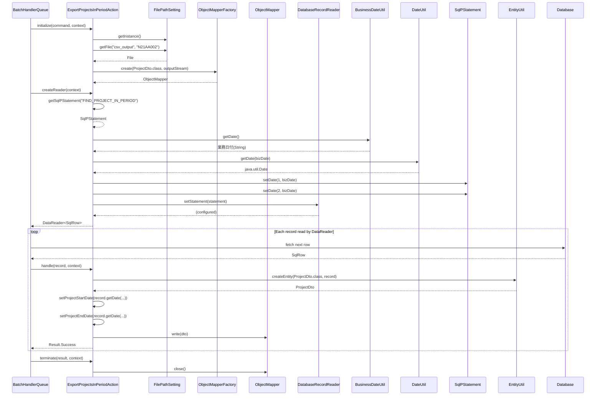

# Code Analysis: ExportProjectsInPeriodAction

**Generated**: 2026-04-24 17:45:05
**Target**: 期間内プロジェクト一覧をCSVファイルへ出力する都度起動バッチアクション
**Modules**: proman-batch
**Analysis Duration**: unknown

---

## Overview

`ExportProjectsInPeriodAction` は Nablarch バッチの `BatchAction<SqlRow>` を継承した都度起動バッチアクションで、業務日付時点で有効な期間内プロジェクトをデータベースから読み出し、CSVファイル (`N21AA002`) へ出力する。`initialize()` で `FilePathSetting` により出力ファイルを解決し、`ObjectMapperFactory` で CSV 書き込み用 `ObjectMapper<ProjectDto>` を生成する。`createReader()` では `DatabaseRecordReader` に業務日付を埋め込んだ `SqlPStatement` を設定して DataReader を返し、`handle()` で `SqlRow` を `ProjectDto` に詰め替えて `mapper.write(dto)` で 1 行ずつ CSV に書き出す。`terminate()` で `ObjectMapper#close()` によりリソース解放する。

---

## Architecture

### Dependency Graph

```mermaid
classDiagram
    class ExportProjectsInPeriodAction
    class ProjectDto
    class BatchAction {
        <<Nablarch>>
    }
    class DataReader {
        <<Nablarch>>
    }
    class DatabaseRecordReader {
        <<Nablarch>>
    }
    class SqlPStatement {
        <<Nablarch>>
    }
    class SqlRow {
        <<Nablarch>>
    }
    class ObjectMapper {
        <<Nablarch>>
    }
    class ObjectMapperFactory {
        <<Nablarch>>
    }
    class FilePathSetting {
        <<Nablarch>>
    }
    class BusinessDateUtil {
        <<Nablarch>>
    }
    class DateUtil {
        <<Nablarch>>
    }
    class EntityUtil {
        <<Nablarch>>
    }
    class ExecutionContext {
        <<Nablarch>>
    }
    class CommandLine {
        <<Nablarch>>
    }
    class Result {
        <<Nablarch>>
    }

    ExportProjectsInPeriodAction --|> BatchAction : extends
    ExportProjectsInPeriodAction ..> ProjectDto : serializes
    ExportProjectsInPeriodAction ..> FilePathSetting : resolves output path
    ExportProjectsInPeriodAction ..> ObjectMapperFactory : creates mapper
    ExportProjectsInPeriodAction ..> ObjectMapper : writes CSV
    ExportProjectsInPeriodAction ..> DatabaseRecordReader : creates reader
    ExportProjectsInPeriodAction ..> SqlPStatement : configures query
    ExportProjectsInPeriodAction ..> SqlRow : consumes row
    ExportProjectsInPeriodAction ..> BusinessDateUtil : queries business date
    ExportProjectsInPeriodAction ..> DateUtil : parses date
    ExportProjectsInPeriodAction ..> EntityUtil : maps SqlRow to Dto
    ExportProjectsInPeriodAction ..> ExecutionContext : receives context
    ExportProjectsInPeriodAction ..> CommandLine : receives args
    ExportProjectsInPeriodAction ..> Result : returns Success
    DatabaseRecordReader ..|> DataReader : implements
```



**Note**: This diagram uses Mermaid `classDiagram` syntax to show class names and their relationships. Use `--|>` for inheritance (extends/implements) and `..>` for dependencies (uses/creates).

### Component Summary

| Component | Role | Type | Dependencies |
|-----------|------|------|--------------|
| ExportProjectsInPeriodAction | 期間内プロジェクト一覧CSV出力バッチアクション | Action (BatchAction) | ProjectDto, FilePathSetting, ObjectMapper, DatabaseRecordReader, SqlPStatement, BusinessDateUtil, DateUtil, EntityUtil |
| ProjectDto | CSV出力用Bean (13カラム定義) | DTO (Bean) | Csv/CsvFormat アノテーション, DateUtil |

---

## Flow

### Processing Flow

都度起動バッチのテンプレートメソッド呼び出し順序に従って処理する。

1. `initialize(CommandLine, ExecutionContext)` (L45-54): `FilePathSetting.getInstance()` で論理名 `csv_output` と物理ファイル名 `N21AA002` からCSV出力ファイルを解決し、`FileOutputStream` を生成する。`ObjectMapperFactory.create(ProjectDto.class, outputStream)` で書き込み用 `ObjectMapper` を生成してフィールドに保持する。`FileNotFoundException` は `IllegalStateException` にラップして送出する。
2. `createReader(ExecutionContext)` (L57-65): `DatabaseRecordReader` を生成し、`getSqlPStatement("FIND_PROJECT_IN_PERIOD")` でSQLファイルから検索SQLを取得する。`BusinessDateUtil.getDate()` で業務日付を取得し、`DateUtil.getDate()` で `java.util.Date` へ変換、さらに `java.sql.Date` へ変換してSQLのパラメータ1,2(プロジェクト開始日・終了日の範囲)にバインドする。`DataReader<SqlRow>` として返却。
3. `handle(SqlRow record, ExecutionContext)` (L68-75): フレームワークが読み込んだ1件の `SqlRow` を `EntityUtil.createEntity(ProjectDto.class, record)` で `ProjectDto` に変換。型が `SqlRow` と `ProjectDto` (Date→String) で合わないプロジェクト開始日・終了日は `record.getDate()` で取得し `dto.setProjectStartDate` / `setProjectEndDate` を明示的に呼び出して `DateUtil.formatDate(date,"yyyy/MM/dd")` 形式で整形する。`mapper.write(dto)` でCSVへ1行書き込み、`Result.Success` を返す。
4. `terminate(Result, ExecutionContext)` (L78-81): `mapper.close()` によりバッファをフラッシュし、出力ストリームを解放する。

### Sequence Diagram



---

## Components

### ExportProjectsInPeriodAction

**Role**: `BatchAction<SqlRow>` を継承した都度起動バッチアクション。データベース検索結果をCSVファイルへ出力する。

**File**: [ExportProjectsInPeriodAction.java](../../.lw/nab-official/v6/nablarch-system-development-guide/Sample_Project/Source_Code/proman-project/proman-batch/src/main/java/com/nablarch/example/proman/batch/project/ExportProjectsInPeriodAction.java)

**Key methods**:
- `initialize(CommandLine, ExecutionContext)` ([L45-54](../../.lw/nab-official/v6/nablarch-system-development-guide/Sample_Project/Source_Code/proman-project/proman-batch/src/main/java/com/nablarch/example/proman/batch/project/ExportProjectsInPeriodAction.java#L45-L54)): 出力ファイル生成と `ObjectMapper` 初期化。
- `createReader(ExecutionContext)` ([L57-65](../../.lw/nab-official/v6/nablarch-system-development-guide/Sample_Project/Source_Code/proman-project/proman-batch/src/main/java/com/nablarch/example/proman/batch/project/ExportProjectsInPeriodAction.java#L57-L65)): 業務日付を条件にセットした `DatabaseRecordReader` を生成。
- `handle(SqlRow, ExecutionContext)` ([L68-75](../../.lw/nab-official/v6/nablarch-system-development-guide/Sample_Project/Source_Code/proman-project/proman-batch/src/main/java/com/nablarch/example/proman/batch/project/ExportProjectsInPeriodAction.java#L68-L75)): 1レコードを `ProjectDto` に変換しCSV書き込み。
- `terminate(Result, ExecutionContext)` ([L78-81](../../.lw/nab-official/v6/nablarch-system-development-guide/Sample_Project/Source_Code/proman-project/proman-batch/src/main/java/com/nablarch/example/proman/batch/project/ExportProjectsInPeriodAction.java#L78-L81)): `ObjectMapper#close()` によりリソース解放。

**Dependencies**: ProjectDto (CSV 書き込み対象Bean), FilePathSetting (出力パス解決), ObjectMapper/ObjectMapperFactory (CSV 書き込み), DatabaseRecordReader (データリーダ), SqlPStatement/SqlRow (DB アクセス), BusinessDateUtil/DateUtil (業務日付取得), EntityUtil (SqlRow→Bean 変換)。

### ProjectDto

**Role**: CSV出力1行分のデータを保持するBean。`@Csv` と `@CsvFormat` アノテーションでCSVフォーマットを定義する。

**File**: [ProjectDto.java](../../.lw/nab-official/v6/nablarch-system-development-guide/Sample_Project/Source_Code/proman-project/proman-batch/src/main/java/com/nablarch/example/proman/batch/project/ProjectDto.java)

**Key definitions**:
- `@Csv(type=CUSTOM, properties=..., headers=...)` ([L16-20](../../.lw/nab-official/v6/nablarch-system-development-guide/Sample_Project/Source_Code/proman-project/proman-batch/src/main/java/com/nablarch/example/proman/batch/project/ProjectDto.java#L16-L20)): 13プロパティ(projectId〜versionNo)と日本語ヘッダをマッピング。
- `@CsvFormat(...)` ([L21-22](../../.lw/nab-official/v6/nablarch-system-development-guide/Sample_Project/Source_Code/proman-project/proman-batch/src/main/java/com/nablarch/example/proman/batch/project/ProjectDto.java#L21-L22)): 区切り文字 `,`、改行 `\r\n`、クォート `"`、UTF-8、全項目クォート(`QuoteMode.ALL`)。
- `setProjectStartDate(Date)` / `setProjectEndDate(Date)`: `DateUtil.formatDate(date,"yyyy/MM/dd")` で日付を整形してString保持。

**Dependencies**: `@Csv`, `@CsvFormat`, `CsvDataBindConfig.QuoteMode`, `DateUtil` (日付フォーマット)。

---

## Nablarch Framework Usage

### BatchAction

**Class**: `nablarch.fw.action.BatchAction<TData>`

**Description**: 汎用的なバッチアクションのテンプレートクラス。`createReader()` でデータリーダを提供し、`handle()` で1レコードごとの業務処理を記述する。`initialize()` / `terminate()` で初期化・終了処理を定義できる。

**Usage**:
```java
public class ExportProjectsInPeriodAction extends BatchAction<SqlRow> {
    @Override
    protected void initialize(CommandLine command, ExecutionContext context) { ... }
    @Override
    public DataReader<SqlRow> createReader(ExecutionContext context) { ... }
    @Override
    public Result handle(SqlRow record, ExecutionContext context) { ... }
    @Override
    protected void terminate(Result result, ExecutionContext context) { ... }
}
```

**Important points**:
- ✅ **`createReader()` 実装必須**: 使用するデータリーダのインスタンスを返却する。
- ✅ **`handle()` 実装必須**: データリーダから渡された1件のデータに対する処理を実装する。
- 🎯 **データへのアクセスにデータバインドを使用する場合**: `FileBatchAction` は汎用データフォーマット前提のため、`BatchAction` を使用する (`nablarch-batch-architecture` より)。

**Usage in this code**: `extends BatchAction<SqlRow>` (L31) で宣言し、4メソッドをオーバーライド。

**Details**: [Nablarch Batch Architecture](../../.claude/skills/nabledge-6/docs/processing-pattern/nablarch-batch/nablarch-batch-architecture.md), [Nablarch Batch Getting Started](../../.claude/skills/nabledge-6/docs/processing-pattern/nablarch-batch/nablarch-batch-getting-started-nablarch-batch.md)

### DatabaseRecordReader

**Class**: `nablarch.fw.reader.DatabaseRecordReader`

**Description**: データベース読み込み用の標準 `DataReader`。`SqlPStatement` を設定すると検索結果を1件ずつ `SqlRow` として `handle()` へ渡す。

**Usage**:
```java
DatabaseRecordReader reader = new DatabaseRecordReader();
SqlPStatement statement = getSqlPStatement("FIND_PROJECT_IN_PERIOD");
statement.setDate(1, bizDate);
statement.setDate(2, bizDate);
reader.setStatement(statement);
return reader;
```

**Important points**:
- ✅ **`setStatement()` で SQL 設定**: 検索SQLのパラメータを事前にバインドしてから渡す。
- 💡 **DB 読み込みの標準リーダ**: Nablarchが標準提供するDataReaderの一つ。カスタム `DataReader` 実装が不要な場合に利用する。
- 🎯 **ファイル読み込み・レジューム読み込み**: `FileDataReader`, `ValidatableFileDataReader`, `ResumeDataReader` が別途提供されている。

**Usage in this code**: `createReader()` (L58-64) で `DatabaseRecordReader` を生成し、業務日付パラメータを設定したSQLをセットして返却。

**Details**: [Nablarch Batch Architecture](../../.claude/skills/nabledge-6/docs/processing-pattern/nablarch-batch/nablarch-batch-architecture.md)

### ObjectMapper / ObjectMapperFactory

**Class**: `nablarch.common.databind.ObjectMapper`, `nablarch.common.databind.ObjectMapperFactory`

**Description**: CSV・固定長・TSVなどのデータファイルとJava Beansを相互変換するマッパー。`ObjectMapperFactory#create` で生成し、書き込みは `write()`、読み込みは `read()` を使用する。Beanに付与した `@Csv` / `@CsvFormat` アノテーションによりフォーマットが決まる。

**Usage**:
```java
FileOutputStream outputStream = new FileOutputStream(output);
this.mapper = ObjectMapperFactory.create(ProjectDto.class, outputStream);
// ...
mapper.write(dto);
// ...
mapper.close();
```

**Important points**:
- ✅ **`close()` 必須**: バッファをフラッシュしリソースを解放する。未呼び出しではデータ欠落リスクがある。
- 💡 **アノテーション駆動**: `@Csv` / `@CsvFormat` でフォーマットを宣言的に定義できる。
- ⚠️ **大量データ対応**: 全データをメモリ展開せず1行ずつストリーム書き込みするため、大量データでも安全。
- 🎯 **try-with-resources 利用可**: 本コードは `initialize()` / `terminate()` 分離のためフィールド保持しているが、クローズ忘れを防ぐ定石は try-with-resources。

**Usage in this code**: `initialize()` (L50) で `ObjectMapperFactory.create(ProjectDto.class, outputStream)` により生成、`handle()` (L73) で `mapper.write(dto)` により各行を書き出し、`terminate()` (L80) で `mapper.close()` によりリソース解放。

**Details**: [Libraries Data Bind](../../.claude/skills/nabledge-6/docs/component/libraries/libraries-data-bind.md)

### FilePathSetting

**Class**: `nablarch.core.util.FilePathSetting`

**Description**: 論理ファイル名と物理パスのマッピングを一元管理するコンポーネント。環境ごとに異なるファイルパスを論理名で参照できる。

**Usage**:
```java
FilePathSetting filePathSetting = FilePathSetting.getInstance();
File output = filePathSetting.getFile("csv_output", OUTPUT_FILE_NAME);
```

**Important points**:
- ✅ **`getInstance()` でシングルトン取得**: 都度 `new` せず、シングルトンを取得する。
- 💡 **環境依存の排除**: 物理パスを業務コードから排除し、設定ファイルで切り替え可能にする。
- 🎯 **論理名とファイル名を分離**: 第1引数が論理ベースディレクトリ名、第2引数が拡張子を除くファイル名。

**Usage in this code**: `initialize()` (L46-48) で `csv_output` 配下の `N21AA002` を取得。

**Details**: [Libraries File Path Management](../../.claude/skills/nabledge-6/docs/component/libraries/libraries-file-path-management.md)

### BusinessDateUtil / DateUtil

**Class**: `nablarch.core.date.BusinessDateUtil`, `nablarch.core.util.DateUtil`

**Description**: `BusinessDateUtil` はシステム全体の業務日付(`BasicBusinessDateProvider` で管理)を `yyyyMMdd` 文字列で取得するユーティリティ。`DateUtil` は日付文字列とJava `Date` の相互変換ユーティリティ。

**Usage**:
```java
Date bizDate = new Date(DateUtil.getDate(BusinessDateUtil.getDate()).getTime());
statement.setDate(1, bizDate);
```

**Important points**:
- ✅ **業務日付は `BusinessDateUtil`**: システム日付 (`new Date()`) でなく、業務日付を使って再実行時の一貫性を担保する。
- 💡 **障害再実行時の過去日付指定**: `-DBasicBusinessDateProvider.<区分>=yyyyMMdd` で業務日付を上書きしてバッチを再実行できる。
- 🎯 **DB設計**: `BasicBusinessDateProvider` をコンポーネント定義し、業務日付テーブルをセットアップする必要がある。

**Usage in this code**: `createReader()` (L60) で業務日付を取得し、開始日/終了日の検索パラメータ2つにバインド。

**Details**: [Libraries Date](../../.claude/skills/nabledge-6/docs/component/libraries/libraries-date.md)

### SqlPStatement (getSqlPStatement)

**Class**: `nablarch.core.db.statement.SqlPStatement`, `BatchAction#getSqlPStatement(String)`

**Description**: SQLファイル(`<ActionClass>.sql`)に定義されたSQL ID から `SqlPStatement` を取得するヘルパー。`?` プレースホルダを `setDate` / `setString` 等でバインドし実行する。

**Usage**:
```java
SqlPStatement statement = getSqlPStatement("FIND_PROJECT_IN_PERIOD");
statement.setDate(1, bizDate);
statement.setDate(2, bizDate);
```

**Important points**:
- ✅ **SQLはファイル管理**: SQLをクラス名と同じ名前の `.sql` ファイルにIDで定義し、保守性を高める。
- ⚠️ **バインドパラメータ位置指定**: `setDate(index, ...)` は 1 から始まる。
- 🎯 **`SqlRow` で取得**: 検索結果は `SqlRow` として取得し、`getString/getDate` 等で列値を読み出す。

**Usage in this code**: `createReader()` (L59) で `FIND_PROJECT_IN_PERIOD` SQLを取得し、業務日付を2箇所にバインド。

**Details**: [Libraries Database](../../.claude/skills/nabledge-6/docs/component/libraries/libraries-database.md)

### EntityUtil

**Class**: `nablarch.common.dao.EntityUtil`

**Description**: データベースから取得した `SqlRow` をエンティティ/DTOのBeanに変換するユーティリティ。カラム名→プロパティ名へ自動マッピングする。

**Usage**:
```java
ProjectDto dto = EntityUtil.createEntity(ProjectDto.class, record);
```

**Important points**:
- ✅ **自動マッピング**: `SqlRow` のカラム名(スネークケース)を Bean のプロパティ名(キャメルケース)へ自動変換してコピーする。
- ⚠️ **型不一致は手動設定**: Bean プロパティの型と SqlRow の型が合わない場合、明示的な setter 呼び出しが必要。
- 🎯 **定型的な詰め替えコード削減**: 手書きのプロパティコピーを排除できる。

**Usage in this code**: `handle()` (L70) で `SqlRow` を `ProjectDto` へ変換。`PROJECT_START_DATE` / `PROJECT_END_DATE` は Bean 側が `String` プロパティで型が異なるため、`setProjectStartDate` / `setProjectEndDate` を明示的に呼び出している(L72-73)。

**Details**: [Libraries Database](../../.claude/skills/nabledge-6/docs/component/libraries/libraries-database.md)

---

## References

### Source Files

- [ExportProjectsInPeriodAction.java (.lw/nab-official/v5/nablarch-system-development-guide/en/Sample_Project/Source_Code/proman-project/proman-batch/src/main/java/com/nablarch/example/proman/batch/project)](../../.lw/nab-official/v5/nablarch-system-development-guide/en/Sample_Project/Source_Code/proman-project/proman-batch/src/main/java/com/nablarch/example/proman/batch/project/ExportProjectsInPeriodAction.java) - ExportProjectsInPeriodAction
- [ExportProjectsInPeriodAction.java (.lw/nab-official/v5/nablarch-system-development-guide/Sample_Project/Source_Code/proman-project/proman-batch/src/main/java/com/nablarch/example/proman/batch/project)](../../.lw/nab-official/v5/nablarch-system-development-guide/Sample_Project/Source_Code/proman-project/proman-batch/src/main/java/com/nablarch/example/proman/batch/project/ExportProjectsInPeriodAction.java) - ExportProjectsInPeriodAction
- [ExportProjectsInPeriodAction.java (.lw/nab-official/v6/nablarch-system-development-guide/en/Sample_Project/Source_Code/proman-project/proman-batch/src/main/java/com/nablarch/example/proman/batch/project)](../../.lw/nab-official/v6/nablarch-system-development-guide/en/Sample_Project/Source_Code/proman-project/proman-batch/src/main/java/com/nablarch/example/proman/batch/project/ExportProjectsInPeriodAction.java) - ExportProjectsInPeriodAction
- [ExportProjectsInPeriodAction.java (.lw/nab-official/v6/nablarch-system-development-guide/Sample_Project/Source_Code/proman-project/proman-batch/src/main/java/com/nablarch/example/proman/batch/project)](../../.lw/nab-official/v6/nablarch-system-development-guide/Sample_Project/Source_Code/proman-project/proman-batch/src/main/java/com/nablarch/example/proman/batch/project/ExportProjectsInPeriodAction.java) - ExportProjectsInPeriodAction
- [ProjectDto.java (.lw/nab-official/v5/nablarch-system-development-guide/en/Sample_Project/Source_Code/proman-project/proman-batch/src/main/java/com/nablarch/example/proman/batch/project)](../../.lw/nab-official/v5/nablarch-system-development-guide/en/Sample_Project/Source_Code/proman-project/proman-batch/src/main/java/com/nablarch/example/proman/batch/project/ProjectDto.java) - ProjectDto
- [ProjectDto.java (.lw/nab-official/v5/nablarch-system-development-guide/Sample_Project/Source_Code/proman-project/proman-batch/src/main/java/com/nablarch/example/proman/batch/project)](../../.lw/nab-official/v5/nablarch-system-development-guide/Sample_Project/Source_Code/proman-project/proman-batch/src/main/java/com/nablarch/example/proman/batch/project/ProjectDto.java) - ProjectDto
- [ProjectDto.java (.lw/nab-official/v5/nablarch-example-web/src/main/java/com/nablarch/example/app/web/dto)](../../.lw/nab-official/v5/nablarch-example-web/src/main/java/com/nablarch/example/app/web/dto/ProjectDto.java) - ProjectDto
- [ProjectDto.java (.lw/nab-official/v6/nablarch-system-development-guide/en/Sample_Project/Source_Code/proman-project/proman-batch/src/main/java/com/nablarch/example/proman/batch/project)](../../.lw/nab-official/v6/nablarch-system-development-guide/en/Sample_Project/Source_Code/proman-project/proman-batch/src/main/java/com/nablarch/example/proman/batch/project/ProjectDto.java) - ProjectDto
- [ProjectDto.java (.lw/nab-official/v6/nablarch-system-development-guide/Sample_Project/Source_Code/proman-project/proman-batch/src/main/java/com/nablarch/example/proman/batch/project)](../../.lw/nab-official/v6/nablarch-system-development-guide/Sample_Project/Source_Code/proman-project/proman-batch/src/main/java/com/nablarch/example/proman/batch/project/ProjectDto.java) - ProjectDto
- [ProjectDto.java (.lw/nab-official/v6/nablarch-example-web/src/main/java/com/nablarch/example/app/web/dto)](../../.lw/nab-official/v6/nablarch-example-web/src/main/java/com/nablarch/example/app/web/dto/ProjectDto.java) - ProjectDto

### Knowledge Base (Nabledge-6)

- [Nablarch Batch Getting Started Nablarch Batch](../../.claude/skills/nabledge-6/docs/processing-pattern/nablarch-batch/nablarch-batch-getting-started-nablarch-batch.md)
- [Nablarch Batch Architecture](../../.claude/skills/nabledge-6/docs/processing-pattern/nablarch-batch/nablarch-batch-architecture.md)
- [Libraries Data Bind](../../.claude/skills/nabledge-6/docs/component/libraries/libraries-data-bind.md)
- [Libraries File Path Management](../../.claude/skills/nabledge-6/docs/component/libraries/libraries-file-path-management.md)
- [Libraries Date](../../.claude/skills/nabledge-6/docs/component/libraries/libraries-date.md)
- [Libraries Database](../../.claude/skills/nabledge-6/docs/component/libraries/libraries-database.md)

### Official Documentation

(No official documentation links available)

---

**Output**: `.nabledge/20260424/code-analysis-ExportProjectsInPeriodAction.md`

**Note**: This documentation was generated by the code-analysis workflow of the nabledge-6 skill.
