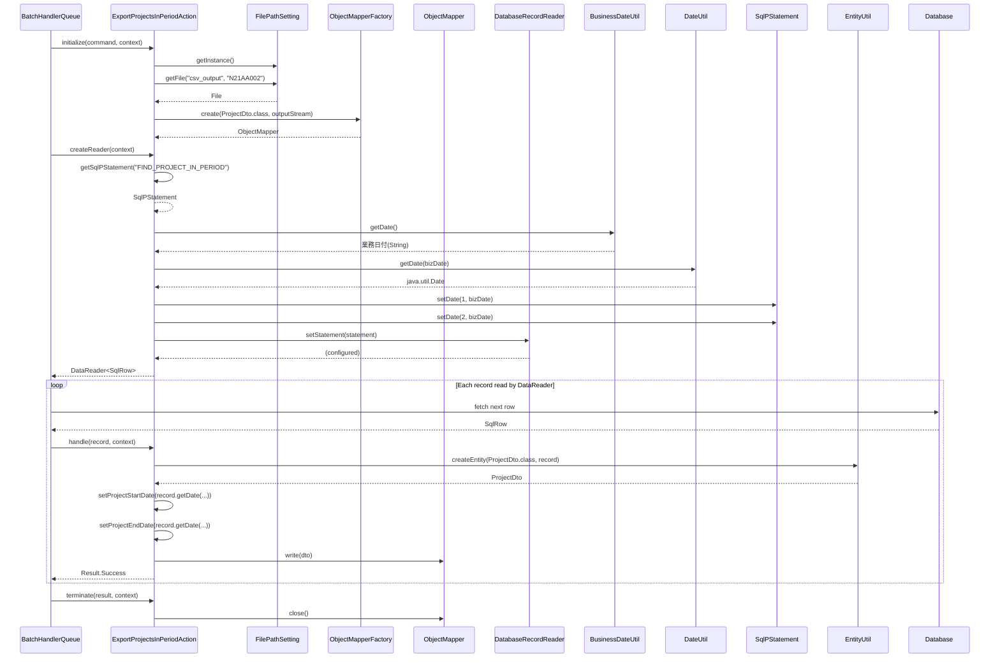

# Code Analysis: ExportProjectsInPeriodAction

**Generated**: 2026-04-24 17:45:05
**Target**: 期間内プロジェクト一覧をCSVファイルへ出力する都度起動バッチアクション
**Modules**: proman-batch
**Analysis Duration**: unknown

---

## Overview

`ExportProjectsInPeriodAction` は Nablarch バッチの `BatchAction<SqlRow>` を継承した都度起動バッチアクションで、業務日付時点で有効な期間内プロジェクトをデータベースから読み出し、CSVファイル (`N21AA002`) へ出力する。`initialize()` で `FilePathSetting` により出力ファイルを解決し、`ObjectMapperFactory` で CSV 書き込み用 `ObjectMapper<ProjectDto>` を生成する。`createReader()` では `DatabaseRecordReader` に業務日付を埋め込んだ `SqlPStatement` を設定して DataReader を返し、`handle()` で `SqlRow` を `ProjectDto` に詰め替えて `mapper.write(dto)` で 1 行ずつ CSV に書き出す。`terminate()` で `ObjectMapper#close()` によりリソース解放する。

---

## Architecture

### Dependency Graph

```mermaid
classDiagram
    class ExportProjectsInPeriodAction
    class ProjectDto
    class BatchAction {
        <<Nablarch>>
    }
    class DataReader {
        <<Nablarch>>
    }
    class DatabaseRecordReader {
        <<Nablarch>>
    }
    class SqlPStatement {
        <<Nablarch>>
    }
    class SqlRow {
        <<Nablarch>>
    }
    class ObjectMapper {
        <<Nablarch>>
    }
    class ObjectMapperFactory {
        <<Nablarch>>
    }
    class FilePathSetting {
        <<Nablarch>>
    }
    class BusinessDateUtil {
        <<Nablarch>>
    }
    class DateUtil {
        <<Nablarch>>
    }
    class EntityUtil {
        <<Nablarch>>
    }
    class ExecutionContext {
        <<Nablarch>>
    }
    class CommandLine {
        <<Nablarch>>
    }
    class Result {
        <<Nablarch>>
    }

    ExportProjectsInPeriodAction --|> BatchAction : extends
    ExportProjectsInPeriodAction ..> ProjectDto : serializes
    ExportProjectsInPeriodAction ..> FilePathSetting : resolves output path
    ExportProjectsInPeriodAction ..> ObjectMapperFactory : creates mapper
    ExportProjectsInPeriodAction ..> ObjectMapper : writes CSV
    ExportProjectsInPeriodAction ..> DatabaseRecordReader : creates reader
    ExportProjectsInPeriodAction ..> SqlPStatement : configures query
    ExportProjectsInPeriodAction ..> SqlRow : consumes row
    ExportProjectsInPeriodAction ..> BusinessDateUtil : queries business date
    ExportProjectsInPeriodAction ..> DateUtil : parses date
    ExportProjectsInPeriodAction ..> EntityUtil : maps SqlRow to Dto
    ExportProjectsInPeriodAction ..> ExecutionContext : receives context
    ExportProjectsInPeriodAction ..> CommandLine : receives args
    ExportProjectsInPeriodAction ..> Result : returns Success
    DatabaseRecordReader ..|> DataReader : implements
```

### Component Summary

| Component | Role | Type | Dependencies |
|-----------|------|------|--------------|
| ExportProjectsInPeriodAction | 期間内プロジェクト一覧CSV出力バッチアクション | Action (BatchAction) | ProjectDto, FilePathSetting, ObjectMapper, DatabaseRecordReader, SqlPStatement, BusinessDateUtil, DateUtil, EntityUtil |
| ProjectDto | CSV出力用Bean (13カラム定義) | DTO (Bean) | Csv/CsvFormat アノテーション, DateUtil |

---

## Flow

### Processing Flow

都度起動バッチのテンプレートメソッド呼び出し順序に従って処理する。

1. `initialize(CommandLine, ExecutionContext)` (L45-54): `FilePathSetting.getInstance()` で論理名 `csv_output` と物理ファイル名 `N21AA002` からCSV出力ファイルを解決し、`FileOutputStream` を生成する。`ObjectMapperFactory.create(ProjectDto.class, outputStream)` で書き込み用 `ObjectMapper` を生成してフィールドに保持する。`FileNotFoundException` は `IllegalStateException` にラップして送出する。
2. `createReader(ExecutionContext)` (L57-65): `DatabaseRecordReader` を生成し、`getSqlPStatement("FIND_PROJECT_IN_PERIOD")` でSQLファイルから検索SQLを取得する。`BusinessDateUtil.getDate()` で業務日付を取得し、`DateUtil.getDate()` で `java.util.Date` へ変換、さらに `java.sql.Date` へ変換してSQLのパラメータ1,2(プロジェクト開始日・終了日の範囲)にバインドする。`DataReader<SqlRow>` として返却。
3. `handle(SqlRow record, ExecutionContext)` (L68-75): フレームワークが読み込んだ1件の `SqlRow` を `EntityUtil.createEntity(ProjectDto.class, record)` で `ProjectDto` に変換。型が `SqlRow` と `ProjectDto` (Date→String) で合わないプロジェクト開始日・終了日は `record.getDate()` で取得し `dto.setProjectStartDate` / `setProjectEndDate` を明示的に呼び出して `DateUtil.formatDate(date,"yyyy/MM/dd")` 形式で整形する。`mapper.write(dto)` でCSVへ1行書き込み、`Result.Success` を返す。
4. `terminate(Result, ExecutionContext)` (L78-81): `mapper.close()` によりバッファをフラッシュし、出力ストリームを解放する。

### Sequence Diagram

---

## Components

### ExportProjectsInPeriodAction

**Role**: `BatchAction<SqlRow>` を継承した都度起動バッチアクション。データベース検索結果をCSVファイルへ出力する。

**Key methods**:
- `initialize(CommandLine, ExecutionContext)` (L45-54): 出力ファイル生成と `ObjectMapper` 初期化。
- `createReader(ExecutionContext)` (L57-65): 業務日付を条件にセットした `DatabaseRecordReader` を生成。
- `handle(SqlRow, ExecutionContext)` (L68-75): 1レコードを `ProjectDto` に変換しCSV書き込み。
- `terminate(Result, ExecutionContext)` (L78-81): `ObjectMapper#close()` によりリソース解放。

**Dependencies**: ProjectDto, FilePathSetting, ObjectMapper/ObjectMapperFactory, DatabaseRecordReader, SqlPStatement/SqlRow, BusinessDateUtil/DateUtil, EntityUtil。

### ProjectDto

**Role**: CSV出力1行分のデータを保持するBean。`@Csv` と `@CsvFormat` アノテーションでCSVフォーマットを定義する。

**Key definitions**:
- `@Csv(type=CUSTOM, properties=..., headers=...)` (L16-20): 13プロパティ(projectId〜versionNo)と日本語ヘッダをマッピング。
- `@CsvFormat(...)` (L21-22): 区切り文字 `,`、改行 `\r\n`、クォート `"`、UTF-8、全項目クォート(`QuoteMode.ALL`)。
- `setProjectStartDate(Date)` / `setProjectEndDate(Date)`: `DateUtil.formatDate(date,"yyyy/MM/dd")` で日付を整形してString保持。

**Dependencies**: `@Csv`, `@CsvFormat`, `CsvDataBindConfig.QuoteMode`, `DateUtil`。

---

## Nablarch Framework Usage

### BatchAction

**Class**: `nablarch.fw.action.BatchAction<TData>`

**Description**: 汎用的なバッチアクションのテンプレートクラス。`createReader()` でデータリーダを提供し、`handle()` で1レコードごとの業務処理を記述する。`initialize()` / `terminate()` で初期化・終了処理を定義できる。

**Important points**:
- ✅ **`createReader()` 実装必須**: 使用するデータリーダのインスタンスを返却する。
- ✅ **`handle()` 実装必須**: データリーダから渡された1件のデータに対する処理を実装する。
- 🎯 **データへのアクセスにデータバインドを使用する場合**: `FileBatchAction` は汎用データフォーマット前提のため、`BatchAction` を使用する。

**Usage in this code**: `extends BatchAction<SqlRow>` (L31) で宣言し、4メソッドをオーバーライド。

### DatabaseRecordReader

**Class**: `nablarch.fw.reader.DatabaseRecordReader`

**Description**: データベース読み込み用の標準 `DataReader`。`SqlPStatement` を設定すると検索結果を1件ずつ `SqlRow` として `handle()` へ渡す。

**Important points**:
- ✅ **`setStatement()` で SQL 設定**: 検索SQLのパラメータを事前にバインドしてから渡す。
- 💡 **DB 読み込みの標準リーダ**: Nablarchが標準提供するDataReaderの一つ。
- 🎯 **ファイル読み込み・レジューム読み込み**: `FileDataReader`, `ValidatableFileDataReader`, `ResumeDataReader` が別途提供されている。

**Usage in this code**: `createReader()` (L58-64) で生成し、業務日付パラメータを設定したSQLをセットして返却。

### ObjectMapper / ObjectMapperFactory

**Class**: `nablarch.common.databind.ObjectMapper`, `nablarch.common.databind.ObjectMapperFactory`

**Description**: CSV・固定長・TSVなどのデータファイルとJava Beansを相互変換するマッパー。`ObjectMapperFactory#create` で生成し、書き込みは `write()`、読み込みは `read()` を使用する。

**Important points**:
- ✅ **`close()` 必須**: バッファをフラッシュしリソースを解放する。
- 💡 **アノテーション駆動**: `@Csv` / `@CsvFormat` でフォーマットを宣言的に定義できる。
- ⚠️ **大量データ対応**: 全データをメモリ展開せず1行ずつストリーム書き込みするため、大量データでも安全。
- 🎯 **try-with-resources 利用可**: クローズ忘れを防ぐ定石。

**Usage in this code**: `initialize()` (L50) で生成、`handle()` (L73) で `mapper.write(dto)`、`terminate()` (L80) で `mapper.close()`。

### FilePathSetting

**Class**: `nablarch.core.util.FilePathSetting`

**Description**: 論理ファイル名と物理パスのマッピングを一元管理するコンポーネント。環境ごとに異なるファイルパスを論理名で参照できる。

**Important points**:
- ✅ **`getInstance()` でシングルトン取得**
- 💡 **環境依存の排除**: 物理パスを業務コードから排除し、設定ファイルで切り替え可能にする。
- 🎯 **論理名とファイル名を分離**: 第1引数が論理ベースディレクトリ名、第2引数が拡張子を除くファイル名。

**Usage in this code**: `initialize()` (L46-48) で `csv_output` 配下の `N21AA002` を取得。

### BusinessDateUtil / DateUtil

**Class**: `nablarch.core.date.BusinessDateUtil`, `nablarch.core.util.DateUtil`

**Description**: `BusinessDateUtil` はシステム全体の業務日付を `yyyyMMdd` 文字列で取得するユーティリティ。`DateUtil` は日付文字列とJava `Date` の相互変換ユーティリティ。

**Important points**:
- ✅ **業務日付は `BusinessDateUtil`**: システム日付でなく業務日付を使って再実行時の一貫性を担保する。
- 💡 **障害再実行時の過去日付指定**: `-DBasicBusinessDateProvider.<区分>=yyyyMMdd` で業務日付を上書き可能。
- 🎯 **DB設計**: `BasicBusinessDateProvider` をコンポーネント定義し、業務日付テーブルをセットアップする必要がある。

**Usage in this code**: `createReader()` (L60) で業務日付を取得し、開始日/終了日の検索パラメータ2つにバインド。

### SqlPStatement (getSqlPStatement)

**Class**: `nablarch.core.db.statement.SqlPStatement`, `BatchAction#getSqlPStatement(String)`

**Description**: SQLファイル(`<ActionClass>.sql`)に定義されたSQL ID から `SqlPStatement` を取得するヘルパー。`?` プレースホルダを `setDate` / `setString` 等でバインドし実行する。

**Important points**:
- ✅ **SQLはファイル管理**: SQLをクラス名と同じ名前の `.sql` ファイルにIDで定義。
- ⚠️ **バインドパラメータ位置指定**: `setDate(index, ...)` は 1 から始まる。
- 🎯 **`SqlRow` で取得**: 検索結果は `SqlRow` として取得し、`getString/getDate` 等で列値を読み出す。

**Usage in this code**: `createReader()` (L59) で `FIND_PROJECT_IN_PERIOD` SQLを取得し、業務日付を2箇所にバインド。

### EntityUtil

**Class**: `nablarch.common.dao.EntityUtil`

**Description**: データベースから取得した `SqlRow` をエンティティ/DTOのBeanに変換するユーティリティ。カラム名→プロパティ名へ自動マッピングする。

**Important points**:
- ✅ **自動マッピング**: `SqlRow` のカラム名(スネークケース)を Bean のプロパティ名(キャメルケース)へ自動変換してコピーする。
- ⚠️ **型不一致は手動設定**: Bean プロパティの型と SqlRow の型が合わない場合、明示的な setter 呼び出しが必要。
- 🎯 **定型的な詰め替えコード削減**。

**Usage in this code**: `handle()` (L70) で `SqlRow` を `ProjectDto` へ変換。型が合わない `PROJECT_START_DATE`/`PROJECT_END_DATE` は明示的 setter で補完(L72-73)。

---

## References

Output: `.nabledge/20260424/code-analysis-ExportProjectsInPeriodAction.md`
