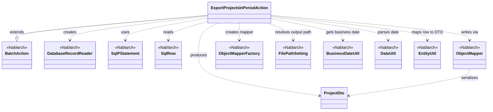
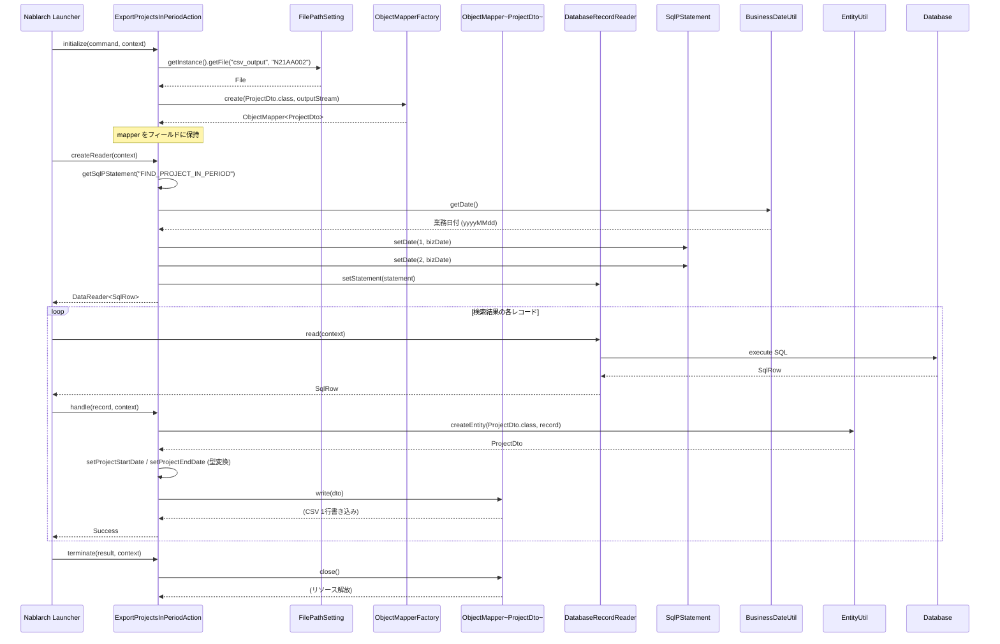

# Code Analysis: ExportProjectsInPeriodAction

**Generated**: 2026-04-24 17:45:05
**Target**: 期間内プロジェクト一覧をCSVファイルへ出力する都度起動バッチアクション
**Modules**: proman-batch
**Analysis Duration**: approx. 2m 33s

---

## Overview

`ExportProjectsInPeriodAction` は、Nablarch の `BatchAction` を継承した都度起動バッチで、業務日付時点で有効な期間内プロジェクトをデータベースから検索し、その結果を CSV ファイルに出力する。`DatabaseRecordReader` でレコードを読み込み、`EntityUtil` で `SqlRow` を `ProjectDto` に変換し、`ObjectMapper` で CSV として逐次書き出す。出力先ファイルのパスは `FilePathSetting` で管理され、検索の基準日は `BusinessDateUtil` による業務日付を用いる。

---

## Architecture

### Dependency Graph

### Component Summary

| Component | Role | Type | Dependencies |
|-----------|------|------|--------------|
| ExportProjectsInPeriodAction | 期間内プロジェクト一覧をCSV出力する都度起動バッチアクション | Action (BatchAction) | ProjectDto, DatabaseRecordReader, ObjectMapper, FilePathSetting, BusinessDateUtil, DateUtil, EntityUtil, SqlPStatement |
| ProjectDto | CSV 出力項目を定義した Bean (@Csv/@CsvFormat) | DTO/Bean | DateUtil |
| FIND_PROJECT_IN_PERIOD | 業務日付で期間内プロジェクトを検索するSQL (外部SQLファイル) | SQL | なし |

---

## Flow

### Processing Flow

Nablarch バッチの標準ライフサイクル (`initialize` → `createReader` → `handle` × N → `terminate`) に沿って処理する。

- `initialize(CommandLine, ExecutionContext)` (L44-54): `FilePathSetting#getFile` で `csv_output` 配下の `N21AA002` を取得し、`FileOutputStream` を開いて `ObjectMapperFactory.create(ProjectDto.class, outputStream)` で `ObjectMapper<ProjectDto>` を生成し、インスタンスフィールドに保持する。`FileNotFoundException` は `IllegalStateException` に包んで再送出する。
- `createReader(ExecutionContext)` (L57-65): `DatabaseRecordReader` を生成し、`getSqlPStatement("FIND_PROJECT_IN_PERIOD")` で外部SQLから `SqlPStatement` を取得する。`BusinessDateUtil.getDate()` で取得した業務日付を `DateUtil.getDate(...)` で `java.util.Date` に変換し、さらに `java.sql.Date` に詰め替えて SQL の第1/第2パラメータにセット。`reader.setStatement(statement)` で SQL をリーダに設定し返却する。
- `handle(SqlRow, ExecutionContext)` (L68-75): `EntityUtil.createEntity(ProjectDto.class, record)` で `SqlRow` を `ProjectDto` に変換し、型不整合のため自動マップできない `PROJECT_START_DATE` / `PROJECT_END_DATE` を `record.getDate(...)` と setter 経由で明示的に設定。`mapper.write(dto)` で1行CSV出力し、`new Success()` を返却する。
- `terminate(Result, ExecutionContext)` (L78-80): `mapper.close()` で書き込みバッファをフラッシュし、出力ストリームを解放する。

### Sequence Diagram

---

## Components

### ExportProjectsInPeriodAction

**Role**: 都度起動バッチアクション本体。`BatchAction<SqlRow>` を継承し、DB → CSV の DB to FILE パターンを実装する。

**Key methods**:
- `initialize(CommandLine, ExecutionContext)` (L44-54): 出力ファイルを開き `ObjectMapper` を生成する初期化処理。
- `createReader(ExecutionContext)` (L57-65): 業務日付をパラメータとする `DatabaseRecordReader` を生成して返却する。
- `handle(SqlRow, ExecutionContext)` (L68-75): 1レコード分のDBデータを `ProjectDto` に変換し CSV 1行として出力する。
- `terminate(Result, ExecutionContext)` (L78-80): `ObjectMapper` を close してリソースを解放する。

**Implementation points**:
- ✅ ライフサイクルメソッドにリソース確保・取得・処理・解放を分離。
- ⚠️ `ObjectMapper` はフィールドで保持しつつ `terminate()` で必ず `close()`。
- 💡 出力ファイル名は `FilePathSetting` 論理名 `csv_output` + 物理名 `N21AA002` で間接参照。

### ProjectDto

**Role**: CSV 出力用 Bean。`@Csv(type=CUSTOM, properties=..., headers=...)` と `@CsvFormat(...)` で CSV のプロパティ順・ヘッダ・区切り・引用符・文字コード (UTF-8) などを宣言する。

**Key methods**:
- `setProjectStartDate(Date)`: `DateUtil.formatDate(date, "yyyy/MM/dd")` で `java.util.Date` を文字列に整形して保持する。
- `setProjectEndDate(Date)`: 同上、プロジェクト終了日付用。

### FIND_PROJECT_IN_PERIOD (外部SQL)

**Role**: 業務日付を基準に期間内プロジェクトを抽出する SQL。`getSqlPStatement("FIND_PROJECT_IN_PERIOD")` 経由で取得し、第1/第2パラメータに業務日付を束縛する。

---

## Nablarch Framework Usage

### BatchAction
Nablarch のバッチ業務アクション基底クラス。ライフサイクルメソッド (`initialize` / `createReader` / `handle` / `terminate`) を提供。都度起動・常駐起動バッチで共通利用される。

### DatabaseRecordReader
`SqlPStatement` を実行し、結果セットを 1 レコードずつ `SqlRow` として `handle` に引き渡す標準データリーダ。

### ObjectMapper / ObjectMapperFactory
CSV・TSV・固定長データを Java Beans として読み書きする機能。`@Csv` / `@CsvFormat` アノテーションで書き出しフォーマットを定義する。

### FilePathSetting
論理名 → ディレクトリ/拡張子のマッピングをコンポーネント定義で一元管理するユーティリティ。

### BusinessDateUtil / DateUtil
業務日付を取得するユーティリティ。`BusinessDateUtil.getDate()` は `BasicBusinessDateProvider` の設定に従い `yyyyMMdd` の文字列を返す。

### EntityUtil
`SqlRow` 等から Bean (エンティティ/DTO) を生成するユーティリティ。

### SqlPStatement / SqlRow
`SqlPStatement` は位置指定パラメータ対応の SQL 実行オブジェクト。`SqlRow` は検索結果1行を表す。

Output file: `.nabledge/20260424/code-analysis-ExportProjectsInPeriodAction.md`
