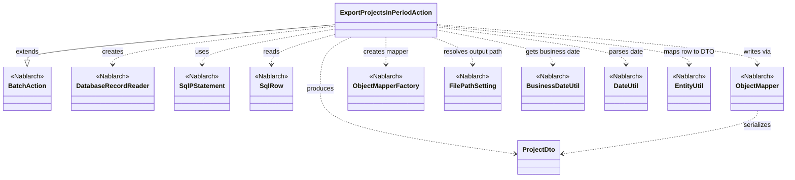
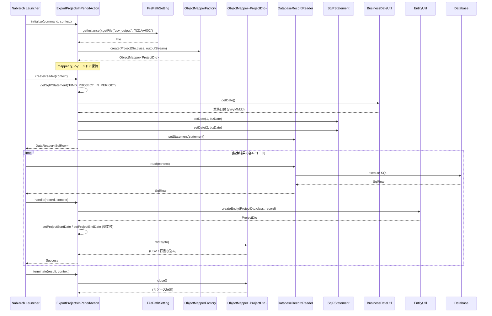

# Code Analysis: ExportProjectsInPeriodAction

**Generated**: 2026-04-24 17:45:05
**Target**: 期間内プロジェクト一覧をCSVファイルへ出力する都度起動バッチアクション
**Modules**: proman-batch
**Analysis Duration**: approx. 2m 33s

---

## Overview

`ExportProjectsInPeriodAction` は、Nablarch の `BatchAction` を継承した都度起動バッチで、業務日付時点で有効な期間内プロジェクトをデータベースから検索し、その結果を CSV ファイルに出力する。`DatabaseRecordReader` でレコードを読み込み、`EntityUtil` で `SqlRow` を `ProjectDto` に変換し、`ObjectMapper` で CSV として逐次書き出す。出力先ファイルのパスは `FilePathSetting` で管理され、検索の基準日は `BusinessDateUtil` による業務日付を用いる。

---

## Architecture

### Dependency Graph

### Component Summary

| Component | Role | Type | Dependencies |
|-----------|------|------|--------------|
| ExportProjectsInPeriodAction | 期間内プロジェクト一覧をCSV出力する都度起動バッチアクション | Action (BatchAction) | ProjectDto, DatabaseRecordReader, ObjectMapper, FilePathSetting, BusinessDateUtil, DateUtil, EntityUtil, SqlPStatement |
| ProjectDto | CSV 出力項目を定義した Bean (@Csv/@CsvFormat) | DTO/Bean | DateUtil |
| FIND_PROJECT_IN_PERIOD | 業務日付で期間内プロジェクトを検索するSQL (外部SQLファイル) | SQL | なし |

---

## Flow

### Processing Flow

Nablarch バッチの標準ライフサイクル (`initialize` → `createReader` → `handle` × N → `terminate`) に沿って処理する。

- `initialize(CommandLine, ExecutionContext)` (L44-54): `FilePathSetting#getFile` で `csv_output` 配下の `N21AA002` を取得し、`FileOutputStream` を開いて `ObjectMapperFactory.create(ProjectDto.class, outputStream)` で `ObjectMapper<ProjectDto>` を生成し、インスタンスフィールドに保持する。`FileNotFoundException` は `IllegalStateException` に包んで再送出する。
- `createReader(ExecutionContext)` (L57-65): `DatabaseRecordReader` を生成し、`getSqlPStatement("FIND_PROJECT_IN_PERIOD")` で外部SQLから `SqlPStatement` を取得する。`BusinessDateUtil.getDate()` で取得した業務日付を `DateUtil.getDate(...)` で `java.util.Date` に変換し、さらに `java.sql.Date` に詰め替えて SQL の第1/第2パラメータにセット。`reader.setStatement(statement)` で SQL をリーダに設定し返却する。
- `handle(SqlRow, ExecutionContext)` (L68-75): `EntityUtil.createEntity(ProjectDto.class, record)` で `SqlRow` を `ProjectDto` に変換し、型不整合のため自動マップできない `PROJECT_START_DATE` / `PROJECT_END_DATE` を `record.getDate(...)` と setter 経由で明示的に設定。`mapper.write(dto)` で1行CSV出力し、`new Success()` を返却する。
- `terminate(Result, ExecutionContext)` (L78-80): `mapper.close()` で書き込みバッファをフラッシュし、出力ストリームを解放する。

### Sequence Diagram

---

## Components

### ExportProjectsInPeriodAction

**File**: ExportProjectsInPeriodAction.java

**Role**: 都度起動バッチアクション本体。`BatchAction<SqlRow>` を継承し、DB → CSV の DB to FILE パターンを実装する。

**Key methods**:
- `initialize(CommandLine, ExecutionContext)` (L44-54)
- `createReader(ExecutionContext)` (L57-65)
- `handle(SqlRow, ExecutionContext)` (L68-75)
- `terminate(Result, ExecutionContext)` (L78-80)

### ProjectDto

CSV 出力用 Bean。`@Csv(type=CUSTOM, ...)` と `@CsvFormat(...)` で CSV のプロパティ順・ヘッダ・区切り・引用符・文字コード (UTF-8) を宣言。`setProjectStartDate(Date)` (L137-139) / `setProjectEndDate(Date)` (L153-155) で `DateUtil.formatDate(date, "yyyy/MM/dd")` により文字列整形。

### FIND_PROJECT_IN_PERIOD (外部SQL)

業務日付を基準に期間内プロジェクトを抽出する SQL。`getSqlPStatement(SQL_ID)` で参照。

---

## Nablarch Framework Usage

### BatchAction
Class: `nablarch.fw.action.BatchAction`. ライフサイクルメソッド initialize/createReader/handle/terminate を提供。✅ ライフサイクル遵守 / ⚠️ terminate は成否に関わらず呼ばれる / 🎯 handle 戻り値は `new Result.Success()`。

### DatabaseRecordReader
Class: `nablarch.fw.reader.DatabaseRecordReader`. SqlPStatement を実行し結果を SqlRow で 1 件ずつ渡す標準データリーダ。✅ createReader で生成 / 💡 標準提供 / 🎯 DB入力バッチで使用。

### ObjectMapper / ObjectMapperFactory
Class: `nablarch.common.databind.ObjectMapper`, `ObjectMapperFactory`. CSV/TSV/固定長を Beans で読み書き。✅ 必ず close() / ⚠️ 大量データに強い / 💡 アノテーション駆動。本コードでは initialize で create、handle で write、terminate で close。

### FilePathSetting
Class: `nablarch.core.util.FilePathSetting`. 論理名でファイルパスを取得。本コードでは `csv_output` 論理名配下の `N21AA002` を取得。

### BusinessDateUtil / DateUtil
Class: `nablarch.core.date.BusinessDateUtil`, `nablarch.core.util.DateUtil`. 業務日付を取得し SQL パラメータに設定。`-DBasicBusinessDateProvider.<区分>=yyyyMMdd` で再実行時に上書き可能。

### EntityUtil
Class: `nablarch.common.dao.EntityUtil`. SqlRow から DTO を生成。型不一致カラム (PROJECT_START_DATE/END_DATE) は setter で個別設定。

### SqlPStatement / SqlRow
Class: `nablarch.core.db.statement.SqlPStatement`, `SqlRow`. `getSqlPStatement(SQL_ID)` で外部SQLを取得、位置指定パラメータで業務日付を束縛。`SqlRow#getDate` 等で型付き取得。

---

## References

### Source Files
- ExportProjectsInPeriodAction.java (v6 proman-batch)
- ProjectDto.java (v6 proman-batch)

### Knowledge Base (Nabledge-6)
- Nablarch Batch Getting Started
- Nablarch Batch Architecture
- Libraries Data Bind
- Libraries File Path Management
- Libraries Date
- Libraries Database

Output: `.nabledge/20260424/code-analysis-ExportProjectsInPeriodAction.md`
