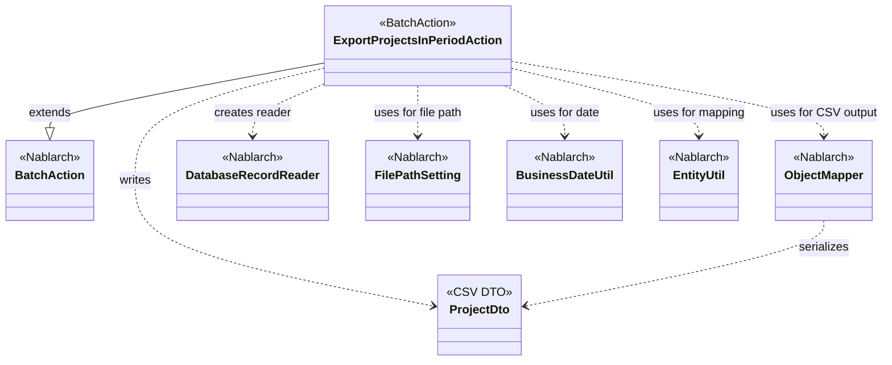
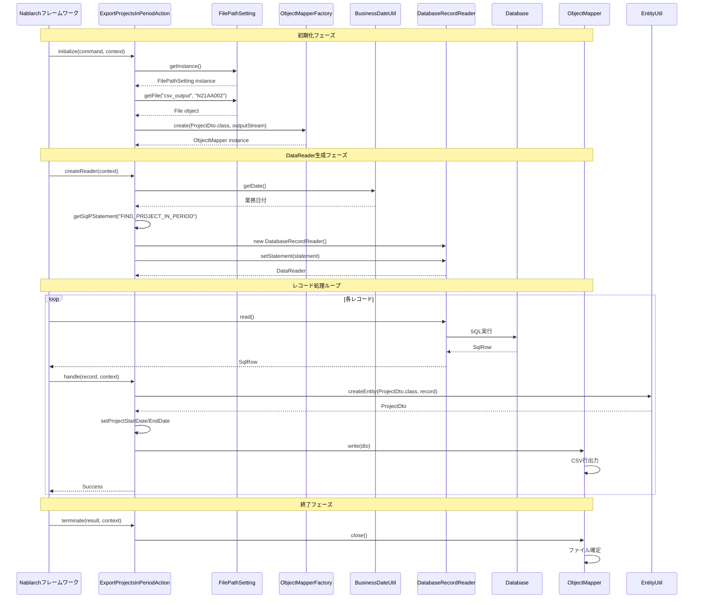

# Code Analysis: ExportProjectsInPeriodAction

**Generated**: 2026-03-02 17:14:06
**Target**: 期間内プロジェクト一覧のCSV出力バッチ処理
**Modules**: proman-batch
**Analysis Duration**: 約2分39秒

---

## Overview

このバッチアクションは、業務日付を基準に期間内のプロジェクト情報をデータベースから抽出し、CSV形式でファイル出力する都度起動型バッチ処理です。

**主な特徴:**
- DatabaseRecordReaderによるデータベース検索結果の順次読み込み
- ObjectMapperによるCSVファイル出力
- 業務日付を使った期間検索
- FilePathSettingによる出力先管理

**処理パターン**: DB to FILE（データベースからファイルへの抽出）

---

## Architecture

### Dependency Graph



**Note**: This diagram uses Mermaid `classDiagram` syntax to show class names and their relationships. Use `--|>` for inheritance (extends/implements) and `..>` for dependencies (uses/creates).

### Component Summary

| Component | Role | Type | Dependencies |
|-----------|------|------|--------------|
| ExportProjectsInPeriodAction | バッチアクション（期間内プロジェクト出力） | BatchAction | ProjectDto, ObjectMapper, DatabaseRecordReader, FilePathSetting, BusinessDateUtil, EntityUtil |
| ProjectDto | CSV出力用データ転送オブジェクト | DTO | @Csv, @CsvFormat annotations |

---

## Flow

### Processing Flow

1. **初期化 (initialize)**: FilePathSettingから出力ファイルパスを取得し、ObjectMapperを生成
2. **DataReader生成 (createReader)**: 業務日付を使ってDatabaseRecordReaderを設定
3. **レコード処理 (handle)**: SqlRowからProjectDtoを生成し、CSVに書き込み
4. **終了処理 (terminate)**: ObjectMapperをクローズしてファイルを確定

### Sequence Diagram



---

## Components

### 1. ExportProjectsInPeriodAction

**File**: `.lw/nab-official/v6/.../proman-batch/src/main/java/com/nablarch/example/proman/batch/project/ExportProjectsInPeriodAction.java`

**Role**: 期間内プロジェクト一覧をCSV出力する都度起動バッチアクション

**Key Methods**:
- `initialize(CommandLine, ExecutionContext)` :44-54 - FilePathSettingとObjectMapperの初期化
- `createReader(ExecutionContext)` :56-65 - 業務日付を使ったDatabaseRecordReaderの生成
- `handle(SqlRow, ExecutionContext)` :67-75 - SqlRowからProjectDtoへの変換とCSV書き込み
- `terminate(Result, ExecutionContext)` :77-80 - ObjectMapperのクローズ処理

**Dependencies**:
- BatchAction<SqlRow> (extends)
- ObjectMapper<ProjectDto> (field)
- FilePathSetting, BusinessDateUtil, EntityUtil (uses)

**Implementation Points**:
- 業務日付を基準にした期間検索（開始日 <= 業務日付 <= 終了日）
- EntityUtilでは型が異なる日付フィールドを明示的にsetterで設定
- ObjectMapperはtry-with-resourcesではなくterminateでクローズ

### 2. ProjectDto

**File**: `.lw/nab-official/v6/.../proman-batch/src/main/java/com/nablarch/example/proman/batch/project/ProjectDto.java`

**Role**: CSV出力用のデータ転送オブジェクト

**Key Features**:
- `@Csv` :15-19 - CSV出力フォーマットの定義（プロパティ順序、ヘッダ行）
- `@CsvFormat` :20-21 - CSVフォーマット詳細（区切り文字、文字コード、クォートモード）
- Date型setterによる日付フォーマット変換 :138-140, :154-156

**Dependencies**:
- nablarch.common.databind.csv.Csv
- nablarch.common.databind.csv.CsvFormat
- nablarch.core.util.DateUtil

**Implementation Points**:
- すべてのフィールドをString型で定義（CSV出力のため）
- Date型引数のsetterで"yyyy/MM/dd"形式に変換
- `CsvType.CUSTOM`でプロパティとヘッダを明示的に指定

---

## Nablarch Framework Usage

### BatchAction<SqlRow>

**説明**: バッチ処理の基底クラス。initialize/createReader/handle/terminateのライフサイクルメソッドを提供。

**コード例**:
```java
public class ExportProjectsInPeriodAction extends BatchAction<SqlRow> {
    @Override
    protected void initialize(CommandLine command, ExecutionContext context) {
        // 初期化処理：ファイル出力の準備
    }

    @Override
    public DataReader<SqlRow> createReader(ExecutionContext context) {
        // DataReaderの生成：データベース検索条件を設定
        return reader;
    }

    @Override
    public Result handle(SqlRow record, ExecutionContext context) {
        // 1レコードごとの処理：CSV書き込み
        return new Success();
    }

    @Override
    protected void terminate(Result result, ExecutionContext context) {
        // 終了処理：リソースのクローズ
    }
}
```

**Important Points**:
- ✅ **必須**: createReaderでDataReaderを返す（フレームワークが順次読み込み）
- ✅ **必須**: handleは1レコードごとに呼ばれる（ループ不要）
- ⚠️ **注意**: initializeとterminateは処理全体で1回のみ呼ばれる
- 💡 **メリット**: ハンドラキューがトランザクション管理やループ制御を自動化
- 🎯 **使用時**: 大量データの順次処理（DB to FILE, FILE to DB, DB to DB）

**Usage in this code**:
- initialize: FilePathSettingでファイルパス取得、ObjectMapper生成
- createReader: 業務日付を使った期間検索のDatabaseRecordReader
- handle: EntityUtilでSqlRow→Dto変換、ObjectMapperでCSV書き込み
- terminate: ObjectMapperをクローズしてファイル確定

**Knowledge base**: [nablarch-batch.json#actions](../../.claude/skills/nabledge-6/knowledge/features/processing/nablarch-batch.json)

---

### ObjectMapper / ObjectMapperFactory

**説明**: JavaBeansとファイル（CSV/固定長）間のデータバインドを提供。

**コード例**:
```java
// ObjectMapper生成
FileOutputStream outputStream = new FileOutputStream(output);
ObjectMapper<ProjectDto> mapper = ObjectMapperFactory.create(ProjectDto.class, outputStream);

// CSV書き込み
mapper.write(dto);

// クローズ（ファイル確定）
mapper.close();
```

**Important Points**:
- ✅ **必須**: @Csvまたは@FixedLengthアノテーションでフォーマット定義
- ⚠️ **注意**: ObjectMapperはスレッドセーフではない（バッチActionのフィールドでOK）
- 💡 **メリット**: アノテーションベースで宣言的にCSVフォーマット定義
- 🎯 **使用時**: ファイル入出力が必要なバッチ処理
- ⚡ **パフォーマンス**: バッファリングされた書き込み

**Usage in this code**:
- FilePathSetting.getFile()で取得したFileからFileOutputStreamを生成
- ObjectMapperFactory.create()でProjectDto用のマッパーを生成
- handle()でmapper.write(dto)を呼び出してCSV行を出力
- terminate()でmapper.close()してファイルを確定

**Knowledge base**: [data-bind.json#overview](../../.claude/skills/nabledge-6/knowledge/features/libraries/data-bind.json)

---

### DatabaseRecordReader

**説明**: データベース検索結果を順次読み込むDataReader実装。

**コード例**:
```java
DatabaseRecordReader reader = new DatabaseRecordReader();
SqlPStatement statement = getSqlPStatement("FIND_PROJECT_IN_PERIOD");
statement.setDate(1, bizDate);
statement.setDate(2, bizDate);
reader.setStatement(statement);
return reader;
```

**Important Points**:
- ✅ **必須**: SqlPStatementを設定してSQL実行とバインド変数を指定
- ⚠️ **注意**: フレームワークがループとトランザクション制御を実行（開発者はループ不要）
- 💡 **メリット**: 大量データをメモリに載せずに順次処理
- 🎯 **使用時**: データベースからの大量データ抽出
- ⚡ **パフォーマンス**: カーソルベースの順次読み込みでメモリ効率的

**Usage in this code**:
- getSqlPStatement("FIND_PROJECT_IN_PERIOD")でSQL IDから検索SQL取得
- BusinessDateUtil.getDate()で業務日付を取得
- setDate()でSQLのバインド変数（期間検索）を設定
- フレームワークが順次読み込み、handle()に1レコードずつ渡す

**Knowledge base**: [nablarch-batch.json#data-readers](../../.claude/skills/nabledge-6/knowledge/features/processing/nablarch-batch.json)

---

### FilePathSetting

**説明**: ファイルパスを論理名で管理し、環境ごとの物理パスを設定ファイルで切り替え可能にする。

**コード例**:
```java
FilePathSetting filePathSetting = FilePathSetting.getInstance();
File output = filePathSetting.getFile("csv_output", "N21AA002");
```

**Important Points**:
- ✅ **必須**: 設定ファイルでbasePathSettingsを定義
- ⚠️ **注意**: classpathスキーム使用時はJBoss/Wildflyでvfsプロトコル注意
- 💡 **メリット**: 環境（開発/テスト/本番）で物理パスを切り替え可能
- 🎯 **使用時**: ファイル入出力が必要なすべての処理
- ⚡ **運用**: 論理名による設定の一元管理

**Usage in this code**:
- getInstance()でシングルトンインスタンス取得
- getFile("csv_output", "N21AA002")で論理名"csv_output"配下のファイルN21AA002を取得
- 設定ファイルで"csv_output"の物理パスを定義（例: /app/output/）

**Knowledge base**: [file-path-management.json#usage](../../.claude/skills/nabledge-6/knowledge/features/libraries/file-path-management.json)

---

### BusinessDateUtil

**説明**: アプリケーション全体で統一された業務日付を提供。

**コード例**:
```java
String bizDateStr = BusinessDateUtil.getDate();
Date bizDate = new Date(DateUtil.getDate(bizDateStr).getTime());
```

**Important Points**:
- ✅ **必須**: 設定ファイルでBusinessDateProviderを定義
- ⚠️ **注意**: 業務日付はシステム日時とは異なる（バッチ実行日や会計日など）
- 💡 **メリット**: テストで日付を切り替え可能、再実行時に同じ日付を使用可能
- 🎯 **使用時**: 業務ロジックで日付を扱うすべての処理
- ⚡ **一貫性**: アプリケーション全体で統一された日付基準

**Usage in this code**:
- BusinessDateUtil.getDate()で業務日付（文字列）を取得
- DateUtil.getDate()でDate型に変換後、java.sql.Dateに変換
- SQL検索条件として使用（プロジェクト開始日 <= 業務日付 <= 終了日）

**Knowledge base**: [business-date.json#business_date_usage](../../.claude/skills/nabledge-6/knowledge/features/libraries/business-date.json)

---

### EntityUtil

**説明**: SqlRowやResultSetからEntityやDTOへのマッピングを提供。

**コード例**:
```java
ProjectDto dto = EntityUtil.createEntity(ProjectDto.class, record);
// 型が異なるフィールドは明示的にsetter呼び出し
dto.setProjectStartDate(record.getDate("PROJECT_START_DATE"));
dto.setProjectEndDate(record.getDate("PROJECT_END_DATE"));
```

**Important Points**:
- ✅ **必須**: DTOにカラム名と同じプロパティ名（またはアノテーション）が必要
- ⚠️ **注意**: 型変換が必要なフィールドは自動マッピングされない（明示的setter必要）
- 💡 **メリット**: ボイラープレートコード削減、型安全なマッピング
- 🎯 **使用時**: データベース検索結果をDTO/Entityに変換
- ⚡ **効率**: リフレクションベースだが十分高速

**Usage in this code**:
- EntityUtil.createEntity(ProjectDto.class, record)で基本的なマッピング
- 日付フィールドはDate→String変換が必要なためsetterを明示的に呼び出し
- SqlRowのカラム名とProjectDtoのプロパティ名が一致している箇所は自動マッピング

---

## References

### Source Files

- [ExportProjectsInPeriodAction.java](../../ExportProjectsInPeriodAction.java) - ExportProjectsInPeriodAction
- [ProjectDto.java](../../ProjectDto.java) - ProjectDto

### Knowledge Base (Nabledge-6)

- [Nablarch Batch.json](../../nablarch-batch.json)
- [Data Bind.json](../../data-bind.json)
- [Business Date.json](../../business-date.json)
- [File Path Management.json](../../file-path-management.json)

### Official Documentation

- [Nablarch Batch](https://nablarch.github.io/docs/LATEST/doc/application_framework/application_framework/batch/nablarch_batch.html)
- [Data Bind](https://nablarch.github.io/docs/LATEST/doc/application_framework/application_framework/libraries/data_io/data_bind.html)

---

**Note**: This documentation was generated by the code-analysis workflow of the nabledge-6 skill.
