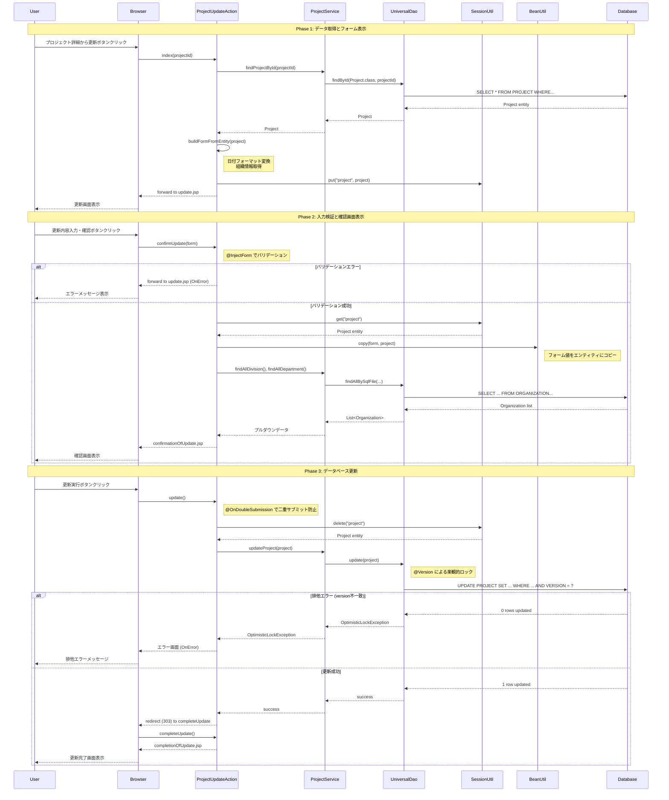

# Code Analysis: ProjectUpdateAction

**Generated**: 2026-03-02 17:21:27
**Target**: プロジェクト更新機能
**Modules**: proman-web
**Analysis Duration**: 約4分18秒

---

## Overview

ProjectUpdateActionは、プロジェクト情報の更新機能を提供するWebアクションクラスです。ユーザーがプロジェクトの詳細情報を編集し、更新内容を確認した後、データベースに反映する一連の処理を制御します。

主な処理フロー:
1. **詳細画面から更新画面へ遷移** (`index`) - プロジェクトIDをもとにデータベースから情報を取得し、更新用フォームに表示
2. **更新内容の確認** (`confirmUpdate`) - 入力値のバリデーション後、確認画面に遷移
3. **データベース更新** (`update`) - セッションに保存されたエンティティをデータベースに更新
4. **完了画面表示** (`completeUpdate`) - 更新完了メッセージを表示

セッション管理により、画面間でエンティティ情報を保持し、確認画面から入力画面への戻り(`backToEnterUpdate`)や、二重サブミット防止(`@OnDoubleSubmission`)を実現しています。

---

## Architecture

### Dependency Graph

```mermaid
classDiagram
    class ProjectUpdateAction {
        <<Web Action>>
    }
    class ProjectUpdateForm {
        <<Form>>
    }
    class ProjectUpdateInitialForm {
        <<Form>>
    }
    class ProjectService {
        <<Service>>
    }
    class Project {
        <<Entity>>
    }
    class Organization {
        <<Entity>>
    }
    class UniversalDao {
        <<Nablarch>>
    }
    class SessionUtil {
        <<Nablarch>>
    }
    class BeanUtil {
        <<Nablarch>>
    }
    class ExecutionContext {
        <<Nablarch>>
    }

    ProjectUpdateAction ..> ProjectUpdateInitialForm : validates
    ProjectUpdateAction ..> ProjectUpdateForm : validates
    ProjectUpdateAction ..> ProjectService : delegates to
    ProjectUpdateAction ..> SessionUtil : stores entity
    ProjectUpdateAction ..> BeanUtil : copies properties
    ProjectUpdateAction ..> ExecutionContext : accesses context
    ProjectService ..> UniversalDao : queries database
    ProjectService ..> Project : retrieves
    ProjectService ..> Organization : retrieves
    ProjectUpdateForm ..|> Serializable : implements
    ProjectUpdateInitialForm ..|> Serializable : implements
```



**Note**: This diagram uses Mermaid `classDiagram` syntax to show class names and their relationships. Use `--|>` for inheritance (extends/implements) and `..>` for dependencies (uses/creates).

### Component Summary

| Component | Role | Type | Dependencies |
|-----------|------|------|--------------|
| ProjectUpdateAction | プロジェクト更新処理制御 | Action | ProjectUpdateForm, ProjectService, SessionUtil, BeanUtil |
| ProjectUpdateForm | プロジェクト更新入力検証 | Form | Bean Validation annotations |
| ProjectUpdateInitialForm | プロジェクトID受け渡し | Form | なし |
| ProjectService | プロジェクトデータアクセス | Service | UniversalDao, Project, Organization |
| Project | プロジェクトエンティティ | Entity | @Version (optimistic locking) |
| Organization | 組織エンティティ | Entity | なし |

---

## Flow

### Processing Flow

プロジェクト更新処理は、以下の3つのフェーズで構成されています:

**Phase 1: データ取得とフォーム表示** (`index`)
- プロジェクト詳細画面から更新画面への遷移時に実行
- `ProjectUpdateInitialForm`でプロジェクトIDを受け取る(`@InjectForm`で自動バインド)
- `ProjectService.findProjectById()`でデータベースからプロジェクト情報を取得
- エンティティからフォームへの変換処理(`buildFormFromEntity`)で、日付フォーマット変換と組織情報の設定
- 変換したフォームをリクエストスコープに設定し、プロジェクトエンティティをセッションに保存
- 更新画面(update.jsp)へフォワード

**Phase 2: 入力検証と確認画面表示** (`confirmUpdate`)
- 更新画面からの入力値を`ProjectUpdateForm`で受け取り、Bean Validationで検証(`@InjectForm`)
- バリデーションエラー時は`@OnError`で更新画面へ戻る
- セッションからプロジェクトエンティティを取得
- `BeanUtil.copy()`でフォームの値をエンティティにコピー
- 事業部/部門のプルダウンリストをデータベースから取得してリクエストスコープに設定
- 確認画面(confirmationOfUpdate.jsp)を表示

**Phase 3: データベース更新** (`update`)
- 確認画面からの更新実行時に実行
- `@OnDoubleSubmission`で二重サブミットを防止
- セッションからプロジェクトエンティティを取得し、セッションから削除(`SessionUtil.delete`)
- `ProjectService.updateProject()`でデータベース更新
  - 内部で`UniversalDao.update()`を呼び出し
  - `@Version`アノテーションによる楽観的ロックで排他制御を実現
- 更新完了画面へリダイレクト(303 See Other)

**補助処理**:
- `backToEnterUpdate`: 確認画面から入力画面へ戻る際に、セッションのエンティティからフォームを再構築
- `indexSetPullDown`: 入力画面表示時に事業部/部門のプルダウンリストを設定
- `setOrganizationAndDivisionToRequestScope`: 事業部/部門のプルダウンリスト取得(再利用可能なprivateメソッド)

### Sequence Diagram



---

## Components

### 1. ProjectUpdateAction

**File**: [ProjectUpdateAction.java:23-160](../../../../../../../../.lw/nab-official/v6/nablarch-system-development-guide/Sample_Project/Source_Code/proman-project/proman-web/src/main/java/com/nablarch/example/proman/web/project/ProjectUpdateAction.java)

**Role**: プロジェクト更新機能のコントローラー。画面遷移とビジネスロジックの呼び出しを制御

**Key Methods**:
- `index()` [:35-43] - プロジェクト詳細からの遷移処理。プロジェクト情報を取得しフォームに変換
- `confirmUpdate()` [:54-62] - 入力値検証後、確認画面へ遷移
- `update()` [:72-77] - データベース更新処理。二重サブミット防止付き
- `completeUpdate()` [:86-88] - 更新完了画面表示
- `backToEnterUpdate()` [:97-102] - 確認画面から入力画面への戻り処理
- `indexSetPullDown()` [:135-141] - プルダウンリスト設定付き入力画面表示
- `buildFormFromEntity()` [:111-125] - プロジェクトエンティティからフォームへの変換
- `setOrganizationAndDivisionToRequestScope()` [:148-158] - 事業部/部門プルダウンリスト設定

**Dependencies**:
- ProjectUpdateForm, ProjectUpdateInitialForm - 入力値検証
- ProjectService - データベースアクセス
- SessionUtil - セッション管理
- BeanUtil - エンティティ⇔フォーム変換
- ExecutionContext - リクエスト/セッションスコープアクセス

**Nablarch Annotations**:
- `@InjectForm` - フォームの自動バインドとバリデーション
- `@OnError` - バリデーションエラー時の画面遷移制御
- `@OnDoubleSubmission` - 二重サブミット防止

### 2. ProjectUpdateForm

**File**: [ProjectUpdateForm.java:15-332](../../../../../../../../.lw/nab-official/v6/nablarch-system-development-guide/Sample_Project/Source_Code/proman-project/proman-web/src/main/java/com/nablarch/example/proman/web/project/ProjectUpdateForm.java)

**Role**: プロジェクト更新画面の入力値を保持し、Bean Validationで検証

**Key Properties**:
- `projectName` [:24-27] - プロジェクト名 (@Required, @Domain)
- `projectType` [:30-34] - プロジェクト種別
- `projectClass` [:37-41] - プロジェクト分類
- `projectStartDate`, `projectEndDate` [:44-55] - プロジェクト期間
- `divisionId`, `organizationId` [:58-69] - 事業部ID、部門ID
- `pmKanjiName`, `plKanjiName` [:80-91] - PM名、PL名

**Validation**:
- `@Required` - 必須入力チェック
- `@Domain` - ドメイン定義による型・桁数・形式チェック
- `@AssertTrue isValidProjectPeriod()` [:328-331] - プロジェクト期間の妥当性チェック(開始日≦終了日)

### 3. ProjectUpdateInitialForm

**File**: [ProjectUpdateInitialForm.java:11-34](../../../../../../../../.lw/nab-official/v6/nablarch-system-development-guide/Sample_Project/Source_Code/proman-project/proman-web/src/main/java/com/nablarch/example/proman/web/project/ProjectUpdateInitialForm.java)

**Role**: プロジェクト詳細画面から更新画面へのプロジェクトID受け渡し

**Key Properties**:
- `projectId` [:13-15] - プロジェクトID (@Required, @Domain)

### 4. ProjectService

**File**: [ProjectService.java:17-127](../../../../../../../../.lw/nab-official/v6/nablarch-system-development-guide/Sample_Project/Source_Code/proman-project/proman-web/src/main/java/com/nablarch/example/proman/web/project/ProjectService.java)

**Role**: プロジェクトと組織のデータアクセスを提供。UniversalDaoのラッパー

**Key Methods**:
- `findAllDivision()` [:50-52] - 全事業部取得(SQLファイル使用)
- `findAllDepartment()` [:59-61] - 全部門取得(SQLファイル使用)
- `findOrganizationById()` [:70-73] - 組織ID検索
- `updateProject()` [:89-91] - プロジェクト更新
- `findProjectById()` [:124-126] - プロジェクトID検索

**Dependencies**:
- DaoContext (UniversalDaoのインターフェース) - データベースアクセス
- Project, Organization - エンティティクラス

---

## Nablarch Framework Usage

### UniversalDao (via DaoContext)

**クラス**: `nablarch.common.dao.UniversalDao` / `nablarch.common.dao.DaoContext`

**説明**: Jakarta Persistenceアノテーションを使った簡易的なO/Rマッパー。SQLを書かずに単純なCRUDを実行し、検索結果をBeanにマッピング

**使用方法**:
```java
// 主キー検索
Project project = universalDao.findById(Project.class, projectId);

// 更新
universalDao.update(project);

// SQLファイル使用の検索
List<Organization> divisions = universalDao.findAllBySqlFile(Organization.class, "FIND_ALL_DIVISION");
```

**重要ポイント**:
- ✅ **主キー検索に便利**: `findById()`は主キーを指定するだけでエンティティを取得。WHERE句を書く必要なし
- ✅ **楽観的ロックが自動**: エンティティに`@Version`アノテーションがあれば、`update()`実行時に自動で楽観的ロックを実行
- ⚠️ **排他エラーの処理**: `OptimisticLockException`が発生した場合、`@OnError`で画面遷移制御が必要
- 💡 **複雑な検索はSQLファイル**: JOINや複雑な条件の検索は`findAllBySqlFile()`でSQLファイルを使用
- 💡 **トランザクション管理不要**: Nablarchのトランザクション管理ハンドラが自動でコミット/ロールバックを制御

**このコードでの使い方**:
- `ProjectService.findProjectById()` - 主キー検索でプロジェクト情報を取得(Line 125)
- `ProjectService.updateProject()` - プロジェクト情報を更新、楽観的ロックで排他制御(Line 90)
- `ProjectService.findAllDivision/Departmentなど` - SQLファイルで組織情報を検索(Line 51, 60)

**詳細**: [ユニバーサルDAO](../../../../../../../../.claude/skills/nabledge-6/knowledge/features/libraries/universal-dao.json) (overview, crud, optimistic-lock sections)

### @InjectForm

**アノテーション**: `nablarch.common.web.interceptor.InjectForm`

**説明**: リクエストパラメータを自動的にFormオブジェクトにバインドし、Bean Validationで検証

**使用方法**:
```java
@InjectForm(form = ProjectUpdateForm.class, prefix = "form")
@OnError(type = ApplicationException.class, path = "forward:///app/project/moveUpdate")
public HttpResponse confirmUpdate(HttpRequest request, ExecutionContext context) {
    ProjectUpdateForm form = context.getRequestScopedVar("form");
    // formは検証済み
}
```

**重要ポイント**:
- ✅ **自動バインド**: リクエストパラメータがForm bean のプロパティに自動マッピング
- ✅ **自動検証**: Bean Validationアノテーション(@Required, @Domain等)に基づいて自動検証
- ✅ **@OnErrorと組み合わせ**: バリデーションエラー時の画面遷移を`@OnError`で制御
- 💡 **リクエストスコープに自動設定**: 検証後のFormは`context.getRequestScopedVar("form")`で取得可能
- 🎯 **いつ使うか**: 入力画面からの送信時、Formオブジェクトで入力値を受け取る全ての場面

**このコードでの使い方**:
- `index()` - `ProjectUpdateInitialForm`でプロジェクトIDを受け取り(Line 35)
- `confirmUpdate()` - `ProjectUpdateForm`で更新内容を受け取り、Bean Validation実行(Line 52)

**詳細**: Nablarchインターセプタ機能

### @OnError

**アノテーション**: `nablarch.fw.web.interceptor.OnError`

**説明**: 指定した例外発生時の画面遷移先を制御

**使用方法**:
```java
@OnError(type = ApplicationException.class, path = "forward:///app/project/moveUpdate")
public HttpResponse confirmUpdate(HttpRequest request, ExecutionContext context) {
    // バリデーションエラー時はpath で指定した画面へ遷移
}
```

**重要ポイント**:
- ✅ **宣言的エラーハンドリング**: 例外の種類ごとに遷移先を指定できる
- ✅ **`@InjectForm`と併用**: バリデーションエラー(`ApplicationException`)時の画面遷移に使用
- ⚠️ **エラー情報の引き継ぎ**: エラーメッセージはリクエストスコープに自動設定され、JSPで`<n:errors />`タグで表示可能
- 💡 **OptimisticLockExceptionにも使用可**: 楽観的ロックエラー時の画面遷移制御にも利用可能
- 🎯 **いつ使うか**: 入力エラー、排他エラー、業務エラー時に元の画面へ戻る処理

**このコードでの使い方**:
- `confirmUpdate()` - バリデーションエラー時に更新入力画面へ戻る(Line 53)

**詳細**: Nablarchインターセプタ機能

### @OnDoubleSubmission

**アノテーション**: `nablarch.common.web.token.OnDoubleSubmission`

**説明**: 二重サブミット(同じ更新処理の重複実行)を防止

**使用方法**:
```java
@OnDoubleSubmission
public HttpResponse update(HttpRequest request, ExecutionContext context) {
    // 2回目以降の実行は自動的にエラー画面へ遷移
}
```

**重要ポイント**:
- ✅ **自動防止**: トークンチェックにより、同じ処理の重複実行を自動で防止
- ✅ **設定不要**: アノテーションを付けるだけで有効化(トークン生成・検証は自動)
- ⚠️ **トークン生成が必要**: 画面側でトークンを生成する必要がある(JSPで`<n:useToken />`タグ使用)
- 💡 **ブラウザバック対策**: ユーザーがブラウザバックで戻って再送信しても、2回目は実行されない
- 🎯 **いつ使うか**: 更新・削除・決済など、重複実行されると問題がある処理

**このコードでの使い方**:
- `update()` - プロジェクト更新処理の二重サブミット防止(Line 71)

**詳細**: Nablarch二重サブミット防止機能

### SessionUtil

**クラス**: `nablarch.common.web.session.SessionUtil`

**説明**: HTTPセッションへのオブジェクト保存・取得・削除を簡潔に行うユーティリティ

**使用方法**:
```java
// セッションに保存
SessionUtil.put(context, "project", project);

// セッションから取得
Project project = SessionUtil.get(context, "project");

// セッションから取得して削除
Project project = SessionUtil.delete(context, "project");
```

**重要ポイント**:
- ✅ **シンプルなAPI**: `put/get/delete`の3メソッドで直感的に操作可能
- ✅ **型安全**: ジェネリクスにより型キャストが不要
- ⚠️ **セッションスコープのライフサイクル**: ブラウザを閉じるまで保持されるため、不要になったら`delete()`で削除
- 💡 **画面間のデータ引き継ぎ**: 確認画面を挟む処理や、複数画面にまたがる処理で活用
- 💡 **Serializableが必要**: セッションに保存するオブジェクトは`Serializable`を実装する必要がある
- 🎯 **いつ使うか**: 入力→確認→完了の画面遷移で、エンティティを保持する場面

**このコードでの使い方**:
- `index()` - プロジェクトエンティティをセッションに保存(Line 41)
- `confirmUpdate()`, `backToEnterUpdate()`, `indexSetPullDown()` - セッションからエンティティを取得(Line 56, 98, 138)
- `update()` - セッションからエンティティを取得して削除(Line 73)

**詳細**: Nablarchセッション管理機能

### BeanUtil

**クラス**: `nablarch.core.beans.BeanUtil`

**説明**: JavaBeansのプロパティコピー、型変換、オブジェクト生成を提供

**使用方法**:
```java
// フォームからエンティティへプロパティコピー
BeanUtil.copy(form, project);

// エンティティからフォームへ変換しながらコピー
ProjectUpdateForm form = BeanUtil.createAndCopy(ProjectUpdateForm.class, project);
```

**重要ポイント**:
- ✅ **プロパティ名でマッピング**: 同名プロパティを自動的にコピー
- ✅ **型変換サポート**: 基本型、文字列、日付などの一般的な型変換を自動実行
- ⚠️ **カスタム変換は手動**: 日付フォーマット変換など、独自の変換は手動で実施(`buildFormFromEntity`参照)
- 💡 **冗長なコードを削減**: 1プロパティずつsetterを呼ぶ冗長なコードが不要
- 💡 **メンテナンス性向上**: プロパティ追加時、コピー処理の修正が不要
- 🎯 **いつ使うか**: Form⇔Entity間の変換、DTO⇔Entity間の変換

**このコードでの使い方**:
- `confirmUpdate()` - フォームからエンティティへプロパティコピー(Line 57)
- `buildFormFromEntity()` - エンティティからフォームへ変換コピー。日付フォーマットは手動変換(Line 112)

**詳細**: Nablarch BeanUtilユーティリティ

### ExecutionContext

**クラス**: `nablarch.fw.ExecutionContext`

**説明**: リクエスト処理のコンテキスト情報(リクエストスコープ、セッションスコープなど)を保持

**使用方法**:
```java
// リクエストスコープに設定
context.setRequestScopedVar("form", projectUpdateForm);

// リクエストスコープから取得
ProjectUpdateForm form = context.getRequestScopedVar("form");

// セッションアクセス(SessionUtilを使用)
SessionUtil.put(context, "key", value);
```

**重要ポイント**:
- ✅ **リクエストスコープ管理**: `setRequestScopedVar/getRequestScopedVar`でJSPとデータ共有
- ✅ **セッションアクセス**: `SessionUtil`を介してセッションスコープにもアクセス可能
- 💡 **スレッドローカル**: 各リクエストごとに独立したコンテキストを保持
- 💡 **ハンドラチェーン**: Nablarchの各ハンドラ間で情報を共有するための仕組み
- 🎯 **いつ使うか**: アクションメソッド内で常に使用(引数として渡される)

**このコードでの使い方**:
- `@InjectForm`で検証されたフォームの取得(Line 36, 55)
- リクエストスコープへのフォーム設定(Line 40, 100)
- リクエストスコープへのプルダウンリスト設定(Line 156-157)

**詳細**: Nablarchハンドラキュー実行制御

---

## References

### Source Files

- [ProjectUpdateAction.java](../../../../../../../../.lw/nab-official/v6/nablarch-system-development-guide/Sample_Project/Source_Code/proman-project/proman-web/src/main/java/com/nablarch/example/proman/web/project/ProjectUpdateAction.java) - プロジェクト更新アクション
- [ProjectUpdateForm.java](../../../../../../../../.lw/nab-official/v6/nablarch-system-development-guide/Sample_Project/Source_Code/proman-project/proman-web/src/main/java/com/nablarch/example/proman/web/project/ProjectUpdateForm.java) - プロジェクト更新フォーム
- [ProjectUpdateInitialForm.java](../../../../../../../../.lw/nab-official/v6/nablarch-system-development-guide/Sample_Project/Source_Code/proman-project/proman-web/src/main/java/com/nablarch/example/proman/web/project/ProjectUpdateInitialForm.java) - プロジェクトID受け渡しフォーム
- [ProjectService.java](../../../../../../../../.lw/nab-official/v6/nablarch-system-development-guide/Sample_Project/Source_Code/proman-project/proman-web/src/main/java/com/nablarch/example/proman/web/project/ProjectService.java) - プロジェクトサービス

### Knowledge Base (Nabledge-6)

- [Universal Dao.json](../../../../../../../../.claude/skills/nabledge-6/knowledge/features/libraries/universal-dao.json)

### Official Documentation

- [Universal Dao](https://nablarch.github.io/docs/LATEST/doc/application_framework/application_framework/libraries/database/universal_dao.html)

---

**Note**: This documentation was generated by the code-analysis workflow of the nabledge-6 skill.
