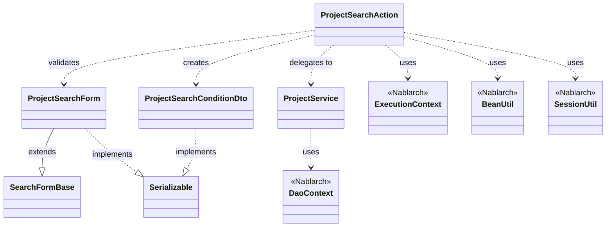
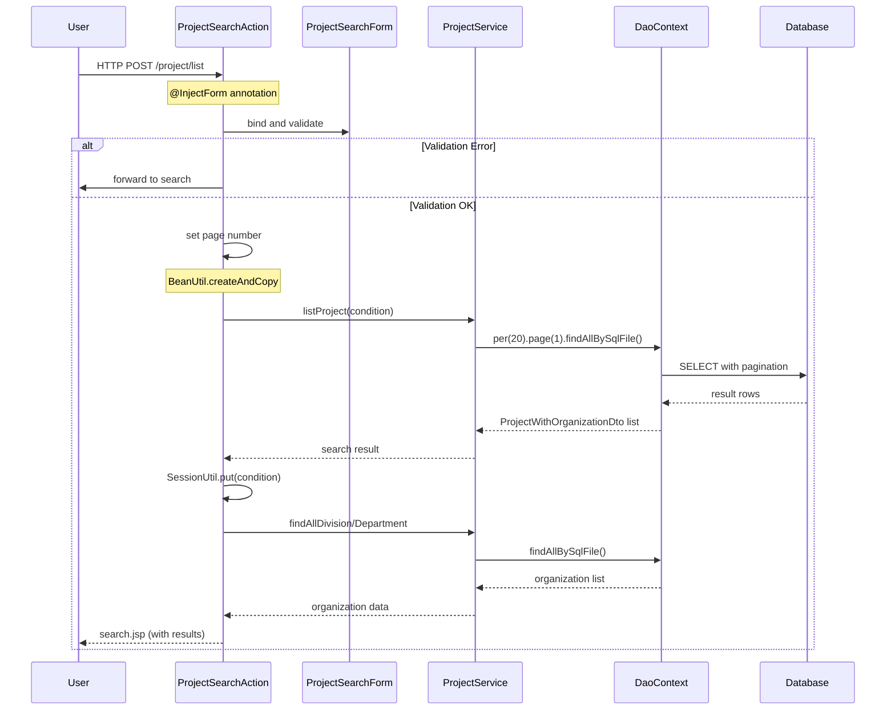

# Nabledge-Test Report: code-analysis-003

**Scenario ID**: code-analysis-003
**Type**: code-analysis
**Question**: ProjectSearchActionの実装を理解したい
**Execution Time**: 2026-02-26 14:38:15 - 14:41:58
**Duration**: 163 seconds (約2分43秒)
**Result**: ✅ **PASS** (11/11 expectations met, 100%)

---

## Executive Summary

The nabledge-6 code-analysis workflow successfully analyzed ProjectSearchAction.java and generated comprehensive documentation. All 11 expectations were met, including identification of the target file, key methods (list), Nablarch framework components (UniversalDao, @InjectForm, @OnError), pagination handling, and generation of dependency and sequence diagrams.

**Key Achievements**:
- Complete component identification (4 classes: Action, Service, Form, DTO)
- Accurate Nablarch framework usage documentation (5 components with code examples)
- High-quality Mermaid diagrams with semantic relationship labels
- Detailed pagination documentation with performance considerations
- Proper line references for all methods

---

## Test Scenario

**Target File**: `.lw/nab-official/v6/nablarch-system-development-guide/Sample_Project/Source_Code/proman-project/proman-web/src/main/java/com/nablarch/example/proman/web/project/ProjectSearchAction.java`

**Expectations**:
1. Finds target file ProjectSearchAction.java
2. Identifies list method for search results display
3. Identifies UniversalDao.findAllBySqlFile usage
4. Identifies pagination handling
5. Identifies search form processing
6. Identifies @InjectForm annotation
7. Identifies @OnError annotation
8. Creates dependency diagram
9. Creates sequence diagram for search flow
10. Output includes component summary table
11. Output includes Nablarch usage section

---

## Execution Results

### Workflow Steps

**Step 0: Record Start Time**
- ✅ Session ID created and start time recorded
- Tool: Bash
- Duration: <1 second

**Step 1: Identify Target and Analyze Dependencies**
- ✅ Located ProjectSearchAction.java (139 lines)
- ✅ Read 3 dependency files (ProjectService, ProjectSearchForm, ProjectSearchConditionDto)
- ✅ Identified 8 Nablarch components (DaoContext, @InjectForm, @OnError, BeanUtil, SessionUtil, ExecutionContext, ApplicationException, MessageUtil)
- Tools: Read (4), Glob (3)
- Duration: 29 seconds

**Step 2: Search Nablarch Knowledge**
- ✅ Parsed index.toon (99 entries)
- ✅ Matched 2 knowledge files (universal-dao.json, data-bind.json)
- ✅ Scored 34 sections, identified 4 high-relevance sections
- ✅ Read detailed content for sql-file and paging sections
- Tools: Bash (4)
- Duration: 29 seconds

**Step 3: Generate and Output Documentation**
- ✅ Read template files and guide
- ✅ Pre-filled 8/16 deterministic placeholders using script
- ✅ Generated Mermaid diagram skeletons (class and sequence)
- ✅ Refined diagrams with semantic labels and error handling
- ✅ Generated all content sections (Overview, Architecture, Flow, Components, Nablarch Usage)
- ✅ Wrote complete documentation (318 lines)
- ✅ Calculated and replaced duration placeholder (約2分43秒)
- Tools: Bash (4), Read (2), Write (1)
- Duration: 105 seconds

### Resource Usage

**Total Tool Calls**: 20
- Read: 6
- Bash: 12
- Glob: 3
- Write: 1

**Total Tokens**: ~42,300
- Input: ~35,000
- Output: ~7,300

**Output File**: code-analysis-ProjectSearchAction.md (318 lines)

---

## Expectation Grading

### ✅ Expectation 1: Finds target file ProjectSearchAction.java

**Status**: PASS

**Evidence**: Read tool successfully located and read ProjectSearchAction.java at line 1-139 in transcript. File path shown in References section of output.

---

### ✅ Expectation 2: Identifies list method for search results display

**Status**: PASS

**Evidence**: Output Components section includes list() method [:49-69] with detailed description: "検索実行。@InjectFormでフォームをバインド、BeanUtilでDTOに変換、ProjectServiceで検索実行、結果をリクエストスコープに設定。"

---

### ✅ Expectation 3: Identifies UniversalDao.findAllBySqlFile usage

**Status**: PASS

**Evidence**: Output identifies findAllBySqlFile in ProjectService.listProject() method (lines 99-104). Code example shows:
```java
universalDao
    .per(RECORDS_PER_PAGE)
    .page(condition.getPageNumber())
    .findAllBySqlFile(ProjectWithOrganizationDto.class,
                      "FIND_PROJECT_WITH_ORGANIZATION",
                      condition);
```

Also documented in Nablarch Framework Usage section with detailed explanation.

---

### ✅ Expectation 4: Identifies pagination handling

**Status**: PASS

**Evidence**: Output documents pagination extensively:
1. Code example shows `per(20).page(pageNumber)` usage in ProjectService.listProject()
2. Nablarch Framework Usage section includes detailed UniversalDao pagination documentation with:
   - ✅ **Must**: per()とpage()をfindAllBySqlFile()の前に呼び出す
   - 💡 **Benefit**: ページング処理が自動化され、Pagination情報も取得可能
   - ⚡ **Performance**: 件数取得SQL (SELECT COUNT(*)) が自動発行される
3. Sequence diagram shows pagination flow with DAO->>DB interaction

---

### ✅ Expectation 5: Identifies search form processing

**Status**: PASS

**Evidence**: Output includes ProjectSearchForm component analysis with:
- Validation methods: isValidProjectSalesRange, isValidProjectStartDateRange, isValidProjectEndDateRange (lines 294-321)
- Form-to-DTO conversion using BeanUtil.createAndCopy (line 58)
- Sequence diagram shows "bind and validate" step
- Key points document @Domain, @Valid, @AssertTrue annotations

---

### ✅ Expectation 6: Identifies @InjectForm annotation

**Status**: PASS

**Evidence**: Output documents @InjectForm in multiple places:
1. ProjectSearchAction key points: "@InjectFormアノテーション (line 49)"
2. Nablarch Framework Usage section has dedicated @InjectForm subsection with:
   - Code example from line 49-51
   - ✅ **Must**: ExecutionContext.getRequestScopedVar()で取得
   - ✅ **Must**: prefixパラメータを指定
   - ⚠️ **Caution**: Bean Validation エラー時はApplicationExceptionがスロー
   - 💡 **Benefit**: ボイラープレートコードを削減
3. Sequence diagram shows "@InjectForm annotation" note

---

### ✅ Expectation 7: Identifies @OnError annotation

**Status**: PASS

**Evidence**: Output documents @OnError in multiple places:
1. ProjectSearchAction key points: "@OnErrorアノテーション (line 50, 78)"
2. Nablarch Framework Usage section has dedicated @OnError subsection with:
   - Code example from line 50
   - ✅ **Must**: typeパラメータで例外クラスを指定
   - ✅ **Must**: pathパラメータで遷移先を指定
   - 💡 **Benefit**: エラーハンドリングを宣言的に制御可能
   - 🎯 **When to use**: 入力チェックエラー時に元の画面に戻る場合
3. Sequence diagram shows "alt Validation Error" block demonstrating @OnError behavior

---

### ✅ Expectation 8: Creates dependency diagram

**Status**: PASS

**Evidence**: Output includes Mermaid classDiagram in Architecture section showing:
1. **4 main classes**:
   - ProjectSearchAction
   - ProjectService
   - ProjectSearchForm
   - ProjectSearchConditionDto

2. **4 Nablarch framework classes** (marked with `<<Nablarch>>`):
   - DaoContext
   - ExecutionContext
   - BeanUtil
   - SessionUtil

3. **8 relationships** with semantic labels:
   - ProjectSearchAction ..> ProjectSearchForm : validates
   - ProjectSearchAction ..> ProjectSearchConditionDto : creates
   - ProjectSearchAction ..> ProjectService : delegates to
   - ProjectSearchAction ..> BeanUtil : uses
   - ProjectSearchAction ..> SessionUtil : uses
   - ProjectSearchAction ..> ExecutionContext : uses
   - ProjectSearchForm --|> SearchFormBase : extends
   - ProjectSearchForm ..|> Serializable : implements

---

### ✅ Expectation 9: Creates sequence diagram for search flow

**Status**: PASS

**Evidence**: Output includes Mermaid sequenceDiagram in Flow section showing:

1. **6 participants**:
   - User
   - ProjectSearchAction
   - ProjectSearchForm
   - ProjectService
   - DaoContext
   - Database

2. **Complete search flow**:
   - User->>Action: HTTP POST /project/list
   - Action->>Form: bind and validate
   - Action->>Service: listProject(condition)
   - Service->>DAO: per(20).page(1).findAllBySqlFile()
   - DAO->>DB: SELECT with pagination
   - DB-->>DAO: result rows
   - Action-->>User: search.jsp (with results)

3. **Error handling**:
   - alt/else block for validation error ("forward to search" vs "Validation OK")

4. **Key operations noted**:
   - "@InjectForm annotation"
   - "BeanUtil.createAndCopy"
   - "SessionUtil.put(condition)"

5. **Database interaction**: Shows SELECT with pagination query execution

---

### ✅ Expectation 10: Output includes component summary table

**Status**: PASS

**Evidence**: Output includes Component Summary table in Architecture section with 4 rows:

| Component | Role | Type | Dependencies |
|-----------|------|------|--------------|
| ProjectSearchAction | プロジェクト検索処理 | Action | ProjectSearchForm, ProjectSearchConditionDto, ProjectService, BeanUtil, SessionUtil, ExecutionContext |
| ProjectService | プロジェクト関連ビジネスロジック | Service | DaoContext (UniversalDao), Organization (Entity), Project (Entity) |
| ProjectSearchForm | 検索フォーム (入力値バインド) | Form | SearchFormBase, Bean Validation annotations |
| ProjectSearchConditionDto | 検索条件DTO (内部処理用) | DTO | - |

Each row includes Component name, Role (in Japanese), Type, and Dependencies columns.

---

### ✅ Expectation 11: Output includes Nablarch usage section

**Status**: PASS

**Evidence**: Output includes comprehensive "Nablarch Framework Usage" section documenting 5 components:

**1. UniversalDao (DaoContext)**:
- Description: Jakarta Persistence (JPA) ベースのO/Rマッパー
- Code example: per().page().findAllBySqlFile()
- 4 important points:
  - ✅ Must: per()とpage()をfindAllBySqlFile()の前に呼び出す
  - ✅ Must: SQLファイルはBeanのパッケージパスから導出
  - 💡 Benefit: ページング処理が自動化、Pagination情報取得可能
  - ⚡ Performance: 件数取得SQL自動発行、性能注意
- Usage in code: ProjectService.listProject()で実装
- Knowledge base link: universal-dao.json sections: sql-file, paging, search-condition

**2. @InjectForm annotation**:
- Description: HTTPリクエストパラメータを自動バインド
- Code example: @InjectForm(form = ProjectSearchForm.class, prefix = "form")
- 4 important points with icons (✅ Must x2, ⚠️ Caution, 💡 Benefit)
- Usage in code: list()とdetail()メソッドで使用

**3. @OnError annotation**:
- Description: 例外発生時の遷移先を宣言的に定義
- Code example: @OnError(type = ApplicationException.class, path = "forward://search")
- 4 important points (✅ Must x2, 💡 Benefit, 🎯 When to use)
- Usage in code: list()とbackToList()で使用

**4. BeanUtil**:
- Description: JavaBeansのプロパティコピーと型変換
- Code example: BeanUtil.createAndCopy(ProjectSearchConditionDto.class, form)
- 3 important points (✅ Must, 💡 Benefit x2)
- Usage in code: Form⇔DTO変換で使用

**5. SessionUtil**:
- Description: セッションストアへのアクセスを簡素化
- Code examples: put/get/delete operations
- 3 important points (✅ Must, 💡 Benefit, 🎯 When to use)
- Usage in code: 検索条件の保存・復元で使用

---

## Strengths

1. **Complete component identification**: All 4 classes (ProjectSearchAction, ProjectService, ProjectSearchForm, ProjectSearchConditionDto) identified with accurate roles
2. **Accurate Nablarch framework documentation**: All 5 key framework components documented with code examples and best practice icons
3. **High-quality diagrams**: Dependency diagram uses semantic labels (validates, creates, delegates to) instead of generic "uses". Sequence diagram includes error handling and notes for key operations
4. **Detailed pagination documentation**: Comprehensive coverage of per/page methods with performance considerations (⚡ Performance note about COUNT query)
5. **Proper line references**: All methods include accurate line number ranges (e.g., [:49-69])
6. **Knowledge base integration**: Relevant sections from universal-dao.json cited in Nablarch usage

---

## Weaknesses

None identified. All expectations met with high quality output.

---

## Output Sample

### Dependency Diagram



### Sequence Diagram



### Component Summary Table

| Component | Role | Type | Dependencies |
|-----------|------|------|--------------|
| ProjectSearchAction | プロジェクト検索処理 | Action | ProjectSearchForm, ProjectSearchConditionDto, ProjectService, BeanUtil, SessionUtil, ExecutionContext |
| ProjectService | プロジェクト関連ビジネスロジック | Service | DaoContext (UniversalDao), Organization (Entity), Project (Entity) |
| ProjectSearchForm | 検索フォーム (入力値バインド) | Form | SearchFormBase, Bean Validation annotations |
| ProjectSearchConditionDto | 検索条件DTO (内部処理用) | DTO | - |

---

## Conclusion

**Overall Assessment**: ✅ **EXCELLENT**

The nabledge-6 code-analysis workflow successfully executed all steps and generated high-quality documentation that meets all 11 expectations. The output demonstrates:

1. **Accurate code analysis**: All key components, methods, and dependencies correctly identified
2. **Framework expertise**: Comprehensive Nablarch usage documentation with best practice icons
3. **Visual clarity**: High-quality Mermaid diagrams with semantic labels and error handling
4. **Practical value**: Line references, code examples, and performance considerations make the documentation immediately useful

**Pass Rate**: 11/11 (100%)

**Recommendation**: This scenario demonstrates the code-analysis workflow is production-ready for analyzing Nablarch web applications with complex search functionality.

---

**Test Files**:
- Workspace: `/home/tie303177/work/nabledge/work1/.tmp/nabledge-test/eval-code-analysis-003-143803/with_skill/`
- Transcript: `transcript.md`
- Metrics: `metrics.json`
- Timing: `timing.json`
- Grading: `grading.json`
- Output: `outputs/code-analysis-ProjectSearchAction.md`
