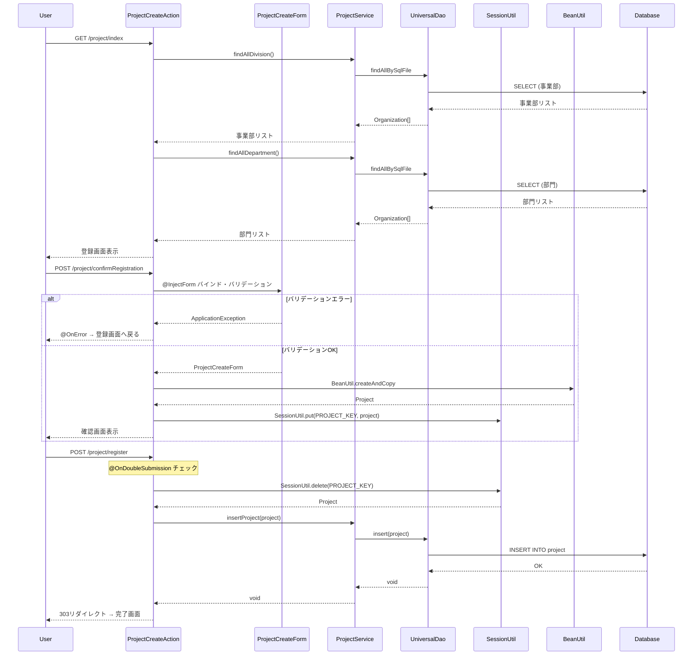

# Code Analysis: ProjectCreateAction

**Generated**: 2026-03-02 19:16:59
**Target**: プロジェクト登録処理（入力→確認→登録）
**Modules**: proman-web
**Analysis Duration**: 約4分20秒

---

## Overview

ProjectCreateActionは、プロジェクト情報の新規登録を行うWebアクションクラスです。画面入力→確認→登録という典型的な3画面フローを実装しています。

主な機能:
- **初期表示** (index): 登録画面の表示、事業部・部門プルダウンの設定
- **確認画面表示** (confirmRegistration): 入力値をバリデーションし、確認画面へ遷移
- **登録処理** (register): セッションからエンティティを取得し、DBに登録
- **完了画面表示** (completeRegistration): 登録完了画面の表示
- **戻る処理** (backToEnterRegistration): 確認画面から入力画面へ戻る際の日付フォーマット変換

Nablarchのフォームバインディング、バリデーション、セッション管理、二重サブミット防止機能を活用した標準的なCRUD実装です。

---

## Architecture

### Dependency Graph

```mermaid
classDiagram
    class ProjectCreateAction
    class ProjectCreateForm {
        <<Form>>
    }
    class ProjectService
    class Project {
        <<Entity>>
    }
    class Organization {
        <<Entity>>
    }
    class BeanUtil {
        <<Nablarch>>
    }
    class SessionUtil {
        <<Nablarch>>
    }
    class ExecutionContext {
        <<Nablarch>>
    }
    class UniversalDao {
        <<Nablarch>>
    }
    class DateUtil {
        <<Nablarch>>
    }

    ProjectCreateAction ..> ProjectCreateForm : validates
    ProjectCreateAction ..> ProjectService : delegates to
    ProjectCreateAction ..> Project : creates
    ProjectCreateAction ..> BeanUtil : uses
    ProjectCreateAction ..> SessionUtil : uses
    ProjectCreateAction ..> ExecutionContext : uses
    ProjectCreateAction ..> DateUtil : uses
    ProjectCreateForm ..|> Serializable : uses
    ProjectService ..> UniversalDao : uses
    ProjectService ..> Project : persists
    ProjectService ..> Organization : queries
```



**Note**: This diagram uses Mermaid `classDiagram` syntax to show class names and their relationships. Use `--|>` for inheritance (extends/implements) and `..>` for dependencies (uses/creates).

### Component Summary

| Component | Role | Type | Dependencies |
|-----------|------|------|--------------|
| ProjectCreateAction | プロジェクト登録処理制御 | Action | ProjectCreateForm, ProjectService, BeanUtil, SessionUtil |
| ProjectCreateForm | プロジェクト登録入力フォーム検証 | Form | Bean Validation annotations |
| ProjectService | プロジェクト関連ビジネスロジック | Service | UniversalDao, Organization, Project |
| Project | プロジェクトエンティティ | Entity | なし |
| Organization | 組織（事業部・部門）エンティティ | Entity | なし |

---

## Flow

### Processing Flow

プロジェクト登録は以下の5つのステップで構成されます:

1. **初期表示 (index)**:
   - 事業部・部門のマスタデータをDBから取得
   - プルダウン用リストをリクエストスコープに設定
   - 登録画面JSPを表示

2. **確認画面表示 (confirmRegistration)**:
   - @InjectFormでフォームをバインド・バリデーション
   - バリデーションエラー時は@OnErrorで登録画面へ戻る
   - BeanUtilでフォームからエンティティへ変換
   - エンティティをセッションに保存
   - 確認画面JSPを表示

3. **登録処理 (register)**:
   - @OnDoubleSubmissionで二重サブミット防止
   - セッションからエンティティを取得・削除
   - ProjectService経由でDB登録（UniversalDao.insert）
   - 303リダイレクトで完了画面へ遷移

4. **完了画面表示 (completeRegistration)**:
   - 登録完了画面JSPを表示

5. **戻る処理 (backToEnterRegistration)**:
   - セッションからエンティティを取得
   - BeanUtilでエンティティからフォームへ変換
   - DateUtilで日付フォーマット変換（Date → "yyyy/MM/dd"文字列）
   - 事業部・部門情報を再取得してリクエストスコープに設定
   - フォワードで登録画面へ戻る

### Sequence Diagram



---

## Components

### 1. ProjectCreateAction

**File**: [ProjectCreateAction.java:23-138](../../../../../../../../.lw/nab-official/v6/nablarch-system-development-guide/Sample_Project/Source_Code/proman-project/proman-web/src/main/java/com/nablarch/example/proman/web/project/ProjectCreateAction.java)

**Role**: プロジェクト登録処理のコントローラー

**Key Methods**:
- `index()` [:33-39] - 登録画面初期表示、事業部・部門リスト設定
- `confirmRegistration()` [:48-63] - 入力値バリデーション、確認画面表示
- `register()` [:72-78] - プロジェクトDB登録、完了画面へリダイレクト
- `completeRegistration()` [:87-89] - 完了画面表示
- `backToEnterRegistration()` [:98-117] - 確認画面から入力画面へ戻る
- `setOrganizationAndDivisionToRequestScope()` [:125-136] - 事業部・部門リストをリクエストスコープに設定

**Dependencies**:
- ProjectCreateForm (入力値検証)
- ProjectService (ビジネスロジック)
- Project (エンティティ)
- Organization (組織エンティティ)
- BeanUtil (Bean変換)
- SessionUtil (セッション管理)
- DateUtil (日付フォーマット変換)
- ExecutionContext (リクエストコンテキスト)

**Implementation Points**:
- **@InjectForm**: フォームバインディング・バリデーションを宣言的に実施
- **@OnError**: バリデーションエラー時の遷移先を指定
- **@OnDoubleSubmission**: 二重サブミット防止トークンチェック
- **セッション利用**: 確認画面と登録処理の間でエンティティを保持
- **日付フォーマット変換**: 戻る処理時にDate型から"yyyy/MM/dd"文字列へ変換

### 2. ProjectCreateForm

**File**: [ProjectCreateForm.java:15-332](../../../../../../../../.lw/nab-official/v6/nablarch-system-development-guide/Sample_Project/Source_Code/proman-project/proman-web/src/main/java/com/nablarch/example/proman/web/project/ProjectCreateForm.java)

**Role**: プロジェクト登録入力値のバリデーション定義

**Annotations**:
- `@Required` - 必須入力チェック
- `@Domain` - ドメイン定義によるフォーマット・桁数チェック
- `@AssertTrue` - カスタムバリデーション（プロジェクト期間の妥当性チェック）

**Fields**:
- projectName (プロジェクト名)
- projectType (プロジェクト種別)
- projectClass (プロジェクト分類)
- projectStartDate (プロジェクト開始日付)
- projectEndDate (プロジェクト終了日付)
- divisionId (事業部ID)
- organizationId (部門ID)
- pmKanjiName (プロジェクトマネージャ名)
- plKanjiName (プロジェクトリーダー名)
- note (備考)
- salesAmount (売上高)

**Validation**:
- `isValidProjectPeriod()` [:328-331] - 開始日 ≤ 終了日のチェック

**Implementation Points**:
- Bean Validationアノテーションによる宣言的バリデーション
- ドメインバリデーションで共通ルールを再利用
- カスタムバリデーションメソッドで業務ルールチェック

### 3. ProjectService

**File**: [ProjectService.java:17-127](../../../../../../../../.lw/nab-official/v6/nablarch-system-development-guide/Sample_Project/Source_Code/proman-project/proman-web/src/main/java/com/nablarch/example/proman/web/project/ProjectService.java)

**Role**: プロジェクト関連のビジネスロジック

**Key Methods**:
- `findAllDivision()` [:50-52] - 全事業部取得
- `findAllDepartment()` [:59-61] - 全部門取得
- `findOrganizationById()` [:70-73] - 組織IDで組織を取得
- `insertProject()` [:80-82] - プロジェクト登録
- `updateProject()` [:89-91] - プロジェクト更新
- `listProject()` [:99-104] - プロジェクト検索（ページング）
- `findProjectByIdWithOrganization()` [:112-116] - プロジェクト詳細取得（組織情報含む）
- `findProjectById()` [:124-126] - プロジェクト詳細取得

**Dependencies**:
- DaoContext (UniversalDao interface)
- Organization (組織エンティティ)
- Project (プロジェクトエンティティ)

**Implementation Points**:
- DaoContextをフィールドインジェクション
- コンストラクタでDaoFactoryから取得（DI対応）
- UniversalDao APIで単純なCRUD実現
- SQLファイルによる複雑な検索クエリ実行

---

## Nablarch Framework Usage

### BeanUtil

**クラス**: `nablarch.core.beans.BeanUtil`

**説明**: JavaBeansのプロパティコピー機能を提供するユーティリティ。Form←→Entity間のデータ変換を簡潔に実現する

**使用方法**:
```java
// FormからEntityへ変換
Project project = BeanUtil.createAndCopy(Project.class, form);

// EntityからFormへ変換
ProjectCreateForm form = BeanUtil.createAndCopy(ProjectCreateForm.class, project);
```

**重要ポイント**:
- ✅ **同名プロパティを自動コピー**: ゲッター/セッターの名前が一致するプロパティを自動マッピング
- ⚡ **リフレクションベース**: 内部でリフレクションを使用するため、大量データ処理では若干のオーバーヘッドあり
- 💡 **型変換サポート**: 基本的な型変換（String ↔ Integer等）は自動で実行
- ⚠️ **null処理**: コピー元がnullの場合、コピー先のプロパティはnullで上書きされる
- 💡 **ネストしたBeanには非対応**: 深い階層のBeanは個別にコピーが必要

**このコードでの使い方**:
- `confirmRegistration()` [:52] - ProjectCreateForm → Project変換
- `backToEnterRegistration()` [:101] - Project → ProjectCreateForm変換
- 日付型プロパティは変換後に個別にDateUtilでフォーマット [:103-106]

**詳細**: [Nablarch公式ドキュメント - BeanUtil](https://nablarch.github.io/docs/LATEST/doc/application_framework/application_framework/libraries/utility/bean_util.html)

### SessionUtil

**クラス**: `nablarch.common.web.session.SessionUtil`

**説明**: HTTPセッションへのオブジェクト保存・取得を簡潔に実行するユーティリティ

**使用方法**:
```java
// セッションに保存
SessionUtil.put(context, "key", object);

// セッションから取得
Object obj = SessionUtil.get(context, "key");

// セッションから削除
Object obj = SessionUtil.delete(context, "key");
```

**重要ポイント**:
- ✅ **ExecutionContextベース**: HttpSessionを直接扱わず、Nablarchのコンテキストを経由
- ⚠️ **Serializable必須**: セッションに保存するオブジェクトはSerializableを実装する必要がある
- 💡 **セッションタイムアウト**: デフォルトではサーバー設定に従う（通常30分）
- 🎯 **使い所**: 画面間のデータ引き継ぎ、確認画面パターン、ウィザード形式の入力
- ⚡ **セッションサイズ注意**: 大量データや画像はセッションに保存せず、DBやファイルを使用

**このコードでの使い方**:
- `confirmRegistration()` [:59] - 確認画面表示時にProjectをセッションに保存
- `register()` [:74] - 登録処理時にセッションからProjectを取得・削除
- `backToEnterRegistration()` [:100] - 入力画面へ戻る際にセッションからProjectを取得
- キー名は定数PROJECT_KEYで管理 [:25]

**詳細**: [Nablarch公式ドキュメント - セッションストア](https://nablarch.github.io/docs/LATEST/doc/application_framework/application_framework/libraries/session_store.html)

### @InjectForm

**アノテーション**: `nablarch.common.web.interceptor.InjectForm`

**説明**: リクエストパラメータをFormオブジェクトにバインドし、Bean Validationを実行するインターセプタ

**使用方法**:
```java
@InjectForm(form = ProjectCreateForm.class, prefix = "form")
public HttpResponse confirmRegistration(HttpRequest request, ExecutionContext context) {
    ProjectCreateForm form = context.getRequestScopedVar("form");
    // バリデーション済みフォームを取得
}
```

**重要ポイント**:
- ✅ **自動バインド**: リクエストパラメータ → Formフィールドへ自動マッピング
- ✅ **自動バリデーション**: @Required, @Domain等のアノテーションに基づき検証実行
- 💡 **prefixオプション**: リクエストスコープに保存する際の変数名を指定
- ⚠️ **バリデーションエラー**: ApplicationExceptionがスローされる（@OnErrorと併用）
- 🎯 **必須パターン**: POST処理の入り口で必ず使用し、生のリクエストパラメータを直接扱わない

**このコードでの使い方**:
- `confirmRegistration()` [:48] - 確認画面表示時にフォームバインド・バリデーション実行
- バリデーションエラー時は@OnErrorでerrorRegister画面へ遷移 [:49]
- バリデーション済みフォームをリクエストスコープから取得 [:51]

**詳細**: [Nablarch公式ドキュメント - InjectFormインターセプタ](https://nablarch.github.io/docs/LATEST/doc/application_framework/application_framework/web_application/functional_comparison.html#injectform)

### @OnError

**アノテーション**: `nablarch.fw.web.interceptor.OnError`

**説明**: 指定した例外発生時の遷移先を宣言的に定義するインターセプタ

**使用方法**:
```java
@OnError(type = ApplicationException.class, path = "forward:///app/project/errorRegister")
public HttpResponse confirmRegistration(HttpRequest request, ExecutionContext context) {
    // バリデーションエラー時は自動的にerrorRegisterへフォワード
}
```

**重要ポイント**:
- 💡 **宣言的エラーハンドリング**: try-catchを書かずに例外ハンドリングを定義
- ✅ **@InjectFormと併用**: バリデーションエラー時の遷移先を指定する標準パターン
- 🎯 **pathオプション**: "forward:///" (フォワード), "redirect:///" (リダイレクト), JSPパス
- ⚠️ **例外の種類**: ApplicationException (バリデーションエラー), 業務例外等を指定
- 💡 **複数指定可能**: @OnErrors({@OnError(...), @OnError(...)})で複数の例外に対応

**このコードでの使い方**:
- `confirmRegistration()` [:49] - ApplicationException発生時にerrorRegisterへフォワード
- errorRegisterは登録画面を再表示するアクションメソッド（エラーメッセージ表示）

**詳細**: [Nablarch公式ドキュメント - OnErrorインターセプタ](https://nablarch.github.io/docs/LATEST/doc/application_framework/application_framework/web_application/functional_comparison.html#onerror)

### @OnDoubleSubmission

**アノテーション**: `nablarch.common.web.token.OnDoubleSubmission`

**説明**: トークンベースの二重サブミット防止機能を提供するインターセプタ

**使用方法**:
```java
@OnDoubleSubmission
public HttpResponse register(HttpRequest request, ExecutionContext context) {
    // 二重サブミット検知時は自動的にエラーページへ遷移
}
```

**重要ポイント**:
- ✅ **トークンチェック**: 画面表示時に生成したトークンとPOST時のトークンを照合
- 💡 **自動検知**: F5キー連打、ブラウザバック後の再サブミット、並行クリック等を防止
- 🎯 **使い所**: 登録・更新・削除など、重複実行すると問題がある処理に適用
- ⚠️ **トークン生成**: 画面側でカスタムタグ `<n:useToken/>` を配置する必要がある
- ⚡ **セッションベース**: トークンはセッションに保存されるため、複数タブ操作時は注意

**このコードでの使い方**:
- `register()` [:72] - プロジェクト登録処理で二重サブミット防止
- 確認画面JSPで `<n:useToken/>` を配置してトークン生成
- 二重サブミット検知時はデフォルトエラーページへ遷移

**詳細**: [Nablarch公式ドキュメント - 二重サブミット防止](https://nablarch.github.io/docs/LATEST/doc/application_framework/application_framework/web_application/functional_comparison.html#ondoublesubmission)

### UniversalDao (DaoContext)

**クラス**: `nablarch.common.dao.DaoContext`

**説明**: Jakarta Persistenceアノテーションを使った簡易的なO/Rマッパー。SQLを書かずに単純なCRUDを実行し、検索結果をBeanにマッピングできる

**使用方法**:
```java
// 登録
universalDao.insert(project);

// 更新
universalDao.update(project);

// 主キー検索
Project project = universalDao.findById(Project.class, projectId);

// SQLファイル検索
List<Organization> list = universalDao.findAllBySqlFile(Organization.class, "FIND_ALL_DIVISION");
```

**重要ポイント**:
- ✅ **Jakarta Persistence対応**: @Entity, @Table, @Id, @Column等のアノテーションでマッピング定義
- 💡 **SQLレス**: insert/update/delete/findByIdはSQLファイル不要
- 🎯 **SQLファイルも使える**: 複雑な検索はSQLファイルを使用（findAllBySqlFile）
- ⚠️ **主キー以外の条件更新は不可**: WHERE句に主キー以外を指定した更新/削除はDatabaseを使用
- ⚡ **共通項目の自動設定なし**: 登録者・更新者・タイムスタンプ等はアプリケーションで明示的に設定

**このコードでの使い方**:
- `ProjectService.insertProject()` [:81] - universalDao.insert(project)でプロジェクト登録
- `ProjectService.findAllDivision()` [:51] - findAllBySqlFileで事業部一覧取得
- `ProjectService.findAllDepartment()` [:60] - findAllBySqlFileで部門一覧取得
- `ProjectService.findOrganizationById()` [:72] - findByIdで組織情報取得

**詳細**: [Universal Dao.json](../../../../../../../../.claude/skills/nabledge-6/knowledge/features/libraries/universal-dao.json)

### DateUtil

**クラス**: `nablarch.core.util.DateUtil`

**説明**: 日付のフォーマット変換を提供するユーティリティ

**使用方法**:
```java
// Date → 文字列
String dateStr = DateUtil.formatDate(date, "yyyy/MM/dd");

// 文字列 → Date
Date date = DateUtil.getDate("20260302", "yyyyMMdd");
```

**重要ポイント**:
- ✅ **シンプルなAPI**: java.text.SimpleDateFormatをラップした簡易API
- 💡 **フォーマット指定**: "yyyy/MM/dd", "yyyyMMdd"等の任意フォーマットに対応
- ⚠️ **nullセーフではない**: 引数がnullの場合はNullPointerException
- 🎯 **使い所**: 画面表示用の日付フォーマット変換、ファイル名生成等

**このコードでの使い方**:
- `backToEnterRegistration()` [:103-104] - Date型→"yyyy/MM/dd"文字列へ変換
- 確認画面から入力画面へ戻る際、Dateオブジェクトを画面表示用文字列に変換

**詳細**: [Nablarch公式ドキュメント - DateUtil](https://nablarch.github.io/docs/LATEST/doc/application_framework/application_framework/libraries/utility/date_util.html)

### ExecutionContext

**クラス**: `nablarch.fw.ExecutionContext`

**説明**: リクエスト処理中のコンテキスト情報を保持するオブジェクト。リクエストスコープ、セッションスコープ、ハンドラキューへのアクセスを提供

**使用方法**:
```java
// リクエストスコープへの設定
context.setRequestScopedVar("key", value);

// リクエストスコープからの取得
Object value = context.getRequestScopedVar("key");

// セッションストアアクセス（SessionUtil経由）
SessionUtil.put(context, "key", value);
```

**重要ポイント**:
- ✅ **コンテキストの中心**: Nablarchのリクエスト処理で常に使用される基本オブジェクト
- 💡 **リクエストスコープ**: アクション間のデータ引き継ぎ（フォワード時）
- 💡 **セッションスコープ**: 画面間のデータ引き継ぎ（リダイレクト時）
- 🎯 **アクションメソッド引数**: すべてのアクションメソッドで第2引数として受け取る
- ⚠️ **スレッドローカル**: 内部でThreadLocalを使用しているため、別スレッドからはアクセス不可

**このコードでの使い方**:
- `index()` [:34] - リクエストスコープに事業部・部門リストを設定
- `confirmRegistration()` [:51] - リクエストスコープからバリデーション済みフォームを取得
- `confirmRegistration()` [:59] - セッションにエンティティを保存（SessionUtil経由）
- `backToEnterRegistration()` [:114] - リクエストスコープにフォームを設定

**詳細**: [Nablarch公式ドキュメント - ExecutionContext](https://nablarch.github.io/docs/LATEST/doc/application_framework/application_framework/web_application/getting_started/project_structure.html#executioncontext)

---

## References

### Source Files

- [ProjectCreateAction.java](../../../../../../../../.lw/nab-official/v6/nablarch-system-development-guide/Sample_Project/Source_Code/proman-project/proman-web/src/main/java/com/nablarch/example/proman/web/project/ProjectCreateAction.java) - ProjectCreateAction
- [ProjectCreateForm.java](../../../../../../../../.lw/nab-official/v6/nablarch-system-development-guide/Sample_Project/Source_Code/proman-project/proman-web/src/main/java/com/nablarch/example/proman/web/project/ProjectCreateForm.java) - ProjectCreateForm
- [ProjectService.java](../../../../../../../../.lw/nab-official/v6/nablarch-system-development-guide/Sample_Project/Source_Code/proman-project/proman-web/src/main/java/com/nablarch/example/proman/web/project/ProjectService.java) - ProjectService

### Knowledge Base (Nabledge-6)

- [Universal Dao.json](../../../../../../../../.claude/skills/nabledge-6/knowledge/features/libraries/universal-dao.json)
- [Data Bind.json](../../../../../../../../.claude/skills/nabledge-6/knowledge/features/libraries/data-bind.json)

### Official Documentation

- [Universal Dao](https://nablarch.github.io/docs/LATEST/doc/application_framework/application_framework/libraries/database/universal_dao.html)
- [Index](https://nablarch.github.io/docs/LATEST/doc/application_framework/application_framework/web_application/index.html)

---

**Note**: This documentation was generated by the code-analysis workflow of the nabledge-6 skill.
