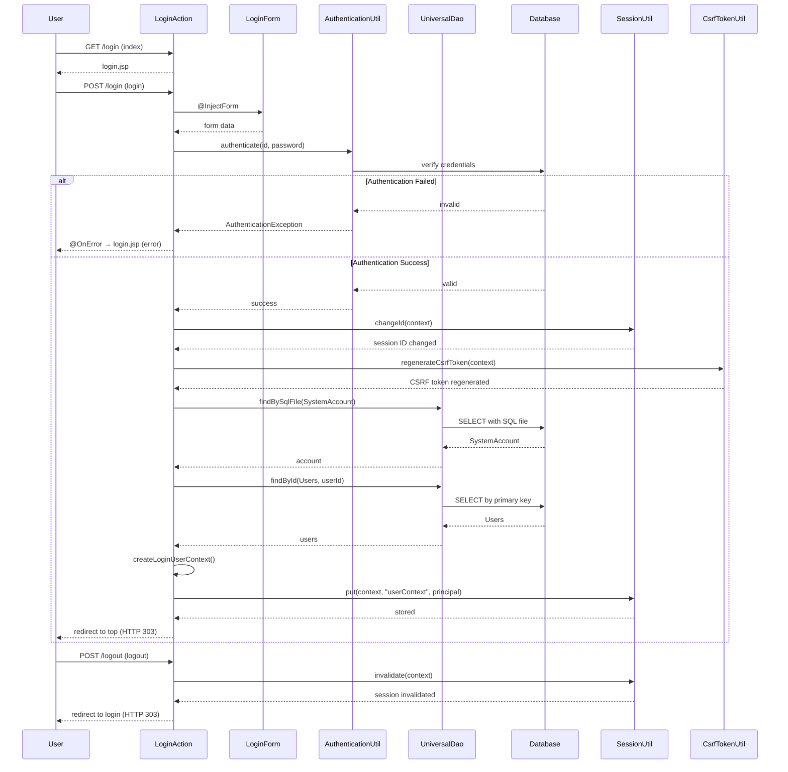

# Code Analysis: LoginAction

**Generated**: 2026-03-02 17:14:11
**Target**: ログイン認証処理
**Modules**: proman-web
**Analysis Duration**: 約2分26秒

---

## Overview

LoginActionは、proman-webモジュールにおけるユーザー認証処理を担当するWebアクションクラスです。

**主要機能**:
- ログイン画面の表示 (`index`メソッド)
- 認証処理とセッション管理 (`login`メソッド)
- ログアウト処理 (`logout`メソッド)

**アーキテクチャ上の位置付け**:
- **Action層**: HTTPリクエストを受け取り、認証ロジックを実行し、レスポンスを返却
- **Nablarch Webフレームワーク**: `@InjectForm`による入力値バインド、`@OnError`によるエラーハンドリング
- **UniversalDao**: データベースからユーザー情報を取得
- **セキュリティ機構**: `AuthenticationUtil`による認証、`SessionUtil`によるセッションID変更、`CsrfTokenUtil`によるCSRFトークン再生成

**設計パターン**:
- MVCパターンのController層として機能
- 認証後にセッションIDを変更することでセッション固定攻撃を防止
- CSRFトークンを再生成することでセキュリティを強化

---

## Architecture

### Dependency Graph

```mermaid
classDiagram
    class LoginAction {
        <<Action>>
    }
    class LoginForm {
        <<Form>>
    }
    class SystemAccount {
        <<Entity>>
    }
    class Users {
        <<Entity>>
    }
    class LoginUserPrincipal {
        <<Principal>>
    }
    class UniversalDao {
        <<Nablarch>>
    }
    class AuthenticationUtil {
        <<Nablarch>>
    }
    class SessionUtil {
        <<Nablarch>>
    }
    class CsrfTokenUtil {
        <<Nablarch>>
    }
    class ExecutionContext {
        <<Nablarch>>
    }

    LoginAction ..> LoginForm : validates
    LoginAction ..> SystemAccount : queries
    LoginAction ..> Users : queries
    LoginAction ..> LoginUserPrincipal : creates
    LoginAction ..> UniversalDao : uses
    LoginAction ..> AuthenticationUtil : invokes
    LoginAction ..> SessionUtil : uses
    LoginAction ..> CsrfTokenUtil : uses
    LoginAction ..> ExecutionContext : uses
    LoginForm ..|> Serializable : implements
```



**Note**: This diagram uses Mermaid `classDiagram` syntax to show class names and their relationships. Use `--|>` for inheritance (extends/implements) and `..>` for dependencies (uses/creates).

### Component Summary

| Component | Role | Type | Dependencies |
|-----------|------|------|--------------|
| LoginAction | 認証アクション | Action | LoginForm, SystemAccount, Users, LoginUserPrincipal, UniversalDao, AuthenticationUtil, SessionUtil, CsrfTokenUtil, ExecutionContext |
| LoginForm | ログイン入力フォーム | Form | なし (Bean Validation) |
| SystemAccount | システムアカウントエンティティ | Entity | なし |
| Users | ユーザーエンティティ | Entity | なし |
| LoginUserPrincipal | 認証情報コンテキスト | Principal | SystemAccount, Users |

---

## Flow

### Processing Flow

**1. ログイン画面表示 (`index`メソッド)**
- HTTPリクエストを受け取る
- ログイン画面JSPを返却

**2. ログイン認証 (`login`メソッド)**
- `@InjectForm`により`LoginForm`をリクエストスコープから取得
- `AuthenticationUtil.authenticate()`でログインIDとパスワードを検証
  - 認証失敗時: `AuthenticationException`をキャッチし、`ApplicationException`をスロー
  - `@OnError`により`/WEB-INF/view/login/login.jsp`に遷移
- 認証成功時:
  - `SessionUtil.changeId()`でセッションIDを変更 (セッション固定攻撃対策)
  - `CsrfTokenUtil.regenerateCsrfToken()`でCSRFトークンを再生成
  - `createLoginUserContext()`でログインユーザー情報を生成
  - `SessionUtil.put()`でセッションに認証情報を格納
  - トップ画面へリダイレクト (HTTP 303)

**3. ログアウト処理 (`logout`メソッド)**
- `SessionUtil.invalidate()`でセッションを無効化
- ログイン画面へリダイレクト

### Sequence Diagram



---

## Components

### 1. LoginAction

**Location**: [LoginAction.java](../../../../../../../../.lw/nab-official/v6/nablarch-system-development-guide/Sample_Project/Source_Code/proman-project/proman-web/src/main/java/com/nablarch/example/proman/web/login/LoginAction.java)

**Role**: 認証アクション (ログイン・ログアウト処理)

**Key Methods**:
- `index(HttpRequest, ExecutionContext)` [:38-40] - ログイン画面を表示
- `login(HttpRequest, ExecutionContext)` [:49-71] - ログイン認証処理
- `createLoginUserContext(String)` [:79-93] - 認証情報を生成
- `logout(HttpRequest, ExecutionContext)` [:102-106] - ログアウト処理

**Dependencies**:
- `LoginForm` - ログイン入力フォーム
- `SystemAccount` - システムアカウントエンティティ
- `Users` - ユーザーエンティティ
- `UniversalDao` - データベースアクセス (Nablarch)
- `AuthenticationUtil` - 認証処理 (プロジェクト共通)
- `SessionUtil` - セッション管理 (Nablarch)
- `CsrfTokenUtil` - CSRFトークン管理 (Nablarch)
- `ExecutionContext` - リクエストコンテキスト (Nablarch)

**Key Implementation Points**:
- `@InjectForm`でフォームデータを自動バインド
- `@OnError`で認証失敗時のエラー画面遷移を定義
- 認証成功後にセッションIDを変更してセッション固定攻撃を防止
- CSRFトークンを再生成してセキュリティを強化
- 認証情報をセッションに格納して以降のリクエストで利用

### 2. LoginForm

**Location**: [LoginForm.java](../../../../../../../../.lw/nab-official/v6/nablarch-system-development-guide/Sample_Project/Source_Code/proman-project/proman-web/src/main/java/com/nablarch/example/proman/web/login/LoginForm.java)

**Role**: ログイン入力フォーム (Bean Validation)

**Key Fields**:
- `loginId` [:21-23] - ログインID (`@Required`, `@Domain("loginId")`)
- `userPassword` [:25-28] - パスワード (`@Required`, `@Domain("userPassword")`)

**Dependencies**: なし (Bean Validationアノテーションのみ)

**Key Implementation Points**:
- `Serializable`を実装してセッション保存可能
- `@Required`で必須入力を検証
- `@Domain`でドメイン定義に基づくバリデーション

### 3. SystemAccount / Users (Entities)

**Role**: データベーステーブルとマッピングされるエンティティ

**Usage in LoginAction**:
- `SystemAccount`: ログインIDから検索し、ユーザーIDを取得
- `Users`: ユーザーIDから検索し、氏名やPM権限を取得

**Key Implementation Points**:
- Jakarta Persistence (JPA) アノテーションでテーブルマッピング
- UniversalDaoでCRUD操作

---

## Nablarch Framework Usage

### UniversalDao

**クラス**: `nablarch.common.dao.UniversalDao`

**説明**: Jakarta Persistenceアノテーションを使った簡易的なO/Rマッパー。SQLを書かずに単純なCRUDを実行し、検索結果をBeanにマッピングできる。

**使用方法**:
```java
// SQLファイルによる検索
SystemAccount account = UniversalDao.findBySqlFile(
    SystemAccount.class,
    "FIND_SYSTEM_ACCOUNT_BY_AK",
    new Object[]{loginId}
);

// 主キーによる検索
Users users = UniversalDao.findById(Users.class, account.getUserId());
```

**重要ポイント**:
- ✅ **SQLファイルによる柔軟な検索**: `findBySqlFile()`で任意のSQLを実行し、結果をBeanにマッピング
- ✅ **主キー検索の簡潔さ**: `findById()`で主キー指定の検索を1行で実現
- ⚠️ **主キー以外の条件**: 主キー以外の条件を指定した更新/削除は不可 (Databaseを使用)
- 💡 **設計方針**: ユニバーサルDAOで実現できない場合は、素直にDatabaseを使う
- 🎯 **使い分け**: 単純なCRUDはUniversalDao、複雑なSQLや更新条件はDatabase

**このコードでの使い方**:
- `createLoginUserContext()`で`findBySqlFile()`により認証済みユーザーのアカウント情報を取得
- `findById()`により主キー (ユーザーID) でユーザー詳細情報を取得
- SQLファイル (`FIND_SYSTEM_ACCOUNT_BY_AK`) でログインIDを検索条件とした検索を実現

**詳細**: [ユニバーサルDAO知識ベース](../../.claude/skills/nabledge-6/knowledge/features/libraries/universal-dao.json)

### @InjectForm

**クラス**: `nablarch.common.web.interceptor.InjectForm`

**説明**: リクエストパラメータをフォームBeanにバインドし、Bean Validationによる入力チェックを実行する。

**使用方法**:
```java
@OnError(type = ApplicationException.class, path = "/WEB-INF/view/login/login.jsp")
@InjectForm(form = LoginForm.class)
public HttpResponse login(HttpRequest request, ExecutionContext context) {
    LoginForm form = context.getRequestScopedVar("form");
    // ...
}
```

**重要ポイント**:
- ✅ **宣言的なバインド**: アノテーションでフォームクラスを指定するだけで自動バインド
- ✅ **Bean Validation連携**: `@Required`, `@Domain`等のアノテーションで入力チェック
- ⚠️ **エラー時の動作**: バリデーションエラー時は`ApplicationException`がスローされる (`@OnError`で処理)
- 💡 **リクエストスコープ**: バインド後のフォームBeanは`context.getRequestScopedVar("form")`で取得
- 🎯 **画面遷移**: `@OnError`と組み合わせることでバリデーションエラー時の遷移先を指定

**このコードでの使い方**:
- `login()`メソッドで`@InjectForm(form = LoginForm.class)`により`LoginForm`を自動バインド
- `@OnError`で`ApplicationException`発生時に`login.jsp`へ遷移
- `context.getRequestScopedVar("form")`でバインド済みフォームを取得

### SessionUtil / CsrfTokenUtil

**クラス**: `nablarch.common.web.session.SessionUtil`, `nablarch.common.web.csrf.CsrfTokenUtil`

**説明**:
- `SessionUtil`: HTTPセッションへのアクセスとセッションID変更機能を提供
- `CsrfTokenUtil`: CSRFトークンの生成・検証機能を提供

**使用方法**:
```java
// セッションID変更 (セッション固定攻撃対策)
SessionUtil.changeId(context);

// CSRFトークン再生成
CsrfTokenUtil.regenerateCsrfToken(context);

// セッションへのオブジェクト格納
SessionUtil.put(context, "userContext", userContext);

// セッション無効化
SessionUtil.invalidate(context);
```

**重要ポイント**:
- ✅ **セッション固定攻撃対策**: 認証後に`changeId()`でセッションIDを変更
- ✅ **CSRF対策**: 認証後にトークンを再生成して前のトークンを無効化
- ⚠️ **タイミング**: セッションID変更とCSRFトークン再生成は認証成功直後に実行
- 💡 **セキュリティベストプラクティス**: 認証後は必ずセッションIDとCSRFトークンを変更
- 🎯 **ログアウト**: `invalidate()`でセッション全体を無効化

**このコードでの使い方**:
- 認証成功時に`SessionUtil.changeId()`でセッションIDを変更
- `CsrfTokenUtil.regenerateCsrfToken()`でCSRFトークンを再生成
- `SessionUtil.put()`で認証情報 (`LoginUserPrincipal`) をセッションに格納
- ログアウト時に`SessionUtil.invalidate()`でセッションを無効化

---

## References

### Source Files

- [LoginAction.java](../../../../../../../../.lw/nab-official/v6/nablarch-system-development-guide/Sample_Project/Source_Code/proman-project/proman-web/src/main/java/com/nablarch/example/proman/web/login/LoginAction.java) - LoginAction
- [LoginForm.java](../../../../../../../../.lw/nab-official/v6/nablarch-system-development-guide/Sample_Project/Source_Code/proman-project/proman-web/src/main/java/com/nablarch/example/proman/web/login/LoginForm.java) - LoginForm

### Knowledge Base (Nabledge-6)

- [Universal Dao.json](../../../../../../../../.claude/skills/nabledge-6/knowledge/features/libraries/universal-dao.json)
- [Data Bind.json](../../../../../../../../.claude/skills/nabledge-6/knowledge/features/libraries/data-bind.json)

### Official Documentation

(No official documentation links available)

---

**Note**: This documentation was generated by the code-analysis workflow of the nabledge-6 skill.
