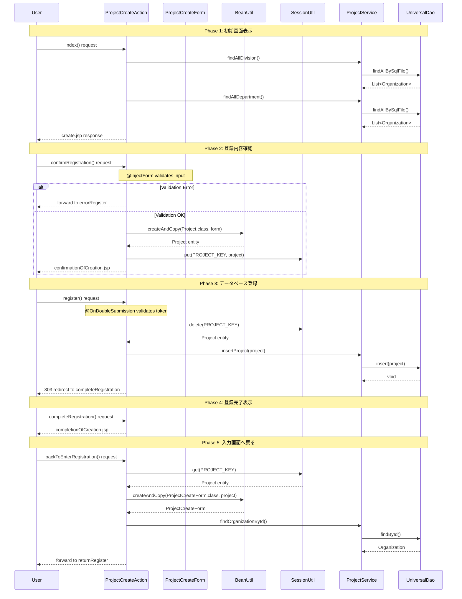

# Code Analysis: ProjectCreateAction

**Generated**: 2026-03-02 17:21:19
**Target**: プロジェクト登録処理
**Modules**: proman-web, proman-common
**Analysis Duration**: 約3分57秒

---

## Overview

ProjectCreateActionは、Webアプリケーションにおけるプロジェクト登録処理を実装するアクションクラスです。ユーザーからの入力を受け取り、フォームバリデーション、セッション管理、データベース登録を行い、プロジェクト情報を永続化します。

主な責務:
- プロジェクト登録画面の表示（初期表示、確認画面、完了画面）
- フォームデータのバリデーションとエンティティ変換
- セッションを使った画面間データ保持
- ProjectService経由でのデータベース登録
- 二重サブミット防止によるデータ整合性の確保

アーキテクチャ上の特徴:
- Nablarch Webフレームワークのアクションパターンに準拠
- @InjectForm/@OnErrorアノテーションによる入力チェック
- @OnDoubleSubmissionによるトークンベースの二重サブミット防止
- BeanUtilによるForm→Entity変換
- UniversalDao（ProjectService経由）によるCRUD操作

---

## Architecture

### Dependency Graph

```mermaid
classDiagram
    class ProjectCreateAction {
        +index()
        +confirmRegistration()
        +register()
        +completeRegistration()
        +backToEnterRegistration()
    }
    class ProjectCreateForm {
        <<Form>>
    }
    class ProjectService {
        +insertProject()
        +findAllDivision()
        +findAllDepartment()
        +findOrganizationById()
    }
    class BeanUtil {
        <<Nablarch>>
    }
    class SessionUtil {
        <<Nablarch>>
    }
    class ExecutionContext {
        <<Nablarch>>
    }
    class UniversalDao {
        <<Nablarch>>
    }
    class DaoContext {
        <<Nablarch>>
    }

    ProjectCreateAction ..> ProjectCreateForm : validates
    ProjectCreateAction ..> ProjectService : uses
    ProjectCreateAction ..> BeanUtil : uses
    ProjectCreateAction ..> SessionUtil : uses
    ProjectCreateAction ..> ExecutionContext : uses
    ProjectCreateForm ..|> Serializable : implements
    ProjectService ..> DaoContext : uses
    ProjectService ..> UniversalDao : delegates to
```



**Note**: This diagram uses Mermaid `classDiagram` syntax to show class names and their relationships. Use `--|>` for inheritance (extends/implements) and `..>` for dependencies (uses/creates).

### Component Summary

| Component | Role | Type | Dependencies |
|-----------|------|------|--------------|
| ProjectCreateAction | プロジェクト登録処理のコントローラー | Action | ProjectCreateForm, ProjectService, BeanUtil, SessionUtil |
| ProjectCreateForm | プロジェクト登録フォームデータ | Form | - |
| ProjectService | プロジェクト関連のビジネスロジック | Service | UniversalDao, DaoContext |

---

## Flow

### Processing Flow

プロジェクト登録処理は、以下の5つのフェーズから構成されます。

**Phase 1: 初期画面表示** (index method)
1. HTTPリクエスト受信
2. 事業部/部門リストをDBから取得（ProjectService経由）
3. リクエストスコープに設定
4. JSP画面をレンダリング

**Phase 2: 登録内容確認** (confirmRegistration method)
1. HTTPリクエスト受信（フォーム入力データ含む）
2. @InjectFormでProjectCreateFormにバインド
3. Bean Validationによる入力チェック
4. エラーがある場合は@OnErrorでerrorRegisterへフォワード
5. BeanUtilでForm→Entityに変換
6. SessionUtilでセッションにProject保存
7. 確認画面JSPへフォワード

**Phase 3: データベース登録** (register method)
1. HTTPリクエスト受信（確認画面からの登録ボタン押下）
2. @OnDoubleSubmissionでトークン検証（二重サブミット防止）
3. SessionUtilからProject取得・削除
4. ProjectService.insertProject()でDB登録（UniversalDao.insert()実行）
5. 303リダイレクトで完了画面へ遷移

**Phase 4: 登録完了表示** (completeRegistration method)
1. HTTPリクエスト受信（リダイレクト後）
2. 完了画面JSPをレンダリング

**Phase 5: 入力画面へ戻る** (backToEnterRegistration method)
1. HTTPリクエスト受信（確認画面から戻るボタン押下）
2. SessionUtilからProject取得
3. BeanUtilでEntity→Formに逆変換
4. 日付フォーマット調整（DateUtil使用）
5. 事業部/部門情報を再取得・設定
6. 入力画面へフォワード

### Sequence Diagram



---

## Components

### ProjectCreateAction

**Location**: [ProjectCreateAction.java:23-138](../../.lw/nab-official/v6/nablarch-system-development-guide/Sample_Project/Source_Code/proman-project/proman-web/src/main/java/com/nablarch/example/proman/web/project/ProjectCreateAction.java#L23-L138)

**Role**: プロジェクト登録処理のコントローラー。画面遷移、フォームバリデーション、データ永続化を制御。

**Key Methods**:
- `index(HttpRequest, ExecutionContext)` [:33-39](../../.lw/nab-official/v6/nablarch-system-development-guide/Sample_Project/Source_Code/proman-project/proman-web/src/main/java/com/nablarch/example/proman/web/project/ProjectCreateAction.java#L33-L39) - 初期画面表示
- `confirmRegistration(HttpRequest, ExecutionContext)` [:48-63](../../.lw/nab-official/v6/nablarch-system-development-guide/Sample_Project/Source_Code/proman-project/proman-web/src/main/java/com/nablarch/example/proman/web/project/ProjectCreateAction.java#L48-L63) - 登録内容確認（@InjectForm + @OnError）
- `register(HttpRequest, ExecutionContext)` [:72-78](../../.lw/nab-official/v6/nablarch-system-development-guide/Sample_Project/Source_Code/proman-project/proman-web/src/main/java/com/nablarch/example/proman/web/project/ProjectCreateAction.java#L72-L78) - データベース登録（@OnDoubleSubmission）
- `completeRegistration(HttpRequest, ExecutionContext)` [:87-89](../../.lw/nab-official/v6/nablarch-system-development-guide/Sample_Project/Source_Code/proman-project/proman-web/src/main/java/com/nablarch/example/proman/web/project/ProjectCreateAction.java#L87-L89) - 登録完了画面表示
- `backToEnterRegistration(HttpRequest, ExecutionContext)` [:98-117](../../.lw/nab-official/v6/nablarch-system-development-guide/Sample_Project/Source_Code/proman-project/proman-web/src/main/java/com/nablarch/example/proman/web/project/ProjectCreateAction.java#L98-L117) - 入力画面へ戻る

**Dependencies**:
- ProjectCreateForm (フォームデータ)
- ProjectService (ビジネスロジック)
- BeanUtil (Form⇔Entity変換)
- SessionUtil (セッション管理)
- ExecutionContext (リクエストコンテキスト)

**Key Implementation Points**:
- 画面遷移はforward（同一リクエスト内）とredirect（PRGパターン）を使い分け
- セッションキー "projectCreateActionProject" で一時データを保持
- 登録完了後はセッションから削除してメモリリーク防止
- 日付フォーマット変換はDateUtilを使用（"yyyy/MM/dd"形式）

---

### ProjectCreateForm

**Location**: [ProjectCreateForm.java:15-332](../../.lw/nab-official/v6/nablarch-system-development-guide/Sample_Project/Source_Code/proman-project/proman-web/src/main/java/com/nablarch/example/proman/web/project/ProjectCreateForm.java#L15-L332)

**Role**: プロジェクト登録フォームのデータモデル。Bean Validationによる入力チェックを提供。

**Key Features**:
- Jakarta Bean Validation アノテーション（@Required, @Domain）
- カスタムバリデーション（@AssertTrue for 日付範囲チェック）
- Serializable実装（セッション保存対応）

**Validation Rules**:
- `@Required`: プロジェクト名、種別、分類、開始日、終了日、事業部ID、部門ID、PM名、PL名
- `@Domain`: 各フィールドのドメイン定義（projectName, date, organizationId等）
- `isValidProjectPeriod()`: 開始日≦終了日のカスタムバリデーション

**Dependencies**: DateRelationUtil (日付範囲検証)

---

### ProjectService

**Location**: [ProjectService.java:17-127](../../.lw/nab-official/v6/nablarch-system-development-guide/Sample_Project/Source_Code/proman-project/proman-web/src/main/java/com/nablarch/example/proman/web/project/ProjectService.java#L17-L127)

**Role**: プロジェクト関連のビジネスロジック。データアクセスをカプセル化。

**Key Methods**:
- `insertProject(Project)` [:80-82](../../.lw/nab-official/v6/nablarch-system-development-guide/Sample_Project/Source_Code/proman-project/proman-web/src/main/java/com/nablarch/example/proman/web/project/ProjectService.java#L80-L82) - プロジェクト登録（UniversalDao.insert使用）
- `findAllDivision()` [:50-52](../../.lw/nab-official/v6/nablarch-system-development-guide/Sample_Project/Source_Code/proman-project/proman-web/src/main/java/com/nablarch/example/proman/web/project/ProjectService.java#L50-L52) - 全事業部取得（SQLファイル使用）
- `findAllDepartment()` [:59-61](../../.lw/nab-official/v6/nablarch-system-development-guide/Sample_Project/Source_Code/proman-project/proman-web/src/main/java/com/nablarch/example/proman/web/project/ProjectService.java#L59-L61) - 全部門取得（SQLファイル使用）
- `findOrganizationById(Integer)` [:70-73](../../.lw/nab-official/v6/nablarch-system-development-guide/Sample_Project/Source_Code/proman-project/proman-web/src/main/java/com/nablarch/example/proman/web/project/ProjectService.java#L70-L73) - 組織情報取得（主キー検索）

**Dependencies**:
- DaoContext (UniversalDaoインターフェース)
- DaoFactory (DaoContext生成)

**Key Implementation Points**:
- DaoContextフィールドでUniversalDaoを保持
- コンストラクタインジェクション対応（テスト容易性）
- findAllBySqlFileでSQL IDによる検索（"FIND_ALL_DIVISION", "FIND_ALL_DEPARTMENT"）

---

## Nablarch Framework Usage

### BeanUtil

**Class**: `nablarch.core.beans.BeanUtil`

**Description**: JavaBeansプロパティのコピー・変換ユーティリティ。Form⇔Entity間の相互変換を簡潔に実現。

**Code Example** (ProjectCreateAction.java:52):
```java
Project project = BeanUtil.createAndCopy(Project.class, form);
```

**Code Example** (ProjectCreateAction.java:101):
```java
ProjectCreateForm projectCreateForm = BeanUtil.createAndCopy(ProjectCreateForm.class, project);
```

**Important Points**:
- ✅ **Must do**: コピー元とコピー先のプロパティ名を一致させる（型変換は自動実行）
- 💡 **Benefit**: Form→Entity、Entity→Formの変換コードを削減。手動setterの記述ミスを防止
- ⚠️ **Caution**: プロパティ名が異なる場合はコピーされない（明示的なマッピングが必要）
- 🎯 **When to use**: 画面入力とエンティティの型が異なる場合（String日付→Date変換等）

**Usage in this code**:
- confirmRegistrationメソッド: ProjectCreateForm → Project変換（入力データをエンティティ化）
- backToEnterRegistrationメソッド: Project → ProjectCreateForm逆変換（セッションデータをフォーム再設定）

**Knowledge Base**: [Universal Dao.json](../../knowledge/features/libraries/universal-dao.json) (type-conversion section)

---

### UniversalDao

**Class**: `nablarch.common.dao.UniversalDao` (DaoContext経由で使用)

**Description**: Jakarta Persistenceアノテーションを使ったO/Rマッパー。SQLを書かずに単純なCRUD操作が可能。

**Code Example** (ProjectService.java:81):
```java
universalDao.insert(project);
```

**Code Example** (ProjectService.java:51, 60):
```java
universalDao.findAllBySqlFile(Organization.class, "FIND_ALL_DIVISION");
universalDao.findAllBySqlFile(Organization.class, "FIND_ALL_DEPARTMENT");
```

**Important Points**:
- ✅ **Must do**: Entityクラスに@Entity、@Table、@Id、@Columnアノテーションを付与
- ✅ **Must do**: トランザクション管理ハンドラを設定（自動コミット・ロールバック）
- ⚠️ **Caution**: insertメソッドは主キー自動採番には対応（@GeneratedValue使用）
- ⚠️ **Caution**: 主キー以外の条件での更新/削除は不可（Databaseクラスを使用）
- 💡 **Benefit**: CRUDのボイラープレートコードを削減。アノテーションベースで直感的
- 🎯 **When to use**: 単純なCRUD操作（主キー検索、全件検索、登録、更新、削除）
- ⚡ **Performance**: findAllBySqlFileはSQLファイルで柔軟な検索を実現（JOIN、条件検索）

**Usage in this code**:
- ProjectService.insertProject(): universalDao.insert(project) でプロジェクト登録
- ProjectService.findAllDivision/findAllDepartment(): findAllBySqlFile() でマスタ取得
- ProjectService.findOrganizationById(): findById() で主キー検索

**Knowledge Base**: [Universal Dao.json](../../knowledge/features/libraries/universal-dao.json) (overview, crud sections)

---

### @InjectForm

**Annotation**: `nablarch.common.web.interceptor.InjectForm`

**Description**: リクエストパラメータをFormオブジェクトに自動バインドし、Bean Validationを実行するインターセプタ。

**Code Example** (ProjectCreateAction.java:48):
```java
@InjectForm(form = ProjectCreateForm.class, prefix = "form")
public HttpResponse confirmRegistration(HttpRequest request, ExecutionContext context) {
    ProjectCreateForm form = context.getRequestScopedVar("form");
    // ...
}
```

**Important Points**:
- ✅ **Must do**: FormクラスにBean Validationアノテーション（@Required, @Domain等）を付与
- ✅ **Must do**: @OnErrorと併用してバリデーションエラー時の遷移先を指定
- 💡 **Benefit**: リクエストパラメータ→Form変換+バリデーション実行を自動化
- 🎯 **When to use**: フォーム入力を受け取る全てのアクションメソッド
- ⚠️ **Caution**: prefixを指定すると "form.projectName" のようなネストパラメータに対応

**Usage in this code**:
- confirmRegistrationメソッドで使用。リクエストパラメータを ProjectCreateForm にバインドし、Bean Validation実行。

---

### @OnError

**Annotation**: `nablarch.fw.web.interceptor.OnError`

**Description**: 指定した例外発生時の遷移先を定義するインターセプタ。Bean Validationエラー時の画面遷移に使用。

**Code Example** (ProjectCreateAction.java:49):
```java
@OnError(type = ApplicationException.class, path = "forward:///app/project/errorRegister")
public HttpResponse confirmRegistration(HttpRequest request, ExecutionContext context) {
    // ...
}
```

**Important Points**:
- ✅ **Must do**: @InjectFormと併用してバリデーションエラー時の遷移を制御
- 💡 **Benefit**: エラーハンドリングロジックを簡潔に記述
- 🎯 **When to use**: ApplicationException（バリデーションエラー）発生時の遷移先を指定
- ⚠️ **Caution**: pathは "forward:" または "redirect:" プレフィックスで遷移方法を指定

**Usage in this code**:
- confirmRegistrationメソッドでバリデーションエラー時に "forward:///app/project/errorRegister" へ遷移。

---

### @OnDoubleSubmission

**Annotation**: `nablarch.common.web.token.OnDoubleSubmission`

**Description**: トークンベースの二重サブミット防止機能。同一フォームの重複送信を検出。

**Code Example** (ProjectCreateAction.java:72):
```java
@OnDoubleSubmission
public HttpResponse register(HttpRequest request, ExecutionContext context) {
    // ...
}
```

**Important Points**:
- ✅ **Must do**: 登録・更新・削除等のデータ更新メソッドに付与
- ✅ **Must do**: トークン生成タグ（<n:token>）をJSPに配置
- 💡 **Benefit**: ユーザーのブラウザ更新・戻るボタンによる重複登録を防止
- 🎯 **When to use**: データベース更新を伴う全ての登録・更新・削除処理
- ⚡ **Performance**: トークン検証は高速（セッションベース）

**Usage in this code**:
- registerメソッドでデータベース登録前にトークン検証。二重サブミット時は自動的にエラー画面へ遷移。

---

### SessionUtil

**Class**: `nablarch.common.web.session.SessionUtil`

**Description**: HTTPセッションへのデータ保存・取得・削除ユーティリティ。画面間でのデータ保持に使用。

**Code Example** (ProjectCreateAction.java:59, 74):
```java
SessionUtil.put(context, PROJECT_KEY, project);
final Project project = SessionUtil.delete(context, PROJECT_KEY);
```

**Important Points**:
- ✅ **Must do**: 登録完了後は必ずセッションから削除（メモリリーク防止）
- ⚠️ **Caution**: セッションに格納するオブジェクトはSerializable実装が必要
- 💡 **Benefit**: 確認画面→登録画面のような複数画面にわたるデータ保持を簡潔に実現
- 🎯 **When to use**: 確認画面パターン、ウィザード形式の画面遷移
- ⚡ **Performance**: セッションサイズを最小限に（大容量データは避ける）

**Usage in this code**:
- confirmRegistration: セッションにProject保存（確認画面表示用）
- register: セッションからProject取得・削除（登録実行+クリーンアップ）
- backToEnterRegistration: セッションからProject取得（入力画面へ戻る用）

---

### ExecutionContext

**Class**: `nablarch.fw.ExecutionContext`

**Description**: リクエスト処理中のコンテキスト情報を保持。リクエストスコープ変数の取得・設定に使用。

**Code Example** (ProjectCreateAction.java:51, 114):
```java
ProjectCreateForm form = context.getRequestScopedVar("form");
context.setRequestScopedVar("form", projectCreateForm);
```

**Important Points**:
- ✅ **Must do**: リクエストスコープ変数名は文字列定数で管理（タイポ防止）
- 💡 **Benefit**: HTTPリクエスト間でのデータ受け渡しを統一的なAPIで実現
- 🎯 **When to use**: JSPへのデータ渡し、フォーム再表示、エラーメッセージ設定
- ⚠️ **Caution**: リクエストスコープはリクエスト終了時にクリアされる（永続化には不適）

**Usage in this code**:
- @InjectFormで自動設定されたフォームオブジェクトの取得
- 事業部/部門リストのリクエストスコープ設定（JSP表示用）

---

## References

### Source Files

- [ProjectCreateAction.java](../../.lw/nab-official/v6/nablarch-system-development-guide/Sample_Project/Source_Code/proman-project/proman-web/src/main/java/com/nablarch/example/proman/web/project/ProjectCreateAction.java) - ProjectCreateAction
- [ProjectCreateForm.java](../../.lw/nab-official/v6/nablarch-system-development-guide/Sample_Project/Source_Code/proman-project/proman-web/src/main/java/com/nablarch/example/proman/web/project/ProjectCreateForm.java) - ProjectCreateForm
- [ProjectService.java](../../.lw/nab-official/v6/nablarch-system-development-guide/Sample_Project/Source_Code/proman-project/proman-web/src/main/java/com/nablarch/example/proman/web/project/ProjectService.java) - ProjectService

### Knowledge Base (Nabledge-6)

- [Universal Dao.json](../../knowledge/features/libraries/universal-dao.json)
- [Data Bind.json](../../knowledge/features/libraries/data-bind.json)

### Official Documentation

(No official documentation links available)

---

**Note**: This documentation was generated by the code-analysis workflow of the nabledge-6 skill.
