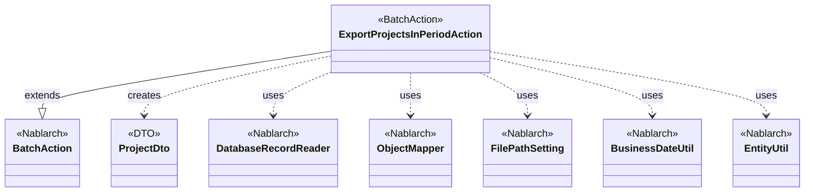
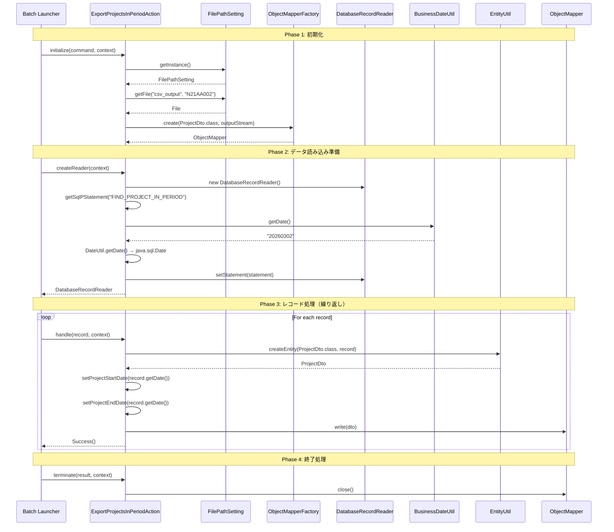

# Code Analysis: ExportProjectsInPeriodAction

**Generated**: 2026-03-02 18:56:35
**Target**: 期間内プロジェクト一覧CSV出力バッチアクション
**Modules**: proman-batch
**Analysis Duration**: 約2分51秒

---

## Overview

ExportProjectsInPeriodActionは、Nablarchの都度起動バッチアクションとして実装された、期間内プロジェクト一覧をCSVファイルに出力するバッチ処理です。

**主な機能:**
- データベースから業務日付を基準に期間内のプロジェクトを検索
- 検索結果をProjectDtoに変換してCSVファイルに出力
- ファイルパス管理機能を使用した出力先の論理名管理
- ObjectMapperによる効率的なCSV書き込み

**アーキテクチャの特徴:**
- BatchAction<SqlRow>を継承したNablarch標準バッチパターン
- DB to FILEパターン: DatabaseRecordReaderでデータ読み込み、ObjectMapperでファイル書き込み
- 4つのライフサイクルメソッド: initialize(), createReader(), handle(), terminate()
- アノテーション駆動のCSVフォーマット定義（@Csv, @CsvFormat）

---

## Architecture

### Dependency Graph



**Note**: This diagram uses Mermaid `classDiagram` syntax to show class names and their relationships. Use `--|>` for inheritance (extends/implements) and `..>` for dependencies (uses/creates).

### Component Summary

| Component | Role | Type | Dependencies |
|-----------|------|------|--------------|
| ExportProjectsInPeriodAction | 期間内プロジェクト一覧CSV出力バッチアクション | Action | DatabaseRecordReader, ObjectMapper, FilePathSetting, BusinessDateUtil, EntityUtil |
| ProjectDto | プロジェクト情報データ転送オブジェクト | DTO | DateUtil |
| FIND_PROJECT_IN_PERIOD | 期間内プロジェクト検索SQL | SQL | なし |

---

## Flow

### Processing Flow

**フェーズ1: 初期化 (initialize)**
1. FilePathSettingから出力先ディレクトリ（論理名"csv_output"）を取得
2. 出力ファイル名（N21AA002）を指定してFileOutputStreamを生成
3. ObjectMapperFactory.create()でProjectDto用のObjectMapperを生成

**フェーズ2: データ読み込み準備 (createReader)**
1. DatabaseRecordReaderを生成
2. SQL "FIND_PROJECT_IN_PERIOD"を取得
3. BusinessDateUtil.getDate()で業務日付を取得
4. 業務日付をjava.sql.Dateに変換してSQLパラメータに設定（開始日・終了日）
5. DatabaseRecordReaderにSqlPStatementを設定して返却

**フェーズ3: レコード処理 (handle - 繰り返し実行)**
1. SqlRowからEntityUtil.createEntity()でProjectDtoを生成
2. 日付項目（PROJECT_START_DATE, PROJECT_END_DATE）を個別に設定
3. ObjectMapper.write(dto)でCSV出力
4. Success()を返却して次のレコードへ

**フェーズ4: 終了処理 (terminate)**
1. ObjectMapper.close()でバッファをフラッシュしリソースを解放

**エラーハンドリング:**
- ファイル出力先が見つからない場合: IllegalStateExceptionをスロー
- データベース接続エラー: フレームワークがハンドラで処理
- 型変換エラー: EntityUtil, ObjectMapperが例外をスロー

### Sequence Diagram



---

## Components

### 1. ExportProjectsInPeriodAction

**File**: [ExportProjectsInPeriodAction.java:1-82](../../.lw/nab-official/v6/nablarch-system-development-guide/Sample_Project/Source_Code/proman-project/proman-batch/src/main/java/com/nablarch/example/proman/batch/project/ExportProjectsInPeriodAction.java)

**Role**: 期間内プロジェクト一覧出力の都度起動バッチアクションクラス

**Key Methods**:
- `initialize()` [:44-54] - ファイル出力先の準備とObjectMapper生成
- `createReader()` [:57-65] - DatabaseRecordReaderを生成してSQLパラメータを設定
- `handle()` [:68-75] - 1レコードをProjectDtoに変換してCSV出力
- `terminate()` [:78-80] - ObjectMapperをクローズしてリソース解放

**Dependencies**:
- `BatchAction<SqlRow>` - Nablarchバッチアクションの基底クラス
- `DatabaseRecordReader` - データベースからレコードを読み込む
- `ObjectMapper<ProjectDto>` - ProjectDtoをCSV形式で書き込む
- `FilePathSetting` - ファイルパスの論理名管理
- `BusinessDateUtil` - 業務日付取得
- `EntityUtil` - SqlRowからProjectDtoへの変換

**Implementation Points**:
- フィールド`mapper`でObjectMapperをアクション全体で共有
- `initialize()`でFileOutputStreamを生成し、ObjectMapperに渡す
- `createReader()`で業務日付を使ったSQL検索条件を設定
- `handle()`で型変換が必要な日付項目を個別設定
- `terminate()`で必ずmapper.close()を呼び出してリソース解放

### 2. ProjectDto

**File**: [ProjectDto.java:1-269](../../.lw/nab-official/v6/nablarch-system-development-guide/Sample_Project/Source_Code/proman-project/proman-batch/src/main/java/com/nablarch/example/proman/batch/project/ProjectDto.java)

**Role**: 期間内プロジェクト一覧出力用のデータ転送オブジェクト

**Annotations**:
- `@Csv` [:15-19] - CSV出力項目順序とヘッダー定義
- `@CsvFormat` [:20-21] - CSV詳細設定（区切り文字、改行コード、文字コード、クォートモード）

**Dependencies**:
- `DateUtil` - 日付フォーマット変換

**Implementation Points**:
- 全フィールドはString型で定義（ObjectMapperが文字列化を担当）
- setProjectStartDate/setProjectEndDateは Date → String 変換を実施
- @Csvのproperties属性で出力順序を制御
- @Csvのheaders属性で日本語ヘッダーを定義
- @CsvFormatのquoteMode = ALLで全項目をクォート

---

## Nablarch Framework Usage

### BatchAction

**クラス**: `nablarch.fw.action.BatchAction<SqlRow>`

**説明**: Nablarchバッチアプリケーションの基底クラス。4つのライフサイクルメソッドを提供する。

**使用方法**:
```java
public class ExportProjectsInPeriodAction extends BatchAction<SqlRow> {
    @Override
    protected void initialize(CommandLine command, ExecutionContext context) {
        // 初期化処理（リソース準備）
    }
    
    @Override
    public DataReader<SqlRow> createReader(ExecutionContext context) {
        // データ読み込み設定
        return reader;
    }
    
    @Override
    public Result handle(SqlRow record, ExecutionContext context) {
        // 1レコードの処理
        return new Success();
    }
    
    @Override
    protected void terminate(Result result, ExecutionContext context) {
        // 終了処理（リソース解放）
    }
}
```

**重要ポイント**:
- ✅ **createReaderは必須**: DataReaderを返す実装が必須（DatabaseRecordReaderまたはFileDataReader）
- ✅ **handleは1レコード単位**: ループ処理はフレームワークが実施するため、handleは1レコードのみ処理
- ⚠️ **initializeとterminateは対**: リソース取得と解放を必ず対にする（mapper生成と close）
- 💡 **トランザクション自動管理**: ハンドラ構成により、コミット間隔を制御可能
- 🎯 **いつ使うか**: DB to FILE, FILE to DB, DB to DB の大量データ処理

**このコードでの使い方**:
- `initialize()`でObjectMapperを生成してフィールドに保持
- `createReader()`でDatabaseRecordReaderを返却
- `handle()`で1レコードをCSV出力
- `terminate()`でObjectMapperをクローズ

**詳細**: [Nablarchバッチ処理](../../.claude/skills/nabledge-6/docs/features/processing/nablarch-batch.md)

### DatabaseRecordReader

**クラス**: `nablarch.fw.reader.DatabaseRecordReader`

**説明**: データベースからレコードを順次読み込むDataReaderの実装。SqlPStatementを設定して使用する。

**使用方法**:
```java
DatabaseRecordReader reader = new DatabaseRecordReader();
SqlPStatement statement = getSqlPStatement("FIND_PROJECT_IN_PERIOD");
statement.setDate(1, bizDate);
statement.setDate(2, bizDate);
reader.setStatement(statement);
return reader;
```

**重要ポイント**:
- ✅ **SqlPStatementを設定**: getSqlPStatement()でSQLを取得し、パラメータを設定
- ⚠️ **メモリ効率**: カーソルを使用するため、大量データでもメモリを圧迫しない
- 💡 **コミット間隔制御**: LoopHandlerの設定により、N件ごとにコミット可能
- 🎯 **いつ使うか**: データベースから大量データを読み込む都度起動バッチ

**このコードでの使い方**:
- `createReader()`でDatabaseRecordReaderを生成
- SQLファイル "FIND_PROJECT_IN_PERIOD" から検索クエリを取得
- 業務日付をパラメータに設定（開始日・終了日の範囲検索）
- SqlPStatementを設定してreturn

**詳細**: [Nablarchバッチ処理](../../.claude/skills/nabledge-6/docs/features/processing/nablarch-batch.md)

### ObjectMapper

**クラス**: `nablarch.common.databind.ObjectMapper`

**説明**: CSVやTSV、固定長データをJava Beansとして扱う機能を提供する。

**使用方法**:
```java
// 生成
ObjectMapper<ProjectDto> mapper = ObjectMapperFactory.create(ProjectDto.class, outputStream);

// 書き込み
mapper.write(dto);

// クローズ
mapper.close();
```

**重要ポイント**:
- ✅ **必ずclose()を呼ぶ**: バッファをフラッシュし、リソースを解放する（terminate()で実施）
- ⚠️ **大量データ処理時**: メモリに全データを保持しないため、大量データでも問題なく処理可能
- ⚠️ **型変換の制限**: EntityUtilと同様に、複雑な型変換が必要な項目は個別設定が必要
- 💡 **アノテーション駆動**: @Csv, @CsvFormatでフォーマットを宣言的に定義できる
- 💡 **保守性の高さ**: フォーマット変更時はアノテーションを変更するだけで対応可能
- ⚡ **パフォーマンス**: write()は都度ファイルに書き込むため、メモリ効率が良い

**このコードでの使い方**:
- `initialize()`でProjectDto用のObjectMapperを生成（Line 50）
- `handle()`で各レコードを`mapper.write(dto)`で出力（Line 73）
- `terminate()`で`mapper.close()`してリソース解放（Line 79）

**詳細**: [データバインド](../../.claude/skills/nabledge-6/docs/features/libraries/data-bind.md)

### FilePathSetting

**クラス**: `nablarch.core.util.FilePathSetting`

**説明**: ファイルパスを論理名で管理する機能を提供する。環境ごとに物理パスを切り替え可能。

**使用方法**:
```java
FilePathSetting setting = FilePathSetting.getInstance();
File outputFile = setting.getFile("csv_output", "N21AA002");
```

**重要ポイント**:
- ✅ **論理名で管理**: 物理パスを直接書かず、論理名（例: "csv_output"）で参照
- 💡 **環境依存を排除**: 開発・検証・本番で物理パスを切り替え可能
- 🎯 **いつ使うか**: ファイル入出力が必要なバッチ処理やファイルアップロード機能
- ⚠️ **設定が必要**: SystemRepositoryにbasePathSettings, fileExtensionsの設定が必要

**このコードでの使い方**:
- `initialize()`でFilePathSetting.getInstance()を取得（Line 45）
- getFile("csv_output", "N21AA002")で出力先Fileオブジェクトを取得（Line 46-47）
- FileOutputStreamを生成してObjectMapperFactoryに渡す（Line 49-50）

**詳細**: [ファイルパス管理](../../.claude/skills/nabledge-6/docs/features/libraries/file-path-management.md)

### BusinessDateUtil

**クラス**: `nablarch.core.date.BusinessDateUtil`

**説明**: システム全体で統一された業務日付を取得する機能を提供する。

**使用方法**:
```java
// デフォルト区分の業務日付
String bizDate = BusinessDateUtil.getDate();
// → "20260302"（yyyyMMdd形式）

// java.sql.Dateに変換してSQLパラメータに設定
Date sqlDate = new Date(DateUtil.getDate(bizDate).getTime());
statement.setDate(1, sqlDate);
```

**重要ポイント**:
- 💡 **システム横断の日付統一**: System.currentTimeMillis()やLocalDate.now()ではなく、これを使うことでバッチ処理と画面処理で同じ業務日付を共有できる
- ✅ **必ずDatabaseRecordReaderのパラメータに変換**: 取得した文字列はjava.sql.Dateに変換してSQLパラメータに設定する
- 🎯 **いつ使うか**: 日付ベースの検索条件、レポート生成、ファイル名の日付部分など
- ⚠️ **設定が必要**: SystemRepositoryに業務日付テーブルまたは固定値を設定する必要がある

**このコードでの使い方**:
- `createReader()`で業務日付を取得（Line 60）
- java.sql.Dateに変換してSQLパラメータに設定（Line 60-62）
- プロジェクトの開始日・終了日との比較条件として使用

**詳細**: [業務日付管理](../../.claude/skills/nabledge-6/docs/features/libraries/business-date.md)

### EntityUtil

**クラス**: `nablarch.common.dao.EntityUtil`

**説明**: SqlRowからEntityまたはDTOを生成する機能を提供する。

**使用方法**:
```java
ProjectDto dto = EntityUtil.createEntity(ProjectDto.class, record);
// 型変換が必要な項目は個別設定
dto.setProjectStartDate(record.getDate("PROJECT_START_DATE"));
dto.setProjectEndDate(record.getDate("PROJECT_END_DATE"));
```

**重要ポイント**:
- ✅ **カラム名とプロパティ名の自動マッピング**: SNAKE_CASEとcamelCaseを自動変換
- ⚠️ **型変換の制限**: 複雑な型変換（例: java.sql.Date → String）は自動で行われない
- 💡 **null値の扱い**: nullの場合は何も設定しない（デフォルト値にならない）
- 🎯 **いつ使うか**: SqlRowからDTO/Entityを生成する場面（バッチ、DAO）

**このコードでの使い方**:
- `handle()`でSqlRowからProjectDtoを生成（Line 69）
- 日付項目は型が異なるため、個別にsetterを呼ぶ（Line 71-72）

**詳細**: [UniversalDao](../../.claude/skills/nabledge-6/docs/features/libraries/universal-dao.md)

---

## References

### Source Files

- [ExportProjectsInPeriodAction.java](../../.lw/nab-official/v6/nablarch-system-development-guide/Sample_Project/Source_Code/proman-project/proman-batch/src/main/java/com/nablarch/example/proman/batch/project/ExportProjectsInPeriodAction.java) - ExportProjectsInPeriodAction
- [ProjectDto.java](../../.lw/nab-official/v6/nablarch-system-development-guide/Sample_Project/Source_Code/proman-project/proman-batch/src/main/java/com/nablarch/example/proman/batch/project/ProjectDto.java) - ProjectDto

### Knowledge Base (Nabledge-6)

- [Nablarch Batch](../../.claude/skills/nabledge-6/docs/features/processing/nablarch-batch.md)
- [Data Bind](../../.claude/skills/nabledge-6/docs/features/libraries/data-bind.md)
- [Business Date](../../.claude/skills/nabledge-6/docs/features/libraries/business-date.md)
- [File Path Management](../../.claude/skills/nabledge-6/docs/features/libraries/file-path-management.md)

### Official Documentation

- [Index](https://nablarch.github.io/docs/LATEST/doc/application_framework/application_framework/batch/index.html)
- [Data Bind](https://nablarch.github.io/docs/LATEST/doc/application_framework/application_framework/libraries/data_io/data_bind.html)
- [Business Date](https://nablarch.github.io/docs/LATEST/doc/application_framework/application_framework/libraries/system_utility/business_date.html)
- [File Path Management](https://nablarch.github.io/docs/LATEST/doc/application_framework/application_framework/libraries/file_path_management.html)

---

**Note**: This documentation was generated by the code-analysis workflow of the nabledge-6 skill.
