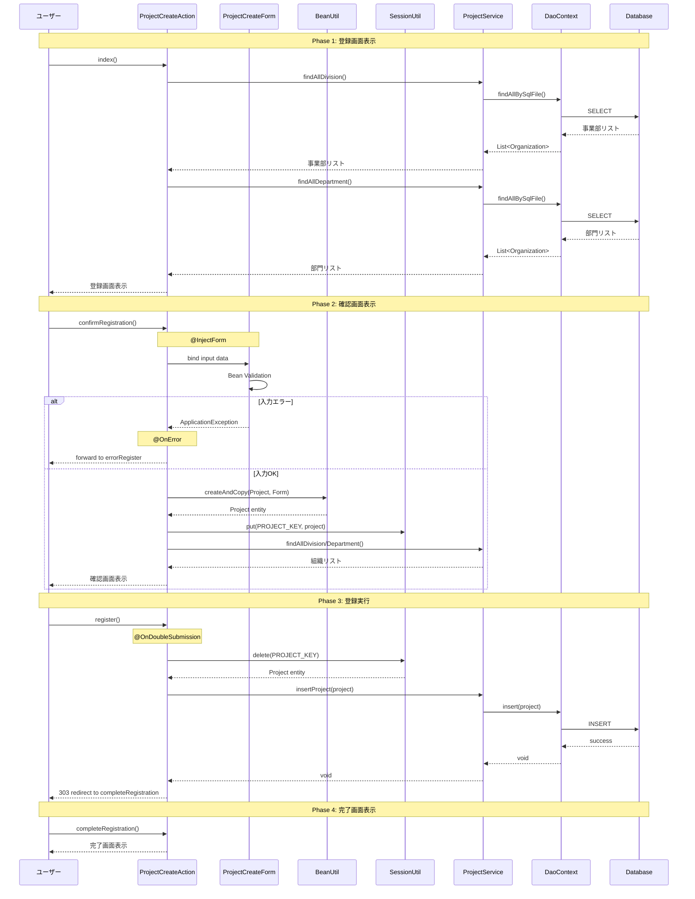

# Code Analysis: ProjectCreateAction

**Generated**: 2026-03-02 19:01:46
**Target**: プロジェクト登録処理
**Modules**: proman-web
**Analysis Duration**: 約2分28秒

---

## Overview

ProjectCreateActionは、プロジェクト登録機能を実装するActionクラスです。画面表示から入力確認、登録処理、完了画面までの一連のプロジェクト登録フローを制御します。

主な処理フロー:
1. 登録画面表示 (index) - 組織情報をDBから取得して画面に設定
2. 確認画面表示 (confirmRegistration) - フォームからEntityへ変換してセッションに保存
3. 登録実行 (register) - セッションからデータ取得後、DBへ登録
4. 完了画面表示 (completeRegistration)
5. 入力画面へ戻る (backToEnterRegistration) - セッションデータをフォームに復元

NablarchフレームワークのBean変換機能、セッション管理、バリデーション、二重サブミット防止を活用しています。

---

## Architecture

### Dependency Graph

```mermaid
classDiagram
    class ProjectCreateAction {
        +index()
        +confirmRegistration()
        +register()
        +completeRegistration()
        +backToEnterRegistration()
    }
    class ProjectCreateForm {
        <<Form>>
    }
    class ProjectService {
        +findAllDivision()
        +findAllDepartment()
        +findOrganizationById()
        +insertProject()
    }
    class Project {
        <<Entity>>
    }
    class Organization {
        <<Entity>>
    }
    class BeanUtil {
        <<Nablarch>>
    }
    class SessionUtil {
        <<Nablarch>>
    }
    class ExecutionContext {
        <<Nablarch>>
    }
    class DaoContext {
        <<Nablarch>>
    }

    ProjectCreateAction ..> ProjectCreateForm : validates
    ProjectCreateAction ..> ProjectService : delegates to
    ProjectCreateAction ..> BeanUtil : converts with
    ProjectCreateAction ..> SessionUtil : stores via
    ProjectCreateAction ..> ExecutionContext : accesses
    ProjectCreateForm ..> Serializable : implements
    ProjectService ..> DaoContext : queries via
    ProjectService ..> Project : persists
    ProjectService ..> Organization : retrieves
```



**Note**: This diagram uses Mermaid `classDiagram` syntax to show class names and their relationships. Use `--|>` for inheritance (extends/implements) and `..>` for dependencies (uses/creates).

### Component Summary

| Component | Role | Type | Dependencies |
|-----------|------|------|--------------|
| ProjectCreateAction | プロジェクト登録制御 | Action | ProjectCreateForm, ProjectService, BeanUtil, SessionUtil, ExecutionContext |
| ProjectCreateForm | 入力データ保持・検証 | Form | Bean Validation annotations |
| ProjectService | ビジネスロジック | Service | DaoContext, Project, Organization |
| Project | プロジェクトデータ | Entity | - |
| Organization | 組織データ | Entity | - |

---

## Flow

### Processing Flow

プロジェクト登録は以下の5つのフェーズで構成されます:

**Phase 1: 登録画面表示 (index)**
1. HTTPリクエスト受信
2. ProjectServiceを使用して事業部/部門リストをDB取得
3. リクエストスコープに組織情報を設定
4. JSP画面を表示

**Phase 2: 確認画面表示 (confirmRegistration)**
1. @InjectFormでProjectCreateFormに入力値をバインド
2. Bean Validationによる入力チェック実行
3. エラー時は@OnErrorでerrorRegister画面へ遷移
4. BeanUtil.createAndCopyでFormからProjectエンティティへ変換
5. SessionUtilでProjectオブジェクトをセッションに保存
6. 確認画面を表示

**Phase 3: 登録実行 (register)**
1. @OnDoubleSubmissionで二重サブミット防止チェック
2. SessionUtil.deleteでセッションからProjectデータ取得・削除
3. ProjectService.insertProjectでDB登録
4. 303リダイレクトで完了画面へ遷移

**Phase 4: 完了画面表示 (completeRegistration)**
1. 登録完了JSPを表示

**Phase 5: 入力画面へ戻る (backToEnterRegistration)**
1. セッションからProjectデータ取得
2. BeanUtilでProjectからFormへ変換
3. DateUtilで日付を文字列フォーマット
4. ProjectServiceで組織情報を取得して事業部IDを設定
5. リクエストスコープにFormを設定
6. forward遷移で入力画面へ

### Sequence Diagram



---

## Components

### 1. ProjectCreateAction

**File**: [ProjectCreateAction.java](../../../../../../../../.lw/nab-official/v6/nablarch-system-development-guide/Sample_Project/Source_Code/proman-project/proman-web/src/main/java/com/nablarch/example/proman/web/project/ProjectCreateAction.java)

**Role**: プロジェクト登録処理の制御

**Key Methods**:
- `index()` - 登録画面表示 [:33-39]
- `confirmRegistration()` - 確認画面表示 [:48-63]
- `register()` - 登録実行 [:72-78]
- `completeRegistration()` - 完了画面表示 [:87-89]
- `backToEnterRegistration()` - 入力画面へ戻る [:98-118]
- `setOrganizationAndDivisionToRequestScope()` - 組織情報設定 [:125-136]

**Dependencies**:
- ProjectCreateForm: 入力フォーム
- ProjectService: ビジネスロジック
- BeanUtil: Form⇔Entity変換
- SessionUtil: セッション管理
- ExecutionContext: リクエストコンテキスト

**Key Implementation Points**:
- @InjectFormアノテーションで自動フォームバインディング
- @OnErrorでバリデーションエラーハンドリング
- @OnDoubleSubmissionで二重サブミット防止
- セッションを使った画面間データ受け渡し
- BeanUtilによる型安全なオブジェクト変換

### 2. ProjectCreateForm

**File**: [ProjectCreateForm.java](../../../../../../../../.lw/nab-official/v6/nablarch-system-development-guide/Sample_Project/Source_Code/proman-project/proman-web/src/main/java/com/nablarch/example/proman/web/project/ProjectCreateForm.java)

**Role**: プロジェクト登録フォームの入力値保持とバリデーション

**Key Fields**:
- projectName, projectType, projectClass: プロジェクト基本情報
- projectStartDate, projectEndDate: プロジェクト期間
- divisionId, organizationId: 組織ID
- pmKanjiName, plKanjiName: PM/PL名
- note, salesAmount: 備考・売上高

**Validation**:
- @Required: 必須項目チェック
- @Domain: ドメインバリデーション
- @AssertTrue: 期間の妥当性チェック (isValidProjectPeriod) [:328-331]

**Dependencies**:
- Bean Validation annotations
- DateRelationUtil: 日付妥当性チェック

### 3. ProjectService

**File**: [ProjectService.java](../../../../../../../../.lw/nab-official/v6/nablarch-system-development-guide/Sample_Project/Source_Code/proman-project/proman-web/src/main/java/com/nablarch/example/proman/web/project/ProjectService.java)

**Role**: プロジェクト関連のビジネスロジック

**Key Methods**:
- `findAllDivision()` - 全事業部取得 [:50-52]
- `findAllDepartment()` - 全部門取得 [:59-61]
- `findOrganizationById()` - 組織ID検索 [:70-73]
- `insertProject()` - プロジェクト登録 [:80-82]

**Dependencies**:
- DaoContext (UniversalDao): データベースアクセス
- Organization, Project: エンティティ

**Key Implementation Points**:
- DaoFactory.create()でDaoContext取得
- findAllBySqlFileでSQL IDベース検索
- findByIdで主キー検索
- insertでエンティティ登録

---

## Nablarch Framework Usage

### 1. BeanUtil - Bean変換ユーティリティ

**使用箇所**:
- ProjectCreateAction.confirmRegistration() [:52]
- ProjectCreateAction.backToEnterRegistration() [:101]

**コード例**:
```java
// Form → Entity変換
Project project = BeanUtil.createAndCopy(Project.class, form);

// Entity → Form変換
ProjectCreateForm projectCreateForm = BeanUtil.createAndCopy(ProjectCreateForm.class, project);
```

**重要なポイント**:
- ✅ プロパティ名が一致するフィールドを自動コピー
- ✅ 型変換も自動実行 (String ⇔ Integer等)
- ⚠️ ネストしたオブジェクトは自動コピーされない
- 💡 手動マッピングより安全で保守性が高い
- 🎯 Form-Entity間変換で使用

### 2. SessionUtil - セッション管理ユーティリティ

**使用箇所**:
- ProjectCreateAction.confirmRegistration() [:59]
- ProjectCreateAction.register() [:74]
- ProjectCreateAction.backToEnterRegistration() [:100]
- ProjectCreateAction.setOrganizationAndDivisionToRequestScope() [:132]

**コード例**:
```java
// セッションへ保存
SessionUtil.put(context, PROJECT_KEY, project);

// セッションから取得
Project project = SessionUtil.get(context, PROJECT_KEY);

// セッションから削除 (取得 + 削除)
final Project project = SessionUtil.delete(context, PROJECT_KEY);
```

**重要なポイント**:
- ✅ 型安全なセッションアクセス
- ✅ deleteメソッドで取得と削除を同時実行
- ⚠️ セッションキーの一意性を保つ (定数使用推奨)
- 💡 画面間のデータ受け渡しに最適
- 🎯 確認画面パターンで使用

### 3. @InjectForm - フォーム自動バインディング

**使用箇所**:
- ProjectCreateAction.confirmRegistration() [:48]

**コード例**:
```java
@InjectForm(form = ProjectCreateForm.class, prefix = "form")
@OnError(type = ApplicationException.class, path = "forward:///app/project/errorRegister")
public HttpResponse confirmRegistration(HttpRequest request, ExecutionContext context) {
    ProjectCreateForm form = context.getRequestScopedVar("form");
    // formには自動バインド済みデータが入っている
}
```

**重要なポイント**:
- ✅ リクエストパラメータをFormに自動バインド
- ✅ Bean Validationを自動実行
- ✅ prefix指定でリクエストスコープ変数名を指定
- ⚠️ @OnErrorと併用してエラーハンドリング
- 💡 入力チェックロジックをFormクラスに集約可能
- 🎯 Web画面の入力処理で使用

### 4. @OnError - エラーハンドリング

**使用箇所**:
- ProjectCreateAction.confirmRegistration() [:49]

**コード例**:
```java
@OnError(type = ApplicationException.class, path = "forward:///app/project/errorRegister")
public HttpResponse confirmRegistration(...) {
    // バリデーションエラー時は自動的にerrorRegister画面へ遷移
}
```

**重要なポイント**:
- ✅ 例外タイプごとに遷移先を指定
- ✅ forward/redirectを選択可能
- ⚠️ ApplicationExceptionはバリデーションエラー用
- 💡 エラー画面へのforwardでフォームデータを保持
- 🎯 入力チェックエラー時の画面遷移で使用

### 5. @OnDoubleSubmission - 二重サブミット防止

**使用箇所**:
- ProjectCreateAction.register() [:72]

**コード例**:
```java
@OnDoubleSubmission
public HttpResponse register(HttpRequest request, ExecutionContext context) {
    // 二重サブミット時は自動的にエラー画面へ遷移
    final Project project = SessionUtil.delete(context, PROJECT_KEY);
    service.insertProject(project);
    return new HttpResponse(303, "redirect:///app/project/completeRegistration");
}
```

**重要なポイント**:
- ✅ トークンベースで二重サブミットを防止
- ✅ ブラウザの戻る→再送信も検知
- ⚠️ 画面側でuseTokenタグが必要
- 💡 登録・更新・削除処理に必須
- 🎯 POST処理の冪等性確保で使用

### 6. UniversalDao (DaoContext) - データベースアクセス

**使用箇所**:
- ProjectService全メソッド

**コード例**:
```java
// SQLファイルベース検索
List<Organization> topOrganizationList = universalDao.findAllBySqlFile(
    Organization.class, "FIND_ALL_DIVISION");

// 主キー検索
Organization organization = universalDao.findById(Organization.class, organizationId);

// 登録
universalDao.insert(project);
```

**重要なポイント**:
- ✅ SQL IDでSQLファイルを指定
- ✅ 型安全なエンティティ操作
- ✅ JPA標準アノテーションを使用
- ⚠️ SQLファイルはクラスパス上に配置必要
- 💡 シンプルなCRUD操作に最適
- 🎯 データベースアクセス全般で使用
- ⚡ findAllBySqlFileは大量データ時に注意

**Knowledge Base**: [Universal Dao.json](../../../../../../../../.claude/skills/nabledge-6/knowledge/features/libraries/universal-dao.json)

---

## References

### Source Files

- [ProjectCreateAction.java](../../../../../../../../.lw/nab-official/v6/nablarch-system-development-guide/Sample_Project/Source_Code/proman-project/proman-web/src/main/java/com/nablarch/example/proman/web/project/ProjectCreateAction.java) - ProjectCreateAction
- [ProjectCreateForm.java](../../../../../../../../.lw/nab-official/v6/nablarch-system-development-guide/Sample_Project/Source_Code/proman-project/proman-web/src/main/java/com/nablarch/example/proman/web/project/ProjectCreateForm.java) - ProjectCreateForm
- [ProjectService.java](../../../../../../../../.lw/nab-official/v6/nablarch-system-development-guide/Sample_Project/Source_Code/proman-project/proman-web/src/main/java/com/nablarch/example/proman/web/project/ProjectService.java) - ProjectService

### Knowledge Base (Nabledge-6)

- [Universal Dao.json](../../../../../../../../.claude/skills/nabledge-6/knowledge/features/libraries/universal-dao.json)
- [Data Bind.json](../../../../../../../../.claude/skills/nabledge-6/knowledge/features/libraries/data-bind.json)

### Official Documentation

- [Universal Dao](https://nablarch.github.io/docs/LATEST/doc/application_framework/application_framework/libraries/database/universal_dao.html)
- [Data Bind](https://nablarch.github.io/docs/LATEST/doc/application_framework/application_framework/libraries/data_io/data_bind.html)

---

**Note**: This documentation was generated by the code-analysis workflow of the nabledge-6 skill.
