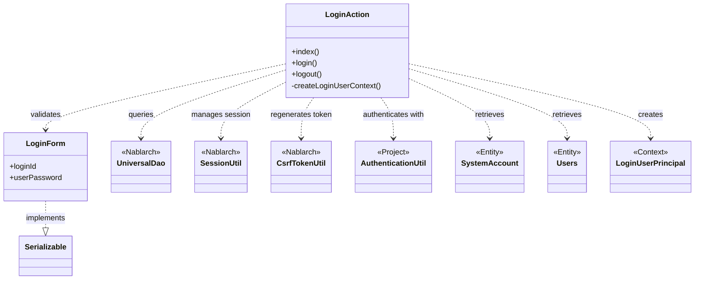
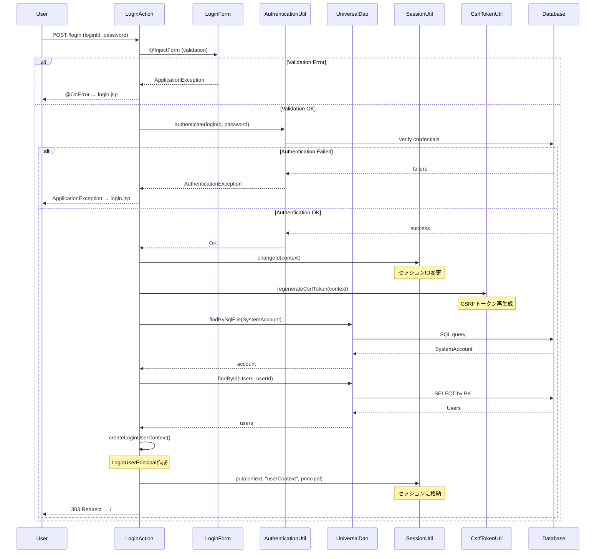

# Code Analysis: LoginAction

**Generated**: 2026-03-02 19:02:13
**Target**: ログイン認証処理を実装するActionクラス
**Modules**: proman-web
**Analysis Duration**: 約2分52秒

---

## Overview

LoginActionは、Webアプリケーションにおけるユーザー認証機能を実装するActionクラスです。ログイン画面の表示、認証処理、ログアウト処理の3つの主要な機能を提供します。

**主な責務**:
- ログイン画面表示 (index メソッド)
- ログイン認証処理 (login メソッド)
- ログアウト処理 (logout メソッド)

**使用するNablarchコンポーネント**:
- `UniversalDao`: データベースからユーザー情報を取得
- `@InjectForm`: フォームバインディングとバリデーション
- `@OnError`: バリデーションエラー時の遷移先指定
- `SessionUtil`: セッション管理
- `CsrfTokenUtil`: CSRF対策トークン管理
- `ExecutionContext`: リクエストコンテキスト管理

**セキュリティ機能**:
- 認証成功時にセッションIDを変更 (`SessionUtil.changeId`)
- CSRFトークンの再生成 (`CsrfTokenUtil.regenerateCsrfToken`)
- 認証失敗時の汎用エラーメッセージ表示

---

## Architecture

### Dependency Graph



**Note**: This diagram uses Mermaid `classDiagram` syntax to show class names and their relationships. Use `--|>` for inheritance (extends/implements) and `..>` for dependencies (uses/creates).

### Component Summary

| Component | Role | Type | Dependencies |
|-----------|------|------|--------------|
| LoginAction | ログイン認証処理 | Action | LoginForm, AuthenticationUtil, UniversalDao, SessionUtil, CsrfTokenUtil |
| LoginForm | ログイン入力フォーム | Form | なし (Bean Validationアノテーション使用) |
| AuthenticationUtil | 認証処理ユーティリティ | Utility | SystemRepository, PasswordAuthenticator |
| SystemAccount | システムアカウントEntity | Entity | なし |
| Users | ユーザーEntity | Entity | なし |
| LoginUserPrincipal | ログインユーザーコンテキスト | Context | なし |

---

## Flow

### Processing Flow

**ログイン画面表示 (index)**:
1. ユーザーがログイン画面にアクセス
2. LoginAction.index() が呼び出される
3. login.jsp を表示

**ログイン認証 (login)**:
1. ユーザーがログインIDとパスワードを入力して送信
2. `@InjectForm` によりLoginFormにバインディング・バリデーション
3. バリデーションエラー時は `@OnError` により login.jsp にフォワード
4. AuthenticationUtil.authenticate() で認証処理
5. 認証失敗時は ApplicationException をスロー → `@OnError` により login.jsp にフォワード
6. 認証成功時:
   - SessionUtil.changeId() でセッションID変更
   - CsrfTokenUtil.regenerateCsrfToken() でCSRFトークン再生成
   - createLoginUserContext() でログインユーザー情報を取得
   - SessionUtil.put() でセッションに格納
   - トップ画面にリダイレクト

**ログアウト (logout)**:
1. ユーザーがログアウトボタンをクリック
2. LoginAction.logout() が呼び出される
3. SessionUtil.invalidate() でセッションを無効化
4. ログイン画面にリダイレクト

### Sequence Diagram



---

## Components

### LoginAction.java

**Path**: [LoginAction.java](../../.lw/nab-official/v6/nablarch-system-development-guide/Sample_Project/Source_Code/proman-project/proman-web/src/main/java/com/nablarch/example/proman/web/login/LoginAction.java)

**Role**: ログイン認証処理の制御

**Key Methods**:

**index()** [:38-40](../../.lw/nab-official/v6/nablarch-system-development-guide/Sample_Project/Source_Code/proman-project/proman-web/src/main/java/com/nablarch/example/proman/web/login/LoginAction.java#L38-L40)
- ログイン画面 (login.jsp) を表示
- HTTPリクエストとExecutionContextを受け取り、HttpResponseを返す

**login()** [:49-71](../../.lw/nab-official/v6/nablarch-system-development-guide/Sample_Project/Source_Code/proman-project/proman-web/src/main/java/com/nablarch/example/proman/web/login/LoginAction.java#L49-L71)
- `@OnError`: バリデーション/認証エラー時に login.jsp にフォワード
- `@InjectForm`: LoginFormにバインディング・バリデーション
- AuthenticationUtil.authenticate() で認証
- 認証成功時: セッションID変更、CSRFトークン再生成、ユーザー情報をセッションに格納
- トップ画面へリダイレクト

**logout()** [:102-106](../../.lw/nab-official/v6/nablarch-system-development-guide/Sample_Project/Source_Code/proman-project/proman-web/src/main/java/com/nablarch/example/proman/web/login/LoginAction.java#L102-L106)
- SessionUtil.invalidate() でセッション無効化
- ログイン画面へリダイレクト

**createLoginUserContext()** [:79-93](../../.lw/nab-official/v6/nablarch-system-development-guide/Sample_Project/Source_Code/proman-project/proman-web/src/main/java/com/nablarch/example/proman/web/login/LoginAction.java#L79-L93)
- UniversalDaoでSystemAccountとUsersを取得
- LoginUserPrincipalを生成して返す

### LoginForm.java

**Path**: [LoginForm.java](../../.lw/nab-official/v6/nablarch-system-development-guide/Sample_Project/Source_Code/proman-project/proman-web/src/main/java/com/nablarch/example/proman/web/login/LoginForm.java)

**Role**: ログイン入力フォーム

**Fields**:
- `loginId`: ログインID (`@Required`, `@Domain("loginId")`)
- `userPassword`: パスワード (`@Required`, `@Domain("userPassword")`)

**Validation**: Bean Validationアノテーションによる入力検証

---

## Nablarch Framework Usage

### UniversalDao

**Class**: `nablarch.common.dao.UniversalDao`

**Description**: Jakarta Persistenceアノテーションを使った簡易的なO/Rマッパー。SQLを書かずに単純なCRUDを実行し、検索結果をBeanにマッピングできる。

**Code Example**:
```java
// SQLファイルを使用した検索 (createLoginUserContext メソッド内)
SystemAccount account = UniversalDao.findBySqlFile(
    SystemAccount.class,
    "FIND_SYSTEM_ACCOUNT_BY_AK",
    new Object[]{loginId}
);

// 主キーによる検索
Users users = UniversalDao.findById(Users.class, account.getUserId());
```

**Important Points**:

✅ **Must do**:
- Entityクラスにはjakarta.persistence.*アノテーション (`@Table`, `@Column`, `@Id`等) を付与する
- SQLファイルはEntityクラスのパッケージに対応したディレクトリに配置する (例: `sample.entity.User` → `sample/entity/User.sql`)

⚠️ **Caution**:
- `findBySqlFile` 使用時、SQL IDは第2引数で指定する
- SQLファイル内でバインド変数を使用する場合、第3引数で値を配列で渡す

💡 **Benefit**:
- SQLを書かずに主キー検索 (`findById`) が可能
- 任意のSQLも実行可能 (`findBySqlFile`) で柔軟性が高い

🎯 **When to use**:
- 単純なCRUD操作
- EntityクラスへのマッピングがSELECT句と一致する場合
- 主キー検索が主な用途の場合

⚡ **Performance**:
- 内部でJDBC (nablarch.common.dao.Database) を使用するため、Databaseの設定が必要
- 単純なCRUD操作では高速に動作する

**Usage in this code**:
- `findBySqlFile`: SystemAccountをログインIDで検索 (カスタムSQL使用)
- `findById`: Usersを主キーで検索

**Knowledge Base**: [features/libraries/universal-dao.json](../../features/libraries/universal-dao.json)

### @InjectForm

**Class**: `nablarch.common.web.interceptor.InjectForm`

**Description**: HTTPリクエストパラメータをフォームBeanにバインドし、Bean Validationによる検証を実行するインターセプタアノテーション。

**Code Example**:
```java
@OnError(type = ApplicationException.class, path = "/WEB-INF/view/login/login.jsp")
@InjectForm(form = LoginForm.class)
public HttpResponse login(HttpRequest request, ExecutionContext context) {
    LoginForm form = context.getRequestScopedVar("form");
    // ... バリデーション済みのformを使用
}
```

**Important Points**:

✅ **Must do**:
- フォームクラスにBean Validationアノテーション (`@Required`, `@Domain`等) を付与する
- バリデーション済みフォームは `context.getRequestScopedVar("form")` で取得する

⚠️ **Caution**:
- `@OnError` と組み合わせて使用することで、バリデーションエラー時の遷移先を指定できる
- バリデーションエラー時は `ApplicationException` がスローされる

💡 **Benefit**:
- HTTPリクエストパラメータの取得とバリデーションを自動化
- ボイラープレートコードの削減

🎯 **When to use**:
- フォーム入力を伴うActionメソッド
- Bean Validationによる入力検証が必要な場合

**Usage in this code**:
- `login` メソッドで LoginForm にバインディング・バリデーション
- バリデーションエラー時は `@OnError` により login.jsp にフォワード

### SessionUtil / CsrfTokenUtil

**Classes**:
- `nablarch.common.web.session.SessionUtil`
- `nablarch.common.web.csrf.CsrfTokenUtil`

**Description**: セッション管理とCSRF対策トークン管理を提供するユーティリティクラス。

**Code Example**:
```java
// セッションIDの変更 (セッション固定化攻撃対策)
SessionUtil.changeId(context);

// CSRFトークンの再生成
CsrfTokenUtil.regenerateCsrfToken(context);

// セッションへの値の格納
SessionUtil.put(context, "userContext", userContext);

// セッションの無効化 (ログアウト時)
SessionUtil.invalidate(context);
```

**Important Points**:

✅ **Must do**:
- ログイン成功時は `SessionUtil.changeId()` でセッションIDを変更する (セキュリティ対策)
- ログイン成功時は `CsrfTokenUtil.regenerateCsrfToken()` でCSRFトークンを再生成する

⚠️ **Caution**:
- セッションIDの変更は認証成功時に必ず実行する (セッション固定化攻撃対策)
- ログアウト時は `SessionUtil.invalidate()` でセッションを完全に無効化する

💡 **Benefit**:
- セッション固定化攻撃、CSRF攻撃への対策が簡単に実装できる
- セッションライフサイクル管理が明示的

🎯 **When to use**:
- ログイン/ログアウト処理
- セッションにユーザー情報を格納する場合
- CSRF対策が必要なフォーム処理

**Usage in this code**:
- `login`: セッションID変更、CSRFトークン再生成、ユーザー情報格納
- `logout`: セッション無効化

---

## References

### Source Files

- [LoginAction.java](../../.lw/nab-official/v6/nablarch-system-development-guide/Sample_Project/Source_Code/proman-project/proman-web/src/main/java/com/nablarch/example/proman/web/login/LoginAction.java) - LoginAction
- [LoginForm.java](../../.lw/nab-official/v6/nablarch-system-development-guide/Sample_Project/Source_Code/proman-project/proman-web/src/main/java/com/nablarch/example/proman/web/login/LoginForm.java) - LoginForm

### Knowledge Base (Nabledge-6)

- [Universal Dao.json](../../features/libraries/universal-dao.json)

### Official Documentation

- [Universal Dao](https://nablarch.github.io/docs/6-LATEST/doc/application_framework/application_framework/libraries/database/universal_dao.html)

---

**Note**: This documentation was generated by the code-analysis workflow of the nabledge-6 skill.
