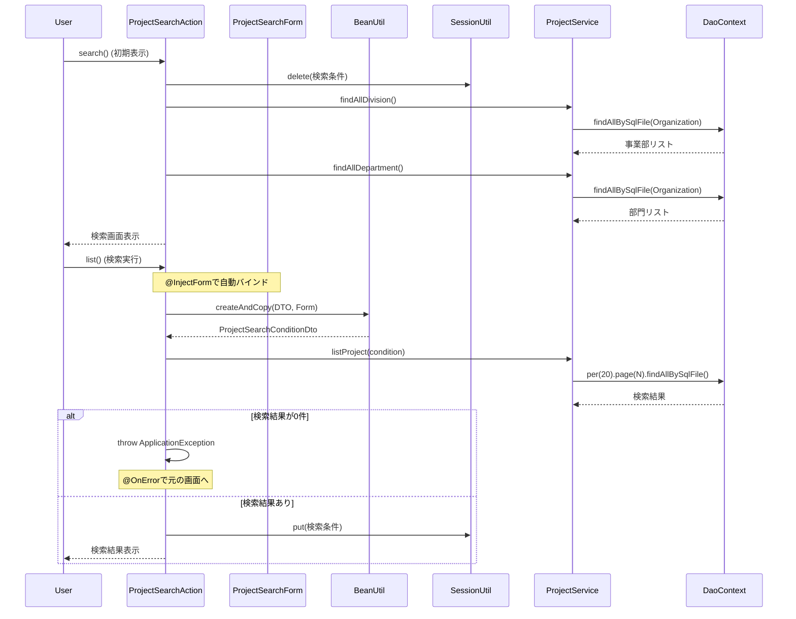

# Code Analysis: ProjectSearchAction

**Generated**: 2026-03-02 19:02:14
**Target**: プロジェクト検索画面とページング処理
**Modules**: proman-web
**Analysis Duration**: 3分17秒

---

## Overview

ProjectSearchActionは、proman-webモジュールにおけるプロジェクト検索機能を担当するActionクラスです。検索画面の初期表示、検索実行、ページング処理、詳細画面への遷移を提供します。主な機能として、フォーム入力値のDTOへの変換、検索条件のセッション保存、ページネーション対応の検索実行を行います。

このActionは、NablarchのInjectFormインターセプタを使用してフォーム値を自動バインドし、BeanUtilでDTO変換、SessionUtilでセッション管理、ProjectServiceを通じてUniversalDaoによるデータベース検索を実行します。検索結果が0件の場合はApplicationExceptionをスローし、OnErrorインターセプタで元の画面に戻る設計となっています。

---

## Architecture

### Dependency Graph

```mermaid
classDiagram
    class ProjectSearchAction {
        +search()
        +list()
        +backToList()
        +detail()
    }
    class ProjectSearchForm {
        <<Form>>
    }
    class ProjectService {
        <<Service>>
    }
    class ProjectSearchConditionDto {
        <<DTO>>
    }
    class DaoContext {
        <<Nablarch>>
    }
    class ExecutionContext {
        <<Nablarch>>
    }
    class BeanUtil {
        <<Nablarch>>
    }
    class SessionUtil {
        <<Nablarch>>
    }

    ProjectSearchForm--|>SearchFormBase : extends
    ProjectSearchForm..|>Serializable : implements
    ProjectSearchConditionDto..|>Serializable : implements
    ProjectSearchAction..>ProjectSearchForm : validates
    ProjectSearchAction..>ProjectSearchConditionDto : creates
    ProjectSearchAction..>ProjectService : delegates to
    ProjectSearchAction..>BeanUtil : uses
    ProjectSearchAction..>SessionUtil : uses
    ProjectSearchAction..>ExecutionContext : uses
    ProjectService..>DaoContext : queries via
```



**Note**: This diagram uses Mermaid `classDiagram` syntax to show class names and their relationships. Use `--|>` for inheritance (extends/implements) and `..>` for dependencies (uses/creates).

### Component Summary

| Component | Role | Type | Dependencies |
|-----------|------|------|--------------|
| ProjectSearchAction | プロジェクト検索処理 | Action | ProjectSearchForm, ProjectService, SessionUtil, BeanUtil, ExecutionContext |
| ProjectSearchForm | 検索フォーム（入力値保持・検証） | Form | SearchFormBase, Bean Validation |
| ProjectService | プロジェクト関連ビジネスロジック | Service | DaoContext, Organization, Project |
| ProjectSearchConditionDto | 検索条件DTO（型変換済み） | DTO | None |

---

## Flow

### Processing Flow

1. **検索画面初期表示** (`search`メソッド): セッションから検索条件をクリアし、事業部・部門リストをリクエストスコープに設定して検索画面を表示
2. **一覧検索** (`list`メソッド): InjectFormで自動バインドされたフォーム値をDTOに変換し、ProjectServiceを通じてページング付き検索を実行。検索条件をセッションに保存して結果を表示
3. **検索画面に戻る** (`backToList`メソッド): セッションから検索条件を復元し、同じ条件で再検索して結果を表示
4. **詳細画面表示** (`detail`メソッド): プロジェクトIDをもとにProjectServiceで詳細情報を取得し、詳細画面に遷移

ProjectServiceは、DaoContext（UniversalDao実装）の`findAllBySqlFile`メソッドでSQLファイルから検索クエリを実行し、`per`/`page`メソッドでページング処理を適用します。

### Sequence Diagram



---

## Components

### ProjectSearchAction

**Location**: [ProjectSearchAction.java:20-138](../../../../../../../../.lw/nab-official/v6/nablarch-system-development-guide/Sample_Project/Source_Code/proman-project/proman-web/src/main/java/com/nablarch/example/proman/web/project/ProjectSearchAction.java#L20-L138)

**Role**: プロジェクト検索画面のアクションクラス。検索画面表示、検索実行、詳細表示の各処理を提供。

**Key Methods**:
- `search()` [:35-40](../../../../../../../../.lw/nab-official/v6/nablarch-system-development-guide/Sample_Project/Source_Code/proman-project/proman-web/src/main/java/com/nablarch/example/proman/web/project/ProjectSearchAction.java#L35-L40) - 検索画面初期表示。セッションクリア、組織情報設定
- `list()` [:49-69](../../../../../../../../.lw/nab-official/v6/nablarch-system-development-guide/Sample_Project/Source_Code/proman-project/proman-web/src/main/java/com/nablarch/example/proman/web/project/ProjectSearchAction.java#L49-L69) - 検索実行。フォーム→DTO変換、検索実行、セッション保存
- `backToList()` [:78-91](../../../../../../../../.lw/nab-official/v6/nablarch-system-development-guide/Sample_Project/Source_Code/proman-project/proman-web/src/main/java/com/nablarch/example/proman/web/project/ProjectSearchAction.java#L78-L91) - 検索画面に戻る。セッションから条件復元、再検索
- `detail()` [:101-109](../../../../../../../../.lw/nab-official/v6/nablarch-system-development-guide/Sample_Project/Source_Code/proman-project/proman-web/src/main/java/com/nablarch/example/proman/web/project/ProjectSearchAction.java#L101-L109) - 詳細画面表示

**Dependencies**: ProjectSearchForm, ProjectService, BeanUtil, SessionUtil, ExecutionContext, ApplicationException, MessageUtil

**Implementation Points**:
- `@InjectForm`でフォーム自動バインド（検証も自動実行）
- `@OnError`でエラー時の画面遷移制御（ApplicationException発生時は`forward://search`へ）
- ページング処理はフォームの`pageNumber`プロパティで制御（検索ボタン押下時は"1"を設定）
- 検索条件をセッションに保存し、詳細画面から戻る際に復元

### ProjectSearchForm

**Location**: [ProjectSearchForm.java:19-380](../../../../../../../../.lw/nab-official/v6/nablarch-system-development-guide/Sample_Project/Source_Code/proman-project/proman-web/src/main/java/com/nablarch/example/proman/web/project/ProjectSearchForm.java#L19-L380)

**Role**: 検索フォーム。入力値の保持、Bean Validationによる検証、ページング情報の管理。

**Key Methods**:
- `isValidProjectSalesRange()` [:294-297](../../../../../../../../.lw/nab-official/v6/nablarch-system-development-guide/Sample_Project/Source_Code/proman-project/proman-web/src/main/java/com/nablarch/example/proman/web/project/ProjectSearchForm.java#L294-L297) - 売上高FROM/TO検証
- `isValidProjectStartDateRange()` [:306-309](../../../../../../../../.lw/nab-official/v6/nablarch-system-development-guide/Sample_Project/Source_Code/proman-project/proman-web/src/main/java/com/nablarch/example/proman/web/project/ProjectSearchForm.java#L306-L309) - 開始日FROM/TO検証
- `isValidProjectEndDateRange()` [:318-321](../../../../../../../../.lw/nab-official/v6/nablarch-system-development-guide/Sample_Project/Source_Code/proman-project/proman-web/src/main/java/com/nablarch/example/proman/web/project/ProjectSearchForm.java#L318-L321) - 終了日FROM/TO検証

**Dependencies**: SearchFormBase (親クラス、ページング情報を保持), Bean Validation

**Implementation Points**:
- `@Domain`で各フィールドにドメイン検証を適用
- `@AssertTrue`でFROM/TO範囲検証（カスタムバリデーション）
- 内部クラス`ProjectType`と`ProjectClass`でチェックボックス値を管理

### ProjectService

**Location**: [ProjectService.java:17-127](../../../../../../../../.lw/nab-official/v6/nablarch-system-development-guide/Sample_Project/Source_Code/proman-project/proman-web/src/main/java/com/nablarch/example/proman/web/project/ProjectService.java#L17-L127)

**Role**: プロジェクト関連のビジネスロジック。データベース検索、登録、更新の処理を提供。

**Key Methods**:
- `listProject()` [:99-104](../../../../../../../../.lw/nab-official/v6/nablarch-system-development-guide/Sample_Project/Source_Code/proman-project/proman-web/src/main/java/com/nablarch/example/proman/web/project/ProjectService.java#L99-L104) - ページング付き検索
- `findAllDivision()` [:50-52](../../../../../../../../.lw/nab-official/v6/nablarch-system-development-guide/Sample_Project/Source_Code/proman-project/proman-web/src/main/java/com/nablarch/example/proman/web/project/ProjectService.java#L50-L52) - 全事業部取得
- `findAllDepartment()` [:59-61](../../../../../../../../.lw/nab-official/v6/nablarch-system-development-guide/Sample_Project/Source_Code/proman-project/proman-web/src/main/java/com/nablarch/example/proman/web/project/ProjectService.java#L59-L61) - 全部門取得

**Dependencies**: DaoContext (UniversalDao実装), Organization, Project

**Implementation Points**:
- DaoContextはDaoFactoryから取得（コンストラクタで注入も可能）
- `findAllBySqlFile`でSQL IDを指定した検索
- `per(20).page(N)`でページング設定（1ページ20件固定）

### ProjectSearchConditionDto

**Location**: [ProjectSearchConditionDto.java:9-250](../../../../../../../../.lw/nab-official/v6/nablarch-system-development-guide/Sample_Project/Source_Code/proman-project/proman-web/src/main/java/com/nablarch/example/proman/web/project/ProjectSearchConditionDto.java#L9-L250)

**Role**: 検索条件を保持するDTO。フォームからBeanUtil.createAndCopyで型変換されたデータを格納。

**Dependencies**: None (純粋なデータ保持クラス)

**Implementation Points**:
- String型フィールドはInteger/Date型に変換済み
- ページング用の`pageNumber`フィールドを保持
- セッションに保存される（Serializable実装）

---

## Nablarch Framework Usage

### UniversalDao (DaoContext)

**Description**: O/Rマッパー機能。SQLファイルを使用したデータベース検索とページング処理を提供。

**Code Example**:
```java
// ProjectService.java
List<ProjectWithOrganizationDto> searchResult = universalDao
    .per(RECORDS_PER_PAGE)  // 1ページあたりの件数設定
    .page(condition.getPageNumber())  // ページ番号設定
    .findAllBySqlFile(ProjectWithOrganizationDto.class, "FIND_PROJECT_WITH_ORGANIZATION", condition);
```

**Important Points**:
- ✅ `findAllBySqlFile`の第2引数はSQL ID（SQLファイル内の`SELECT`文のID）
- ✅ `per`と`page`メソッドでページング処理を適用（EntityListが返る）
- ⚡ `per`/`page`を使用すると件数取得クエリが自動実行される（パフォーマンス考慮）
- 💡 検索条件オブジェクトをそのまま渡すことでSQLファイル内で`condition.propertyName`として参照可能

**Usage in This Code**:
- ProjectServiceで`findAllBySqlFile`を使用してプロジェクト検索
- `per(20).page(N)`でページング（1ページ20件）
- SQL ID: "FIND_PROJECT_WITH_ORGANIZATION"（JOIN検索）

**Knowledge Base Link**: [universal-dao.json - sql-file section](../../../../../../../../.claude/skills/nabledge-6/knowledge/features/libraries/universal-dao.json#sql-file)

### BeanUtil

**Description**: JavaBeansのプロパティコピー機能。フォームからDTOへの型変換を行う。

**Code Example**:
```java
// ProjectSearchAction.java
ProjectSearchForm form = context.getRequestScopedVar("form");
ProjectSearchConditionDto condition = BeanUtil.createAndCopy(ProjectSearchConditionDto.class, form);
```

**Important Points**:
- ✅ `createAndCopy`は型変換を伴うコピー（String → Integer, String → Dateなど）
- ⚠️ プロパティ名が一致するフィールドのみコピーされる
- 💡 フォームの入力値検証後にDTOへ変換する設計パターンで使用

**Usage in This Code**:
- ProjectSearchActionで検索フォームから検索条件DTOへ変換
- 逆方向の変換（DTO → Form）も実行（`backToList`メソッド）

**Knowledge Base Link**: [data-bind.json - usage section](../../../../../../../../.claude/skills/nabledge-6/knowledge/features/libraries/data-bind.json#usage)

### SessionUtil

**Description**: セッション管理ユーティリティ。セッションへの値の保存・取得・削除を行う。

**Code Example**:
```java
// ProjectSearchAction.java
SessionUtil.put(context, CONDITION_DTO_SESSION_KEY, condition);  // 保存
ProjectSearchConditionDto condition = SessionUtil.get(context, "searchCondition");  // 取得
SessionUtil.delete(context, CONDITION_DTO_SESSION_KEY);  // 削除
```

**Important Points**:
- ✅ 検索条件をセッションに保存することで、詳細画面から戻る際に条件を復元可能
- ⚠️ セッションに保存するオブジェクトはSerializableを実装すること
- 🎯 検索画面の初期表示時はセッションをクリアして新規検索状態にする

**Usage in This Code**:
- `list`メソッドで検索条件をセッション保存
- `backToList`メソッドでセッションから条件復元
- `search`メソッドでセッションクリア

### InjectForm / OnError Interceptor

**Description**: フォーム自動バインドとエラーハンドリング。

**Code Example**:
```java
@InjectForm(form = ProjectSearchForm.class, prefix = "form")
@OnError(type = ApplicationException.class, path = "forward://search")
public HttpResponse list(HttpRequest request, ExecutionContext context) {
    ProjectSearchForm form = context.getRequestScopedVar("form");
    // フォームは既にバインド・検証済み
}
```

**Important Points**:
- ✅ `@InjectForm`でリクエストパラメータを自動バインド・Bean Validation実行
- ✅ `@OnError`で指定例外発生時の遷移先を制御
- 💡 `prefix="form"`でリクエストスコープのキー名を指定
- 🎯 検証エラーがある場合は自動的に`@OnError`のpathに遷移

**Usage in This Code**:
- `list`メソッドで検索フォームの自動バインド
- ApplicationException発生時は`forward://search`で検索画面に戻る

---

## References

### Source Files

- [ProjectSearchAction.java](../../../../../../../../.lw/nab-official/v6/nablarch-system-development-guide/Sample_Project/Source_Code/proman-project/proman-web/src/main/java/com/nablarch/example/proman/web/project/ProjectSearchAction.java) - ProjectSearchAction
- [ProjectSearchForm.java](../../../../../../../../.lw/nab-official/v6/nablarch-system-development-guide/Sample_Project/Source_Code/proman-project/proman-web/src/main/java/com/nablarch/example/proman/web/project/ProjectSearchForm.java) - ProjectSearchForm
- [ProjectService.java](../../../../../../../../.lw/nab-official/v6/nablarch-system-development-guide/Sample_Project/Source_Code/proman-project/proman-web/src/main/java/com/nablarch/example/proman/web/project/ProjectService.java) - ProjectService
- [ProjectSearchConditionDto.java](../../../../../../../../.lw/nab-official/v6/nablarch-system-development-guide/Sample_Project/Source_Code/proman-project/proman-web/src/main/java/com/nablarch/example/proman/web/project/ProjectSearchConditionDto.java) - ProjectSearchConditionDto

### Knowledge Base (Nabledge-6)

- [Universal Dao.json](../../../../../../../../.claude/skills/nabledge-6/knowledge/features/libraries/universal-dao.json)
- [Data Bind.json](../../../../../../../../.claude/skills/nabledge-6/knowledge/features/libraries/data-bind.json)

### Official Documentation

- [Universal Dao](https://nablarch.github.io/docs/LATEST/doc/application_framework/application_framework/libraries/database/universal_dao.html)

---

**Note**: This documentation was generated by the code-analysis workflow of the nabledge-6 skill.
