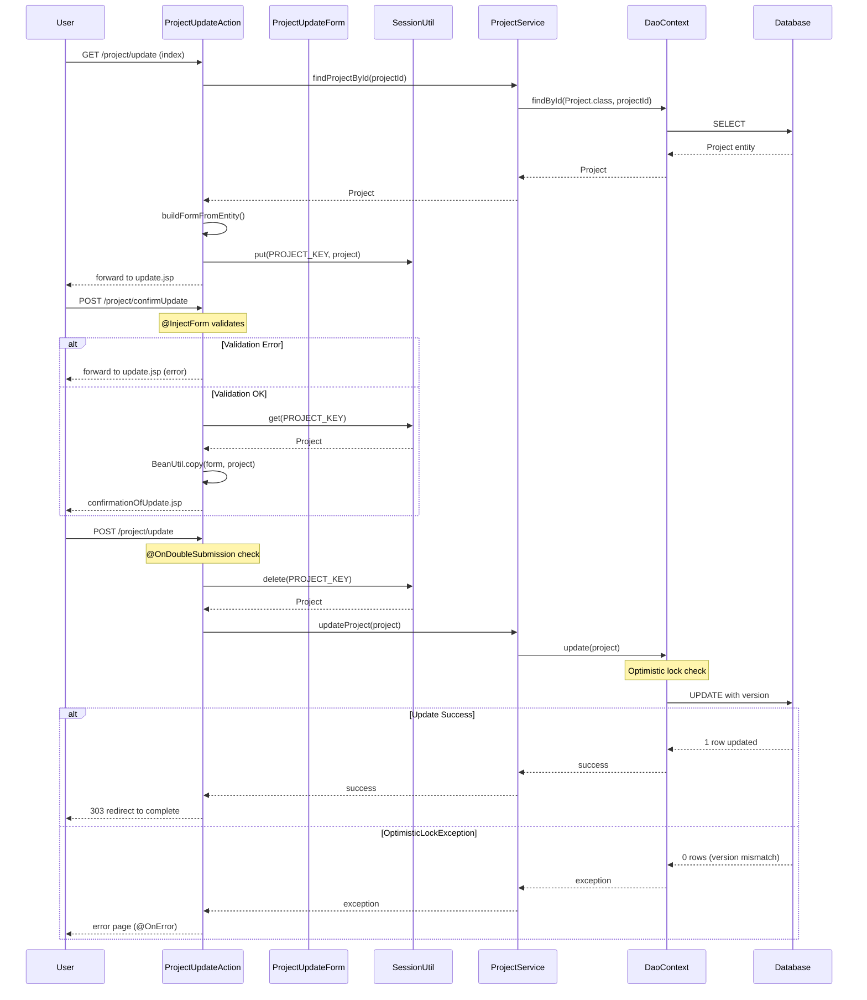

# Code Analysis: ProjectUpdateAction

**Generated**: 2026-03-02 19:02:15
**Target**: プロジェクト更新処理
**Modules**: proman-web
**Analysis Duration**: 約3分24秒

---

## Overview

ProjectUpdateActionは、Webアプリケーションにおけるプロジェクト情報の更新機能を提供するActionクラスです。更新画面表示、確認画面表示、更新実行、完了画面表示の一連の流れを制御します。

**主な責務**:
- プロジェクト詳細情報の取得と表示（`index`, `indexSetPullDown`）
- 更新内容の確認（`confirmUpdate`）
- データベースへの更新実行（`update`）
- 更新完了通知（`completeUpdate`）
- 画面間のデータ連携（SessionUtil）

**アーキテクチャパターン**: MVC（Model-View-Controller）パターンに基づき、ActionがControllerとして機能し、FormがView側のデータバインディング、ServiceとEntityがModel層を担当します。

---

## Architecture

### Dependency Graph

```mermaid
classDiagram
    class ProjectUpdateAction {
        <<Controller>>
    }
    class ProjectUpdateForm {
        <<Form>>
    }
    class ProjectUpdateInitialForm {
        <<Form>>
    }
    class ProjectService {
        <<Service>>
    }
    class Project {
        <<Entity>>
    }
    class Organization {
        <<Entity>>
    }
    class DaoContext {
        <<Nablarch>>
    }
    class SessionUtil {
        <<Nablarch>>
    }
    class BeanUtil {
        <<Nablarch>>
    }
    class ExecutionContext {
        <<Nablarch>>
    }
    class InjectForm {
        <<Nablarch>>
    }
    class OnError {
        <<Nablarch>>
    }
    class OnDoubleSubmission {
        <<Nablarch>>
    }

    ProjectUpdateAction ..> ProjectUpdateForm : validates
    ProjectUpdateAction ..> ProjectUpdateInitialForm : validates
    ProjectUpdateAction ..> ProjectService : uses
    ProjectUpdateAction ..> SessionUtil : stores/retrieves
    ProjectUpdateAction ..> BeanUtil : creates and copies
    ProjectUpdateAction ..> ExecutionContext : accesses context
    ProjectUpdateAction ..> InjectForm : injects form
    ProjectUpdateAction ..> OnError : handles errors
    ProjectUpdateAction ..> OnDoubleSubmission : prevents double submission
    ProjectUpdateForm ..|> Serializable : implements
    ProjectService ..> DaoContext : queries/updates
    ProjectService ..> Project : manages
    ProjectService ..> Organization : queries
```



**Note**: This diagram uses Mermaid `classDiagram` syntax to show class names and their relationships. Use `--|>` for inheritance (extends/implements) and `..>` for dependencies (uses/creates).

### Component Summary

| Component | Role | Type | Dependencies |
|-----------|------|------|--------------|
| ProjectUpdateAction | プロジェクト更新制御 | Action | ProjectUpdateForm, ProjectService, SessionUtil, BeanUtil |
| ProjectUpdateForm | 更新フォームデータ | Form | Bean Validation |
| ProjectUpdateInitialForm | 初期表示フォーム | Form | Bean Validation |
| ProjectService | プロジェクトDB操作 | Service | DaoContext, Project, Organization |
| Project | プロジェクトエンティティ | Entity | JPA annotations |
| Organization | 組織エンティティ | Entity | JPA annotations |

---

## Flow

### Processing Flow

プロジェクト更新処理は以下の5つのフェーズで構成されます:

**1. 更新画面初期表示（index）**
- プロジェクトIDから対象プロジェクトを検索
- Entityから更新フォームを構築（日付フォーマット変換、組織情報取得）
- プロジェクト情報をセッションに保存
- 更新画面へフォワード

**2. プルダウン設定（indexSetPullDown）**
- 詳細画面または確認画面からの遷移時に実行
- 事業部・部門のプルダウン選択肢をDBから取得
- セッション内のプロジェクト情報を保持

**3. 更新内容確認（confirmUpdate）**
- `@InjectForm`でフォームデータをバインド
- バリデーションエラー時は更新画面へ戻る（`@OnError`）
- セッションからプロジェクト情報を取得し、フォームデータでコピー（`BeanUtil.copy`）
- 組織プルダウンを再設定
- 確認画面へ遷移

**4. 更新実行（update）**
- `@OnDoubleSubmission`で二重サブミット防止
- セッションからプロジェクト情報を削除（`SessionUtil.delete`）
- ProjectServiceを使ってデータベース更新
- 完了画面へリダイレクト（303 See Other）

**5. 更新完了表示（completeUpdate）**
- 完了画面JSPを表示

**エラーハンドリング**:
- バリデーションエラー: 更新画面へ戻る
- 楽観的ロックエラー: OptimisticLockExceptionをキャッチして専用エラーページへ遷移可能

### Sequence Diagram



---

## Components

### ProjectUpdateAction

**File**: `.lw/nab-official/v6/nablarch-system-development-guide/Sample_Project/Source_Code/proman-project/proman-web/src/main/java/com/nablarch/example/proman/web/project/ProjectUpdateAction.java`

**Role**: プロジェクト更新処理のController。画面遷移とビジネスロジック呼び出しを制御

**Key Methods**:
- `index(HttpRequest, ExecutionContext)` [:35-43] - 更新画面初期表示
- `confirmUpdate(HttpRequest, ExecutionContext)` [:52-62] - 確認画面表示
- `update(HttpRequest, ExecutionContext)` [:71-77] - 更新実行
- `completeUpdate(HttpRequest, ExecutionContext)` [:86-88] - 完了画面表示
- `backToEnterUpdate(HttpRequest, ExecutionContext)` [:97-102] - 入力画面へ戻る
- `indexSetPullDown(HttpRequest, ExecutionContext)` [:135-141] - プルダウン設定

**Dependencies**:
- ProjectUpdateForm: 更新フォームデータ
- ProjectService: プロジェクトDB操作
- SessionUtil: セッション管理
- BeanUtil: Entity⇔Formコピー
- InjectForm: フォームバインディング
- OnError: エラーハンドリング
- OnDoubleSubmission: 二重サブミット防止

**Implementation Points**:
- セッションに`PROJECT_KEY`でプロジェクト情報を保存し、画面間で受け渡し
- `BeanUtil.copy`でFormからEntityへデータコピー（`confirmUpdate`で実施）
- 更新実行時は`SessionUtil.delete`でセッションから削除して取得
- リダイレクトは303 See Otherを使用（POST後のブラウザバック対策）

### ProjectUpdateForm

**File**: `.lw/nab-official/v6/nablarch-system-development-guide/Sample_Project/Source_Code/proman-project/proman-web/src/main/java/com/nablarch/example/proman/web/project/ProjectUpdateForm.java`

**Role**: 更新画面の入力値を保持するForm。Bean Validationアノテーションで検証ルールを定義

**Key Fields**:
- `projectName` [:24-27] - プロジェクト名（必須、@Domain）
- `projectType` [:32-34] - プロジェクト種別（必須）
- `projectStartDate` [:46-48] - プロジェクト開始日（必須、日付形式）
- `projectEndDate` [:52-55] - プロジェクト終了日（必須、日付形式）
- `organizationId` [:66-69] - 部門ID（必須）
- `divisionId` [:60-62] - 事業部ID（必須）

**Custom Validation**:
- `isValidProjectPeriod()` [:329-331] - 開始日≦終了日のチェック（@AssertTrue）

**Dependencies**: Bean Validation, DateRelationUtil

**Implementation Points**:
- `@Required`, `@Domain`で各フィールドの検証ルールを宣言
- カスタムバリデーションで日付の前後関係をチェック
- Serializableを実装（セッション保存に必要）

### ProjectService

**File**: `.lw/nab-official/v6/nablarch-system-development-guide/Sample_Project/Source_Code/proman-project/proman-web/src/main/java/com/nablarch/example/proman/web/project/ProjectService.java`

**Role**: プロジェクトのデータベース操作を集約するService層クラス

**Key Methods**:
- `findProjectById(Integer)` [:124-126] - プロジェクト検索（主キー）
- `updateProject(Project)` [:89-91] - プロジェクト更新
- `findOrganizationById(Integer)` [:70-73] - 組織検索（主キー）
- `findAllDivision()` [:50-52] - 事業部一覧取得
- `findAllDepartment()` [:59-61] - 部門一覧取得

**Dependencies**: DaoContext (UniversalDao), Project, Organization entities

**Implementation Points**:
- コンストラクタでDaoContextを注入（DIコンテナ or DaoFactory）
- 内部でUniversalDao（DaoContext）を使用してCRUD操作
- 組織情報取得はSQLファイル検索（`findAllBySqlFile`）を使用

---

## Nablarch Framework Usage

### UniversalDao (DaoContext)

**クラス**: `nablarch.common.dao.DaoContext`

**説明**: Jakarta Persistenceアノテーションを使った簡易O/Rマッパー。SQLを書かずに単純なCRUDを実行

**使用方法**:
```java
// 主キー検索
Project project = universalDao.findById(Project.class, projectId);

// 更新
universalDao.update(project);

// SQLファイル検索
List<Organization> divisions = universalDao.findAllBySqlFile(Organization.class, "FIND_ALL_DIVISION");
```

**重要ポイント**:
- ✅ **主キー更新**: `update()`は主キーを条件に更新。主キー以外の条件はSQLファイル使用
- ⚠️ **楽観的ロック**: Entity に`@Version`アノテーションがあれば自動で楽観的ロック実行。バージョン不一致で`OptimisticLockException`
- 💡 **Entityアノテーション**: `@Entity`, `@Table`, `@Id`, `@Column`でSQL自動生成
- 🎯 **SQLファイル検索**: JOINや複雑な検索はSQLファイル使用（`findAllBySqlFile`）

**このコードでの使い方**:
- ProjectServiceが`DaoContext`をフィールドに保持
- `findById`でプロジェクト検索、`update`で更新
- `findAllBySqlFile`で組織一覧をSQLファイル検索

**詳細**: [ユニバーサルDAO](../../.claude/skills/nabledge-6/docs/features/libraries/universal-dao.md#overview)

### SessionUtil

**クラス**: `nablarch.common.web.session.SessionUtil`

**説明**: HTTPセッションへのオブジェクト保存・取得を簡易化するユーティリティ

**使用方法**:
```java
// セッションに保存
SessionUtil.put(context, "key", object);

// セッションから取得
Object obj = SessionUtil.get(context, "key");

// セッションから削除して取得
Object obj = SessionUtil.delete(context, "key");
```

**重要ポイント**:
- ✅ **画面間データ連携**: 確認画面→更新実行の間でデータ保持
- ⚠️ **Serializable必須**: セッションに保存するオブジェクトは`Serializable`実装が必要
- 💡 **delete()の使い道**: 更新実行時など、データを取得すると同時にセッションから削除したい場合に使用
- 🎯 **セッション肥大化回避**: 必要なタイミングで`delete()`を使ってセッションをクリア

**このコードでの使い方**:
- `index()`でプロジェクト情報をセッション保存（`put`）
- `confirmUpdate()`でセッションから取得（`get`）してフォームデータで上書き
- `update()`で削除しながら取得（`delete`）して更新実行

### BeanUtil

**クラス**: `nablarch.core.beans.BeanUtil`

**説明**: JavaBeans間でプロパティをコピーするユーティリティ

**使用方法**:
```java
// フォームからエンティティへコピー
BeanUtil.copy(form, entity);

// エンティティからフォームを生成してコピー
ProjectUpdateForm form = BeanUtil.createAndCopy(ProjectUpdateForm.class, project);
```

**重要ポイント**:
- ✅ **プロパティ名一致**: コピー元とコピー先で同名のプロパティが自動マッピング
- ⚠️ **型変換制限**: 基本型の変換は可能だが、複雑な型変換は個別に処理が必要
- 💡 **createAndCopy**: インスタンス生成とコピーを1ステップで実行できる便利メソッド
- ⚡ **パフォーマンス**: 内部でリフレクションを使用するが、Nablarch内で最適化済み

**このコードでの使い方**:
- `buildFormFromEntity()`で`createAndCopy`を使用してEntityからFormを生成
- `confirmUpdate()`で`copy`を使用してFormからEntityへデータを上書き

### @InjectForm

**アノテーション**: `nablarch.common.web.interceptor.InjectForm`

**説明**: HTTPリクエストパラメータをFormオブジェクトにバインドし、Bean Validationを実行

**使用方法**:
```java
@InjectForm(form = ProjectUpdateForm.class, prefix = "form")
public HttpResponse confirmUpdate(HttpRequest request, ExecutionContext context) {
    ProjectUpdateForm form = context.getRequestScopedVar("form");
    // ...
}
```

**重要ポイント**:
- ✅ **自動バインディング**: リクエストパラメータを自動的にFormのフィールドにマッピング
- ✅ **自動バリデーション**: Bean Validationアノテーション（`@Required`, `@Domain`等）を自動実行
- ⚠️ **エラー時の動作**: バリデーションエラーは`ApplicationException`としてスロー。`@OnError`で画面遷移制御
- 💡 **prefix属性**: HTMLのname属性がネストしている場合（`form.projectName`）に対応

**このコードでの使い方**:
- `index()`で`ProjectUpdateInitialForm`をバインド（プロジェクトID取得）
- `confirmUpdate()`で`ProjectUpdateForm`をバインドしてバリデーション実行

### @OnError

**アノテーション**: `nablarch.fw.web.interceptor.OnError`

**説明**: 指定した例外発生時の画面遷移先を定義

**使用方法**:
```java
@OnError(type = ApplicationException.class, path = "forward:///app/project/moveUpdate")
public HttpResponse confirmUpdate(HttpRequest request, ExecutionContext context) {
    // ...
}
```

**重要ポイント**:
- ✅ **宣言的エラーハンドリング**: 例外ごとに遷移先をアノテーションで定義
- 💡 **ApplicationException**: Bean Validationエラーは`ApplicationException`としてスロー
- 🎯 **forward指定**: `forward://`で内部フォワード、`redirect://`でリダイレクト
- ⚡ **OptimisticLockException対応**: 楽観的ロックエラー専用のエラーページへ遷移可能

**このコードでの使い方**:
- `confirmUpdate()`でバリデーションエラー時に更新画面へフォワード

### @OnDoubleSubmission

**アノテーション**: `nablarch.common.web.token.OnDoubleSubmission`

**説明**: フォームの二重サブミットを防止するトークンチェック

**使用方法**:
```java
@OnDoubleSubmission
public HttpResponse update(HttpRequest request, ExecutionContext context) {
    // 更新処理
}
```

**重要ポイント**:
- ✅ **自動トークンチェック**: トークン不一致で二重サブミットとして検出し、エラー画面へ遷移
- ⚠️ **トークン生成**: 確認画面などでトークンを生成しておく必要あり（通常はカスタムタグで自動生成）
- 💡 **ブラウザバック対策**: 完了画面でブラウザバックして再度更新ボタンを押す操作を防止
- 🎯 **更新系処理に必須**: 登録・更新・削除など副作用のある処理には必ず付与

**このコードでの使い方**:
- `update()`メソッドに付与して二重サブミット防止

---

## References

### Source Files

- [ProjectUpdateAction.java](../../../../../../../../ProjectUpdateAction.java) - ProjectUpdateAction
- [ProjectUpdateForm.java](../../../../../../../../ProjectUpdateForm.java) - ProjectUpdateForm
- [ProjectService.java](../../../../../../../../ProjectService.java) - ProjectService

### Knowledge Base (Nabledge-6)

- [Universal Dao.json](../../../../../../../../universal-dao.json)

### Official Documentation

(No official documentation links available)

---

**Note**: This documentation was generated by the code-analysis workflow of the nabledge-6 skill.
