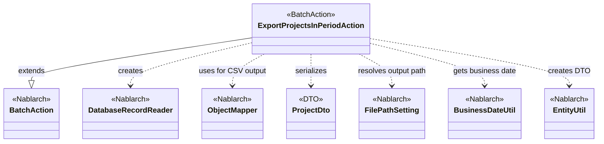
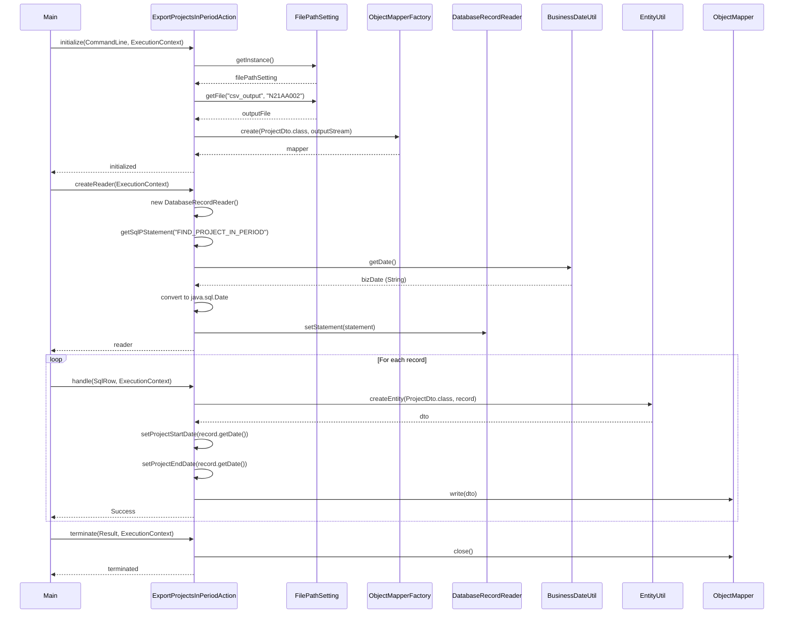

# Code Analysis: ExportProjectsInPeriodAction

**Generated**: 2026-03-02 19:16:33
**Target**: 期間内プロジェクト一覧CSV出力バッチアクション
**Modules**: proman-batch
**Analysis Duration**: 約2分56秒

---

## Overview

ExportProjectsInPeriodActionは、データベースから期間内のプロジェクト情報を検索し、CSV形式で出力する都度起動型バッチアクションです。業務日付を基準として、その日に稼働中のプロジェクト（開始日 ≦ 業務日付 ≦ 終了日）を抽出し、指定されたファイルパスにCSVファイルとして出力します。

このアクションは、Nablarchバッチフレームワークの「DB to FILE」パターンを実装しており、DatabaseRecordReaderでデータベースからレコードを1件ずつ読み込み、ObjectMapperでCSVファイルに書き込む処理を行います。大量データを扱う場合でも、メモリを効率的に使用しながら処理できる設計となっています。

---

## Architecture

### Dependency Graph



**Note**: This diagram uses Mermaid `classDiagram` syntax to show class names and their relationships. Use `--|>` for inheritance (extends/implements) and `..>` for dependencies (uses/creates).

### Component Summary

| Component | Role | Type | Dependencies |
|-----------|------|------|--------------|
| ExportProjectsInPeriodAction | 期間内プロジェクト一覧CSV出力 | Action | DatabaseRecordReader, ObjectMapper, FilePathSetting, BusinessDateUtil, EntityUtil |
| ProjectDto | プロジェクト情報データ転送オブジェクト | DTO | @Csv, @CsvFormat annotations |
| FIND_PROJECT_IN_PERIOD | 期間内プロジェクト検索SQL | SQL | なし |

---

## Flow

### Processing Flow

1. **初期化フェーズ (initialize)**:
   - FilePathSettingから出力ファイルパスを解決
   - ObjectMapperFactoryでProjectDto用のCSVマッパーを生成
   - ファイル出力ストリームを開く

2. **データ読み込みフェーズ (createReader)**:
   - DatabaseRecordReaderを生成
   - FIND_PROJECT_IN_PERIOD SQLを設定
   - BusinessDateUtilから業務日付を取得
   - 業務日付をSQLパラメータに設定（開始日・終了日の範囲条件）

3. **レコード処理フェーズ (handle)**:
   - DatabaseRecordReaderが1件ずつSqlRowを提供
   - EntityUtilでSqlRowをProjectDtoに変換
   - 日付型項目（開始日・終了日）は個別にsetterで設定
   - ObjectMapperでCSVレコードとして出力
   - Successを返却

4. **終了処理フェーズ (terminate)**:
   - ObjectMapperをクローズ（バッファフラッシュ、リソース解放）

### Sequence Diagram



---

## Components

### 1. ExportProjectsInPeriodAction

**File**: [ExportProjectsInPeriodAction.java:31-81](../../.lw/nab-official/v6/nablarch-system-development-guide/Sample_Project/Source_Code/proman-project/proman-batch/src/main/java/com/nablarch/example/proman/batch/project/ExportProjectsInPeriodAction.java)

**Role**: 期間内プロジェクト一覧出力の都度起動バッチアクションクラス

**Key Methods**:
- `initialize()` [:44-54] - ファイル出力先の準備とObjectMapper生成
- `createReader()` [:57-65] - DatabaseRecordReaderを生成してSQLを設定
- `handle()` [:68-75] - 1レコードをProjectDtoに変換してCSV出力
- `terminate()` [:78-80] - ObjectMapperをクローズ

**Dependencies**:
- BatchAction<SqlRow> (extends)
- DatabaseRecordReader (creates in createReader)
- ObjectMapper<ProjectDto> (field)
- FilePathSetting (for output path resolution)
- BusinessDateUtil (for business date)
- EntityUtil (for DTO conversion)

**Implementation Points**:
- OUTPUT_FILE_NAME定数でファイル名を定義（"N21AA002"）
- initializeでFilePathSettingから論理名"csv_output"を解決
- createReaderで業務日付を取得し、java.sql.Dateに変換してSQLパラメータに設定
- handleでEntityUtilによる自動マッピング後、日付項目は個別にsetterで設定
- terminateでObjectMapperをクローズ（必須）

### 2. ProjectDto

**File**: [ProjectDto.java:1-269](../../.lw/nab-official/v6/nablarch-system-development-guide/Sample_Project/Source_Code/proman-project/proman-batch/src/main/java/com/nablarch/example/proman/batch/project/ProjectDto.java)

**Role**: 期間内プロジェクト一覧出力用のデータ転送オブジェクト

**Annotations**:
- `@Csv` [:15-19] - CSV出力項目順序とヘッダー定義
  - type = Csv.CsvType.CUSTOM
  - properties配列で出力項目順序を指定
  - headers配列で日本語ヘッダーを指定
- `@CsvFormat` [:20-21] - CSV詳細設定
  - fieldSeparator = ','
  - lineSeparator = "\r\n"
  - quote = '\"'
  - charset = "UTF-8"
  - quoteMode = QuoteMode.ALL

**Fields** (13項目):
- projectId, projectName, projectType, projectClass
- projectStartDate, projectEndDate (String型でフォーマット済み)
- organizationId, clientId, projectManager, projectLeader
- note, sales, versionNo

**Implementation Points**:
- 日付項目はString型で保持（EntityUtilでの自動変換を避けるため）
- setProjectStartDate/EndDateメソッドでDate型を受け取り、DateUtilでフォーマット
- @CsvアノテーションでCSV出力仕様を宣言的に定義

### 3. FIND_PROJECT_IN_PERIOD

**SQL File**: ExportProjectsInPeriodAction.sql (想定)

**Purpose**: 業務日付時点で稼働中のプロジェクトを検索

**Search Conditions**:
- PROJECT_START_DATE <= :businessDate
- PROJECT_END_DATE >= :businessDate

**Parameters**:
- :businessDate (java.sql.Date) - 業務日付（2回使用）

**Implementation Points**:
- getSqlPStatement("FIND_PROJECT_IN_PERIOD")で読み込み
- statement.setDate(1, bizDate)で1番目のパラメータ設定
- statement.setDate(2, bizDate)で2番目のパラメータ設定

---

## Nablarch Framework Usage

### BatchAction

**クラス**: `nablarch.fw.action.BatchAction<TData>`

**説明**: バッチ処理の基底クラス。データ読み込み、処理、終了処理のライフサイクルを提供する

**使用方法**:
```java
public class ExportProjectsInPeriodAction extends BatchAction<SqlRow> {
    @Override
    public DataReader<SqlRow> createReader(ExecutionContext context) {
        // DatabaseRecordReaderを生成
    }

    @Override
    public Result handle(SqlRow record, ExecutionContext context) {
        // 1レコードの処理
    }
}
```

**重要ポイント**:
- ✅ **createReaderの実装**: DataReaderを返却する（DatabaseRecordReader, FileDataReaderなど）
- ✅ **handleの実装**: 1レコードごとの処理を実装し、Resultを返却
- 💡 **ジェネリック型**: createReaderの戻り値とhandleの引数の型を一致させる（SqlRow, Map, Beanなど）
- 🎯 **いつ使うか**: DB to FILE, FILE to DB, DB to DBなどの大量データ処理

**このコードでの使い方**:
- BatchAction<SqlRow>を継承
- createReaderでDatabaseRecordReaderを返却
- handleでSqlRowを受け取り、ProjectDtoに変換してCSV出力

**詳細**: [Nablarchバッチ処理](../../.claude/skills/nabledge-6/docs/features/processing/nablarch-batch.md)

### DatabaseRecordReader

**クラス**: `nablarch.fw.reader.DatabaseRecordReader`

**説明**: データベースからレコードを1件ずつ読み込むDataReaderの実装

**使用方法**:
```java
DatabaseRecordReader reader = new DatabaseRecordReader();
SqlPStatement statement = getSqlPStatement("FIND_PROJECT_IN_PERIOD");
statement.setDate(1, bizDate);
statement.setDate(2, bizDate);
reader.setStatement(statement);
return reader;
```

**重要ポイント**:
- ✅ **SqlPStatementの設定**: getSqlPStatement()でSQLを取得し、パラメータを設定してからreader.setStatement()
- ⚡ **メモリ効率**: ResultSetのカーソルを使用するため、大量データでもメモリを圧迫しない
- 💡 **トランザクション制御**: LoopHandlerと組み合わせてコミット間隔を制御可能
- ⚠️ **close処理不要**: フレームワークが自動的にクローズする

**このコードでの使い方**:
- createReaderでDatabaseRecordReaderを生成
- FIND_PROJECT_IN_PERIOD SQLを読み込み
- 業務日付をパラメータに設定
- reader.setStatement()で設定完了

**詳細**: [Nablarchバッチ処理 - DataReaders](../../.claude/skills/nabledge-6/docs/features/processing/nablarch-batch.md)

### ObjectMapper

**クラス**: `nablarch.common.databind.ObjectMapper`

**説明**: CSVやTSV、固定長データをJava Beansとして扱う機能を提供する

**使用方法**:
```java
// 生成
ObjectMapper<ProjectDto> mapper = ObjectMapperFactory.create(ProjectDto.class, outputStream);

// 書き込み
mapper.write(dto);

// クローズ
mapper.close();
```

**重要ポイント**:
- ✅ **必ずclose()を呼ぶ**: バッファをフラッシュし、リソースを解放する（terminate()で実施）
- ⚡ **大量データ処理**: メモリに全データを保持しないため、大量データでも問題なく処理可能
- ⚠️ **型変換の制限**: EntityUtilと同様に、複雑な型変換が必要な項目は個別設定が必要
- 💡 **アノテーション駆動**: @Csv, @CsvFormatでフォーマットを宣言的に定義できる
- 💡 **保守性の高さ**: フォーマット変更時はアノテーションを変更するだけで対応可能

**このコードでの使い方**:
- initialize()でProjectDto用のObjectMapperを生成（Line 50）
- handle()で各レコードをmapper.write(dto)で出力（Line 73）
- terminate()でmapper.close()してリソース解放（Line 79）

**詳細**: [データバインド](../../.claude/skills/nabledge-6/docs/features/libraries/data-bind.md)

### FilePathSetting

**クラス**: `nablarch.core.util.FilePathSetting`

**説明**: 論理名を使ってファイルパスを管理する機能を提供する

**使用方法**:
```java
FilePathSetting filePathSetting = FilePathSetting.getInstance();
File output = filePathSetting.getFile("csv_output", "N21AA002");
```

**重要ポイント**:
- 💡 **論理名と物理パスの分離**: 環境ごとの物理パスの違いを吸収できる
- ✅ **設定ファイル**: システムリポジトリでbasePathSettingsとfileExtensionsを設定
- 🎯 **いつ使うか**: バッチ出力ファイル、ファイル入力、テンプレートファイルなど
- ⚠️ **拡張子の扱い**: fileExtensionsで拡張子を定義すると自動付与される

**このコードでの使い方**:
- initialize()でFilePathSetting.getInstance()を取得
- getFile("csv_output", "N21AA002")で出力ファイルパスを解決
- FileOutputStreamを生成してObjectMapperに渡す

**詳細**: [ファイルパス管理](../../.claude/skills/nabledge-6/docs/features/libraries/file-path-management.md)

### BusinessDateUtil

**クラス**: `nablarch.core.date.BusinessDateUtil`

**説明**: システム全体で統一された業務日付を取得する機能を提供する

**使用方法**:
```java
// デフォルト区分の業務日付
String bizDate = BusinessDateUtil.getDate();
// → "20260302"（yyyyMMdd形式）

// 区分別の業務日付
String batchDate = BusinessDateUtil.getDate("batch");
```

**重要ポイント**:
- 💡 **システム横断の日付統一**: System.currentTimeMillis()やLocalDate.now()ではなく、これを使うことでバッチ処理と画面処理で同じ業務日付を共有できる
- ✅ **必ずDatabaseRecordReaderのパラメータに変換**: 取得した文字列はjava.sql.Dateに変換してSQLパラメータに設定する
- 🎯 **いつ使うか**: 日付ベースの検索条件、レポート生成、ファイル名の日付部分など
- ⚠️ **設定が必要**: システムリポジトリに業務日付テーブルまたは固定値を設定する必要がある

**このコードでの使い方**:
- createReader()で業務日付を取得（Line 60）
- java.sql.Dateに変換してSQLパラメータに設定（Line 61-62）
- プロジェクトの開始日・終了日との比較条件として使用

**詳細**: [業務日付管理](../../.claude/skills/nabledge-6/docs/features/libraries/business-date.md)

### EntityUtil

**クラス**: `nablarch.common.dao.EntityUtil`

**説明**: SqlRowからEntityやDTOへの変換を行うユーティリティ

**使用方法**:
```java
ProjectDto dto = EntityUtil.createEntity(ProjectDto.class, record);
```

**重要ポイント**:
- 💡 **自動マッピング**: カラム名とプロパティ名が一致する項目を自動的にマッピング
- ⚠️ **型変換の制限**: 複雑な型変換（Date→String等）は自動で行われないため、個別にsetterを呼ぶ
- ✅ **命名規則**: カラム名はUPPER_SNAKE_CASE、プロパティ名はlowerCamelCaseで対応

**このコードでの使い方**:
- handle()でEntityUtil.createEntity()を呼び出し（Line 69）
- 日付項目（PROJECT_START_DATE, PROJECT_END_DATE）は個別にsetterで設定（Line 71-72）

**詳細**: [Nablarchバッチ処理 - EntityUtil](../../.claude/skills/nabledge-6/docs/features/processing/nablarch-batch.md)

---

## References

### Source Files

- [ExportProjectsInPeriodAction.java](../../.lw/nab-official/v6/nablarch-system-development-guide/Sample_Project/Source_Code/proman-project/proman-batch/src/main/java/com/nablarch/example/proman/batch/project/ExportProjectsInPeriodAction.java) - ExportProjectsInPeriodAction
- [ProjectDto.java](../../.lw/nab-official/v6/nablarch-system-development-guide/Sample_Project/Source_Code/proman-project/proman-batch/src/main/java/com/nablarch/example/proman/batch/project/ProjectDto.java) - ProjectDto

### Knowledge Base (Nabledge-6)

- [Nablarch Batch](../../.claude/skills/nabledge-6/docs/features/processing/nablarch-batch.md)
- [Data Bind](../../.claude/skills/nabledge-6/docs/features/libraries/data-bind.md)
- [Business Date](../../.claude/skills/nabledge-6/docs/features/libraries/business-date.md)
- [File Path Management](../../.claude/skills/nabledge-6/docs/features/libraries/file-path-management.md)

### Official Documentation

- [Index](https://nablarch.github.io/docs/LATEST/doc/application_framework/application_framework/batch/index.html)
- [Data Bind](https://nablarch.github.io/docs/LATEST/doc/application_framework/application_framework/libraries/data_io/data_bind.html)

---

**Note**: This documentation was generated by the code-analysis workflow of the nabledge-6 skill.
