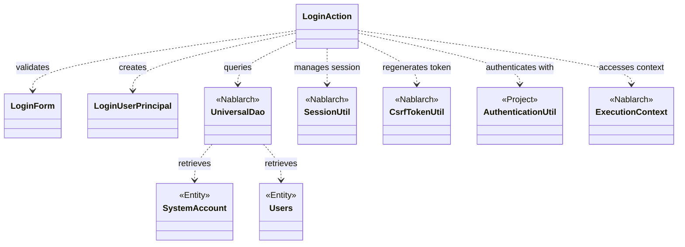
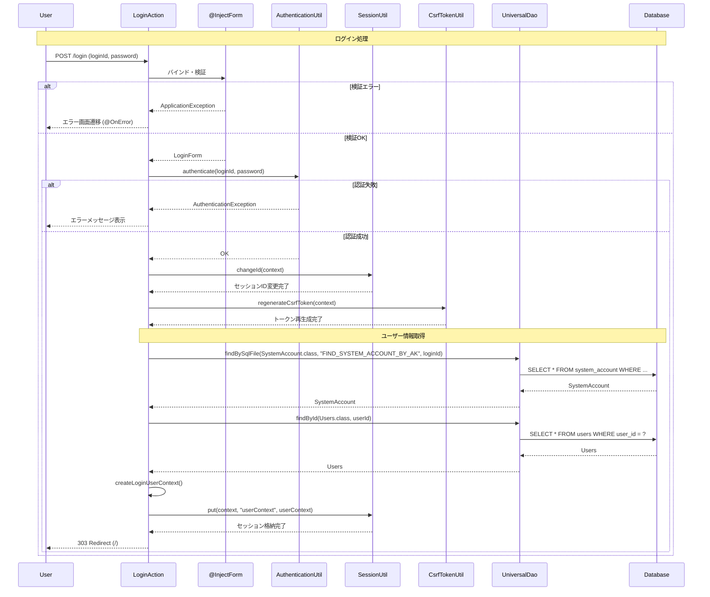

# Code Analysis: LoginAction

**Generated**: 2026-03-02 19:16:04
**Target**: ログイン認証処理（認証・セッション管理・ログアウト）
**Modules**: proman-web
**Analysis Duration**: 約2分44秒

---

## Overview

LoginActionは、Webアプリケーションのログイン認証処理を担当するアクションクラスです。ユーザーのログイン画面表示、認証処理、ログアウト処理の3つの主要機能を提供します。

**主な機能**:
- **ログイン画面表示** (`index`メソッド): ログイン画面をユーザーに提示
- **認証処理** (`login`メソッド): ユーザー認証、セッション管理、CSRF対策を実施
- **ログアウト処理** (`logout`メソッド): セッションを無効化してログアウト

**セキュリティ対策**:
- フォーム検証: `@InjectForm`でLoginFormを自動バインド・検証
- 認証: AuthenticationUtilで認証を実施
- セッション固定攻撃対策: 認証成功時にSessionUtil.changeId()でセッションIDを変更
- CSRF対策: CsrfTokenUtil.regenerateCsrfToken()でトークン再生成

**データアクセス**:
- UniversalDaoでSystemAccountとUsersエンティティを検索
- 認証情報をセッションに格納してユーザーコンテキストを確立

---

## Architecture

### Dependency Graph



**Note**: This diagram uses Mermaid `classDiagram` syntax to show class names and their relationships. Use `--|>` for inheritance (extends/implements) and `..>` for dependencies (uses/creates).

### Component Summary

| Component | Role | Type | Dependencies |
|-----------|------|------|--------------|
| LoginAction | ログイン認証処理 | Action | LoginForm, UniversalDao, SessionUtil, CsrfTokenUtil, AuthenticationUtil |
| LoginForm | ログイン入力検証 | Form | @Required, @Domain |
| SystemAccount | システムアカウント情報 | Entity | なし |
| Users | ユーザー情報 | Entity | なし |
| LoginUserPrincipal | ログインユーザーコンテキスト | DTO | なし |

---

## Flow

### Processing Flow

**ログイン画面表示フロー** (`index`メソッド):
1. ユーザーがログイン画面にアクセス
2. LoginActionがJSP画面（/WEB-INF/view/login/login.jsp）を返却
3. ブラウザに画面が表示される

**認証フロー** (`login`メソッド):
1. ユーザーがログインIDとパスワードを入力して送信
2. `@InjectForm`インターセプタがLoginFormにバインド・検証を実施
3. 検証エラー時は`@OnError`によりログイン画面に戻る
4. AuthenticationUtilでID・パスワードを検証
5. 認証失敗時はApplicationExceptionをスローし、`@OnError`によりログイン画面に戻る
6. 認証成功時はセッション固定攻撃対策として以下を実施:
   - `SessionUtil.changeId()`でセッションIDを変更
   - `CsrfTokenUtil.regenerateCsrfToken()`でCSRFトークンを再生成
7. `createLoginUserContext()`でログインユーザー情報を構築:
   - UniversalDaoでSystemAccountをSQLファイルから検索
   - UniversalDaoでUsersを主キー検索
   - LoginUserPrincipalに情報を設定
8. ユーザーコンテキストをセッションに格納
9. トップ画面にリダイレクト（303 See Other）

**ログアウトフロー** (`logout`メソッド):
1. ユーザーがログアウトを要求
2. `SessionUtil.invalidate()`でセッションを無効化
3. ログイン画面にリダイレクト（303 See Other）

### Sequence Diagram



---

## Components

### 1. LoginAction

**File**: [LoginAction.java:29-108](../../../../../../../../.lw/nab-official/v6/nablarch-system-development-guide/Sample_Project/Source_Code/proman-project/proman-web/src/main/java/com/nablarch/example/proman/web/login/LoginAction.java)

**Role**: ログイン認証処理のアクションクラス

**Key Methods**:
- `index()` [:38-40] - ログイン画面を表示
- `login()` [:51-71] - ログイン認証処理を実行
- `createLoginUserContext()` [:79-92] - ログインユーザーコンテキストを生成
- `logout()` [:102-106] - ログアウト処理を実行

**Dependencies**:
- LoginForm: 入力値検証
- AuthenticationUtil: 認証処理
- SessionUtil: セッション管理
- CsrfTokenUtil: CSRFトークン管理
- UniversalDao: データベースアクセス

**Key Implementation Points**:
- **セキュリティ重視設計**: セッション固定攻撃対策、CSRFトークン再生成、認証エラーの適切な処理
- **@InjectFormと@OnErrorの活用**: フォームバインド・検証、エラー時の画面遷移を宣言的に実現
- **303リダイレクト**: POST後のブラウザ更新による二重送信を防止

### 2. LoginForm

**File**: [LoginForm.java:13-62](../../../../../../../../.lw/nab-official/v6/nablarch-system-development-guide/Sample_Project/Source_Code/proman-project/proman-web/src/main/java/com/nablarch/example/proman/web/login/LoginForm.java)

**Role**: ログイン入力フォームの検証

**Annotations**:
- `@Required` [:21, 26] - 必須チェック
- `@Domain` [:22, 27] - ドメイン検証（loginId, userPassword）

**Dependencies**: なし

**Key Implementation Points**:
- **Bean Validation**: アノテーションベースの宣言的検証
- **Serializable実装**: セッションへの保存を想定

### 3. SystemAccount (Entity)

**Role**: システムアカウント情報を表すエンティティ

**Key Fields**:
- userId: ユーザーID
- loginId: ログインID
- lastLoginDateTime: 最終ログイン日時

**Usage**: UniversalDao.findBySqlFile()で検索（SQLファイル: FIND_SYSTEM_ACCOUNT_BY_AK）

### 4. Users (Entity)

**Role**: ユーザー詳細情報を表すエンティティ

**Key Fields**:
- userId: ユーザーID（主キー）
- kanjiName: 漢字氏名
- pmFlag: プロジェクトマネージャーフラグ

**Usage**: UniversalDao.findById()で主キー検索

### 5. LoginUserPrincipal

**Role**: ログインユーザーのコンテキスト情報

**Key Fields**:
- userId: ユーザーID
- kanjiName: 漢字氏名
- pmFlag: PMフラグ
- lastLoginDateTime: 最終ログイン日時

**Usage**: セッションに格納して認証状態を保持

---

## Nablarch Framework Usage

### UniversalDao

**クラス**: `nablarch.common.dao.UniversalDao`

**説明**: シンプルなO/Rマッピング機能を提供するDAO。主キー検索、SQLファイル検索、CRUD操作をサポート。

**使用方法**:
```java
// SQLファイルによる検索
SystemAccount account = UniversalDao.findBySqlFile(
    SystemAccount.class,
    "FIND_SYSTEM_ACCOUNT_BY_AK",
    new Object[]{loginId}
);

// 主キーによる検索
Users users = UniversalDao.findById(Users.class, account.getUserId());
```

**重要ポイント**:
- ✅ **SQLファイル検索の活用**: 複雑な検索条件はSQLファイルに記述し、findBySqlFile()で実行
- 💡 **主キー検索の簡潔さ**: findById()は主キーを指定するだけで取得可能
- 🎯 **いつ使うか**: シンプルなCRUD操作、主キー検索、SQLファイルベースの検索
- ⚠️ **制約**: 主キー以外の条件での更新/削除は不可（その場合はDatabaseを使用）

**このコードでの使い方**:
- `createLoginUserContext()`でSystemAccountをSQLファイル検索（Line 80-82）
- `createLoginUserContext()`でUsersを主キー検索（Line 83）

**詳細**: [Universal Dao](../../../../../../../../.claude/skills/nabledge-6/docs/features/libraries/universal-dao.md)

### @InjectForm

**クラス**: `nablarch.common.web.interceptor.InjectForm`

**説明**: リクエストパラメータを自動的にFormにバインドし、Bean Validationによる検証を実行するインターセプタ

**使用方法**:
```java
@InjectForm(form = LoginForm.class)
public HttpResponse login(HttpRequest request, ExecutionContext context) {
    LoginForm form = context.getRequestScopedVar("form");
    // フォームは既にバインド・検証済み
}
```

**重要ポイント**:
- ✅ **自動バインド**: リクエストパラメータをFormオブジェクトに自動変換
- ✅ **自動検証**: Bean Validationアノテーション（@Required, @Domain等）を自動実行
- 💡 **宣言的処理**: コード量を減らし、ビジネスロジックに集中できる
- ⚠️ **検証エラー時**: ApplicationExceptionがスローされ、@OnErrorで処理

**このコードでの使い方**:
- `login()`メソッドで使用（Line 50）
- LoginFormを自動バインド・検証し、リクエストスコープに格納

**詳細**: [Data Bind](../../../../../../../../.claude/skills/nabledge-6/docs/features/libraries/data-bind.md)

### @OnError

**クラス**: `nablarch.fw.web.interceptor.OnError`

**説明**: 特定の例外発生時に指定した画面にフォワードするインターセプタ

**使用方法**:
```java
@OnError(type = ApplicationException.class, path = "/WEB-INF/view/login/login.jsp")
public HttpResponse login(HttpRequest request, ExecutionContext context) {
    // 検証エラー時は自動的にログイン画面にフォワード
}
```

**重要ポイント**:
- ✅ **例外ハンドリングの簡潔化**: try-catchなしで例外処理を宣言的に記述
- 💡 **ユーザーエクスペリエンス向上**: エラー時に適切な画面に遷移し、エラーメッセージを表示
- 🎯 **いつ使うか**: フォーム検証エラー、業務例外、権限チェック失敗時など
- ⚠️ **対象例外**: type属性で指定した例外とそのサブクラスが対象

**このコードでの使い方**:
- `login()`メソッドで使用（Line 49）
- ApplicationException発生時にログイン画面にフォワード

### SessionUtil

**クラス**: `nablarch.common.web.session.SessionUtil`

**説明**: HTTPセッション管理のユーティリティクラス

**使用方法**:
```java
// セッションIDを変更（セッション固定攻撃対策）
SessionUtil.changeId(context);

// セッションに値を格納
SessionUtil.put(context, "userContext", userContext);

// セッションを無効化
SessionUtil.invalidate(context);
```

**重要ポイント**:
- ✅ **セキュリティ**: changeId()でセッション固定攻撃を防止
- 💡 **認証後のセッションID変更は必須**: 認証成功時に必ず実施すべきセキュリティ対策
- 🎯 **いつ使うか**: ログイン成功時（ID変更）、ユーザー情報保持（格納）、ログアウト時（無効化）
- ⚠️ **ExecutionContextが必要**: 全メソッドでExecutionContextを引数に指定

**このコードでの使い方**:
- `login()`でセッションID変更（Line 65）
- `login()`でユーザーコンテキスト格納（Line 69）
- `logout()`でセッション無効化（Line 103）

### CsrfTokenUtil

**クラス**: `nablarch.common.web.csrf.CsrfTokenUtil`

**説明**: CSRF（Cross-Site Request Forgery）攻撃を防ぐためのトークン管理ユーティリティ

**使用方法**:
```java
// CSRFトークンを再生成
CsrfTokenUtil.regenerateCsrfToken(context);
```

**重要ポイント**:
- ✅ **CSRF対策の必須要素**: ログイン成功時に必ずトークンを再生成
- 💡 **セキュリティ向上**: トークン再生成により、ログイン前のトークンが無効化され、CSRF攻撃を防止
- 🎯 **いつ使うか**: ログイン成功時、セッションID変更時
- ⚠️ **SessionUtil.changeId()とセット**: セッションID変更とトークン再生成は常にセットで実施

**このコードでの使い方**:
- `login()`でトークン再生成（Line 66）
- セッションID変更直後に実施

### ExecutionContext

**クラス**: `nablarch.fw.ExecutionContext`

**説明**: リクエスト処理中のコンテキスト情報を保持するオブジェクト

**使用方法**:
```java
// リクエストスコープから値を取得
LoginForm form = context.getRequestScopedVar("form");

// セッション操作時に使用
SessionUtil.changeId(context);
SessionUtil.put(context, "key", value);
```

**重要ポイント**:
- 💡 **リクエストライフサイクル全体で共有**: ハンドラ、アクション、インターセプタ間でデータを受け渡し
- 🎯 **いつ使うか**: リクエストスコープのデータアクセス、セッション操作、ハンドラキュー操作
- ⚠️ **スレッドセーフではない**: リクエスト単位で独立したインスタンスとして扱う

**このコードでの使い方**:
- `index()`, `login()`, `logout()`の引数として受け取る
- `login()`でリクエストスコープからLoginFormを取得（Line 53）
- SessionUtilとCsrfTokenUtilの操作時に使用

---

## References

### Source Files

- [LoginAction.java](../../../../../../../../.lw/nab-official/v6/nablarch-system-development-guide/Sample_Project/Source_Code/proman-project/proman-web/src/main/java/com/nablarch/example/proman/web/login/LoginAction.java) - LoginAction
- [LoginForm.java](../../../../../../../../.lw/nab-official/v6/nablarch-system-development-guide/Sample_Project/Source_Code/proman-project/proman-web/src/main/java/com/nablarch/example/proman/web/login/LoginForm.java) - LoginForm

### Knowledge Base (Nabledge-6)

- [Universal Dao](../../../../../../../../.claude/skills/nabledge-6/docs/features/libraries/universal-dao.md)
- [Data Bind](../../../../../../../../.claude/skills/nabledge-6/docs/features/libraries/data-bind.md)

### Official Documentation

- [Universal Dao](https://nablarch.github.io/docs/LATEST/doc/application_framework/application_framework/libraries/database/universal_dao.html)
- [Index](https://nablarch.github.io/docs/LATEST/doc/application_framework/application_framework/web_application/index.html)

---

**Note**: This documentation was generated by the code-analysis workflow of the nabledge-6 skill.
