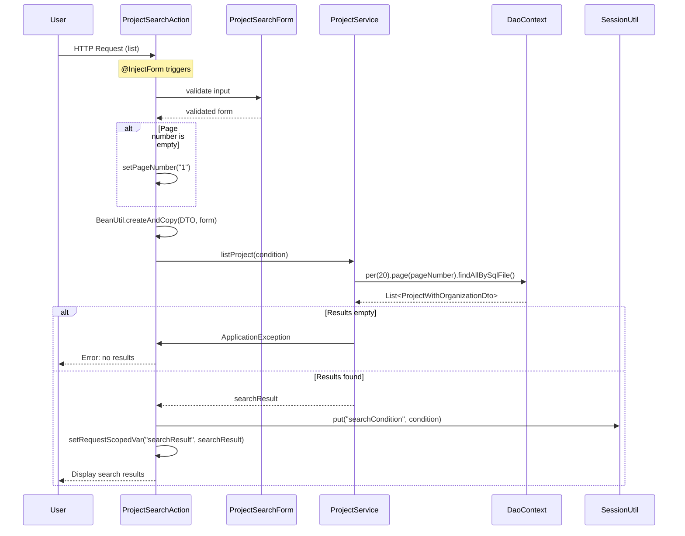

# Code Analysis: ProjectSearchAction

**Generated**: 2026-03-02 19:16:41
**Target**: プロジェクト検索機能
**Modules**: proman-web
**Analysis Duration**: 約3分2秒

---

## Overview

ProjectSearchActionは、proman-webモジュールのプロジェクト検索機能を提供するアクションクラスです。検索画面の初期表示、検索条件による一覧表示、詳細画面からの戻り処理を担当します。

主な機能:
- **検索画面初期表示** (`search`): セッションをクリアし、事業部・部門の選択肢を設定
- **一覧検索** (`list`): フォームから検索条件を取得し、ページング付きで検索実行
- **検索画面に戻る** (`backToList`): セッションに保存した検索条件で再検索
- **詳細画面表示** (`detail`): プロジェクトIDから詳細情報を取得

ProjectServiceを使ってデータベースアクセスを実行し、UniversalDaoのページング機能とfindAllBySqlFileを活用しています。BeanUtilでフォームとDTOを相互変換し、SessionUtilで検索条件を保持します。

---

## Architecture

### Dependency Graph

```mermaid
classDiagram
    class ProjectSearchAction {
        <<Action>>
    }
    class ProjectService {
        <<Service>>
    }
    class ProjectSearchForm {
        <<Form>>
    }
    class ProjectSearchConditionDto {
        <<DTO>>
    }
    class DaoContext {
        <<Nablarch>>
    }
    class BeanUtil {
        <<Nablarch>>
    }
    class SessionUtil {
        <<Nablarch>>
    }
    class ExecutionContext {
        <<Nablarch>>
    }

    ProjectSearchAction ..> ProjectService : uses
    ProjectSearchAction ..> ProjectSearchForm : validates
    ProjectSearchAction ..> ProjectSearchConditionDto : creates
    ProjectSearchAction ..> BeanUtil : converts with
    ProjectSearchAction ..> SessionUtil : stores condition
    ProjectSearchAction ..> ExecutionContext : accesses
    ProjectService ..> DaoContext : queries with
    ProjectSearchForm --|> SearchFormBase : extends
```



**Note**: This diagram uses Mermaid `classDiagram` syntax to show class names and their relationships. Use `--|>` for inheritance (extends/implements) and `..>` for dependencies (uses/creates).

### Component Summary

| Component | Role | Type | Dependencies |
|-----------|------|------|--------------|
| ProjectSearchAction | プロジェクト検索処理 | Action | ProjectService, BeanUtil, SessionUtil, ExecutionContext |
| ProjectService | プロジェクト検索サービス | Service | DaoContext (UniversalDao) |
| ProjectSearchForm | 検索条件入力フォーム | Form | Bean Validation annotations |
| ProjectSearchConditionDto | 検索条件DTO | DTO | なし |
| DaoContext | データベースアクセス | Nablarch | なし |

---

## Flow

### Processing Flow

1. **検索画面初期表示** (`search`):
   - セッションから検索条件を削除
   - 事業部・部門の選択肢を取得してリクエストスコープに設定
   - 検索画面JSPを表示

2. **一覧検索** (`list`):
   - @InjectFormでフォームバインド・バリデーション実行
   - ページ番号が空の場合は"1"を設定
   - BeanUtilでForm→DTO変換
   - ProjectServiceで検索実行（ページング付き）
   - 結果0件の場合はApplicationExceptionをスロー
   - 検索条件をセッションに保存（詳細から戻る際に使用）
   - 検索結果をリクエストスコープに設定して画面表示

3. **検索画面に戻る** (`backToList`):
   - セッションから検索条件を取得
   - 検索条件で再検索実行
   - BeanUtilでDTO→Form変換して画面に復元
   - 検索結果を表示

4. **詳細画面表示** (`detail`):
   - @InjectFormでプロジェクトID取得
   - ProjectServiceでプロジェクト詳細を検索
   - 詳細画面JSPを表示

### Sequence Diagram



---

## Components

### ProjectSearchAction

**File**: [ProjectSearchAction.java](../../../../../../../../.lw/nab-official/v6/nablarch-system-development-guide/Sample_Project/Source_Code/proman-project/proman-web/src/main/java/com/nablarch/example/proman/web/project/ProjectSearchAction.java)

**Role**: プロジェクト検索機能の制御クラス。検索画面表示、検索実行、詳細画面表示を担当。

**Key Methods**:
- `search(HttpRequest, ExecutionContext)` [:35-40] - 検索画面初期表示。セッションクリアと選択肢設定。
- `list(HttpRequest, ExecutionContext)` [:51-69] - 一覧検索。@InjectFormでバインド、ページング付き検索実行。
- `backToList(HttpRequest, ExecutionContext)` [:79-91] - 検索画面に戻る。セッション復元して再検索。
- `detail(HttpRequest, ExecutionContext)` [:102-109] - 詳細画面表示。プロジェクトID指定で詳細取得。
- `searchProjectAndSetToRequestScope(ExecutionContext, ProjectSearchConditionDto)` [:117-125] - 検索実行の内部メソッド。
- `setOrganizationAndDivisionToRequestScope(ExecutionContext)` [:132-136] - 選択肢設定の内部メソッド。

**Dependencies**:
- ProjectService - データベースアクセス
- ProjectSearchForm - 入力フォーム
- ProjectSearchConditionDto - 検索条件DTO
- BeanUtil - Form/DTO変換
- SessionUtil - 検索条件保存
- ExecutionContext - リクエストスコープ管理

**Implementation Points**:
- @InjectFormで自動バインド・バリデーション
- @OnErrorでバリデーションエラー時の遷移先指定
- SessionUtilで検索条件を保存し、詳細画面から戻る際に復元
- BeanUtilでForm↔DTO変換を簡潔に実装
- 検索結果0件時はApplicationExceptionをスロー

### ProjectService

**File**: [ProjectService.java](../../../../../../../../.lw/nab-official/v6/nablarch-system-development-guide/Sample_Project/Source_Code/proman-project/proman-web/src/main/java/com/nablarch/example/proman/web/project/ProjectService.java)

**Role**: プロジェクト関連のデータベースアクセスを提供するサービスクラス。

**Key Methods**:
- `listProject(ProjectSearchConditionDto)` [:99-104] - プロジェクト一覧をページング付きで検索。per(20).page(pageNumber).findAllBySqlFile()でページング実装。
- `findAllDivision()` [:50-52] - 事業部一覧取得。findAllBySqlFileで全件取得。
- `findAllDepartment()` [:59-61] - 部門一覧取得。findAllBySqlFileで全件取得。
- `findProjectByIdWithOrganization(Integer)` [:112-116] - プロジェクト詳細を組織情報と共に取得。findBySqlFileで1件取得。

**Dependencies**:
- DaoContext (UniversalDao) - データベースアクセス
- Organization - 組織エンティティ
- Project - プロジェクトエンティティ
- ProjectWithOrganizationDto - 検索結果DTO

**Implementation Points**:
- DaoFactory.create()でDaoContextを取得
- findAllBySqlFileでSQL IDを指定してSQLファイルから検索
- per().page()でページング実行（内部でCOUNT SQLも実行される）
- 1ページあたり20件固定（RECORDS_PER_PAGE定数）

### ProjectSearchForm

**File**: [ProjectSearchForm.java](../../../../../../../../.lw/nab-official/v6/nablarch-system-development-guide/Sample_Project/Source_Code/proman-project/proman-web/src/main/java/com/nablarch/example/proman/web/project/ProjectSearchForm.java)

**Role**: プロジェクト検索条件の入力フォーム。Bean Validationアノテーションで入力チェック定義。

**Key Methods**:
- `isValidProjectSalesRange()` [:295-297] - 売上高FROM/TOの妥当性チェック。@AssertTrueアノテーション付き。
- `isValidProjectStartDateRange()` [:307-309] - 開始日FROM/TOの妥当性チェック。
- `isValidProjectEndDateRange()` [:319-321] - 終了日FROM/TOの妥当性チェック。

**Dependencies**:
- SearchFormBase - ページング用の基底クラス
- @Domain - Nablarch Validationのドメイン定義
- @Valid, @AssertTrue - Bean Validationアノテーション

**Implementation Points**:
- SearchFormBaseを継承してページング機能を取得
- @Domainアノテーションで型・桁数・形式を定義
- @AssertTrueで相関チェック（FROM<=TO）を実装
- プロジェクト種別・分類は内部Beanクラスで配列を扱う

---

## Nablarch Framework Usage

### DaoContext (UniversalDao)

**クラス**: `nablarch.common.dao.DaoContext`

**説明**: Jakarta Persistenceアノテーションを使った簡易的なO/Rマッパー。SQLファイルを使った検索やページング機能を提供。

**使用方法**:
```java
// ページング付き検索
List<ProjectWithOrganizationDto> results = universalDao
    .per(RECORDS_PER_PAGE)      // 1ページあたり件数
    .page(pageNumber)            // ページ番号
    .findAllBySqlFile(           // SQLファイルから検索
        ProjectWithOrganizationDto.class,
        "FIND_PROJECT_WITH_ORGANIZATION",
        condition
    );
```

**重要ポイント**:
- ✅ **findAllBySqlFile**: SQL IDを指定してSQLファイルから検索。SQLファイルはBeanのクラスパスから導出される。
- ✅ **ページング**: per().page()でページング実行。内部でCOUNT SQLも自動実行される。
- ⚠️ **COUNT SQL**: 件数取得SQLが自動生成される。性能劣化時はカスタマイズが必要。
- 💡 **Bean Mapping**: 検索結果はBeanのプロパティ名とSELECT句の名前が一致する項目を自動マッピング。
- 🎯 **SQL ID**: #を使わない指定が基本。機能単位にSQLを集約する場合は"パス#SQL_ID"形式を使用。

**このコードでの使い方**:
- `ProjectService.listProject()`でページング付き検索実行
- `per(20)`で1ページ20件を指定
- `page(condition.getPageNumber())`でページ番号を指定
- `findAllBySqlFile()`でSQL ID "FIND_PROJECT_WITH_ORGANIZATION"を実行
- 検索条件DTOをパラメータとして渡す

**詳細**: [ユニバーサルDAO](../../.claude/skills/nabledge-6/docs/features/libraries/universal-dao.md) - sql-file, paging, overview sections

### BeanUtil

**クラス**: `nablarch.core.beans.BeanUtil`

**説明**: JavaBeansオブジェクト間のプロパティコピーを行うユーティリティクラス。Form↔DTO変換に使用。

**使用方法**:
```java
// Form → DTO変換
ProjectSearchConditionDto condition = BeanUtil.createAndCopy(
    ProjectSearchConditionDto.class,
    form
);

// DTO → Form変換
ProjectSearchForm form = BeanUtil.createAndCopy(
    ProjectSearchForm.class,
    condition
);
```

**重要ポイント**:
- ✅ **createAndCopy**: コピー先のインスタンスを生成し、プロパティをコピーする。
- ⚠️ **型変換**: データバインド機能により自動型変換が行われる（String→Integer, String→Dateなど）。
- 💡 **プロパティ名一致**: コピー元とコピー先のプロパティ名が一致する項目のみコピーされる。
- 🎯 **用途**: 層間のデータ変換（Form↔DTO, Entity↔DTO）に最適。

**このコードでの使い方**:
- `list()`メソッドでForm→DTO変換してサービス層に渡す
- `backToList()`メソッドでDTO→Form変換して画面に復元
- プロパティ名が一致するため、追加コード不要で変換完了

**詳細**: [データバインド](../../.claude/skills/nabledge-6/docs/features/libraries/data-bind.md) - overview section

### SessionUtil

**クラス**: `nablarch.common.web.session.SessionUtil`

**説明**: HTTPセッションへのオブジェクト保存・取得を簡潔に行うユーティリティクラス。

**使用方法**:
```java
// セッションに保存
SessionUtil.put(context, "searchCondition", condition);

// セッションから取得
ProjectSearchConditionDto condition = SessionUtil.get(context, "searchCondition");

// セッションから削除
SessionUtil.delete(context, "searchCondition");
```

**重要ポイント**:
- ✅ **型安全**: ジェネリクスで型安全に取得可能。
- ⚠️ **シリアライズ**: セッションに保存するオブジェクトはSerializableを実装する必要がある。
- 💡 **画面間の状態保持**: 検索条件や入力途中のフォームなどをセッションに保存して画面遷移後に復元できる。
- 🎯 **削除**: 初期表示時にdelete()でセッションをクリアするのが定石。

**このコードでの使い方**:
- `search()`で初期表示時にセッションをクリア
- `list()`で検索条件をセッションに保存（詳細画面から戻る際に使用）
- `backToList()`でセッションから検索条件を復元して再検索

---

## References

### Source Files

- [ProjectSearchAction.java](../../../../../../../../.lw/nab-official/v6/nablarch-system-development-guide/Sample_Project/Source_Code/proman-project/proman-web/src/main/java/com/nablarch/example/proman/web/project/ProjectSearchAction.java) - ProjectSearchAction
- [ProjectService.java](../../../../../../../../.lw/nab-official/v6/nablarch-system-development-guide/Sample_Project/Source_Code/proman-project/proman-web/src/main/java/com/nablarch/example/proman/web/project/ProjectService.java) - ProjectService
- [ProjectSearchForm.java](../../../../../../../../.lw/nab-official/v6/nablarch-system-development-guide/Sample_Project/Source_Code/proman-project/proman-web/src/main/java/com/nablarch/example/proman/web/project/ProjectSearchForm.java) - ProjectSearchForm

### Knowledge Base (Nabledge-6)

- [Universal Dao.json](../../../../../../../../.claude/skills/nabledge-6/knowledge/features/libraries/universal-dao.json)
- [Data Bind.json](../../../../../../../../.claude/skills/nabledge-6/knowledge/features/libraries/data-bind.json)

### Official Documentation

(No official documentation links available)

---

**Note**: This documentation was generated by the code-analysis workflow of the nabledge-6 skill.
