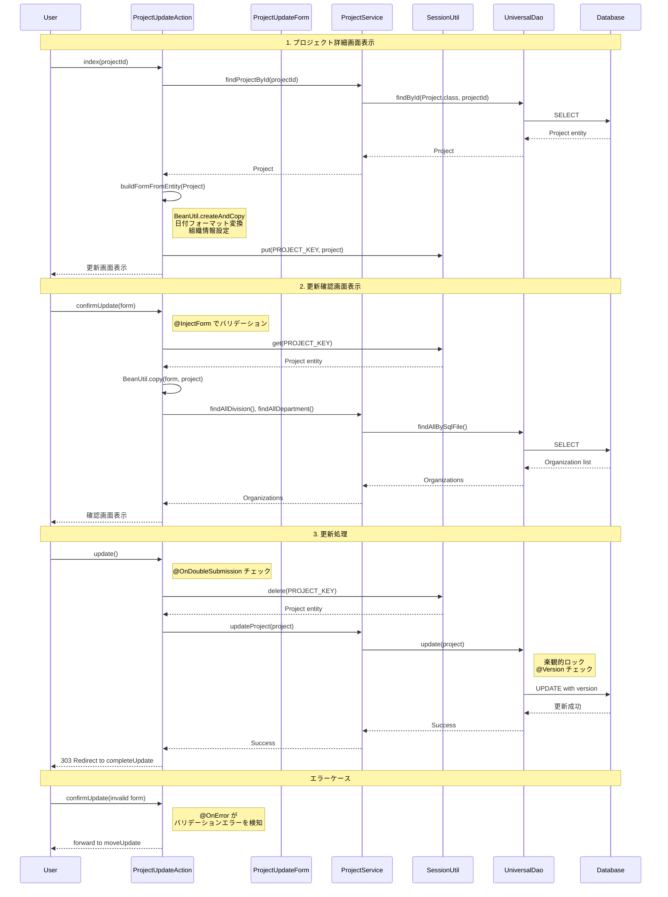

# Code Analysis: ProjectUpdateAction

**Generated**: 2026-03-02 19:17:09
**Target**: プロジェクト情報の更新処理を行うWebアクション
**Modules**: proman-web, proman-common
**Analysis Duration**: 不明

---

## Overview

ProjectUpdateActionは、プロジェクト情報の更新処理を行うWebアクションクラスです。以下の主要な機能を提供します。

- プロジェクト詳細画面の表示 (`index`)
- 更新内容の確認画面表示 (`confirmUpdate`)
- プロジェクト情報の更新処理 (`update`)
- 更新完了画面の表示 (`completeUpdate`)

フォームバリデーション、セッション管理、二重サブミット防止などのWeb application patterns実装しています。UniversalDaoを使用したデータベースアクセス、BeanUtilによるオブジェクト変換、SessionUtilによるセッション管理を組み合わせた典型的なCRUD更新フローを実現しています。

---

## Architecture

### Dependency Graph

```mermaid
classDiagram
    class ProjectUpdateAction {
        +index()
        +confirmUpdate()
        +update()
        +completeUpdate()
        +backToEnterUpdate()
        +indexSetPullDown()
    }
    class ProjectService {
        <<Service>>
        +findProjectById()
        +updateProject()
        +findOrganizationById()
        +findAllDivision()
        +findAllDepartment()
    }
    class ProjectUpdateForm {
        <<Form>>
    }
    class Project {
        <<Entity>>
    }
    class Organization {
        <<Entity>>
    }
    class UniversalDao {
        <<Nablarch>>
    }
    class BeanUtil {
        <<Nablarch>>
    }
    class SessionUtil {
        <<Nablarch>>
    }
    class ExecutionContext {
        <<Nablarch>>
    }
    class HttpRequest {
        <<Nablarch>>
    }
    class HttpResponse {
        <<Nablarch>>
    }

    ProjectUpdateAction ..> ProjectService : uses
    ProjectUpdateAction ..> ProjectUpdateForm : validates
    ProjectUpdateAction ..> Project : retrieves
    ProjectUpdateAction ..> BeanUtil : converts with
    ProjectUpdateAction ..> SessionUtil : stores in
    ProjectUpdateAction ..> ExecutionContext : accesses
    ProjectUpdateAction ..> HttpRequest : receives
    ProjectUpdateAction ..> HttpResponse : returns
    ProjectService ..> UniversalDao : queries with
    ProjectService ..> Project : persists
    ProjectService ..> Organization : queries
    ProjectUpdateForm ..|> Serializable : implements
```



**Note**: This diagram uses Mermaid `classDiagram` syntax to show class names and their relationships. Use `--|>` for inheritance (extends/implements) and `..>` for dependencies (uses/creates).

### Component Summary

| Component | Role | Type | Dependencies |
|-----------|------|------|--------------|
| ProjectUpdateAction | 更新画面の制御とビジネスロジックの呼び出し | Action | ProjectService, ProjectUpdateForm, BeanUtil, SessionUtil |
| ProjectService | データベースアクセスのファサード | Service | UniversalDao, Project, Organization |
| ProjectUpdateForm | フォーム入力値の保持とバリデーション | Form | Bean Validation annotations |
| Project | プロジェクトエンティティ | Entity | Database table mapping |
| Organization | 組織エンティティ | Entity | Database table mapping |

---

## Flow

### Processing Flow

ProjectUpdateActionの更新フローは以下のステップで構成されます。

1. **詳細画面表示** (`index`): プロジェクトIDからエンティティを取得し、フォームに変換してセッションに保存
2. **確認画面表示** (`confirmUpdate`): フォーム入力値をバリデーション後、セッション内のエンティティに反映
3. **更新処理** (`update`): セッションからエンティティを取得し、UniversalDaoで更新
4. **完了画面表示** (`completeUpdate`): 更新完了メッセージを表示

エラーハンドリングは`@OnError`インターセプタで処理され、バリデーションエラー時は入力画面に戻ります。二重サブミット防止は`@OnDoubleSubmission`インターセプタで実現されています。

### Sequence Diagram



---

## Components

### ProjectUpdateAction

**Role**: プロジェクト更新機能のコントローラ

**Key Methods**:
- `index(HttpRequest, ExecutionContext)` [:35-43](../../.lw/nab-official/v6/nablarch-system-development-guide/Sample_Project/Source_Code/proman-project/proman-web/src/main/java/com/nablarch/example/proman/web/project/ProjectUpdateAction.java#L35-L43) - プロジェクト詳細画面から更新画面を表示
- `confirmUpdate(HttpRequest, ExecutionContext)` [:54-62](../../.lw/nab-official/v6/nablarch-system-development-guide/Sample_Project/Source_Code/proman-project/proman-web/src/main/java/com/nablarch/example/proman/web/project/ProjectUpdateAction.java#L54-L62) - 更新内容確認画面を表示
- `update(HttpRequest, ExecutionContext)` [:72-77](../../.lw/nab-official/v6/nablarch-system-development-guide/Sample_Project/Source_Code/proman-project/proman-web/src/main/java/com/nablarch/example/proman/web/project/ProjectUpdateAction.java#L72-L77) - プロジェクト情報を更新
- `buildFormFromEntity(Project, ProjectService)` [:111-125](../../.lw/nab-official/v6/nablarch-system-development-guide/Sample_Project/Source_Code/proman-project/proman-web/src/main/java/com/nablarch/example/proman/web/project/ProjectUpdateAction.java#L111-L125) - エンティティからフォームを構築

**Dependencies**: ProjectService, ProjectUpdateForm, BeanUtil, SessionUtil, DateUtil

**File**: [ProjectUpdateAction.java](../../.lw/nab-official/v6/nablarch-system-development-guide/Sample_Project/Source_Code/proman-project/proman-web/src/main/java/com/nablarch/example/proman/web/project/ProjectUpdateAction.java)

### ProjectService

**Role**: データベースアクセスのファサード。UniversalDaoを使用したCRUD操作を提供

**Key Methods**:
- `findProjectById(Integer)` [:124-126](../../.lw/nab-official/v6/nablarch-system-development-guide/Sample_Project/Source_Code/proman-project/proman-web/src/main/java/com/nablarch/example/proman/web/project/ProjectService.java#L124-L126) - プロジェクトIDで検索
- `updateProject(Project)` [:89-91](../../.lw/nab-official/v6/nablarch-system-development-guide/Sample_Project/Source_Code/proman-project/proman-web/src/main/java/com/nablarch/example/proman/web/project/ProjectService.java#L89-L91) - プロジェクト情報を更新
- `findOrganizationById(Integer)` [:70-73](../../.lw/nab-official/v6/nablarch-system-development-guide/Sample_Project/Source_Code/proman-project/proman-web/src/main/java/com/nablarch/example/proman/web/project/ProjectService.java#L70-L73) - 組織IDで検索
- `findAllDivision()` [:50-52](../../.lw/nab-official/v6/nablarch-system-development-guide/Sample_Project/Source_Code/proman-project/proman-web/src/main/java/com/nablarch/example/proman/web/project/ProjectService.java#L50-L52) - 全事業部を取得
- `findAllDepartment()` [:59-61](../../.lw/nab-official/v6/nablarch-system-development-guide/Sample_Project/Source_Code/proman-project/proman-web/src/main/java/com/nablarch/example/proman/web/project/ProjectService.java#L59-L61) - 全部門を取得

**Dependencies**: DaoContext (UniversalDao), Project, Organization

**File**: [ProjectService.java](../../.lw/nab-official/v6/nablarch-system-development-guide/Sample_Project/Source_Code/proman-project/proman-web/src/main/java/com/nablarch/example/proman/web/project/ProjectService.java)

### ProjectUpdateForm

**Role**: 更新画面のフォームオブジェクト。Bean Validationアノテーションによる入力チェック

**Key Fields**:
- `projectName`, `projectType`, `projectClass` - プロジェクト基本情報 (`@Required`, `@Domain`)
- `projectStartDate`, `projectEndDate` - プロジェクト期間 (`@Required`, `@Domain("date")`)
- `divisionId`, `organizationId` - 組織情報 (`@Required`, `@Domain("organizationId")`)
- `pmKanjiName`, `plKanjiName` - 責任者情報 (`@Required`, `@Domain("userName")`)

**Validation**:
- `isValidProjectPeriod()` [:329-331](../../.lw/nab-official/v6/nablarch-system-development-guide/Sample_Project/Source_Code/proman-project/proman-web/src/main/java/com/nablarch/example/proman/web/project/ProjectUpdateForm.java#L329-L331) - プロジェクト期間の整合性チェック (`@AssertTrue`)

**File**: [ProjectUpdateForm.java](../../.lw/nab-official/v6/nablarch-system-development-guide/Sample_Project/Source_Code/proman-project/proman-web/src/main/java/com/nablarch/example/proman/web/project/ProjectUpdateForm.java)

---

## Nablarch Framework Usage

### UniversalDao

**Description**: O/Rマッパー機能を提供するDAO。Jakarta Persistence (JPA) APIに準拠

**Usage in this code**:
```java
// ProjectServiceでの使用例
universalDao.findById(Project.class, projectId);  // 主キー検索
universalDao.update(project);                      // 更新
universalDao.findAllBySqlFile(Organization.class, "FIND_ALL_DIVISION");  // SQLファイルによる検索
```

**Important Points**:
- ✅ **主キー検索**: `findById`メソッドでエンティティを取得。主キーが複合キーの場合は配列で指定
- ✅ **更新処理**: `update`メソッドでエンティティを更新。楽観的ロックが有効な場合は`@Version`カラムで排他制御
- ✅ **SQLファイル検索**: `findAllBySqlFile`メソッドで任意のSQLを実行。SQL IDで外部SQLファイルを参照
- ⚠️ **トランザクション**: UniversalDaoの操作は外部トランザクション管理ハンドラのトランザクション内で実行される
- 💡 **楽観的ロック**: `@Version`アノテーションを付けたカラムで自動的に楽観的ロックを実現。更新時にバージョン番号をチェック

**Knowledge Base**: [universal-dao.json](../../knowledge/features/libraries/universal-dao.json)

### BeanUtil

**Description**: JavaBeansのプロパティコピーと型変換を提供するユーティリティ

**Usage in this code**:
```java
// ProjectUpdateActionでの使用例
ProjectUpdateForm projectUpdateForm = BeanUtil.createAndCopy(ProjectUpdateForm.class, project);  // エンティティからフォームを作成
BeanUtil.copy(form, project);  // フォームからエンティティにコピー
```

**Important Points**:
- ✅ **プロパティコピー**: 同名プロパティを自動的にコピー。型変換も自動実行
- ✅ **新規インスタンス作成**: `createAndCopy`でターゲットクラスのインスタンスを作成しながらコピー
- ⚠️ **型変換ルール**: 文字列から数値、日付などの基本的な型変換をサポート。カスタム変換が必要な場合は手動で実装
- 💡 **利便性**: エンティティとフォーム間の変換を簡潔に記述でき、コード量を削減

### SessionUtil

**Description**: HTTPセッションへのアクセスを簡略化するユーティリティ

**Usage in this code**:
```java
// ProjectUpdateActionでの使用例
SessionUtil.put(context, PROJECT_KEY, project);  // セッションに保存
Project project = SessionUtil.get(context, PROJECT_KEY);  // セッションから取得
Project project = SessionUtil.delete(context, PROJECT_KEY);  // セッションから削除
```

**Important Points**:
- ✅ **型安全なアクセス**: ジェネリクスによる型安全なセッションアクセス
- ✅ **簡潔な記述**: ExecutionContextを経由したセッションアクセスを簡潔に記述
- ⚠️ **セッション容量**: セッションに大きなオブジェクトを保存すると、メモリ使用量が増加。必要最小限のデータのみ保存
- 🎯 **確認画面パターン**: 入力→確認→完了の画面遷移でセッションを使用し、確認画面での再検索を回避
- ⚡ **削除タイミング**: 更新完了後は`delete`でセッションから削除し、メモリを解放

### @InjectForm

**Description**: リクエストパラメータをフォームオブジェクトにバインドし、バリデーションを実行するインターセプタ

**Usage in this code**:
```java
@InjectForm(form = ProjectUpdateInitialForm.class)
public HttpResponse index(HttpRequest request, ExecutionContext context) {
    ProjectUpdateInitialForm form = context.getRequestScopedVar("form");
    // ...
}

@InjectForm(form = ProjectUpdateForm.class, prefix = "form")
@OnError(type = ApplicationException.class, path = "forward:///app/project/moveUpdate")
public HttpResponse confirmUpdate(HttpRequest request, ExecutionContext context) {
    ProjectUpdateForm form = context.getRequestScopedVar("form");
    // ...
}
```

**Important Points**:
- ✅ **自動バインド**: リクエストパラメータをフォームオブジェクトに自動バインド
- ✅ **バリデーション実行**: Bean Validationアノテーションによる入力チェックを自動実行
- ⚠️ **prefix指定**: HTML formのname属性にprefixを付けた場合は、`prefix`パラメータで指定
- 💡 **リクエストスコープ**: バインド後のフォームはリクエストスコープに格納され、`context.getRequestScopedVar("form")`で取得

### @OnError

**Description**: バリデーションエラー発生時の遷移先を指定するインターセプタ

**Usage in this code**:
```java
@OnError(type = ApplicationException.class, path = "forward:///app/project/moveUpdate")
public HttpResponse confirmUpdate(HttpRequest request, ExecutionContext context) {
    // バリデーションエラー時は moveUpdate にフォワード
}
```

**Important Points**:
- ✅ **エラーハンドリング**: バリデーションエラー時の画面遷移を宣言的に定義
- ✅ **例外タイプ指定**: 処理する例外タイプを`type`パラメータで指定 (通常は`ApplicationException`)
- 🎯 **入力画面への戻り**: 入力エラー時は元の入力画面にフォワードし、エラーメッセージを表示

### @OnDoubleSubmission

**Description**: 二重サブミットを防止するインターセプタ

**Usage in this code**:
```java
@OnDoubleSubmission
public HttpResponse update(HttpRequest request, ExecutionContext context) {
    // 二重サブミット時はエラー画面へ遷移
}
```

**Important Points**:
- ✅ **二重サブミット防止**: トークンチェックにより、同一リクエストの重複実行を防止
- ⚠️ **トークン生成**: 画面表示時に`@UseToken`インターセプタでトークンを生成する必要がある
- 💡 **更新処理の保護**: データベース更新を伴うメソッドに付与し、重複更新を防止

---

## References

### Source Files

- [ProjectUpdateAction.java](../../.lw/nab-official/v6/nablarch-system-development-guide/Sample_Project/Source_Code/proman-project/proman-web/src/main/java/com/nablarch/example/proman/web/project/ProjectUpdateAction.java) - ProjectUpdateAction
- [ProjectService.java](../../.lw/nab-official/v6/nablarch-system-development-guide/Sample_Project/Source_Code/proman-project/proman-web/src/main/java/com/nablarch/example/proman/web/project/ProjectService.java) - ProjectService
- [ProjectUpdateForm.java](../../.lw/nab-official/v6/nablarch-system-development-guide/Sample_Project/Source_Code/proman-project/proman-web/src/main/java/com/nablarch/example/proman/web/project/ProjectUpdateForm.java) - ProjectUpdateForm

### Knowledge Base (Nabledge-6)

- [Universal Dao.json](../../knowledge/features/libraries/universal-dao.json)
- [Data Bind.json](../../knowledge/features/libraries/data-bind.json)

### Official Documentation

- [Universal Dao](https://nablarch.github.io/docs/LATEST/doc/application_framework/application_framework/libraries/database/universal_dao.html)

---

**Note**: This documentation was generated by the code-analysis workflow of the nabledge-6 skill.
