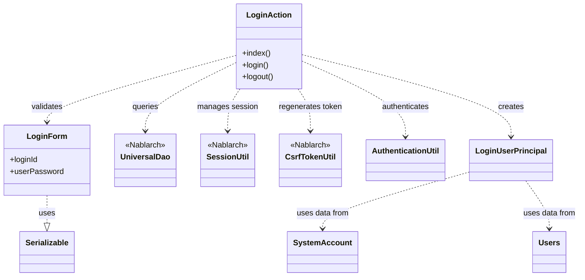
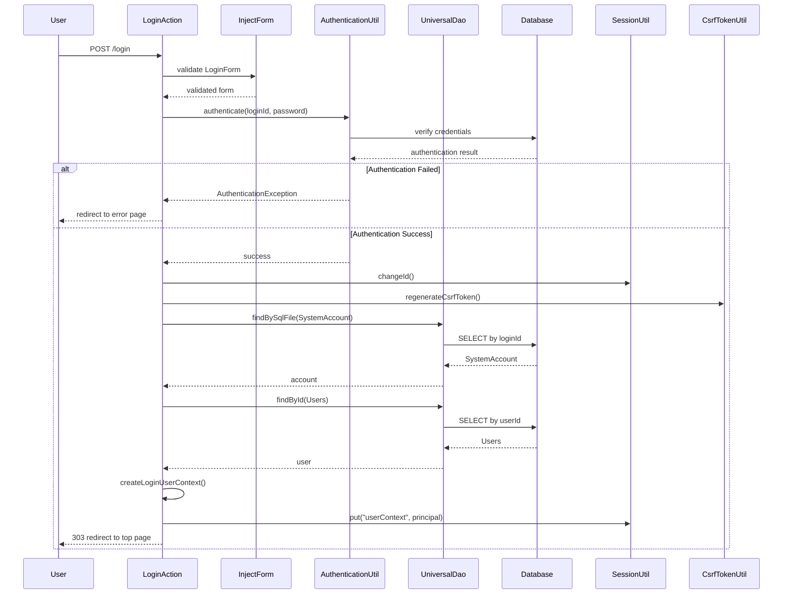

# Code Analysis: LoginAction

**Generated**: 2026-03-02 19:16:09
**Target**: ログイン認証処理を実行するWebアクションクラス
**Modules**: proman-web
**Analysis Duration**: 約2分5秒

---

## Overview

LoginActionは、プロマンシステムのログイン/ログアウト機能を提供するWebアクションクラスです。ユーザー認証、セッション管理、CSRF対策を統合し、セキュアなログイン処理を実現します。

**主な機能**:
- ログイン画面表示 (`index()`)
- 認証処理とセッション確立 (`login()`)
- ログアウト処理とセッション無効化 (`logout()`)

**技術的特徴**:
- フォーム自動注入 (`@InjectForm`)
- エラーハンドリング (`@OnError`)
- UniversalDaoによるデータベースアクセス
- セッション固定攻撃対策 (SessionUtil.changeId())
- CSRFトークン再生成 (CsrfTokenUtil.regenerateCsrfToken())

---

## Architecture

### Dependency Graph



**Note**: This diagram uses Mermaid `classDiagram` syntax to show class names and their relationships. Use `--|>` for inheritance (extends/implements) and `..>` for dependencies (uses/creates).

### Component Summary

| Component | Role | Type | Dependencies |
|-----------|------|------|--------------|
| LoginAction | ログイン/ログアウト処理 | Action | LoginForm, UniversalDao, SessionUtil, CsrfTokenUtil, AuthenticationUtil |
| LoginForm | ログイン入力検証 | Form | @Required, @Domain |
| LoginUserPrincipal | ログインユーザー情報保持 | Context | なし |
| SystemAccount | システムアカウントエンティティ | Entity | なし |
| Users | ユーザー情報エンティティ | Entity | なし |
| AuthenticationUtil | 認証ロジック | Utility | なし |

---

## Flow

### Processing Flow

**1. ログイン画面表示 (index)**
- HTTPリクエスト受信
- ログイン画面JSPにフォワード

**2. ログイン処理 (login)**
- フォーム自動注入 (`@InjectForm`)
- Bean Validation実行 (loginId, userPassword必須チェック)
- 認証処理 (AuthenticationUtil.authenticate())
  - パスワード照合
  - 認証失敗時: ApplicationException (errors.login)
- セッション固定攻撃対策
  - SessionUtil.changeId() - セッションID変更
  - CsrfTokenUtil.regenerateCsrfToken() - CSRFトークン再生成
- ログインユーザー情報取得 (createLoginUserContext())
  - SystemAccount検索 (findBySqlFile)
  - Users検索 (findById)
  - LoginUserPrincipal生成
- セッションに認証情報格納 (SessionUtil.put())
- トップ画面にリダイレクト (303 See Other)

**3. ログアウト処理 (logout)**
- セッション無効化 (SessionUtil.invalidate())
- ログイン画面にリダイレクト

### Sequence Diagram



---

## Components

### 1. LoginAction

**File**: [LoginAction.java:1-108](../../../../../../../../.lw/nab-official/v6/nablarch-system-development-guide/Sample_Project/Source_Code/proman-project/proman-web/src/main/java/com/nablarch/example/proman/web/login/LoginAction.java)

**Role**: ログイン/ログアウト処理を実行するWebアクションクラス

**Key Methods**:
- `index()` [:38-40] - ログイン画面を表示
- `login()` [:49-71] - ログイン認証処理を実行
- `createLoginUserContext()` [:79-93] - ログインユーザー情報を取得してLoginUserPrincipalを生成
- `logout()` [:102-106] - ログアウト処理を実行

**Dependencies**:
- LoginForm - ログイン入力フォーム
- UniversalDao - データベースアクセス
- SessionUtil - セッション管理
- CsrfTokenUtil - CSRFトークン管理
- AuthenticationUtil - 認証処理
- LoginUserPrincipal - ログインユーザー情報

**Implementation Points**:
- `@InjectForm`: フォームデータを自動でバインドし、Bean Validationを実行
- `@OnError`: ApplicationException発生時にログイン画面に遷移
- セッション固定攻撃対策: ログイン成功時にセッションIDを変更
- CSRFトークン再生成: セッションID変更後にCSRFトークンも再生成
- リダイレクトステータス: 303 (See Other) を使用してPRG (Post-Redirect-Get) パターンを実装

### 2. LoginForm

**File**: [LoginForm.java:1-63](../../../../../../../../.lw/nab-official/v6/nablarch-system-development-guide/Sample_Project/Source_Code/proman-project/proman-web/src/main/java/com/nablarch/example/proman/web/login/LoginForm.java)

**Role**: ログイン入力値の検証を行うフォームクラス

**Annotations**:
- `@Required` [:21, 26] - 必須入力チェック
- `@Domain` [:22, 27] - ドメイン検証 (loginId, userPassword)

**Properties**:
- `loginId` [:23] - ログインID
- `userPassword` [:28] - パスワード

**Implementation Points**:
- Bean Validation: `@Required`と`@Domain`でサーバーサイド検証を実施
- Serializable実装: セッション保存に対応

### 3. LoginUserPrincipal

**File**: [LoginUserPrincipal.java:1-103](../../../../../../../../.lw/nab-official/v6/nablarch-system-development-guide/Sample_Project/Source_Code/proman-project/proman-web/src/main/java/com/nablarch/example/proman/web/common/authentication/context/LoginUserPrincipal.java)

**Role**: セッションに格納するログインユーザー情報

**Properties**:
- `userId` [:19] - ユーザーID
- `kanjiName` [:22] - 漢字氏名
- `pmFlag` [:25] - PM職フラグ
- `lastLoginDateTime` [:28] - 最終ログイン日時

**Implementation Points**:
- セッション保存用にSerializable実装
- SystemAccountとUsersの情報を統合して保持

---

## Nablarch Framework Usage

### UniversalDao

**クラス**: `nablarch.common.dao.UniversalDao`

**説明**: Jakarta Persistenceアノテーションを使った簡易的なO/Rマッパー。SQLを書かずに単純なCRUDを実行し、検索結果をBeanにマッピングできる

**使用方法**:
```java
// SQLファイルで検索 (1件)
SystemAccount account = UniversalDao.findBySqlFile(
    SystemAccount.class,
    "FIND_SYSTEM_ACCOUNT_BY_AK",
    new Object[]{loginId}
);

// 主キーで検索 (1件)
Users users = UniversalDao.findById(Users.class, account.getUserId());
```

**重要ポイント**:
- ✅ **SQLファイルで柔軟な検索**: 主キー以外の条件で検索する場合はfindBySqlFileを使用
- ✅ **主キー検索は簡潔**: findById()で主キー指定の検索が1行で記述可能
- 💡 **Bean自動マッピング**: 検索結果を自動的にEntityやDTOにマッピング
- ⚠️ **主キー以外の更新/削除は不可**: 主キー以外の条件で更新/削除する場合はDatabaseを直接使用
- 🎯 **いつ使うか**: 単純なCRUD操作、主キーまたはSQLファイルベースの検索

**このコードでの使い方**:
- `findBySqlFile()`: ログインIDでSystemAccountを検索 (Line 80-82)
- `findById()`: userIdでUsersを検索 (Line 83)
- SystemAccountとUsersの情報を取得してLoginUserPrincipalを構築

**詳細**: [Universal Dao](../../../../../../../../.claude/skills/nabledge-6/knowledge/features/libraries/universal-dao.json)

### SessionUtil

**クラス**: `nablarch.common.web.session.SessionUtil`

**説明**: HTTPセッションの操作を提供するユーティリティクラス

**使用方法**:
```java
// セッションIDを変更 (セッション固定攻撃対策)
SessionUtil.changeId(context);

// セッションに値を格納
SessionUtil.put(context, "userContext", userContext);

// セッションを無効化
SessionUtil.invalidate(context);
```

**重要ポイント**:
- ✅ **必ずchangeId()を呼ぶ**: ログイン成功時にセッションIDを変更してセッション固定攻撃を防ぐ
- ✅ **認証情報はセッションに格納**: ログイン後の認証状態を維持
- ✅ **ログアウト時はinvalidate()**: セッションを完全に破棄して情報漏洩を防ぐ
- 💡 **セキュリティのベストプラクティス**: changeId()とCSRFトークン再生成をセットで実行
- 🎯 **いつ使うか**: ログイン成功時、ログアウト時、認証状態の保存/取得

**このコードでの使い方**:
- `changeId()`: ログイン成功後にセッションIDを変更 (Line 65)
- `put()`: ログインユーザー情報をセッションに格納 (Line 69)
- `invalidate()`: ログアウト時にセッションを無効化 (Line 103)

**詳細**: Nablarch公式ドキュメント「セッションストア」参照

### CsrfTokenUtil

**クラス**: `nablarch.common.web.csrf.CsrfTokenUtil`

**説明**: CSRFトークンの生成・検証を提供するユーティリティクラス

**使用方法**:
```java
// CSRFトークンを再生成
CsrfTokenUtil.regenerateCsrfToken(context);
```

**重要ポイント**:
- ✅ **セッションID変更後に必ず再生成**: changeId()の後にregenerateCsrfToken()を呼び出す
- 💡 **CSRF攻撃防止**: クロスサイトリクエストフォージェリ攻撃を防ぐ
- 🎯 **いつ使うか**: ログイン成功時、セッションIDを変更した後

**このコードでの使い方**:
- `regenerateCsrfToken()`: ログイン成功後にCSRFトークンを再生成 (Line 66)
- セッションID変更とセットで実行してセキュリティを強化

**詳細**: Nablarch公式ドキュメント「CSRFトークン検証」参照

### @InjectForm

**アノテーション**: `nablarch.common.web.interceptor.InjectForm`

**説明**: リクエストパラメータを自動的にフォームオブジェクトにバインドし、Bean Validationを実行するインターセプタ

**使用方法**:
```java
@InjectForm(form = LoginForm.class)
public HttpResponse login(HttpRequest request, ExecutionContext context) {
    LoginForm form = context.getRequestScopedVar("form");
    // formは既にバリデーション済み
}
```

**重要ポイント**:
- ✅ **自動バインドとバリデーション**: リクエストパラメータをフォームにバインドし、Bean Validationを自動実行
- ✅ **リクエストスコープから取得**: バインド済みフォームは`context.getRequestScopedVar("form")`で取得
- 💡 **コード簡潔化**: 手動バインドとバリデーション呼び出しが不要
- 🎯 **いつ使うか**: フォーム送信を受け付けるActionメソッド

**このコードでの使い方**:
- `@InjectForm(form = LoginForm.class)`: login()メソッドに設定 (Line 50)
- LoginFormのバリデーション (@Required, @Domain) を自動実行
- バリデーション済みフォームをcontext.getRequestScopedVar("form")で取得 (Line 53)

**詳細**: Nablarch公式ドキュメント「InjectFormインターセプタ」参照

### @OnError

**アノテーション**: `nablarch.fw.web.interceptor.OnError`

**説明**: 指定した例外発生時に特定のパスに遷移させるインターセプタ

**使用方法**:
```java
@OnError(type = ApplicationException.class, path = "/WEB-INF/view/login/login.jsp")
public HttpResponse login(HttpRequest request, ExecutionContext context) {
    // ApplicationException発生時は自動的にlogin.jspに遷移
}
```

**重要ポイント**:
- ✅ **例外ハンドリングを宣言的に**: コード内でtry-catchを書かずに例外処理を定義
- 💡 **バリデーションエラーにも対応**: ApplicationExceptionはバリデーションエラーや業務エラーで使用
- 🎯 **いつ使うか**: フォームバリデーションエラー時、業務エラー発生時に元の画面に戻る場合

**このコードでの使い方**:
- `@OnError(type = ApplicationException.class, path = "/WEB-INF/view/login/login.jsp")`: login()メソッドに設定 (Line 49)
- 認証失敗時のApplicationExceptionをキャッチしてログイン画面に遷移 (Line 59-60)
- エラーメッセージ (errors.login) を画面に表示

**詳細**: Nablarch公式ドキュメント「OnErrorインターセプタ」参照

---

## References

### Source Files

- [LoginAction.java](../../../../../../../../.lw/nab-official/v6/nablarch-system-development-guide/Sample_Project/Source_Code/proman-project/proman-web/src/main/java/com/nablarch/example/proman/web/login/LoginAction.java) - LoginAction
- [LoginForm.java](../../../../../../../../.lw/nab-official/v6/nablarch-system-development-guide/Sample_Project/Source_Code/proman-project/proman-web/src/main/java/com/nablarch/example/proman/web/login/LoginForm.java) - LoginForm

### Knowledge Base (Nabledge-6)

- [Universal Dao.json](../../../../../../../../.claude/skills/nabledge-6/knowledge/features/libraries/universal-dao.json)

### Official Documentation

- [Universal Dao](https://nablarch.github.io/docs/LATEST/doc/application_framework/application_framework/libraries/database/universal_dao.html)

---

**Note**: This documentation was generated by the code-analysis workflow of the nabledge-6 skill.
