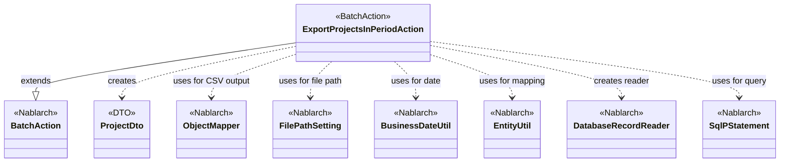
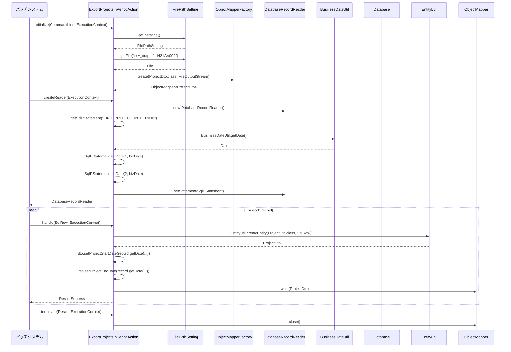

# Code Analysis: ExportProjectsInPeriodAction

**Generated**: 2026-03-05 19:38:39
**Target**: 期間内プロジェクト一覧をCSVファイルに出力する都度起動バッチアクション
**Modules**: proman-batch
**Analysis Duration**: 約3分54秒

---

## Overview

ExportProjectsInPeriodActionは、期間内のプロジェクト情報をデータベースから取得し、CSVファイルに出力する都度起動バッチアクションです。BatchAction<SqlRow>を継承し、Nablarchバッチフレームワークのライフサイクル(initialize, createReader, handle, terminate)に従って処理を実行します。

主な処理フロー:
1. **初期化 (initialize)**: FilePathSettingを使用して出力先CSVファイルを取得し、ObjectMapperを生成
2. **データ読み込み (createReader)**: DatabaseRecordReaderでデータベースから期間内プロジェクトを検索
3. **レコード処理 (handle)**: EntityUtilでSqlRowをProjectDtoに変換し、ObjectMapperでCSV出力
4. **終了処理 (terminate)**: ObjectMapperをクローズしてファイル出力を完了

業務日付(BusinessDateUtil)を基準に、プロジェクト開始日〜終了日が現在の業務日付を含むプロジェクトを抽出します。

---

## Architecture

### Dependency Graph



**Note**: This diagram uses Mermaid `classDiagram` syntax to show class names and their relationships. Use `--|>` for inheritance (extends/implements) and `..>` for dependencies (uses/creates).

### Component Summary

| Component | Role | Type | Dependencies |
|-----------|------|------|--------------|
| ExportProjectsInPeriodAction | バッチアクション本体 | Action | BatchAction, ProjectDto, ObjectMapper, FilePathSetting, BusinessDateUtil, EntityUtil, DatabaseRecordReader, SqlPStatement |
| ProjectDto | CSVレコード定義 | DTO | @Csv, @CsvFormat annotations |

---

## Flow

### Processing Flow

1. **バッチ起動**: コマンドライン引数で`-requestPath ExportProjectsInPeriodAction`を指定
2. **初期化 (initialize)**:
   - FilePathSetting.getInstance()で論理名"csv_output"からファイルパスを取得
   - ObjectMapperFactory.create()でProjectDto用のCSV出力マッパーを生成
3. **データ読み込み準備 (createReader)**:
   - DatabaseRecordReaderを生成
   - SQL ID "FIND_PROJECT_IN_PERIOD"でSqlPStatementを準備
   - BusinessDateUtil.getDate()で業務日付を取得し、SQLパラメータに設定
4. **レコード処理ループ (handle)**:
   - DataReaderから1レコードずつSqlRowを取得
   - EntityUtil.createEntity()でSqlRowをProjectDtoに変換
   - 日付型カラム(PROJECT_START_DATE, PROJECT_END_DATE)を明示的にsetterで設定
   - ObjectMapper.write()でProjectDtoをCSV行として出力
   - Result.Success()を返して次レコードへ
5. **終了処理 (terminate)**: ObjectMapper.close()でCSVファイルを確定

---

### Sequence Diagram



---

## Components

### 1. ExportProjectsInPeriodAction

**File**: [ExportProjectsInPeriodAction.java:1-81](../../.lw/nab-official/v6/nablarch-system-development-guide/Sample_Project/Source_Code/proman-project/proman-batch/src/main/java/com/nablarch/example/proman/batch/project/ExportProjectsInPeriodAction.java#L1-L81)

**Role**: 期間内プロジェクト一覧をCSVファイルに出力する都度起動バッチアクションクラス

**Key Methods**:
- `initialize(CommandLine, ExecutionContext)` [:44-54](../../.lw/nab-official/v6/nablarch-system-development-guide/Sample_Project/Source_Code/proman-project/proman-batch/src/main/java/com/nablarch/example/proman/batch/project/ExportProjectsInPeriodAction.java#L44-L54) - CSV出力マッパーの初期化
- `createReader(ExecutionContext)` [:57-65](../../.lw/nab-official/v6/nablarch-system-development-guide/Sample_Project/Source_Code/proman-project/proman-batch/src/main/java/com/nablarch/example/proman/batch/project/ExportProjectsInPeriodAction.java#L57-L65) - DatabaseRecordReaderの生成
- `handle(SqlRow, ExecutionContext)` [:68-75](../../.lw/nab-official/v6/nablarch-system-development-guide/Sample_Project/Source_Code/proman-project/proman-batch/src/main/java/com/nablarch/example/proman/batch/project/ExportProjectsInPeriodAction.java#L68-L75) - レコード単位のCSV出力処理
- `terminate(Result, ExecutionContext)` [:78-80](../../.lw/nab-official/v6/nablarch-system-development-guide/Sample_Project/Source_Code/proman-project/proman-batch/src/main/java/com/nablarch/example/proman/batch/project/ExportProjectsInPeriodAction.java#L78-L80) - ObjectMapperのクローズ

**Dependencies**: BatchAction, ObjectMapper, FilePathSetting, BusinessDateUtil, EntityUtil, DatabaseRecordReader, SqlPStatement

**Key Implementation Points**:
- BatchAction<SqlRow>を継承し、バッチフレームワークのライフサイクルメソッドを実装
- initializeでFilePathSettingから論理名"csv_output"を使用してファイルパスを取得
- ObjectMapperFactoryでProjectDto型のCSVマッパーを生成
- createReaderでDatabaseRecordReaderを使用し、SQL ID "FIND_PROJECT_IN_PERIOD"でデータを取得
- 業務日付(BusinessDateUtil)を2回バインド(開始日、終了日の範囲検索)
- handleでEntityUtil.createEntity()を使用してSqlRowをProjectDtoに変換
- 日付型カラムはEntityUtilで自動変換できないため、明示的にsetterで設定
- terminateでObjectMapper.close()を呼び出し、CSVファイル出力を確定

### 2. ProjectDto

**File**: [ProjectDto.java:1-269](../../.lw/nab-official/v6/nablarch-system-development-guide/Sample_Project/Source_Code/proman-project/proman-batch/src/main/java/com/nablarch/example/proman/batch/project/ProjectDto.java#L1-L269)

**Role**: CSV出力用のデータ転送オブジェクト(DTO)。プロジェクト情報の各フィールドを定義

**Key Annotations**:
- `@Csv` [:15-19](../../.lw/nab-official/v6/nablarch-system-development-guide/Sample_Project/Source_Code/proman-project/proman-batch/src/main/java/com/nablarch/example/proman/batch/project/ProjectDto.java#L15-L19) - CSV形式の定義(properties, headers)
- `@CsvFormat` [:20-21](../../.lw/nab-official/v6/nablarch-system-development-guide/Sample_Project/Source_Code/proman-project/proman-batch/src/main/java/com/nablarch/example/proman/batch/project/ProjectDto.java#L20-L21) - CSVフォーマット設定(区切り文字、引用符、文字コード等)

**Key Implementation Points**:
- @Csvアノテーションで出力プロパティとヘッダタイトルを定義
- @CsvFormatで詳細なフォーマット設定(fieldSeparator=',', charset="UTF-8", quoteMode=ALL等)
- setProjectStartDate/EndDateメソッドで日付型をString型に変換(DateUtil.formatDate使用)
- 全フィールドをStringで保持(CSV出力に最適化)

---

## Nablarch Framework Usage

### BatchAction<SqlRow>

**説明**: 都度起動バッチアクションの基底クラス。データ読み込み元からSqlRowを受け取り、レコード単位で処理を実行します。

**コード例**:
```java
public class ExportProjectsInPeriodAction extends BatchAction<SqlRow> {
    @Override
    protected void initialize(CommandLine command, ExecutionContext context) {
        // 初期化処理(ファイル出力準備など)
    }
    
    @Override
    public DataReader<SqlRow> createReader(ExecutionContext context) {
        // データ読み込み元の生成
        return new DatabaseRecordReader();
    }
    
    @Override
    public Result handle(SqlRow record, ExecutionContext context) {
        // レコード単位の処理
        return new Success();
    }
    
    @Override
    protected void terminate(Result result, ExecutionContext context) {
        // 終了処理(リソースクローズなど)
    }
}
```

**重要なポイント**:
- ✅ initialize, createReader, handle, terminateの4つのライフサイクルメソッドを実装
- ✅ initializeでファイル出力などの初期化処理を実行
- ✅ createReaderでデータ読み込み元(DatabaseRecordReaderなど)を返す
- ✅ handleでレコード単位の処理を実装し、Result.Success()を返す
- ✅ terminateでObjectMapperなどのリソースをクローズ
- ⚠️ handleメソッドは各レコードごとに呼ばれるため、重い処理は避ける
- 💡 initializeでの例外はバッチ全体を停止させる(エラーハンドリングに注意)

**このコードでの使用**:
- ExportProjectsInPeriodActionがBatchAction<SqlRow>を継承
- initializeでCSV出力準備(ObjectMapper生成)
- createReaderでDatabaseRecordReaderを返す
- handleでSqlRowをProjectDtoに変換してCSV出力
- terminateでObjectMapperをクローズ

**Knowledge Base**: [Nablarch Batch Architecture](../../.claude/skills/nabledge-6/docs/processing-pattern/nablarch-batch/nablarch-batch-architecture.md)

---

### ObjectMapper / ObjectMapperFactory

**説明**: データバインド機能の中核となるクラス。Java BeansとCSV/固定長ファイルの相互変換を提供します。

**コード例**:
```java
// CSV書き込み
FileOutputStream outputStream = new FileOutputStream(new File("output.csv"));
ObjectMapper<ProjectDto> mapper = ObjectMapperFactory.create(ProjectDto.class, outputStream);

// レコード単位で書き込み
mapper.write(projectDto);

// 終了時にクローズ
mapper.close();
```

**重要なポイント**:
- ✅ ObjectMapperFactory.create()でBean型とOutputStreamを指定して生成
- ✅ write()メソッドでBean単位で書き込み(ヘッダは初回のみ自動出力)
- ✅ close()メソッドで必ずクローズ(try-with-resourcesまたはterminateで実施)
- ⚠️ 大量データの場合、メモリ圧迫に注意(ストリーム書き込みのため問題なし)
- 💡 @Csvと@CsvFormatアノテーションでBean側にフォーマット設定を記述
- 🎯 バッチでのファイル出力に最適(レコード単位の逐次処理)

**このコードでの使用**:
- initializeでObjectMapperFactory.create(ProjectDto.class, outputStream)を実行
- handleでmapper.write(dto)を呼び出してCSV行を出力
- terminateでmapper.close()を実行

**Knowledge Base**: [Libraries Data_bind](../../.claude/skills/nabledge-6/docs/component/libraries/libraries-data_bind.md)

---

### FilePathSetting

**説明**: ファイルパスを論理名で管理する機能。環境ごとに異なるディレクトリを論理名で抽象化し、設定ファイルで管理します。

**コード例**:
```java
FilePathSetting setting = FilePathSetting.getInstance();
File outputFile = setting.getFile("csv_output", "N21AA002");
```

**重要なポイント**:
- ✅ getInstance()でシングルトンインスタンスを取得
- ✅ getFile(basePathName, fileName)で論理名を使用してFileオブジェクトを取得
- ✅ basePathNameはコンポーネント設定ファイルで定義(basePathSettings)
- ⚠️ 論理名が未定義の場合は実行時エラー(設定漏れに注意)
- 💡 環境ごとにディレクトリを変更する場合に有効(本番/検証/開発)
- 🎯 バッチ処理でのファイル入出力に必須

**このコードでの使用**:
- initialize内でFilePathSetting.getInstance()を呼び出し
- getFile("csv_output", "N21AA002")で出力ファイルのパスを取得
- FileOutputStreamの引数として使用

**Knowledge Base**: [Libraries File_path_management](../../.claude/skills/nabledge-6/docs/component/libraries/libraries-file_path_management.md)

---

### BusinessDateUtil

**説明**: 業務日付を取得・管理する機能。システム日時とは独立して、業務上の基準日付を管理します。

**コード例**:
```java
String businessDate = BusinessDateUtil.getDate();  // "20260305"形式
Date sqlDate = new Date(DateUtil.getDate(businessDate).getTime());
```

**重要なポイント**:
- ✅ getDate()で現在の業務日付を取得(String型 yyyyMMdd形式)
- ✅ セグメント指定可能(getDate(segment)でセグメント別の業務日付)
- ✅ データベースの業務日付テーブルから取得(コンポーネント設定で指定)
- ⚠️ 業務日付が未設定の場合は実行時エラー(初期化に注意)
- 💡 バッチ処理の基準日として使用(日次・月次バッチで必須)
- 🎯 「本日」の定義をシステム日時と分離できる

**このコードでの使用**:
- createReader内でBusinessDateUtil.getDate()を呼び出し
- DateUtil.getDate()でDate型に変換後、java.sql.Dateに変換
- SQLパラメータとしてsetDate(1, bizDate)、setDate(2, bizDate)で2回設定

**Knowledge Base**: [Libraries Date](../../.claude/skills/nabledge-6/docs/component/libraries/libraries-date.md)

---

### DatabaseRecordReader

**説明**: データベースからレコードを読み込むDataReaderの実装。SqlPStatementから取得した結果セットを1行ずつSqlRowとして返します。

**コード例**:
```java
DatabaseRecordReader reader = new DatabaseRecordReader();
SqlPStatement statement = getSqlPStatement("FIND_PROJECT_IN_PERIOD");
statement.setDate(1, bizDate);
statement.setDate(2, bizDate);
reader.setStatement(statement);
return reader;
```

**重要なポイント**:
- ✅ setStatement()でSqlPStatementを設定
- ✅ DataReader<SqlRow>として扱われ、フレームワークが自動的に読み込み
- ✅ 1レコードずつBatchAction.handle()に渡される
- ⚠️ 大量データの場合、JDBCフェッチサイズの調整が必要(デフォルトは適切)
- 💡 トランザクション境界はハンドラで制御(レコード単位またはバッチ単位)
- 🎯 データベースを入力元とするバッチ処理に最適

**このコードでの使用**:
- createReader内でnew DatabaseRecordReader()を生成
- getSqlPStatement("FIND_PROJECT_IN_PERIOD")でSQLを準備
- 業務日付をバインドしてsetStatement()で設定
- フレームワークがreaderからSqlRowを取得してhandle()に渡す

**Knowledge Base**: [Nablarch Batch Architecture](../../.claude/skills/nabledge-6/docs/processing-pattern/nablarch-batch/nablarch-batch-architecture.md)

---

### EntityUtil

**説明**: SqlRowやMapをEntity(Java Beans)に変換するユーティリティ。UniversalDaoと組み合わせて使用します。

**コード例**:
```java
ProjectDto dto = EntityUtil.createEntity(ProjectDto.class, sqlRow);
// 型が異なるカラムは明示的にsetter呼び出し
dto.setProjectStartDate(sqlRow.getDate("PROJECT_START_DATE"));
```

**重要なポイント**:
- ✅ createEntity(Class<T>, SqlRow)でSqlRowをBeanに自動変換
- ✅ カラム名とプロパティ名が一致していれば自動マッピング
- ⚠️ 型が異なる場合は自動変換できない(明示的にsetter呼び出し)
- 💡 UniversalDaoの検索結果をEntityに変換する用途が主
- 🎯 Beanマッピングを簡潔に記述できる

**このコードでの使用**:
- handle内でEntityUtil.createEntity(ProjectDto.class, record)を実行
- 日付型カラム(PROJECT_START_DATE, PROJECT_END_DATE)は自動変換されないため、明示的にsetterで設定
- 変換後のProjectDtoをObjectMapper.write()に渡す

**Knowledge Base**: [Libraries Universal_dao](../../.claude/skills/nabledge-6/docs/component/libraries/libraries-universal_dao.md)

---

## References

### Source Files

- [ExportProjectsInPeriodAction.java (.lw/nab-official/v6/nablarch-system-development-guide/en/Sample_Project/Source_Code/proman-project/proman-batch/src/main/java/com/nablarch/example/proman/batch/project)](../../.lw/nab-official/v6/nablarch-system-development-guide/en/Sample_Project/Source_Code/proman-project/proman-batch/src/main/java/com/nablarch/example/proman/batch/project/ExportProjectsInPeriodAction.java) - ExportProjectsInPeriodAction
- [ExportProjectsInPeriodAction.java (.lw/nab-official/v6/nablarch-system-development-guide/Sample_Project/Source_Code/proman-project/proman-batch/src/main/java/com/nablarch/example/proman/batch/project)](../../.lw/nab-official/v6/nablarch-system-development-guide/Sample_Project/Source_Code/proman-project/proman-batch/src/main/java/com/nablarch/example/proman/batch/project/ExportProjectsInPeriodAction.java) - ExportProjectsInPeriodAction
- [ProjectDto.java (.lw/nab-official/v6/nablarch-system-development-guide/en/Sample_Project/Source_Code/proman-project/proman-batch/src/main/java/com/nablarch/example/proman/batch/project)](../../.lw/nab-official/v6/nablarch-system-development-guide/en/Sample_Project/Source_Code/proman-project/proman-batch/src/main/java/com/nablarch/example/proman/batch/project/ProjectDto.java) - ProjectDto
- [ProjectDto.java (.lw/nab-official/v6/nablarch-system-development-guide/Sample_Project/Source_Code/proman-project/proman-batch/src/main/java/com/nablarch/example/proman/batch/project)](../../.lw/nab-official/v6/nablarch-system-development-guide/Sample_Project/Source_Code/proman-project/proman-batch/src/main/java/com/nablarch/example/proman/batch/project/ProjectDto.java) - ProjectDto

### Knowledge Base (Nabledge-6)

- [Libraries Data_bind](../../.claude/skills/nabledge-6/docs/component/libraries/libraries-data_bind.md)
- [Handlers Data_read_handler](../../.claude/skills/nabledge-6/docs/component/handlers/handlers-data_read_handler.md)
- [Libraries Universal_dao](../../.claude/skills/nabledge-6/docs/component/libraries/libraries-universal_dao.md)
- [Libraries File_path_management](../../.claude/skills/nabledge-6/docs/component/libraries/libraries-file_path_management.md)
- [Libraries Date](../../.claude/skills/nabledge-6/docs/component/libraries/libraries-date.md)
- [Libraries Database](../../.claude/skills/nabledge-6/docs/component/libraries/libraries-database.md)
- [Nablarch Batch Architecture](../../.claude/skills/nabledge-6/docs/processing-pattern/nablarch-batch/nablarch-batch-architecture.md)
- [Nablarch Batch Application_design](../../.claude/skills/nabledge-6/docs/processing-pattern/nablarch-batch/nablarch-batch-application_design.md)

### Official Documentation


- [AppDbConnection](https://nablarch.github.io/docs/LATEST/javadoc/nablarch/core/db/connection/AppDbConnection.html)
- [Application Design](https://nablarch.github.io/docs/LATEST/doc/application_framework/application_framework/batch/nablarch_batch/application_design.html)
- [Architecture](https://nablarch.github.io/docs/LATEST/doc/application_framework/application_framework/batch/nablarch_batch/architecture.html)
- [AsyncMessageSendAction](https://nablarch.github.io/docs/LATEST/javadoc/nablarch/fw/messaging/action/AsyncMessageSendAction.html)
- [AutoPropertyHandler](https://nablarch.github.io/docs/LATEST/javadoc/nablarch/core/db/statement/AutoPropertyHandler.html)
- [BasicBusinessDateProvider](https://nablarch.github.io/docs/LATEST/javadoc/nablarch/core/date/BasicBusinessDateProvider.html)
- [BasicDaoContextFactory](https://nablarch.github.io/docs/LATEST/javadoc/nablarch/common/dao/BasicDaoContextFactory.html)
- [BasicDbConnectionFactoryForDataSource](https://nablarch.github.io/docs/LATEST/javadoc/nablarch/core/db/connection/BasicDbConnectionFactoryForDataSource.html)
- [BasicDbConnectionFactoryForJndi](https://nablarch.github.io/docs/LATEST/javadoc/nablarch/core/db/connection/BasicDbConnectionFactoryForJndi.html)
- [BasicExpirationSetting](https://nablarch.github.io/docs/LATEST/javadoc/nablarch/core/cache/expirable/BasicExpirationSetting.html)
- [BasicSqlLoader](https://nablarch.github.io/docs/LATEST/javadoc/nablarch/core/db/statement/BasicSqlLoader.html)
- [BasicStatementFactory](https://nablarch.github.io/docs/LATEST/javadoc/nablarch/core/db/statement/BasicStatementFactory.html)
- [BasicSystemTimeProvider](https://nablarch.github.io/docs/LATEST/javadoc/nablarch/core/date/BasicSystemTimeProvider.html)
- [BatchAction](https://nablarch.github.io/docs/LATEST/javadoc/nablarch/fw/action/BatchAction.html)
- [BeanUtil](https://nablarch.github.io/docs/LATEST/javadoc/nablarch/core/beans/BeanUtil.html)
- [Blob](https://nablarch.github.io/docs/LATEST/javadoc/java/sql/Blob.html)
- [BusinessDateProvider](https://nablarch.github.io/docs/LATEST/javadoc/nablarch/core/date/BusinessDateProvider.html)
- [BusinessDateUtil](https://nablarch.github.io/docs/LATEST/javadoc/nablarch/core/date/BusinessDateUtil.html)
- [CacheableStatementFactory](https://nablarch.github.io/docs/LATEST/javadoc/nablarch/core/db/cache/statement/CacheableStatementFactory.html)
- [Clob](https://nablarch.github.io/docs/LATEST/javadoc/java/sql/Clob.html)
- [Collection](https://nablarch.github.io/docs/LATEST/javadoc/java/util/Collection.html)
- [ConnectionFactorySupport](https://nablarch.github.io/docs/LATEST/javadoc/nablarch/core/db/connection/ConnectionFactorySupport.html)
- [ConnectionFactory](https://nablarch.github.io/docs/LATEST/javadoc/nablarch/core/db/connection/ConnectionFactory.html)
- [Connection](https://nablarch.github.io/docs/LATEST/javadoc/java/sql/Connection.html)
- [CsvDataBindConfig](https://nablarch.github.io/docs/LATEST/javadoc/nablarch/common/databind/csv/CsvDataBindConfig.html)
- [CsvFormat](https://nablarch.github.io/docs/LATEST/javadoc/nablarch/common/databind/csv/CsvFormat.html)
- [Csv](https://nablarch.github.io/docs/LATEST/javadoc/nablarch/common/databind/csv/Csv.html)
- [Data Bind](https://nablarch.github.io/docs/LATEST/doc/application_framework/application_framework/libraries/data_io/data_bind.html)
- [Data Read Handler](https://nablarch.github.io/docs/LATEST/doc/application_framework/application_framework/handlers/standalone/data_read_handler.html)
- [DataBindConfig](https://nablarch.github.io/docs/LATEST/javadoc/nablarch/common/databind/DataBindConfig.html)
- [DataReadHandler](https://nablarch.github.io/docs/LATEST/javadoc/nablarch/fw/handler/DataReadHandler.html)
- [DataReader.NoMoreRecord](https://nablarch.github.io/docs/LATEST/javadoc/nablarch/fw/DataReader.NoMoreRecord.html)
- [DataReader](https://nablarch.github.io/docs/LATEST/javadoc/nablarch/fw/DataReader.html)
- [DataSource](https://nablarch.github.io/docs/LATEST/javadoc/javax/sql/DataSource.html)
- [DatabaseMetaDataExtractor](https://nablarch.github.io/docs/LATEST/javadoc/nablarch/common/dao/DatabaseMetaDataExtractor.html)
- [DatabaseMetaData](https://nablarch.github.io/docs/LATEST/javadoc/java/sql/DatabaseMetaData.html)
- [DatabaseRecordReader](https://nablarch.github.io/docs/LATEST/javadoc/nablarch/fw/reader/DatabaseRecordReader.html)
- [Database](https://nablarch.github.io/docs/LATEST/doc/application_framework/application_framework/libraries/database/database.html)
- [Date](https://nablarch.github.io/docs/LATEST/doc/application_framework/application_framework/libraries/date.html)
- [Date](https://nablarch.github.io/docs/LATEST/javadoc/java/sql/Date.html)
- [DbAccessExceptionFactory](https://nablarch.github.io/docs/LATEST/javadoc/nablarch/core/db/connection/DbAccessExceptionFactory.html)
- [DbAccessException](https://nablarch.github.io/docs/LATEST/javadoc/nablarch/core/db/DbAccessException.html)
- [DbConnectionContext](https://nablarch.github.io/docs/LATEST/javadoc/nablarch/core/db/connection/DbConnectionContext.html)
- [DbConnectionException](https://nablarch.github.io/docs/LATEST/javadoc/nablarch/core/db/connection/exception/DbConnectionException.html)
- [DefaultDialect](https://nablarch.github.io/docs/LATEST/javadoc/nablarch/core/db/dialect/DefaultDialect.html)
- [DeferredEntityList](https://nablarch.github.io/docs/LATEST/javadoc/nablarch/common/dao/DeferredEntityList.html)
- [Dialect](https://nablarch.github.io/docs/LATEST/javadoc/nablarch/core/db/dialect/Dialect.html)
- [DispatchHandler](https://nablarch.github.io/docs/LATEST/javadoc/nablarch/fw/handler/DispatchHandler.html)
- [DuplicateStatementException](https://nablarch.github.io/docs/LATEST/javadoc/nablarch/core/db/statement/exception/DuplicateStatementException.html)
- [EntityList](https://nablarch.github.io/docs/LATEST/javadoc/nablarch/common/dao/EntityList.html)
- [ExecutionContext](https://nablarch.github.io/docs/LATEST/javadoc/nablarch/fw/ExecutionContext.html)
- [ExpirationSetting](https://nablarch.github.io/docs/LATEST/javadoc/nablarch/core/cache/expirable/ExpirationSetting.html)
- [Field](https://nablarch.github.io/docs/LATEST/javadoc/nablarch/common/databind/fixedlength/Field.html)
- [File Path Management](https://nablarch.github.io/docs/LATEST/doc/application_framework/application_framework/libraries/file_path_management.html)
- [FileBatchAction](https://nablarch.github.io/docs/LATEST/javadoc/nablarch/fw/action/FileBatchAction.html)
- [FileDataReader](https://nablarch.github.io/docs/LATEST/javadoc/nablarch/fw/reader/FileDataReader.html)
- [FilePathSetting](https://nablarch.github.io/docs/LATEST/javadoc/nablarch/core/util/FilePathSetting.html)
- [FileResponse](https://nablarch.github.io/docs/LATEST/javadoc/nablarch/common/web/download/FileResponse.html)
- [FixedLengthDataBindConfigBuilder](https://nablarch.github.io/docs/LATEST/javadoc/nablarch/common/databind/fixedlength/FixedLengthDataBindConfigBuilder.html)
- [FixedLengthDataBindConfig](https://nablarch.github.io/docs/LATEST/javadoc/nablarch/common/databind/fixedlength/FixedLengthDataBindConfig.html)
- [FixedLength](https://nablarch.github.io/docs/LATEST/javadoc/nablarch/common/databind/fixedlength/FixedLength.html)
- [GenerationType](https://nablarch.github.io/docs/LATEST/javadoc/jakarta/persistence/GenerationType.html)
- [H2Dialect](https://nablarch.github.io/docs/LATEST/javadoc/nablarch/core/db/dialect/H2Dialect.html)
- [InMemoryResultSetCache](https://nablarch.github.io/docs/LATEST/javadoc/nablarch/core/db/cache/InMemoryResultSetCache.html)
- [InputStream](https://nablarch.github.io/docs/LATEST/javadoc/java/io/InputStream.html)
- [Integer](https://nablarch.github.io/docs/LATEST/javadoc/java/lang/Integer.html)
- [LineNumber](https://nablarch.github.io/docs/LATEST/javadoc/nablarch/common/databind/LineNumber.html)
- [Long](https://nablarch.github.io/docs/LATEST/javadoc/java/lang/Long.html)
- [Map](https://nablarch.github.io/docs/LATEST/javadoc/java/util/Map.html)
- [MultiLayoutConfig.RecordIdentifier](https://nablarch.github.io/docs/LATEST/javadoc/nablarch/common/databind/fixedlength/MultiLayoutConfig.RecordIdentifier.html)
- [MultiLayout](https://nablarch.github.io/docs/LATEST/javadoc/nablarch/common/databind/fixedlength/MultiLayout.html)
- [NoInputDataBatchAction](https://nablarch.github.io/docs/LATEST/javadoc/nablarch/fw/action/NoInputDataBatchAction.html)
- [ObjectMapperFactory](https://nablarch.github.io/docs/LATEST/javadoc/nablarch/common/databind/ObjectMapperFactory.html)
- [ObjectMapper](https://nablarch.github.io/docs/LATEST/javadoc/nablarch/common/databind/ObjectMapper.html)
- [OnError](https://nablarch.github.io/docs/LATEST/javadoc/nablarch/fw/web/interceptor/OnError.html)
- [OptimisticLockException](https://nablarch.github.io/docs/LATEST/javadoc/jakarta/persistence/OptimisticLockException.html)
- [OracleDialect](https://nablarch.github.io/docs/LATEST/javadoc/nablarch/core/db/dialect/OracleDialect.html)
- [Package-summary](https://nablarch.github.io/docs/LATEST/javadoc/nablarch/common/databind/fixedlength/converter/package-summary.html)
- [Package-summary](https://nablarch.github.io/docs/LATEST/javadoc/nablarch/core/db/statement/autoproperty/package-summary.html)
- [Pagination](https://nablarch.github.io/docs/LATEST/javadoc/nablarch/common/dao/Pagination.html)
- [ParameterizedSqlPStatement](https://nablarch.github.io/docs/LATEST/javadoc/nablarch/core/db/statement/ParameterizedSqlPStatement.html)
- [PartInfo](https://nablarch.github.io/docs/LATEST/javadoc/nablarch/fw/web/upload/PartInfo.html)
- [PreparedStatement](https://nablarch.github.io/docs/LATEST/javadoc/java/sql/PreparedStatement.html)
- [ProcessStopHandler.ProcessStop](https://nablarch.github.io/docs/LATEST/javadoc/nablarch/fw/handler/ProcessStopHandler.ProcessStop.html)
- [Reader](https://nablarch.github.io/docs/LATEST/javadoc/java/io/Reader.html)
- [Result.Success](https://nablarch.github.io/docs/LATEST/javadoc/nablarch/fw/Result.Success.html)
- [ResultSetCache](https://nablarch.github.io/docs/LATEST/javadoc/nablarch/core/db/cache/ResultSetCache.html)
- [ResultSetConvertor](https://nablarch.github.io/docs/LATEST/javadoc/nablarch/core/db/statement/ResultSetConvertor.html)
- [ResultSet](https://nablarch.github.io/docs/LATEST/javadoc/java/sql/ResultSet.html)
- [Result](https://nablarch.github.io/docs/LATEST/javadoc/nablarch/fw/Result.html)
- [ResumeDataReader](https://nablarch.github.io/docs/LATEST/javadoc/nablarch/fw/reader/ResumeDataReader.html)
- [SQLException](https://nablarch.github.io/docs/LATEST/javadoc/java/sql/SQLException.html)
- [SchemaReplacer](https://nablarch.github.io/docs/LATEST/javadoc/nablarch/core/db/statement/sqlloader/SchemaReplacer.html)
- [SelectOption](https://nablarch.github.io/docs/LATEST/javadoc/nablarch/core/db/statement/SelectOption.html)
- [SimpleDbTransactionExecutor](https://nablarch.github.io/docs/LATEST/javadoc/nablarch/core/db/transaction/SimpleDbTransactionExecutor.html)
- [SimpleDbTransactionManager](https://nablarch.github.io/docs/LATEST/javadoc/nablarch/core/db/transaction/SimpleDbTransactionManager.html)
- [SqlCStatement](https://nablarch.github.io/docs/LATEST/javadoc/nablarch/core/db/statement/SqlCStatement.html)
- [SqlPStatement](https://nablarch.github.io/docs/LATEST/javadoc/nablarch/core/db/statement/SqlPStatement.html)
- [SqlResultSet](https://nablarch.github.io/docs/LATEST/javadoc/nablarch/core/db/statement/SqlResultSet.html)
- [SqlRow](https://nablarch.github.io/docs/LATEST/javadoc/nablarch/core/db/statement/SqlRow.html)
- [SqlStatementExceptionFactory](https://nablarch.github.io/docs/LATEST/javadoc/nablarch/core/db/statement/SqlStatementExceptionFactory.html)
- [SqlStatementException](https://nablarch.github.io/docs/LATEST/javadoc/nablarch/core/db/statement/exception/SqlStatementException.html)
- [StatementFactory](https://nablarch.github.io/docs/LATEST/javadoc/nablarch/core/db/statement/StatementFactory.html)
- [StaticDataLoader](https://nablarch.github.io/docs/LATEST/javadoc/nablarch/core/cache/StaticDataLoader.html)
- [StatusCodeConvertHandler](https://nablarch.github.io/docs/LATEST/javadoc/nablarch/fw/handler/StatusCodeConvertHandler.html)
- [SystemTimeProvider](https://nablarch.github.io/docs/LATEST/javadoc/nablarch/core/date/SystemTimeProvider.html)
- [SystemTimeUtil](https://nablarch.github.io/docs/LATEST/javadoc/nablarch/core/date/SystemTimeUtil.html)
- [TransactionFactory](https://nablarch.github.io/docs/LATEST/javadoc/nablarch/core/transaction/TransactionFactory.html)
- [TransactionManagerConnection](https://nablarch.github.io/docs/LATEST/javadoc/nablarch/core/db/connection/TransactionManagerConnection.html)
- [Universal Dao](https://nablarch.github.io/docs/LATEST/doc/application_framework/application_framework/libraries/database/universal_dao.html)
- [UniversalDao.Transaction](https://nablarch.github.io/docs/LATEST/javadoc/nablarch/common/dao/UniversalDao.Transaction.html)
- [UniversalDao](https://nablarch.github.io/docs/LATEST/javadoc/nablarch/common/dao/UniversalDao.html)
- [ValidatableFileDataReader](https://nablarch.github.io/docs/LATEST/javadoc/nablarch/fw/reader/ValidatableFileDataReader.html)

---

**Note**: This documentation was generated by the code-analysis workflow of the nabledge-6 skill.
