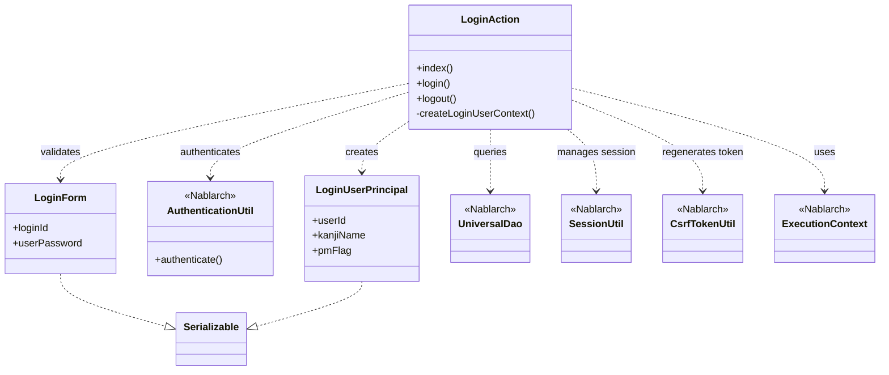
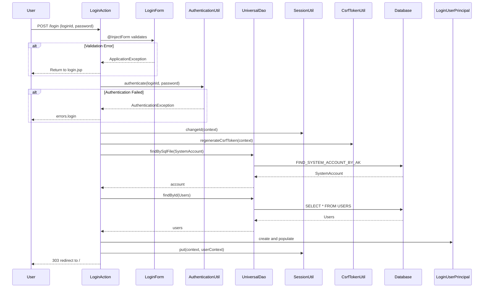

# Code Analysis: LoginAction

**Generated**: 2026-03-05 20:24:46
**Target**: ログイン認証処理
**Modules**: proman-web
**Analysis Duration**: 約2分35秒

---

## Overview

LoginActionは、ユーザー認証機能を提供するWebアクションクラス。ログイン画面の表示、認証処理、ログアウト処理を担当する。フォームバリデーション、データベース認証、セッション管理、CSRF対策を統合した実装となっている。

---

## Architecture

### Dependency Graph



**Note**: This diagram uses Mermaid `classDiagram` syntax to show class names and their relationships. Use `--|>` for inheritance (extends/implements) and `..>` for dependencies (uses/creates).

### Component Summary

| Component | Role | Type | Dependencies |
|-----------|------|------|--------------|
| LoginAction | ログイン認証処理 | Action | LoginForm, AuthenticationUtil, UniversalDao, SessionUtil, CsrfTokenUtil |
| LoginForm | ログイン入力フォーム | Form | なし |
| AuthenticationUtil | 認証ユーティリティ | Utility | PasswordAuthenticator, SystemRepository |
| LoginUserPrincipal | ログインユーザー情報 | Context | なし |

---

## Flow

### Processing Flow

1. **ログイン画面表示** (`index`): ログイン画面JSPを表示
2. **ログイン処理** (`login`):
   - フォームバリデーション (@InjectForm)
   - 認証実行 (AuthenticationUtil.authenticate)
   - セッションID変更 (SessionUtil.changeId)
   - CSRFトークン再生成 (CsrfTokenUtil.regenerateCsrfToken)
   - ユーザー情報取得とセッション格納
   - トップ画面へリダイレクト
3. **ログアウト処理** (`logout`): セッション無効化とログイン画面へリダイレクト

### Sequence Diagram



---

## Components

### LoginAction

**File**: [LoginAction.java](../../.lw/nab-official/v6/nablarch-system-development-guide/Sample_Project/Source_Code/proman-project/proman-web/src/main/java/com/nablarch/example/proman/web/login/LoginAction.java)

**Role**: ログイン認証処理を担当するアクションクラス

**Key Methods**:
- `index()` [:38-40] - ログイン画面表示
- `login()` [:49-71] - ログイン処理（認証、セッション管理、リダイレクト）
- `logout()` [:102-106] - ログアウト処理
- `createLoginUserContext()` [:79-92] - 認証情報取得

**Dependencies**: LoginForm, AuthenticationUtil, UniversalDao, SessionUtil, CsrfTokenUtil, ExecutionContext

**Implementation Points**:
- @OnError: バリデーションエラー時にlogin.jspへ遷移
- @InjectForm: フォームを自動バインド・検証
- セッションID変更: 認証成功後にセッション固定攻撃を防止
- CSRFトークン再生成: 新しいセッションに対応するトークンを生成

### LoginForm

**File**: [LoginForm.java](../../.lw/nab-official/v6/nablarch-system-development-guide/Sample_Project/Source_Code/proman-project/proman-web/src/main/java/com/nablarch/example/proman/web/login/LoginForm.java)

**Role**: ログイン入力フォームのバリデーション

**Key Fields**:
- `loginId` [:21-23] - ログインID (@Required, @Domain)
- `userPassword` [:25-28] - パスワード (@Required, @Domain)

**Dependencies**: なし

**Implementation Points**:
- Bean Validation: @Requiredで必須チェック
- @Domain: ドメインバリデーションで形式チェック
- Serializable: セッションに格納可能

### AuthenticationUtil

**File**: [AuthenticationUtil.java](../../.lw/nab-official/v6/nablarch-system-development-guide/Sample_Project/Source_Code/proman-project/proman-web/src/main/java/com/nablarch/example/proman/web/common/authentication/AuthenticationUtil.java)

**Role**: 認証処理のユーティリティクラス

**Key Methods**:
- `authenticate()` [:62-66] - ユーザー認証実行

**Dependencies**: PasswordAuthenticator, SystemRepository

**Implementation Points**:
- SystemRepositoryから認証コンポーネント取得
- 認証失敗時に各種例外をスロー（AuthenticationFailedException, UserIdLockedException, PasswordExpiredException）

### LoginUserPrincipal

**File**: [LoginUserPrincipal.java](../../.lw/nab-official/v6/nablarch-system-development-guide/Sample_Project/Source_Code/proman-project/proman-web/src/main/java/com/nablarch/example/proman/web/common/authentication/context/LoginUserPrincipal.java)

**Role**: ログインユーザー情報を保持するコンテキストクラス

**Key Fields**:
- `userId` [:18-19] - ユーザーID
- `kanjiName` [:21-22] - 漢字氏名
- `pmFlag` [:24-25] - PM職フラグ
- `lastLoginDateTime` [:27-28] - 最終ログイン日時

**Dependencies**: なし

**Implementation Points**:
- Serializable: セッションに格納可能
- セッションキー "userContext" で格納

---

## Nablarch Framework Usage

### UniversalDao

**クラス**: `nablarch.common.dao.UniversalDao`

**説明**: データベースアクセスを簡易化するDAOユーティリティ

**使用方法**:
```java
// SQLファイルを使った検索
SystemAccount account = UniversalDao.findBySqlFile(
    SystemAccount.class,
    "FIND_SYSTEM_ACCOUNT_BY_AK",
    new Object[]{loginId}
);

// 主キーによる検索
Users users = UniversalDao.findById(Users.class, account.getUserId());
```

**重要ポイント**:
- ✅ **型安全な検索**: エンティティクラスを指定することで型安全にデータ取得
- 💡 **SQLファイル管理**: SQLは外部ファイル化され、保守性が向上
- 🎯 **シンプルなCRUD**: 主キー検索は`findById`で1行で記述可能

**このコードでの使い方**:
- `createLoginUserContext()`でSystemAccountとUsersを取得 (Line 80-83)
- SQLファイル "FIND_SYSTEM_ACCOUNT_BY_AK" でログインIDから検索
- ユーザーIDから`findById`で関連情報を取得

**詳細**: [Libraries Universal_dao](../../.claude/skills/nabledge-6/docs/component/libraries/libraries-universal_dao.md)

### @InjectForm

**クラス**: `nablarch.common.web.interceptor.InjectForm`

**説明**: HTTPリクエストパラメータを自動的にフォームオブジェクトにバインドし、バリデーションを実行

**使用方法**:
```java
@OnError(type = ApplicationException.class, path = "/WEB-INF/view/login/login.jsp")
@InjectForm(form = LoginForm.class)
public HttpResponse login(HttpRequest request, ExecutionContext context) {
    LoginForm form = context.getRequestScopedVar("form");
    // バリデーション済みのフォームを使用
}
```

**重要ポイント**:
- ✅ **自動バインド**: リクエストパラメータが自動的にフォームフィールドにマッピング
- ✅ **自動バリデーション**: @Required, @Domainなどのアノテーションに基づいて検証
- ⚠️ **@OnErrorと併用**: バリデーションエラー時の遷移先を指定
- 💡 **リクエストスコープ**: バリデーション済みフォームは "form" キーで取得

**このコードでの使い方**:
- `login()`メソッドに適用 (Line 50)
- バリデーションエラー時は login.jsp へ遷移
- 成功時は context から "form" を取得して使用

### SessionUtil

**クラス**: `nablarch.common.web.session.SessionUtil`

**説明**: セッション管理のユーティリティクラス

**使用方法**:
```java
// セッションID変更（セッション固定攻撃対策）
SessionUtil.changeId(context);

// セッションに値を格納
SessionUtil.put(context, "userContext", userContext);

// セッション無効化
SessionUtil.invalidate(context);
```

**重要ポイント**:
- ✅ **セッション固定攻撃対策**: 認証後に`changeId()`でセッションIDを変更
- 🎯 **セッションライフサイクル管理**: put/get/invalidateでセッション操作
- ⚡ **型安全**: ジェネリクスで型安全にオブジェクト格納

**このコードでの使い方**:
- 認証成功後に`changeId()`でセッションID変更 (Line 65)
- ユーザー情報を "userContext" キーで格納 (Line 69)
- ログアウト時に`invalidate()`でセッション破棄 (Line 103)

### CsrfTokenUtil

**クラス**: `nablarch.common.web.csrf.CsrfTokenUtil`

**説明**: CSRF（クロスサイトリクエストフォージェリ）対策のトークン管理

**使用方法**:
```java
// CSRFトークンを再生成
CsrfTokenUtil.regenerateCsrfToken(context);
```

**重要ポイント**:
- ✅ **CSRF対策**: 不正なリクエストを防止
- 🎯 **セッション変更時の再生成**: 認証後など、セッションID変更時にトークンも更新
- 💡 **自動検証**: Nablarchのハンドラチェーンで自動的にトークン検証

**このコードでの使い方**:
- 認証成功後、セッションID変更と同時にトークン再生成 (Line 66)
- 新しいセッションに対応するトークンを発行

---

## References

### Source Files

- [LoginAction.java (.lw/nab-official/v6/nablarch-system-development-guide/en/Sample_Project/Source_Code/proman-project/proman-web/src/main/java/com/nablarch/example/proman/web/login)](../../.lw/nab-official/v6/nablarch-system-development-guide/en/Sample_Project/Source_Code/proman-project/proman-web/src/main/java/com/nablarch/example/proman/web/login/LoginAction.java) - LoginAction
- [LoginAction.java (.lw/nab-official/v6/nablarch-system-development-guide/Sample_Project/Source_Code/proman-project/proman-web/src/main/java/com/nablarch/example/proman/web/login)](../../.lw/nab-official/v6/nablarch-system-development-guide/Sample_Project/Source_Code/proman-project/proman-web/src/main/java/com/nablarch/example/proman/web/login/LoginAction.java) - LoginAction
- [LoginForm.java (.lw/nab-official/v6/nablarch-system-development-guide/en/Sample_Project/Source_Code/proman-project/proman-web/src/main/java/com/nablarch/example/proman/web/login)](../../.lw/nab-official/v6/nablarch-system-development-guide/en/Sample_Project/Source_Code/proman-project/proman-web/src/main/java/com/nablarch/example/proman/web/login/LoginForm.java) - LoginForm
- [LoginForm.java (.lw/nab-official/v6/nablarch-system-development-guide/Sample_Project/Source_Code/proman-project/proman-web/src/main/java/com/nablarch/example/proman/web/login)](../../.lw/nab-official/v6/nablarch-system-development-guide/Sample_Project/Source_Code/proman-project/proman-web/src/main/java/com/nablarch/example/proman/web/login/LoginForm.java) - LoginForm
- [AuthenticationUtil.java (.lw/nab-official/v6/nablarch-system-development-guide/en/Sample_Project/Source_Code/proman-project/proman-web/src/main/java/com/nablarch/example/proman/web/common/authentication)](../../.lw/nab-official/v6/nablarch-system-development-guide/en/Sample_Project/Source_Code/proman-project/proman-web/src/main/java/com/nablarch/example/proman/web/common/authentication/AuthenticationUtil.java) - AuthenticationUtil
- [AuthenticationUtil.java (.lw/nab-official/v6/nablarch-system-development-guide/Sample_Project/Source_Code/proman-project/proman-web/src/main/java/com/nablarch/example/proman/web/common/authentication)](../../.lw/nab-official/v6/nablarch-system-development-guide/Sample_Project/Source_Code/proman-project/proman-web/src/main/java/com/nablarch/example/proman/web/common/authentication/AuthenticationUtil.java) - AuthenticationUtil
- [LoginUserPrincipal.java (.lw/nab-official/v6/nablarch-system-development-guide/en/Sample_Project/Source_Code/proman-project/proman-web/src/main/java/com/nablarch/example/proman/web/common/authentication/context)](../../.lw/nab-official/v6/nablarch-system-development-guide/en/Sample_Project/Source_Code/proman-project/proman-web/src/main/java/com/nablarch/example/proman/web/common/authentication/context/LoginUserPrincipal.java) - LoginUserPrincipal
- [LoginUserPrincipal.java (.lw/nab-official/v6/nablarch-system-development-guide/Sample_Project/Source_Code/proman-project/proman-web/src/main/java/com/nablarch/example/proman/web/common/authentication/context)](../../.lw/nab-official/v6/nablarch-system-development-guide/Sample_Project/Source_Code/proman-project/proman-web/src/main/java/com/nablarch/example/proman/web/common/authentication/context/LoginUserPrincipal.java) - LoginUserPrincipal

### Knowledge Base (Nabledge-6)

- [Libraries Universal_dao](../../.claude/skills/nabledge-6/docs/component/libraries/libraries-universal_dao.md)

### Official Documentation


- [BasicDaoContextFactory](https://nablarch.github.io/docs/LATEST/javadoc/nablarch/common/dao/BasicDaoContextFactory.html)
- [ConnectionFactory](https://nablarch.github.io/docs/LATEST/javadoc/nablarch/core/db/connection/ConnectionFactory.html)
- [DatabaseMetaDataExtractor](https://nablarch.github.io/docs/LATEST/javadoc/nablarch/common/dao/DatabaseMetaDataExtractor.html)
- [Date](https://nablarch.github.io/docs/LATEST/javadoc/java/sql/Date.html)
- [DeferredEntityList](https://nablarch.github.io/docs/LATEST/javadoc/nablarch/common/dao/DeferredEntityList.html)
- [Dialect](https://nablarch.github.io/docs/LATEST/javadoc/nablarch/core/db/dialect/Dialect.html)
- [EntityList](https://nablarch.github.io/docs/LATEST/javadoc/nablarch/common/dao/EntityList.html)
- [GenerationType](https://nablarch.github.io/docs/LATEST/javadoc/jakarta/persistence/GenerationType.html)
- [H2Dialect](https://nablarch.github.io/docs/LATEST/javadoc/nablarch/core/db/dialect/H2Dialect.html)
- [Integer](https://nablarch.github.io/docs/LATEST/javadoc/java/lang/Integer.html)
- [Long](https://nablarch.github.io/docs/LATEST/javadoc/java/lang/Long.html)
- [OnError](https://nablarch.github.io/docs/LATEST/javadoc/nablarch/fw/web/interceptor/OnError.html)
- [OptimisticLockException](https://nablarch.github.io/docs/LATEST/javadoc/jakarta/persistence/OptimisticLockException.html)
- [Pagination](https://nablarch.github.io/docs/LATEST/javadoc/nablarch/common/dao/Pagination.html)
- [SimpleDbTransactionManager](https://nablarch.github.io/docs/LATEST/javadoc/nablarch/core/db/transaction/SimpleDbTransactionManager.html)
- [TransactionFactory](https://nablarch.github.io/docs/LATEST/javadoc/nablarch/core/transaction/TransactionFactory.html)
- [Universal Dao](https://nablarch.github.io/docs/LATEST/doc/application_framework/application_framework/libraries/database/universal_dao.html)
- [UniversalDao.Transaction](https://nablarch.github.io/docs/LATEST/javadoc/nablarch/common/dao/UniversalDao.Transaction.html)
- [UniversalDao](https://nablarch.github.io/docs/LATEST/javadoc/nablarch/common/dao/UniversalDao.html)

---

**Note**: This documentation was generated by the code-analysis workflow of the nabledge-6 skill.
