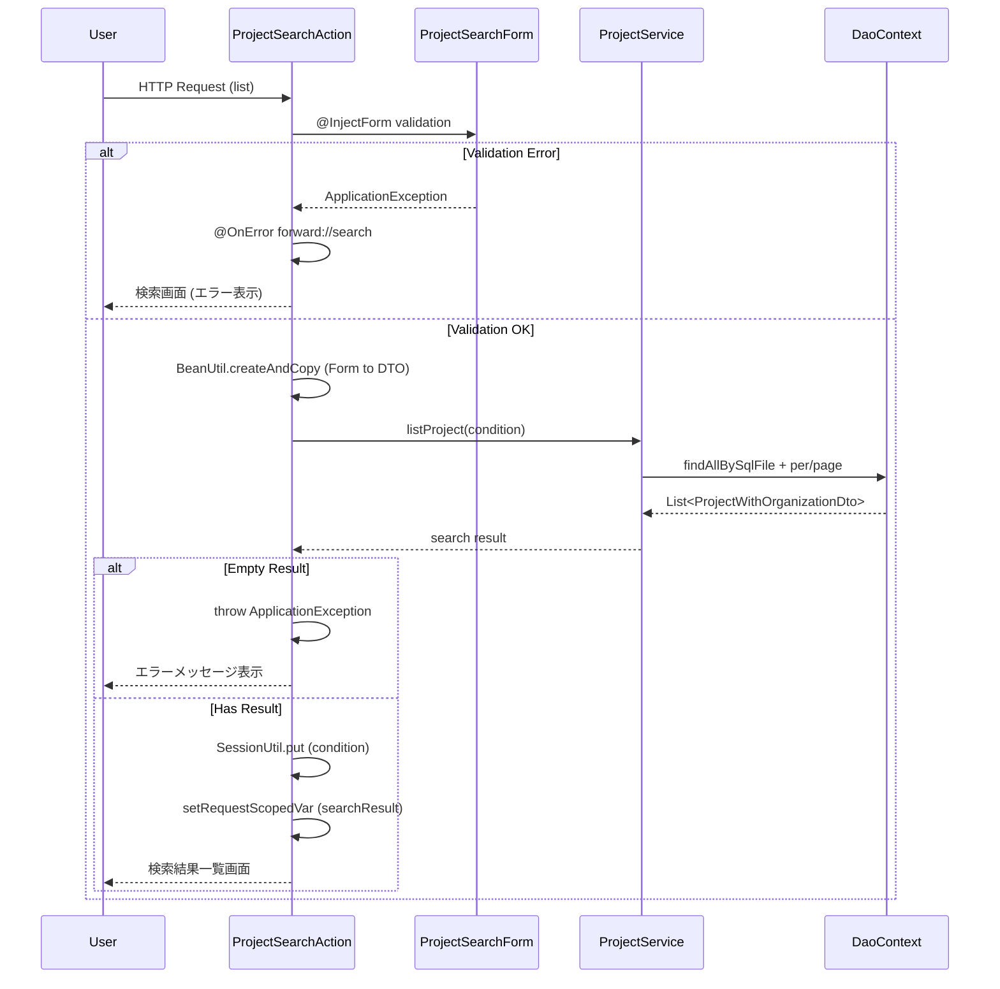

# Code Analysis: ProjectSearchAction

**Generated**: 2026-03-05 20:24:31
**Target**: プロジェクト検索機能
**Modules**: proman-web
**Analysis Duration**: 約2分42秒

---

## Overview

ProjectSearchActionは、Nablarch Webアプリケーションにおけるプロジェクト検索機能を実装するActionクラス。検索画面の初期表示、条件指定検索、検索結果一覧表示、詳細画面表示を提供。検索条件をセッションに保持し、詳細画面から戻った際に検索結果を復元する機能を持つ。

主要な構成要素:
- **ProjectSearchAction**: リクエストを受け取り、フォーム検証、検索処理、画面遷移を制御
- **ProjectSearchForm**: ユーザー入力値の検証と型変換（Bean Validation使用）
- **ProjectService**: ビジネスロジック層。DaoContextを使用したDB検索を実行
- **ProjectSearchConditionDto**: 検索条件を保持するDTO
- **ProjectWithOrganizationDto**: 検索結果を格納するDTO

---

## Architecture

### Dependency Graph

```mermaid
classDiagram
    class ProjectSearchAction {
        <<Action>>
    }
    class ProjectSearchForm {
        <<Form>>
    }
    class ProjectService {
        <<Service>>
    }
    class DaoContext {
        <<Nablarch>>
    }
    class ExecutionContext {
        <<Nablarch>>
    }
    class SessionUtil {
        <<Nablarch>>
    }
    class BeanUtil {
        <<Nablarch>>
    }
    class InjectForm {
        <<Nablarch>>
    }
    class OnError {
        <<Nablarch>>
    }

    ProjectSearchAction ..> ProjectSearchForm : validates
    ProjectSearchAction ..> ProjectService : delegates to
    ProjectSearchAction ..> ExecutionContext : uses
    ProjectSearchAction ..> SessionUtil : uses
    ProjectSearchAction ..> BeanUtil : uses
    ProjectSearchForm --|> SearchFormBase : extends
    ProjectService ..> DaoContext : queries via
```



**Note**: This diagram uses Mermaid `classDiagram` syntax to show class names and their relationships. Use `--|>` for inheritance (extends/implements) and `..>` for dependencies (uses/creates).

### Component Summary

| Component | Role | Type | Dependencies |
|-----------|------|------|--------------|
| ProjectSearchAction | 検索リクエスト制御 | Action | ProjectSearchForm, ProjectService, ExecutionContext, SessionUtil, BeanUtil |
| ProjectSearchForm | 検索条件入力検証 | Form | SearchFormBase, Bean Validation |
| ProjectService | 検索ビジネスロジック | Service | DaoContext (UniversalDao) |
| ProjectSearchConditionDto | 検索条件保持 | DTO | なし |
| ProjectWithOrganizationDto | 検索結果保持 | DTO | なし |

---

## Flow

### Processing Flow

1. **検索画面初期表示** (`search`): セッションから検索条件を削除し、事業部・部門リストを取得して画面表示
2. **検索実行** (`list`): フォーム検証後、検索条件をDTOに変換してDB検索。結果を取得し検索条件をセッションに保存
3. **検索結果復元** (`backToList`): セッションから検索条件を取得して再検索。詳細画面から戻った際に使用
4. **詳細表示** (`detail`): プロジェクトIDを受け取り、該当プロジェクトの詳細情報を取得して表示

すべてのメソッドで、事業部・部門リストをリクエストスコープに設定してプルダウン表示に使用。

### Sequence Diagram



---

## Components

### ProjectSearchAction

**File**: `.lw/nab-official/v6/.../ProjectSearchAction.java`

**Role**: プロジェクト検索リクエストを制御するActionクラス

**Key Methods**:
- `search()` (L35-40): 検索画面初期表示。セッション条件削除、事業部・部門取得
- `list()` (L51-69): 検索実行。@InjectFormでフォーム検証、条件変換、DB検索、セッション保存
- `backToList()` (L79-91): 検索画面に戻る。セッション条件で再検索
- `detail()` (L102-109): 詳細画面表示。プロジェクトID指定で詳細取得
- `searchProjectAndSetToRequestScope()` (L117-125): 検索処理の共通化。結果0件時はApplicationException
- `setOrganizationAndDivisionToRequestScope()` (L132-136): 事業部・部門リストをリクエストスコープに設定

**Dependencies**: ProjectSearchForm, ProjectService, ExecutionContext, SessionUtil, BeanUtil

**Nablarch Usage**:
- **@InjectForm**: フォーム自動バインド・検証 (L49)
- **@OnError**: 検証エラー時のフォワード先指定 (L50, L78)
- **SessionUtil**: 検索条件のセッション保存・取得 (L36, L66, L81)
- **BeanUtil**: FormとDTOの相互変換 (L58, L85)

---

### ProjectSearchForm

**File**: `.lw/nab-official/v6/.../ProjectSearchForm.java`

**Role**: 検索条件の入力検証と型変換を行うFormクラス

**Key Fields**:
- `divisionId`, `organizationId` (L21-25): 事業部・部門ID (@Domain検証)
- `projectType`, `projectClass` (L27-31): プロジェクト種別・分類 (@Valid)
- `salesFrom`, `salesTo` (L33-37): 売上高範囲 (@Domain)
- `projectStartDateFrom/To`, `projectEndDateFrom/To` (L39-49): 開始・終了日範囲 (@Domain)
- `projectName` (L51-52): プロジェクト名 (@Domain)

**Validation Methods**:
- `isValidProjectSalesRange()` (L295-297): 売上高FROM-TO妥当性検証
- `isValidProjectStartDateRange()` (L307-309): 開始日FROM-TO妥当性検証
- `isValidProjectEndDateRange()` (L319-321): 終了日FROM-TO妥当性検証

**Dependencies**: SearchFormBase (親クラス), Bean Validation

---

### ProjectService

**File**: `.lw/nab-official/v6/.../ProjectService.java`

**Role**: プロジェクト検索のビジネスロジックを提供するServiceクラス

**Key Methods**:
- `findAllDivision()` (L50-52): 全事業部取得。findAllBySqlFile使用
- `findAllDepartment()` (L59-61): 全部門取得。findAllBySqlFile使用
- `listProject()` (L99-104): プロジェクト検索（ページング付き）。per/page + findAllBySqlFile
- `findProjectByIdWithOrganization()` (L112-116): プロジェクト詳細取得。findBySqlFile使用

**Dependencies**: DaoContext (UniversalDao経由でDB検索)

**Configuration**: RECORDS_PER_PAGE = 20 (L27)

---

## Nablarch Framework Usage

### @InjectForm (Form自動バインド・検証)

**クラス**: `nablarch.common.web.interceptor.InjectForm`

**説明**: HTTPリクエストパラメータを自動的にFormオブジェクトにバインドし、Bean Validationによる検証を実行する

**使用方法**:
```java
@InjectForm(form = ProjectSearchForm.class, prefix = "form")
public HttpResponse list(HttpRequest request, ExecutionContext context) {
    ProjectSearchForm form = context.getRequestScopedVar("form");
    // ... 検証済みフォームを使用
}
```

**重要ポイント**:
- ✅ **検証エラー時の処理**: @OnErrorと組み合わせてエラー時の遷移先を指定
- 💡 **prefix指定**: リクエストスコープへの格納キーを指定（デフォルトは"form"）
- 🎯 **適用タイミング**: メソッド実行前にインターセプタとして動作

**このコードでの使い方**:
- `list()` (L49): 検索実行時にProjectSearchFormを自動バインド・検証
- `detail()` (L101): 詳細表示時にProjectDetailInitialFormを自動バインド

**詳細**: [About Nablarch Architecture](../../.claude/skills/nabledge-6/docs/about/about-nablarch/about-nablarch-architecture.md)

---

### @OnError (検証エラー時の遷移制御)

**クラス**: `nablarch.fw.web.interceptor.OnError`

**説明**: 指定した例外が発生した際の遷移先を定義するアノテーション

**使用方法**:
```java
@OnError(type = ApplicationException.class, path = "forward://search")
public HttpResponse list(HttpRequest request, ExecutionContext context) {
    // 検証エラーが発生すると自動的にsearchメソッドへフォワード
}
```

**重要ポイント**:
- ✅ **エラー画面遷移の簡潔化**: try-catchを書かずに宣言的にエラー処理を定義
- ⚠️ **path指定**: "forward://"はActionメソッド名、"redirect://"は外部パス
- 💡 **エラー情報の引継ぎ**: エラーメッセージはリクエストスコープに自動設定される

**このコードでの使い方**:
- `list()` (L50): 検証エラー時にsearchメソッドへフォワード
- `backToList()` (L78): 検索条件復元時のエラーハンドリング

**詳細**: [About Nablarch Architecture](../../.claude/skills/nabledge-6/docs/about/about-nablarch/about-nablarch-architecture.md)

---

### UniversalDao (ページング検索)

**クラス**: `nablarch.common.dao.UniversalDao` (DaoContext経由で使用)

**説明**: SQLファイルを使用したデータベース検索機能。ページング、条件指定検索をサポート

**使用方法**:
```java
List<ProjectWithOrganizationDto> result = universalDao
    .per(20)  // 1ページ20件
    .page(condition.getPageNumber())  // ページ番号指定
    .findAllBySqlFile(ProjectWithOrganizationDto.class, "FIND_PROJECT_WITH_ORGANIZATION", condition);
```

**重要ポイント**:
- ✅ **per/page順序**: 必ずper → page → findAllBySqlFileの順で呼び出す
- ⚠️ **件数取得SQL**: ページング時は自動的にCOUNT SQLが実行される（性能劣化時は要カスタマイズ）
- 💡 **EntityList取得**: 結果はEntityListで返却され、getPagination()でページング情報を取得可能
- 🎯 **条件指定検索**: 第3引数にBeanを渡すことで動的に検索条件を指定

**このコードでの使い方**:
- `ProjectService.listProject()` (L99-104): ページング付きプロジェクト検索
- `ProjectService.findAllDivision/Department()` (L50-52, L59-61): マスタデータ取得
- SQL ID指定で対応するSQLファイルを実行

**詳細**: [Libraries Universal_dao](../../.claude/skills/nabledge-6/docs/component/libraries/libraries-universal_dao.md)

---

### BeanUtil (Bean変換)

**クラス**: `nablarch.core.beans.BeanUtil`

**説明**: BeanからBeanへプロパティをコピーする機能を提供

**使用方法**:
```java
ProjectSearchConditionDto condition = BeanUtil.createAndCopy(
    ProjectSearchConditionDto.class, form);
```

**重要ポイント**:
- ✅ **同名プロパティの自動コピー**: 名前と型が一致するプロパティを自動的にコピー
- ⚠️ **型変換の制限**: 基本的な型変換のみサポート。複雑な変換は個別実装が必要
- 💡 **Date and Time API対応**: Java 8のLocalDate等をサポート
- ⚡ **パフォーマンス**: ネストしたオブジェクトが多い場合は処理速度に注意

**このコードでの使い方**:
- `list()` (L58): ProjectSearchForm → ProjectSearchConditionDto変換
- `backToList()` (L85): ProjectSearchConditionDto → ProjectSearchForm変換（画面値復元）

**詳細**: リリースノート No.3, No.5参照

---

### SessionUtil (セッション管理)

**クラス**: `nablarch.common.web.session.SessionUtil`

**説明**: HTTPセッションへのオブジェクト保存・取得を簡潔に行うユーティリティ

**使用方法**:
```java
// 保存
SessionUtil.put(context, "searchCondition", condition);

// 取得
ProjectSearchConditionDto condition = SessionUtil.get(context, "searchCondition");

// 削除
SessionUtil.delete(context, "searchCondition");
```

**重要ポイント**:
- ✅ **セッション永続化**: ブラウザバック、詳細画面からの復帰時にデータを保持
- ⚠️ **メモリ使用量**: 大量データをセッションに保存すると メモリを圧迫する可能性
- 💡 **キー管理**: セッションキーは定数化して重複を防ぐ（CONDITION_DTO_SESSION_KEY = "searchCondition"）
- 🎯 **画面遷移パターン**: 一覧→詳細→一覧の遷移で検索条件を保持する際に使用

**このコードでの使い方**:
- `search()` (L36): 初期表示時にセッション条件を削除
- `list()` (L66): 検索実行時にセッションに条件を保存
- `backToList()` (L81): 詳細から戻る際にセッション条件で再検索

---

## References

### Source Files

- [ProjectSearchAction.java (.lw/nab-official/v6/nablarch-system-development-guide/en/Sample_Project/Source_Code/proman-project/proman-web/src/main/java/com/nablarch/example/proman/web/project)](../../.lw/nab-official/v6/nablarch-system-development-guide/en/Sample_Project/Source_Code/proman-project/proman-web/src/main/java/com/nablarch/example/proman/web/project/ProjectSearchAction.java) - ProjectSearchAction
- [ProjectSearchAction.java (.lw/nab-official/v6/nablarch-system-development-guide/Sample_Project/Source_Code/proman-project/proman-web/src/main/java/com/nablarch/example/proman/web/project)](../../.lw/nab-official/v6/nablarch-system-development-guide/Sample_Project/Source_Code/proman-project/proman-web/src/main/java/com/nablarch/example/proman/web/project/ProjectSearchAction.java) - ProjectSearchAction
- [ProjectSearchForm.java (.lw/nab-official/v6/nablarch-system-development-guide/en/Sample_Project/Source_Code/proman-project/proman-web/src/main/java/com/nablarch/example/proman/web/project)](../../.lw/nab-official/v6/nablarch-system-development-guide/en/Sample_Project/Source_Code/proman-project/proman-web/src/main/java/com/nablarch/example/proman/web/project/ProjectSearchForm.java) - ProjectSearchForm
- [ProjectSearchForm.java (.lw/nab-official/v6/nablarch-system-development-guide/Sample_Project/Source_Code/proman-project/proman-web/src/main/java/com/nablarch/example/proman/web/project)](../../.lw/nab-official/v6/nablarch-system-development-guide/Sample_Project/Source_Code/proman-project/proman-web/src/main/java/com/nablarch/example/proman/web/project/ProjectSearchForm.java) - ProjectSearchForm
- [ProjectService.java (.lw/nab-official/v6/nablarch-system-development-guide/en/Sample_Project/Source_Code/proman-project/proman-web/src/main/java/com/nablarch/example/proman/web/project)](../../.lw/nab-official/v6/nablarch-system-development-guide/en/Sample_Project/Source_Code/proman-project/proman-web/src/main/java/com/nablarch/example/proman/web/project/ProjectService.java) - ProjectService
- [ProjectService.java (.lw/nab-official/v6/nablarch-system-development-guide/Sample_Project/Source_Code/proman-project/proman-web/src/main/java/com/nablarch/example/proman/web/project)](../../.lw/nab-official/v6/nablarch-system-development-guide/Sample_Project/Source_Code/proman-project/proman-web/src/main/java/com/nablarch/example/proman/web/project/ProjectService.java) - ProjectService
- [ProjectSearchConditionDto.java (.lw/nab-official/v6/nablarch-system-development-guide/en/Sample_Project/Source_Code/proman-project/proman-web/src/main/java/com/nablarch/example/proman/web/project)](../../.lw/nab-official/v6/nablarch-system-development-guide/en/Sample_Project/Source_Code/proman-project/proman-web/src/main/java/com/nablarch/example/proman/web/project/ProjectSearchConditionDto.java) - ProjectSearchConditionDto
- [ProjectSearchConditionDto.java (.lw/nab-official/v6/nablarch-system-development-guide/Sample_Project/Source_Code/proman-project/proman-web/src/main/java/com/nablarch/example/proman/web/project)](../../.lw/nab-official/v6/nablarch-system-development-guide/Sample_Project/Source_Code/proman-project/proman-web/src/main/java/com/nablarch/example/proman/web/project/ProjectSearchConditionDto.java) - ProjectSearchConditionDto
- [ProjectWithOrganizationDto.java (.lw/nab-official/v6/nablarch-system-development-guide/en/Sample_Project/Source_Code/proman-project/proman-web/src/main/java/com/nablarch/example/proman/web/project)](../../.lw/nab-official/v6/nablarch-system-development-guide/en/Sample_Project/Source_Code/proman-project/proman-web/src/main/java/com/nablarch/example/proman/web/project/ProjectWithOrganizationDto.java) - ProjectWithOrganizationDto
- [ProjectWithOrganizationDto.java (.lw/nab-official/v6/nablarch-system-development-guide/Sample_Project/Source_Code/proman-project/proman-web/src/main/java/com/nablarch/example/proman/web/project)](../../.lw/nab-official/v6/nablarch-system-development-guide/Sample_Project/Source_Code/proman-project/proman-web/src/main/java/com/nablarch/example/proman/web/project/ProjectWithOrganizationDto.java) - ProjectWithOrganizationDto

### Knowledge Base (Nabledge-6)

- [Libraries Universal_dao](../../.claude/skills/nabledge-6/docs/component/libraries/libraries-universal_dao.md)
- [About Nablarch Architecture](../../.claude/skills/nabledge-6/docs/about/about-nablarch/about-nablarch-architecture.md)

### Official Documentation


- [Architecture](https://nablarch.github.io/docs/LATEST/doc/application_framework/application_framework/nablarch/architecture.html)
- [BasicDaoContextFactory](https://nablarch.github.io/docs/LATEST/javadoc/nablarch/common/dao/BasicDaoContextFactory.html)
- [ConnectionFactory](https://nablarch.github.io/docs/LATEST/javadoc/nablarch/core/db/connection/ConnectionFactory.html)
- [DatabaseMetaDataExtractor](https://nablarch.github.io/docs/LATEST/javadoc/nablarch/common/dao/DatabaseMetaDataExtractor.html)
- [Date](https://nablarch.github.io/docs/LATEST/javadoc/java/sql/Date.html)
- [DeferredEntityList](https://nablarch.github.io/docs/LATEST/javadoc/nablarch/common/dao/DeferredEntityList.html)
- [Dialect](https://nablarch.github.io/docs/LATEST/javadoc/nablarch/core/db/dialect/Dialect.html)
- [EntityList](https://nablarch.github.io/docs/LATEST/javadoc/nablarch/common/dao/EntityList.html)
- [GenerationType](https://nablarch.github.io/docs/LATEST/javadoc/jakarta/persistence/GenerationType.html)
- [H2Dialect](https://nablarch.github.io/docs/LATEST/javadoc/nablarch/core/db/dialect/H2Dialect.html)
- [InjectForm](https://nablarch.github.io/docs/LATEST/javadoc/nablarch/common/web/interceptor/InjectForm.html)
- [Integer](https://nablarch.github.io/docs/LATEST/javadoc/java/lang/Integer.html)
- [Interceptor.Factory](https://nablarch.github.io/docs/LATEST/javadoc/nablarch/fw/Interceptor.Factory.html)
- [Long](https://nablarch.github.io/docs/LATEST/javadoc/java/lang/Long.html)
- [OnDoubleSubmission](https://nablarch.github.io/docs/LATEST/javadoc/nablarch/common/web/token/OnDoubleSubmission.html)
- [OnError](https://nablarch.github.io/docs/LATEST/javadoc/nablarch/fw/web/interceptor/OnError.html)
- [OnErrors](https://nablarch.github.io/docs/LATEST/javadoc/nablarch/fw/web/interceptor/OnErrors.html)
- [OptimisticLockException](https://nablarch.github.io/docs/LATEST/javadoc/jakarta/persistence/OptimisticLockException.html)
- [Pagination](https://nablarch.github.io/docs/LATEST/javadoc/nablarch/common/dao/Pagination.html)
- [SimpleDbTransactionManager](https://nablarch.github.io/docs/LATEST/javadoc/nablarch/core/db/transaction/SimpleDbTransactionManager.html)
- [TransactionFactory](https://nablarch.github.io/docs/LATEST/javadoc/nablarch/core/transaction/TransactionFactory.html)
- [Universal Dao](https://nablarch.github.io/docs/LATEST/doc/application_framework/application_framework/libraries/database/universal_dao.html)
- [UniversalDao.Transaction](https://nablarch.github.io/docs/LATEST/javadoc/nablarch/common/dao/UniversalDao.Transaction.html)
- [UniversalDao](https://nablarch.github.io/docs/LATEST/javadoc/nablarch/common/dao/UniversalDao.html)
- [UseToken](https://nablarch.github.io/docs/LATEST/javadoc/nablarch/common/web/token/UseToken.html)

---

**Note**: This documentation was generated by the code-analysis workflow of the nabledge-6 skill.
