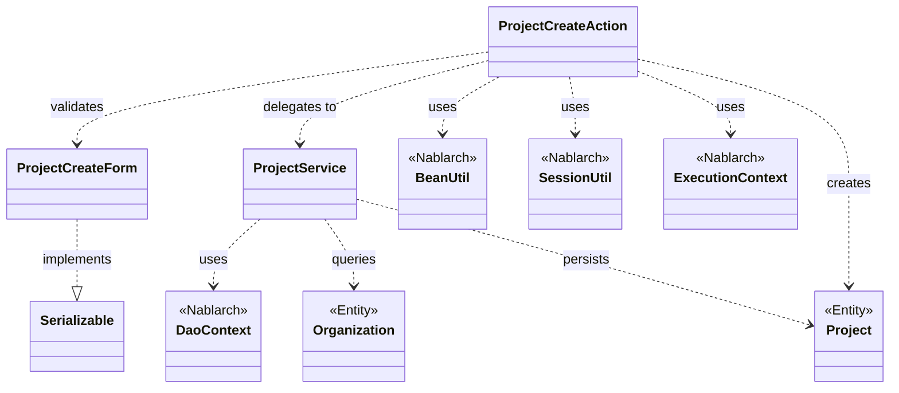
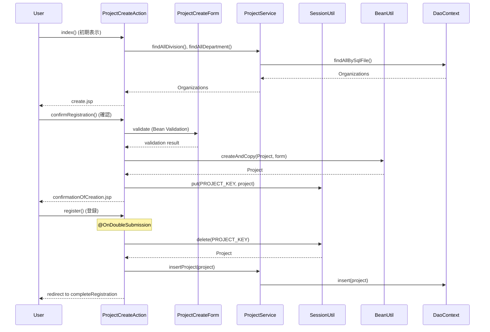

# Code Analysis: ProjectCreateAction

**Generated**: 2026-03-05 20:24:58
**Target**: プロジェクト登録処理
**Modules**: proman-web
**Analysis Duration**: 不明

---

## Overview

ProjectCreateActionはプロジェクト登録機能を実装するアクションクラス。入力画面表示、入力検証、確認画面表示、登録実行、完了画面表示という典型的なCRUD操作の登録フローを提供する。

**主な責務**:
- プロジェクト登録フォームの表示と入力受付
- Bean Validationによる入力検証
- セッションを使った画面間データ受け渡し
- ProjectServiceを介したデータベース登録
- 二重送信防止

---

## Architecture

### Dependency Graph



**Note**: This diagram uses Mermaid `classDiagram` syntax to show class names and their relationships. Use `--|>` for inheritance (extends/implements) and `..>` for dependencies (uses/creates).

### Component Summary

| Component | Role | Type | Dependencies |
|-----------|------|------|--------------|
| ProjectCreateAction | プロジェクト登録処理の制御 | Action | ProjectCreateForm, ProjectService, BeanUtil, SessionUtil |
| ProjectCreateForm | 入力値の検証とBean | Form | Jakarta Validation annotations |
| ProjectService | プロジェクト関連ビジネスロジック | Service | DaoContext, Organization, Project |
| Project | プロジェクトエンティティ | Entity | なし |
| Organization | 組織エンティティ | Entity | なし |

---

## Flow

### Processing Flow

1. **初期表示** (index): 事業部・部門プルダウンをDBから取得して入力画面を表示
2. **入力検証** (confirmRegistration): @InjectFormでフォーム検証、BeanUtilでEntity変換、セッションに保存して確認画面を表示
3. **登録実行** (register): @OnDoubleSubmissionで二重送信防止、セッションからProjectを取得してProjectService.insertProject()で登録、完了画面にリダイレクト
4. **完了表示** (completeRegistration): 登録完了画面を表示
5. **入力画面に戻る** (backToEnterRegistration): セッションからProjectを取得、BeanUtilでForm変換、入力画面にフォワード

### Sequence Diagram



---

## Components

### ProjectCreateAction

**File**: [ProjectCreateAction.java](../../.lw/nab-official/v6/nablarch-system-development-guide/Sample_Project/Source_Code/proman-project/proman-web/src/main/java/com/nablarch/example/proman/web/project/ProjectCreateAction.java)

**Role**: プロジェクト登録フローの制御

**Key Methods**:
- `index()` [:33-39] - 初期画面表示。事業部・部門プルダウン設定
- `confirmRegistration()` [:48-63] - 入力確認。@InjectFormで検証、BeanUtilでEntity変換、セッションに保存
- `register()` [:72-78] - 登録実行。@OnDoubleSubmissionで二重送信防止、ProjectService経由でDB登録
- `completeRegistration()` [:87-89] - 完了画面表示
- `backToEnterRegistration()` [:98-117] - 入力画面に戻る。セッションから復元、BeanUtilでForm変換

**Annotations**:
- `@InjectForm` (L48) - フォーム自動注入と検証
- `@OnError` (L49) - バリデーションエラー時の遷移先指定
- `@OnDoubleSubmission` (L72) - 二重送信防止

**Dependencies**: ProjectCreateForm (入力値), ProjectService (ビジネスロジック), BeanUtil (型変換), SessionUtil (画面間データ受け渡し)

### ProjectCreateForm

**File**: [ProjectCreateForm.java](../../.lw/nab-official/v6/nablarch-system-development-guide/Sample_Project/Source_Code/proman-project/proman-web/src/main/java/com/nablarch/example/proman/web/project/ProjectCreateForm.java)

**Role**: プロジェクト登録フォームの入力値検証とBean

**Key Validations**:
- `@Required` - プロジェクト名、種別、分類、開始日、終了日、事業部ID、部門ID、PM名、PL名
- `@Domain` - 各フィールドのドメイン定義による型制約
- `@AssertTrue` (L328) - 開始日・終了日の相関バリデーション (isValidProjectPeriod)

**Dependencies**: Jakarta Validation annotations, DateRelationUtil (相関バリデーション)

### ProjectService

**File**: [ProjectService.java](../../.lw/nab-official/v6/nablarch-system-development-guide/Sample_Project/Source_Code/proman-project/proman-web/src/main/java/com/nablarch/example/proman/web/project/ProjectService.java)

**Role**: プロジェクト関連ビジネスロジック

**Key Methods**:
- `insertProject()` [:80-82] - プロジェクト登録。DaoContext.insert()を呼び出し
- `findAllDivision()` [:50-52] - 全事業部取得
- `findAllDepartment()` [:59-61] - 全部門取得
- `findOrganizationById()` [:70-73] - 組織ID検索

**Dependencies**: DaoContext (UniversalDao), Organization, Project

---

## Nablarch Framework Usage

### @InjectForm

**クラス**: `nablarch.common.web.interceptor.InjectForm`

**説明**: フォームクラスを自動的にリクエストスコープに注入し、Bean Validationによる検証を実行するインターセプタ

**使用方法**:
```java
@InjectForm(form = ProjectCreateForm.class, prefix = "form")
@OnError(type = ApplicationException.class, path = "forward:///app/project/errorRegister")
public HttpResponse confirmRegistration(HttpRequest request, ExecutionContext context) {
    ProjectCreateForm form = context.getRequestScopedVar("form");
    // ...
}
```

**重要ポイント**:
- ✅ **form属性でフォームクラスを指定**: Bean Validationが自動実行される
- ✅ **prefix属性**: リクエストスコープに格納される変数名を指定
- ⚠️ **@OnErrorと組み合わせ**: バリデーションエラー時の遷移先を指定する
- 💡 **検証タイミング**: メソッド実行前にインターセプタが自動検証

**このコードでの使い方**:
- confirmRegistration()メソッドに適用 (Line 48)
- ProjectCreateFormを"form"という名前でリクエストスコープに注入
- バリデーションエラー時はerrorRegisterにフォワード

**詳細**: [About Nablarch Architecture - Handler Queue](../../.claude/skills/nabledge-6/docs/about/about-nablarch/about-nablarch-architecture.md#handler-queue)

### @OnError

**クラス**: `nablarch.fw.web.interceptor.OnError`

**説明**: 指定した例外発生時の遷移先を宣言的に指定するインターセプタ

**使用方法**:
```java
@OnError(type = ApplicationException.class, path = "forward:///app/project/errorRegister")
public HttpResponse confirmRegistration(HttpRequest request, ExecutionContext context) {
    // ...
}
```

**重要ポイント**:
- ✅ **type属性**: 捕捉する例外クラスを指定
- ✅ **path属性**: 遷移先パスを指定 (forward, redirect対応)
- 💡 **エラーハンドリング集約**: try-catchを書かずに宣言的にエラー処理
- 🎯 **バリデーションエラー**: ApplicationExceptionはBean Validationエラー時に送出される

**このコードでの使い方**:
- confirmRegistration()でバリデーションエラー時の遷移先を指定 (Line 49)

**詳細**: [About Nablarch Architecture - Handler Queue](../../.claude/skills/nabledge-6/docs/about/about-nablarch/about-nablarch-architecture.md#handler-queue)

### @OnDoubleSubmission

**クラス**: `nablarch.common.web.token.OnDoubleSubmission`

**説明**: 二重送信を防止するインターセプタ。トークンチェックにより同一リクエストの重複実行を防ぐ

**使用方法**:
```java
@OnDoubleSubmission
public HttpResponse register(HttpRequest request, ExecutionContext context) {
    // 登録処理
}
```

**重要ポイント**:
- ✅ **自動トークン生成**: 確認画面でトークンを生成し、登録時にチェック
- ⚠️ **画面テンプレート側の設定**: `<n:form>`タグでトークンを自動埋め込み
- 💡 **PRGパターン**: Post-Redirect-Getパターンと組み合わせて使用
- ⚡ **パフォーマンス**: トークンチェック失敗時は処理を実行せずエラー画面表示

**このコードでの使い方**:
- register()メソッドに適用 (Line 72)
- 二重送信時はエラー画面に遷移

**詳細**: [About Nablarch Architecture - Handler Queue](../../.claude/skills/nabledge-6/docs/about/about-nablarch/about-nablarch-architecture.md#handler-queue)

### BeanUtil

**クラス**: `nablarch.core.beans.BeanUtil`

**説明**: JavaBeansプロパティのコピーと型変換を行うユーティリティ

**使用方法**:
```java
// FormからEntityへの変換
Project project = BeanUtil.createAndCopy(Project.class, form);

// EntityからFormへの変換
ProjectCreateForm form = BeanUtil.createAndCopy(ProjectCreateForm.class, project);
```

**重要ポイント**:
- ✅ **createAndCopy()**: 新しいインスタンスを生成してプロパティをコピー
- 💡 **型変換**: String ⇔ Date, String ⇔ Integer など一般的な型変換を自動実行
- 💡 **プロパティ名マッピング**: 同名プロパティを自動的にマッピング
- ⚠️ **ネストオブジェクト**: ネストしたBeanは手動で変換が必要な場合がある

**このコードでの使い方**:
- confirmRegistration()でFormからProjectへ変換 (Line 52)
- backToEnterRegistration()でProjectからFormへ変換 (Line 101)

### SessionUtil

**クラス**: `nablarch.common.web.session.SessionUtil`

**説明**: セッションストアへのアクセスを提供するユーティリティ

**使用方法**:
```java
// セッションに保存
SessionUtil.put(context, "projectCreateActionProject", project);

// セッションから取得
Project project = SessionUtil.get(context, "projectCreateActionProject");

// セッションから削除
Project project = SessionUtil.delete(context, "projectCreateActionProject");
```

**重要ポイント**:
- ✅ **put()**: セッションに値を保存
- ✅ **get()**: セッションから値を取得
- ✅ **delete()**: セッションから値を削除して取得
- ⚠️ **セッションスコープ**: 画面間でのデータ受け渡しに使用。登録完了後は必ず削除する
- 💡 **確認画面パターン**: 入力→確認→完了の画面遷移で使用

**このコードでの使い方**:
- confirmRegistration()でProjectをセッションに保存 (Line 59)
- register()でセッションからProjectを削除して取得 (Line 74)
- backToEnterRegistration()でセッションからProjectを取得 (Line 100)

### DaoContext (UniversalDao)

**クラス**: `nablarch.common.dao.DaoContext`

**説明**: シンプルなCRUD操作とSQLファイル実行を提供する汎用DAO

**使用方法**:
```java
// 登録
universalDao.insert(project);

// 更新
universalDao.update(project);

// ID検索
Organization org = universalDao.findById(Organization.class, organizationId);

// SQLファイル実行
List<Organization> list = universalDao.findAllBySqlFile(Organization.class, "FIND_ALL_DIVISION");
```

**重要ポイント**:
- ✅ **insert()**: エンティティを登録
- ✅ **findById()**: 主キーで1件検索
- ✅ **findAllBySqlFile()**: SQLファイルを実行して複数件検索
- 💡 **トランザクション**: 自動的にトランザクション管理される
- 💡 **SQLファイル**: Entity名_SQL-ID.sqlというファイル名規約

**このコードでの使い方**:
- insertProject()でProjectを登録 (Line 81)
- findAllDivision()で全事業部取得 (Line 51)
- findOrganizationById()で組織ID検索 (Line 72)

**詳細**: [Libraries Universal_dao](../../.claude/skills/nabledge-6/docs/component/libraries/libraries-universal_dao.md)

---

## References

### Source Files

- [ProjectCreateAction.java (.lw/nab-official/v6/nablarch-system-development-guide/en/Sample_Project/Source_Code/proman-project/proman-web/src/main/java/com/nablarch/example/proman/web/project)](../../.lw/nab-official/v6/nablarch-system-development-guide/en/Sample_Project/Source_Code/proman-project/proman-web/src/main/java/com/nablarch/example/proman/web/project/ProjectCreateAction.java) - ProjectCreateAction
- [ProjectCreateAction.java (.lw/nab-official/v6/nablarch-system-development-guide/Sample_Project/Source_Code/proman-project/proman-web/src/main/java/com/nablarch/example/proman/web/project)](../../.lw/nab-official/v6/nablarch-system-development-guide/Sample_Project/Source_Code/proman-project/proman-web/src/main/java/com/nablarch/example/proman/web/project/ProjectCreateAction.java) - ProjectCreateAction
- [ProjectCreateForm.java (.lw/nab-official/v6/nablarch-system-development-guide/en/Sample_Project/Source_Code/proman-project/proman-web/src/main/java/com/nablarch/example/proman/web/project)](../../.lw/nab-official/v6/nablarch-system-development-guide/en/Sample_Project/Source_Code/proman-project/proman-web/src/main/java/com/nablarch/example/proman/web/project/ProjectCreateForm.java) - ProjectCreateForm
- [ProjectCreateForm.java (.lw/nab-official/v6/nablarch-system-development-guide/Sample_Project/Source_Code/proman-project/proman-web/src/main/java/com/nablarch/example/proman/web/project)](../../.lw/nab-official/v6/nablarch-system-development-guide/Sample_Project/Source_Code/proman-project/proman-web/src/main/java/com/nablarch/example/proman/web/project/ProjectCreateForm.java) - ProjectCreateForm
- [ProjectService.java (.lw/nab-official/v6/nablarch-system-development-guide/en/Sample_Project/Source_Code/proman-project/proman-web/src/main/java/com/nablarch/example/proman/web/project)](../../.lw/nab-official/v6/nablarch-system-development-guide/en/Sample_Project/Source_Code/proman-project/proman-web/src/main/java/com/nablarch/example/proman/web/project/ProjectService.java) - ProjectService
- [ProjectService.java (.lw/nab-official/v6/nablarch-system-development-guide/Sample_Project/Source_Code/proman-project/proman-web/src/main/java/com/nablarch/example/proman/web/project)](../../.lw/nab-official/v6/nablarch-system-development-guide/Sample_Project/Source_Code/proman-project/proman-web/src/main/java/com/nablarch/example/proman/web/project/ProjectService.java) - ProjectService

### Knowledge Base (Nabledge-6)

- [About Nablarch Architecture](../../.claude/skills/nabledge-6/docs/about/about-nablarch/about-nablarch-architecture.md)
- [Libraries Universal_dao](../../.claude/skills/nabledge-6/docs/component/libraries/libraries-universal_dao.md)

### Official Documentation


- [Architecture](https://nablarch.github.io/docs/LATEST/doc/application_framework/application_framework/nablarch/architecture.html)
- [BasicDaoContextFactory](https://nablarch.github.io/docs/LATEST/javadoc/nablarch/common/dao/BasicDaoContextFactory.html)
- [ConnectionFactory](https://nablarch.github.io/docs/LATEST/javadoc/nablarch/core/db/connection/ConnectionFactory.html)
- [DatabaseMetaDataExtractor](https://nablarch.github.io/docs/LATEST/javadoc/nablarch/common/dao/DatabaseMetaDataExtractor.html)
- [Date](https://nablarch.github.io/docs/LATEST/javadoc/java/sql/Date.html)
- [DeferredEntityList](https://nablarch.github.io/docs/LATEST/javadoc/nablarch/common/dao/DeferredEntityList.html)
- [Dialect](https://nablarch.github.io/docs/LATEST/javadoc/nablarch/core/db/dialect/Dialect.html)
- [EntityList](https://nablarch.github.io/docs/LATEST/javadoc/nablarch/common/dao/EntityList.html)
- [GenerationType](https://nablarch.github.io/docs/LATEST/javadoc/jakarta/persistence/GenerationType.html)
- [H2Dialect](https://nablarch.github.io/docs/LATEST/javadoc/nablarch/core/db/dialect/H2Dialect.html)
- [InjectForm](https://nablarch.github.io/docs/LATEST/javadoc/nablarch/common/web/interceptor/InjectForm.html)
- [Integer](https://nablarch.github.io/docs/LATEST/javadoc/java/lang/Integer.html)
- [Interceptor.Factory](https://nablarch.github.io/docs/LATEST/javadoc/nablarch/fw/Interceptor.Factory.html)
- [Long](https://nablarch.github.io/docs/LATEST/javadoc/java/lang/Long.html)
- [OnDoubleSubmission](https://nablarch.github.io/docs/LATEST/javadoc/nablarch/common/web/token/OnDoubleSubmission.html)
- [OnError](https://nablarch.github.io/docs/LATEST/javadoc/nablarch/fw/web/interceptor/OnError.html)
- [OnErrors](https://nablarch.github.io/docs/LATEST/javadoc/nablarch/fw/web/interceptor/OnErrors.html)
- [OptimisticLockException](https://nablarch.github.io/docs/LATEST/javadoc/jakarta/persistence/OptimisticLockException.html)
- [Pagination](https://nablarch.github.io/docs/LATEST/javadoc/nablarch/common/dao/Pagination.html)
- [SimpleDbTransactionManager](https://nablarch.github.io/docs/LATEST/javadoc/nablarch/core/db/transaction/SimpleDbTransactionManager.html)
- [TransactionFactory](https://nablarch.github.io/docs/LATEST/javadoc/nablarch/core/transaction/TransactionFactory.html)
- [Universal Dao](https://nablarch.github.io/docs/LATEST/doc/application_framework/application_framework/libraries/database/universal_dao.html)
- [UniversalDao.Transaction](https://nablarch.github.io/docs/LATEST/javadoc/nablarch/common/dao/UniversalDao.Transaction.html)
- [UniversalDao](https://nablarch.github.io/docs/LATEST/javadoc/nablarch/common/dao/UniversalDao.html)
- [UseToken](https://nablarch.github.io/docs/LATEST/javadoc/nablarch/common/web/token/UseToken.html)

---

**Note**: This documentation was generated by the code-analysis workflow of the nabledge-6 skill.
