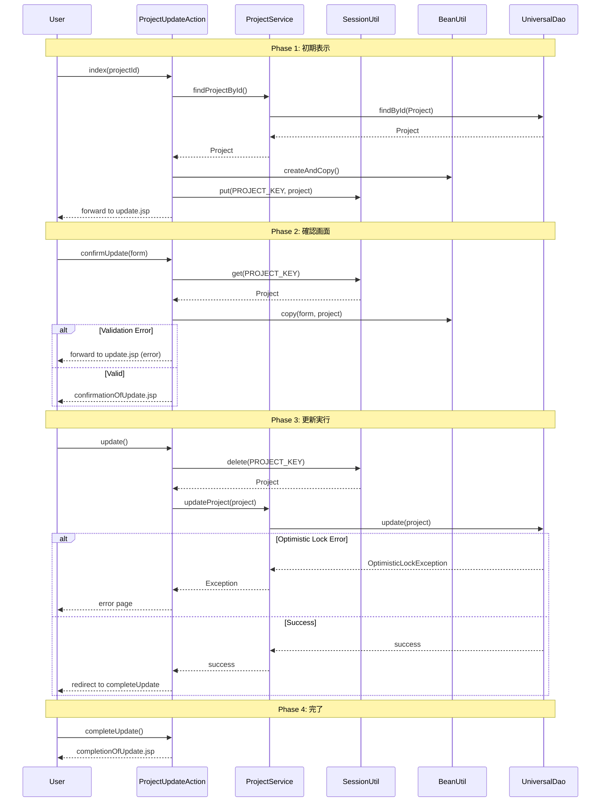

# Code Analysis: ProjectUpdateAction

**Generated**: 2026-03-05 20:24:26
**Target**: プロジェクト更新処理
**Modules**: proman-web
**Analysis Duration**: 約1分55秒

---

## Overview

ProjectUpdateActionは、Webアプリケーションにおけるプロジェクト情報の更新処理を担当するアクションクラスです。プロジェクト詳細画面から更新画面への遷移、フォーム入力値の検証、確認画面表示、データベース更新、完了画面表示という一連のフローを制御します。

主な機能:
- プロジェクト更新画面の表示（`index`）
- 更新情報の確認画面表示（`confirmUpdate`）
- データベースへの更新実行（`update`）
- セッション管理による画面間データ受け渡し
- 楽観的ロックによる排他制御
- 二重送信防止

---

## Architecture

### Dependency Graph

```mermaid
classDiagram
    class ProjectUpdateAction {
        +index()
        +confirmUpdate()
        +update()
        +completeUpdate()
    }
    class ProjectUpdateForm {
        <<Form>>
    }
    class ProjectService {
        +findProjectById()
        +updateProject()
    }
    class Project {
        <<Entity>>
    }
    class UniversalDao {
        <<Nablarch>>
    }
    class SessionUtil {
        <<Nablarch>>
    }
    class BeanUtil {
        <<Nablarch>>
    }
    class InjectForm {
        <<Nablarch>>
    }
    class OnError {
        <<Nablarch>>
    }
    class OnDoubleSubmission {
        <<Nablarch>>
    }

    ProjectUpdateAction ..> ProjectUpdateForm : validates
    ProjectUpdateAction ..> ProjectService : uses
    ProjectUpdateAction ..> SessionUtil : stores/retrieves
    ProjectUpdateAction ..> BeanUtil : maps
    ProjectUpdateForm..|>Serializable : uses
    ProjectService ..> UniversalDao : queries/updates
    ProjectService ..> Project : manages
    ProjectUpdateAction ..> InjectForm : binds form
    ProjectUpdateAction ..> OnError : handles errors
    ProjectUpdateAction ..> OnDoubleSubmission : prevents
```



**Note**: This diagram uses Mermaid `classDiagram` syntax to show class names and their relationships. Use `--|>` for inheritance (extends/implements) and `..>` for dependencies (uses/creates).

### Component Summary

| Component | Role | Type | Dependencies |
|-----------|------|------|--------------|
| ProjectUpdateAction | プロジェクト更新処理の制御 | Action | ProjectService, SessionUtil, BeanUtil |
| ProjectUpdateForm | 更新入力データの検証 | Form | なし |
| ProjectService | プロジェクトのCRUD操作 | Service | UniversalDao, Project |
| Project | プロジェクトエンティティ | Entity | なし |

---

## Flow

### Processing Flow

プロジェクト更新処理は以下の4つのフェーズで構成されます:

1. **初期表示**: 詳細画面からプロジェクトIDを受け取り、DBから既存データを取得して更新フォームに設定。Projectエンティティをセッションに保存。

2. **確認画面**: フォーム入力値を検証し、エラーがなければセッションからProjectを取得してフォームデータをコピー。確認画面を表示。

3. **更新実行**: セッションからProjectを取得してDBを更新。楽観的ロックにより排他制御。二重送信防止により重複更新を回避。

4. **完了**: 更新完了画面を表示。

### Sequence Diagram



---

## Components

### ProjectUpdateAction

**Role**: プロジェクト更新処理の全体制御

**File**: [ProjectUpdateAction.java](../../.lw/nab-official/v6/nablarch-system-development-guide/Sample_Project/Source_Code/proman-project/proman-web/src/main/java/com/nablarch/example/proman/web/project/ProjectUpdateAction.java)

**Key Methods**:
- `index()` [:35-43] - プロジェクト詳細から更新画面への遷移。DBから既存データ取得、フォーム構築、セッション保存
- `confirmUpdate()` [:54-62] - 更新情報の確認画面表示。フォーム検証後、セッションのProjectにコピー
- `update()` [:72-77] - 更新実行。セッションからProjectを削除して取得し、DBを更新

**Dependencies**: ProjectService (DB操作), SessionUtil (画面間データ受け渡し), BeanUtil (フォーム⇔エンティティ変換)

**Nablarch Annotations**:
- `@InjectForm` - フォームデータの自動バインドと検証
- `@OnError` - バリデーションエラー時の遷移先指定
- `@OnDoubleSubmission` - 二重送信防止

---

### ProjectUpdateForm

**Role**: 更新入力データの検証

**File**: [ProjectUpdateForm.java](../../.lw/nab-official/v6/nablarch-system-development-guide/Sample_Project/Source_Code/proman-project/proman-web/src/main/java/com/nablarch/example/proman/web/project/ProjectUpdateForm.java)

**Key Validation**:
- `@Required` - 必須項目の検証
- `@Domain` - ドメイン定義に基づく形式検証
- `@AssertTrue` - カスタム検証（開始日≦終了日）

**Dependencies**: なし（純粋なデータ保持クラス）

---

### ProjectService

**Role**: プロジェクトのCRUD操作

**File**: [ProjectService.java](../../.lw/nab-official/v6/nablarch-system-development-guide/Sample_Project/Source_Code/proman-project/proman-web/src/main/java/com/nablarch/example/proman/web/project/ProjectService.java)

**Key Methods**:
- `findProjectById()` [:124-126] - プロジェクトIDでProjectエンティティを取得
- `updateProject()` [:89-91] - Projectエンティティをデータベースに更新

**Dependencies**: UniversalDao (データベースアクセス)

---

## Nablarch Framework Usage

### UniversalDao

**クラス**: `nablarch.common.dao.UniversalDao`

**説明**: Entityクラスを使ったデータベースのCRUD操作を提供。楽観的ロック機能を内蔵。

**使用方法**:
```java
// 検索
Project project = universalDao.findById(Project.class, projectId);

// 更新
universalDao.update(project);
```

**重要ポイント**:
- ✅ **楽観的ロックの自動実行**: `@Version`付きEntityの更新時、自動でバージョンチェック
- ⚠️ **排他エラー処理**: `OptimisticLockException`をキャッチし、`@OnError`で画面遷移
- 💡 **シンプルなAPI**: findById、update等のメソッドで直感的にCRUD操作可能

**このコードでの使い方**:
- `ProjectService.findProjectById()`でデータ取得（Line 125）
- `ProjectService.updateProject()`でデータ更新（Line 90）
- Projectエンティティに`@Version`が付与されている場合、自動で楽観的ロック

**詳細**: [Libraries Universal_dao](../../.claude/skills/nabledge-6/docs/component/libraries/libraries-universal_dao.md)

---

### SessionUtil

**クラス**: `nablarch.common.web.session.SessionUtil`

**説明**: HTTPセッションへのオブジェクト保存・取得を簡潔に実行するユーティリティ。

**使用方法**:
```java
// セッションに保存
SessionUtil.put(context, "key", object);

// セッションから取得
Object obj = SessionUtil.get(context, "key");

// セッションから削除して取得
Object obj = SessionUtil.delete(context, "key");
```

**重要ポイント**:
- 🎯 **画面間データ受け渡し**: 確認画面→更新実行でエンティティを引き継ぐ
- ⚡ **delete()で取得と削除を同時実行**: 更新完了後の再送信を防止
- ⚠️ **セッション有効期限**: タイムアウト時は再取得が必要

**このコードでの使い方**:
- `index()`でProjectをセッション保存（Line 41） - 更新画面で使用
- `confirmUpdate()`でセッションから取得（Line 56） - 確認画面でフォームデータをコピー
- `update()`でセッションから削除（Line 73） - 更新実行後に再利用防止

---

### BeanUtil

**クラス**: `nablarch.core.beans.BeanUtil`

**説明**: JavaBeansの相互変換を行うユーティリティ。フォーム⇔エンティティの変換に使用。

**使用方法**:
```java
// EntityからFormを生成してコピー
ProjectUpdateForm form = BeanUtil.createAndCopy(ProjectUpdateForm.class, project);

// FormからEntityへコピー
BeanUtil.copy(form, project);
```

**重要ポイント**:
- ✅ **プロパティ名ベースのマッピング**: 同名プロパティを自動コピー
- ⚠️ **型変換の制限**: 日付等の特殊型は個別変換が必要
- 💡 **冗長なsetterコードを削減**: リフレクションで一括変換

**このコードでの使い方**:
- `buildFormFromEntity()`でProjectUpdateForm生成（Line 112） - 初期表示・確認画面戻り
- `confirmUpdate()`でフォームデータをProjectにコピー（Line 57） - 確認画面でのデータ反映

---

### @InjectForm

**クラス**: `nablarch.common.web.interceptor.InjectForm`

**説明**: リクエストパラメータを自動的にフォームオブジェクトにバインドし、Bean Validationによる検証を実行。

**使用方法**:
```java
@InjectForm(form = ProjectUpdateForm.class, prefix = "form")
public HttpResponse confirmUpdate(HttpRequest request, ExecutionContext context) {
    ProjectUpdateForm form = context.getRequestScopedVar("form");
    // formには検証済みデータが格納されている
}
```

**重要ポイント**:
- ✅ **自動バインドと検証**: リクエストパラメータ→フォーム変換と`@Required`等の検証を自動実行
- 🎯 **@OnErrorと組み合わせ**: 検証エラー時の遷移先を指定可能
- ⚡ **ボイラープレートコード削減**: 手動バインド・検証コードが不要

**このコードでの使い方**:
- `index()`でProjectUpdateInitialFormをバインド（Line 34） - プロジェクトID取得
- `confirmUpdate()`でProjectUpdateFormをバインド・検証（Line 52） - 更新内容の検証

---

### @OnDoubleSubmission

**クラス**: `nablarch.common.web.token.OnDoubleSubmission`

**説明**: 二重送信（ダブルクリック等）を防止するトークンベースの仕組み。

**使用方法**:
```java
@OnDoubleSubmission
public HttpResponse update(HttpRequest request, ExecutionContext context) {
    // 2回目以降のリクエストは自動的にエラー画面へ遷移
    universalDao.update(project);
}
```

**重要ポイント**:
- ✅ **自動トークン検証**: 初回アクセスのみ処理を実行、2回目以降は自動エラー
- 🎯 **更新・削除処理で必須**: データ重複登録・多重実行を防止
- ⚠️ **UseToken併用**: フォーム画面でトークン生成が必要

**このコードでの使い方**:
- `update()`メソッドに付与（Line 71） - DB更新の二重実行を防止

---

## References

### Source Files

- [ProjectUpdateAction.java (.lw/nab-official/v6/nablarch-system-development-guide/en/Sample_Project/Source_Code/proman-project/proman-web/src/main/java/com/nablarch/example/proman/web/project)](../../.lw/nab-official/v6/nablarch-system-development-guide/en/Sample_Project/Source_Code/proman-project/proman-web/src/main/java/com/nablarch/example/proman/web/project/ProjectUpdateAction.java) - ProjectUpdateAction
- [ProjectUpdateAction.java (.lw/nab-official/v6/nablarch-system-development-guide/Sample_Project/Source_Code/proman-project/proman-web/src/main/java/com/nablarch/example/proman/web/project)](../../.lw/nab-official/v6/nablarch-system-development-guide/Sample_Project/Source_Code/proman-project/proman-web/src/main/java/com/nablarch/example/proman/web/project/ProjectUpdateAction.java) - ProjectUpdateAction
- [ProjectUpdateForm.java (.lw/nab-official/v6/nablarch-system-development-guide/en/Sample_Project/Source_Code/proman-project/proman-web/src/main/java/com/nablarch/example/proman/web/project)](../../.lw/nab-official/v6/nablarch-system-development-guide/en/Sample_Project/Source_Code/proman-project/proman-web/src/main/java/com/nablarch/example/proman/web/project/ProjectUpdateForm.java) - ProjectUpdateForm
- [ProjectUpdateForm.java (.lw/nab-official/v6/nablarch-system-development-guide/Sample_Project/Source_Code/proman-project/proman-web/src/main/java/com/nablarch/example/proman/web/project)](../../.lw/nab-official/v6/nablarch-system-development-guide/Sample_Project/Source_Code/proman-project/proman-web/src/main/java/com/nablarch/example/proman/web/project/ProjectUpdateForm.java) - ProjectUpdateForm
- [ProjectService.java (.lw/nab-official/v6/nablarch-system-development-guide/en/Sample_Project/Source_Code/proman-project/proman-web/src/main/java/com/nablarch/example/proman/web/project)](../../.lw/nab-official/v6/nablarch-system-development-guide/en/Sample_Project/Source_Code/proman-project/proman-web/src/main/java/com/nablarch/example/proman/web/project/ProjectService.java) - ProjectService
- [ProjectService.java (.lw/nab-official/v6/nablarch-system-development-guide/Sample_Project/Source_Code/proman-project/proman-web/src/main/java/com/nablarch/example/proman/web/project)](../../.lw/nab-official/v6/nablarch-system-development-guide/Sample_Project/Source_Code/proman-project/proman-web/src/main/java/com/nablarch/example/proman/web/project/ProjectService.java) - ProjectService

### Knowledge Base (Nabledge-6)

- [Libraries Universal_dao](../../.claude/skills/nabledge-6/docs/component/libraries/libraries-universal_dao.md)

### Official Documentation


- [BasicDaoContextFactory](https://nablarch.github.io/docs/LATEST/javadoc/nablarch/common/dao/BasicDaoContextFactory.html)
- [ConnectionFactory](https://nablarch.github.io/docs/LATEST/javadoc/nablarch/core/db/connection/ConnectionFactory.html)
- [DatabaseMetaDataExtractor](https://nablarch.github.io/docs/LATEST/javadoc/nablarch/common/dao/DatabaseMetaDataExtractor.html)
- [Date](https://nablarch.github.io/docs/LATEST/javadoc/java/sql/Date.html)
- [DeferredEntityList](https://nablarch.github.io/docs/LATEST/javadoc/nablarch/common/dao/DeferredEntityList.html)
- [Dialect](https://nablarch.github.io/docs/LATEST/javadoc/nablarch/core/db/dialect/Dialect.html)
- [EntityList](https://nablarch.github.io/docs/LATEST/javadoc/nablarch/common/dao/EntityList.html)
- [GenerationType](https://nablarch.github.io/docs/LATEST/javadoc/jakarta/persistence/GenerationType.html)
- [H2Dialect](https://nablarch.github.io/docs/LATEST/javadoc/nablarch/core/db/dialect/H2Dialect.html)
- [Integer](https://nablarch.github.io/docs/LATEST/javadoc/java/lang/Integer.html)
- [Long](https://nablarch.github.io/docs/LATEST/javadoc/java/lang/Long.html)
- [OnError](https://nablarch.github.io/docs/LATEST/javadoc/nablarch/fw/web/interceptor/OnError.html)
- [OptimisticLockException](https://nablarch.github.io/docs/LATEST/javadoc/jakarta/persistence/OptimisticLockException.html)
- [Pagination](https://nablarch.github.io/docs/LATEST/javadoc/nablarch/common/dao/Pagination.html)
- [SimpleDbTransactionManager](https://nablarch.github.io/docs/LATEST/javadoc/nablarch/core/db/transaction/SimpleDbTransactionManager.html)
- [TransactionFactory](https://nablarch.github.io/docs/LATEST/javadoc/nablarch/core/transaction/TransactionFactory.html)
- [Universal Dao](https://nablarch.github.io/docs/LATEST/doc/application_framework/application_framework/libraries/database/universal_dao.html)
- [UniversalDao.Transaction](https://nablarch.github.io/docs/LATEST/javadoc/nablarch/common/dao/UniversalDao.Transaction.html)
- [UniversalDao](https://nablarch.github.io/docs/LATEST/javadoc/nablarch/common/dao/UniversalDao.html)

---

**Note**: This documentation was generated by the code-analysis workflow of the nabledge-6 skill.
