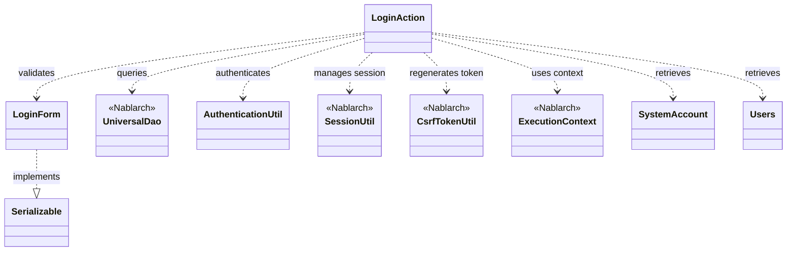
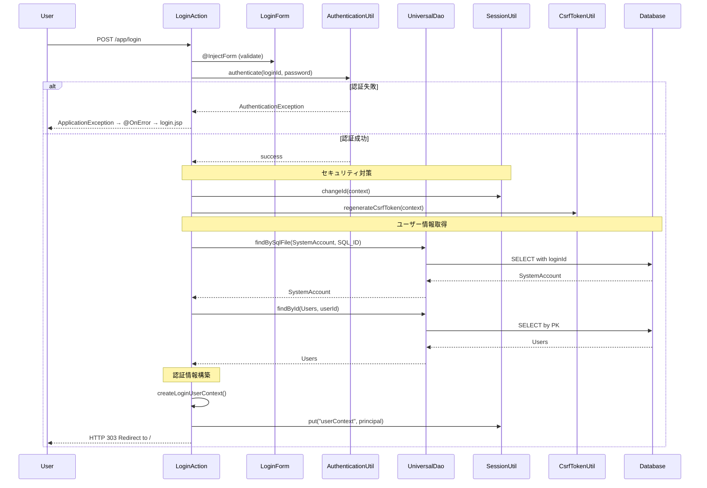

# Code Analysis: LoginAction

**Generated**: 2026-03-02 16:40:29
**Target**: ログイン認証処理
**Modules**: proman-web
**Analysis Duration**: 約3分13秒

---

## Overview

LoginActionは、Webアプリケーションにおける認証機能を提供するActionクラスです。ログイン画面の表示、ユーザー認証、セッション管理、ログアウト処理を担当します。

主な責務:
- ログイン画面の表示（index method）
- ユーザー認証とセッション確立（login method）
- ログアウトとセッション破棄（logout method）

Nablarchフレームワークの認証・セッション管理機能を活用し、セキュアな認証フローを実現しています。

---

## Architecture

### Dependency Graph



**Note**: This diagram uses Mermaid `classDiagram` syntax to show class names and their relationships. Use `--|>` for inheritance (extends/implements) and `..>` for dependencies (uses/creates).

### Component Summary

| Component | Role | Type | Dependencies |
|-----------|------|------|--------------|
| LoginAction | 認証アクション | Action | LoginForm, AuthenticationUtil, UniversalDao, SessionUtil, CsrfTokenUtil, ExecutionContext |
| LoginForm | ログイン入力フォーム | Form | Bean Validation annotations |
| AuthenticationUtil | 認証ユーティリティ | Utility | Project-specific |
| UniversalDao | データベースアクセス | Nablarch | Database |
| SessionUtil | セッション管理 | Nablarch | ExecutionContext |
| CsrfTokenUtil | CSRFトークン管理 | Nablarch | ExecutionContext |
| SystemAccount | システムアカウント | Entity | Database table |
| Users | ユーザー情報 | Entity | Database table |

---

## Flow

### Processing Flow

1. **ログイン画面表示** (index method)
   - HTTPリクエストを受信
   - ログイン画面JSPを返却

2. **ログイン処理** (login method)
   - @InjectFormでLoginFormをバインド・バリデーション
   - AuthenticationUtil.authenticateでユーザー認証
   - 認証失敗時: ApplicationExceptionをスロー → @OnErrorでログイン画面へ
   - 認証成功時:
     - SessionUtil.changeIdでセッションIDを変更（セッション固定攻撃対策）
     - CsrfTokenUtil.regenerateCsrfTokenでCSRFトークンを再生成
     - createLoginUserContextで認証情報を取得
       - UniversalDao.findBySqlFileでSystemAccountを検索
       - UniversalDao.findByIdでUsersを検索
     - SessionUtil.putで認証情報をセッションに格納
     - トップ画面へリダイレクト（303ステータス）

3. **ログアウト処理** (logout method)
   - SessionUtil.invalidateでセッションを破棄
   - ログイン画面へリダイレクト（303ステータス）

### Sequence Diagram



---

## Components

### LoginAction

**File**: [LoginAction.java](../../../../../../../../.lw/nab-official/v6/nablarch-system-development-guide/Sample_Project/Source_Code/proman-project/proman-web/src/main/java/com/nablarch/example/proman/web/login/LoginAction.java)

**Role**: 認証アクション。ログイン/ログアウト機能を提供。

**Key Methods**:
- `index(HttpRequest, ExecutionContext)` [:38-40] - ログイン画面表示
- `login(HttpRequest, ExecutionContext)` [:51-71] - ログイン処理（認証・セッション確立）
- `createLoginUserContext(String)` [:79-93] - 認証情報取得（private）
- `logout(HttpRequest, ExecutionContext)` [:102-106] - ログアウト処理

**Dependencies**:
- LoginForm - 入力フォーム
- AuthenticationUtil - 認証処理
- UniversalDao - データベースアクセス
- SessionUtil - セッション管理
- CsrfTokenUtil - CSRFトークン管理
- ExecutionContext - リクエストコンテキスト

**Key Implementation Points**:
- `@InjectForm` でフォームバインド・バリデーション自動化
- `@OnError` でバリデーションエラー時の画面遷移を定義
- セッション固定攻撃対策として `SessionUtil.changeId()` を実行
- CSRFトークン再生成で新規セッションのトークンを発行
- リダイレクトに303ステータスを使用（PRG pattern）

### LoginForm

**File**: [LoginForm.java](../../../../../../../../.lw/nab-official/v6/nablarch-system-development-guide/Sample_Project/Source_Code/proman-project/proman-web/src/main/java/com/nablarch/example/proman/web/login/LoginForm.java)

**Role**: ログイン画面の入力フォーム。Bean Validationでバリデーション定義。

**Key Fields**:
- `loginId` [:21-23] - ログインID（@Required, @Domain）
- `userPassword` [:26-28] - パスワード（@Required, @Domain）

**Dependencies**: Serializable interface

**Key Implementation Points**:
- `@Required` で必須入力制約
- `@Domain` でドメインバリデーション定義参照
- Serializable実装でセッション保存可能

### AuthenticationUtil

**Role**: 認証ユーティリティ（プロジェクト固有）。ユーザー名・パスワード認証を実行。

**Usage in LoginAction**: `AuthenticationUtil.authenticate(loginId, password)` で認証実行。認証失敗時は `AuthenticationException` をスロー。

### SystemAccount / Users

**Role**: Entityクラス（データベーステーブルにマッピング）

**Usage in LoginAction**:
- SystemAccount: `UniversalDao.findBySqlFile()` でログインIDから検索
- Users: `UniversalDao.findById()` で主キー検索

---

## Nablarch Framework Usage

### UniversalDao (nablarch.common.dao.UniversalDao)

Jakarta Persistenceアノテーションを使った簡易O/Rマッパー。SQLを書かずに単純なCRUDを実行し、検索結果をBeanにマッピング。

**Usage in LoginAction**:

```java
// SQLファイルを使用した検索（認証用）
SystemAccount account = UniversalDao.findBySqlFile(
    SystemAccount.class,
    "FIND_SYSTEM_ACCOUNT_BY_AK",
    new Object[]{loginId}
);

// 主キーによる検索
Users users = UniversalDao.findById(Users.class, account.getUserId());
```

**Important Points**:
- ✅ **単純なCRUD**: SQLファイル検索や主キー検索を簡潔に実装
- ⚠️ **制限事項**: 主キー以外の条件での更新/削除は不可（Databaseを使用）
- 💡 **Bean Mapping**: 検索結果を自動的にEntityクラスにマッピング
- 🎯 **Use Case**: 認証用のユーザー情報取得に最適
- ⚡ **Performance**: findBySqlFileは任意のSQLを実行可能

**Knowledge Base**: [Universal Dao.json](../../../../../../../../.claude/skills/nabledge-6/knowledge/features/libraries/universal-dao.json)

### SessionUtil (nablarch.common.web.session.SessionUtil)

HTTPセッション管理ユーティリティ。セッションへのデータ格納・取得・破棄を提供。

**Usage in LoginAction**:

```java
// セッションID変更（セッション固定攻撃対策）
SessionUtil.changeId(context);

// セッションへのデータ格納
SessionUtil.put(context, "userContext", userContext);

// セッション破棄
SessionUtil.invalidate(context);
```

**Important Points**:
- ✅ **セッション固定攻撃対策**: changeId()で認証後にセッションIDを変更
- ⚠️ **タイミング**: 認証成功後、ユーザー情報格納前にセッションID変更
- 💡 **セキュリティ**: セッション管理のベストプラクティスを実装
- 🎯 **Use Case**: ログイン認証時の必須セキュリティ対策

### CsrfTokenUtil (nablarch.common.web.csrf.CsrfTokenUtil)

CSRFトークン管理ユーティリティ。CSRF攻撃対策のトークン生成・検証を提供。

**Usage in LoginAction**:

```java
// CSRFトークン再生成（新規セッション用）
CsrfTokenUtil.regenerateCsrfToken(context);
```

**Important Points**:
- ✅ **CSRF対策**: トークンベースのCSRF攻撃防御
- ⚠️ **再生成タイミング**: セッションID変更後に新しいトークンを発行
- 💡 **セキュリティ**: 認証後の新規セッションには新しいトークンが必要
- 🎯 **Use Case**: ログイン後の画面遷移でCSRF保護を継続

### @InjectForm Interceptor

フォームバインド・バリデーションインターセプタ。リクエストパラメータをFormオブジェクトにバインドし、Bean Validationを実行。

**Usage in LoginAction**:

```java
@InjectForm(form = LoginForm.class)
public HttpResponse login(HttpRequest request, ExecutionContext context) {
    LoginForm form = context.getRequestScopedVar("form");
    // form is already validated
}
```

**Important Points**:
- ✅ **自動バインド**: リクエストパラメータを自動的にFormオブジェクトに変換
- ✅ **自動バリデーション**: Bean Validationアノテーションに基づいて自動検証
- ⚠️ **エラーハンドリング**: バリデーションエラー時は@OnErrorで指定した画面へ遷移
- 💡 **コード簡潔化**: 手動バインド・バリデーションコードが不要
- 🎯 **Use Case**: フォーム入力が必要な全てのActionメソッド

### @OnError Interceptor

エラー処理インターセプタ。指定した例外発生時の遷移先を定義。

**Usage in LoginAction**:

```java
@OnError(type = ApplicationException.class, path = "/WEB-INF/view/login/login.jsp")
public HttpResponse login(HttpRequest request, ExecutionContext context) {
    // ApplicationException発生時は login.jsp へ遷移
}
```

**Important Points**:
- ✅ **宣言的エラー処理**: アノテーションでエラー時の画面遷移を定義
- ⚠️ **例外タイプ**: typeで捕捉する例外クラスを指定
- 💡 **バリデーションエラー**: @InjectFormと組み合わせてバリデーションエラー画面を表示
- 🎯 **Use Case**: 入力エラー・業務エラーの画面遷移制御

**Security Considerations**:
- セッション固定攻撃対策（SessionUtil.changeId）
- CSRFトークン再生成（CsrfTokenUtil.regenerateCsrfToken）
- 303リダイレクトでPRGパターン実装
- 認証エラー時の適切なエラーメッセージ表示

**Knowledge Base**: [Security.json](../../../../../../../../.claude/skills/nabledge-6/knowledge/checks/security.json)

---

## References

### Source Files

- [LoginAction.java](../../../../../../../../.lw/nab-official/v6/nablarch-system-development-guide/Sample_Project/Source_Code/proman-project/proman-web/src/main/java/com/nablarch/example/proman/web/login/LoginAction.java) - LoginAction
- [LoginForm.java](../../../../../../../../.lw/nab-official/v6/nablarch-system-development-guide/Sample_Project/Source_Code/proman-project/proman-web/src/main/java/com/nablarch/example/proman/web/login/LoginForm.java) - LoginForm

### Knowledge Base (Nabledge-6)

- [Universal Dao.json](../../../../../../../../.claude/skills/nabledge-6/knowledge/features/libraries/universal-dao.json)
- [Security.json](../../../../../../../../.claude/skills/nabledge-6/knowledge/checks/security.json)

### Official Documentation

- [Doc](https://nablarch.github.io/docs/6u3/doc/)

---

**Note**: This documentation was generated by the code-analysis workflow of the nabledge-6 skill.
