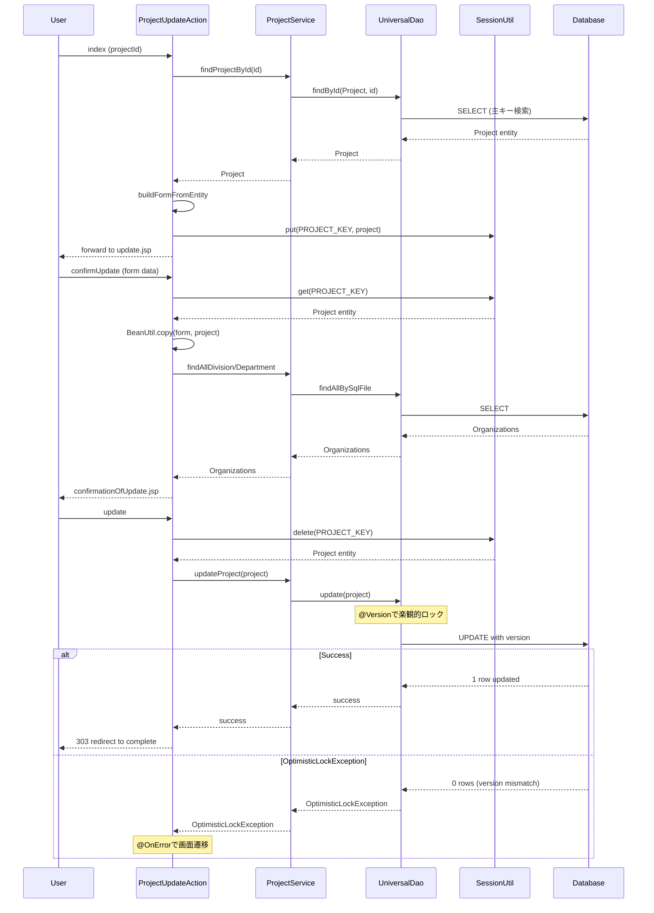

# Code Analysis: ProjectUpdateAction

**Generated**: 2026-03-02 16:41:23
**Target**: プロジェクト更新機能（画面表示、確認、更新処理）
**Modules**: proman-web, proman-common
**Analysis Duration**: 約2分49秒

---

## Overview

ProjectUpdateActionは、Promanアプリケーションでプロジェクト情報を更新するWebアクション。ユーザーがプロジェクトの詳細情報を更新する際の画面表示、入力確認、データベース更新を担当する。

**主要機能**:
- プロジェクト更新画面の表示（既存データを取得してフォームに設定）
- 更新内容の確認画面表示
- データベースへの更新処理（楽観的ロック対応）
- 二重サブミット防止
- エラーハンドリング

---

## Architecture

### Dependency Graph

```mermaid
classDiagram
    class ProjectUpdateAction {
        <<Action>>
    }
    class ProjectUpdateForm {
        <<Form>>
    }
    class ProjectService {
        <<Service>>
    }
    class Project {
        <<Entity>>
    }
    class Organization {
        <<Entity>>
    }
    class UniversalDao {
        <<Nablarch>>
    }
    class SessionUtil {
        <<Nablarch>>
    }
    class BeanUtil {
        <<Nablarch>>
    }
    class DateUtil {
        <<Nablarch>>
    }
    class ExecutionContext {
        <<Nablarch>>
    }

    ProjectUpdateAction ..> ProjectUpdateForm : uses
    ProjectUpdateAction ..> ProjectService : creates
    ProjectUpdateAction ..> Project : manipulates
    ProjectUpdateAction ..> SessionUtil : uses
    ProjectUpdateAction ..> BeanUtil : uses
    ProjectUpdateAction ..> DateUtil : uses
    ProjectUpdateAction ..> ExecutionContext : uses
    ProjectService ..> UniversalDao : uses
    ProjectService ..> Project : queries
    ProjectService ..> Organization : queries
```



### Component Summary

| Component | Role | Type | Dependencies |
|-----------|------|------|--------------|
| ProjectUpdateAction | プロジェクト更新処理 | Action | ProjectUpdateForm, ProjectService, SessionUtil, BeanUtil |
| ProjectUpdateForm | プロジェクト更新フォーム | Form | Bean Validation, @Domain |
| ProjectService | プロジェクト業務ロジック | Service | UniversalDao, Project, Organization |
| Project | プロジェクトエンティティ | Entity | JPA annotations, @Version |
| Organization | 組織エンティティ | Entity | JPA annotations |

---

## Flow

### Processing Flow

**1. プロジェクト更新画面表示** (`index`メソッド):
- プロジェクトIDを受け取る
- ProjectServiceでプロジェクトをDBから取得（`findProjectById`）
- エンティティからフォームを構築（`buildFormFromEntity`）
- プロジェクトエンティティをセッションに保存（楽観的ロック用）
- 更新画面にフォワード

**2. 更新内容確認** (`confirmUpdate`メソッド):
- フォーム入力値をバリデーション（`@InjectForm`）
- バリデーションエラー時は更新画面に戻る（`@OnError`）
- セッションからプロジェクトエンティティを取得
- フォーム値をエンティティにコピー（`BeanUtil.copy`）
- 事業部/部門情報をDBから取得して設定
- 確認画面を表示

**3. 更新処理** (`update`メソッド):
- セッションからプロジェクトエンティティを削除（`SessionUtil.delete`）
- ProjectServiceで更新処理実行（`updateProject`）
  - 内部でUniversalDao.update実行
  - @Versionアノテーションにより楽観的ロック自動実行
  - バージョン不一致時はOptimisticLockException発生
- 二重サブミット防止（`@OnDoubleSubmission`）
- 完了画面にリダイレクト（303 See Other）

**4. 完了画面表示** (`completeUpdate`メソッド):
- 更新完了画面を表示

### Sequence Diagram



---

## Components

### 1. ProjectUpdateAction

**File**: `proman-web/src/main/java/com/nablarch/example/proman/web/project/ProjectUpdateAction.java`

**Role**: プロジェクト更新処理を担当するWebアクション

**Key Methods**:

1. **index** (L35-43): プロジェクト更新画面初期表示
   - `@InjectForm(form = ProjectUpdateInitialForm.class)`: プロジェクトIDを受け取る
   - ProjectServiceでプロジェクトを取得
   - エンティティからフォームを構築
   - セッションに保存（楽観的ロック用のバージョン保持）

2. **confirmUpdate** (L52-62): 更新内容確認画面表示
   - `@InjectForm(form = ProjectUpdateForm.class, prefix = "form")`: フォーム入力値を受け取る
   - `@OnError(type = ApplicationException.class, path = "forward:///app/project/moveUpdate")`: バリデーションエラー時の遷移先
   - セッションからエンティティ取得
   - BeanUtil.copyでフォーム値をエンティティにコピー

3. **update** (L72-77): 更新処理実行
   - `@OnDoubleSubmission`: 二重サブミット防止
   - SessionUtil.deleteでセッションからエンティティを削除（取得と削除を同時実行）
   - ProjectService.updateProjectで更新
   - 303リダイレクトで完了画面へ

4. **buildFormFromEntity** (L111-125): エンティティからフォームを構築
   - BeanUtil.createAndCopy: エンティティからフォームを生成
   - DateUtil.formatDate: 日付を画面表示形式に変換
   - 事業部/部門IDを設定

**Dependencies**:
- ProjectUpdateForm, ProjectUpdateInitialForm
- ProjectService
- Project, Organization (entities)
- SessionUtil, BeanUtil, DateUtil (Nablarch utilities)
- ExecutionContext, HttpRequest, HttpResponse (Nablarch framework)

### 2. ProjectUpdateForm

**File**: `proman-web/src/main/java/com/nablarch/example/proman/web/project/ProjectUpdateForm.java`

**Role**: プロジェクト更新フォーム（入力値とバリデーション）

**Key Features**:
- Bean Validation annotations: `@Required`, `@Domain`
- カスタムバリデーション: `@AssertTrue` for date relation check
- プロジェクト期間の妥当性チェック（`isValidProjectPeriod`メソッド）

**Properties**:
- projectName, projectType, projectClass
- projectStartDate, projectEndDate
- divisionId, organizationId, clientId
- pmKanjiName, plKanjiName
- note, salesAmount

**Custom Validation** (L328-331):
```java
@AssertTrue(message = "{com.nablarch.example.app.entity.core.validation.validator.DateRelationUtil.message}")
public boolean isValidProjectPeriod() {
    return DateRelationUtil.isValid(projectStartDate, projectEndDate);
}
```

### 3. ProjectService

**File**: `proman-web/src/main/java/com/nablarch/example/proman/web/project/ProjectService.java`

**Role**: プロジェクト関連の業務ロジック

**Key Methods**:

1. **findProjectById** (L124-126): プロジェクトを主キーで取得
   ```java
   public Project findProjectById(Integer projectId) {
       return universalDao.findById(Project.class, projectId);
   }
   ```

2. **updateProject** (L89-91): プロジェクトを更新
   ```java
   public void updateProject(Project project) {
       universalDao.update(project);
   }
   ```

3. **findOrganizationById** (L70-73): 組織を主キーで取得
4. **findAllDivision** (L50-52): 全事業部を取得（SQLファイル使用）
5. **findAllDepartment** (L59-61): 全部門を取得（SQLファイル使用）

**Dependencies**:
- DaoContext (UniversalDao implementation)
- DaoFactory (DAO生成)
- Project, Organization entities

### 4. Project (Entity)

**Role**: プロジェクトテーブルのエンティティクラス

**Key Features**:
- Jakarta Persistence annotations: `@Entity`, `@Table`, `@Id`, `@Column`
- **@Version**: 楽観的ロック用バージョンカラム（重要）
- 主キー: projectId
- バージョンカラム: version

**Optimistic Locking**:
- `@Version`アノテーションにより、update時に自動で楽観的ロックが実行される
- バージョン不一致時にOptimisticLockExceptionが発生
- バージョンは更新時に自動インクリメント

---

## Nablarch Framework Usage

### UniversalDao (DaoContext)

**クラス**: `nablarch.common.dao.DaoContext`

**説明**: データベースCRUD操作を提供するO/Rマッパー。Jakarta Persistenceアノテーションに基づいてSQL文を自動生成

**使用方法**:
```java
// 主キーで1件取得
Project project = universalDao.findById(Project.class, projectId);

// 1件更新（楽観的ロック自動実行）
int count = universalDao.update(project);

// SQLファイルで検索
List<Organization> orgs = universalDao.findAllBySqlFile(Organization.class, "FIND_ALL_DIVISION");
```

**重要ポイント**:
- ✅ **findByIdで主キー検索**: 単純な主キー検索に最適。SQLファイル不要
- ✅ **updateで楽観的ロック自動実行**: @Versionアノテーション付きエンティティは自動で楽観ロック
- ⚠️ **OptimisticLockException処理**: バージョン不一致時の例外を@OnErrorでキャッチすべき
- ⚠️ **batchUpdateは楽観ロック非対応**: 一括更新では楽観的ロックが動作しない
- 💡 **SQLファイルで複雑な検索**: JOINや複雑な条件はSQLファイルを使用
- 🎯 **更新前に必ず取得**: updateする前にfindByIdで最新データを取得することで、楽観ロックが機能

**このコードでの使い方**:
- `ProjectService.findProjectById`: findById(Project.class, projectId)で主キー検索
- `ProjectService.updateProject`: update(project)で更新（@Versionにより楽観的ロック自動実行）
- `ProjectService.findAllDivision/Department`: findAllBySqlFileでSQLファイル検索

**詳細**: [ユニバーサルDAO知識ベース](../../.claude/skills/nabledge-6/knowledge/features/libraries/universal-dao.json) - sections: crud, optimistic-lock

### BeanUtil

**クラス**: `nablarch.core.beans.BeanUtil`

**説明**: Bean間のプロパティコピー、型変換を提供するユーティリティ

**使用方法**:
```java
// エンティティからフォームを生成してコピー
ProjectUpdateForm form = BeanUtil.createAndCopy(ProjectUpdateForm.class, project);

// フォームからエンティティへコピー
BeanUtil.copy(form, project);
```

**重要ポイント**:
- ✅ **同名プロパティを自動コピー**: プロパティ名が一致すれば自動でコピー
- ✅ **型変換サポート**: String ⇔ Integer等の基本的な型変換を自動実行
- ⚠️ **複雑な変換は手動対応**: Date型のフォーマット変換等は別途DateUtil使用
- 💡 **DTOとエンティティ間の変換に最適**: レイヤー間のデータ受け渡しに便利

**このコードでの使い方**:
- `buildFormFromEntity`: BeanUtil.createAndCopyでエンティティからフォームを生成
- `confirmUpdate`: BeanUtil.copy(form, project)でフォーム値をエンティティにコピー
- 日付フィールドは別途DateUtil.formatDateで変換（BeanUtilは文字列⇔Date変換非対応）

### SessionUtil

**クラス**: `nablarch.common.web.session.SessionUtil`

**説明**: HTTPセッションへのデータ保存・取得を提供

**使用方法**:
```java
// セッションに保存
SessionUtil.put(context, "projectUpdateActionProject", project);

// セッションから取得
Project project = SessionUtil.get(context, "projectUpdateActionProject");

// セッションから削除（取得と削除を同時実行）
Project project = SessionUtil.delete(context, "projectUpdateActionProject");
```

**重要ポイント**:
- ✅ **楽観的ロック用のバージョン保持**: 更新前にセッションに保存しておくことで、バージョン番号を保持
- ✅ **画面遷移間のデータ保持**: 確認画面→更新処理でデータを保持
- ⚠️ **セッションタイムアウト対策**: 長時間操作なしの場合、セッション切れに注意
- 💡 **deleteで取得と削除を同時実行**: 更新処理完了後はセッションをクリーンアップ

**このコードでの使い方**:
- `index`: SessionUtil.put(context, PROJECT_KEY, project)でプロジェクトをセッションに保存
- `confirmUpdate`: SessionUtil.get(context, PROJECT_KEY)でセッションからプロジェクトを取得
- `update`: SessionUtil.delete(context, PROJECT_KEY)でセッションから削除（同時に取得）

### @InjectForm

**説明**: リクエストパラメータを自動的にFormオブジェクトにバインドし、バリデーションを実行するインターセプタ

**使用方法**:
```java
@InjectForm(form = ProjectUpdateForm.class, prefix = "form")
public HttpResponse confirmUpdate(HttpRequest request, ExecutionContext context) {
    ProjectUpdateForm form = context.getRequestScopedVar("form");
    // ...
}
```

**重要ポイント**:
- ✅ **自動バインド＋バリデーション**: リクエストパラメータをFormにバインドし、Bean Validationを自動実行
- ✅ **バリデーションエラー時**: ApplicationExceptionをスローし、@OnErrorで処理
- 💡 **prefixでパラメータ名をマッピング**: "form.projectName"のようなパラメータ名に対応

**このコードでの使い方**:
- `index`: @InjectForm(form = ProjectUpdateInitialForm.class)でプロジェクトIDを受け取る
- `confirmUpdate`: @InjectForm(form = ProjectUpdateForm.class, prefix = "form")で更新フォームを受け取る

### @OnError

**説明**: 例外発生時の画面遷移を制御するインターセプタ

**使用方法**:
```java
@OnError(type = ApplicationException.class, path = "forward:///app/project/moveUpdate")
public HttpResponse confirmUpdate(HttpRequest request, ExecutionContext context) {
    // バリデーションエラー時は上記pathに遷移
}
```

**重要ポイント**:
- ✅ **バリデーションエラーハンドリング**: ApplicationExceptionをキャッチして画面遷移
- ✅ **OptimisticLockExceptionも対応可**: 楽観ロックエラー時の遷移先を指定可能
- 💡 **forwardで入力画面に戻る**: エラーメッセージとともに入力画面を再表示

**このコードでの使い方**:
- `confirmUpdate`: @OnError(type = ApplicationException.class, path = "forward:///app/project/moveUpdate")でバリデーションエラー時に更新画面に戻る

### @OnDoubleSubmission

**説明**: 二重サブミット（フォームの二重送信）を防止するインターセプタ

**使用方法**:
```java
@OnDoubleSubmission
public HttpResponse update(HttpRequest request, ExecutionContext context) {
    // 二重サブミット時はエラー画面へ
}
```

**重要ポイント**:
- ✅ **トークンチェック**: 画面から送信されたトークンを検証
- ✅ **更新処理の二重実行防止**: F5キーやブラウザバック→再送信を防止
- 💡 **@UseTokenと組み合わせ**: 画面表示時に@UseTokenでトークン生成、更新時に@OnDoubleSubmissionで検証

**このコードでの使い方**:
- `update`: @OnDoubleSubmissionで二重サブミット防止（更新処理の二重実行を防ぐ）

### DateUtil

**クラス**: `nablarch.core.util.DateUtil`

**説明**: 日付のフォーマット変換を提供

**使用方法**:
```java
String formatted = DateUtil.formatDate(dateObject, "yyyy/MM/dd");
```

**重要ポイント**:
- ✅ **日付⇔文字列変換**: Date型を指定フォーマットの文字列に変換
- 💡 **画面表示用フォーマット**: "yyyy/MM/dd"形式で画面に表示

**このコードでの使い方**:
- `buildFormFromEntity`: DateUtil.formatDateで日付を"yyyy/MM/dd"形式に変換してフォームに設定

---

## References

### Source Files

- [ProjectUpdateAction.java](../../../.lw/nab-official/v6/nablarch-system-development-guide/Sample_Project/Source_Code/proman-project/proman-web/src/main/java/com/nablarch/example/proman/web/project/ProjectUpdateAction.java) (L1-161)
- [ProjectUpdateForm.java](../../../.lw/nab-official/v6/nablarch-system-development-guide/Sample_Project/Source_Code/proman-project/proman-web/src/main/java/com/nablarch/example/proman/web/project/ProjectUpdateForm.java) (L1-333)
- [ProjectService.java](../../../.lw/nab-official/v6/nablarch-system-development-guide/Sample_Project/Source_Code/proman-project/proman-web/src/main/java/com/nablarch/example/proman/web/project/ProjectService.java) (L1-128)

### Knowledge Base (Nabledge-6)

- [ユニバーサルDAO](../../.claude/skills/nabledge-6/knowledge/features/libraries/universal-dao.json) - CRUD operations, optimistic locking
- [データバインド](../../.claude/skills/nabledge-6/knowledge/features/libraries/data-bind.json) - BeanUtil usage patterns
- [業務日付](../../.claude/skills/nabledge-6/knowledge/features/libraries/business-date.json) - DateUtil usage

### Official Documentation

- [Nablarch Application Framework - ユニバーサルDAO](https://nablarch.github.io/docs/LATEST/doc/application_framework/application_framework/libraries/database/universal_dao.html)
- [Nablarch Application Framework - データバインド](https://nablarch.github.io/docs/LATEST/doc/application_framework/application_framework/libraries/data_io/data_bind.html)
- [Nablarch Application Framework - セッションストア](https://nablarch.github.io/docs/LATEST/doc/application_framework/application_framework/libraries/session_store.html)

---

**Note**: This documentation was generated by the code-analysis workflow of the nabledge-6 skill.
