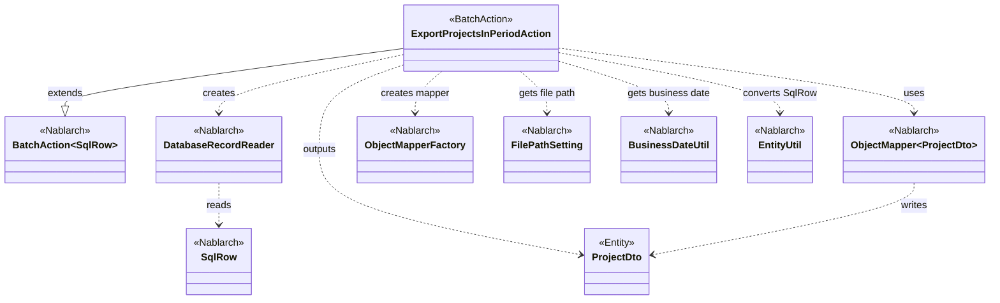
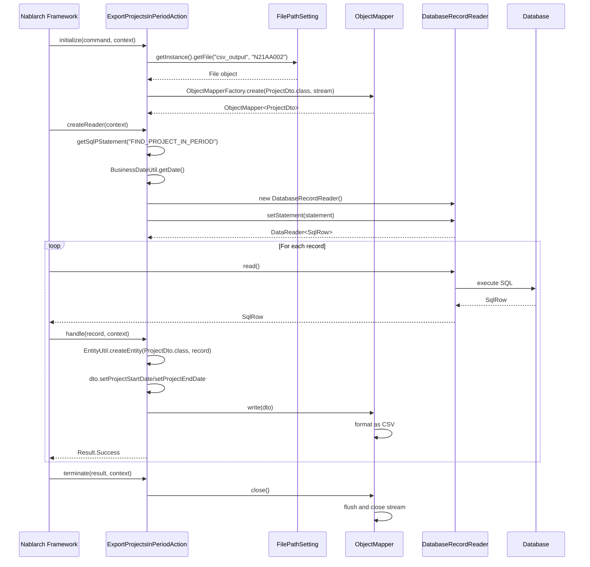

# Code Analysis: ExportProjectsInPeriodAction

**Generated**: 2026-03-02 16:12:40
**Target**: 期間内プロジェクト一覧出力の都度起動バッチアクション
**Modules**: proman-batch
**Analysis Duration**: 約2分36秒

---

## Overview

`ExportProjectsInPeriodAction`は、期間内のプロジェクト情報をデータベースから抽出しCSVファイルに出力する都度起動型のバッチアクションです。Nablarchバッチフレームワークの`BatchAction<SqlRow>`を継承し、データベースからの読み込み、データ変換、ファイル出力の一連の処理を実装しています。

主な処理フロー:
1. **初期化** (`initialize`): CSVファイルの出力先を設定し、ObjectMapperを生成
2. **データ読み込み** (`createReader`): DatabaseRecordReaderを使用してSQLクエリ結果を順次読み込み
3. **1件処理** (`handle`): 読み込んだSqlRowをProjectDtoに変換し、CSV形式で出力
4. **終了処理** (`terminate`): ObjectMapperをクローズしてリソースを解放

---

## Architecture

### Dependency Graph



**Note**: This diagram uses Mermaid `classDiagram` syntax to show class names and their relationships. Use `--|>` for inheritance (extends/implements) and `..>` for dependencies (uses/creates).

### Component Summary

| Component | Role | Type | Dependencies |
|-----------|------|------|--------------|
| ExportProjectsInPeriodAction | バッチアクション（期間内プロジェクト出力） | Action | BatchAction, DatabaseRecordReader, ObjectMapper, FilePathSetting, BusinessDateUtil |
| ProjectDto | CSV出力用データ転送オブジェクト | Entity | - |
| FIND_PROJECT_IN_PERIOD.sql | プロジェクト抽出SQLクエリ | SQL | - |

---

## Flow

### Processing Flow

1. **バッチ起動**: コマンドラインからリクエストパスを指定して起動
2. **初期化フェーズ** (`initialize`メソッド):
   - `FilePathSetting.getInstance()`で論理名"csv_output"から出力先ディレクトリを取得
   - ファイル名"N21AA002"でFileOutputStreamを作成
   - `ObjectMapperFactory.create()`でProjectDto用のObjectMapperを生成
3. **データ読み込みフェーズ** (`createReader`メソッド):
   - `DatabaseRecordReader`を生成
   - SQL文"FIND_PROJECT_IN_PERIOD"を読み込み、業務日付をパラメータ設定
   - `BusinessDateUtil.getDate()`で業務日付を取得し、WHERE条件に設定
4. **1件処理フェーズ** (`handle`メソッド、レコード毎にループ実行):
   - `EntityUtil.createEntity()`でSqlRowをProjectDtoに変換
   - 日付型フィールド(PROJECT_START_DATE, PROJECT_END_DATE)を個別設定
   - `mapper.write()`でCSVレコードを出力
   - 処理成功を示す`Result.Success`を返却
5. **終了フェーズ** (`terminate`メソッド):
   - `mapper.close()`でObjectMapperをクローズし、出力ストリームを確実に閉じる

### Sequence Diagram



---

## Components

### ExportProjectsInPeriodAction

**Role**: 期間内プロジェクト一覧をCSVファイルに出力するバッチアクション

**Key Methods**:
- `initialize(CommandLine, ExecutionContext)` [:44-54] - 出力ファイルとObjectMapperの初期化
- `createReader(ExecutionContext)` [:57-65] - DatabaseRecordReaderの生成とSQL設定
- `handle(SqlRow, ExecutionContext)` [:68-75] - 1件ごとのデータ変換とCSV出力
- `terminate(Result, ExecutionContext)` [:78-80] - ObjectMapperのクローズ処理

**Dependencies**:
- `ObjectMapper<ProjectDto>` - CSV出力用マッパー（フィールド変数として保持）
- `FilePathSetting` - ファイルパス管理（論理名からファイルパス解決）
- `ObjectMapperFactory` - ObjectMapper生成ファクトリ
- `DatabaseRecordReader` - データベースからのレコード読み込み
- `BusinessDateUtil` - 業務日付取得
- `EntityUtil` - SqlRowからEntityへの変換

**File**: [ExportProjectsInPeriodAction.java](.lw/nab-official/v6/nablarch-system-development-guide/Sample_Project/Source_Code/proman-project/proman-batch/src/main/java/com/nablarch/example/proman/batch/project/ExportProjectsInPeriodAction.java)

### ProjectDto

**Role**: CSV出力用のデータ転送オブジェクト

**Dependencies**: なし（純粋なデータクラス）

**File**: [ProjectDto.java](.lw/nab-official/v6/nablarch-system-development-guide/Sample_Project/Source_Code/proman-project/proman-batch/src/main/java/com/nablarch/example/proman/batch/project/ProjectDto.java)

### FIND_PROJECT_IN_PERIOD.sql

**Role**: 期間内プロジェクトを抽出するSQLクエリ

**SQL Parameters**:
- `?1` - 業務日付（プロジェクト開始日の判定に使用）
- `?2` - 業務日付（プロジェクト終了日の判定に使用）

**File**: [ExportProjectsInPeriodAction.sql](.lw/nab-official/v6/nablarch-system-development-guide/Sample_Project/Source_Code/proman-project/proman-batch/src/main/resources/com/nablarch/example/proman/batch/project/ExportProjectsInPeriodAction.sql)

---

## Nablarch Framework Usage

### BatchAction<SqlRow>

**Description**: Nablarchバッチの基底クラス。データ読み込み（createReader）、1件処理（handle）、初期化/終了処理のライフサイクルを提供します。

**Code Example**:
```java
public class ExportProjectsInPeriodAction extends BatchAction<SqlRow> {
    @Override
    protected void initialize(CommandLine command, ExecutionContext context) {
        // バッチ起動時の初期化処理
    }

    @Override
    public DataReader<SqlRow> createReader(ExecutionContext context) {
        // データ読み込み準備
        return new DatabaseRecordReader();
    }

    @Override
    public Result handle(SqlRow record, ExecutionContext context) {
        // 1件ごとの処理
        return new Success();
    }

    @Override
    protected void terminate(Result result, ExecutionContext context) {
        // バッチ終了時のクリーンアップ処理
    }
}
```

**Important Points**:
- ✅ **Must override**: `createReader`と`handle`メソッドは必須実装
- ✅ **Lifecycle methods**: `initialize`と`terminate`はオプションだがリソース管理に有用
- 💡 **Generic type**: ジェネリック型で読み込みデータ型を指定（SqlRow, Entity等）
- 🎯 **When to use**: データベースやファイルからデータを読み込み、1件ずつ処理する都度起動バッチ

**Usage in this code**:
- `ExportProjectsInPeriodAction`が`BatchAction<SqlRow>`を継承
- `initialize`でObjectMapper初期化
- `createReader`でDatabaseRecordReader生成
- `handle`で1レコードをCSV出力
- `terminate`でリソース解放

**Knowledge Base**: [Nablarchバッチ（都度起動型・常駐型）](.claude/skills/nabledge-6/knowledge/features/processing/nablarch-batch.json) - sections: overview, architecture, actions

### DatabaseRecordReader

**Description**: データベースからSQLクエリ結果を順次読み込むDataReaderの実装。PreparedStatementを設定し、ResultSetから1レコードずつSqlRowとして返します。

**Code Example**:
```java
DatabaseRecordReader reader = new DatabaseRecordReader();
SqlPStatement statement = getSqlPStatement("FIND_PROJECT_IN_PERIOD");
statement.setDate(1, bizDate);
statement.setDate(2, bizDate);
reader.setStatement(statement);
return reader;
```

**Important Points**:
- ✅ **Statement required**: `setStatement()`でSqlPStatementを設定する必要がある
- ⚠️ **Resource management**: StatementやResultSetのクローズはフレームワークが自動で行う
- 💡 **SQL file**: `getSqlPStatement()`でクラス名.sqlファイルからSQL文を読み込む
- 🎯 **When to use**: DB to FILE, DB to DB パターンのバッチでデータソースとして使用
- ⚡ **Performance**: コミット間隔はLoopHandlerで制御（デフォルト1000件）

**Usage in this code**:
- `createReader`メソッドで生成
- `FIND_PROJECT_IN_PERIOD`というSQL IDで検索クエリを読み込み
- 業務日付を2箇所にバインド（開始日・終了日の判定用）
- フレームワークが自動的にレコードを順次読み込み、handleメソッドに渡す

**Knowledge Base**: [Nablarchバッチ（都度起動型・常駐型）](.claude/skills/nabledge-6/knowledge/features/processing/nablarch-batch.json) - sections: data-readers, patterns-db-to-file

### ObjectMapper / ObjectMapperFactory

**Description**: Java BeansやMapとファイル（CSV、固定長等）の相互変換を行うデータバインド機能。ObjectMapperFactoryで生成したObjectMapperを使用してファイル読み書きを実行します。

**Code Example**:
```java
// ObjectMapper生成
File output = filePathSetting.getFile("csv_output", OUTPUT_FILE_NAME);
FileOutputStream outputStream = new FileOutputStream(output);
ObjectMapper<ProjectDto> mapper = ObjectMapperFactory.create(ProjectDto.class, outputStream);

// データ書き込み
mapper.write(dto);

// クローズ処理
mapper.close();
```

**Important Points**:
- ✅ **try-with-resources**: `ObjectMapper`は`Closeable`を実装しているため推奨
- ✅ **Format configuration**: ProjectDtoクラスに`@Csv`アノテーションでフォーマット定義
- ⚠️ **Thread safety**: ObjectMapperインスタンスはスレッドセーフではない
- 💡 **Auto-formatting**: アノテーション設定に基づき自動的にCSVフォーマットで出力
- 🎯 **When to use**: CSV、固定長ファイルの読み書きが必要な場合

**Usage in this code**:
- `initialize`でObjectMapperFactory.createによりProjectDto用のマッパーを生成
- `handle`メソッド内で`mapper.write(dto)`を呼び出し、1レコードずつCSV出力
- `terminate`メソッドで`mapper.close()`を実行し、ストリームを確実にクローズ

**Knowledge Base**: [データバインド](.claude/skills/nabledge-6/knowledge/features/libraries/data-bind.json) - sections: overview, usage, csv_format_beans

### FilePathSetting

**Description**: ファイルパスを論理名で管理する機能。環境ごとに異なる物理パスを論理名で抽象化し、設定ファイル（file-path.xml等）で物理パスを解決します。

**Code Example**:
```java
FilePathSetting filePathSetting = FilePathSetting.getInstance();
File output = filePathSetting.getFile("csv_output", "N21AA002");
```

**Important Points**:
- ✅ **Logical names**: "csv_output"のような論理名で設定管理
- ✅ **Environment portability**: 環境ごとに物理パスを変更可能（開発/本番の切り替えが容易）
- 💡 **Extension handling**: 拡張子を自動付与する設定も可能
- 🎯 **When to use**: ファイル入出力が必要なバッチやアプリケーション
- ⚠️ **Configuration required**: システムリポジトリにbasePathSettingsの設定が必要

**Usage in this code**:
- `initialize`メソッドで`FilePathSetting.getInstance()`を取得
- 論理名"csv_output"とファイル名"N21AA002"からFile objectを取得
- 取得したFileからFileOutputStreamを生成してObjectMapperに渡す

**Knowledge Base**: [ファイルパス管理](.claude/skills/nabledge-6/knowledge/features/libraries/file-path-management.json) - sections: overview, usage

### BusinessDateUtil

**Description**: 業務日付を取得するユーティリティクラス。システム日付とは独立した業務上の日付を管理し、データベースやシステムプロパティから取得します。

**Code Example**:
```java
String bizDate = BusinessDateUtil.getDate();
Date date = new Date(DateUtil.getDate(bizDate).getTime());
statement.setDate(1, date);
```

**Important Points**:
- ✅ **Centralized date management**: 業務日付を一元管理し、アプリケーション全体で統一
- ✅ **Configuration**: BasicBusinessDateProviderで業務日付の取得元（DB、プロパティ等）を設定
- 💡 **Test support**: システムプロパティで上書き可能（テスト時に有用）
- 🎯 **When to use**: 業務日付に基づいた処理（締め日処理、期間検索等）
- ⚠️ **Initialization required**: アプリケーション起動時にBusinessDateProviderの設定が必要

**Usage in this code**:
- `createReader`メソッドで`BusinessDateUtil.getDate()`により業務日付を取得
- 業務日付を`DateUtil.getDate()`で`java.util.Date`に変換
- `java.sql.Date`に変換してSQLのWHERE条件（開始日・終了日判定）にバインド

**Knowledge Base**: [業務日付](.claude/skills/nabledge-6/knowledge/features/libraries/business-date.json) - sections: overview, business_date_usage

---

## References

### Source Files

- [ExportProjectsInPeriodAction.java](.lw/nab-official/v6/nablarch-system-development-guide/Sample_Project/Source_Code/proman-project/proman-batch/src/main/java/com/nablarch/example/proman/batch/project/ExportProjectsInPeriodAction.java) - バッチアクションクラス
- [ProjectDto.java](.lw/nab-official/v6/nablarch-system-development-guide/Sample_Project/Source_Code/proman-project/proman-batch/src/main/java/com/nablarch/example/proman/batch/project/ProjectDto.java) - CSV出力用DTO
- [ExportProjectsInPeriodAction.sql](.lw/nab-official/v6/nablarch-system-development-guide/Sample_Project/Source_Code/proman-project/proman-batch/src/main/resources/com/nablarch/example/proman/batch/project/ExportProjectsInPeriodAction.sql) - プロジェクト抽出SQLクエリ

### Knowledge Base (Nabledge-6)

- [Nablarchバッチ（都度起動型・常駐型）](.claude/skills/nabledge-6/knowledge/features/processing/nablarch-batch.json)
  - Sections: overview, architecture, actions, data-readers, patterns-db-to-file
- [データバインド](.claude/skills/nabledge-6/knowledge/features/libraries/data-bind.json)
  - Sections: overview, usage, csv_format_beans
- [ファイルパス管理](.claude/skills/nabledge-6/knowledge/features/libraries/file-path-management.json)
  - Sections: overview, usage
- [業務日付](.claude/skills/nabledge-6/knowledge/features/libraries/business-date.json)
  - Sections: overview, business_date_usage

### Official Documentation

- [Nablarchバッチ（都度起動型・常駐型）](https://nablarch.github.io/docs/LATEST/doc/application_framework/application_framework/batch/nablarch_batch/index.html)
- [データバインド](https://nablarch.github.io/docs/LATEST/doc/application_framework/application_framework/libraries/data_bind.html)
- [ファイルパス管理](https://nablarch.github.io/docs/LATEST/doc/application_framework/application_framework/libraries/file_path_management.html)
- [業務日付](https://nablarch.github.io/docs/LATEST/doc/application_framework/application_framework/libraries/system_utility.html#business-date)

---

**Note**: This documentation was generated by the code-analysis workflow of the nabledge-6 skill.
