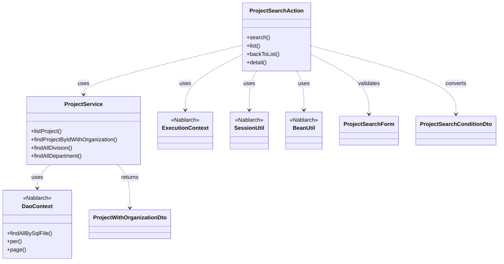
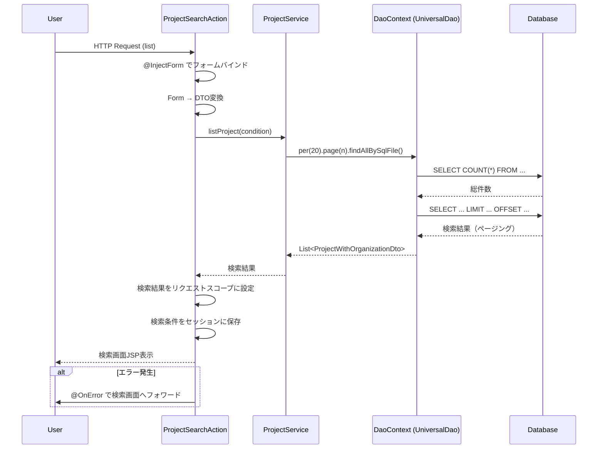

# Code Analysis: ProjectSearchAction

**Generated**: {{DATE_PLACEHOLDER}} {{TIME_PLACEHOLDER}}
**Target**: ProjectSearchAction - プロジェクト検索機能
**Modules**: proman-web
**Analysis Duration**: {{DURATION_PLACEHOLDER}}

---

## Overview

ProjectSearchActionは、プロジェクト検索機能を提供するActionクラスです。検索画面の初期表示、検索結果一覧の表示、詳細画面への遷移、検索画面への戻りを処理します。

**主な機能**:
- プロジェクト検索画面の初期表示
- 検索条件に基づくプロジェクト一覧の取得（ページング対応）
- プロジェクト詳細画面の表示
- 詳細画面から検索画面への戻り（検索条件保持）

**技術的特徴**:
- UniversalDaoのfindAllBySqlFileでページング検索を実行
- セッションストアで検索条件を保持
- @InjectFormアノテーションでフォームデータを自動バインド
- @OnErrorアノテーションでバリデーションエラーを処理

---

## Architecture

### Dependency Graph



**Note**: This diagram uses Mermaid `classDiagram` syntax to show class names and their relationships. Use `--|>` for inheritance (extends/implements) and `..>` for dependencies (uses/creates).

### Component Summary

| Component | Role | Type | Dependencies |
|-----------|------|------|--------------|
| ProjectSearchAction | プロジェクト検索処理 | Action | ProjectService, ExecutionContext, SessionUtil, BeanUtil |
| ProjectService | プロジェクト関連ビジネスロジック | Service | DaoContext, ProjectWithOrganizationDto |
| ProjectSearchForm | 検索フォーム | Form | - |
| ProjectSearchConditionDto | 検索条件DTO | DTO | - |
| ProjectWithOrganizationDto | 検索結果DTO（組織情報含む） | DTO | - |
| DaoContext (UniversalDao) | データベースアクセス | Nablarch Framework | - |
| ExecutionContext | リクエストコンテキスト | Nablarch Framework | - |

---

## Flow

### Processing Flow

1. **検索画面初期表示** (`search`メソッド)
   - セッションから検索条件を削除
   - 事業部・部門マスタをリクエストスコープに設定
   - 検索画面JSPを表示

2. **一覧検索** (`list`メソッド)
   - @InjectFormでフォームデータを自動バインド
   - フォームをDTOに変換
   - ProjectService.listProjectでページング検索を実行
   - 検索結果をリクエストスコープに設定
   - 検索条件をセッションに保存（詳細画面からの戻り用）
   - 検索画面JSPを表示

3. **詳細画面表示** (`detail`メソッド)
   - プロジェクトIDをフォームから取得
   - ProjectService.findProjectByIdWithOrganizationで詳細取得
   - 詳細画面JSPを表示

4. **検索画面に戻る** (`backToList`メソッド)
   - セッションから検索条件を取得
   - 保存された検索条件で再検索
   - フォームに検索条件を復元
   - 検索画面JSPを表示

### Sequence Diagram



---

## Components

### ProjectSearchAction

**Role**: プロジェクト検索機能のエントリポイント

**Key Methods**:
- `search(HttpRequest, ExecutionContext)` [:35-40] - 検索画面初期表示
- `list(HttpRequest, ExecutionContext)` [:49-69] - 一覧検索（ページング対応）
- `backToList(HttpRequest, ExecutionContext)` [:78-91] - 検索画面に戻る
- `detail(HttpRequest, ExecutionContext)` [:101-109] - 詳細画面表示

**Annotations**:
- `@InjectForm` - フォームデータの自動バインド
- `@OnError` - バリデーションエラー時のフォワード先指定

**Dependencies**:
- ProjectService - ビジネスロジック実行
- ExecutionContext - リクエスト情報取得・設定
- SessionUtil - セッション操作
- BeanUtil - Bean変換

**File**: [ProjectSearchAction.java](.lw/nab-official/v6/nablarch-system-development-guide/Sample_Project/Source_Code/proman-project/proman-web/src/main/java/com/nablarch/example/proman/web/project/ProjectSearchAction.java)

### ProjectService

**Role**: プロジェクト関連ビジネスロジック

**Key Methods**:
- `listProject(ProjectSearchConditionDto)` [:99-104] - プロジェクト検索（ページング対応）
- `findProjectByIdWithOrganization(Integer)` [:112-116] - プロジェクト詳細取得
- `findAllDivision()` [:50-52] - 全事業部取得
- `findAllDepartment()` [:59-61] - 全部門取得

**ページング実装** [:99-104]:
```java
public List<ProjectWithOrganizationDto> listProject(ProjectSearchConditionDto condition) {
    return universalDao
            .per(RECORDS_PER_PAGE)  // 20件/ページ
            .page(condition.getPageNumber())
            .findAllBySqlFile(ProjectWithOrganizationDto.class, "FIND_PROJECT_WITH_ORGANIZATION", condition);
}
```

**SQLファイル使用**:
- SQL ID: "FIND_PROJECT_WITH_ORGANIZATION"
- SQLファイルパス: `ProjectWithOrganizationDto.sql` (クラスから導出)

**Dependencies**:
- DaoContext (UniversalDao) - データベースアクセス

**File**: [ProjectService.java](.lw/nab-official/v6/nablarch-system-development-guide/Sample_Project/Source_Code/proman-project/proman-web/src/main/java/com/nablarch/example/proman/web/project/ProjectService.java)

---

## Nablarch Framework Usage

### UniversalDao (DaoContext)

**Class**: `nablarch.common.dao.UniversalDao`

**Description**: Jakarta Persistenceアノテーションを使った簡易的なO/Rマッパー。SQLファイルで検索し、結果をBeanにマッピングする。

**Code Example (ProjectService.java:99-104)**:
```java
return universalDao
        .per(RECORDS_PER_PAGE)
        .page(condition.getPageNumber())
        .findAllBySqlFile(ProjectWithOrganizationDto.class, "FIND_PROJECT_WITH_ORGANIZATION", condition);
```

**Important Points**:
- ✅ **ページング機能**: `per(件数).page(ページ番号)` でメソッドチェーン指定
- ✅ **SQLファイル指定**: SQL IDを指定してSQLファイルから検索SQL取得
- ✅ **Bean自動マッピング**: 検索結果をDTOに自動マッピング
- ⚠️ **件数取得SQL**: ページング時に自動で COUNT(*) SQLが発行される（性能注意）
- 💡 **Paginationオブジェクト**: 検索結果のEntityListから `getPagination()` で総件数等を取得可能
- 🎯 **使用場面**: 単純なCRUD操作とページング検索に最適

**Usage in this code**:
- プロジェクト一覧検索でページング機能を使用
- 1ページあたり20件で検索結果を取得
- SQL IDでビジネスロジック用SQLを参照

**Knowledge Base**: [UniversalDao (ユニバーサルDAO)](../../../.claude/skills/nabledge-6/knowledge/features/libraries/universal-dao.json)

**Relevant Sections**:
- `paging` - ページング機能の詳細（per, pageメソッド、Paginationクラス）
- `sql-file` - SQLファイルの使い方とSQL ID指定方法
- `overview` - UniversalDaoの基本概念と位置付け

### @InjectForm Annotation

**Annotation**: `nablarch.common.web.interceptor.InjectForm`

**Description**: HTTPリクエストパラメータを自動的にフォームオブジェクトにバインドし、バリデーションを実行する。

**Code Example (ProjectSearchAction.java:49-50)**:
```java
@InjectForm(form = ProjectSearchForm.class, prefix = "form")
@OnError(type = ApplicationException.class, path = "forward://search")
public HttpResponse list(HttpRequest request, ExecutionContext context) {
    ProjectSearchForm form = context.getRequestScopedVar("form");
    // ...
}
```

**Important Points**:
- ✅ **自動バインド**: リクエストパラメータをフォームプロパティに自動設定
- ✅ **自動バリデーション**: Bean Validationアノテーションに基づき検証
- ✅ **リクエストスコープ**: バインド後のフォームは `prefix` で指定した名前でリクエストスコープに格納
- ⚠️ **@OnErrorと併用**: バリデーションエラー時の遷移先を@OnErrorで指定必須
- 💡 **prefix指定**: 複数フォーム使用時はprefix で識別

**Usage in this code**:
- `list`メソッドでProjectSearchFormを自動バインド
- `detail`メソッドでProjectDetailInitialFormを自動バインド

**Knowledge Base**: セクション未作成（InjectFormインターセプタ情報は今後追加予定）

### @OnError Annotation

**Annotation**: `nablarch.fw.web.interceptor.OnError`

**Description**: 特定の例外発生時の遷移先を指定する。バリデーションエラー（ApplicationException）処理で使用。

**Code Example (ProjectSearchAction.java:50)**:
```java
@OnError(type = ApplicationException.class, path = "forward://search")
```

**Important Points**:
- ✅ **エラー時遷移**: ApplicationException発生時に指定パスへフォワード
- ✅ **@InjectFormと併用**: バリデーションエラー時の画面遷移に使用
- ⚠️ **forward指定**: `forward://` プレフィックスで内部フォワードを指定

**Usage in this code**:
- `list`メソッド、`backToList`メソッドでバリデーションエラー時に検索画面へフォワード

**Knowledge Base**: セクション未作成（OnErrorインターセプタ情報は今後追加予定）

### SessionUtil

**Class**: `nablarch.common.web.session.SessionUtil`

**Description**: セッションストアへのデータ保存・取得・削除を行うユーティリティ。

**Code Example (ProjectSearchAction.java:66)**:
```java
SessionUtil.put(context, CONDITION_DTO_SESSION_KEY, condition);
```

**Important Points**:
- ✅ **セッション保存**: `put()` でオブジェクトをセッションに保存
- ✅ **セッション取得**: `get()` でセッションからオブジェクトを取得
- ✅ **セッション削除**: `delete()` でセッションから削除
- 💡 **画面遷移間のデータ共有**: 詳細画面から戻る際の検索条件保持に使用

**Usage in this code**:
- 検索条件をセッションに保存（詳細画面からの戻り用）
- 検索画面初期表示時にセッションをクリア

**Knowledge Base**: セクション未作成（セッションストア情報は今後追加予定）

### BeanUtil

**Class**: `nablarch.core.beans.BeanUtil`

**Description**: Beanプロパティのコピーや変換を行うユーティリティ。

**Code Example (ProjectSearchAction.java:58)**:
```java
ProjectSearchConditionDto condition = BeanUtil.createAndCopy(ProjectSearchConditionDto.class, form);
```

**Important Points**:
- ✅ **Bean変換**: `createAndCopy()` でプロパティ名が一致する値を自動コピー
- ✅ **型安全**: 型変換も自動的に実行
- 💡 **Form→DTO変換**: 画面入力値をビジネスロジック用DTOに変換する場面で使用

**Usage in this code**:
- ProjectSearchForm → ProjectSearchConditionDto 変換
- ProjectSearchConditionDto → ProjectSearchForm 変換（戻り時）

**Knowledge Base**: セクション未作成（BeanUtil情報は今後追加予定）

---

## References

### Source Files

- [ProjectSearchAction.java](.lw/nab-official/v6/nablarch-system-development-guide/Sample_Project/Source_Code/proman-project/proman-web/src/main/java/com/nablarch/example/proman/web/project/ProjectSearchAction.java) - プロジェクト検索Action
- [ProjectService.java](.lw/nab-official/v6/nablarch-system-development-guide/Sample_Project/Source_Code/proman-project/proman-web/src/main/java/com/nablarch/example/proman/web/project/ProjectService.java) - プロジェクトサービス

### Knowledge Base (Nabledge-6)

- [UniversalDao (ユニバーサルDAO)](../../../.claude/skills/nabledge-6/knowledge/features/libraries/universal-dao.json)
  - Section: `paging` - ページング機能
  - Section: `sql-file` - SQLファイル使用方法
  - Section: `overview` - 概要と位置付け

### Official Documentation

- [UniversalDao - Nablarch Application Framework](https://nablarch.github.io/docs/LATEST/doc/application_framework/application_framework/libraries/database_management.html#universaldao)

---

**Note**: This documentation was generated by the code-analysis workflow of the nabledge-6 skill.
