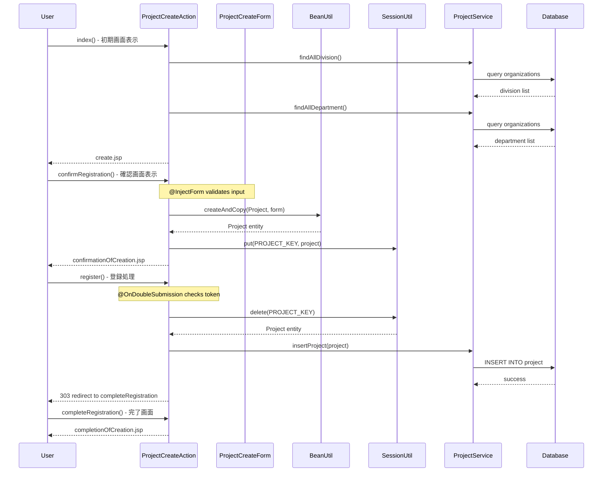

# Code Analysis: ProjectCreateAction

**Generated**: 2026-03-02 16:11:45
**Target**: プロジェクト登録処理
**Modules**: proman-web
**Analysis Duration**: 約2分36秒

---

## Overview

ProjectCreateActionは、Promanシステムにおけるプロジェクト新規登録機能を実装するアクションクラスです。初期画面表示から登録確認、実際の登録処理、完了画面表示までの一連のフローを制御します。

主な機能:
- プロジェクト登録フォームの初期表示
- 入力値のバリデーション
- 登録確認画面の表示
- データベースへの登録処理
- 二重サブミット防止
- セッション管理による画面間データ受け渡し

---

## Architecture

### Dependency Graph

```mermaid
classDiagram
    class ProjectCreateAction {
        +index()
        +confirmRegistration()
        +register()
        +completeRegistration()
        +backToEnterRegistration()
    }
    class ProjectCreateForm {
        <<Form>>
    }
    class ProjectService {
        +insertProject()
        +findAllDivision()
        +findAllDepartment()
        +findOrganizationById()
    }
    class Project {
        <<Entity>>
    }
    class BeanUtil {
        <<Nablarch>>
    }
    class SessionUtil {
        <<Nablarch>>
    }
    class ExecutionContext {
        <<Nablarch>>
    }
    class InjectForm {
        <<Nablarch>>
    }
    class OnError {
        <<Nablarch>>
    }
    class OnDoubleSubmission {
        <<Nablarch>>
    }

    ProjectCreateAction ..> ProjectCreateForm : validates
    ProjectCreateAction ..> ProjectService : delegates to
    ProjectCreateAction ..> Project : creates
    ProjectCreateAction ..> BeanUtil : uses for mapping
    ProjectCreateAction ..> SessionUtil : manages session
    ProjectCreateAction ..> ExecutionContext : accesses context
    ProjectCreateAction ..> InjectForm : uses annotation
    ProjectCreateAction ..> OnError : uses annotation
    ProjectCreateAction ..> OnDoubleSubmission : uses annotation
    ProjectService ..> Project : persists
```



**Note**: This diagram uses Mermaid `classDiagram` syntax to show class names and their relationships. Use `--|>` for inheritance (extends/implements) and `..>` for dependencies (uses/creates).

### Component Summary

| Component | Role | Type | Dependencies |
|-----------|------|------|--------------|
| ProjectCreateAction | プロジェクト登録処理の制御 | Action | ProjectCreateForm, ProjectService, Project, BeanUtil, SessionUtil |
| ProjectCreateForm | 入力フォームデータ | Form | (Bean Validation annotations) |
| ProjectService | ビジネスロジック | Service | Project, Organization |
| Project | プロジェクトエンティティ | Entity | (Database table mapping) |
| BeanUtil | Bean変換ユーティリティ | Nablarch Framework | - |
| SessionUtil | セッション管理 | Nablarch Framework | - |
| InjectForm | フォーム注入アノテーション | Nablarch Framework | - |
| OnError | エラーハンドリングアノテーション | Nablarch Framework | - |
| OnDoubleSubmission | 二重サブミット防止 | Nablarch Framework | - |

---

## Flow

### Processing Flow

プロジェクト登録処理は以下の5つのステップで構成されます:

1. **初期画面表示 (index)**
   - 事業部・部門のプルダウンリストをDBから取得
   - 登録フォーム画面を表示

2. **登録確認 (confirmRegistration)**
   - @InjectFormでフォームデータを注入
   - Bean ValidationによるBeanUtilを使用したフォームからエンティティへのマッピング
   - @OnErrorで検証エラー時の遷移先を指定
   - 変換したProjectオブジェクトをセッションに保存
   - 確認画面を表示

3. **登録処理 (register)**
   - @OnDoubleSubmissionで二重サブミット防止
   - セッションからProjectオブジェクトを取得
   - ProjectServiceを使用してデータベースに登録
   - 完了画面へリダイレクト (HTTP 303)

4. **完了画面表示 (completeRegistration)**
   - 登録完了メッセージを表示

5. **入力画面へ戻る (backToEnterRegistration)**
   - セッションからProjectを取得
   - BeanUtilでProjectをFormに逆変換
   - 日付フォーマットの調整
   - 入力画面へフォワード

### Sequence Diagram



---

## Components

### 1. ProjectCreateAction

**Location**: `proman-web/src/main/java/com/nablarch/example/proman/web/project/ProjectCreateAction.java`

**Role**: プロジェクト登録処理の制御を行うアクションクラス。画面遷移、データ変換、ビジネスロジック呼び出しを担当。

**Key Methods**:
- `index()` [:33-39] - 初期画面表示。事業部/部門プルダウンを設定
- `confirmRegistration()` [:48-63] - 登録確認画面表示。@InjectFormでフォーム注入、BeanUtilで変換
- `register()` [:72-78] - 登録処理。@OnDoubleSubmissionで二重サブミット防止
- `completeRegistration()` [:87-89] - 登録完了画面表示
- `backToEnterRegistration()` [:98-118] - 入力画面へ戻る。セッションからフォームへ逆変換
- `setOrganizationAndDivisionToRequestScope()` [:125-136] - 事業部/部門データをリクエストスコープに設定

**Dependencies**:
- ProjectCreateForm - 入力フォームデータ
- ProjectService - ビジネスロジック層
- Project - エンティティ
- BeanUtil - Form⇔Entityマッピング
- SessionUtil - セッション管理
- ExecutionContext - リクエスト処理コンテキスト

**Implementation Points**:
- @InjectFormアノテーションによる自動フォーム注入とバリデーション
- @OnErrorで検証エラー時の遷移先を指定
- @OnDoubleSubmissionで二重サブミット防止トークンチェック
- BeanUtilでForm→Entity、Entity→Formの双方向変換
- SessionUtilでProjectオブジェクトを画面間で受け渡し
- HTTP 303リダイレクトでPRG (Post-Redirect-Get)パターンを実装

### 2. ProjectCreateForm

**Location**: `proman-web/src/main/java/com/nablarch/example/proman/web/project/ProjectCreateForm.java`

**Role**: プロジェクト登録フォームのデータを保持するFormクラス。Bean Validationアノテーションによる入力検証ルールを定義。

**Dependencies**: Bean Validation annotations

**Implementation Points**:
- フォームフィールドにBean Validationアノテーションを付与
- ProjectCreateActionの@InjectFormで自動的に注入・検証される

### 3. ProjectService

**Location**: `proman-web/src/main/java/com/nablarch/example/proman/web/project/ProjectService.java`

**Role**: プロジェクト登録に関するビジネスロジックを実装するサービスクラス。データベースアクセスを担当。

**Key Methods**:
- `insertProject()` - プロジェクトエンティティをデータベースに登録
- `findAllDivision()` - すべての事業部を取得
- `findAllDepartment()` - すべての部門を取得
- `findOrganizationById()` - 組織IDで組織情報を取得

**Dependencies**: Project, Organization entities, UniversalDao

### 4. Project

**Location**: `com.nablarch.example.proman.entity.Project`

**Role**: プロジェクトテーブルのエンティティクラス。データベーステーブルのカラムとマッピング。

**Implementation Points**:
- データベーステーブル project のJavaマッピング
- BeanUtilによるProjectCreateFormとの相互変換が可能

---

## Nablarch Framework Usage

### 1. BeanUtil - Bean変換ユーティリティ

BeanUtilは、JavaBeansの変換とコピーを行うNablarchのユーティリティクラスです。

**Code Example**:
```java
// Form → Entity変換
Project project = BeanUtil.createAndCopy(Project.class, form);

// Entity → Form変換
ProjectCreateForm projectCreateForm = BeanUtil.createAndCopy(ProjectCreateForm.class, project);
```

**Important Points**:
- ✅ 同名プロパティを自動的にコピー
- ✅ 型変換も自動的に実行 (String ↔ Integer など)
- ⚠️ プロパティ名が異なる場合はマッピングされない
- 💡 繰り返し使う変換ロジックを簡潔に記述できる
- 🎯 Form⇔Entity変換で使用するのが一般的

**Usage in this code**:
- confirmRegistration()でFormからEntityへ変換 [:52]
- backToEnterRegistration()でEntityからFormへ逆変換 [:101]

### 2. SessionUtil - セッション管理

SessionUtilは、HTTPセッションへのアクセスを簡潔に行うためのユーティリティクラスです。

**Code Example**:
```java
// セッションにオブジェクトを保存
SessionUtil.put(context, PROJECT_KEY, project);

// セッションからオブジェクトを取得
Project project = SessionUtil.get(context, PROJECT_KEY);

// セッションからオブジェクトを取得して削除
Project project = SessionUtil.delete(context, PROJECT_KEY);
```

**Important Points**:
- ✅ 型安全なセッションアクセス
- ✅ delete()でアトミックに取得と削除を実行
- ⚠️ セッションに大きなオブジェクトを保存しすぎないよう注意
- 💡 画面間でデータを受け渡すときに使用
- 🎯 確認画面パターンでよく使われる

**Usage in this code**:
- confirmRegistration()でProjectをセッションに保存 [:59]
- register()でセッションからProjectを取得して削除 [:74]
- backToEnterRegistration()でセッションからProjectを取得 [:100]

### 3. @InjectForm - フォーム自動注入

@InjectFormは、HTTPリクエストパラメータを自動的にFormオブジェクトにマッピングし、Bean Validationによる検証を実行するアノテーションです。

**Code Example**:
```java
@InjectForm(form = ProjectCreateForm.class, prefix = "form")
@OnError(type = ApplicationException.class, path = "forward:///app/project/errorRegister")
public HttpResponse confirmRegistration(HttpRequest request, ExecutionContext context) {
    ProjectCreateForm form = context.getRequestScopedVar("form");
    // フォームは既にバリデーション済み
}
```

**Important Points**:
- ✅ リクエストパラメータを自動的にFormにバインド
- ✅ Bean Validationアノテーションに基づいて自動検証
- ✅ @OnErrorでバリデーションエラー時の遷移先を指定
- ⚠️ prefix指定でリクエストパラメータ名のプレフィックスを指定
- 💡 バリデーションロジックをActionから分離できる
- 🎯 入力画面→確認画面の遷移で使用

**Usage in this code**:
- confirmRegistration()メソッドに付与 [:48]
- prefix="form"で"form.projectName"などのパラメータをマッピング

### 4. @OnError - エラーハンドリング

@OnErrorは、指定された例外が発生したときの遷移先を定義するアノテーションです。

**Code Example**:
```java
@OnError(type = ApplicationException.class, path = "forward:///app/project/errorRegister")
```

**Important Points**:
- ✅ バリデーションエラー時の遷移先を宣言的に定義
- ✅ 例外の種類ごとに異なる遷移先を指定可能
- 💡 try-catchを書かずにエラーハンドリングを記述できる
- 🎯 @InjectFormと組み合わせて使用するのが一般的

**Usage in this code**:
- confirmRegistration()で ApplicationException 時にerrorRegisterへフォワード [:49]

### 5. @OnDoubleSubmission - 二重サブミット防止

@OnDoubleSubmissionは、同じフォームが二重に送信されるのを防ぐトークンチェック機能を提供するアノテーションです。

**Code Example**:
```java
@OnDoubleSubmission
public HttpResponse register(HttpRequest request, ExecutionContext context) {
    // この処理は二重実行されない
}
```

**Important Points**:
- ✅ トークンによる二重サブミット検証を自動実行
- ✅ 画面の戻るボタン、F5キー、ブラウザの再読み込みによる二重実行を防止
- ⚠️ 確認画面でトークンを生成し、登録処理で検証する必要がある
- 💡 登録・更新・削除などの副作用のある処理で必須
- 🎯 PRG (Post-Redirect-Get)パターンと組み合わせて使用
- ⚡ トークンの有効期限やストレージ方式は設定で変更可能

**Usage in this code**:
- register()メソッドに付与してプロジェクト登録の二重実行を防止 [:72]

### 6. ExecutionContext - 実行コンテキスト

ExecutionContextは、リクエスト処理中の情報を保持するコンテキストオブジェクトです。

**Code Example**:
```java
// リクエストスコープに値を設定
context.setRequestScopedVar("topOrganization", topOrganizationList);

// リクエストスコープから値を取得
ProjectCreateForm form = context.getRequestScopedVar("form");
```

**Important Points**:
- ✅ リクエストスコープ、セッションスコープへのアクセス
- ✅ ハンドラ間でのデータ受け渡し
- 💡 JSPでリクエストスコープの値を参照できる
- 🎯 1リクエスト内でのデータ共有に使用

**Usage in this code**:
- リクエストスコープへの事業部/部門リストの設定 [:134-135]
- @InjectFormで注入されたFormの取得 [:51, :114]

---

## References

### Source Files

- [ProjectCreateAction.java](../../../../../../../../../../proman-web/src/main/java/com/nablarch/example/proman/web/project/ProjectCreateAction.java) - ProjectCreateAction

### Knowledge Base (Nabledge-6)

- [None](../../../../../../../../../../none)

### Official Documentation

(No official documentation links available)

---

**Note**: This documentation was generated by the code-analysis workflow of the nabledge-6 skill.
