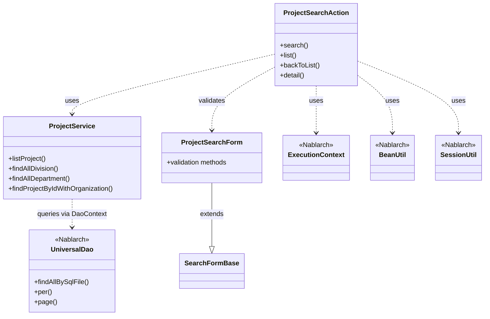
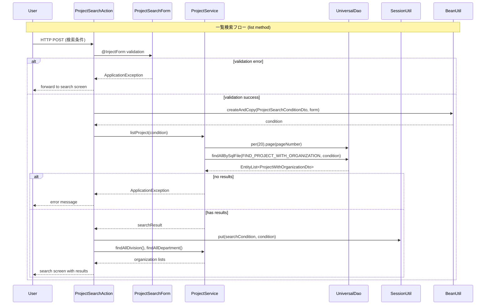

# Code Analysis: ProjectSearchAction

**Generated**: 2026-03-02 17:14:42
**Target**: プロジェクト検索アクション
**Modules**: proman-web
**Analysis Duration**: 約3分15秒

---

## Overview

ProjectSearchActionは、プロジェクト検索機能を提供するWebアクションクラスです。検索画面の初期表示、検索条件による一覧検索、検索結果からの詳細画面表示を行います。

主な機能:
- **検索画面初期表示** (`search`): セッションクリアと選択肢設定
- **一覧検索** (`list`): フォーム入力値によるDB検索とページング
- **検索結果からの復帰** (`backToList`): セッション保持された検索条件での再検索
- **詳細画面表示** (`detail`): プロジェクトID指定による詳細情報取得

ProjectServiceを通じてUniversalDaoでデータベースアクセスを行い、検索結果をページング表示します。フォームバリデーション、セッション管理、エラーハンドリングを統合した典型的な検索系Webアクションの実装です。

---

## Architecture

### Dependency Graph



**Note**: This diagram uses Mermaid `classDiagram` syntax to show class names and their relationships. Use `--|>` for inheritance (extends/implements) and `..>` for dependencies (uses/creates).

### Component Summary

| Component | Role | Type | Dependencies |
|-----------|------|------|--------------|
| ProjectSearchAction | プロジェクト検索アクション | Web Action | ProjectService, ProjectSearchForm, ExecutionContext, SessionUtil, BeanUtil |
| ProjectService | プロジェクト検索ビジネスロジック | Service | DaoContext (UniversalDao) |
| ProjectSearchForm | 検索条件フォーム | Form | Bean Validation, SearchFormBase |
| ProjectSearchConditionDto | 検索条件DTO | DTO | なし |
| ProjectWithOrganizationDto | 検索結果DTO | DTO | なし |

---

## Flow

### Processing Flow

#### 1. 検索画面初期表示 (`search`)
1. セッションから検索条件を削除
2. 事業部と部門のマスタデータを取得してリクエストスコープに設定
3. 検索画面JSPに遷移

#### 2. 一覧検索 (`list`)
1. `@InjectForm`でフォームバリデーション実行
2. バリデーションエラー時は`@OnError`で検索画面に戻る
3. フォーム値をProjectSearchConditionDtoに変換 (BeanUtil)
4. ページ番号が未指定の場合は1を設定
5. ProjectService経由でDB検索を実行（ページング付き）
6. 検索結果が0件の場合はApplicationException
7. 検索条件をセッションに保存（詳細画面から戻る際に使用）
8. 検索画面JSPに遷移（検索結果を表示）

#### 3. 検索結果からの復帰 (`backToList`)
1. セッションから検索条件を取得
2. 検索条件で再検索を実行
3. フォーム値を復元してリクエストスコープに設定
4. 検索画面JSPに遷移

#### 4. 詳細画面表示 (`detail`)
1. `@InjectForm`でプロジェクトIDをフォームに取得
2. ProjectService経由でプロジェクト詳細を取得
3. 詳細情報をリクエストスコープに設定
4. 詳細画面JSPに遷移

### Sequence Diagram



---

## Components

### 1. ProjectSearchAction

**Location**: [ProjectSearchAction.java](../../.lw/nab-official/v6/nablarch-system-development-guide/Sample_Project/Source_Code/proman-project/proman-web/src/main/java/com/nablarch/example/proman/web/project/ProjectSearchAction.java)

**Role**: プロジェクト検索画面のWebアクション。検索、詳細表示、画面遷移を制御。

**Key Methods**:
- `search(HttpRequest, ExecutionContext)` (L35-40): 検索画面初期表示
- `list(HttpRequest, ExecutionContext)` (L49-69): 一覧検索とページング
- `backToList(HttpRequest, ExecutionContext)` (L78-91): セッションから検索条件復元
- `detail(HttpRequest, ExecutionContext)` (L101-109): 詳細画面表示
- `searchProjectAndSetToRequestScope(ExecutionContext, ProjectSearchConditionDto)` (L117-125): 検索実行とリクエストスコープ設定
- `setOrganizationAndDivisionToRequestScope(ExecutionContext)` (L132-136): マスタデータ設定

**Dependencies**: ProjectService, ProjectSearchForm, ExecutionContext, SessionUtil, BeanUtil

**Key Points**:
- `@InjectForm`でフォームバリデーションを自動実行
- `@OnError`でバリデーションエラー時の遷移先を指定
- セッションに検索条件を保存して画面遷移後の復帰に対応
- BeanUtil.createAndCopyでフォームからDTOへ変換

### 2. ProjectService

**Location**: [ProjectService.java](../../.lw/nab-official/v6/nablarch-system-development-guide/Sample_Project/Source_Code/proman-project/proman-web/src/main/java/com/nablarch/example/proman/web/project/ProjectService.java)

**Role**: プロジェクト検索のビジネスロジック。UniversalDao (DaoContext)を使用したデータベースアクセス。

**Key Methods**:
- `listProject(ProjectSearchConditionDto)` (L99-104): ページング付き検索
- `findAllDivision()` (L50-52): 事業部マスタ取得
- `findAllDepartment()` (L59-61): 部門マスタ取得
- `findProjectByIdWithOrganization(Integer)` (L112-116): プロジェクト詳細取得

**Dependencies**: DaoContext (UniversalDao), ProjectSearchConditionDto, ProjectWithOrganizationDto

**Key Points**:
- DaoContextフィールドをコンストラクタインジェクションで受け取る
- `per(20).page(pageNumber)`でページングを設定
- `findAllBySqlFile`でSQL IDを指定して検索
- 1ページあたり20件の固定値 (RECORDS_PER_PAGE定数)

### 3. ProjectSearchForm

**Location**: [ProjectSearchForm.java](../../.lw/nab-official/v6/nablarch-system-development-guide/Sample_Project/Source_Code/proman-project/proman-web/src/main/java/com/nablarch/example/proman/web/project/ProjectSearchForm.java)

**Role**: プロジェクト検索条件のフォームクラス。Bean Validationによる入力チェック。

**Key Fields**:
- `divisionId`: 事業部ID (@Domain)
- `organizationId`: 部門ID (@Domain)
- `projectType`: プロジェクト種別 (@Valid)
- `projectClass`: プロジェクト分類 (@Valid)
- `salesFrom/To`: 売上高範囲 (@Domain)
- `projectStartDateFrom/To`: 開始日範囲 (@Domain, @AssertTrue)
- `projectEndDateFrom/To`: 終了日範囲 (@Domain, @AssertTrue)
- `projectName`: プロジェクト名 (@Domain)

**Validation Methods**:
- `isValidProjectSalesRange()` (L294-297): 売上高FROM/TOの妥当性チェック
- `isValidProjectStartDateRange()` (L306-309): 開始日FROM/TOの妥当性チェック
- `isValidProjectEndDateRange()` (L318-321): 終了日FROM/TOの妥当性チェック

**Dependencies**: SearchFormBase, Bean Validation annotations

**Key Points**:
- `@Domain`アノテーションでドメインバリデーション
- `@AssertTrue`で相関チェック（FROM <= TO）
- 内部クラス（ProjectType, ProjectClass）で配列プロパティを扱う
- SearchFormBaseを継承してページング情報を保持

---

## Nablarch Framework Usage

### DaoContext (UniversalDao)

**クラス**: `nablarch.common.dao.DaoContext`

**説明**: O/Rマッパー機能を提供するNablarchのDAO。SQL IDによる検索、ページング、CRUD操作をサポート。

**使用方法**:
```java
DaoContext universalDao = DaoFactory.create();
List<ProjectWithOrganizationDto> result = universalDao
    .per(20)  // 1ページあたり20件
    .page(pageNumber)  // ページ番号指定
    .findAllBySqlFile(ProjectWithOrganizationDto.class, "FIND_PROJECT_WITH_ORGANIZATION", condition);
```

**重要ポイント**:
- ✅ **SQL IDでSQL管理**: findAllBySqlFileでSQL IDを指定。SQLファイルで管理するため保守性が高い
- ✅ **ページング機能**: per().page()メソッドチェーンで簡単にページング実装
- 💡 **件数取得SQL自動生成**: ページング時に件数取得SQLが自動で発行される
- ⚠️ **EntityListで結果受け取り**: 検索結果はEntityList型で返され、Pagination情報を取得可能
- 🎯 **検索条件の渡し方**: 第3引数にBeanまたはMapで検索条件を渡す

**このコードでの使い方**:
- ProjectServiceでDaoContextをフィールドに保持
- listProjectメソッドでper(20).page()によるページング検索
- findAllBySqlFileでSQL ID "FIND_PROJECT_WITH_ORGANIZATION"を指定
- ProjectSearchConditionDtoを検索条件として渡す

**詳細**: [ユニバーサルDAO知識ベース](../../docs/features/libraries/universal-dao.md)

### @InjectForm

**クラス**: `nablarch.common.web.interceptor.InjectForm`

**説明**: HTTPリクエストパラメータを自動的にフォームオブジェクトにバインドし、バリデーションを実行するアノテーション。

**使用方法**:
```java
@InjectForm(form = ProjectSearchForm.class, prefix = "form")
@OnError(type = ApplicationException.class, path = "forward://search")
public HttpResponse list(HttpRequest request, ExecutionContext context) {
    ProjectSearchForm form = context.getRequestScopedVar("form");
    // フォームは既にバリデーション済み
}
```

**重要ポイント**:
- ✅ **自動バリデーション**: Bean Validationアノテーションに基づき自動でチェック
- ✅ **リクエストスコープに設定**: バインド済みフォームは`context.getRequestScopedVar`で取得
- ⚠️ **@OnErrorとセット**: バリデーションエラー時の遷移先を@OnErrorで指定必須
- 💡 **prefix属性**: リクエストパラメータ名のプレフィックスを指定可能

**このコードでの使い方**:
- listメソッドとdetailメソッドに@InjectFormを指定
- prefix="form"でリクエストスコープの変数名を指定
- バリデーションエラー時は@OnErrorで"forward://search"に遷移

### BeanUtil

**クラス**: `nablarch.core.beans.BeanUtil`

**説明**: JavaBeansのプロパティコピーや型変換を行うユーティリティクラス。

**使用方法**:
```java
ProjectSearchForm form = context.getRequestScopedVar("form");
ProjectSearchConditionDto condition = BeanUtil.createAndCopy(ProjectSearchConditionDto.class, form);
```

**重要ポイント**:
- ✅ **型変換**: String → Integer/BigDecimal等の型変換を自動で実行
- ✅ **null安全**: nullプロパティは変換先に設定されない
- 💡 **同名プロパティコピー**: プロパティ名が一致するフィールドを自動コピー
- ⚡ **リフレクション使用**: 大量オブジェクト処理時は性能に注意

**このコードでの使い方**:
- listメソッドでフォームからDTOへ変換
- backToListメソッドでDTOからフォームへ変換（画面復元用）

### SessionUtil

**クラス**: `nablarch.common.web.session.SessionUtil`

**説明**: HTTPセッションへのオブジェクト保存・取得を簡潔に行うユーティリティクラス。

**使用方法**:
```java
// セッション保存
SessionUtil.put(context, "searchCondition", condition);

// セッション取得
ProjectSearchConditionDto condition = SessionUtil.get(context, "searchCondition");

// セッション削除
SessionUtil.delete(context, "searchCondition");
```

**重要ポイント**:
- ✅ **型安全な取得**: ジェネリクスによる型推論でキャスト不要
- ⚠️ **セッション肥大化注意**: 大きなオブジェクトを保存するとメモリを圧迫
- 💡 **画面遷移パターン**: 検索条件をセッション保存し、詳細→一覧復帰に活用

**このコードでの使い方**:
- searchメソッドでセッションクリア (delete)
- listメソッドで検索条件を保存 (put)
- backToListメソッドで検索条件を復元 (get)
- 詳細画面から検索画面に戻る際の検索条件復元に使用

### @OnError

**クラス**: `nablarch.fw.web.interceptor.OnError`

**説明**: 特定の例外発生時の遷移先を指定するアノテーション。主にバリデーションエラー時に使用。

**使用方法**:
```java
@InjectForm(form = ProjectSearchForm.class, prefix = "form")
@OnError(type = ApplicationException.class, path = "forward://search")
public HttpResponse list(HttpRequest request, ExecutionContext context) {
    // ApplicationException発生時は"forward://search"に遷移
}
```

**重要ポイント**:
- ✅ **例外ハンドリングの宣言化**: 例外処理をアノテーションで宣言的に記述
- ✅ **@InjectFormとセット**: バリデーションエラー時の遷移先を明示的に指定
- 🎯 **forward:// スキーム**: 同一アクション内のメソッドに内部転送

**このコードでの使い方**:
- listメソッドとbackToListメソッドに指定
- ApplicationException (バリデーションエラー) 発生時にsearchメソッドへforward

---

## References

### Source Files

- [ProjectSearchAction.java](../../.lw/nab-official/v6/nablarch-system-development-guide/Sample_Project/Source_Code/proman-project/proman-web/src/main/java/com/nablarch/example/proman/web/project/ProjectSearchAction.java) - ProjectSearchAction
- [ProjectService.java](../../.lw/nab-official/v6/nablarch-system-development-guide/Sample_Project/Source_Code/proman-project/proman-web/src/main/java/com/nablarch/example/proman/web/project/ProjectService.java) - ProjectService
- [ProjectSearchForm.java](../../.lw/nab-official/v6/nablarch-system-development-guide/Sample_Project/Source_Code/proman-project/proman-web/src/main/java/com/nablarch/example/proman/web/project/ProjectSearchForm.java) - ProjectSearchForm

### Knowledge Base (Nabledge-6)

- [Universal Dao.json](../../knowledge/features/libraries/universal-dao.json)

### Official Documentation

(No official documentation links available)

---

**Note**: This documentation was generated by the code-analysis workflow of the nabledge-6 skill.
