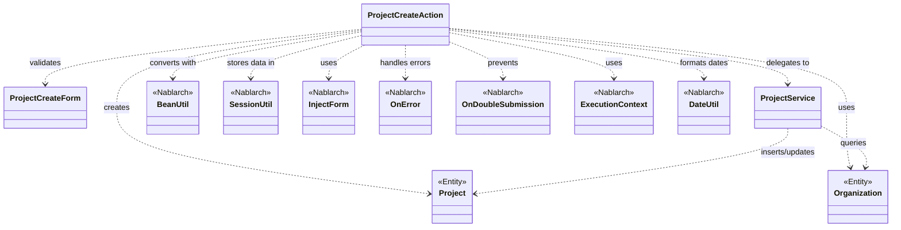
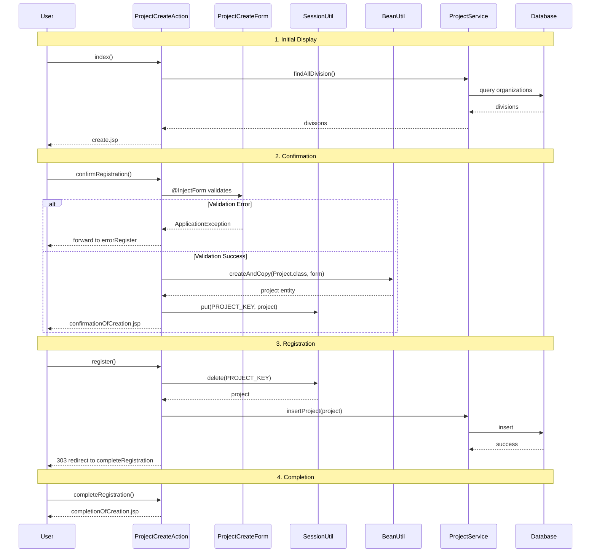

# Code Analysis: ProjectCreateAction

**Generated**: 2026-03-03 17:08:26
**Target**: プロジェクト登録処理
**Modules**: proman-web
**Analysis Duration**: 約2分14秒

---

## Overview

ProjectCreateActionは、プロジェクト登録機能を実装するWebアクションクラスです。画面からのプロジェクト情報入力を受け付け、確認画面を経由してデータベースに登録します。

主な処理フロー:
1. 初期画面表示 (`index`) - 事業部/部門のプルダウンリスト取得
2. 確認画面表示 (`confirmRegistration`) - 入力値検証とBeanコピー
3. 登録処理 (`register`) - セッションからデータ取得してDB登録
4. 完了画面表示 (`completeRegistration`)
5. 入力画面に戻る (`backToEnterRegistration`) - 確認画面から修正する場合

Nablarchフレームワークの以下の機能を活用しています:
- **InjectForm**: フォームデータの自動バインドとバリデーション
- **OnError**: バリデーションエラー時の画面遷移制御
- **OnDoubleSubmission**: 二重送信防止
- **BeanUtil**: FormからEntityへのデータコピー
- **SessionUtil**: 確認画面間のデータ受け渡し

---

## Architecture

### Dependency Graph



**Note**: This diagram uses Mermaid `classDiagram` syntax to show class names and their relationships. Use `--|>` for inheritance (extends/implements) and `..>` for dependencies (uses/creates).

### Component Summary

| Component | Role | Type | Dependencies |
|-----------|------|------|--------------|
| ProjectCreateAction | プロジェクト登録アクション | Action | ProjectCreateForm, Project, ProjectService, BeanUtil, SessionUtil |
| ProjectCreateForm | プロジェクト入力フォーム | Form | なし |
| Project | プロジェクトエンティティ | Entity | なし |
| Organization | 組織エンティティ | Entity | なし |
| ProjectService | プロジェクト登録サービス | Service | UniversalDao |

---

## Flow

### Processing Flow

プロジェクト登録は以下の5つのステップで構成されます:

**1. 初期画面表示 (`index`)**
- 事業部/部門のプルダウンデータをDB取得
- リクエストスコープに設定
- create.jspへフォワード

**2. 確認画面表示 (`confirmRegistration`)**
- `@InjectForm`でフォームデータを自動バインド・バリデーション
- バリデーションエラー時は`@OnError`で登録画面へ戻る
- `BeanUtil.createAndCopy`でFormからEntityに変換
- Entityをセッションに保存
- 確認画面へフォワード

**3. 登録処理 (`register`)**
- `@OnDoubleSubmission`で二重送信を防止
- セッションからEntityを取得・削除
- ProjectServiceに委譲してDB登録
- 303リダイレクトで完了画面へ

**4. 完了画面表示 (`completeRegistration`)**
- 登録完了メッセージを表示

**5. 入力画面に戻る (`backToEnterRegistration`)**
- 確認画面から「戻る」ボタン押下時
- セッションからEntityを取得してFormに再変換
- 日付フォーマット変換 (DateUtil使用)
- 事業部/部門IDを設定
- 登録画面へフォワード

### Sequence Diagram



---

## Components

### 1. ProjectCreateAction

**File**: [ProjectCreateAction.java:1-138](../../.lw/nab-official/v6/nablarch-system-development-guide/Sample_Project/Source_Code/proman-project/proman-web/src/main/java/com/nablarch/example/proman/web/project/ProjectCreateAction.java)

**Role**: プロジェクト登録のメインアクションクラス

**Key Methods**:
- `index()` [:33-39] - 初期画面表示、プルダウンデータ取得
- `confirmRegistration()` [:48-63] - 確認画面表示、フォームバリデーション、Bean変換
- `register()` [:72-78] - 登録処理、セッションからデータ取得してDB登録
- `completeRegistration()` [:87-89] - 完了画面表示
- `backToEnterRegistration()` [:98-118] - 入力画面に戻る、Entity→Form変換
- `setOrganizationAndDivisionToRequestScope()` [:125-136] - 事業部/部門リスト取得

**Dependencies**:
- ProjectCreateForm: 入力フォーム
- Project: エンティティ
- Organization: 組織エンティティ
- ProjectService: 登録サービス
- BeanUtil: Form⇔Entity変換
- SessionUtil: セッション管理
- DateUtil: 日付フォーマット
- InjectForm, OnError, OnDoubleSubmission: アノテーション

**Implementation Points**:
- セッションキー `PROJECT_KEY` で確認画面間のデータを保持
- `@InjectForm` + `@OnError` でバリデーション処理を宣言的に実装
- `@OnDoubleSubmission` で登録ボタンの二重押下を防止
- 303 リダイレクトでPRGパターン実装 (Post-Redirect-Get)

### 2. ProjectCreateForm

**File**: [ProjectCreateForm.java](../../.lw/nab-official/v6/nablarch-system-development-guide/Sample_Project/Source_Code/proman-project/proman-web/src/main/java/com/nablarch/example/proman/web/project/ProjectCreateForm.java)

**Role**: プロジェクト入力画面のフォームクラス

**Annotations**:
- Bean Validationアノテーションで入力チェックルール定義
- `@InjectForm` により自動バインド・バリデーション

**Usage**:
- `confirmRegistration()` でリクエストパラメータから自動生成
- `backToEnterRegistration()` でEntityから再構築

### 3. Project / Organization

**Entities**: プロジェクトと組織のデータベースエンティティ

**Usage**:
- ProjectCreateFormからBeanUtil経由で生成
- ProjectServiceによりUniversalDaoでDB登録

### 4. ProjectService

**File**: [ProjectService.java](../../.lw/nab-official/v6/nablarch-system-development-guide/Sample_Project/Source_Code/proman-project/proman-web/src/main/java/com/nablarch/example/proman/web/project/ProjectService.java)

**Role**: プロジェクト関連のビジネスロジック

**Key Methods**:
- `findAllDivision()` - 事業部一覧取得
- `findAllDepartment()` - 部門一覧取得
- `findOrganizationById()` - 組織ID検索
- `insertProject()` - プロジェクト登録

**Implementation**:
- UniversalDaoを使用したDB操作

---

## Nablarch Framework Usage

### InjectForm

**クラス**: `nablarch.common.web.interceptor.InjectForm`

**説明**: リクエストパラメータをFormオブジェクトに自動バインドし、Bean Validationを実行するインターセプタ

**使用方法**:
```java
@InjectForm(form = ProjectCreateForm.class, prefix = "form")
@OnError(type = ApplicationException.class, path = "forward:///app/project/errorRegister")
public HttpResponse confirmRegistration(HttpRequest request, ExecutionContext context) {
    ProjectCreateForm form = context.getRequestScopedVar("form");
    // form はバリデーション済み
}
```

**重要ポイント**:
- ✅ **自動バリデーション**: メソッド実行前にBean Validationが自動実行される
- ✅ **リクエストスコープに設定**: バインドされたFormは`prefix`名でリクエストスコープに格納される
- 💡 **宣言的な実装**: アノテーションのみでバリデーション処理を記述できる
- ⚠️ **@OnErrorと併用**: バリデーションエラー時の遷移先を`@OnError`で指定する必要がある

**このコードでの使い方**:
- `confirmRegistration()` メソッドで使用 (Line 48)
- `form` プレフィックスでリクエストスコープに格納
- バリデーションエラー時は `errorRegister` へフォワード

**詳細**: [Data Bind](../../.claude/skills/nabledge-6/docs/features/libraries/data-bind.md)

### OnError

**クラス**: `nablarch.fw.web.interceptor.OnError`

**説明**: 指定した例外発生時の遷移先を制御するインターセプタ

**使用方法**:
```java
@OnError(type = ApplicationException.class, path = "forward:///app/project/errorRegister")
public HttpResponse confirmRegistration(HttpRequest request, ExecutionContext context) {
    // バリデーションエラー時は自動的にerrorRegisterへ遷移
}
```

**重要ポイント**:
- ✅ **例外ハンドリングの宣言化**: try-catchを書かずにエラー時の画面遷移を定義できる
- 💡 **@InjectFormと組み合わせ**: バリデーションエラー時の遷移に使用するのが一般的
- 🎯 **複数指定可能**: 異なる例外タイプに対して複数の@OnErrorを指定できる
- ⚠️ **pathの指定**: `forward:///` または `redirect:///` で遷移方法を指定

**このコードでの使い方**:
- `ApplicationException` (バリデーションエラー) 発生時に `errorRegister` へフォワード (Line 49)

### OnDoubleSubmission

**クラス**: `nablarch.common.web.token.OnDoubleSubmission`

**説明**: 二重送信を防止するインターセプタ（トークンチェック）

**使用方法**:
```java
@OnDoubleSubmission
public HttpResponse register(HttpRequest request, ExecutionContext context) {
    // 二重送信の場合は自動的にエラー画面へ遷移
}
```

**重要ポイント**:
- ✅ **自動トークンチェック**: メソッド実行前にトークンの整合性を確認
- 💡 **二重送信防止**: ブラウザバックや更新ボタンによる重複登録を防止
- 🎯 **更新系メソッドに必須**: register, update, delete など副作用のある処理には必ず付与
- ⚠️ **トークン生成が必要**: 画面側でトークンを生成するカスタムタグ `<n:token/>` が必要

**このコードでの使い方**:
- `register()` メソッドで二重登録を防止 (Line 72)

### BeanUtil

**クラス**: `nablarch.core.beans.BeanUtil`

**説明**: JavaBeansのプロパティコピーや型変換を行うユーティリティ

**使用方法**:
```java
// FormからEntityへ変換
Project project = BeanUtil.createAndCopy(Project.class, form);

// EntityからFormへ変換
ProjectCreateForm form = BeanUtil.createAndCopy(ProjectCreateForm.class, project);
```

**重要ポイント**:
- ✅ **型安全なコピー**: 同名プロパティを自動コピー、型変換も自動
- 💡 **コード量削減**: setter/getterを手動で書く必要がなくなる
- ⚠️ **プロパティ名一致が必要**: フィールド名が異なる場合はコピーされない
- ⚠️ **複雑な変換は個別実装**: 日付フォーマット変更など特殊な変換は手動で行う

**このコードでの使い方**:
- Form→Entity変換: `confirmRegistration()` で使用 (Line 52)
- Entity→Form変換: `backToEnterRegistration()` で使用 (Line 101)
- 日付項目は `DateUtil.formatDate()` で個別変換 (Line 103-106)

**詳細**: [Data Bind](../../.claude/skills/nabledge-6/docs/features/libraries/data-bind.md)

### SessionUtil

**クラス**: `nablarch.common.web.session.SessionUtil`

**説明**: HTTPセッションへのデータ格納・取得を行うユーティリティ

**使用方法**:
```java
// セッションに保存
SessionUtil.put(context, PROJECT_KEY, project);

// セッションから取得
Project project = SessionUtil.get(context, PROJECT_KEY);

// セッションから削除
Project project = SessionUtil.delete(context, PROJECT_KEY);
```

**重要ポイント**:
- ✅ **画面間のデータ受け渡し**: 確認画面パターンで必須
- 💡 **セッションのカプセル化**: HTTPSession APIを直接使わず、SessionUtilを使用
- ⚠️ **登録完了後は削除**: メモリリークを防ぐため、不要になったら `delete()` で削除
- 🎯 **確認画面パターン**: 入力→確認→完了の画面遷移で使用

**このコードでの使い方**:
- `confirmRegistration()`: セッションにEntityを保存 (Line 59)
- `register()`: セッションからEntityを取得・削除して登録 (Line 74)
- `get()`: 「戻る」処理で再取得 (Line 100)

### DateUtil

**クラス**: `nablarch.core.util.DateUtil`

**説明**: 日付のフォーマット変換を行うユーティリティ

**使用方法**:
```java
String formatted = DateUtil.formatDate(dateObject, "yyyy/MM/dd");
```

**重要ポイント**:
- 💡 **柔軟なフォーマット**: SimpleDateFormatと同様のパターン指定が可能
- 🎯 **画面表示用**: データベースの日付を画面表示形式に変換する際に使用

**このコードでの使い方**:
- `backToEnterRegistration()` で日付を "yyyy/MM/dd" 形式に変換 (Line 103-106)

---

## References

### Source Files

- [ProjectCreateAction.java (.lw/nab-official/v6/nablarch-system-development-guide/en/Sample_Project/Source_Code/proman-project/proman-web/src/main/java/com/nablarch/example/proman/web/project)](../../.lw/nab-official/v6/nablarch-system-development-guide/en/Sample_Project/Source_Code/proman-project/proman-web/src/main/java/com/nablarch/example/proman/web/project/ProjectCreateAction.java) - ProjectCreateAction
- [ProjectCreateAction.java (.lw/nab-official/v6/nablarch-system-development-guide/Sample_Project/Source_Code/proman-project/proman-web/src/main/java/com/nablarch/example/proman/web/project)](../../.lw/nab-official/v6/nablarch-system-development-guide/Sample_Project/Source_Code/proman-project/proman-web/src/main/java/com/nablarch/example/proman/web/project/ProjectCreateAction.java) - ProjectCreateAction
- [ProjectCreateForm.java (.lw/nab-official/v6/nablarch-system-development-guide/en/Sample_Project/Source_Code/proman-project/proman-web/src/main/java/com/nablarch/example/proman/web/project)](../../.lw/nab-official/v6/nablarch-system-development-guide/en/Sample_Project/Source_Code/proman-project/proman-web/src/main/java/com/nablarch/example/proman/web/project/ProjectCreateForm.java) - ProjectCreateForm
- [ProjectCreateForm.java (.lw/nab-official/v6/nablarch-system-development-guide/Sample_Project/Source_Code/proman-project/proman-web/src/main/java/com/nablarch/example/proman/web/project)](../../.lw/nab-official/v6/nablarch-system-development-guide/Sample_Project/Source_Code/proman-project/proman-web/src/main/java/com/nablarch/example/proman/web/project/ProjectCreateForm.java) - ProjectCreateForm
- [ProjectService.java (.lw/nab-official/v6/nablarch-system-development-guide/en/Sample_Project/Source_Code/proman-project/proman-web/src/main/java/com/nablarch/example/proman/web/project)](../../.lw/nab-official/v6/nablarch-system-development-guide/en/Sample_Project/Source_Code/proman-project/proman-web/src/main/java/com/nablarch/example/proman/web/project/ProjectService.java) - ProjectService
- [ProjectService.java (.lw/nab-official/v6/nablarch-system-development-guide/Sample_Project/Source_Code/proman-project/proman-web/src/main/java/com/nablarch/example/proman/web/project)](../../.lw/nab-official/v6/nablarch-system-development-guide/Sample_Project/Source_Code/proman-project/proman-web/src/main/java/com/nablarch/example/proman/web/project/ProjectService.java) - ProjectService

### Knowledge Base (Nabledge-6)

- [Data Bind](../../.claude/skills/nabledge-6/docs/features/libraries/data-bind.md)

### Official Documentation

(No official documentation links available)

---

**Note**: This documentation was generated by the code-analysis workflow of the nabledge-6 skill.
