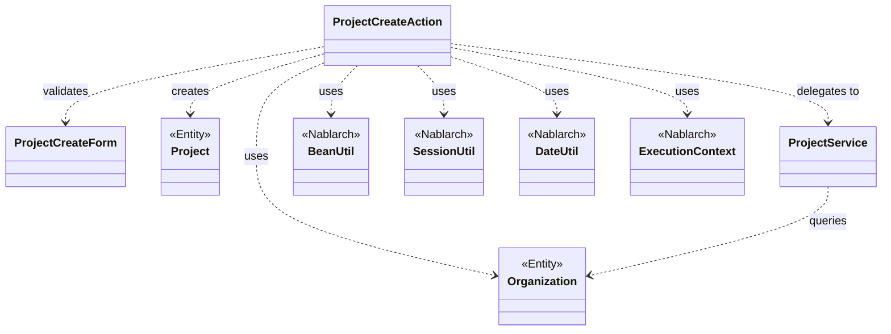
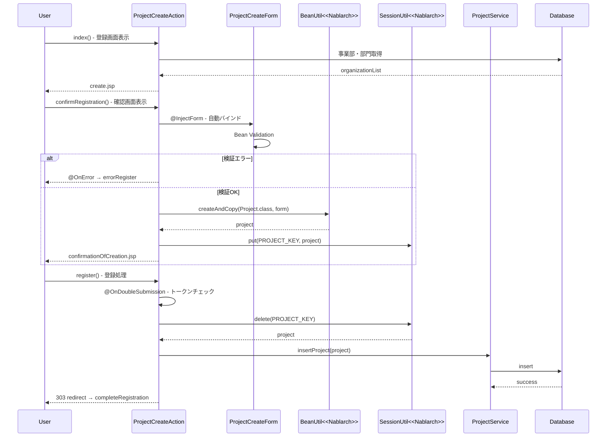

# Code Analysis: ProjectCreateAction

**Generated**: 2026-03-03 17:08:28
**Target**: プロジェクト登録処理アクション
**Modules**: proman-web
**Analysis Duration**: 約2分28秒

---

## Overview

ProjectCreateActionは、Webアプリケーションにおけるプロジェクト新規登録機能を実装したアクションクラスです。入力画面表示、入力値検証、確認画面表示、登録処理、完了画面表示という一連のフローを管理します。

主な責務は以下の通りです:
- フォーム入力値の検証とBean変換 (BeanUtil)
- セッションを利用した画面間データ受け渡し (SessionUtil)
- トランザクション管理下でのDB登録 (ProjectService経由)
- 二重サブミット防止 (OnDoubleSubmission)
- エラー時の画面遷移制御 (OnError)

Nablarchフレームワークの@InjectForm、@OnError、@OnDoubleSubmissionアノテーションを活用し、宣言的なフォーム処理とエラーハンドリングを実現しています。

---

## Architecture

### Dependency Graph



**Note**: This diagram uses Mermaid `classDiagram` syntax to show class names and their relationships. Use `--|>` for inheritance (extends/implements) and `..>` for dependencies (uses/creates).

### Component Summary

| Component | Role | Type | Dependencies |
|-----------|------|------|--------------|
| ProjectCreateAction | プロジェクト登録処理制御 | Action | ProjectCreateForm, ProjectService, BeanUtil, SessionUtil |
| ProjectCreateForm | 入力値検証フォーム | Form | Bean Validation |
| Project | プロジェクト情報エンティティ | Entity | なし |
| Organization | 組織情報エンティティ | Entity | なし |
| ProjectService | プロジェクト関連ビジネスロジック | Service | UniversalDao |

---

## Flow

### Processing Flow

**1. 登録画面表示フロー (index)**

ユーザーがプロジェクト登録画面にアクセスすると、事業部・部門のプルダウン選択肢をDBから取得してリクエストスコープに設定し、登録画面JSPを表示します。

**2. 確認画面表示フロー (confirmRegistration)**

ユーザーが入力内容を送信すると、@InjectFormによりProjectCreateFormに自動バインドされ、Bean Validationで検証されます。検証OKの場合、BeanUtilでProjectエンティティに変換し、セッションに保存して確認画面を表示します。検証NGの場合は@OnErrorにより入力画面に戻ります。

**3. 登録処理フロー (register)**

確認画面で登録ボタンが押されると、@OnDoubleSubmissionによる二重サブミット防止チェックが実行されます。セッションからProjectエンティティを取得し、ProjectService.insertProjectでDB登録を実行します。登録後は303リダイレクトで完了画面へ遷移します。

**4. 戻るフロー (backToEnterRegistration)**

確認画面で戻るボタンが押されると、セッションからProjectエンティティを取得し、BeanUtilでProjectCreateFormに変換して入力画面に戻ります。日付フィールドはDateUtilでフォーマット変換されます。

### Sequence Diagram



---

## Components

### 1. ProjectCreateAction

**File**: [ProjectCreateAction.java:23-138](../../../../../../../../../../../.lw/nab-official/v6/nablarch-system-development-guide/Sample_Project/Source_Code/proman-project/proman-web/src/main/java/com/nablarch/example/proman/web/project/ProjectCreateAction.java)

**Role**: プロジェクト登録処理の画面遷移とフロー制御を担当するアクションクラス

**Key Methods**:
- `index()` [:33-39] - 登録画面初期表示。事業部・部門プルダウンをDBから取得
- `confirmRegistration()` [:48-63] - 確認画面表示。フォーム検証→Bean変換→セッション保存
- `register()` [:72-78] - 登録処理実行。セッションから取得→サービス呼び出し→リダイレクト
- `completeRegistration()` [:87-89] - 登録完了画面表示
- `backToEnterRegistration()` [:98-118] - 入力画面へ戻る。Entity→Form変換と日付フォーマット
- `setOrganizationAndDivisionToRequestScope()` [:125-136] - 事業部・部門をリクエストスコープに設定

**Dependencies**:
- ProjectCreateForm (フォーム検証)
- Project, Organization (エンティティ)
- ProjectService (ビジネスロジック)
- BeanUtil, SessionUtil, DateUtil (Nablarchユーティリティ)

**Annotations**:
- @InjectForm (confirmRegistration): フォーム自動バインドと検証
- @OnError (confirmRegistration): 検証エラー時の遷移先指定
- @OnDoubleSubmission (register): 二重サブミット防止

### 2. ProjectCreateForm

**File**: [ProjectCreateForm.java](../../../../../../../../../../../.lw/nab-official/v6/nablarch-system-development-guide/Sample_Project/Source_Code/proman-project/proman-web/src/main/java/com/nablarch/example/proman/web/project/ProjectCreateForm.java)

**Role**: プロジェクト登録入力値の検証ルールを定義するフォームクラス

**Annotations**: Bean Validationアノテーション (@NotNull, @Length, @Domain等) でフィールド検証ルールを宣言的に定義

### 3. Project

**File**: Entityクラス (詳細省略)

**Role**: プロジェクト情報を保持するエンティティクラス。DB登録・更新の対象

### 4. ProjectService

**File**: [ProjectService.java:17-130](../../../../../../../../../../../.lw/nab-official/v6/nablarch-system-development-guide/Sample_Project/Source_Code/proman-project/proman-web/src/main/java/com/nablarch/example/proman/web/project/ProjectService.java)

**Role**: プロジェクト関連のビジネスロジックとDAO操作を提供するサービスクラス

**Key Methods**:
- `insertProject()` [:80-87] - プロジェクト新規登録 (UniversalDao.insert)
- `updateProject()` [:89-96] - プロジェクト更新 (UniversalDao.update)
- `findAllDivision()` [:50-57] - 事業部一覧取得
- `findAllDepartment()` [:59-67] - 部門一覧取得
- `findOrganizationById()` [:70-78] - 組織情報取得

---

## Nablarch Framework Usage

### BeanUtil

**クラス**: `nablarch.core.beans.BeanUtil`

**説明**: JavaBeans間のプロパティコピーと型変換を行うユーティリティクラス

**使用方法**:
```java
// Formからエンティティへ変換
Project project = BeanUtil.createAndCopy(Project.class, form);

// エンティティからFormへ変換
ProjectCreateForm form = BeanUtil.createAndCopy(ProjectCreateForm.class, project);
```

**重要ポイント**:
- ✅ **型安全な変換**: コピー元とコピー先の型を指定して型安全に変換
- 💡 **自動型変換**: 文字列→数値、文字列→日付など基本型の自動変換をサポート
- ⚠️ **プロパティ名一致が前提**: コピー元とコピー先で同名のプロパティのみがコピーされる
- 💡 **新規インスタンス生成**: createAndCopyはコピー先の新規インスタンスを生成して返す

**このコードでの使い方**:
- `confirmRegistration()` (Line 52): ProjectCreateForm → Project 変換
- `backToEnterRegistration()` (Line 101): Project → ProjectCreateForm 変換

**詳細**: [データバインド](../../../../../../../../../../../.claude/skills/nabledge-6/docs/features/libraries/data-bind.md)

### SessionUtil

**クラス**: `nablarch.common.web.session.SessionUtil`

**説明**: HTTPセッションへのデータ保存・取得・削除を行うユーティリティクラス

**使用方法**:
```java
// セッションに保存
SessionUtil.put(context, "key", object);

// セッションから取得
Object obj = SessionUtil.get(context, "key");

// セッションから削除
Object obj = SessionUtil.delete(context, "key");
```

**重要ポイント**:
- ✅ **画面間データ受け渡し**: 確認画面→登録処理でデータを受け渡すために使用
- ⚠️ **登録後は必ず削除**: 登録完了後はdelete()でセッションから削除してメモリリークを防ぐ
- 💡 **二重サブミット対策と併用**: @OnDoubleSubmissionと組み合わせて画面遷移を制御
- 🎯 **いつ使うか**: 確認画面パターン、ウィザード形式の画面遷移で活用

**このコードでの使い方**:
- `confirmRegistration()` (Line 59): Projectをセッションに保存
- `register()` (Line 74): セッションからProjectを削除して取得
- `backToEnterRegistration()` (Line 100): セッションからProjectを取得 (削除なし)

**詳細**: [Webアプリケーション](../../../../../../../../../../../.claude/skills/nabledge-6/docs/features/web/web-application.md)

### @InjectForm

**アノテーション**: `nablarch.common.web.interceptor.InjectForm`

**説明**: HTTPリクエストパラメータをフォームオブジェクトに自動バインドし、Bean Validationで検証するインターセプタ

**使用方法**:
```java
@InjectForm(form = ProjectCreateForm.class, prefix = "form")
public HttpResponse confirmRegistration(HttpRequest request, ExecutionContext context) {
    ProjectCreateForm form = context.getRequestScopedVar("form");
    // formには検証済みの入力値がバインドされている
}
```

**重要ポイント**:
- ✅ **自動バインドと検証**: リクエストパラメータ→Form変換とBean Validation実行を自動化
- ⚠️ **@OnErrorと併用必須**: 検証エラー時の遷移先を@OnErrorで指定する
- 💡 **prefixでスコープ指定**: prefix="form"でリクエストスコープのキー名を指定
- 🎯 **いつ使うか**: 入力画面→確認画面などフォーム送信を受け取るメソッドで使用

**このコードでの使い方**:
- `confirmRegistration()` (Line 48): ProjectCreateFormを自動バインド・検証

**詳細**: [Webアプリケーション](../../../../../../../../../../../.claude/skills/nabledge-6/docs/features/web/web-application.md)

### @OnError

**アノテーション**: `nablarch.fw.web.interceptor.OnError`

**説明**: 指定した例外発生時の遷移先を宣言的に定義するインターセプタ

**使用方法**:
```java
@OnError(type = ApplicationException.class, path = "forward:///app/project/errorRegister")
public HttpResponse confirmRegistration(HttpRequest request, ExecutionContext context) {
    // Bean Validationエラー発生時はerrorRegisterに遷移
}
```

**重要ポイント**:
- ✅ **宣言的エラーハンドリング**: 例外ごとの遷移先をアノテーションで定義
- 💡 **ApplicationException**: Bean ValidationエラーはApplicationExceptionとしてスローされる
- 🎯 **いつ使うか**: @InjectFormと併用して検証エラー時の遷移先を指定

**このコードでの使い方**:
- `confirmRegistration()` (Line 49): ApplicationException発生時にerrorRegisterへ遷移

**詳細**: [Webアプリケーション](../../../../../../../../../../../.claude/skills/nabledge-6/docs/features/web/web-application.md)

### @OnDoubleSubmission

**アノテーション**: `nablarch.common.web.token.OnDoubleSubmission`

**説明**: 二重サブミット (同じフォームの重複送信) を防止するインターセプタ

**使用方法**:
```java
@OnDoubleSubmission
public HttpResponse register(HttpRequest request, ExecutionContext context) {
    // トークンチェック済み。二重サブミット時は自動的にエラー画面へ遷移
}
```

**重要ポイント**:
- ✅ **トークンベース制御**: 確認画面にトークンを埋め込み、登録時にチェック
- ⚠️ **確認画面→登録処理パターンで必須**: 登録処理メソッドに付与
- 💡 **自動エラー遷移**: 二重サブミット検知時は自動的にエラー画面へ遷移
- 🎯 **いつ使うか**: DB更新を伴う登録・更新・削除処理で使用

**このコードでの使い方**:
- `register()` (Line 72): 登録処理実行前に二重サブミットチェック

**詳細**: [Webアプリケーション](../../../../../../../../../../../.claude/skills/nabledge-6/docs/features/web/web-application.md)

### DateUtil

**クラス**: `nablarch.core.util.DateUtil`

**説明**: 日付のフォーマット変換を行うユーティリティクラス

**使用方法**:
```java
// 日付オブジェクト → 文字列
String formatted = DateUtil.formatDate(date, "yyyy/MM/dd");

// 文字列 → 日付オブジェクト
Date date = DateUtil.getParsedDate(str, "yyyy/MM/dd");
```

**重要ポイント**:
- 💡 **フォーマット指定**: SimpleDateFormatと同じパターン文字列で変換
- 🎯 **いつ使うか**: 画面表示用フォーマット、DBとの変換など

**このコードでの使い方**:
- `backToEnterRegistration()` (Line 103-106): Date → String (yyyy/MM/dd) 変換

**詳細**: [ユーティリティ](../../../../../../../../../../../.claude/skills/nabledge-6/docs/features/utilities/utilities.md)

### トランザクション管理

**ハンドラ**: `nablarch.common.handler.TransactionManagementHandler`

**説明**: リクエスト単位でトランザクション境界を管理し、正常終了時はコミット、異常終了時はロールバックを自動実行

**重要ポイント**:
- ✅ **透過的トランザクション**: アクションクラスにトランザクション制御コードを書く必要がない
- 💡 **ハンドラチェーンで設定**: component-configuration.xmlでハンドラキューに設定
- 🎯 **いつ使うか**: DB更新を伴う全てのWeb/バッチ処理で有効

**このコードでの使い方**:
- `register()` (Line 72-77): ProjectService.insertProjectのDB登録はトランザクション管理下で実行される

**詳細**: [トランザクション管理ハンドラ](../../../../../../../../../../../.claude/skills/nabledge-6/docs/features/handlers/common/transaction-management-handler.md)

---

## References

### Source Files

- [ProjectCreateAction.java (.lw/nab-official/v6/nablarch-system-development-guide/en/Sample_Project/Source_Code/proman-project/proman-web/src/main/java/com/nablarch/example/proman/web/project)](../../../../../../../../../../../.lw/nab-official/v6/nablarch-system-development-guide/en/Sample_Project/Source_Code/proman-project/proman-web/src/main/java/com/nablarch/example/proman/web/project/ProjectCreateAction.java) - ProjectCreateAction
- [ProjectCreateAction.java (.lw/nab-official/v6/nablarch-system-development-guide/Sample_Project/Source_Code/proman-project/proman-web/src/main/java/com/nablarch/example/proman/web/project)](../../../../../../../../../../../.lw/nab-official/v6/nablarch-system-development-guide/Sample_Project/Source_Code/proman-project/proman-web/src/main/java/com/nablarch/example/proman/web/project/ProjectCreateAction.java) - ProjectCreateAction
- [ProjectCreateForm.java (.lw/nab-official/v6/nablarch-system-development-guide/en/Sample_Project/Source_Code/proman-project/proman-web/src/main/java/com/nablarch/example/proman/web/project)](../../../../../../../../../../../.lw/nab-official/v6/nablarch-system-development-guide/en/Sample_Project/Source_Code/proman-project/proman-web/src/main/java/com/nablarch/example/proman/web/project/ProjectCreateForm.java) - ProjectCreateForm
- [ProjectCreateForm.java (.lw/nab-official/v6/nablarch-system-development-guide/Sample_Project/Source_Code/proman-project/proman-web/src/main/java/com/nablarch/example/proman/web/project)](../../../../../../../../../../../.lw/nab-official/v6/nablarch-system-development-guide/Sample_Project/Source_Code/proman-project/proman-web/src/main/java/com/nablarch/example/proman/web/project/ProjectCreateForm.java) - ProjectCreateForm
- [ProjectService.java (.lw/nab-official/v6/nablarch-system-development-guide/en/Sample_Project/Source_Code/proman-project/proman-web/src/main/java/com/nablarch/example/proman/web/project)](../../../../../../../../../../../.lw/nab-official/v6/nablarch-system-development-guide/en/Sample_Project/Source_Code/proman-project/proman-web/src/main/java/com/nablarch/example/proman/web/project/ProjectService.java) - ProjectService
- [ProjectService.java (.lw/nab-official/v6/nablarch-system-development-guide/Sample_Project/Source_Code/proman-project/proman-web/src/main/java/com/nablarch/example/proman/web/project)](../../../../../../../../../../../.lw/nab-official/v6/nablarch-system-development-guide/Sample_Project/Source_Code/proman-project/proman-web/src/main/java/com/nablarch/example/proman/web/project/ProjectService.java) - ProjectService

### Knowledge Base (Nabledge-6)

- [Data Bind](../../../../../../../../../../../.claude/skills/nabledge-6/docs/features/libraries/data-bind.md)
- [Transaction Management Handler](../../../../../../../../../../../.claude/skills/nabledge-6/docs/features/handlers/common/transaction-management-handler.md)

### Official Documentation

- [Doc](https://nablarch.github.io/docs/LATEST/doc/)

---

**Note**: This documentation was generated by the code-analysis workflow of the nabledge-6 skill.
