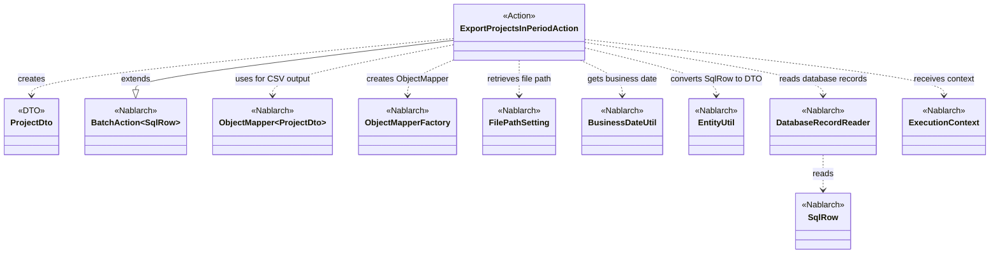
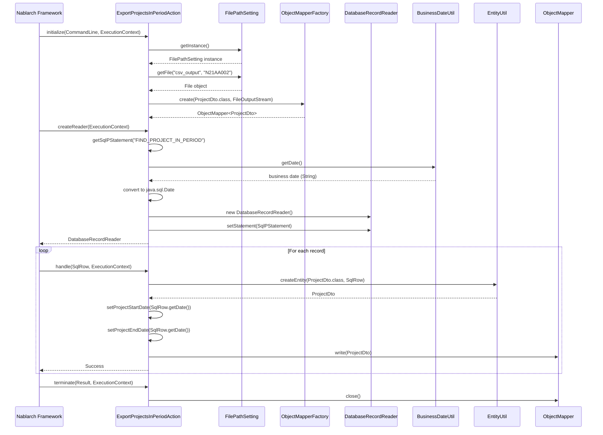

# Code Analysis: ExportProjectsInPeriodAction

**Generated**: 2026-03-03 17:30:23
**Target**: 期間内プロジェクト一覧をCSV出力する都度起動バッチアクション
**Modules**: proman-batch
**Analysis Duration**: 約2分28秒

---

## Overview

ExportProjectsInPeriodActionは、期間内のプロジェクト情報をデータベースから取得し、CSV形式でファイルに出力する都度起動型のバッチアクションです。BatchAction<SqlRow>を継承し、DatabaseRecordReaderでデータを1件ずつ読み込み、ObjectMapperでCSV出力します。業務日付を基準に対象期間のプロジェクトを抽出し、ProjectDtoに変換してファイル出力する標準的なDB-to-FILEパターンの実装です。

---

## Architecture

### Dependency Graph



**Note**: This diagram uses Mermaid `classDiagram` syntax to show class names and their relationships. Use `--|>` for inheritance (extends/implements) and `..>` for dependencies (uses/creates).

### Component Summary

| Component | Role | Type | Dependencies |
|-----------|------|------|--------------|
| ExportProjectsInPeriodAction | バッチアクション | Action | BatchAction, ObjectMapper, DatabaseRecordReader, FilePathSetting, BusinessDateUtil, EntityUtil |
| ProjectDto | プロジェクト情報DTO | DTO | - |
| BatchAction<SqlRow> | バッチ処理基底クラス | Nablarch Framework | DataReader, ExecutionContext |
| ObjectMapper<ProjectDto> | CSV出力マッパー | Nablarch Library | ProjectDto |
| DatabaseRecordReader | DB読み込みリーダー | Nablarch Library | SqlPStatement |
| FilePathSetting | ファイルパス管理 | Nablarch Library | - |
| BusinessDateUtil | 業務日付取得 | Nablarch Library | - |
| EntityUtil | Entity変換ユーティリティ | Nablarch Library | - |

---

## Flow

### Processing Flow

1. **初期化 (initialize)** [:44-54]
   - FilePathSettingから出力ファイルパスを取得
   - ObjectMapperFactoryでCSV出力用ObjectMapperを生成
   - FileOutputStreamを開きMapperに設定

2. **データ読み込み準備 (createReader)** [:57-65]
   - DatabaseRecordReaderのインスタンス生成
   - FIND_PROJECT_IN_PERIOD SQLを取得
   - BusinessDateUtilで業務日付を取得
   - SQL文にバインド変数をセット (開始日と終了日)

3. **1件処理 (handle)** [:68-75]
   - SqlRowからProjectDtoへ変換 (EntityUtil.createEntity)
   - 日付型フィールドを個別にセット (PROJECT_START_DATE, PROJECT_END_DATE)
   - ObjectMapperでDtoをCSV出力
   - Success結果を返却

4. **終了処理 (terminate)** [:78-80]
   - ObjectMapperをクローズしてファイルを確定

### Sequence Diagram



---

## Components

### ExportProjectsInPeriodAction

**File**: [ExportProjectsInPeriodAction.java:31-81](.lw/nab-official/v6/.../ExportProjectsInPeriodAction.java)

**Role**: 期間内プロジェクト一覧をCSV出力するバッチアクション

**Key Methods**:
- `initialize(CommandLine, ExecutionContext)` [:44-54] - ファイルパス取得とObjectMapper初期化
- `createReader(ExecutionContext)` [:57-65] - DatabaseRecordReaderの生成とSQL設定
- `handle(SqlRow, ExecutionContext)` [:68-75] - SqlRowをProjectDtoに変換してCSV出力
- `terminate(Result, ExecutionContext)` [:78-80] - ObjectMapperのクローズ処理

**Dependencies**: BatchAction<SqlRow>, ObjectMapper, FilePathSetting, BusinessDateUtil, DatabaseRecordReader, EntityUtil

**Implementation Points**:
- BatchAction<SqlRow>を継承し、SqlRow単位で処理
- ObjectMapperはフィールドとして保持し、initialize/terminateでライフサイクル管理
- 日付型フィールドは型不一致のため明示的にsetterを呼び出し

### ProjectDto

**File**: [ProjectDto.java](.lw/nab-official/v6/.../ProjectDto.java)

**Role**: プロジェクト情報を保持するDTOクラス

**Key Fields**:
- プロジェクトID、プロジェクト名、プロジェクト種別
- プロジェクト分類、プロジェクト開始日、プロジェクト終了日
- 顧客ID、プロジェクトマネージャー名、プロジェクトリーダー名
- 売上高、発注元組織ID、備考

**Implementation Points**:
- CSV出力用のDTO (データバインド機能で使用)
- EntityUtil.createEntityでSqlRowから自動変換
- 日付型フィールドは個別にsetterで設定が必要

---

## Nablarch Framework Usage

### BatchAction<TData>

**Class**: `nablarch.fw.action.BatchAction<TData>`

**Description**: バッチ処理の基底クラス。DataReaderから読み込んだデータを1件ずつ処理する標準的なテンプレートを提供。

**Code Example**:
```java
public class ExportProjectsInPeriodAction extends BatchAction<SqlRow> {
    @Override
    protected void initialize(CommandLine command, ExecutionContext context) {
        // 初期化処理 (ファイルオープン等)
    }

    @Override
    public DataReader<SqlRow> createReader(ExecutionContext context) {
        // DataReaderの生成と設定
        DatabaseRecordReader reader = new DatabaseRecordReader();
        // SQL設定...
        return reader;
    }

    @Override
    public Result handle(SqlRow record, ExecutionContext context) {
        // 1件分の業務処理
        return new Success();
    }

    @Override
    protected void terminate(Result result, ExecutionContext context) {
        // 終了処理 (リソースクローズ等)
    }
}
```

**Important Points**:
- ✅ **createReader**: DataReaderのインスタンスを返却。DatabaseRecordReaderまたはFileDataReader等を使用
- ✅ **handle**: 1件分のデータに対する業務ロジックを実装。Resultオブジェクトを返却
- ⚠️ **initialize/terminate**: リソースのライフサイクル管理に使用。ファイルオープン/クローズ等
- 💡 **型パラメータ**: 処理対象データ型を指定。SqlRow, Map, JavaBeans等

**Usage in this code**: ExportProjectsInPeriodActionはBatchAction<SqlRow>を継承し、4つのメソッドをオーバーライドしてCSV出力処理を実装。

**Knowledge Base**: [Nablarch Batch - actions section](.claude/skills/nabledge-6/docs/features/processing/nablarch-batch.md#actions)

### ObjectMapper / ObjectMapperFactory

**Class**: `nablarch.common.databind.ObjectMapper`, `nablarch.common.databind.ObjectMapperFactory`

**Description**: CSVやTSV、固定長ファイルとJava Beansオブジェクト間の双方向変換を提供。ObjectMapperFactoryでObjectMapperインスタンスを生成。

**Code Example**:
```java
// CSV出力用のObjectMapper生成
File output = filePathSetting.getFile("csv_output", "N21AA002");
FileOutputStream outputStream = new FileOutputStream(output);
ObjectMapper<ProjectDto> mapper = ObjectMapperFactory.create(ProjectDto.class, outputStream);

// DTOをCSVに書き込み
mapper.write(dto);

// 終了時にクローズ
mapper.close();
```

**Important Points**:
- ✅ **ObjectMapperFactory.create**: 型とストリームを指定してObjectMapperを生成
- ✅ **write**: Java BeansオブジェクトをCSV行として出力
- ⚠️ **close**: 必ずtry-with-resourcesまたはterminateメソッドでクローズすること
- 💡 **アノテーション**: @Csv, @CsvFormatでフォーマット定義可能
- 🎯 **用途**: バッチ処理でのファイル出力、外部システム連携用データファイル生成

**Usage in this code**: initializeでObjectMapper<ProjectDto>を生成し、handleメソッド内でwrite()を呼び出してCSV出力。terminateでclose()してリソース解放。

**Knowledge Base**: [Data Bind - overview section](.claude/skills/nabledge-6/docs/features/libraries/data-bind.md#overview)

### DatabaseRecordReader

**Class**: `nablarch.fw.reader.DatabaseRecordReader`

**Description**: データベースからレコードを1件ずつ読み込むDataReader実装。SqlPStatementを設定して使用。

**Code Example**:
```java
public DataReader<SqlRow> createReader(ExecutionContext context) {
    DatabaseRecordReader reader = new DatabaseRecordReader();
    SqlPStatement statement = getSqlPStatement("FIND_PROJECT_IN_PERIOD");

    // バインド変数設定
    Date bizDate = new Date(DateUtil.getDate(BusinessDateUtil.getDate()).getTime());
    statement.setDate(1, bizDate);
    statement.setDate(2, bizDate);

    reader.setStatement(statement);
    return reader;
}
```

**Important Points**:
- ✅ **SqlPStatement設定**: getSqlPStatement()でSQL文を取得し、setStatement()で設定
- ✅ **バインド変数**: statement.setXxx()でバインド変数を設定
- 💡 **読み込み**: フレームワークがread()を呼び出し、1件ずつSqlRowを取得
- 🎯 **用途**: DB to FILEパターン、DB to DBパターンのバッチ処理
- ⚡ **性能**: 大量データでも1件ずつ処理するためメモリ使用量が少ない

**Usage in this code**: createReaderメソッドでDatabaseRecordReaderを生成し、FIND_PROJECT_IN_PERIOD SQLと業務日付をバインド。フレームワークが自動的にレコードを読み込んでhandleメソッドに渡す。

**Knowledge Base**: [Nablarch Batch - data-readers section](.claude/skills/nabledge-6/docs/features/processing/nablarch-batch.md#data-readers)

### FilePathSetting

**Class**: `nablarch.core.util.FilePathSetting`

**Description**: ファイルパスを論理名で管理する機能。環境依存のパスを設定ファイルで切り替え可能。

**Code Example**:
```java
FilePathSetting filePathSetting = FilePathSetting.getInstance();
File output = filePathSetting.getFile("csv_output", "N21AA002");
```

**Important Points**:
- ✅ **論理名**: "csv_output"等の論理名でファイルパスを取得
- ✅ **getInstance**: シングルトンパターンでインスタンス取得
- 💡 **拡張子**: 設定ファイルで論理名に対応する拡張子を定義
- 🎯 **用途**: 環境ごとのパス切り替え、バッチ出力ファイルのパス管理

**Usage in this code**: initializeメソッドでFilePathSetting.getInstance()を取得し、getFile("csv_output", "N21AA002")で出力ファイルパスを取得。

**Knowledge Base**: [File Path Management - usage section](.claude/skills/nabledge-6/docs/features/libraries/file-path-management.md#usage)

### BusinessDateUtil

**Class**: `nablarch.core.date.BusinessDateUtil`

**Description**: 業務日付を取得するユーティリティ。データベースまたは設定ファイルから業務日付を取得。

**Code Example**:
```java
String bizDate = BusinessDateUtil.getDate();  // yyyyMMdd形式
Date sqlDate = new Date(DateUtil.getDate(bizDate).getTime());
```

**Important Points**:
- ✅ **getDate()**: デフォルト区分の業務日付を取得 (yyyyMMdd形式の文字列)
- 💡 **区分指定**: getDate(String segment)で区分を指定可能
- 🎯 **用途**: バッチ処理の対象期間指定、業務日ベースのデータ抽出
- ⚠️ **変換**: java.sql.Dateに変換する場合はDateUtil経由で変換

**Usage in this code**: createReaderメソッドでBusinessDateUtil.getDate()を呼び出し、業務日付をSQLのバインド変数に設定。期間内プロジェクト抽出の基準日として使用。

**Knowledge Base**: [Business Date - business_date_usage section](.claude/skills/nabledge-6/docs/features/libraries/business-date.md#business_date_usage)

### EntityUtil

**Class**: `nablarch.common.dao.EntityUtil`

**Description**: SqlRowからEntityオブジェクトへの変換を行うユーティリティ。カラム名とプロパティ名を自動マッピング。

**Code Example**:
```java
ProjectDto dto = EntityUtil.createEntity(ProjectDto.class, record);
// 型不一致フィールドは個別設定
dto.setProjectStartDate(record.getDate("PROJECT_START_DATE"));
dto.setProjectEndDate(record.getDate("PROJECT_END_DATE"));
```

**Important Points**:
- ✅ **createEntity**: SqlRowから型引数で指定したEntityクラスのインスタンスを生成
- ⚠️ **型変換制限**: 型が一致しないフィールドは自動変換されないため個別設定が必要
- 💡 **命名規則**: カラム名 (SNAKE_CASE) とプロパティ名 (camelCase) を自動マッピング
- 🎯 **用途**: DatabaseRecordReaderで読み込んだSqlRowをDTOに変換

**Usage in this code**: handleメソッドでEntityUtil.createEntity()を使用してSqlRowをProjectDtoに変換。日付型フィールドは型不一致のため個別にsetterを呼び出し。

**Knowledge Base**: (EntityUtilは汎用DAO機能の一部)

---

## References

### Source Files

- [ExportProjectsInPeriodAction.java (.lw/nab-official/v6/nablarch-system-development-guide/en/Sample_Project/Source_Code/proman-project/proman-batch/src/main/java/com/nablarch/example/proman/batch/project)](../../../../../../../../../../../../../.lw/nab-official/v6/nablarch-system-development-guide/en/Sample_Project/Source_Code/proman-project/proman-batch/src/main/java/com/nablarch/example/proman/batch/project/ExportProjectsInPeriodAction.java) - ExportProjectsInPeriodAction
- [ExportProjectsInPeriodAction.java (.lw/nab-official/v6/nablarch-system-development-guide/Sample_Project/Source_Code/proman-project/proman-batch/src/main/java/com/nablarch/example/proman/batch/project)](../../../../../../../../../../../../../.lw/nab-official/v6/nablarch-system-development-guide/Sample_Project/Source_Code/proman-project/proman-batch/src/main/java/com/nablarch/example/proman/batch/project/ExportProjectsInPeriodAction.java) - ExportProjectsInPeriodAction
- [ProjectDto.java (.lw/nab-official/v6/nablarch-system-development-guide/en/Sample_Project/Source_Code/proman-project/proman-batch/src/main/java/com/nablarch/example/proman/batch/project)](../../../../../../../../../../../../../.lw/nab-official/v6/nablarch-system-development-guide/en/Sample_Project/Source_Code/proman-project/proman-batch/src/main/java/com/nablarch/example/proman/batch/project/ProjectDto.java) - ProjectDto
- [ProjectDto.java (.lw/nab-official/v6/nablarch-system-development-guide/Sample_Project/Source_Code/proman-project/proman-batch/src/main/java/com/nablarch/example/proman/batch/project)](../../../../../../../../../../../../../.lw/nab-official/v6/nablarch-system-development-guide/Sample_Project/Source_Code/proman-project/proman-batch/src/main/java/com/nablarch/example/proman/batch/project/ProjectDto.java) - ProjectDto

### Knowledge Base (Nabledge-6)

- [Nablarch Batch](../../../../../../../../../../../../../.claude/skills/nabledge-6/docs/features/processing/nablarch-batch.md)
- [Data Bind](../../../../../../../../../../../../../.claude/skills/nabledge-6/docs/features/libraries/data-bind.md)
- [Business Date](../../../../../../../../../../../../../.claude/skills/nabledge-6/docs/features/libraries/business-date.md)
- [File Path Management](../../../../../../../../../../../../../.claude/skills/nabledge-6/docs/features/libraries/file-path-management.md)
- [Data Read Handler](../../../../../../../../../../../../../.claude/skills/nabledge-6/docs/features/handlers/batch/data-read-handler.md)

### Official Documentation

(No official documentation links available)

---

**Note**: This documentation was generated by the code-analysis workflow of the nabledge-6 skill.
