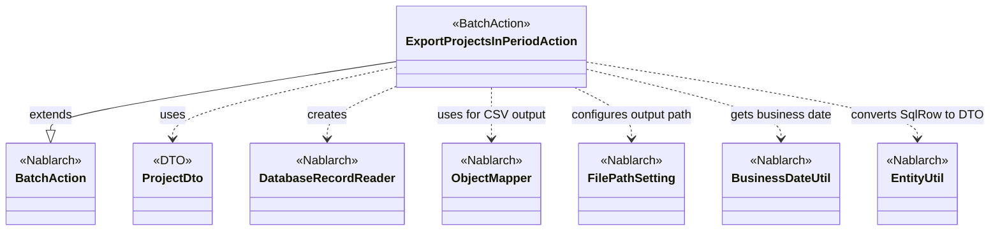
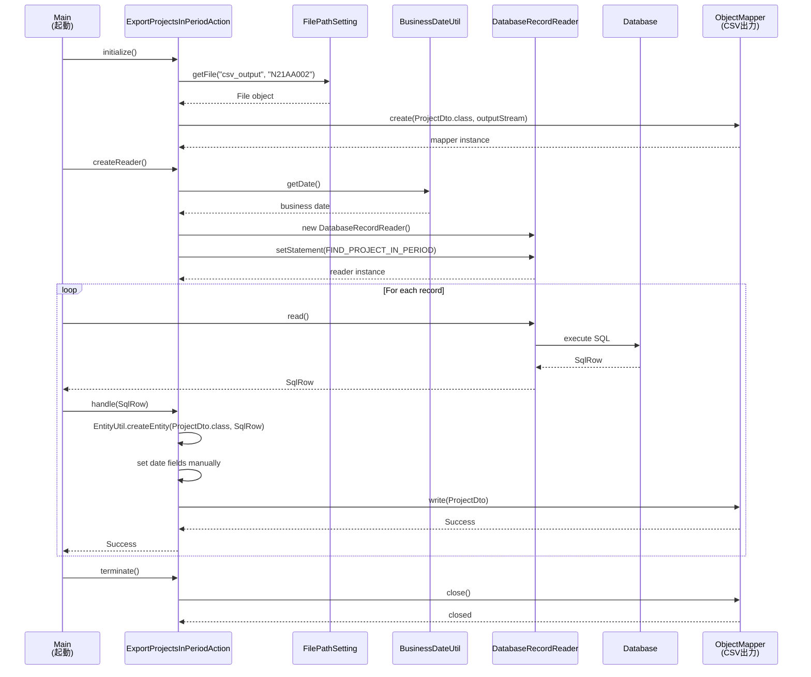

# Code Analysis: ExportProjectsInPeriodAction

**Generated**: 2026-03-03 17:30:47
**Target**: 期間内プロジェクト一覧CSV出力バッチアクション
**Modules**: proman-batch
**Analysis Duration**: 約2分41秒

---

## Overview

ExportProjectsInPeriodActionは、データベースから期間内のプロジェクト情報を抽出し、CSV形式で出力する都度起動型バッチアクションです。Nablarchバッチフレームワークの標準的な「DB to FILE」パターンを実装しており、DatabaseRecordReaderでデータを1件ずつ読み込み、ObjectMapperでCSV出力を行います。業務日付を使用して対象期間を動的に決定し、FilePathSettingで設定された出力先にファイルを生成します。

---

## Architecture

### Dependency Graph



**Note**: This diagram uses Mermaid `classDiagram` syntax to show class names and their relationships. Use `--|>` for inheritance (extends/implements) and `..>` for dependencies (uses/creates).

### Component Summary

| Component | Role | Type | Dependencies |
|-----------|------|------|--------------|
| ExportProjectsInPeriodAction | 期間内プロジェクト一覧CSV出力 | Action | DatabaseRecordReader, ObjectMapper, FilePathSetting, BusinessDateUtil, EntityUtil |
| ProjectDto | プロジェクト情報データ転送オブジェクト | DTO | なし |
| FIND_PROJECT_IN_PERIOD | 期間内プロジェクト検索クエリ | SQL | なし |

---

## Flow

### Processing Flow

1. **初期化フェーズ** (initialize)
   - FilePathSettingから出力先パスを取得
   - ProjectDto用のObjectMapperを生成し、CSV出力ストリームを準備

2. **データ読み込みフェーズ** (createReader)
   - BusinessDateUtilで業務日付を取得
   - DatabaseRecordReaderを生成し、FIND_PROJECT_IN_PERIOD SQLを設定
   - 業務日付をパラメータとして設定（プロジェクト開始日≦業務日付≦プロジェクト終了日）

3. **処理フェーズ** (handle - レコードごとに実行)
   - SqlRowをProjectDtoに変換（EntityUtil.createEntity）
   - 日付型カラムを個別設定（EntityUtilでは型変換できないため）
   - ObjectMapperでProjectDtoをCSV行として出力

4. **終了フェーズ** (terminate)
   - ObjectMapperをクローズしてリソース解放

### Sequence Diagram



---

## Components

### 1. ExportProjectsInPeriodAction

**File**: [ExportProjectsInPeriodAction.java](../../../../../../../../../../../.lw/nab-official/v6/nablarch-system-development-guide/Sample_Project/Source_Code/proman-project/proman-batch/src/main/java/com/nablarch/example/proman/batch/project/ExportProjectsInPeriodAction.java)

**Role**: 期間内プロジェクト一覧出力の都度起動バッチアクションクラス

**Key Methods**:
- `initialize()` [:44-54] - ファイル出力先の準備とObjectMapper生成
- `createReader()` [:57-65] - DatabaseRecordReaderを生成してSQLを設定
- `handle()` [:68-75] - 1レコードをProjectDtoに変換してCSV出力
- `terminate()` [:78-80] - ObjectMapperをクローズ

**Dependencies**:
- BatchAction<SqlRow> - 親クラス（Nablarchバッチアクション基底クラス）
- DatabaseRecordReader - データベースからレコードを読み込むリーダー
- ObjectMapper<ProjectDto> - CSV出力用マッパー
- FilePathSetting - ファイルパス管理
- BusinessDateUtil - 業務日付取得
- EntityUtil - SqlRowからDTOへの変換

**Key Implementation Points**:
- BatchAction<SqlRow>を継承し、createReader/handle/terminateをオーバーライド
- initializeでObjectMapperを生成し、フィールドに保持
- handleでEntityUtil.createEntityを使用してSqlRow→DTO変換
- 日付型フィールドはEntityUtilで変換できないため、個別にsetterで設定

### 2. ProjectDto

**File**: [ProjectDto.java](../../../../../../../../../../../.lw/nab-official/v6/nablarch-system-development-guide/Sample_Project/Source_Code/proman-project/proman-batch/src/main/java/com/nablarch/example/proman/batch/project/ProjectDto.java)

**Role**: プロジェクト情報データ転送オブジェクト（CSV出力用）

**Key Points**:
- @Csvアノテーションでフォーマット定義
- EntityUtilで自動マッピングできるフィールドとできないフィールドが混在
- 日付型フィールド（projectStartDate, projectEndDate）は個別設定が必要

---

## Nablarch Framework Usage

### BatchAction

**クラス**: `nablarch.fw.action.BatchAction`

**説明**: 汎用的なバッチアクションのテンプレートクラス。DataReaderから渡されたデータに対する業務ロジックを実装する。

**使用方法**:
```java
public class ExportProjectsInPeriodAction extends BatchAction<SqlRow> {
    @Override
    public DataReader<SqlRow> createReader(ExecutionContext context) {
        // DataReaderを生成して返却
    }

    @Override
    public Result handle(SqlRow record, ExecutionContext context) {
        // 1レコードごとの処理
        return new Success();
    }
}
```

**重要ポイント**:
- ✅ **createReader()でDataReaderを返す**: データソースの読み込み方法を定義
- ✅ **handle()で1件ごとの処理**: レコード単位でループ実行される
- 💡 **初期化と終了処理**: initialize()とterminate()をオーバーライドしてリソース管理
- 🎯 **いつ使うか**: DB to FILE、FILE to DB、DB to DBなどの標準的なバッチ処理パターン

**このコードでの使い方**:
- BatchAction<SqlRow>を継承し、SqlRowを処理対象とする
- createReader()でDatabaseRecordReaderを生成
- handle()でSqlRow→ProjectDto変換とCSV出力
- initialize()でObjectMapper生成、terminate()でクローズ

**詳細**: [Nablarch Batch](../../../../../../../../../../../.claude/skills/nabledge-6/docs/features/processing/nablarch-batch.md)

### DatabaseRecordReader

**クラス**: `nablarch.fw.reader.DatabaseRecordReader`

**説明**: データベースからデータを読み込むデータリーダー。SQLを実行し、結果セットを1件ずつ返却する。

**使用方法**:
```java
DatabaseRecordReader reader = new DatabaseRecordReader();
SqlPStatement statement = getSqlPStatement("SQL_ID");
statement.setDate(1, bizDate);
reader.setStatement(statement);
return reader;
```

**重要ポイント**:
- ✅ **getSqlPStatement()でSQL取得**: SQL_IDから実行可能なステートメントを取得
- ✅ **パラメータバインド**: setDate/setString等でバインド変数を設定
- ⚡ **大量データ処理**: フェッチサイズを適切に設定することで性能改善
- 💡 **メモリ効率**: 結果セット全体をメモリに保持せず、1件ずつストリーミング処理

**このコードでの使い方**:
- createReader()でDatabaseRecordReaderを生成
- getSqlPStatement("FIND_PROJECT_IN_PERIOD")でSQL取得
- 業務日付を2つのパラメータにバインド（開始日≦業務日付≦終了日）

**詳細**: [Nablarch Batch](../../../../../../../../../../../.claude/skills/nabledge-6/docs/features/processing/nablarch-batch.md)

### ObjectMapper

**クラス**: `nablarch.common.databind.ObjectMapper`

**説明**: CSVやTSV、固定長データをJava Beansとして扱う機能を提供する。

**使用方法**:
```java
// 生成
ObjectMapper<ProjectDto> mapper = ObjectMapperFactory.create(ProjectDto.class, outputStream);

// 書き込み
mapper.write(dto);

// クローズ
mapper.close();
```

**重要ポイント**:
- ✅ **必ずclose()を呼ぶ**: バッファをフラッシュし、リソースを解放する（terminate()で実施）
- ⚠️ **大量データ処理時**: メモリに全データを保持しないため、大量データでも問題なく処理可能
- ⚠️ **型変換の制限**: EntityUtilと同様に、複雑な型変換が必要な項目は個別設定が必要
- 💡 **アノテーション駆動**: @Csv, @CsvFormatでフォーマットを宣言的に定義できる
- 💡 **保守性の高さ**: フォーマット変更時はアノテーションを変更するだけで対応可能

**このコードでの使い方**:
- initialize()でProjectDto用のObjectMapperを生成（Line 44-54）
- handle()で各レコードをmapper.write(dto)で出力（Line 73）
- terminate()でmapper.close()してリソース解放（Line 79）

**詳細**: [Data Bind](../../../../../../../../../../../.claude/skills/nabledge-6/docs/features/libraries/data-bind.md)

### FilePathSetting

**クラス**: `nablarch.core.util.FilePathSetting`

**説明**: ファイルパスを論理名で管理し、環境ごとに異なるパスをコンポーネント設定ファイルで切り替える。

**使用方法**:
```java
FilePathSetting filePathSetting = FilePathSetting.getInstance();
File output = filePathSetting.getFile("csv_output", "N21AA002");
```

**重要ポイント**:
- 💡 **環境非依存**: 論理名を使うことでコード変更なしに環境ごとのパスを切り替え
- ✅ **コンポーネント設定が必要**: システムリポジトリにbasePathSettingsとfileExtensionsを設定
- 🎯 **いつ使うか**: バッチのファイル入出力、画面のアップロード/ダウンロード
- ⚠️ **拡張子の扱い**: 論理名に紐づく拡張子が自動付与される

**このコードでの使い方**:
- initialize()でFilePathSetting.getInstance()を取得
- getFile("csv_output", "N21AA002")で出力先Fileオブジェクトを取得
- "csv_output"は論理名、"N21AA002"はファイル名（拡張子なし）

**詳細**: [File Path Management](../../../../../../../../../../../.claude/skills/nabledge-6/docs/features/libraries/file-path-management.md)

### BusinessDateUtil

**クラス**: `nablarch.core.date.BusinessDateUtil`

**説明**: システム全体で統一された業務日付を取得する機能を提供する。

**使用方法**:
```java
// デフォルト区分の業務日付
String bizDate = BusinessDateUtil.getDate();
// → "20260303"（yyyyMMdd形式）
```

**重要ポイント**:
- 💡 **システム横断の日付統一**: System.currentTimeMillis()やLocalDate.now()ではなく、これを使うことでバッチ処理と画面処理で同じ業務日付を共有できる
- ✅ **必ずDatabaseRecordReaderのパラメータに変換**: 取得した文字列はjava.sql.Dateに変換してSQLパラメータに設定する
- 🎯 **いつ使うか**: 日付ベースの検索条件、レポート生成、ファイル名の日付部分など
- ⚠️ **設定が必要**: システムリポジトリに業務日付テーブルまたは固定値を設定する必要がある

**このコードでの使い方**:
- createReader()で業務日付を取得（Line 60）
- java.sql.Dateに変換してSQLパラメータに設定（Line 60-62）
- プロジェクトの開始日・終了日との比較条件として使用

**詳細**: [Business Date](../../../../../../../../../../../.claude/skills/nabledge-6/docs/features/libraries/business-date.md)

### EntityUtil

**クラス**: `nablarch.common.dao.EntityUtil`

**説明**: SqlRowからEntityやDTOへの自動マッピングを提供する。

**使用方法**:
```java
ProjectDto dto = EntityUtil.createEntity(ProjectDto.class, record);
```

**重要ポイント**:
- 💡 **自動マッピング**: カラム名とプロパティ名が一致する項目を自動変換
- ⚠️ **型変換の制限**: 複雑な型変換（java.sql.Date→java.util.Date等）は自動変換できない
- ✅ **個別設定が必要**: 自動変換できない項目は個別にsetterで設定する
- 🎯 **いつ使うか**: SqlRowをEntityやDTOに変換する全てのケース

**このコードでの使い方**:
- handle()でEntityUtil.createEntity()を使用（Line 69）
- 日付型フィールドは自動変換できないため、個別にsetterで設定（Line 71-72）

**詳細**: [Nablarch Batch](../../../../../../../../../../../.claude/skills/nabledge-6/docs/features/processing/nablarch-batch.md)

---

## References

### Source Files

- [ExportProjectsInPeriodAction.java (.lw/nab-official/v6/nablarch-system-development-guide/en/Sample_Project/Source_Code/proman-project/proman-batch/src/main/java/com/nablarch/example/proman/batch/project)](../../../../../../../../../../../.lw/nab-official/v6/nablarch-system-development-guide/en/Sample_Project/Source_Code/proman-project/proman-batch/src/main/java/com/nablarch/example/proman/batch/project/ExportProjectsInPeriodAction.java) - ExportProjectsInPeriodAction
- [ExportProjectsInPeriodAction.java (.lw/nab-official/v6/nablarch-system-development-guide/Sample_Project/Source_Code/proman-project/proman-batch/src/main/java/com/nablarch/example/proman/batch/project)](../../../../../../../../../../../.lw/nab-official/v6/nablarch-system-development-guide/Sample_Project/Source_Code/proman-project/proman-batch/src/main/java/com/nablarch/example/proman/batch/project/ExportProjectsInPeriodAction.java) - ExportProjectsInPeriodAction
- [ProjectDto.java (.lw/nab-official/v6/nablarch-system-development-guide/en/Sample_Project/Source_Code/proman-project/proman-batch/src/main/java/com/nablarch/example/proman/batch/project)](../../../../../../../../../../../.lw/nab-official/v6/nablarch-system-development-guide/en/Sample_Project/Source_Code/proman-project/proman-batch/src/main/java/com/nablarch/example/proman/batch/project/ProjectDto.java) - ProjectDto
- [ProjectDto.java (.lw/nab-official/v6/nablarch-system-development-guide/Sample_Project/Source_Code/proman-project/proman-batch/src/main/java/com/nablarch/example/proman/batch/project)](../../../../../../../../../../../.lw/nab-official/v6/nablarch-system-development-guide/Sample_Project/Source_Code/proman-project/proman-batch/src/main/java/com/nablarch/example/proman/batch/project/ProjectDto.java) - ProjectDto

### Knowledge Base (Nabledge-6)

- [Nablarch Batch](../../../../../../../../../../../.claude/skills/nabledge-6/docs/features/processing/nablarch-batch.md)
- [Data Bind](../../../../../../../../../../../.claude/skills/nabledge-6/docs/features/libraries/data-bind.md)
- [File Path Management](../../../../../../../../../../../.claude/skills/nabledge-6/docs/features/libraries/file-path-management.md)
- [Business Date](../../../../../../../../../../../.claude/skills/nabledge-6/docs/features/libraries/business-date.md)

### Official Documentation

(No official documentation links available)

---

**Note**: This documentation was generated by the code-analysis workflow of the nabledge-6 skill.
