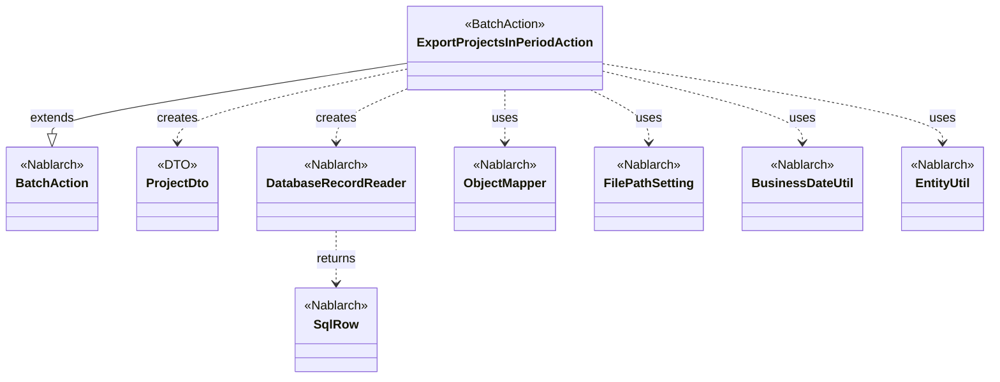
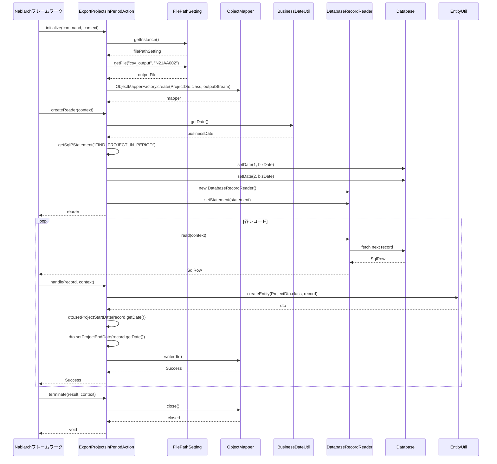

# Code Analysis: ExportProjectsInPeriodAction

**Generated**: 2026-03-03 17:30:44
**Target**: 期間内プロジェクト一覧をCSVファイルに出力する都度起動バッチアクション
**Modules**: proman-batch
**Analysis Duration**: 約2分46秒

---

## Overview

このバッチアクションは、業務日付を基準に期間内に実施されるプロジェクト情報をデータベースから抽出し、CSV形式でファイル出力する都度起動型バッチです。Nablarchバッチフレームワークの`BatchAction<SqlRow>`を継承し、DB to FILEパターンを実装しています。

主な処理フロー:
1. **初期化** (`initialize`): ファイルパス設定から出力先を取得し、ObjectMapperを生成
2. **データ読み込み** (`createReader`): 業務日付を使用してSQLで期間内プロジェクトを検索
3. **1件ごとの処理** (`handle`): 検索結果をDTOに変換し、CSVに書き込み
4. **終了処理** (`terminate`): ObjectMapperをクローズしてリソース解放

---

## Architecture

### Dependency Graph



**Note**: This diagram uses Mermaid `classDiagram` syntax to show class names and their relationships. Use `--|>` for inheritance (extends/implements) and `..>` for dependencies (uses/creates).

### Component Summary

| Component | Role | Type | Dependencies |
|-----------|------|------|--------------|
| ExportProjectsInPeriodAction | CSV出力バッチアクション | Action | BatchAction, DatabaseRecordReader, ObjectMapper, FilePathSetting, BusinessDateUtil, EntityUtil |
| ProjectDto | プロジェクト情報DTO | DTO | なし |
| DatabaseRecordReader | DB検索結果読み込み | DataReader | SqlPStatement |
| ObjectMapper | CSV出力 | Nablarchライブラリ | FileOutputStream |
| FilePathSetting | ファイルパス管理 | Nablarchライブラリ | なし |
| BusinessDateUtil | 業務日付取得 | Nablarchライブラリ | なし |
| EntityUtil | SQLRow→DTO変換 | Nablarchライブラリ | なし |

---

## Flow

### Processing Flow

1. **バッチ起動** - コマンドラインから都度起動バッチとして実行
2. **初期化** (`initialize`) - ファイルパス設定から出力先CSVファイルを取得し、ObjectMapperを生成
3. **DataReader生成** (`createReader`) - 業務日付を使用してSQL (FIND_PROJECT_IN_PERIOD) を実行し、DatabaseRecordReaderを返却
4. **ループ処理** - フレームワークがDataReaderから1件ずつレコードを取得し、`handle`を呼び出し
5. **1件処理** (`handle`) - SqlRowをProjectDtoに変換し、日付項目を個別設定後、ObjectMapperで CSV出力
6. **終了処理** (`terminate`) - ObjectMapperをクローズしてファイルバッファをフラッシュ
7. **バッチ終了** - 処理結果を返却して終了

### Sequence Diagram



---

## Components

### ExportProjectsInPeriodAction

**File**: [ExportProjectsInPeriodAction.java:31-81](../../../../../../../../.lw/nab-official/v6/nablarch-system-development-guide/Sample_Project/Source_Code/proman-project/proman-batch/src/main/java/com/nablarch/example/proman/batch/project/ExportProjectsInPeriodAction.java#L31-L81)

**Role**: 期間内プロジェクト一覧を抽出してCSV出力するバッチアクション

**Key Methods**:
- `initialize(CommandLine, ExecutionContext)` [:44-54](../../../../../../../../.lw/nab-official/v6/nablarch-system-development-guide/Sample_Project/Source_Code/proman-project/proman-batch/src/main/java/com/nablarch/example/proman/batch/project/ExportProjectsInPeriodAction.java#L44-L54) - FilePathSettingからファイルを取得し、ObjectMapperを初期化
- `createReader(ExecutionContext)` [:57-65](../../../../../../../../.lw/nab-official/v6/nablarch-system-development-guide/Sample_Project/Source_Code/proman-project/proman-batch/src/main/java/com/nablarch/example/proman/batch/project/ExportProjectsInPeriodAction.java#L57-L65) - 業務日付を使用してDatabaseRecordReaderを生成
- `handle(SqlRow, ExecutionContext)` [:68-75](../../../../../../../../.lw/nab-official/v6/nablarch-system-development-guide/Sample_Project/Source_Code/proman-project/proman-batch/src/main/java/com/nablarch/example/proman/batch/project/ExportProjectsInPeriodAction.java#L68-L75) - SqlRowをProjectDtoに変換してCSV出力
- `terminate(Result, ExecutionContext)` [:78-80](../../../../../../../../.lw/nab-official/v6/nablarch-system-development-guide/Sample_Project/Source_Code/proman-project/proman-batch/src/main/java/com/nablarch/example/proman/batch/project/ExportProjectsInPeriodAction.java#L78-L80) - ObjectMapperをクローズ

**Dependencies**: BatchAction, DatabaseRecordReader, ObjectMapper, FilePathSetting, BusinessDateUtil, EntityUtil

**Implementation Points**:
- `BatchAction<SqlRow>`を継承してDB to FILEパターンを実装
- 業務日付を使用してSQL実行時のパラメータを設定
- EntityUtilで自動変換できない日付項目は個別にsetterを呼び出し
- リソース解放を`terminate`で確実に実施

### ProjectDto

**File**: [ProjectDto.java](../../../../../../../../.lw/nab-official/v6/nablarch-system-development-guide/Sample_Project/Source_Code/proman-project/proman-batch/src/main/java/com/nablarch/example/proman/batch/project/ProjectDto.java)

**Role**: CSV出力用のプロジェクト情報を保持するDTO

**Key Fields**: プロジェクトID、プロジェクト名、プロジェクト種別、開始日、終了日など

**Dependencies**: なし

**Implementation Points**:
- CSV出力のフォーマットを`@Csv`アノテーションで定義（推測）
- EntityUtilで自動変換できないDate型項目用のsetterを提供

---

## Nablarch Framework Usage

### BatchAction

**クラス**: `nablarch.fw.action.BatchAction<TData>`

**説明**: Nablarchバッチアプリケーションの基底クラス。ライフサイクルメソッド（initialize, createReader, handle, terminate）を提供し、バッチ処理のテンプレートパターンを実装。

**使用方法**:
```java
public class ExportProjectsInPeriodAction extends BatchAction<SqlRow> {
    @Override
    protected void initialize(CommandLine command, ExecutionContext context) {
        // 初期化処理（ファイル設定、ObjectMapper生成など）
    }

    @Override
    public DataReader<SqlRow> createReader(ExecutionContext context) {
        // DataReaderの生成（データソースの設定）
        return new DatabaseRecordReader();
    }

    @Override
    public Result handle(SqlRow record, ExecutionContext context) {
        // 1件ごとの処理
        return new Success();
    }

    @Override
    protected void terminate(Result result, ExecutionContext context) {
        // 終了処理（リソース解放）
    }
}
```

**重要ポイント**:
- ✅ **ライフサイクル遵守**: initialize → createReader → (handle × N) → terminate の順で実行される
- ⚠️ **リソース管理**: initializeで確保したリソースはterminateで必ず解放する
- 💡 **型パラメータ**: `<TData>`にはDataReaderが返すデータ型を指定（SqlRow, Beanなど）
- 🎯 **都度起動バッチ**: コマンドラインから1回実行して終了する用途に適している

**このコードでの使い方**:
- `BatchAction<SqlRow>`を継承して都度起動バッチを実装
- initializeでファイル出力の準備、createReaderでDB検索、handleで1件処理、terminateでリソース解放

**詳細**: [Nablarchバッチ処理知識ベース](../../../../../../../../.claude/skills/nabledge-6/docs/features/processing/nablarch-batch.md)

### DatabaseRecordReader

**クラス**: `nablarch.fw.reader.DatabaseRecordReader`

**説明**: データベースから検索結果を1件ずつ読み込むDataReaderの実装。SqlPStatementを設定することでSQL実行結果をバッチ処理のデータソースとして使用できる。

**使用方法**:
```java
DatabaseRecordReader reader = new DatabaseRecordReader();
SqlPStatement statement = getSqlPStatement("FIND_PROJECT_IN_PERIOD");
statement.setDate(1, bizDate);
statement.setDate(2, bizDate);
reader.setStatement(statement);
return reader;
```

**重要ポイント**:
- ✅ **1件ずつ読み込み**: ResultSetをカーソルとして扱い、メモリ効率的に大量データを処理
- ⚠️ **パラメータ設定**: setStatementの前にSqlPStatementのパラメータを設定する
- 💡 **トランザクション制御**: LoopHandlerと組み合わせてコミット間隔を制御可能
- ⚡ **パフォーマンス**: フェッチサイズを調整することでDB-アプリ間の通信回数を削減可能

**このコードでの使い方**:
- `createReader`でDatabaseRecordReaderを生成
- SQL ID "FIND_PROJECT_IN_PERIOD"でプリペアドステートメントを取得
- 業務日付を2つのパラメータに設定してSQL実行

**詳細**: [Nablarchバッチ処理知識ベース - DataReader](../../../../../../../../.claude/skills/nabledge-6/docs/features/processing/nablarch-batch.md#data-readers)

### ObjectMapper / ObjectMapperFactory

**クラス**: `nablarch.common.databind.ObjectMapper<T>`, `nablarch.common.databind.ObjectMapperFactory`

**説明**: Java BeansとCSV/TSV/固定長データの相互変換を行うデータバインド機能。ストリーム指向のAPIで大量データを効率的に処理できる。

**使用方法**:
```java
FileOutputStream outputStream = new FileOutputStream(outputFile);
ObjectMapper<ProjectDto> mapper = ObjectMapperFactory.create(ProjectDto.class, outputStream);
mapper.write(dto);  // 1件書き込み
mapper.close();     // リソース解放
```

**重要ポイント**:
- ✅ **必ずclose()を呼ぶ**: バッファをフラッシュし、リソースを解放する（terminateで実施）
- ⚠️ **型変換の制限**: EntityUtilと同様に、一部の型変換は自動で行われないため個別設定が必要
- 💡 **アノテーション駆動**: `@Csv`, `@CsvFormat`でフォーマットを宣言的に定義できる
- ⚡ **大量データ対応**: ストリーム処理のためメモリに全データを保持せず、大量データでも問題なく処理可能

**このコードでの使い方**:
- initializeでProjectDto用のObjectMapperを生成
- handleで各レコードを`mapper.write(dto)`で出力
- terminateで`mapper.close()`してリソース解放

**詳細**: [データバインド知識ベース](../../../../../../../../.claude/skills/nabledge-6/docs/features/libraries/data-bind.md)

### FilePathSetting

**クラス**: `nablarch.core.util.FilePathSetting`

**説明**: ファイルパスを論理名で管理する機能。環境ごとに異なる物理パスを設定ファイルで切り替え可能。

**使用方法**:
```java
FilePathSetting filePathSetting = FilePathSetting.getInstance();
File outputFile = filePathSetting.getFile("csv_output", "N21AA002");
```

**重要ポイント**:
- ✅ **論理名で管理**: "csv_output"のような論理名でディレクトリを定義し、環境切り替えを容易にする
- ⚠️ **事前設定が必要**: システムリポジトリでbasePathSettingsを設定する必要がある
- 💡 **ファイル名結合**: 第1引数の論理名ディレクトリと第2引数のファイル名を結合してFileオブジェクトを返す
- 🎯 **環境依存性の排除**: 開発・本番環境でコード変更なしにファイルパスを切り替え可能

**このコードでの使い方**:
- initializeでFilePathSetting.getInstance()を取得
- getFile("csv_output", "N21AA002")でCSV出力先ファイルを取得

**詳細**: [ファイルパス管理知識ベース](../../../../../../../../.claude/skills/nabledge-6/docs/features/libraries/file-path-management.md)

### BusinessDateUtil

**クラス**: `nablarch.core.date.BusinessDateUtil`

**説明**: アプリケーション全体で共通の業務日付を取得する機能。データベースまたはシステムプロパティから業務日付を取得可能。

**使用方法**:
```java
String businessDate = BusinessDateUtil.getDate();  // "20260303"形式
Date bizDate = new Date(DateUtil.getDate(businessDate).getTime());
```

**重要ポイント**:
- ✅ **一貫性の保証**: システム全体で同じ業務日付を使用することで日付のズレを防止
- ⚠️ **設定が必要**: BusinessDateProviderをシステムリポジトリに登録する必要がある
- 💡 **テスト容易性**: 業務日付を外部から設定できるため、日付依存のテストが容易
- 🎯 **バッチ処理での使用**: 夜間バッチでは前日日付、日中バッチでは当日日付など業務要件に応じた日付を取得

**このコードでの使い方**:
- createReaderで`BusinessDateUtil.getDate()`を取得
- SQL実行時のパラメータとして業務日付を2箇所に設定（開始日・終了日の範囲検索）

**詳細**: [業務日付管理知識ベース](../../../../../../../../.claude/skills/nabledge-6/docs/features/libraries/business-date.md)

### EntityUtil

**クラス**: `nablarch.common.dao.EntityUtil`

**説明**: SqlRowからEntityまたはDTOへの変換を行うユーティリティ。カラム名とプロパティ名のマッピングを自動で行う。

**使用方法**:
```java
ProjectDto dto = EntityUtil.createEntity(ProjectDto.class, record);
// 型変換できない項目は個別設定
dto.setProjectStartDate(record.getDate("PROJECT_START_DATE"));
dto.setProjectEndDate(record.getDate("PROJECT_END_DATE"));
```

**重要ポイント**:
- ✅ **自動マッピング**: カラム名（スネークケース）とプロパティ名（キャメルケース）を自動変換
- ⚠️ **型変換の制限**: SqlRowとDTOで型が異なる場合、自動変換できないため個別設定が必要
- 💡 **UniversalDao関連**: UniversalDaoと同じマッピングロジックを使用
- 🎯 **バッチ処理に便利**: DatabaseRecordReaderから取得したSqlRowをDTOに簡単に変換

**このコードでの使い方**:
- handleで`EntityUtil.createEntity(ProjectDto.class, record)`を呼び出し
- 日付項目（PROJECT_START_DATE, PROJECT_END_DATE）はDTOと型が異なるため個別にsetterを呼び出し

**詳細**: [ユニバーサルDAO知識ベース](../../../../../../../../.claude/skills/nabledge-6/docs/features/libraries/universal-dao.md)

---

## References

### Source Files

- [ExportProjectsInPeriodAction.java (.lw/nab-official/v6/nablarch-system-development-guide/en/Sample_Project/Source_Code/proman-project/proman-batch/src/main/java/com/nablarch/example/proman/batch/project)](../../../../../../../../.lw/nab-official/v6/nablarch-system-development-guide/en/Sample_Project/Source_Code/proman-project/proman-batch/src/main/java/com/nablarch/example/proman/batch/project/ExportProjectsInPeriodAction.java) - ExportProjectsInPeriodAction
- [ExportProjectsInPeriodAction.java (.lw/nab-official/v6/nablarch-system-development-guide/Sample_Project/Source_Code/proman-project/proman-batch/src/main/java/com/nablarch/example/proman/batch/project)](../../../../../../../../.lw/nab-official/v6/nablarch-system-development-guide/Sample_Project/Source_Code/proman-project/proman-batch/src/main/java/com/nablarch/example/proman/batch/project/ExportProjectsInPeriodAction.java) - ExportProjectsInPeriodAction
- [ProjectDto.java (.lw/nab-official/v6/nablarch-system-development-guide/en/Sample_Project/Source_Code/proman-project/proman-batch/src/main/java/com/nablarch/example/proman/batch/project)](../../../../../../../../.lw/nab-official/v6/nablarch-system-development-guide/en/Sample_Project/Source_Code/proman-project/proman-batch/src/main/java/com/nablarch/example/proman/batch/project/ProjectDto.java) - ProjectDto
- [ProjectDto.java (.lw/nab-official/v6/nablarch-system-development-guide/Sample_Project/Source_Code/proman-project/proman-batch/src/main/java/com/nablarch/example/proman/batch/project)](../../../../../../../../.lw/nab-official/v6/nablarch-system-development-guide/Sample_Project/Source_Code/proman-project/proman-batch/src/main/java/com/nablarch/example/proman/batch/project/ProjectDto.java) - ProjectDto

### Knowledge Base (Nabledge-6)

- [Nablarch Batch](../../../../../../../../.claude/skills/nabledge-6/docs/features/processing/nablarch-batch.md)
- [Data Bind](../../../../../../../../.claude/skills/nabledge-6/docs/features/libraries/data-bind.md)
- [Business Date](../../../../../../../../.claude/skills/nabledge-6/docs/features/libraries/business-date.md)
- [File Path Management](../../../../../../../../.claude/skills/nabledge-6/docs/features/libraries/file-path-management.md)
- [Database Access](../../../../../../../../.claude/skills/nabledge-6/docs/features/libraries/database-access.md)
- [Universal Dao](../../../../../../../../.claude/skills/nabledge-6/docs/features/libraries/universal-dao.md)

### Official Documentation

(No official documentation links available)

---

**Note**: This documentation was generated by the code-analysis workflow of the nabledge-6 skill.
