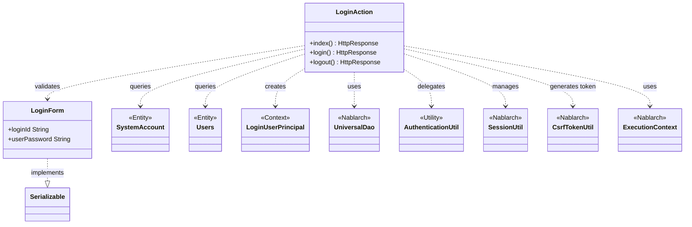
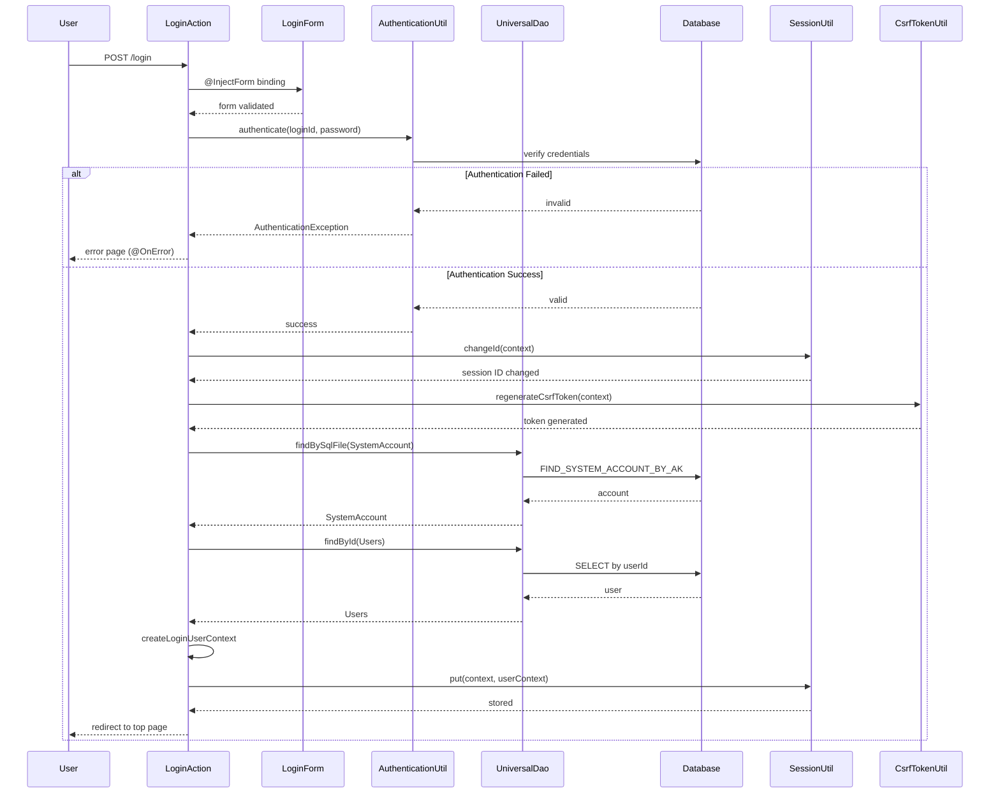

# Code Analysis: LoginAction

**Generated**: 2026-03-03 17:36:28
**Target**: ログイン認証処理
**Modules**: proman-web
**Analysis Duration**: 約2分11秒

---

## Overview

LoginActionは、Webアプリケーションにおけるユーザー認証（ログイン/ログアウト）機能を実装するアクションクラスです。認証処理、セッション管理、CSRF対策を統合し、セキュアなログイン機能を提供します。

主な処理フロー：
1. ログイン画面表示（index）
2. 認証実行（login）- フォーム入力、認証検証、セッション確立、CSRF トークン生成
3. ログアウト（logout）- セッション無効化

---

## Architecture

### Dependency Graph



**Note**: This diagram uses Mermaid `classDiagram` syntax to show class names and their relationships. Use `--|>` for inheritance (extends/implements) and `..>` for dependencies (uses/creates).

### Component Summary

| Component | Role | Type | Dependencies |
|-----------|------|------|--------------|
| LoginAction | 認証処理コントローラ | Action | LoginForm, SystemAccount, Users, UniversalDao, AuthenticationUtil, SessionUtil, CsrfTokenUtil |
| LoginForm | ログイン入力フォーム | Form | - |
| SystemAccount | システムアカウントエンティティ | Entity | - |
| Users | ユーザー情報エンティティ | Entity | - |
| LoginUserPrincipal | ログインユーザーコンテキスト | Context | - |
| AuthenticationUtil | 認証ロジック | Utility | - |

---

## Flow

### Processing Flow

**1. ログイン画面表示（index）**
- ログイン画面（/WEB-INF/view/login/login.jsp）を表示

**2. ログイン処理（login）**
1. @InjectFormでLoginFormに入力値をバインド (:50)
2. AuthenticationUtilで認証実行 (:56)
3. 認証失敗時は@OnErrorで画面に戻る (:49)
4. 認証成功時：
   - SessionUtil.changeIdでセッションID変更 (:65)
   - CsrfTokenUtil.regenerateCsrfTokenでトークン再生成 (:66)
   - createLoginUserContextでユーザー情報取得 (:68)
   - SessionUtilでユーザーコンテキスト保存 (:69)
   - トップ画面へリダイレクト (:70)

**3. ログアウト処理（logout）**
- SessionUtil.invalidateでセッション無効化 (:103)
- ログイン画面へリダイレクト (:105)

### Sequence Diagram



---

## Components

### LoginAction

**Location**: [.lw/.../LoginAction.java](.lw/nab-official/v6/nablarch-system-development-guide/Sample_Project/Source_Code/proman-project/proman-web/src/main/java/com/nablarch/example/proman/web/login/LoginAction.java)

**Role**: ユーザー認証とセッション管理を担当するアクションクラス

**Key Methods**:
- `index(HttpRequest, ExecutionContext)` [:38-40] - ログイン画面表示
- `login(HttpRequest, ExecutionContext)` [:51-71] - 認証処理と成功時のセッション確立
- `logout(HttpRequest, ExecutionContext)` [:102-106] - ログアウト処理
- `createLoginUserContext(String)` [:79-93] - 認証後のユーザー情報取得

**Dependencies**: LoginForm, SystemAccount, Users, LoginUserPrincipal, UniversalDao, AuthenticationUtil, SessionUtil, CsrfTokenUtil, ExecutionContext

**Implementation Points**:
- @InjectFormでフォーム入力を自動バインド
- @OnErrorで認証失敗時の画面遷移を制御
- セッション固定化攻撃対策のためchangeIdを実行
- CSRFトークンを認証成功時に再生成

### LoginForm

**Location**: [.lw/.../LoginForm.java](.lw/nab-official/v6/nablarch-system-development-guide/Sample_Project/Source_Code/proman-project/proman-web/src/main/java/com/nablarch/example/proman/web/login/LoginForm.java)

**Role**: ログイン画面の入力値を保持するフォームクラス

**Properties**: loginId (String), userPassword (String)

**Dependencies**: Bean Validation annotations

---

## Nablarch Framework Usage

### UniversalDao

Jakarta PersistenceアノテーションベースのO/Rマッパー。SQLを書かずにCRUD操作が可能。

**Code Example**:
```java
// SQL IDを指定した検索
SystemAccount account = UniversalDao.findBySqlFile(
    SystemAccount.class,
    "FIND_SYSTEM_ACCOUNT_BY_AK",
    new Object[]{loginId}
);

// 主キーによる検索
Users users = UniversalDao.findById(Users.class, account.getUserId());
```

**Important Points**:
- ✅ SQLファイルでの検索はfindBySqlFile/findAllBySqlFileを使用
- ✅ SQL IDは通常Entityクラスから自動導出されるパスに配置
- 💡 検索結果は自動的にEntityクラスにマッピングされる
- 🎯 主キー検索が最も簡潔（findById）、任意条件検索はSQLファイル使用

**Usage in this code**:
- createLoginUserContextメソッドでSystemAccountとUsersを検索 [:80-83]
- findBySqlFileで認証用アカウント検索、findByIdでユーザー詳細取得

**Knowledge Base**: [Universal Dao](../../../../../../../../../../../.claude/skills/nabledge-6/docs/features/libraries/universal-dao.md)

### SessionUtil

HTTPセッション管理のユーティリティクラス。セッション固定化攻撃対策を含む。

**Code Example**:
```java
// セッションID変更（セッション固定化攻撃対策）
SessionUtil.changeId(context);

// セッションへの値保存
SessionUtil.put(context, "userContext", userContext);

// セッション無効化
SessionUtil.invalidate(context);
```

**Important Points**:
- ✅ ログイン成功時は必ずchangeIdを実行（セキュリティ対策）
- ⚠️ セッションに保存するオブジェクトはSerializable実装が推奨
- 💡 セッションストアの実装はハンドラで切り替え可能
- 🎯 ログアウト時はinvalidateでセッション全体を破棄

**Usage in this code**:
- 認証成功時にchangeIdでセッションID変更 [:65]
- ユーザーコンテキストをセッションに保存 [:69]
- ログアウト時にセッション無効化 [:103]

### CsrfTokenUtil

CSRF（Cross-Site Request Forgery）攻撃対策のトークン管理。

**Code Example**:
```java
// CSRFトークン再生成
CsrfTokenUtil.regenerateCsrfToken(context);
```

**Important Points**:
- ✅ 認証後は必ずトークン再生成（セキュリティ強化）
- ✅ フォーム送信時はトークン検証が自動実行される
- 💡 トークンはセッションに保存され、画面に埋め込まれる
- 🎯 権限変更時（ログイン/ログアウト）にトークン再生成

**Usage in this code**:
- 認証成功時にCSRFトークン再生成 [:66]

### @InjectForm / @OnError

Webアクションの入力処理とエラーハンドリングを制御するアノテーション。

**Code Example**:
```java
@OnError(type = ApplicationException.class, path = "/WEB-INF/view/login/login.jsp")
@InjectForm(form = LoginForm.class)
public HttpResponse login(HttpRequest request, ExecutionContext context) {
    LoginForm form = context.getRequestScopedVar("form");
    // ...
}
```

**Important Points**:
- ✅ @InjectFormでリクエストパラメータを自動的にフォームにバインド
- ✅ @OnErrorで指定例外時の遷移先画面を宣言的に定義
- 💡 バリデーションエラーはApplicationExceptionとしてスロー
- 🎯 フォームはリクエストスコープに"form"として格納される

**Usage in this code**:
- loginメソッドに@InjectFormと@OnErrorを適用 [:49-50]
- 認証失敗時はApplicationExceptionをスローし画面に戻る [:59-60]

---

## References

### Source Files

- [LoginAction.java (.lw/nab-official/v6/nablarch-system-development-guide/en/Sample_Project/Source_Code/proman-project/proman-web/src/main/java/com/nablarch/example/proman/web/login)](../../../../../../../../../../../.lw/nab-official/v6/nablarch-system-development-guide/en/Sample_Project/Source_Code/proman-project/proman-web/src/main/java/com/nablarch/example/proman/web/login/LoginAction.java) - LoginAction
- [LoginAction.java (.lw/nab-official/v6/nablarch-system-development-guide/Sample_Project/Source_Code/proman-project/proman-web/src/main/java/com/nablarch/example/proman/web/login)](../../../../../../../../../../../.lw/nab-official/v6/nablarch-system-development-guide/Sample_Project/Source_Code/proman-project/proman-web/src/main/java/com/nablarch/example/proman/web/login/LoginAction.java) - LoginAction
- [LoginForm.java (.lw/nab-official/v6/nablarch-system-development-guide/en/Sample_Project/Source_Code/proman-project/proman-web/src/main/java/com/nablarch/example/proman/web/login)](../../../../../../../../../../../.lw/nab-official/v6/nablarch-system-development-guide/en/Sample_Project/Source_Code/proman-project/proman-web/src/main/java/com/nablarch/example/proman/web/login/LoginForm.java) - LoginForm
- [LoginForm.java (.lw/nab-official/v6/nablarch-system-development-guide/Sample_Project/Source_Code/proman-project/proman-web/src/main/java/com/nablarch/example/proman/web/login)](../../../../../../../../../../../.lw/nab-official/v6/nablarch-system-development-guide/Sample_Project/Source_Code/proman-project/proman-web/src/main/java/com/nablarch/example/proman/web/login/LoginForm.java) - LoginForm
- [LoginUserPrincipal.java (.lw/nab-official/v6/nablarch-system-development-guide/en/Sample_Project/Source_Code/proman-project/proman-web/src/main/java/com/nablarch/example/proman/web/common/authentication/context)](../../../../../../../../../../../.lw/nab-official/v6/nablarch-system-development-guide/en/Sample_Project/Source_Code/proman-project/proman-web/src/main/java/com/nablarch/example/proman/web/common/authentication/context/LoginUserPrincipal.java) - LoginUserPrincipal
- [LoginUserPrincipal.java (.lw/nab-official/v6/nablarch-system-development-guide/Sample_Project/Source_Code/proman-project/proman-web/src/main/java/com/nablarch/example/proman/web/common/authentication/context)](../../../../../../../../../../../.lw/nab-official/v6/nablarch-system-development-guide/Sample_Project/Source_Code/proman-project/proman-web/src/main/java/com/nablarch/example/proman/web/common/authentication/context/LoginUserPrincipal.java) - LoginUserPrincipal

### Knowledge Base (Nabledge-6)

- [Universal Dao](../../../../../../../../../../../.claude/skills/nabledge-6/docs/features/libraries/universal-dao.md)

### Official Documentation

(No official documentation links available)

---

**Note**: This documentation was generated by the code-analysis workflow of the nabledge-6 skill.
