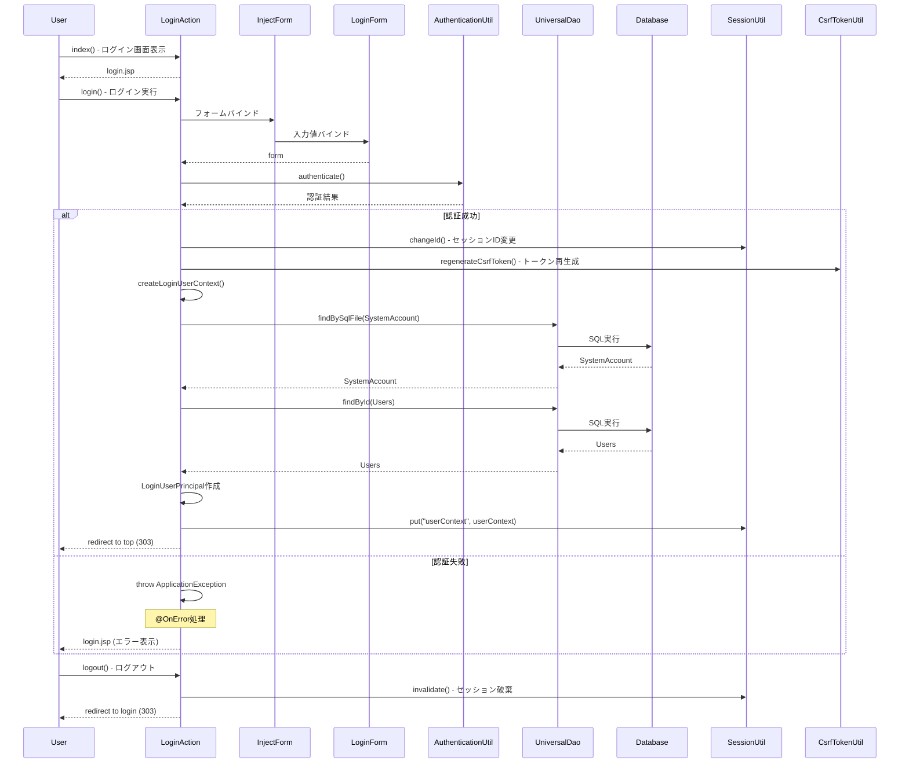

# Code Analysis: LoginAction

**Generated**: 2026-03-03 17:36:55
**Target**: ログイン認証処理
**Modules**: proman-web
**Analysis Duration**: 約2分59秒

---

## Overview

LoginActionはPromanプロジェクトのログイン認証を担当するWebアクションクラスです。ユーザー認証、セッション管理、CSRFトークン再生成を行い、ログイン画面の表示とログイン/ログアウト処理を実装しています。

主な役割:
- ログイン画面表示 (index)
- ユーザー認証とセッション確立 (login)
- 認証情報の取得とセッション格納 (createLoginUserContext)
- ログアウトとセッション破棄 (logout)

NablarchのUniversalDaoを使用してデータベースからユーザー情報を取得し、SessionUtilとCsrfTokenUtilでセキュアなセッション管理を実現しています。

---

## Architecture

### Dependency Graph

```mermaid
classDiagram
    class LoginAction {
        +index()
        +login()
        +logout()
        -createLoginUserContext()
    }
    class LoginForm {
        <<Form>>
    }
    class SystemAccount {
        <<Entity>>
    }
    class Users {
        <<Entity>>
    }
    class LoginUserPrincipal {
        <<Context>>
    }
    class AuthenticationUtil {
        <<Utility>>
    }
    class UniversalDao {
        <<Nablarch>>
    }
    class SessionUtil {
        <<Nablarch>>
    }
    class CsrfTokenUtil {
        <<Nablarch>>
    }
    class ExecutionContext {
        <<Nablarch>>
    }
    class HttpRequest {
        <<Nablarch>>
    }
    class HttpResponse {
        <<Nablarch>>
    }

    LoginAction ..> LoginForm : validates
    LoginAction ..> SystemAccount : queries
    LoginAction ..> Users : queries
    LoginAction ..> LoginUserPrincipal : creates
    LoginAction ..> AuthenticationUtil : authenticates with
    LoginAction ..> UniversalDao : queries via
    LoginAction ..> SessionUtil : manages session with
    LoginAction ..> CsrfTokenUtil : regenerates token with
    LoginAction ..> ExecutionContext : uses
    LoginAction ..> HttpRequest : receives
    LoginAction ..> HttpResponse : returns
```



**Note**: This diagram uses Mermaid `classDiagram` syntax to show class names and their relationships. Use `--|>` for inheritance (extends/implements) and `..>` for dependencies (uses/creates).

### Component Summary

| Component | Role | Type | Dependencies |
|-----------|------|------|--------------|
| LoginAction | ログイン認証処理 | Action | LoginForm, AuthenticationUtil, UniversalDao, SessionUtil, CsrfTokenUtil |
| LoginForm | ログイン入力フォーム | Form | - |
| SystemAccount | システムアカウントエンティティ | Entity | - |
| Users | ユーザーエンティティ | Entity | - |
| LoginUserPrincipal | ログインユーザーコンテキスト | Context | - |
| AuthenticationUtil | 認証ユーティリティ | Utility | - |
| UniversalDao | データベースDAO | Nablarch | - |
| SessionUtil | セッション管理 | Nablarch | - |
| CsrfTokenUtil | CSRFトークン管理 | Nablarch | - |

---

## Flow

### Processing Flow

**1. ログイン画面表示 (index)**
- HTTPリクエストを受信
- ログイン画面JSPを返却

**2. ログイン処理 (login)**
- @InjectFormでLoginFormをバインド
- AuthenticationUtilで認証実行
- 認証成功時:
  - SessionUtil.changeId()でセッションID変更
  - CsrfTokenUtil.regenerateCsrfToken()でCSRFトークン再生成
  - createLoginUserContext()で認証情報作成
  - SessionUtilに認証情報を格納
  - トップ画面にリダイレクト (303)
- 認証失敗時:
  - ApplicationExceptionをスロー
  - @OnErrorでログイン画面に遷移

**3. 認証情報取得 (createLoginUserContext)**
- UniversalDao.findBySqlFile()でSystemAccountを検索
- UniversalDao.findById()でUsersを検索
- LoginUserPrincipalを作成して返却

**4. ログアウト処理 (logout)**
- SessionUtil.invalidate()でセッション破棄
- ログイン画面にリダイレクト (303)

### Sequence Diagram



---

## Components

### LoginAction

**File**: `.lw/nab-official/v6/.../proman-web/src/main/java/com/nablarch/example/proman/web/login/LoginAction.java`

**Role**: ログイン認証処理を実行するアクションクラス

**Key Methods**:

- `index(HttpRequest, ExecutionContext): HttpResponse` [:38-40](../../../../../../../../.lw/nab-official/v6/nablarch-system-development-guide/Sample_Project/Source_Code/proman-project/proman-web/src/main/java/com/nablarch/example/proman/web/login/LoginAction.java#L38-L40)
  - ログイン画面を表示

- `login(HttpRequest, ExecutionContext): HttpResponse` [:51-71](../../../../../../../../.lw/nab-official/v6/nablarch-system-development-guide/Sample_Project/Source_Code/proman-project/proman-web/src/main/java/com/nablarch/example/proman/web/login/LoginAction.java#L51-L71)
  - @InjectFormでLoginFormをバインド
  - @OnErrorでApplicationException発生時にログイン画面に遷移
  - AuthenticationUtilで認証実行
  - 認証成功後、セッションIDとCSRFトークンを再生成

- `createLoginUserContext(String): LoginUserPrincipal` [:79-93](../../../../../../../../.lw/nab-official/v6/nablarch-system-development-guide/Sample_Project/Source_Code/proman-project/proman-web/src/main/java/com/nablarch/example/proman/web/login/LoginAction.java#L79-L93)
  - UniversalDaoでSystemAccountとUsersを検索
  - LoginUserPrincipalを作成して返却

- `logout(HttpRequest, ExecutionContext): HttpResponse` [:102-106](../../../../../../../../.lw/nab-official/v6/nablarch-system-development-guide/Sample_Project/Source_Code/proman-project/proman-web/src/main/java/com/nablarch/example/proman/web/login/LoginAction.java#L102-L106)
  - SessionUtil.invalidate()でセッション破棄
  - ログイン画面にリダイレクト

**Dependencies**: LoginForm, SystemAccount, Users, AuthenticationUtil, LoginUserPrincipal, UniversalDao, SessionUtil, CsrfTokenUtil, ExecutionContext, HttpRequest, HttpResponse

**Key Implementation Points**:
- 認証成功後のセッションID変更でセッション固定攻撃を防止
- CSRFトークン再生成でCSRF攻撃を防止
- AuthenticationExceptionをApplicationExceptionに変換して統一的なエラー処理
- リダイレクトに303ステータスコードを使用

---

## Nablarch Framework Usage

### UniversalDao

**Class**: nablarch.common.dao.UniversalDao

**Description**: Jakarta Persistenceアノテーションを使った簡易的なO/Rマッパー。SQLを書かずに単純なCRUDを実行し、検索結果をBeanにマッピング可能。

**Code Example** (from LoginAction.java):
```java
// SQLファイルを使った検索
SystemAccount account = UniversalDao
    .findBySqlFile(SystemAccount.class,
        "FIND_SYSTEM_ACCOUNT_BY_AK", new Object[]{loginId});

// 主キー検索
Users users = UniversalDao.findById(Users.class, account.getUserId());
```

**Important Points**:
- ✅ SQLファイルを使った検索はfindBySqlFile()メソッドを使用。SQL IDと検索パラメータを指定
- ✅ 主キー検索はfindById()メソッドで簡潔に実装可能
- 💡 SQLファイルのパスはBeanのクラスから導出される (例: sample.entity.User → sample/entity/User.sql)
- ⚠️ 主キー以外の条件を指定した更新/削除は不可。その場合はDatabaseを使用
- 🎯 単純なCRUD操作に適している。複雑なSQL操作が必要な場合はDatabaseを使用

**Usage in this code**:
- `findBySqlFile()`: SystemAccountをSQL IDで検索 [:80-82](../../../../../../../../.lw/nab-official/v6/nablarch-system-development-guide/Sample_Project/Source_Code/proman-project/proman-web/src/main/java/com/nablarch/example/proman/web/login/LoginAction.java#L80-L82)
- `findById()`: Usersを主キーで検索 [:83](../../../../../../../../.lw/nab-official/v6/nablarch-system-development-guide/Sample_Project/Source_Code/proman-project/proman-web/src/main/java/com/nablarch/example/proman/web/login/LoginAction.java#L83)

**Knowledge Base**: [Universal Dao](../../../../../../../../.claude/skills/nabledge-6/docs/features/libraries/universal-dao.md)

### SessionUtil

**Class**: nablarch.common.web.session.SessionUtil

**Description**: HTTPセッションの管理を行うユーティリティクラス。セッションへの値の格納、取得、破棄、セッションID変更機能を提供。

**Code Example** (from LoginAction.java):
```java
// セッションID変更 (セッション固定攻撃対策)
SessionUtil.changeId(context);

// セッションに値を格納
SessionUtil.put(context, "userContext", userContext);

// セッション破棄
SessionUtil.invalidate(context);
```

**Important Points**:
- ✅ 認証成功後は必ずchangeId()でセッションIDを変更してセッション固定攻撃を防止
- ✅ put()でセッションに認証情報を格納し、アプリケーション全体で利用可能にする
- ✅ ログアウト時はinvalidate()でセッションを完全に破棄
- ⚠️ セッションIDの変更は認証前のセッション情報を引き継ぐ。必要に応じて古いセッション情報をクリア
- 🎯 Webアプリケーションの状態管理とセキュリティ対策に必須

**Usage in this code**:
- `changeId()`: ログイン成功後にセッションID変更 [:65](../../../../../../../../.lw/nab-official/v6/nablarch-system-development-guide/Sample_Project/Source_Code/proman-project/proman-web/src/main/java/com/nablarch/example/proman/web/login/LoginAction.java#L65)
- `put()`: 認証情報をセッションに格納 [:69](../../../../../../../../.lw/nab-official/v6/nablarch-system-development-guide/Sample_Project/Source_Code/proman-project/proman-web/src/main/java/com/nablarch/example/proman/web/login/LoginAction.java#L69)
- `invalidate()`: ログアウト時にセッション破棄 [:103](../../../../../../../../.lw/nab-official/v6/nablarch-system-development-guide/Sample_Project/Source_Code/proman-project/proman-web/src/main/java/com/nablarch/example/proman/web/login/LoginAction.java#L103)

### CsrfTokenUtil

**Class**: nablarch.common.web.csrf.CsrfTokenUtil

**Description**: CSRFトークンの生成と検証を行うユーティリティクラス。CSRF攻撃を防止するためのトークン管理機能を提供。

**Code Example** (from LoginAction.java):
```java
// CSRFトークン再生成
CsrfTokenUtil.regenerateCsrfToken(context);
```

**Important Points**:
- ✅ ログイン成功後はregenerateCsrfToken()でトークンを再生成
- ✅ セッションID変更と併用して、認証前のトークンが悪用されないようにする
- 🎯 フォーム送信時のCSRF攻撃対策に必須
- ⚠️ トークン検証は通常ハンドラで自動実行されるため、明示的な検証コードは不要

**Usage in this code**:
- `regenerateCsrfToken()`: ログイン成功後にトークン再生成 [:66](../../../../../../../../.lw/nab-official/v6/nablarch-system-development-guide/Sample_Project/Source_Code/proman-project/proman-web/src/main/java/com/nablarch/example/proman/web/login/LoginAction.java#L66)

### @InjectForm

**Annotation**: nablarch.common.web.interceptor.InjectForm

**Description**: リクエストパラメータをフォームオブジェクトに自動バインドするインターセプタ。バリデーションとデータバインドを一括実行。

**Code Example** (from LoginAction.java):
```java
@InjectForm(form = LoginForm.class)
public HttpResponse login(HttpRequest request, ExecutionContext context) {
    LoginForm form = context.getRequestScopedVar("form");
    // フォームを使用
}
```

**Important Points**:
- ✅ メソッドに@InjectFormを付与すると、リクエストパラメータが自動的にフォームにバインド
- ✅ バインド後のフォームはExecutionContextから"form"という名前で取得
- ✅ バリデーションエラーがあるとApplicationExceptionがスロー
- 💡 @OnErrorと組み合わせてバリデーションエラー時の画面遷移を制御
- 🎯 フォーム処理の定型コードを削減し、バリデーションを自動化

**Usage in this code**:
- `@InjectForm(form = LoginForm.class)`: loginメソッドでLoginFormを自動バインド [:50](../../../../../../../../.lw/nab-official/v6/nablarch-system-development-guide/Sample_Project/Source_Code/proman-project/proman-web/src/main/java/com/nablarch/example/proman/web/login/LoginAction.java#L50)

### @OnError

**Annotation**: nablarch.fw.web.interceptor.OnError

**Description**: 例外発生時の画面遷移を制御するインターセプタ。特定の例外をキャッチして指定画面に遷移。

**Code Example** (from LoginAction.java):
```java
@OnError(type = ApplicationException.class, path = "/WEB-INF/view/login/login.jsp")
public HttpResponse login(HttpRequest request, ExecutionContext context) {
    // 処理
}
```

**Important Points**:
- ✅ typeで指定した例外が発生すると、pathで指定した画面に遷移
- ✅ ApplicationExceptionはバリデーションエラーやビジネスロジックエラーを表現
- 💡 @InjectFormと組み合わせると、バリデーションエラー時の画面遷移を簡潔に記述
- 🎯 エラーハンドリングの定型コードを削減

**Usage in this code**:
- `@OnError(type = ApplicationException.class, ...)`: 認証エラー時にログイン画面に遷移 [:49](../../../../../../../../.lw/nab-official/v6/nablarch-system-development-guide/Sample_Project/Source_Code/proman-project/proman-web/src/main/java/com/nablarch/example/proman/web/login/LoginAction.java#L49)

---

## References

### Source Files

- [LoginAction.java (.lw/nab-official/v6/nablarch-system-development-guide/en/Sample_Project/Source_Code/proman-project/proman-web/src/main/java/com/nablarch/example/proman/web/login)](../../../../../../../../.lw/nab-official/v6/nablarch-system-development-guide/en/Sample_Project/Source_Code/proman-project/proman-web/src/main/java/com/nablarch/example/proman/web/login/LoginAction.java) - LoginAction
- [LoginAction.java (.lw/nab-official/v6/nablarch-system-development-guide/Sample_Project/Source_Code/proman-project/proman-web/src/main/java/com/nablarch/example/proman/web/login)](../../../../../../../../.lw/nab-official/v6/nablarch-system-development-guide/Sample_Project/Source_Code/proman-project/proman-web/src/main/java/com/nablarch/example/proman/web/login/LoginAction.java) - LoginAction
- [LoginForm.java (.lw/nab-official/v6/nablarch-system-development-guide/en/Sample_Project/Source_Code/proman-project/proman-web/src/main/java/com/nablarch/example/proman/web/login)](../../../../../../../../.lw/nab-official/v6/nablarch-system-development-guide/en/Sample_Project/Source_Code/proman-project/proman-web/src/main/java/com/nablarch/example/proman/web/login/LoginForm.java) - LoginForm
- [LoginForm.java (.lw/nab-official/v6/nablarch-system-development-guide/Sample_Project/Source_Code/proman-project/proman-web/src/main/java/com/nablarch/example/proman/web/login)](../../../../../../../../.lw/nab-official/v6/nablarch-system-development-guide/Sample_Project/Source_Code/proman-project/proman-web/src/main/java/com/nablarch/example/proman/web/login/LoginForm.java) - LoginForm
- [AuthenticationUtil.java (.lw/nab-official/v6/nablarch-system-development-guide/en/Sample_Project/Source_Code/proman-project/proman-web/src/main/java/com/nablarch/example/proman/web/common/authentication)](../../../../../../../../.lw/nab-official/v6/nablarch-system-development-guide/en/Sample_Project/Source_Code/proman-project/proman-web/src/main/java/com/nablarch/example/proman/web/common/authentication/AuthenticationUtil.java) - AuthenticationUtil
- [AuthenticationUtil.java (.lw/nab-official/v6/nablarch-system-development-guide/Sample_Project/Source_Code/proman-project/proman-web/src/main/java/com/nablarch/example/proman/web/common/authentication)](../../../../../../../../.lw/nab-official/v6/nablarch-system-development-guide/Sample_Project/Source_Code/proman-project/proman-web/src/main/java/com/nablarch/example/proman/web/common/authentication/AuthenticationUtil.java) - AuthenticationUtil
- [LoginUserPrincipal.java (.lw/nab-official/v6/nablarch-system-development-guide/en/Sample_Project/Source_Code/proman-project/proman-web/src/main/java/com/nablarch/example/proman/web/common/authentication/context)](../../../../../../../../.lw/nab-official/v6/nablarch-system-development-guide/en/Sample_Project/Source_Code/proman-project/proman-web/src/main/java/com/nablarch/example/proman/web/common/authentication/context/LoginUserPrincipal.java) - LoginUserPrincipal
- [LoginUserPrincipal.java (.lw/nab-official/v6/nablarch-system-development-guide/Sample_Project/Source_Code/proman-project/proman-web/src/main/java/com/nablarch/example/proman/web/common/authentication/context)](../../../../../../../../.lw/nab-official/v6/nablarch-system-development-guide/Sample_Project/Source_Code/proman-project/proman-web/src/main/java/com/nablarch/example/proman/web/common/authentication/context/LoginUserPrincipal.java) - LoginUserPrincipal

### Knowledge Base (Nabledge-6)

- [Universal Dao](../../../../../../../../.claude/skills/nabledge-6/docs/features/libraries/universal-dao.md)

### Official Documentation

(No official documentation links available)

---

**Note**: This documentation was generated by the code-analysis workflow of the nabledge-6 skill.
