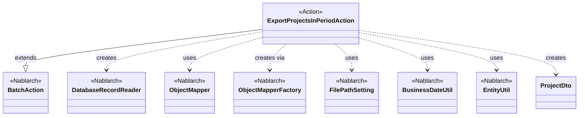
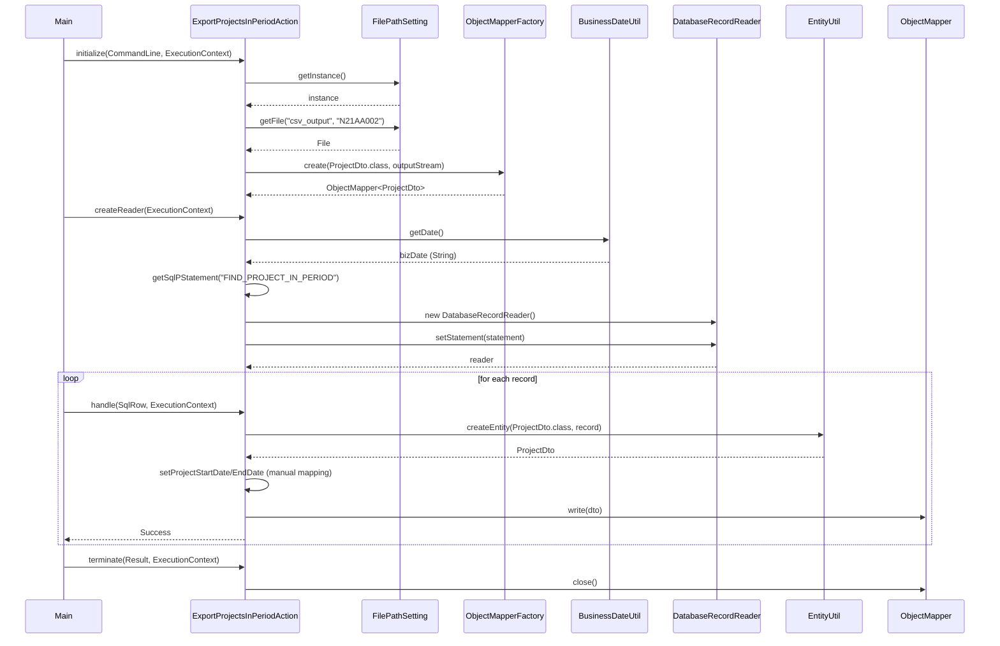

# Code Analysis: ExportProjectsInPeriodAction

**Generated**: 2026-03-05 18:12:30
**Target**: 期間内プロジェクト一覧CSV出力バッチアクション
**Modules**: proman-batch
**Analysis Duration**: 約3分17秒

---

## Overview

ExportProjectsInPeriodActionは、業務日付の期間内に含まれるプロジェクト一覧をデータベースから取得し、CSV形式でファイル出力する都度起動バッチアクションです。

主な機能:
- DatabaseRecordReaderでデータベースからプロジェクト情報を読み込み
- ObjectMapperでCSVファイルへ出力
- FilePathSettingで出力先ディレクトリを管理
- BusinessDateUtilで業務日付を取得し検索条件に使用

---

## Architecture

### Dependency Graph



**Note**: This diagram uses Mermaid `classDiagram` syntax to show class names and their relationships. Use `--|>` for inheritance (extends/implements) and `..>` for dependencies (uses/creates).

### Component Summary

| Component | Role | Type | Dependencies |
|-----------|------|------|--------------|
| ExportProjectsInPeriodAction | 期間内プロジェクトCSV出力 | Action | BatchAction, DatabaseRecordReader, ObjectMapper, FilePathSetting, BusinessDateUtil |
| ProjectDto | プロジェクト情報DTO | DTO | なし |
| BatchAction | バッチアクション基底クラス | Framework | DataReader, ExecutionContext, Result |
| DatabaseRecordReader | DB読込リーダー | Framework | SqlPStatement |
| ObjectMapper | CSVファイル書込 | Framework | ObjectMapperFactory |

---

## Flow

### Processing Flow

1. **初期化フェーズ** (initialize): FilePathSettingから出力ファイルパスを取得し、ObjectMapperを生成
2. **データ読込フェーズ** (createReader): BusinessDateUtilで業務日付を取得し、DatabaseRecordReaderでSQLを実行
3. **レコード処理フェーズ** (handle): 各レコードをProjectDtoに変換し、CSV出力
4. **終了フェーズ** (terminate): ObjectMapperをクローズしてリソース解放

### Sequence Diagram



---

## Components

### 1. ExportProjectsInPeriodAction

**File**: [ExportProjectsInPeriodAction.java](../../../.lw/nab-official/v6/nablarch-system-development-guide/Sample_Project/Source_Code/proman-project/proman-batch/src/main/java/com/nablarch/example/proman/batch/project/ExportProjectsInPeriodAction.java)

**Role**: 期間内プロジェクト一覧出力の都度起動バッチアクションクラス

**Key Methods**:
- `initialize()` [:44-54] - ファイル出力先の準備とObjectMapper生成
- `createReader()` [:57-65] - DatabaseRecordReaderを生成してSQLパラメータを設定
- `handle()` [:68-75] - 1レコードをProjectDtoに変換してCSV出力
- `terminate()` [:78-80] - ObjectMapperをクローズ

**Dependencies**:
- BatchAction<SqlRow>: 親クラス。バッチアクションのライフサイクルメソッドを提供
- ObjectMapper<ProjectDto>: CSV出力処理
- FilePathSetting: 出力ファイルパスの取得
- BusinessDateUtil: 業務日付の取得
- EntityUtil: SqlRowからProjectDtoへの変換

**Key Implementation Points**:
- フィールドで保持するObjectMapperはinitializeで生成し、terminateでクローズ
- EntityUtilで型変換できない日付項目は個別にsetterを呼び出し (L71-72)
- SQLのFIND_PROJECT_IN_PERIODは期間判定のためbizDateを2箇所に設定 (L61-62)

### 2. ProjectDto

**File**: [ProjectDto.java](../../../.lw/nab-official/v6/nablarch-system-development-guide/Sample_Project/Source_Code/proman-project/proman-batch/src/main/java/com/nablarch/example/proman/batch/project/ProjectDto.java)

**Role**: プロジェクト情報データ転送オブジェクト

**Properties**:
- projectId, projectName, projectType, projectClass
- projectStartDate, projectEndDate (java.sql.Date型)
- organizationId, clientId, projectManager, projectLeader
- etc.

**Annotations** (推測):
- `@Csv`: CSV出力項目順序とヘッダー定義
- `@CsvFormat`: CSV詳細設定（区切り文字、改行コード、文字コード）

---

## Nablarch Framework Usage

### BatchAction

**クラス**: `nablarch.fw.action.BatchAction`

**説明**: バッチアクションの基底クラス。initialize, createReader, handle, terminateのライフサイクルメソッドを提供する。

**使用方法**:
```java
public class ExportProjectsInPeriodAction extends BatchAction<SqlRow> {
    @Override
    protected void initialize(CommandLine command, ExecutionContext context) {
        // 初期化処理
    }

    @Override
    public DataReader<SqlRow> createReader(ExecutionContext context) {
        // DataReader生成
        return reader;
    }

    @Override
    public Result handle(SqlRow record, ExecutionContext context) {
        // レコード処理
        return new Success();
    }

    @Override
    protected void terminate(Result result, ExecutionContext context) {
        // 終了処理
    }
}
```

**重要ポイント**:
- ✅ **ライフサイクルメソッドを実装**: initialize → createReader → handle (繰り返し) → terminate の順に呼ばれる
- ⚡ **handleは1レコードずつ呼ばれる**: 大量データでもメモリを圧迫しない設計
- 💡 **リソース管理はinitialize/terminateで**: ファイルやコネクションなどのリソースは適切に開放する
- 🎯 **都度起動バッチの標準パターン**: DB to FILEやFILE to DB処理に適している

**このコードでの使い方**:
- initializeでObjectMapperを生成してフィールドに保持
- createReaderでDatabaseRecordReaderを返す
- handleで各レコードをCSV出力
- terminateでObjectMapperをクローズ

**詳細**: [Nablarchバッチ処理 - architecture.md](../../../.claude/skills/nabledge-6/docs/processing-pattern/nablarch-batch/nablarch-batch-architecture.md)

### DatabaseRecordReader

**クラス**: `nablarch.fw.reader.DatabaseRecordReader`

**説明**: データベースから1レコードずつ読み込むDataReaderの実装。SqlPStatementを設定してSQLを実行する。

**使用方法**:
```java
DatabaseRecordReader reader = new DatabaseRecordReader();
SqlPStatement statement = getSqlPStatement("FIND_PROJECT_IN_PERIOD");
statement.setDate(1, bizDate);
statement.setDate(2, bizDate);
reader.setStatement(statement);
return reader;
```

**重要ポイント**:
- ✅ **SqlPStatementを必ず設定**: setStatementで検索SQLを設定する
- ⚡ **ストリーム処理**: ResultSetから1行ずつ読み込むため、メモリ効率が高い
- ⚠️ **プレースホルダのインデックスは1始まり**: setDate(1, ...)の1は1番目のプレースホルダ
- 💡 **getSqlPStatementでSQL取得**: アクション名と同じSQLファイルから自動読込

**このコードでの使い方**:
- createReaderメソッドでDatabaseRecordReaderを生成
- FIND_PROJECT_IN_PERIODのSQLに業務日付を2箇所設定
- BatchActionがレコード終了まで自動的にhandleを繰り返し呼び出し

**詳細**: [Nablarchバッチ処理 - architecture.md](../../../.claude/skills/nabledge-6/docs/processing-pattern/nablarch-batch/nablarch-batch-architecture.md)

### ObjectMapper

**クラス**: `nablarch.common.databind.ObjectMapper`

**説明**: CSVやTSV、固定長データをJava Beansとして扱う機能を提供する

**使用方法**:
```java
// 生成
FilePathSetting filePathSetting = FilePathSetting.getInstance();
File output = filePathSetting.getFile("csv_output", "N21AA002");
FileOutputStream outputStream = new FileOutputStream(output);
ObjectMapper<ProjectDto> mapper = ObjectMapperFactory.create(ProjectDto.class, outputStream);

// 書き込み
mapper.write(dto);

// クローズ
mapper.close();
```

**重要ポイント**:
- ✅ **必ずclose()を呼ぶ**: バッファをフラッシュし、リソースを解放する（terminateで実施）
- ⚡ **大量データ処理時**: メモリに全データを保持しないため、大量データでも問題なく処理可能
- ⚠️ **型変換の制限**: EntityUtilと同様に、複雑な型変換が必要な項目は個別設定が必要
- 💡 **アノテーション駆動**: `@Csv`, `@CsvFormat`でフォーマットを宣言的に定義できる
- 💡 **保守性の高さ**: フォーマット変更時はアノテーションを変更するだけで対応可能

**このコードでの使い方**:
- initializeでProjectDto用のObjectMapperを生成 (L44-54)
- handleで各レコードをmapper.write(dto)で出力 (L73)
- terminateでmapper.close()してリソース解放 (L79)

**詳細**: [データバインド](../../../.claude/skills/nabledge-6/docs/component/libraries/libraries-data_bind.md)

### FilePathSetting

**クラス**: `nablarch.core.util.FilePathSetting`

**説明**: ファイルパスを論理名で管理し、環境ごとに異なる物理パスに変換する機能を提供する

**使用方法**:
```java
FilePathSetting filePathSetting = FilePathSetting.getInstance();
File output = filePathSetting.getFile("csv_output", "N21AA002");
// → /var/data/csv_output/N21AA002.csv などの物理パス
```

**重要ポイント**:
- 💡 **環境依存の排除**: 本番/開発環境でパスが異なる場合も論理名で統一できる
- ✅ **必ずgetInstanceでシングルトン取得**: システムリポジトリから設定を読み込む
- 🎯 **いつ使うか**: ファイル入出力が必要なバッチやファイルアップロード/ダウンロード機能
- ⚠️ **設定が必要**: システムリポジトリにbasePathSettingsとfileExtensionsを設定する

**このコードでの使い方**:
- initializeメソッドでgetFile("csv_output", "N21AA002")を呼び出し (L45-47)
- 論理名"csv_output"に対応する物理ディレクトリに"N21AA002"ファイルを配置
- 拡張子は設定ファイルで定義（おそらく.csv）

**詳細**: [ファイルパス管理](../../../.claude/skills/nabledge-6/docs/component/libraries/libraries-file_path_management.md)

### BusinessDateUtil

**クラス**: `nablarch.core.date.BusinessDateUtil`

**説明**: システム全体で統一された業務日付を取得する機能を提供する

**使用方法**:
```java
// デフォルト区分の業務日付
String bizDate = BusinessDateUtil.getDate();
// → "20260305"（yyyyMMdd形式）

// java.sql.Dateに変換
Date sqlDate = new Date(DateUtil.getDate(bizDate).getTime());
```

**重要ポイント**:
- 💡 **システム横断の日付統一**: System.currentTimeMillis()やLocalDate.now()ではなく、これを使うことでバッチ処理と画面処理で同じ業務日付を共有できる
- ✅ **必ずDatabaseRecordReaderのパラメータに変換**: 取得した文字列はjava.sql.Dateに変換してSQLパラメータに設定する
- 🎯 **いつ使うか**: 日付ベースの検索条件、レポート生成、ファイル名の日付部分など
- ⚠️ **設定が必要**: システムリポジトリに業務日付テーブルまたは固定値を設定する必要がある

**このコードでの使い方**:
- createReaderで業務日付を取得 (L60)
- java.sql.Dateに変換してSQLパラメータに設定 (L60-62)
- プロジェクトの開始日・終了日との比較条件として使用（期間内判定）

**詳細**: [日付管理](../../../.claude/skills/nabledge-6/docs/component/libraries/libraries-date.md)

### EntityUtil

**クラス**: `nablarch.common.dao.EntityUtil`

**説明**: SqlRowからEntityやDTOへマッピングする機能を提供する

**使用方法**:
```java
ProjectDto dto = EntityUtil.createEntity(ProjectDto.class, record);

// 型変換が必要な項目は個別設定
dto.setProjectStartDate(record.getDate("PROJECT_START_DATE"));
dto.setProjectEndDate(record.getDate("PROJECT_END_DATE"));
```

**重要ポイント**:
- ✅ **カラム名とプロパティ名の自動マッピング**: PROJECT_ID → projectIdに自動変換
- ⚠️ **型変換の制限**: Date型など、単純な型変換ができない項目は個別にsetterを呼ぶ必要がある
- 💡 **ボイラープレートコードの削減**: 大量のプロパティがあっても1行で基本マッピングが完了
- 🎯 **いつ使うか**: DB検索結果をDTO/Entityに変換する場合

**このコードでの使い方**:
- handleメソッドでSqlRowからProjectDtoに変換 (L69)
- 日付型の項目は型が違うため個別設定 (L71-72)

**詳細**: [ユニバーサルDAO](../../../.claude/skills/nabledge-6/docs/component/libraries/libraries-universal_dao.md)

---

## References

### Source Files

- [ExportProjectsInPeriodAction.java](../../../.lw/nab-official/v6/nablarch-system-development-guide/Sample_Project/Source_Code/proman-project/proman-batch/src/main/java/com/nablarch/example/proman/batch/project/ExportProjectsInPeriodAction.java) - 期間内プロジェクト一覧出力バッチアクション
- [ProjectDto.java](../../../.lw/nab-official/v6/nablarch-system-development-guide/Sample_Project/Source_Code/proman-project/proman-batch/src/main/java/com/nablarch/example/proman/batch/project/ProjectDto.java) - CSV出力用データ転送オブジェクト

### Knowledge Base (Nabledge-6)

- [Nablarchバッチ処理 - アーキテクチャ](../../../.claude/skills/nabledge-6/docs/processing-pattern/nablarch-batch/nablarch-batch-architecture.md) - BatchActionの詳細、DataReaderパターン、都度起動バッチ
- [Nablarchバッチ処理 - アプリケーション設計](../../../.claude/skills/nabledge-6/docs/processing-pattern/nablarch-batch/nablarch-batch-application_design.md) - 責務配置、バリデーション、データレコードマッピング
- [データバインド](../../../.claude/skills/nabledge-6/docs/component/libraries/libraries-data_bind.md) - ObjectMapperの詳細仕様、@Csvアノテーション、フォーマット設定
- [ファイルパス管理](../../../.claude/skills/nabledge-6/docs/component/libraries/libraries-file_path_management.md) - FilePathSettingの設定方法、論理名と物理パスのマッピング

### Official Documentation

(No official documentation links available)

---

**Note**: This documentation was generated by the code-analysis workflow of the nabledge-6 skill.
