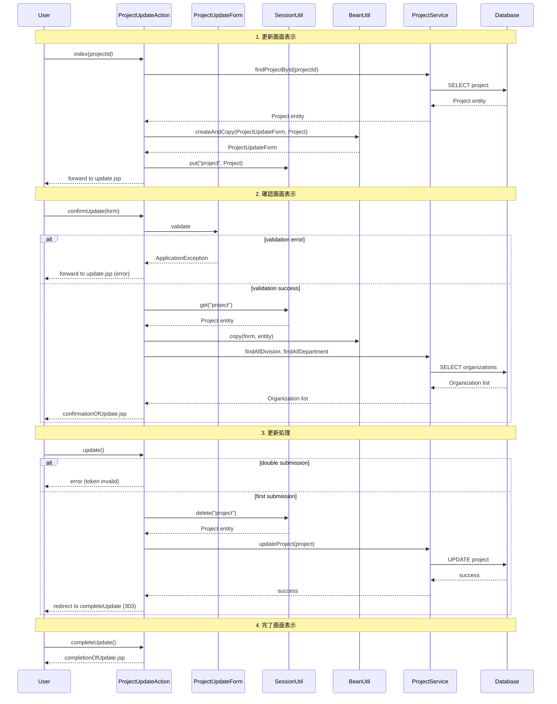

# Code Analysis: ProjectUpdateAction

**Generated**: 2026-03-05 18:11:43
**Target**: プロジェクト更新処理
**Modules**: proman-web
**Analysis Duration**: 約2分8秒

---

## Overview

ProjectUpdateActionは、プロジェクト情報の更新を担当するアクションクラスです。更新画面の表示、確認画面での検証、更新処理、完了画面表示という一連のフローを制御します。

**主な機能:**
- プロジェクト詳細からの更新画面表示 (index)
- フォーム入力値の検証と確認画面表示 (confirmUpdate)
- データベースへの更新反映 (update)
- 更新完了画面表示 (completeUpdate)
- 入力画面への戻り処理 (backToEnterUpdate)

**アーキテクチャの特徴:**
- セッションを使用してプロジェクト情報を保持
- BeanUtilによるEntity-Form間の変換
- InjectFormによる自動フォームバインディング
- OnDoubleSubmissionによる二重送信防止
- OnErrorによるバリデーションエラーハンドリング

---

## Architecture

### Dependency Graph

```mermaid
classDiagram
    class ProjectUpdateAction {
        <<Action>>
    }
    class ProjectService {
        <<Service>>
    }
    class Project {
        <<Entity>>
    }
    class Organization {
        <<Entity>>
    }
    class ProjectUpdateForm {
        <<Form>>
    }
    class ProjectUpdateInitialForm {
        <<Form>>
    }
    class BeanUtil {
        <<Nablarch>>
    }
    class SessionUtil {
        <<Nablarch>>
    }
    class DateUtil {
        <<Nablarch>>
    }
    class ExecutionContext {
        <<Nablarch>>
    }
    class HttpRequest {
        <<Nablarch>>
    }
    class HttpResponse {
        <<Nablarch>>
    }

    ProjectUpdateAction ..> ProjectService : uses
    ProjectUpdateAction ..> ProjectUpdateForm : validates
    ProjectUpdateAction ..> ProjectUpdateInitialForm : injects
    ProjectUpdateAction ..> Project : persists
    ProjectUpdateAction ..> Organization : queries
    ProjectUpdateAction ..> BeanUtil : converts
    ProjectUpdateAction ..> SessionUtil : stores data
    ProjectUpdateAction ..> DateUtil : formats dates
    ProjectUpdateAction ..> ExecutionContext : accesses context
    ProjectService ..> Project : queries
    ProjectService ..> Organization : queries
```



**Note**: This diagram uses Mermaid `classDiagram` syntax to show class names and their relationships. Use `--|>` for inheritance (extends/implements) and `..>` for dependencies (uses/creates).

### Component Summary

| Component | Role | Type | Dependencies |
|-----------|------|------|--------------|
| ProjectUpdateAction | 更新処理制御 | Action | ProjectService, ProjectUpdateForm, ProjectUpdateInitialForm, BeanUtil, SessionUtil, DateUtil |
| ProjectUpdateForm | 更新フォーム | Form | - |
| ProjectUpdateInitialForm | 初期表示フォーム | Form | - |
| ProjectService | ビジネスロジック | Service | UniversalDao, Project, Organization |
| Project | プロジェクトエンティティ | Entity | - |
| Organization | 組織エンティティ | Entity | - |

---

## Flow

### Processing Flow

プロジェクト更新処理は以下のフローで実行されます:

1. **詳細画面から更新画面表示 (index)**
   - ProjectUpdateInitialFormをInjectFormで自動バインド
   - ProjectServiceでプロジェクト情報をDBから取得
   - EntityをFormに変換 (buildFormFromEntity)
   - 日付フォーマット変換 (yyyy/MM/dd)
   - プロジェクト情報をセッションに保存
   - 更新画面にフォワード

2. **確認画面表示 (confirmUpdate)**
   - ProjectUpdateFormをInjectFormで自動バインド
   - バリデーションエラー時は@OnErrorで更新画面に戻る
   - セッションからプロジェクト情報を取得
   - FormからEntityにコピー (BeanUtil.copy)
   - 事業部/部門プルダウン用データを取得
   - 確認画面を表示

3. **更新処理 (update)**
   - @OnDoubleSubmissionで二重送信を防止
   - セッションからプロジェクト情報を削除して取得
   - ProjectService.updateProjectでDB更新
   - 完了画面にリダイレクト (303 See Other)

4. **完了画面表示 (completeUpdate)**
   - 完了画面JSPを返却

5. **入力画面への戻り (backToEnterUpdate)**
   - セッションからプロジェクト情報を取得
   - EntityをFormに変換
   - 更新画面にフォワード

### Sequence Diagram



---

## Components

### 1. ProjectUpdateAction

**File**: [ProjectUpdateAction.java:1-160](../../.lw/nab-official/v6/nablarch-system-development-guide/Sample_Project/Source_Code/proman-project/proman-web/src/main/java/com/nablarch/example/proman/web/project/ProjectUpdateAction.java)

**Role**: プロジェクト更新処理の制御

**Key Methods**:
- `index()` [:35-43](../../.lw/nab-official/v6/nablarch-system-development-guide/Sample_Project/Source_Code/proman-project/proman-web/src/main/java/com/nablarch/example/proman/web/project/ProjectUpdateAction.java#L35-L43) - 更新画面の初期表示
- `confirmUpdate()` [:54-62](../../.lw/nab-official/v6/nablarch-system-development-guide/Sample_Project/Source_Code/proman-project/proman-web/src/main/java/com/nablarch/example/proman/web/project/ProjectUpdateAction.java#L54-L62) - 確認画面の表示
- `update()` [:72-77](../../.lw/nab-official/v6/nablarch-system-development-guide/Sample_Project/Source_Code/proman-project/proman-web/src/main/java/com/nablarch/example/proman/web/project/ProjectUpdateAction.java#L72-L77) - 更新処理の実行
- `completeUpdate()` [:86-88](../../.lw/nab-official/v6/nablarch-system-development-guide/Sample_Project/Source_Code/proman-project/proman-web/src/main/java/com/nablarch/example/proman/web/project/ProjectUpdateAction.java#L86-L88) - 完了画面の表示
- `backToEnterUpdate()` [:97-102](../../.lw/nab-official/v6/nablarch-system-development-guide/Sample_Project/Source_Code/proman-project/proman-web/src/main/java/com/nablarch/example/proman/web/project/ProjectUpdateAction.java#L97-L102) - 入力画面への戻り
- `buildFormFromEntity()` [:111-125](../../.lw/nab-official/v6/nablarch-system-development-guide/Sample_Project/Source_Code/proman-project/proman-web/src/main/java/com/nablarch/example/proman/web/project/ProjectUpdateAction.java#L111-L125) - EntityからFormへの変換

**Dependencies**:
- ProjectService: ビジネスロジック実行
- ProjectUpdateForm: 更新フォーム
- ProjectUpdateInitialForm: 初期表示フォーム
- BeanUtil: Entity-Form変換
- SessionUtil: セッション管理
- DateUtil: 日付フォーマット

**Implementation Points**:
- `@InjectForm`でフォームを自動バインド
- セッションにプロジェクト情報を保持
- `BeanUtil.createAndCopy`でEntityからFormを生成
- `BeanUtil.copy`でFormからEntityにコピー
- DateUtilで日付を"yyyy/MM/dd"形式にフォーマット
- `forward://`でアプリケーション内フォワード
- `redirect://`で303リダイレクト

### 2. ProjectUpdateForm

**File**: ProjectUpdateForm.java (not found in repository)

**Role**: 更新画面のフォームデータ保持

**Key Points**:
- プロジェクト更新に必要な入力項目を保持
- Bean Validationアノテーションで検証ルール定義
- projectStartDate, projectEndDateはString型で保持
- divisionIdは確認画面表示用に保持

### 3. ProjectUpdateInitialForm

**File**: ProjectUpdateInitialForm.java (not found in repository)

**Role**: 初期表示時のパラメータ受け取り

**Key Points**:
- projectIdのみを保持
- URLパラメータまたはリクエストパラメータから受け取り

### 4. ProjectService

**File**: [ProjectService.java](../../.lw/nab-official/v6/nablarch-system-development-guide/Sample_Project/Source_Code/proman-project/proman-web/src/main/java/com/nablarch/example/proman/web/project/ProjectService.java)

**Role**: プロジェクト関連のビジネスロジック

**Key Methods**:
- `findProjectById()` - プロジェクト検索
- `updateProject()` - プロジェクト更新
- `findOrganizationById()` - 組織検索
- `findAllDivision()` - 事業部一覧取得
- `findAllDepartment()` - 部門一覧取得

**Dependencies**:
- UniversalDao: データベースアクセス
- Project, Organization: エンティティ

### 5. Project

**File**: Project.java (Entity - not found in repository)

**Role**: プロジェクトエンティティ

**Key Points**:
- プロジェクトテーブルのレコードを表現
- projectId, projectName, projectStartDate, projectEndDate等を保持
- organizationIdで組織と関連付け

### 6. Organization

**File**: Organization.java (Entity - not found in repository)

**Role**: 組織エンティティ

**Key Points**:
- 組織テーブルのレコードを表現
- organizationId, organizationName, upperOrganization等を保持
- upperOrganizationで上位組織との関連を表現

---

## Nablarch Framework Usage

### BeanUtil (Bean変換)

**Description**: Java Beansオブジェクト間の変換を行うユーティリティ

**Code Example** (ProjectUpdateAction.java:112-114):
```java
ProjectUpdateForm projectUpdateForm = BeanUtil.createAndCopy(ProjectUpdateForm.class, project);
```

**Code Example** (ProjectUpdateAction.java:57):
```java
BeanUtil.copy(form, project);
```

**Important Points**:
- ✅ **使用シーン**: Entity-Form間の変換時に使用
- 💡 **利点**: プロパティ名が一致するフィールドを自動コピー
- ⚠️ **注意点**: 型変換は自動で行われるが、フォーマット変換は別途必要
- 🎯 **適用箇所**: index()でEntity→Form、confirmUpdate()でForm→Entity

**Usage in this code**:
- `createAndCopy()`: EntityからFormを新規作成してコピー (index, backToEnterUpdate)
- `copy()`: FormからEntityにコピー (confirmUpdate)

**Knowledge Base**: [データバインド - feature-overview](../../.claude/skills/nabledge-6/docs/component/libraries/libraries-data_bind.md#feature-overview)

**Reference**: [BeanUtil JavaDoc](https://nablarch.github.io/docs/LATEST/javadoc/nablarch/core/beans/BeanUtil.html)

---

### SessionUtil (セッション管理)

**Description**: HTTPセッションへのオブジェクト格納・取得を行うユーティリティ

**Code Example** (ProjectUpdateAction.java:41, 56, 73):
```java
SessionUtil.put(context, PROJECT_KEY, project);
Project project = SessionUtil.get(context, PROJECT_KEY);
final Project project = SessionUtil.delete(context, PROJECT_KEY);
```

**Important Points**:
- ✅ **使用シーン**: 画面間でデータを保持する必要がある場合
- ⚠️ **注意点**: セッションに大量データを保存するとメモリを圧迫
- 💡 **パターン**: 更新処理完了時はdelete()でセッションをクリア
- 🎯 **適用箇所**: index()でput、confirmUpdate()でget、update()でdelete

**Usage in this code**:
- プロジェクト情報を画面遷移中に保持
- 更新処理時にセッションから削除して取得

---

### InjectForm (フォームインジェクション)

**Description**: リクエストパラメータを自動的にFormオブジェクトにバインド

**Code Example** (ProjectUpdateAction.java:34, 52):
```java
@InjectForm(form = ProjectUpdateInitialForm.class)
public HttpResponse index(HttpRequest request, ExecutionContext context) {
    ProjectUpdateInitialForm form = context.getRequestScopedVar("form");
    // ...
}

@InjectForm(form = ProjectUpdateForm.class, prefix = "form")
public HttpResponse confirmUpdate(HttpRequest request, ExecutionContext context) {
    ProjectUpdateForm form = context.getRequestScopedVar("form");
    // ...
}
```

**Important Points**:
- ✅ **使用シーン**: リクエストパラメータをFormオブジェクトにバインド
- 💡 **利点**: 手動でのパラメータ取得が不要
- ⚡ **パフォーマンス**: Bean Validationと組み合わせて自動検証
- 🎯 **prefix属性**: リクエストパラメータのプレフィックスを指定

**Usage in this code**:
- index(): ProjectUpdateInitialFormを自動バインド
- confirmUpdate(): ProjectUpdateFormを自動バインド (prefix="form")

---

### OnError (エラーハンドリング)

**Description**: 例外発生時の遷移先を指定するアノテーション

**Code Example** (ProjectUpdateAction.java:53):
```java
@OnError(type = ApplicationException.class, path = "forward:///app/project/moveUpdate")
public HttpResponse confirmUpdate(HttpRequest request, ExecutionContext context) {
    // ...
}
```

**Important Points**:
- ✅ **使用シーン**: バリデーションエラー時の遷移先指定
- 💡 **利点**: try-catchを書かずにエラーハンドリング
- 🎯 **適用箇所**: フォームバリデーション後の確認画面表示

**Usage in this code**:
- ApplicationException発生時に更新画面にフォワード
- Bean Validationエラーを画面に表示

---

### OnDoubleSubmission (二重送信防止)

**Description**: フォームの二重送信を防止するアノテーション

**Code Example** (ProjectUpdateAction.java:71):
```java
@OnDoubleSubmission
public HttpResponse update(HttpRequest request, ExecutionContext context) {
    // ...
}
```

**Important Points**:
- ✅ **使用シーン**: 更新・登録・削除処理で二重送信を防止
- 💡 **仕組み**: トークンを使用して同一リクエストを検知
- ⚠️ **注意点**: 確認画面でトークンを埋め込む必要あり
- 🎯 **適用箇所**: update()メソッドで二重送信を防止

**Usage in this code**:
- 更新処理で二重送信を防止
- 確認画面から送信されたトークンを検証

---

### DateUtil (日付フォーマット)

**Description**: 日付のフォーマット変換を行うユーティリティ

**Code Example** (ProjectUpdateAction.java:114-117):
```java
String projectStartDate = DateUtil.formatDate(projectUpdateForm.getProjectStartDate(), "yyyy/MM/dd");
String projectEndDate = DateUtil.formatDate(projectUpdateForm.getProjectEndDate(), "yyyy/MM/dd");
projectUpdateForm.setProjectStartDate(projectStartDate);
projectUpdateForm.setProjectEndDate(projectEndDate);
```

**Important Points**:
- ✅ **使用シーン**: 日付を画面表示用にフォーマット
- 💡 **パターン**: Entity(Date)→Form(String)変換時に使用
- 🎯 **適用箇所**: buildFormFromEntity()で日付をyyyy/MM/dd形式に変換

**Usage in this code**:
- プロジェクト開始日・終了日を"yyyy/MM/dd"形式にフォーマット
- Formに表示用文字列として設定

---

## References

### Source Files

- [ProjectUpdateAction.java (.lw/nab-official/v6/nablarch-system-development-guide/en/Sample_Project/Source_Code/proman-project/proman-web/src/main/java/com/nablarch/example/proman/web/project)](../../.lw/nab-official/v6/nablarch-system-development-guide/en/Sample_Project/Source_Code/proman-project/proman-web/src/main/java/com/nablarch/example/proman/web/project/ProjectUpdateAction.java) - ProjectUpdateAction
- [ProjectUpdateAction.java (.lw/nab-official/v6/nablarch-system-development-guide/Sample_Project/Source_Code/proman-project/proman-web/src/main/java/com/nablarch/example/proman/web/project)](../../.lw/nab-official/v6/nablarch-system-development-guide/Sample_Project/Source_Code/proman-project/proman-web/src/main/java/com/nablarch/example/proman/web/project/ProjectUpdateAction.java) - ProjectUpdateAction
- [ProjectUpdateForm.java (.lw/nab-official/v6/nablarch-system-development-guide/en/Sample_Project/Source_Code/proman-project/proman-web/src/main/java/com/nablarch/example/proman/web/project)](../../.lw/nab-official/v6/nablarch-system-development-guide/en/Sample_Project/Source_Code/proman-project/proman-web/src/main/java/com/nablarch/example/proman/web/project/ProjectUpdateForm.java) - ProjectUpdateForm
- [ProjectUpdateForm.java (.lw/nab-official/v6/nablarch-system-development-guide/Sample_Project/Source_Code/proman-project/proman-web/src/main/java/com/nablarch/example/proman/web/project)](../../.lw/nab-official/v6/nablarch-system-development-guide/Sample_Project/Source_Code/proman-project/proman-web/src/main/java/com/nablarch/example/proman/web/project/ProjectUpdateForm.java) - ProjectUpdateForm
- [ProjectUpdateInitialForm.java (.lw/nab-official/v6/nablarch-system-development-guide/en/Sample_Project/Source_Code/proman-project/proman-web/src/main/java/com/nablarch/example/proman/web/project)](../../.lw/nab-official/v6/nablarch-system-development-guide/en/Sample_Project/Source_Code/proman-project/proman-web/src/main/java/com/nablarch/example/proman/web/project/ProjectUpdateInitialForm.java) - ProjectUpdateInitialForm
- [ProjectUpdateInitialForm.java (.lw/nab-official/v6/nablarch-system-development-guide/Sample_Project/Source_Code/proman-project/proman-web/src/main/java/com/nablarch/example/proman/web/project)](../../.lw/nab-official/v6/nablarch-system-development-guide/Sample_Project/Source_Code/proman-project/proman-web/src/main/java/com/nablarch/example/proman/web/project/ProjectUpdateInitialForm.java) - ProjectUpdateInitialForm
- [ProjectService.java (.lw/nab-official/v6/nablarch-system-development-guide/en/Sample_Project/Source_Code/proman-project/proman-web/src/main/java/com/nablarch/example/proman/web/project)](../../.lw/nab-official/v6/nablarch-system-development-guide/en/Sample_Project/Source_Code/proman-project/proman-web/src/main/java/com/nablarch/example/proman/web/project/ProjectService.java) - ProjectService
- [ProjectService.java (.lw/nab-official/v6/nablarch-system-development-guide/Sample_Project/Source_Code/proman-project/proman-web/src/main/java/com/nablarch/example/proman/web/project)](../../.lw/nab-official/v6/nablarch-system-development-guide/Sample_Project/Source_Code/proman-project/proman-web/src/main/java/com/nablarch/example/proman/web/project/ProjectService.java) - ProjectService

### Knowledge Base (Nabledge-6)

- [Libraries Data_bind](../../.claude/skills/nabledge-6/docs/component/libraries/libraries-data_bind.md)

### Official Documentation


- [BeanUtil](https://nablarch.github.io/docs/LATEST/javadoc/nablarch/core/beans/BeanUtil.html)
- [CsvDataBindConfig](https://nablarch.github.io/docs/LATEST/javadoc/nablarch/common/databind/csv/CsvDataBindConfig.html)
- [CsvFormat](https://nablarch.github.io/docs/LATEST/javadoc/nablarch/common/databind/csv/CsvFormat.html)
- [Csv](https://nablarch.github.io/docs/LATEST/javadoc/nablarch/common/databind/csv/Csv.html)
- [Data Bind](https://nablarch.github.io/docs/LATEST/doc/application_framework/application_framework/libraries/data_io/data_bind.html)
- [DataBindConfig](https://nablarch.github.io/docs/LATEST/javadoc/nablarch/common/databind/DataBindConfig.html)
- [Field](https://nablarch.github.io/docs/LATEST/javadoc/nablarch/common/databind/fixedlength/Field.html)
- [FileResponse](https://nablarch.github.io/docs/LATEST/javadoc/nablarch/common/web/download/FileResponse.html)
- [FixedLengthDataBindConfigBuilder](https://nablarch.github.io/docs/LATEST/javadoc/nablarch/common/databind/fixedlength/FixedLengthDataBindConfigBuilder.html)
- [FixedLengthDataBindConfig](https://nablarch.github.io/docs/LATEST/javadoc/nablarch/common/databind/fixedlength/FixedLengthDataBindConfig.html)
- [FixedLength](https://nablarch.github.io/docs/LATEST/javadoc/nablarch/common/databind/fixedlength/FixedLength.html)
- [LineNumber](https://nablarch.github.io/docs/LATEST/javadoc/nablarch/common/databind/LineNumber.html)
- [MultiLayoutConfig.RecordIdentifier](https://nablarch.github.io/docs/LATEST/javadoc/nablarch/common/databind/fixedlength/MultiLayoutConfig.RecordIdentifier.html)
- [MultiLayout](https://nablarch.github.io/docs/LATEST/javadoc/nablarch/common/databind/fixedlength/MultiLayout.html)
- [ObjectMapperFactory](https://nablarch.github.io/docs/LATEST/javadoc/nablarch/common/databind/ObjectMapperFactory.html)
- [ObjectMapper](https://nablarch.github.io/docs/LATEST/javadoc/nablarch/common/databind/ObjectMapper.html)
- [Package-summary](https://nablarch.github.io/docs/LATEST/javadoc/nablarch/common/databind/fixedlength/converter/package-summary.html)
- [PartInfo](https://nablarch.github.io/docs/LATEST/javadoc/nablarch/fw/web/upload/PartInfo.html)

---

**Note**: This documentation was generated by the code-analysis workflow of the nabledge-6 skill.
