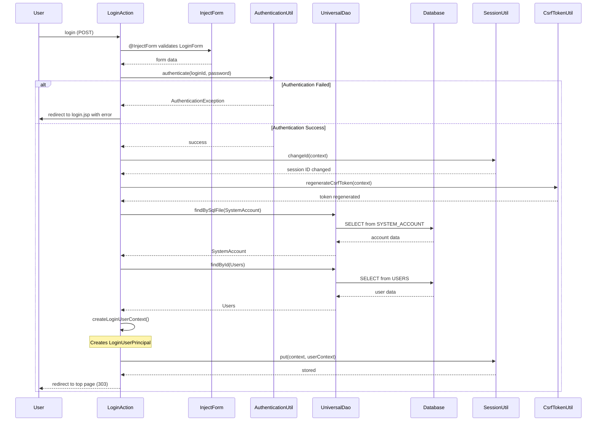

# Code Analysis: LoginAction

**Generated**: 2026-03-05 18:12:25
**Target**: ログイン認証処理
**Modules**: proman-web
**Analysis Duration**: 約3分13秒

---

## Overview

LoginActionは、proman-webモジュールにおけるユーザー認証を担当するWebアクションクラスです。ログイン画面の表示、ユーザー認証処理、セッション管理、ログアウト処理の3つの主要機能を提供します。

認証成功時にはセッションIDを再生成し、CSRFトークンを更新することでセキュリティを確保しています。UniversalDaoを使用してデータベースからユーザー情報を取得し、AuthenticationUtilで認証を実行します。

---

## Architecture

### Dependency Graph

```mermaid
classDiagram
    class LoginAction {
        +index()
        +login()
        +logout()
    }
    class LoginForm {
        <<Form>>
    }
    class SystemAccount {
        <<Entity>>
    }
    class Users {
        <<Entity>>
    }
    class LoginUserPrincipal {
        <<Context>>
    }
    class UniversalDao {
        <<Nablarch>>
    }
    class AuthenticationUtil {
        <<Nablarch>>
    }
    class SessionUtil {
        <<Nablarch>>
    }
    class CsrfTokenUtil {
        <<Nablarch>>
    }
    class ExecutionContext {
        <<Nablarch>>
    }
    class InjectForm {
        <<Nablarch>>
    }
    class OnError {
        <<Nablarch>>
    }

    LoginAction ..> LoginForm : validates
    LoginAction ..> SystemAccount : queries
    LoginAction ..> Users : queries
    LoginAction ..> LoginUserPrincipal : creates
    LoginAction ..> UniversalDao : uses for DB access
    LoginAction ..> AuthenticationUtil : delegates authentication
    LoginAction ..> SessionUtil : manages session
    LoginAction ..> CsrfTokenUtil : regenerates token
    LoginAction ..> ExecutionContext : accesses context
    LoginForm ..|> Serializable : implements
```



**Note**: This diagram uses Mermaid `classDiagram` syntax to show class names and their relationships. Use `--|>` for inheritance (extends/implements) and `..>` for dependencies (uses/creates).

### Component Summary

| Component | Role | Type | Dependencies |
|-----------|------|------|--------------|
| LoginAction | ログイン・ログアウト制御 | Action | LoginForm, SystemAccount, Users, LoginUserPrincipal, UniversalDao, AuthenticationUtil, SessionUtil, CsrfTokenUtil, ExecutionContext |
| LoginForm | ログイン入力データ | Form | - |
| SystemAccount | システムアカウント情報 | Entity | - |
| Users | ユーザー情報 | Entity | - |
| LoginUserPrincipal | ログインユーザーコンテキスト | Context | - |

---

## Flow

### Processing Flow

1. **ログイン画面表示 (index)**: ユーザーがログイン画面にアクセスすると、login.jspを返す
2. **認証処理 (login)**: フォームから送信されたログインID・パスワードを検証
   - @InjectFormアノテーションでLoginFormに自動バインド
   - AuthenticationUtilで認証を実行
   - 認証失敗時は@OnErrorでエラーメッセージを表示
   - 認証成功時はセッションIDを変更し、CSRFトークンを再生成
3. **ユーザーコンテキスト作成**: UniversalDaoでSystemAccountとUsersを取得し、LoginUserPrincipalを構築
4. **セッション保存**: SessionUtilでユーザーコンテキストをセッションに格納し、トップ画面へリダイレクト
5. **ログアウト (logout)**: SessionUtil.invalidateでセッションを無効化し、ログイン画面へリダイレクト

### Sequence Diagram



---

## Components

### LoginAction ([LoginAction.java:29-108](../../.lw/nab-official/v6/nablarch-system-development-guide/Sample_Project/Source_Code/proman-project/proman-web/src/main/java/com/nablarch/example/proman/web/login/LoginAction.java#L29-L108))

**Role**: 認証アクション - ログイン・ログアウト処理を制御

**Key Methods**:
- `index(HttpRequest, ExecutionContext)` [:38-40](../../.lw/nab-official/v6/nablarch-system-development-guide/Sample_Project/Source_Code/proman-project/proman-web/src/main/java/com/nablarch/example/proman/web/login/LoginAction.java#L38-L40) - ログイン画面表示
- `login(HttpRequest, ExecutionContext)` [:49-71](../../.lw/nab-official/v6/nablarch-system-development-guide/Sample_Project/Source_Code/proman-project/proman-web/src/main/java/com/nablarch/example/proman/web/login/LoginAction.java#L49-L71) - ログイン処理（認証・セッション管理）
- `createLoginUserContext(String)` [:79-93](../../.lw/nab-official/v6/nablarch-system-development-guide/Sample_Project/Source_Code/proman-project/proman-web/src/main/java/com/nablarch/example/proman/web/login/LoginAction.java#L79-L93) - ログインユーザーコンテキスト生成
- `logout(HttpRequest, ExecutionContext)` [:102-106](../../.lw/nab-official/v6/nablarch-system-development-guide/Sample_Project/Source_Code/proman-project/proman-web/src/main/java/com/nablarch/example/proman/web/login/LoginAction.java#L102-L106) - ログアウト処理

**Dependencies**:
- LoginForm - ログインフォームデータ
- SystemAccount, Users - エンティティ
- UniversalDao - データベースアクセス
- AuthenticationUtil - 認証処理
- SessionUtil, CsrfTokenUtil - セキュリティ管理
- ExecutionContext - リクエストコンテキスト

**Key Implementation Points**:
- `@InjectForm`でフォームを自動バインド
- `@OnError`でバリデーションエラー時の遷移先を指定
- 認証成功時にセッションIDを変更してセッション固定攻撃を防止
- CSRFトークンを再生成してセキュリティを強化
- UniversalDaoでSystemAccountとUsersを取得してユーザーコンテキストを構築

### LoginForm ([LoginForm.java](../../.lw/nab-official/v6/nablarch-system-development-guide/Sample_Project/Source_Code/proman-project/proman-web/src/main/java/com/nablarch/example/proman/web/login/LoginForm.java))

**Role**: ログインフォーム - ログインID・パスワードの入力データ

**Key Properties**:
- loginId - ログインID
- userPassword - パスワード

**Dependencies**: なし (Bean Validationアノテーションで検証)

**Key Implementation Points**:
- Bean Validationアノテーションでバリデーションルールを定義
- @InjectFormで自動的にリクエストパラメータからバインドされる

### SystemAccount, Users

**Role**: エンティティクラス - データベースのSYSTEM_ACCOUNT、USERSテーブルをマッピング

**Dependencies**: Jakarta Persistenceアノテーション

**Key Implementation Points**:
- @Tableアノテーションでテーブル名を指定
- UniversalDaoで検索・更新される

### LoginUserPrincipal

**Role**: ログインユーザーコンテキスト - セッションに格納されるユーザー情報

**Dependencies**: なし

**Key Implementation Points**:
- userId, kanjiName, pmFlag, lastLoginDateTimeを保持
- SessionUtilでセッションに格納される

---

## Nablarch Framework Usage

### UniversalDao

**Description**: Nablarchの汎用DAOライブラリ。Jakarta PersistenceアノテーションをサポートしたO/Rマッパー。

**Code Example**:
```java
// SQLファイルを使った検索
SystemAccount account = UniversalDao
        .findBySqlFile(SystemAccount.class,
                "FIND_SYSTEM_ACCOUNT_BY_AK", new Object[]{loginId});

// 主キーによる検索
Users users = UniversalDao.findById(Users.class, account.getUserId());
```

**Important Points**:
- ✅ `findBySqlFile`でSQLファイルを指定した柔軟な検索が可能
- ✅ `findById`で主キーによる単一レコード取得が簡潔に記述できる
- ⚠️ SQLファイルの配置パスは規約に従う（クラスパス相対）
- 💡 エンティティクラスに@Tableアノテーションを付与することでテーブルマッピングを定義
- 🎯 複雑な検索条件はSQLファイルに記述し、シンプルなCRUD操作はfindById/insert/update/deleteを使用

**Usage in this code**:
- createLoginUserContext内でfindBySqlFileとfindIdを使用してSystemAccountとUsersを取得

**Knowledge Base**: [Libraries Universal_dao](../../.claude/skills/nabledge-6/docs/component/libraries/libraries-universal_dao.md) - 「機能概要」「任意のSQL(SQLファイル)で検索する」セクション参照

### @InjectForm / Bean Validation

**Description**: フォームデータの自動バインドとバリデーション。@InjectFormアノテーションでリクエストパラメータを自動的にフォームオブジェクトにバインドし、Bean Validationで検証する。

**Code Example**:
```java
@OnError(type = ApplicationException.class, path = "/WEB-INF/view/login/login.jsp")
@InjectForm(form = LoginForm.class)
public HttpResponse login(HttpRequest request, ExecutionContext context) {
    LoginForm form = context.getRequestScopedVar("form");
    // formオブジェクトが自動的にバインドされ、バリデーション済み
}
```

**Important Points**:
- ✅ リクエストパラメータをフォームクラスに自動バインド
- ✅ Bean Validationアノテーションでバリデーションルールを宣言的に定義
- ⚠️ バリデーションエラー時は@OnErrorで指定されたパスに遷移
- 💡 フォームクラスはリクエストスコープに"form"という名前で格納される
- 🎯 入力チェックロジックをアクションから分離し、メンテナンス性を向上

**Usage in this code**:
- loginメソッドに@InjectFormアノテーションを付与してLoginFormを自動バインド

**Knowledge Base**: [Libraries Data_bind](../../.claude/skills/nabledge-6/docs/component/libraries/libraries-data_bind.md) - 「機能概要」「入力値をチェックする」セクション参照

### SessionUtil / CsrfTokenUtil

**Description**: セッション管理とCSRF対策。SessionUtilでセッション操作を行い、CsrfTokenUtilでCSRFトークンを管理する。

**Code Example**:
```java
// セッションID変更（セッション固定攻撃対策）
SessionUtil.changeId(context);

// CSRFトークン再生成
CsrfTokenUtil.regenerateCsrfToken(context);

// セッションにデータ格納
SessionUtil.put(context, "userContext", userContext);

// セッション無効化
SessionUtil.invalidate(context);
```

**Important Points**:
- ✅ 認証成功時にはセッションIDを変更してセッション固定攻撃を防止
- ✅ CSRFトークンを再生成してセキュリティを強化
- ⚠️ セッションにデータを格納する場合はキー名を統一
- 💡 ログアウト時はinvalidateでセッションを完全に破棄
- ⚡ セッションスコープは最小限に抑えてメモリ使用量を削減

**Usage in this code**:
- loginメソッドで認証成功時にchangeId、regenerateCsrfTokenを実行
- putでログインユーザーコンテキストをセッションに保存
- logoutメソッドでinvalidateを実行

**Knowledge Base**: Nablarch公式ドキュメント - セッション管理、CSRF対策

### @OnError

**Description**: エラーハンドリング。指定した例外が発生した際の遷移先を宣言的に定義する。

**Code Example**:
```java
@OnError(type = ApplicationException.class, path = "/WEB-INF/view/login/login.jsp")
public HttpResponse login(HttpRequest request, ExecutionContext context) {
    // ApplicationException発生時は自動的にlogin.jspに遷移
}
```

**Important Points**:
- ✅ エラー発生時の遷移先を宣言的に定義
- ✅ 例外タイプごとに異なる遷移先を指定可能
- 💡 バリデーションエラー（ApplicationException）は入力画面に戻す
- 🎯 エラーハンドリングロジックをアクションから分離

**Usage in this code**:
- loginメソッドに付与して、認証エラー時にログイン画面に戻る

**Knowledge Base**: [Universal Dao](https://nablarch.github.io/docs/LATEST/doc/application_framework/application_framework/libraries/database/universal_dao.html)の@OnError説明

---

## References

### Source Files

- [LoginAction.java (.lw/nab-official/v6/nablarch-system-development-guide/en/Sample_Project/Source_Code/proman-project/proman-web/src/main/java/com/nablarch/example/proman/web/login)](../../.lw/nab-official/v6/nablarch-system-development-guide/en/Sample_Project/Source_Code/proman-project/proman-web/src/main/java/com/nablarch/example/proman/web/login/LoginAction.java) - LoginAction
- [LoginAction.java (.lw/nab-official/v6/nablarch-system-development-guide/Sample_Project/Source_Code/proman-project/proman-web/src/main/java/com/nablarch/example/proman/web/login)](../../.lw/nab-official/v6/nablarch-system-development-guide/Sample_Project/Source_Code/proman-project/proman-web/src/main/java/com/nablarch/example/proman/web/login/LoginAction.java) - LoginAction
- [LoginForm.java (.lw/nab-official/v6/nablarch-system-development-guide/en/Sample_Project/Source_Code/proman-project/proman-web/src/main/java/com/nablarch/example/proman/web/login)](../../.lw/nab-official/v6/nablarch-system-development-guide/en/Sample_Project/Source_Code/proman-project/proman-web/src/main/java/com/nablarch/example/proman/web/login/LoginForm.java) - LoginForm
- [LoginForm.java (.lw/nab-official/v6/nablarch-system-development-guide/Sample_Project/Source_Code/proman-project/proman-web/src/main/java/com/nablarch/example/proman/web/login)](../../.lw/nab-official/v6/nablarch-system-development-guide/Sample_Project/Source_Code/proman-project/proman-web/src/main/java/com/nablarch/example/proman/web/login/LoginForm.java) - LoginForm

### Knowledge Base (Nabledge-6)

- [Libraries Universal_dao](../../.claude/skills/nabledge-6/docs/component/libraries/libraries-universal_dao.md)
- [Libraries Data_bind](../../.claude/skills/nabledge-6/docs/component/libraries/libraries-data_bind.md)

### Official Documentation


- [BasicDaoContextFactory](https://nablarch.github.io/docs/LATEST/javadoc/nablarch/common/dao/BasicDaoContextFactory.html)
- [BeanUtil](https://nablarch.github.io/docs/LATEST/javadoc/nablarch/core/beans/BeanUtil.html)
- [ConnectionFactory](https://nablarch.github.io/docs/LATEST/javadoc/nablarch/core/db/connection/ConnectionFactory.html)
- [CsvDataBindConfig](https://nablarch.github.io/docs/LATEST/javadoc/nablarch/common/databind/csv/CsvDataBindConfig.html)
- [CsvFormat](https://nablarch.github.io/docs/LATEST/javadoc/nablarch/common/databind/csv/CsvFormat.html)
- [Csv](https://nablarch.github.io/docs/LATEST/javadoc/nablarch/common/databind/csv/Csv.html)
- [Data Bind](https://nablarch.github.io/docs/LATEST/doc/application_framework/application_framework/libraries/data_io/data_bind.html)
- [DataBindConfig](https://nablarch.github.io/docs/LATEST/javadoc/nablarch/common/databind/DataBindConfig.html)
- [DatabaseMetaDataExtractor](https://nablarch.github.io/docs/LATEST/javadoc/nablarch/common/dao/DatabaseMetaDataExtractor.html)
- [Date](https://nablarch.github.io/docs/LATEST/javadoc/java/sql/Date.html)
- [DeferredEntityList](https://nablarch.github.io/docs/LATEST/javadoc/nablarch/common/dao/DeferredEntityList.html)
- [Dialect](https://nablarch.github.io/docs/LATEST/javadoc/nablarch/core/db/dialect/Dialect.html)
- [EntityList](https://nablarch.github.io/docs/LATEST/javadoc/nablarch/common/dao/EntityList.html)
- [Field](https://nablarch.github.io/docs/LATEST/javadoc/nablarch/common/databind/fixedlength/Field.html)
- [FileResponse](https://nablarch.github.io/docs/LATEST/javadoc/nablarch/common/web/download/FileResponse.html)
- [FixedLengthDataBindConfigBuilder](https://nablarch.github.io/docs/LATEST/javadoc/nablarch/common/databind/fixedlength/FixedLengthDataBindConfigBuilder.html)
- [FixedLengthDataBindConfig](https://nablarch.github.io/docs/LATEST/javadoc/nablarch/common/databind/fixedlength/FixedLengthDataBindConfig.html)
- [FixedLength](https://nablarch.github.io/docs/LATEST/javadoc/nablarch/common/databind/fixedlength/FixedLength.html)
- [GenerationType](https://nablarch.github.io/docs/LATEST/javadoc/jakarta/persistence/GenerationType.html)
- [H2Dialect](https://nablarch.github.io/docs/LATEST/javadoc/nablarch/core/db/dialect/H2Dialect.html)
- [Integer](https://nablarch.github.io/docs/LATEST/javadoc/java/lang/Integer.html)
- [LineNumber](https://nablarch.github.io/docs/LATEST/javadoc/nablarch/common/databind/LineNumber.html)
- [Long](https://nablarch.github.io/docs/LATEST/javadoc/java/lang/Long.html)
- [MultiLayoutConfig.RecordIdentifier](https://nablarch.github.io/docs/LATEST/javadoc/nablarch/common/databind/fixedlength/MultiLayoutConfig.RecordIdentifier.html)
- [MultiLayout](https://nablarch.github.io/docs/LATEST/javadoc/nablarch/common/databind/fixedlength/MultiLayout.html)
- [ObjectMapperFactory](https://nablarch.github.io/docs/LATEST/javadoc/nablarch/common/databind/ObjectMapperFactory.html)
- [ObjectMapper](https://nablarch.github.io/docs/LATEST/javadoc/nablarch/common/databind/ObjectMapper.html)
- [OnError](https://nablarch.github.io/docs/LATEST/javadoc/nablarch/fw/web/interceptor/OnError.html)
- [OptimisticLockException](https://nablarch.github.io/docs/LATEST/javadoc/jakarta/persistence/OptimisticLockException.html)
- [Package-summary](https://nablarch.github.io/docs/LATEST/javadoc/nablarch/common/databind/fixedlength/converter/package-summary.html)
- [Pagination](https://nablarch.github.io/docs/LATEST/javadoc/nablarch/common/dao/Pagination.html)
- [PartInfo](https://nablarch.github.io/docs/LATEST/javadoc/nablarch/fw/web/upload/PartInfo.html)
- [SimpleDbTransactionManager](https://nablarch.github.io/docs/LATEST/javadoc/nablarch/core/db/transaction/SimpleDbTransactionManager.html)
- [TransactionFactory](https://nablarch.github.io/docs/LATEST/javadoc/nablarch/core/transaction/TransactionFactory.html)
- [Universal Dao](https://nablarch.github.io/docs/LATEST/doc/application_framework/application_framework/libraries/database/universal_dao.html)
- [UniversalDao.Transaction](https://nablarch.github.io/docs/LATEST/javadoc/nablarch/common/dao/UniversalDao.Transaction.html)
- [UniversalDao](https://nablarch.github.io/docs/LATEST/javadoc/nablarch/common/dao/UniversalDao.html)

---

**Note**: This documentation was generated by the code-analysis workflow of the nabledge-6 skill.
