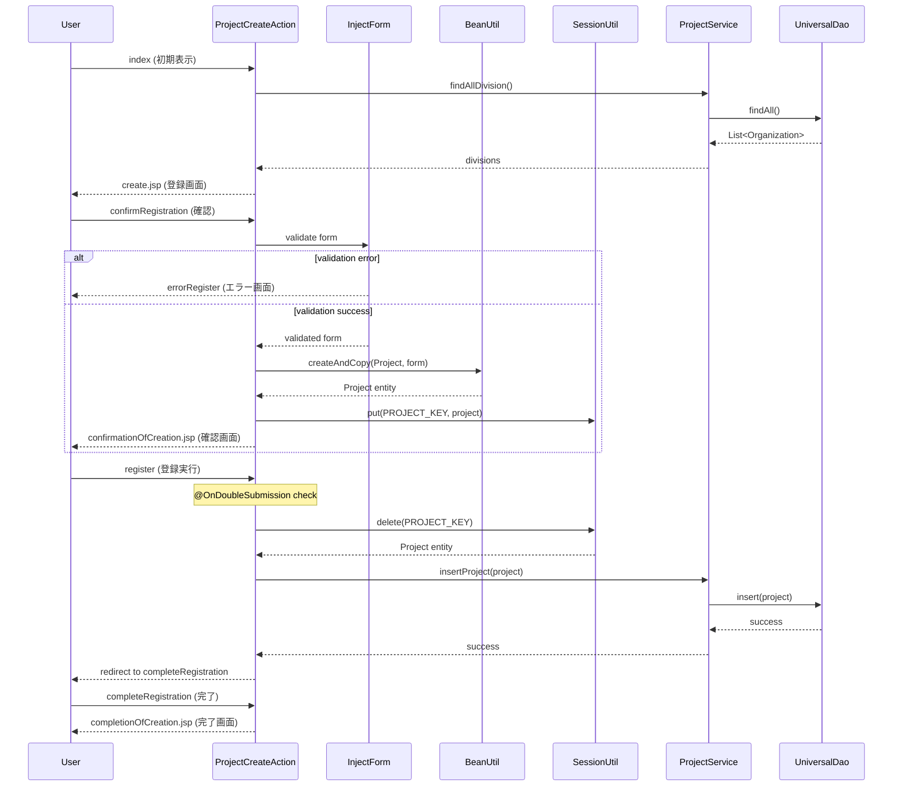

# Code Analysis: ProjectCreateAction

**Generated**: 2026-03-05 18:11:47
**Target**: プロジェクト登録処理
**Modules**: proman-web, proman-common
**Analysis Duration**: 約2分34秒

---

## Overview

ProjectCreateActionは、プロジェクト情報の新規登録を行うWebアクションクラスです。入力画面表示、確認画面表示、登録実行、完了画面表示という4段階の処理フローを実装しています。BeanUtilによるForm-Entity変換、SessionUtilによるセッション管理、@InjectFormによるバリデーション、@OnDoubleSubmissionによる二重送信防止など、Nablarchの標準的なWeb開発パターンを採用しています。

---

## Architecture

### Dependency Graph

```mermaid
classDiagram
    class ProjectCreateAction {
        +index()
        +confirmRegistration()
        +register()
        +completeRegistration()
        +backToEnterRegistration()
    }
    class ProjectCreateForm {
        <<Form>>
    }
    class Project {
        <<Entity>>
    }
    class ProjectService {
        <<Service>>
    }
    class Organization {
        <<Entity>>
    }
    class BeanUtil {
        <<Nablarch>>
    }
    class SessionUtil {
        <<Nablarch>>
    }
    class InjectForm {
        <<Nablarch>>
    }
    class OnError {
        <<Nablarch>>
    }
    class OnDoubleSubmission {
        <<Nablarch>>
    }
    class ExecutionContext {
        <<Nablarch>>
    }
    class HttpRequest {
        <<Nablarch>>
    }
    class HttpResponse {
        <<Nablarch>>
    }
    class DateUtil {
        <<Nablarch>>
    }
    class ApplicationException {
        <<Nablarch>>
    }

    ProjectCreateAction ..> ProjectCreateForm : validates
    ProjectCreateAction ..> Project : creates
    ProjectCreateAction ..> ProjectService : delegates to
    ProjectCreateAction ..> Organization : retrieves
    ProjectCreateAction ..> BeanUtil : uses for conversion
    ProjectCreateAction ..> SessionUtil : uses for session
    ProjectCreateAction ..> ExecutionContext : uses
    ProjectCreateAction ..> HttpRequest : receives
    ProjectCreateAction ..> HttpResponse : returns
    ProjectCreateAction ..> DateUtil : uses for formatting
    ProjectService ..> Organization : queries
```



**Note**: This diagram uses Mermaid `classDiagram` syntax to show class names and their relationships. Use `--|>` for inheritance (extends/implements) and `..>` for dependencies (uses/creates).

### Component Summary

| Component | Role | Type | Dependencies |
|-----------|------|------|--------------|
| ProjectCreateAction | プロジェクト登録アクション | Action | ProjectCreateForm, Project, ProjectService, BeanUtil, SessionUtil |
| ProjectCreateForm | プロジェクト登録フォーム | Form | Bean Validation annotations |
| Project | プロジェクトエンティティ | Entity | Jakarta Persistence annotations |
| ProjectService | プロジェクト業務ロジック | Service | UniversalDao, Organization |
| Organization | 組織エンティティ | Entity | Jakarta Persistence annotations |

---

## Flow

### Processing Flow

1. **初期表示** (`index`) - 事業部/部門プルダウン取得、登録画面表示
2. **確認画面表示** (`confirmRegistration`) - フォームバリデーション、Form→Entity変換、セッション保存、確認画面表示
3. **登録実行** (`register`) - セッションからEntity取得、ProjectService経由で登録、完了画面へリダイレクト
4. **完了画面表示** (`completeRegistration`) - 登録完了画面表示
5. **入力画面へ戻る** (`backToEnterRegistration`) - セッションからEntity取得、Entity→Form変換、入力画面へフォワード

### Sequence Diagram



---

## Components

### 1. ProjectCreateAction

**File**: [ProjectCreateAction.java](.lw/nab-official/v6/nablarch-system-development-guide/Sample_Project/Source_Code/proman-project/proman-web/src/main/java/com/nablarch/example/proman/web/project/ProjectCreateAction.java)

**Role**: プロジェクト登録の画面制御とフロー管理

**Key Methods**:
- `index()` [:33-39] - 初期画面表示、事業部/部門プルダウン設定
- `confirmRegistration()` [:48-63] - 登録確認画面表示、Form→Entity変換、セッション保存
- `register()` [:72-78] - 登録実行、ProjectService呼び出し
- `completeRegistration()` [:87-89] - 登録完了画面表示
- `backToEnterRegistration()` [:98-118] - 入力画面へ戻る、Entity→Form逆変換
- `setOrganizationAndDivisionToRequestScope()` [:125-136] - 事業部/部門データ取得

**Dependencies**:
- ProjectCreateForm (Form validation)
- Project (Entity)
- ProjectService (Business logic)
- Organization (Entity)

**Implementation Points**:
- `@InjectForm`でフォームバリデーション実施 (line 48)
- `@OnError`でバリデーションエラー時の遷移先指定 (line 49)
- `BeanUtil.createAndCopy()`でForm→Entity変換 (line 52)
- `SessionUtil`でEntityをセッション保存 (line 59)
- `@OnDoubleSubmission`で二重送信防止 (line 72)
- `SessionUtil.delete()`で登録時にセッション削除 (line 74)

### 2. ProjectCreateForm

**Role**: プロジェクト登録フォームのバリデーション

**Key Features**:
- Bean Validationアノテーションによる入力チェック
- プロジェクト開始日/終了日のフォーマット検証
- 必須項目チェック

### 3. Project

**Role**: プロジェクトエンティティ

**Key Features**:
- Jakarta Persistenceアノテーションによるテーブルマッピング
- プロジェクト情報の保持 (ID, 名称, 期間, 組織IDなど)

### 4. ProjectService

**Role**: プロジェクト関連の業務ロジック

**Key Methods**:
- `insertProject()` - プロジェクト登録
- `findOrganizationById()` - 組織情報取得
- `findAllDivision()` - 全事業部取得
- `findAllDepartment()` - 全部門取得

**Dependencies**:
- UniversalDao (Database access)
- Organization (Entity)

### 5. Organization

**Role**: 組織エンティティ

**Key Features**:
- 事業部/部門情報の保持
- 上位組織への参照 (upperOrganization)

---

## Nablarch Framework Usage

### BeanUtil

**クラス**: `nablarch.core.beans.BeanUtil`

**説明**: Java Beansオブジェクト間の変換を行うユーティリティ

**使用方法**:
```java
Project project = BeanUtil.createAndCopy(Project.class, form);
ProjectCreateForm form = BeanUtil.createAndCopy(ProjectCreateForm.class, project);
```

**重要ポイント**:
- ✅ **自動型変換**: プロパティ名が一致すれば自動的に変換される
- ⚠️ **プロパティ名の一致**: フォームとエンティティでプロパティ名を統一する必要がある
- 💡 **双方向変換**: Form→EntityもEntity→Formも同じメソッドで実現
- 🎯 **使用タイミング**: フォーム確認画面表示時 (Form→Entity)、入力画面戻り時 (Entity→Form)

**このコードでの使い方**:
- `confirmRegistration()`でForm→Entity変換 (line 52)
- `backToEnterRegistration()`でEntity→Form逆変換 (line 101)

**詳細**: [データバインド知識ベース](../../.claude/skills/nabledge-6/docs/component/libraries/libraries-data_bind.md)

### SessionUtil

**クラス**: `nablarch.common.web.session.SessionUtil`

**説明**: HTTPセッションへのデータ格納・取得を行うユーティリティ

**使用方法**:
```java
SessionUtil.put(context, "key", object);
Object obj = SessionUtil.get(context, "key");
Object obj = SessionUtil.delete(context, "key");
```

**重要ポイント**:
- ✅ **セッションスコープ**: 複数リクエスト間でデータを保持
- ⚠️ **削除タイミング**: 登録実行時には必ず`delete()`でセッションから削除
- 💡 **確認画面パターン**: 確認画面でput、登録実行でdeleteが定石
- ⚡ **メモリ使用**: 大量データをセッション保存すると圧迫するため注意

**このコードでの使い方**:
- `confirmRegistration()`でEntityをセッション保存 (line 59)
- `register()`でセッションから削除して取得 (line 74)
- `backToEnterRegistration()`でセッションから取得 (line 100)

### @InjectForm

**クラス**: `nablarch.common.web.interceptor.InjectForm`

**説明**: HTTPリクエストパラメータをフォームオブジェクトにバインドし、Bean Validationを実行するアノテーション

**使用方法**:
```java
@InjectForm(form = ProjectCreateForm.class, prefix = "form")
public HttpResponse confirmRegistration(HttpRequest request, ExecutionContext context) {
    ProjectCreateForm form = context.getRequestScopedVar("form");
    // ...
}
```

**重要ポイント**:
- ✅ **自動バインド**: リクエストパラメータが自動的にフォームオブジェクトに設定される
- ✅ **自動バリデーション**: Bean Validationアノテーションに基づいて自動検証
- ⚠️ **prefix指定**: `prefix="form"`を指定すると`form.propertyName`パラメータをバインド
- 💡 **リクエストスコープ**: バリデーション済みフォームはリクエストスコープから取得
- 🎯 **@OnErrorと併用**: バリデーションエラー時の遷移先を@OnErrorで指定

**このコードでの使い方**:
- `confirmRegistration()`で`@InjectForm`と`@OnError`を併用 (lines 48-49)
- バリデーション成功時にフォームをリクエストスコープから取得 (line 51)

### @OnError

**クラス**: `nablarch.fw.web.interceptor.OnError`

**説明**: 例外発生時の遷移先を指定するアノテーション

**使用方法**:
```java
@OnError(type = ApplicationException.class, path = "forward:///app/project/errorRegister")
```

**重要ポイント**:
- ✅ **例外ハンドリング**: 指定した例外型をキャッチして遷移先へフォワード
- ⚠️ **遷移方式**: `forward://`でフォワード、`redirect://`でリダイレクト
- 💡 **ApplicationException**: Bean Validationエラーは`ApplicationException`として発生
- 🎯 **@InjectFormと併用**: フォームバリデーションエラー時の遷移先指定に使用

**このコードでの使い方**:
- `confirmRegistration()`でバリデーションエラー時の遷移先を指定 (line 49)

### @OnDoubleSubmission

**クラス**: `nablarch.common.web.token.OnDoubleSubmission`

**説明**: 二重送信を防止するアノテーション

**使用方法**:
```java
@OnDoubleSubmission
public HttpResponse register(HttpRequest request, ExecutionContext context) {
    // 登録処理
}
```

**重要ポイント**:
- ✅ **トークンチェック**: リクエストパラメータのトークンとセッション内トークンを比較
- ⚠️ **初回のみ実行**: 二重送信を検知すると、デフォルトでは二重送信エラー画面へ遷移
- 💡 **画面遷移パターン**: 確認画面→登録実行の間で使用
- 🎯 **使用タイミング**: データ更新を伴うアクションメソッドに付与

**このコードでの使い方**:
- `register()`メソッドに付与して二重登録を防止 (line 72)

### DateUtil

**クラス**: `nablarch.core.util.DateUtil`

**説明**: 日付フォーマット変換を行うユーティリティ

**使用方法**:
```java
String formatted = DateUtil.formatDate(date, "yyyy/MM/dd");
```

**重要ポイント**:
- ✅ **フォーマット指定**: SimpleDateFormatパターンで書式指定
- ⚠️ **null処理**: nullが渡されるとnullを返す
- 💡 **双方向変換**: formatDateとparseDateで相互変換可能

**このコードでの使い方**:
- `backToEnterRegistration()`でプロジェクト開始日/終了日を`yyyy/MM/dd`形式に変換 (lines 103-104)

---

## References

### Source Files

- [ProjectCreateAction.java (.lw/nab-official/v6/nablarch-system-development-guide/en/Sample_Project/Source_Code/proman-project/proman-web/src/main/java/com/nablarch/example/proman/web/project)](../../.lw/nab-official/v6/nablarch-system-development-guide/en/Sample_Project/Source_Code/proman-project/proman-web/src/main/java/com/nablarch/example/proman/web/project/ProjectCreateAction.java) - ProjectCreateAction
- [ProjectCreateAction.java (.lw/nab-official/v6/nablarch-system-development-guide/Sample_Project/Source_Code/proman-project/proman-web/src/main/java/com/nablarch/example/proman/web/project)](../../.lw/nab-official/v6/nablarch-system-development-guide/Sample_Project/Source_Code/proman-project/proman-web/src/main/java/com/nablarch/example/proman/web/project/ProjectCreateAction.java) - ProjectCreateAction
- [ProjectCreateForm.java (.lw/nab-official/v6/nablarch-system-development-guide/en/Sample_Project/Source_Code/proman-project/proman-web/src/main/java/com/nablarch/example/proman/web/project)](../../.lw/nab-official/v6/nablarch-system-development-guide/en/Sample_Project/Source_Code/proman-project/proman-web/src/main/java/com/nablarch/example/proman/web/project/ProjectCreateForm.java) - ProjectCreateForm
- [ProjectCreateForm.java (.lw/nab-official/v6/nablarch-system-development-guide/Sample_Project/Source_Code/proman-project/proman-web/src/main/java/com/nablarch/example/proman/web/project)](../../.lw/nab-official/v6/nablarch-system-development-guide/Sample_Project/Source_Code/proman-project/proman-web/src/main/java/com/nablarch/example/proman/web/project/ProjectCreateForm.java) - ProjectCreateForm
- [ProjectService.java (.lw/nab-official/v6/nablarch-system-development-guide/en/Sample_Project/Source_Code/proman-project/proman-web/src/main/java/com/nablarch/example/proman/web/project)](../../.lw/nab-official/v6/nablarch-system-development-guide/en/Sample_Project/Source_Code/proman-project/proman-web/src/main/java/com/nablarch/example/proman/web/project/ProjectService.java) - ProjectService
- [ProjectService.java (.lw/nab-official/v6/nablarch-system-development-guide/Sample_Project/Source_Code/proman-project/proman-web/src/main/java/com/nablarch/example/proman/web/project)](../../.lw/nab-official/v6/nablarch-system-development-guide/Sample_Project/Source_Code/proman-project/proman-web/src/main/java/com/nablarch/example/proman/web/project/ProjectService.java) - ProjectService

### Knowledge Base (Nabledge-6)

- [Libraries Data_bind](../../.claude/skills/nabledge-6/docs/component/libraries/libraries-data_bind.md)
- [Libraries Universal_dao](../../.claude/skills/nabledge-6/docs/component/libraries/libraries-universal_dao.md)

### Official Documentation


- [BasicDaoContextFactory](https://nablarch.github.io/docs/LATEST/javadoc/nablarch/common/dao/BasicDaoContextFactory.html)
- [BeanUtil](https://nablarch.github.io/docs/LATEST/javadoc/nablarch/core/beans/BeanUtil.html)
- [ConnectionFactory](https://nablarch.github.io/docs/LATEST/javadoc/nablarch/core/db/connection/ConnectionFactory.html)
- [CsvDataBindConfig](https://nablarch.github.io/docs/LATEST/javadoc/nablarch/common/databind/csv/CsvDataBindConfig.html)
- [CsvFormat](https://nablarch.github.io/docs/LATEST/javadoc/nablarch/common/databind/csv/CsvFormat.html)
- [Csv](https://nablarch.github.io/docs/LATEST/javadoc/nablarch/common/databind/csv/Csv.html)
- [Data Bind](https://nablarch.github.io/docs/LATEST/doc/application_framework/application_framework/libraries/data_io/data_bind.html)
- [DataBindConfig](https://nablarch.github.io/docs/LATEST/javadoc/nablarch/common/databind/DataBindConfig.html)
- [DatabaseMetaDataExtractor](https://nablarch.github.io/docs/LATEST/javadoc/nablarch/common/dao/DatabaseMetaDataExtractor.html)
- [Date](https://nablarch.github.io/docs/LATEST/javadoc/java/sql/Date.html)
- [DeferredEntityList](https://nablarch.github.io/docs/LATEST/javadoc/nablarch/common/dao/DeferredEntityList.html)
- [Dialect](https://nablarch.github.io/docs/LATEST/javadoc/nablarch/core/db/dialect/Dialect.html)
- [EntityList](https://nablarch.github.io/docs/LATEST/javadoc/nablarch/common/dao/EntityList.html)
- [Field](https://nablarch.github.io/docs/LATEST/javadoc/nablarch/common/databind/fixedlength/Field.html)
- [FileResponse](https://nablarch.github.io/docs/LATEST/javadoc/nablarch/common/web/download/FileResponse.html)
- [FixedLengthDataBindConfigBuilder](https://nablarch.github.io/docs/LATEST/javadoc/nablarch/common/databind/fixedlength/FixedLengthDataBindConfigBuilder.html)
- [FixedLengthDataBindConfig](https://nablarch.github.io/docs/LATEST/javadoc/nablarch/common/databind/fixedlength/FixedLengthDataBindConfig.html)
- [FixedLength](https://nablarch.github.io/docs/LATEST/javadoc/nablarch/common/databind/fixedlength/FixedLength.html)
- [GenerationType](https://nablarch.github.io/docs/LATEST/javadoc/jakarta/persistence/GenerationType.html)
- [H2Dialect](https://nablarch.github.io/docs/LATEST/javadoc/nablarch/core/db/dialect/H2Dialect.html)
- [Integer](https://nablarch.github.io/docs/LATEST/javadoc/java/lang/Integer.html)
- [LineNumber](https://nablarch.github.io/docs/LATEST/javadoc/nablarch/common/databind/LineNumber.html)
- [Long](https://nablarch.github.io/docs/LATEST/javadoc/java/lang/Long.html)
- [MultiLayoutConfig.RecordIdentifier](https://nablarch.github.io/docs/LATEST/javadoc/nablarch/common/databind/fixedlength/MultiLayoutConfig.RecordIdentifier.html)
- [MultiLayout](https://nablarch.github.io/docs/LATEST/javadoc/nablarch/common/databind/fixedlength/MultiLayout.html)
- [ObjectMapperFactory](https://nablarch.github.io/docs/LATEST/javadoc/nablarch/common/databind/ObjectMapperFactory.html)
- [ObjectMapper](https://nablarch.github.io/docs/LATEST/javadoc/nablarch/common/databind/ObjectMapper.html)
- [OnError](https://nablarch.github.io/docs/LATEST/javadoc/nablarch/fw/web/interceptor/OnError.html)
- [OptimisticLockException](https://nablarch.github.io/docs/LATEST/javadoc/jakarta/persistence/OptimisticLockException.html)
- [Package-summary](https://nablarch.github.io/docs/LATEST/javadoc/nablarch/common/databind/fixedlength/converter/package-summary.html)
- [Pagination](https://nablarch.github.io/docs/LATEST/javadoc/nablarch/common/dao/Pagination.html)
- [PartInfo](https://nablarch.github.io/docs/LATEST/javadoc/nablarch/fw/web/upload/PartInfo.html)
- [SimpleDbTransactionManager](https://nablarch.github.io/docs/LATEST/javadoc/nablarch/core/db/transaction/SimpleDbTransactionManager.html)
- [TransactionFactory](https://nablarch.github.io/docs/LATEST/javadoc/nablarch/core/transaction/TransactionFactory.html)
- [Universal Dao](https://nablarch.github.io/docs/LATEST/doc/application_framework/application_framework/libraries/database/universal_dao.html)
- [UniversalDao.Transaction](https://nablarch.github.io/docs/LATEST/javadoc/nablarch/common/dao/UniversalDao.Transaction.html)
- [UniversalDao](https://nablarch.github.io/docs/LATEST/javadoc/nablarch/common/dao/UniversalDao.html)

---

**Note**: This documentation was generated by the code-analysis workflow of the nabledge-6 skill.
