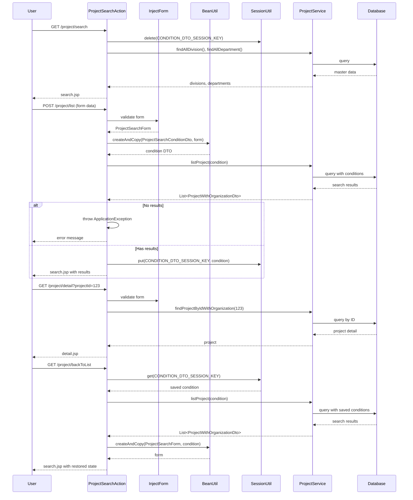

# Code Analysis: ProjectSearchAction

**Generated**: 2026-03-05 18:11:43
**Target**: プロジェクト検索・一覧表示Webアクション
**Modules**: proman-web
**Analysis Duration**: 約3分5秒

---

## Overview

ProjectSearchActionは、プロジェクト検索画面および検索結果一覧表示を担当するWebアクションクラスです。ユーザーの検索条件入力、バリデーション、データベース検索、検索結果のセッション保存、検索画面への戻り処理など、プロジェクト検索に関する一連の操作を提供します。

主な機能として、初期表示(`search`)、検索実行(`list`)、詳細画面からの戻り処理(`backToList`)、詳細画面表示(`detail`)の4つのエンドポイントを実装しています。`@InjectForm`アノテーションによる自動フォーム注入、`@OnError`アノテーションによる例外ハンドリング、`SessionUtil`によるセッション管理、`BeanUtil`によるBean変換を活用し、Nablarchのアーキテクチャに沿った実装となっています。

---

## Architecture

### Dependency Graph

```mermaid
classDiagram
    class ProjectSearchAction {
        +search() HttpResponse
        +list() HttpResponse
        +backToList() HttpResponse
        +detail() HttpResponse
    }
    class ProjectSearchForm {
        <<Form>>
    }
    class ProjectSearchConditionDto {
        <<DTO>>
    }
    class ProjectDetailInitialForm {
        <<Form>>
    }
    class ProjectService {
        +listProject() List
        +findProjectByIdWithOrganization() Object
        +findAllDivision() List
        +findAllDepartment() List
    }
    class ProjectWithOrganizationDto {
        <<DTO>>
    }
    class InjectForm {
        <<Nablarch>>
    }
    class SessionUtil {
        <<Nablarch>>
    }
    class BeanUtil {
        <<Nablarch>>
    }
    class HttpRequest {
        <<Nablarch>>
    }
    class HttpResponse {
        <<Nablarch>>
    }
    class ExecutionContext {
        <<Nablarch>>
    }
    class ApplicationException {
        <<Nablarch>>
    }

    ProjectSearchAction ..> ProjectSearchForm : validates
    ProjectSearchAction ..> ProjectSearchConditionDto : creates
    ProjectSearchAction ..> ProjectDetailInitialForm : validates
    ProjectSearchAction ..> ProjectService : invokes
    ProjectSearchAction ..> InjectForm : uses
    ProjectSearchAction ..> SessionUtil : uses
    ProjectSearchAction ..> BeanUtil : uses
    ProjectSearchAction ..> HttpRequest : receives
    ProjectSearchAction ..> HttpResponse : returns
    ProjectSearchAction ..> ExecutionContext : uses
    ProjectSearchAction ..> ApplicationException : throws
    ProjectService ..> ProjectWithOrganizationDto : returns
```



**Note**: This diagram uses Mermaid `classDiagram` syntax to show class names and their relationships. Use `--|>` for inheritance (extends/implements) and `..>` for dependencies (uses/creates).

### Component Summary

| Component | Role | Type | Dependencies |
|-----------|------|------|--------------|
| ProjectSearchAction | プロジェクト検索・一覧表示処理 | Action | ProjectSearchForm, ProjectSearchConditionDto, ProjectService, InjectForm, SessionUtil, BeanUtil |
| ProjectSearchForm | プロジェクト検索フォーム入力検証 | Form | なし |
| ProjectSearchConditionDto | プロジェクト検索条件データ転送オブジェクト | DTO | なし |
| ProjectDetailInitialForm | プロジェクト詳細画面初期表示フォーム | Form | なし |
| ProjectService | プロジェクトビジネスロジック | Service | UniversalDao |
| ProjectWithOrganizationDto | プロジェクトと組織情報の結合DTO | DTO | なし |

---

## Flow

### Processing Flow

**1. 検索画面初期表示 (search)**
- セッションから検索条件を削除
- 事業部・部門のマスタデータをリクエストスコープに設定
- 検索画面JSPを返却

**2. 検索実行 (list)**
- `@InjectForm`でフォームを自動注入し、バリデーション実行
- バリデーションエラー時は`@OnError`で検索画面へforward
- フォームデータを`BeanUtil`でDTOに変換
- `ProjectService.listProject()`でデータベース検索
- 検索結果0件時は`ApplicationException`をスロー
- 検索条件を`SessionUtil`でセッションに保存
- 検索結果をリクエストスコープに設定し、検索画面JSPを返却

**3. 詳細画面からの戻り処理 (backToList)**
- `SessionUtil`からセッション保存済みの検索条件を取得
- 検索条件で再度データベース検索を実行
- DTOをフォームに変換してリクエストスコープに復元
- 検索画面JSPを返却

**4. 詳細画面表示 (detail)**
- `@InjectForm`でプロジェクトIDを取得
- `ProjectService`でプロジェクト情報を取得
- 顧客情報をダミーデータで設定
- 詳細画面JSPを返却

### Sequence Diagram



---

## Components

### 1. ProjectSearchAction

**File**: [ProjectSearchAction.java:1-138](../../.lw/nab-official/v6/nablarch-system-development-guide/Sample_Project/Source_Code/proman-project/proman-web/src/main/java/com/nablarch/example/proman/web/project/ProjectSearchAction.java)

**Role**: プロジェクト検索・一覧表示を担当するWebアクションクラス

**Key Methods**:
- `search()` [:35-40] - 検索画面初期表示。セッション削除、マスタデータ設定、JSP返却
- `list()` [:51-69] - 検索実行。フォーム注入・バリデーション、Bean変換、検索実行、セッション保存
- `backToList()` [:79-91] - 詳細画面からの戻り処理。セッションから検索条件復元、検索再実行
- `detail()` [:102-109] - 詳細画面表示。プロジェクトIDで詳細情報取得
- `searchProjectAndSetToRequestScope()` [:117-125] - プロジェクト検索実行のプライベートメソッド
- `setOrganizationAndDivisionToRequestScope()` [:132-136] - 事業部・部門マスタ取得のプライベートメソッド

**Dependencies**:
- ProjectSearchForm, ProjectDetailInitialForm: 入力検証用フォームクラス
- ProjectSearchConditionDto: 検索条件保持用DTO
- ProjectService: ビジネスロジック層のサービスクラス
- Nablarchフレームワーククラス: InjectForm, SessionUtil, BeanUtil, ExecutionContext, HttpRequest, HttpResponse, OnError, ApplicationException, MessageUtil, StringUtil

**Implementation Points**:
- `@InjectForm`で自動フォーム注入とバリデーション実行
- `@OnError`でバリデーションエラー時の遷移先を宣言的に指定
- `BeanUtil.createAndCopy()`でフォーム⇔DTO間の変換を実施
- `SessionUtil`で検索条件をセッションに保存し、詳細画面からの戻り時に復元
- 検索結果0件時は`ApplicationException`をスローし、エラーメッセージ表示

### 2. ProjectSearchForm

**File**: [ProjectSearchForm.java](../../.lw/nab-official/v6/nablarch-system-development-guide/Sample_Project/Source_Code/proman-project/proman-web/src/main/java/com/nablarch/example/proman/web/project/ProjectSearchForm.java)

**Role**: プロジェクト検索画面の入力項目を保持し、Bean Validationアノテーションによるバリデーションルールを定義

**Key Properties**:
- プロジェクト名、開始日、終了日、組織情報、ページ番号など

**Validation**:
- Bean Validationアノテーション(`@Length`, `@Pattern`など)によるルール定義
- `@InjectForm`により自動的にバリデーション実行

### 3. ProjectSearchConditionDto

**File**: [ProjectSearchConditionDto.java](../../.lw/nab-official/v6/nablarch-system-development-guide/Sample_Project/Source_Code/proman-project/proman-web/src/main/java/com/nablarch/example/proman/web/project/ProjectSearchConditionDto.java)

**Role**: プロジェクト検索条件を保持するデータ転送オブジェクト

**Usage**:
- `BeanUtil`でフォームから変換されてサービス層に渡される
- `SessionUtil`でセッションに保存され、検索状態を維持

### 4. ProjectService

**File**: [ProjectService.java](../../.lw/nab-official/v6/nablarch-system-development-guide/Sample_Project/Source_Code/proman-project/proman-web/src/main/java/com/nablarch/example/proman/web/project/ProjectService.java)

**Role**: プロジェクト関連のビジネスロジックを提供するサービスクラス

**Key Methods**:
- `listProject(ProjectSearchConditionDto)` - 検索条件に基づくプロジェクト一覧取得
- `findProjectByIdWithOrganization(Integer)` - プロジェクトID指定での詳細情報取得
- `findAllDivision()` - 事業部マスタ全件取得
- `findAllDepartment()` - 部門マスタ全件取得

**Implementation**:
- `UniversalDao`を使用してデータベースアクセスを実施
- SQLファイルによるクエリ定義

### 5. ProjectWithOrganizationDto

**File**: [ProjectWithOrganizationDto.java](../../.lw/nab-official/v6/nablarch-system-development-guide/Sample_Project/Source_Code/proman-project/proman-web/src/main/java/com/nablarch/example/proman/web/project/ProjectWithOrganizationDto.java)

**Role**: プロジェクト情報と組織情報を結合したデータ転送オブジェクト

**Usage**:
- `ProjectService.listProject()`の戻り値として使用
- SQLのJOIN結果をマッピング

### 6. ProjectDetailInitialForm

**File**: [ProjectDetailInitialForm.java](../../.lw/nab-official/v6/nablarch-system-development-guide/Sample_Project/Source_Code/proman-project/proman-web/src/main/java/com/nablarch/example/proman/web/project/ProjectDetailInitialForm.java)

**Role**: プロジェクト詳細画面初期表示時のリクエストパラメータ(プロジェクトID)を保持

---

## Nablarch Framework Usage

### InjectForm

**クラス**: `nablarch.common.web.interceptor.InjectForm`

**説明**: リクエストパラメータを自動的にフォームオブジェクトに変換し、Bean Validationによるバリデーションを実行するインターセプタアノテーション

**使用方法**:
```java
@InjectForm(form = ProjectSearchForm.class, prefix = "form")
public HttpResponse list(HttpRequest request, ExecutionContext context) {
    ProjectSearchForm form = context.getRequestScopedVar("form");
    // formオブジェクトを使用
}
```

**重要ポイント**:
- ✅ **必須**: フォームクラスはJavaBeansの規約に従う必要がある(getter/setter, デフォルトコンストラクタ)
- ✅ **自動バリデーション**: Bean Validationアノテーション(`@Length`, `@Pattern`など)に基づき自動的にバリデーション実行
- 💡 **prefix指定**: リクエストスコープに格納する際の変数名を指定可能(デフォルトは"form")
- ⚠️ **エラーハンドリング**: バリデーションエラー時は`ApplicationException`がスローされるため、`@OnError`と組み合わせて使用
- 🎯 **いつ使うか**: すべてのリクエストハンドラメソッドで入力値を受け取る際に使用

**このコードでの使い方**:
- `list()`メソッド[:49]で`@InjectForm(form = ProjectSearchForm.class, prefix = "form")`を指定
- `detail()`メソッド[:101]で`@InjectForm(form = ProjectDetailInitialForm.class)`を指定
- バリデーション結果は自動的にリクエストスコープの"form"変数に格納

**詳細**: [Libraries Data_bind](../../.claude/skills/nabledge-6/docs/component/libraries/libraries-data_bind.md)

### OnError

**クラス**: `nablarch.fw.web.interceptor.OnError`

**説明**: 例外発生時の遷移先を宣言的に指定するインターセプタアノテーション

**使用方法**:
```java
@InjectForm(form = ProjectSearchForm.class)
@OnError(type = ApplicationException.class, path = "forward://search")
public HttpResponse list(HttpRequest request, ExecutionContext context) {
    // バリデーションエラー時は自動的にsearchメソッドへforward
}
```

**重要ポイント**:
- 💡 **宣言的エラーハンドリング**: try-catchを書かずにエラー時の遷移先を指定可能
- ✅ **type指定**: ハンドリングする例外の型を指定(複数指定可能)
- ✅ **path指定**: 遷移先を"forward://methodName"または"redirect://path"で指定
- 🎯 **いつ使うか**: フォームバリデーションエラー、業務エラーの遷移先を指定する際に使用
- ⚠️ **forward時の注意**: forward先のメソッドはリクエストパラメータなしで実行されるため、リクエストスコープのデータを参照する設計が必要

**このコードでの使い方**:
- `list()`メソッド[:50]で`@OnError(type = ApplicationException.class, path = "forward://search")`を指定
- `backToList()`メソッド[:78]で同様に指定
- バリデーションエラー時はsearchメソッドへforwardし、検索画面を再表示

### SessionUtil

**クラス**: `nablarch.common.web.session.SessionUtil`

**説明**: HTTPセッションへのデータ保存・取得を簡潔に行うユーティリティクラス

**使用方法**:
```java
// 保存
SessionUtil.put(context, "searchCondition", condition);

// 取得
ProjectSearchConditionDto condition = SessionUtil.get(context, "searchCondition");

// 削除
SessionUtil.delete(context, "searchCondition");
```

**重要ポイント**:
- ✅ **型安全**: ジェネリクスにより型安全な保存・取得が可能
- 💡 **簡潔な記述**: 標準のHttpSessionよりもシンプルな記述でセッションアクセス
- ⚠️ **セッションスコープ**: データは複数リクエストをまたいで保持されるため、適切なタイミングでdeleteすること
- 🎯 **いつ使うか**: 検索条件の保持、ウィザード形式の入力データ保持、認証情報の保持など
- ⚡ **パフォーマンス**: セッションに大量データを保存するとメモリを圧迫するため、必要最小限のデータのみ保存

**このコードでの使い方**:
- `search()`メソッド[:36]で検索条件を削除(`SessionUtil.delete()`)
- `list()`メソッド[:66]で検索条件を保存(`SessionUtil.put()`)
- `backToList()`メソッド[:81]で検索条件を取得(`SessionUtil.get()`)
- 検索画面→詳細画面→検索画面の遷移時に検索状態を復元

**詳細**: Nablarchセッション管理機能

### BeanUtil

**クラス**: `nablarch.core.beans.BeanUtil`

**説明**: JavaBeans間でプロパティ値をコピーするユーティリティクラス。プロパティ名が一致する項目を自動的にコピー

**使用方法**:
```java
// フォームからDTOへ変換
ProjectSearchConditionDto condition = BeanUtil.createAndCopy(
    ProjectSearchConditionDto.class, form);

// DTOからフォームへ変換
ProjectSearchForm form = BeanUtil.createAndCopy(
    ProjectSearchForm.class, condition);
```

**重要ポイント**:
- 💡 **自動マッピング**: プロパティ名が一致する項目を自動的にコピーするため、手動での値設定が不要
- ✅ **型変換**: プロパティの型に応じて自動的に型変換を実施(String→Integer、String→Dateなど)
- ⚠️ **型変換失敗時**: 型変換に失敗すると例外がスローされるため、外部入力値は全てString型で受け取ることを推奨
- 🎯 **いつ使うか**: フォーム⇔DTO間、DTO⇔Entity間の変換時に使用
- ⚡ **パフォーマンス**: リフレクションを使用するため、大量データの変換時は性能に注意

**このコードでの使い方**:
- `list()`メソッド[:58]で`BeanUtil.createAndCopy(ProjectSearchConditionDto.class, form)`によりフォームからDTOへ変換
- `backToList()`メソッド[:85]で`BeanUtil.createAndCopy(ProjectSearchForm.class, condition)`によりDTOからフォームへ変換
- フォームとDTOの変換処理を簡潔に記述

**詳細**: [Libraries Data_bind](../../.claude/skills/nabledge-6/docs/component/libraries/libraries-data_bind.md)

### ApplicationException

**クラス**: `nablarch.core.message.ApplicationException`

**説明**: 業務エラーを表す例外クラス。メッセージリソースに定義されたエラーメッセージを保持

**使用方法**:
```java
if (searchResult.isEmpty()) {
    throw new ApplicationException(
        MessageUtil.createMessage(MessageLevel.ERROR, "errors.nothing.search", "プロジェクト"));
}
```

**重要ポイント**:
- 💡 **業務エラー専用**: システムエラー(RuntimeException)とは区別し、業務エラーには必ずこの例外を使用
- ✅ **メッセージ管理**: エラーメッセージはメッセージリソースで一元管理
- ✅ **`@OnError`との連携**: `@OnError`アノテーションで捕捉し、エラー画面へ遷移可能
- 🎯 **いつ使うか**: バリデーションエラー、検索結果0件、業務ルール違反など
- ⚠️ **トランザクション**: `ApplicationException`スロー時はトランザクションがロールバックされる

**このコードでの使い方**:
- `searchProjectAndSetToRequestScope()`メソッド[:121-123]で検索結果0件時にスロー
- `@OnError`により自動的にsearchメソッドへforwardし、エラーメッセージを表示

### UniversalDao (ProjectService経由で使用)

**クラス**: `nablarch.common.dao.UniversalDao`

**説明**: SQLファイルによるデータベースアクセスを提供するO/Rマッパー。CRUD操作、ページング、楽観ロックなどをサポート

**使用方法**:
```java
// SQLファイルによる検索
List<ProjectWithOrganizationDto> searchResult =
    UniversalDao.findAllBySqlFile(ProjectWithOrganizationDto.class, "FIND_PROJECT_LIST");

// ページング検索
EntityList<ProjectWithOrganizationDto> searchResult =
    UniversalDao.per(20).page(1)
        .findAllBySqlFile(ProjectWithOrganizationDto.class, "FIND_PROJECT_LIST");
```

**重要ポイント**:
- 💡 **SQLファイル駆動**: SQLは外部ファイルで管理し、Java側では結果のマッピングのみ記述
- ✅ **ページング機能**: `per()`, `page()`メソッドでページング処理を簡潔に実装
- ✅ **動的SQL**: SQLファイル内で`$if`ディレクティブを使用した条件分岐が可能
- 🎯 **いつ使うか**: 複雑な検索条件、JOIN、集計など、業務ロジックに応じたSQL実行時に使用
- ⚡ **パフォーマンス**: ページング使用時は件数取得SQLが先に発行されるため、性能劣化時はSQLのカスタマイズが必要

**このコードでの使い方**:
- `ProjectService.listProject()`メソッドで検索条件に基づくプロジェクト一覧取得
- `ProjectService.findProjectByIdWithOrganization()`メソッドでプロジェクトID指定での詳細情報取得
- `ProjectService.findAllDivision()`, `findAllDepartment()`でマスタデータ取得

**詳細**: [Libraries Universal_dao](../../.claude/skills/nabledge-6/docs/component/libraries/libraries-universal_dao.md)

---

## References

### Source Files

- [ProjectSearchAction.java (.lw/nab-official/v6/nablarch-system-development-guide/en/Sample_Project/Source_Code/proman-project/proman-web/src/main/java/com/nablarch/example/proman/web/project)](../../.lw/nab-official/v6/nablarch-system-development-guide/en/Sample_Project/Source_Code/proman-project/proman-web/src/main/java/com/nablarch/example/proman/web/project/ProjectSearchAction.java) - ProjectSearchAction
- [ProjectSearchAction.java (.lw/nab-official/v6/nablarch-system-development-guide/Sample_Project/Source_Code/proman-project/proman-web/src/main/java/com/nablarch/example/proman/web/project)](../../.lw/nab-official/v6/nablarch-system-development-guide/Sample_Project/Source_Code/proman-project/proman-web/src/main/java/com/nablarch/example/proman/web/project/ProjectSearchAction.java) - ProjectSearchAction
- [ProjectSearchForm.java (.lw/nab-official/v6/nablarch-system-development-guide/en/Sample_Project/Source_Code/proman-project/proman-web/src/main/java/com/nablarch/example/proman/web/project)](../../.lw/nab-official/v6/nablarch-system-development-guide/en/Sample_Project/Source_Code/proman-project/proman-web/src/main/java/com/nablarch/example/proman/web/project/ProjectSearchForm.java) - ProjectSearchForm
- [ProjectSearchForm.java (.lw/nab-official/v6/nablarch-system-development-guide/Sample_Project/Source_Code/proman-project/proman-web/src/main/java/com/nablarch/example/proman/web/project)](../../.lw/nab-official/v6/nablarch-system-development-guide/Sample_Project/Source_Code/proman-project/proman-web/src/main/java/com/nablarch/example/proman/web/project/ProjectSearchForm.java) - ProjectSearchForm
- [ProjectSearchConditionDto.java (.lw/nab-official/v6/nablarch-system-development-guide/en/Sample_Project/Source_Code/proman-project/proman-web/src/main/java/com/nablarch/example/proman/web/project)](../../.lw/nab-official/v6/nablarch-system-development-guide/en/Sample_Project/Source_Code/proman-project/proman-web/src/main/java/com/nablarch/example/proman/web/project/ProjectSearchConditionDto.java) - ProjectSearchConditionDto
- [ProjectSearchConditionDto.java (.lw/nab-official/v6/nablarch-system-development-guide/Sample_Project/Source_Code/proman-project/proman-web/src/main/java/com/nablarch/example/proman/web/project)](../../.lw/nab-official/v6/nablarch-system-development-guide/Sample_Project/Source_Code/proman-project/proman-web/src/main/java/com/nablarch/example/proman/web/project/ProjectSearchConditionDto.java) - ProjectSearchConditionDto
- [ProjectService.java (.lw/nab-official/v6/nablarch-system-development-guide/en/Sample_Project/Source_Code/proman-project/proman-web/src/main/java/com/nablarch/example/proman/web/project)](../../.lw/nab-official/v6/nablarch-system-development-guide/en/Sample_Project/Source_Code/proman-project/proman-web/src/main/java/com/nablarch/example/proman/web/project/ProjectService.java) - ProjectService
- [ProjectService.java (.lw/nab-official/v6/nablarch-system-development-guide/Sample_Project/Source_Code/proman-project/proman-web/src/main/java/com/nablarch/example/proman/web/project)](../../.lw/nab-official/v6/nablarch-system-development-guide/Sample_Project/Source_Code/proman-project/proman-web/src/main/java/com/nablarch/example/proman/web/project/ProjectService.java) - ProjectService

### Knowledge Base (Nabledge-6)

- [Libraries Data_bind](../../.claude/skills/nabledge-6/docs/component/libraries/libraries-data_bind.md)
- [Libraries Universal_dao](../../.claude/skills/nabledge-6/docs/component/libraries/libraries-universal_dao.md)

### Official Documentation


- [BasicDaoContextFactory](https://nablarch.github.io/docs/LATEST/javadoc/nablarch/common/dao/BasicDaoContextFactory.html)
- [BeanUtil](https://nablarch.github.io/docs/LATEST/javadoc/nablarch/core/beans/BeanUtil.html)
- [ConnectionFactory](https://nablarch.github.io/docs/LATEST/javadoc/nablarch/core/db/connection/ConnectionFactory.html)
- [CsvDataBindConfig](https://nablarch.github.io/docs/LATEST/javadoc/nablarch/common/databind/csv/CsvDataBindConfig.html)
- [CsvFormat](https://nablarch.github.io/docs/LATEST/javadoc/nablarch/common/databind/csv/CsvFormat.html)
- [Csv](https://nablarch.github.io/docs/LATEST/javadoc/nablarch/common/databind/csv/Csv.html)
- [Data Bind](https://nablarch.github.io/docs/LATEST/doc/application_framework/application_framework/libraries/data_io/data_bind.html)
- [DataBindConfig](https://nablarch.github.io/docs/LATEST/javadoc/nablarch/common/databind/DataBindConfig.html)
- [DatabaseMetaDataExtractor](https://nablarch.github.io/docs/LATEST/javadoc/nablarch/common/dao/DatabaseMetaDataExtractor.html)
- [Date](https://nablarch.github.io/docs/LATEST/javadoc/java/sql/Date.html)
- [DeferredEntityList](https://nablarch.github.io/docs/LATEST/javadoc/nablarch/common/dao/DeferredEntityList.html)
- [Dialect](https://nablarch.github.io/docs/LATEST/javadoc/nablarch/core/db/dialect/Dialect.html)
- [EntityList](https://nablarch.github.io/docs/LATEST/javadoc/nablarch/common/dao/EntityList.html)
- [Field](https://nablarch.github.io/docs/LATEST/javadoc/nablarch/common/databind/fixedlength/Field.html)
- [FileResponse](https://nablarch.github.io/docs/LATEST/javadoc/nablarch/common/web/download/FileResponse.html)
- [FixedLengthDataBindConfigBuilder](https://nablarch.github.io/docs/LATEST/javadoc/nablarch/common/databind/fixedlength/FixedLengthDataBindConfigBuilder.html)
- [FixedLengthDataBindConfig](https://nablarch.github.io/docs/LATEST/javadoc/nablarch/common/databind/fixedlength/FixedLengthDataBindConfig.html)
- [FixedLength](https://nablarch.github.io/docs/LATEST/javadoc/nablarch/common/databind/fixedlength/FixedLength.html)
- [GenerationType](https://nablarch.github.io/docs/LATEST/javadoc/jakarta/persistence/GenerationType.html)
- [H2Dialect](https://nablarch.github.io/docs/LATEST/javadoc/nablarch/core/db/dialect/H2Dialect.html)
- [Integer](https://nablarch.github.io/docs/LATEST/javadoc/java/lang/Integer.html)
- [LineNumber](https://nablarch.github.io/docs/LATEST/javadoc/nablarch/common/databind/LineNumber.html)
- [Long](https://nablarch.github.io/docs/LATEST/javadoc/java/lang/Long.html)
- [MultiLayoutConfig.RecordIdentifier](https://nablarch.github.io/docs/LATEST/javadoc/nablarch/common/databind/fixedlength/MultiLayoutConfig.RecordIdentifier.html)
- [MultiLayout](https://nablarch.github.io/docs/LATEST/javadoc/nablarch/common/databind/fixedlength/MultiLayout.html)
- [ObjectMapperFactory](https://nablarch.github.io/docs/LATEST/javadoc/nablarch/common/databind/ObjectMapperFactory.html)
- [ObjectMapper](https://nablarch.github.io/docs/LATEST/javadoc/nablarch/common/databind/ObjectMapper.html)
- [OnError](https://nablarch.github.io/docs/LATEST/javadoc/nablarch/fw/web/interceptor/OnError.html)
- [OptimisticLockException](https://nablarch.github.io/docs/LATEST/javadoc/jakarta/persistence/OptimisticLockException.html)
- [Package-summary](https://nablarch.github.io/docs/LATEST/javadoc/nablarch/common/databind/fixedlength/converter/package-summary.html)
- [Pagination](https://nablarch.github.io/docs/LATEST/javadoc/nablarch/common/dao/Pagination.html)
- [PartInfo](https://nablarch.github.io/docs/LATEST/javadoc/nablarch/fw/web/upload/PartInfo.html)
- [SimpleDbTransactionManager](https://nablarch.github.io/docs/LATEST/javadoc/nablarch/core/db/transaction/SimpleDbTransactionManager.html)
- [TransactionFactory](https://nablarch.github.io/docs/LATEST/javadoc/nablarch/core/transaction/TransactionFactory.html)
- [Universal Dao](https://nablarch.github.io/docs/LATEST/doc/application_framework/application_framework/libraries/database/universal_dao.html)
- [UniversalDao.Transaction](https://nablarch.github.io/docs/LATEST/javadoc/nablarch/common/dao/UniversalDao.Transaction.html)
- [UniversalDao](https://nablarch.github.io/docs/LATEST/javadoc/nablarch/common/dao/UniversalDao.html)

---

**Note**: This documentation was generated by the code-analysis workflow of the nabledge-6 skill.
