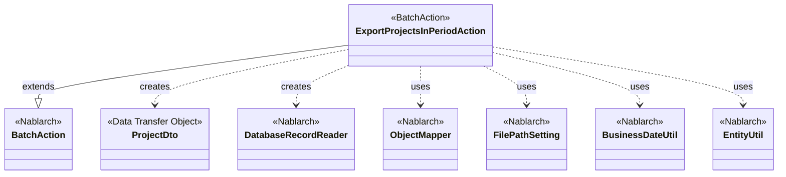
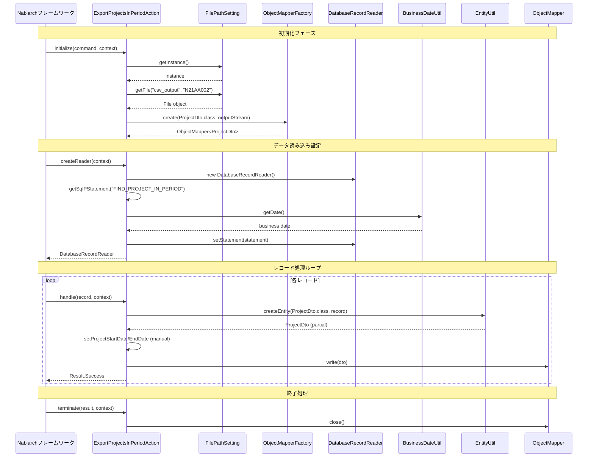

# Code Analysis: ExportProjectsInPeriodAction

**Generated**: 2026-03-05 21:33:11
**Target**: 期間内プロジェクト一覧出力バッチアクション
**Modules**: proman-batch
**Analysis Duration**: 約2分58秒

---

## Overview

ExportProjectsInPeriodActionは、期間内のプロジェクト情報をデータベースから抽出し、CSV形式で出力する都度起動バッチアクションです。BatchAction<SqlRow>を継承し、Nablarchバッチフレームワークの標準パターン（DB to FILE）に従って実装されています。

**主要な処理**:
1. initialize: 出力ファイルとObjectMapperの準備
2. createReader: DatabaseRecordReaderによるDB読み込み設定
3. handle: レコードごとのDTO変換とCSV出力
4. terminate: リソース解放

---

## Architecture

### Dependency Graph



**Note**: This diagram uses Mermaid `classDiagram` syntax to show class names and their relationships. Use `--|>` for inheritance (extends/implements) and `..>` for dependencies (uses/creates).

### Component Summary

| Component | Role | Type | Dependencies |
|-----------|------|------|--------------|
| ExportProjectsInPeriodAction | CSV出力バッチアクション | BatchAction | DatabaseRecordReader, ObjectMapper, FilePathSetting, BusinessDateUtil, EntityUtil, ProjectDto |
| ProjectDto | プロジェクト情報のデータ転送オブジェクト | DTO | なし |

---

## Flow

### Processing Flow

1. **初期化フェーズ (initialize)**
   - FilePathSettingから出力ファイルパスを取得
   - ObjectMapperFactory.createでProjectDto用のMapperを生成

2. **データ読み込み設定 (createReader)**
   - DatabaseRecordReaderを生成
   - FIND_PROJECT_IN_PERIOD SQLを実行準備
   - BusinessDateUtilで業務日付を取得し、検索条件に設定

3. **レコード処理 (handle)**
   - SqlRowからEntityUtil.createEntityでProjectDtoを生成
   - 日付項目は型変換が必要なため個別にsetterを呼び出し
   - mapper.write(dto)でCSVに出力
   - Result.Successを返却

4. **終了処理 (terminate)**
   - mapper.close()でバッファをフラッシュし、リソース解放

### Sequence Diagram



---

## Components

### ExportProjectsInPeriodAction

**ファイル**: [ExportProjectsInPeriodAction.java:31-81](../../.lw/nab-official/v6/nablarch-system-development-guide/Sample_Project/Source_Code/proman-project/proman-batch/src/main/java/com/nablarch/example/proman/batch/project/ExportProjectsInPeriodAction.java#L31-L81)

**役割**: 期間内プロジェクト一覧をCSV形式で出力する都度起動バッチアクション

**主要メソッド**:
- `initialize(CommandLine, ExecutionContext)` [:44-54](../../.lw/nab-official/v6/nablarch-system-development-guide/Sample_Project/Source_Code/proman-project/proman-batch/src/main/java/com/nablarch/example/proman/batch/project/ExportProjectsInPeriodAction.java#L44-L54) - ObjectMapperの初期化
- `createReader(ExecutionContext)` [:57-65](../../.lw/nab-official/v6/nablarch-system-development-guide/Sample_Project/Source_Code/proman-project/proman-batch/src/main/java/com/nablarch/example/proman/batch/project/ExportProjectsInPeriodAction.java#L57-L65) - DatabaseRecordReaderの生成と条件設定
- `handle(SqlRow, ExecutionContext)` [:68-75](../../.lw/nab-official/v6/nablarch-system-development-guide/Sample_Project/Source_Code/proman-project/proman-batch/src/main/java/com/nablarch/example/proman/batch/project/ExportProjectsInPeriodAction.java#L68-L75) - レコード単位のDTO変換とCSV出力
- `terminate(Result, ExecutionContext)` [:78-80](../../.lw/nab-official/v6/nablarch-system-development-guide/Sample_Project/Source_Code/proman-project/proman-batch/src/main/java/com/nablarch/example/proman/batch/project/ExportProjectsInPeriodAction.java#L78-L80) - リソース解放

**依存関係**: BatchAction (親クラス), ObjectMapper, DatabaseRecordReader, FilePathSetting, BusinessDateUtil, EntityUtil

**実装のポイント**:
- EntityUtilで自動変換できない日付項目は手動でsetterを呼び出し (Line 71-72)
- ObjectMapperはフィールド変数として保持し、初期化と終了処理で管理
- 業務日付を2つのパラメータとして使用（期間の開始と終了）

### ProjectDto

**ファイル**: [ProjectDto.java:22-269](../../.lw/nab-official/v6/nablarch-system-development-guide/Sample_Project/Source_Code/proman-project/proman-batch/src/main/java/com/nablarch/example/proman/batch/project/ProjectDto.java#L22-L269)

**役割**: プロジェクト情報を保持するデータ転送オブジェクト

**主要フィールド**:
- projectId, projectName, projectType, projectClass
- projectStartDate, projectEndDate (String型で保持)
- organizationId, clientId, projectManager, projectLeader
- note, sales, versionNo

**依存関係**: なし (Pure Data Object)

**実装のポイント**:
- @Csvアノテーションでフォーマットを宣言的に定義 (Line 15-19)
- @CsvFormatでCSV出力設定（カンマ区切り、UTF-8、全項目クォート） (Line 20-21)
- 日付項目はString型で保持し、setterでDate→String変換 (Line 138-156)
- DateUtil.formatDateで"yyyy/MM/dd"形式に変換

---

## Nablarch Framework Usage

### BatchAction<SqlRow>

**クラス**: `nablarch.fw.action.BatchAction`

**説明**: Nablarchバッチ処理の汎用テンプレートクラス。DB to FILEパターンに対応。

**使用方法**:
```java
public class ExportProjectsInPeriodAction extends BatchAction<SqlRow> {
    @Override
    protected void initialize(CommandLine command, ExecutionContext context) {
        // 初期化処理
    }

    @Override
    public DataReader<SqlRow> createReader(ExecutionContext context) {
        // データリーダの生成
        return new DatabaseRecordReader();
    }

    @Override
    public Result handle(SqlRow record, ExecutionContext context) {
        // レコード単位の処理
        return new Success();
    }

    @Override
    protected void terminate(Result result, ExecutionContext context) {
        // 終了処理
    }
}
```

**重要ポイント**:
- ✅ **ライフサイクルメソッド**: initialize → createReader → handle(繰り返し) → terminateの順で実行
- ✅ **リソース管理**: initializeで確保したリソースはterminateで必ず解放
- 💡 **型パラメータ**: SqlRowは汎用的、DTO型を指定することも可能
- 🎯 **適用パターン**: DB to FILE、DB to DB、FILE to DBなど多様なパターンに対応

**このコードでの使い方**:
- BatchAction<SqlRow>を継承 (Line 31)
- initialize: ObjectMapperを生成してフィールドに保持 (Line 44-54)
- createReader: DatabaseRecordReaderを生成し、SQL条件を設定 (Line 57-65)
- handle: SqlRowをProjectDtoに変換してCSV出力 (Line 68-75)
- terminate: ObjectMapperをcloseしてリソース解放 (Line 78-80)

**詳細**: [Nablarch Batch Architecture](../../.claude/skills/nabledge-6/docs/processing-pattern/nablarch-batch/nablarch-batch-architecture.md)

---

### DatabaseRecordReader

**クラス**: `nablarch.fw.reader.DatabaseRecordReader`

**説明**: データベースから順次レコードを読み込むDataReaderの実装。

**使用方法**:
```java
@Override
public DataReader<SqlRow> createReader(ExecutionContext context) {
    DatabaseRecordReader reader = new DatabaseRecordReader();
    SqlPStatement statement = getSqlPStatement("FIND_PROJECT_IN_PERIOD");
    statement.setDate(1, bizDate);
    statement.setDate(2, bizDate);
    reader.setStatement(statement);
    return reader;
}
```

**重要ポイント**:
- ✅ **SQLステートメント設定**: reader.setStatement()でSqlPStatementを設定
- ✅ **パラメータバインド**: setDate, setString等で条件値を設定
- 💡 **大量データ対応**: カーソルを使用するため、メモリに全データを保持しない
- ⚡ **フェッチサイズ**: デフォルト値で十分だが、調整も可能

**このコードでの使い方**:
- createReaderメソッドでDatabaseRecordReaderを生成 (Line 58)
- getSqlPStatementでSQL文を取得（FIND_PROJECT_IN_PERIOD） (Line 59)
- BusinessDateUtilで取得した業務日付を2つのパラメータに設定 (Line 60-62)
- reader.setStatementでステートメントを設定 (Line 63)

**詳細**: [Handlers Data_read_handler](../../.claude/skills/nabledge-6/docs/component/handlers/handlers-data_read_handler.md)

---

### ObjectMapper

**クラス**: `nablarch.common.databind.ObjectMapper`, `nablarch.common.databind.ObjectMapperFactory`

**説明**: CSVやTSV、固定長データをJava Beansとして扱う機能を提供する。

**使用方法**:
```java
try (ObjectMapper<ProjectDto> mapper = ObjectMapperFactory.create(ProjectDto.class, outputStream)) {
    for (ProjectDto dto : dtoList) {
        mapper.write(dto);
    }
}
```

**重要ポイント**:
- ✅ **必ずclose()を呼ぶ**: バッファをフラッシュし、リソースを解放する
- ⚠️ **型変換の制限**: EntityUtilと同様に、型変換が必要な項目は個別設定が必要
- 💡 **アノテーション駆動**: @Csv, @CsvFormatでフォーマットを宣言的に定義できる
- ⚡ **大量データ処理**: メモリに全データを保持しないため、大量データでも問題なく処理可能

**このコードでの使い方**:
- initialize()でObjectMapperFactory.createを呼び出し (Line 50)
- ProjectDto.classとFileOutputStreamを引数に指定
- handle()で各レコードをmapper.write(dto)で出力 (Line 73)
- terminate()でmapper.close()してリソース解放 (Line 79)

**詳細**: [Libraries Data_bind](../../.claude/skills/nabledge-6/docs/component/libraries/libraries-data_bind.md)

---

### FilePathSetting

**クラス**: `nablarch.core.util.FilePathSetting`

**説明**: 論理名からファイルパスを取得する機能を提供。環境ごとのパス管理を容易にする。

**使用方法**:
```java
FilePathSetting filePathSetting = FilePathSetting.getInstance();
File output = filePathSetting.getFile("csv_output", "N21AA002");
```

**重要ポイント**:
- ✅ **環境分離**: コンポーネント設定でパスを管理、コードには論理名のみ記述
- ✅ **拡張子自動付与**: fileExtensionsに設定した拡張子が自動的に付与される
- ⚠️ **classpathスキーム制限**: JBoss/WildFly等ではfileスキームを使用
- 💡 **複数論理名**: 1つのディレクトリに複数の拡張子を持つ論理名を設定可能

**このコードでの使い方**:
- FilePathSetting.getInstance()でシングルトンを取得 (Line 45)
- getFile("csv_output", "N21AA002")でファイルパスを取得 (Line 46-47)
- 論理名"csv_output"に対応するディレクトリと拡張子が自動的に解決される

**詳細**: [Libraries File_path_management](../../.claude/skills/nabledge-6/docs/component/libraries/libraries-file_path_management.md)

---

### BusinessDateUtil

**クラス**: `nablarch.core.date.BusinessDateUtil`

**説明**: データベースで管理された業務日付を取得する機能を提供。

**使用方法**:
```java
String bizDate = BusinessDateUtil.getDate(); // デフォルト区分の業務日付
Date sqlDate = new Date(DateUtil.getDate(bizDate).getTime());
```

**重要ポイント**:
- ✅ **区分による複数管理**: 区分ごとに異なる業務日付を管理可能
- ✅ **再実行対応**: システムプロパティで業務日付を上書き可能
- 💡 **バッチ処理向け**: ウェブと異なり、プロセス単位で日付を管理
- 🎯 **適用シーン**: 日次バッチ、月次バッチなど業務日付基準の処理

**このコードでの使い方**:
- BusinessDateUtil.getDate()でデフォルト区分の業務日付を取得 (Line 60)
- DateUtil.getDate()でString→Dateに変換
- new Date()でjava.sql.Dateに変換してSQLパラメータに設定 (Line 60-62)

**詳細**: [Libraries Date](../../.claude/skills/nabledge-6/docs/component/libraries/libraries-date.md)

---

### EntityUtil

**クラス**: `nablarch.common.dao.EntityUtil`

**説明**: SqlRowからEntityへの自動マッピングを提供。

**使用方法**:
```java
ProjectDto dto = EntityUtil.createEntity(ProjectDto.class, record);
// 型変換が必要な項目は個別設定
dto.setProjectStartDate(record.getDate("PROJECT_START_DATE"));
```

**重要ポイント**:
- ✅ **自動マッピング**: カラム名とプロパティ名が一致する項目を自動設定
- ⚠️ **型変換の制限**: 型が異なる項目は自動設定されないため個別対応が必要
- 💡 **省力化**: 大半の項目は自動設定されるため、コード量が削減される
- 🎯 **適用シーン**: SqlRowをEntityやDTOに変換する際に使用

**このコードでの使い方**:
- EntityUtil.createEntity(ProjectDto.class, record)で自動マッピング (Line 69)
- プロジェクト開始日付と終了日付は型が異なるため個別にsetterを呼び出し (Line 71-72)
- record.getDate()でjava.sql.Date型を取得し、DTOのString型setterに渡す

**詳細**: Nablarch公式ドキュメント参照

---

## References

### Source Files

- [ExportProjectsInPeriodAction.java (.lw/nab-official/v6/nablarch-system-development-guide/en/Sample_Project/Source_Code/proman-project/proman-batch/src/main/java/com/nablarch/example/proman/batch/project)](../../.lw/nab-official/v6/nablarch-system-development-guide/en/Sample_Project/Source_Code/proman-project/proman-batch/src/main/java/com/nablarch/example/proman/batch/project/ExportProjectsInPeriodAction.java) - ExportProjectsInPeriodAction
- [ExportProjectsInPeriodAction.java (.lw/nab-official/v6/nablarch-system-development-guide/Sample_Project/Source_Code/proman-project/proman-batch/src/main/java/com/nablarch/example/proman/batch/project)](../../.lw/nab-official/v6/nablarch-system-development-guide/Sample_Project/Source_Code/proman-project/proman-batch/src/main/java/com/nablarch/example/proman/batch/project/ExportProjectsInPeriodAction.java) - ExportProjectsInPeriodAction
- [ProjectDto.java (.lw/nab-official/v6/nablarch-system-development-guide/en/Sample_Project/Source_Code/proman-project/proman-batch/src/main/java/com/nablarch/example/proman/batch/project)](../../.lw/nab-official/v6/nablarch-system-development-guide/en/Sample_Project/Source_Code/proman-project/proman-batch/src/main/java/com/nablarch/example/proman/batch/project/ProjectDto.java) - ProjectDto
- [ProjectDto.java (.lw/nab-official/v6/nablarch-system-development-guide/Sample_Project/Source_Code/proman-project/proman-batch/src/main/java/com/nablarch/example/proman/batch/project)](../../.lw/nab-official/v6/nablarch-system-development-guide/Sample_Project/Source_Code/proman-project/proman-batch/src/main/java/com/nablarch/example/proman/batch/project/ProjectDto.java) - ProjectDto

### Knowledge Base (Nabledge-6)

- [Nablarch Batch Architecture](../../.claude/skills/nabledge-6/docs/processing-pattern/nablarch-batch/nablarch-batch-architecture.md)
- [Libraries Data_bind](../../.claude/skills/nabledge-6/docs/component/libraries/libraries-data_bind.md)
- [Libraries Date](../../.claude/skills/nabledge-6/docs/component/libraries/libraries-date.md)
- [Handlers Data_read_handler](../../.claude/skills/nabledge-6/docs/component/handlers/handlers-data_read_handler.md)
- [Libraries File_path_management](../../.claude/skills/nabledge-6/docs/component/libraries/libraries-file_path_management.md)

### Official Documentation


- [Architecture](https://nablarch.github.io/docs/LATEST/doc/application_framework/application_framework/batch/nablarch_batch/architecture.html)
- [AsyncMessageSendAction](https://nablarch.github.io/docs/LATEST/javadoc/nablarch/fw/messaging/action/AsyncMessageSendAction.html)
- [BasicBusinessDateProvider](https://nablarch.github.io/docs/LATEST/javadoc/nablarch/core/date/BasicBusinessDateProvider.html)
- [BasicSystemTimeProvider](https://nablarch.github.io/docs/LATEST/javadoc/nablarch/core/date/BasicSystemTimeProvider.html)
- [BatchAction](https://nablarch.github.io/docs/LATEST/javadoc/nablarch/fw/action/BatchAction.html)
- [BeanUtil](https://nablarch.github.io/docs/LATEST/javadoc/nablarch/core/beans/BeanUtil.html)
- [BusinessDateProvider](https://nablarch.github.io/docs/LATEST/javadoc/nablarch/core/date/BusinessDateProvider.html)
- [BusinessDateUtil](https://nablarch.github.io/docs/LATEST/javadoc/nablarch/core/date/BusinessDateUtil.html)
- [CsvDataBindConfig](https://nablarch.github.io/docs/LATEST/javadoc/nablarch/common/databind/csv/CsvDataBindConfig.html)
- [CsvFormat](https://nablarch.github.io/docs/LATEST/javadoc/nablarch/common/databind/csv/CsvFormat.html)
- [Csv](https://nablarch.github.io/docs/LATEST/javadoc/nablarch/common/databind/csv/Csv.html)
- [Data Bind](https://nablarch.github.io/docs/LATEST/doc/application_framework/application_framework/libraries/data_io/data_bind.html)
- [Data Read Handler](https://nablarch.github.io/docs/LATEST/doc/application_framework/application_framework/handlers/standalone/data_read_handler.html)
- [DataBindConfig](https://nablarch.github.io/docs/LATEST/javadoc/nablarch/common/databind/DataBindConfig.html)
- [DataReadHandler](https://nablarch.github.io/docs/LATEST/javadoc/nablarch/fw/handler/DataReadHandler.html)
- [DataReader.NoMoreRecord](https://nablarch.github.io/docs/LATEST/javadoc/nablarch/fw/DataReader.NoMoreRecord.html)
- [DataReader](https://nablarch.github.io/docs/LATEST/javadoc/nablarch/fw/DataReader.html)
- [DatabaseRecordReader](https://nablarch.github.io/docs/LATEST/javadoc/nablarch/fw/reader/DatabaseRecordReader.html)
- [Date](https://nablarch.github.io/docs/LATEST/doc/application_framework/application_framework/libraries/date.html)
- [DispatchHandler](https://nablarch.github.io/docs/LATEST/javadoc/nablarch/fw/handler/DispatchHandler.html)
- [ExecutionContext](https://nablarch.github.io/docs/LATEST/javadoc/nablarch/fw/ExecutionContext.html)
- [Field](https://nablarch.github.io/docs/LATEST/javadoc/nablarch/common/databind/fixedlength/Field.html)
- [File Path Management](https://nablarch.github.io/docs/LATEST/doc/application_framework/application_framework/libraries/file_path_management.html)
- [FileBatchAction](https://nablarch.github.io/docs/LATEST/javadoc/nablarch/fw/action/FileBatchAction.html)
- [FileDataReader](https://nablarch.github.io/docs/LATEST/javadoc/nablarch/fw/reader/FileDataReader.html)
- [FilePathSetting](https://nablarch.github.io/docs/LATEST/javadoc/nablarch/core/util/FilePathSetting.html)
- [FileResponse](https://nablarch.github.io/docs/LATEST/javadoc/nablarch/common/web/download/FileResponse.html)
- [FixedLengthDataBindConfigBuilder](https://nablarch.github.io/docs/LATEST/javadoc/nablarch/common/databind/fixedlength/FixedLengthDataBindConfigBuilder.html)
- [FixedLengthDataBindConfig](https://nablarch.github.io/docs/LATEST/javadoc/nablarch/common/databind/fixedlength/FixedLengthDataBindConfig.html)
- [FixedLength](https://nablarch.github.io/docs/LATEST/javadoc/nablarch/common/databind/fixedlength/FixedLength.html)
- [LineNumber](https://nablarch.github.io/docs/LATEST/javadoc/nablarch/common/databind/LineNumber.html)
- [MultiLayoutConfig.RecordIdentifier](https://nablarch.github.io/docs/LATEST/javadoc/nablarch/common/databind/fixedlength/MultiLayoutConfig.RecordIdentifier.html)
- [MultiLayout](https://nablarch.github.io/docs/LATEST/javadoc/nablarch/common/databind/fixedlength/MultiLayout.html)
- [NoInputDataBatchAction](https://nablarch.github.io/docs/LATEST/javadoc/nablarch/fw/action/NoInputDataBatchAction.html)
- [ObjectMapperFactory](https://nablarch.github.io/docs/LATEST/javadoc/nablarch/common/databind/ObjectMapperFactory.html)
- [ObjectMapper](https://nablarch.github.io/docs/LATEST/javadoc/nablarch/common/databind/ObjectMapper.html)
- [Package-summary](https://nablarch.github.io/docs/LATEST/javadoc/nablarch/common/databind/fixedlength/converter/package-summary.html)
- [PartInfo](https://nablarch.github.io/docs/LATEST/javadoc/nablarch/fw/web/upload/PartInfo.html)
- [ProcessStopHandler.ProcessStop](https://nablarch.github.io/docs/LATEST/javadoc/nablarch/fw/handler/ProcessStopHandler.ProcessStop.html)
- [Result](https://nablarch.github.io/docs/LATEST/javadoc/nablarch/fw/Result.html)
- [ResumeDataReader](https://nablarch.github.io/docs/LATEST/javadoc/nablarch/fw/reader/ResumeDataReader.html)
- [StatusCodeConvertHandler](https://nablarch.github.io/docs/LATEST/javadoc/nablarch/fw/handler/StatusCodeConvertHandler.html)
- [SystemTimeProvider](https://nablarch.github.io/docs/LATEST/javadoc/nablarch/core/date/SystemTimeProvider.html)
- [SystemTimeUtil](https://nablarch.github.io/docs/LATEST/javadoc/nablarch/core/date/SystemTimeUtil.html)
- [ValidatableFileDataReader](https://nablarch.github.io/docs/LATEST/javadoc/nablarch/fw/reader/ValidatableFileDataReader.html)

---

**Note**: This documentation was generated by the code-analysis workflow of the nabledge-6 skill.
