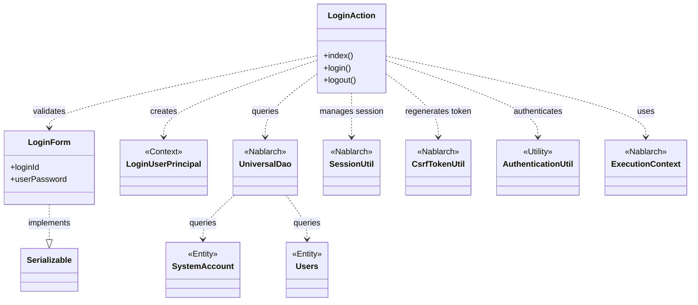
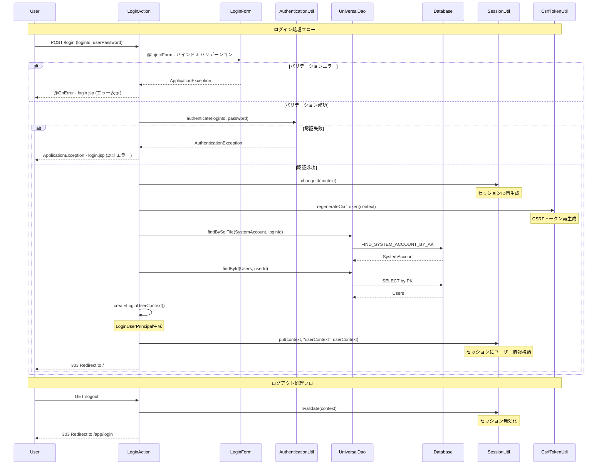

# Code Analysis: LoginAction

**Generated**: 2026-03-05 21:32:52
**Target**: ログイン認証処理
**Modules**: proman-web
**Analysis Duration**: 不明

---

## Overview

LoginActionは、Nablarch 6ベースのWebアプリケーションにおける認証機能を提供するアクションクラスです。ログイン画面の表示、認証処理、ログアウト処理の3つの主要メソッドを持ちます。

主な責務：
- ログイン画面表示（index）
- ログイン認証とセッション確立（login）
- ログアウト処理（logout）

Nablarchのフォームインジェクション、Bean Validation、セッション管理、CSRF対策、UniversalDaoを活用した実装となっています。

---

## Architecture

### Dependency Graph



**Note**: This diagram uses Mermaid `classDiagram` syntax to show class names and their relationships. Use `--|>` for inheritance (extends/implements) and `..>` for dependencies (uses/creates).

### Component Summary

| Component | Role | Type | Dependencies |
|-----------|------|------|--------------|
| LoginAction | ログイン認証処理 | Action | LoginForm, AuthenticationUtil, UniversalDao, SessionUtil, CsrfTokenUtil, ExecutionContext |
| LoginForm | ログイン入力フォーム | Form | なし（Bean Validationアノテーションのみ） |
| SystemAccount | システムアカウントエンティティ | Entity | なし |
| Users | ユーザー情報エンティティ | Entity | なし |
| LoginUserPrincipal | ログインユーザーコンテキスト | Context | なし |
| AuthenticationUtil | 認証ユーティリティ | Utility | なし（プロジェクト実装） |

---

## Flow

### Processing Flow

**ログインフロー**:
1. ユーザーがログインIDとパスワードを入力
2. `@InjectForm`により自動的にLoginFormにバインドされ、Bean Validationで検証
3. バリデーション成功後、`AuthenticationUtil.authenticate()`で認証
4. 認証成功時：
   - `SessionUtil.changeId()`でセッションID再生成（セッション固定攻撃対策）
   - `CsrfTokenUtil.regenerateCsrfToken()`でCSRFトークン再生成
   - `UniversalDao`でSystemAccountとUsersを検索し、LoginUserPrincipalを生成
   - LoginUserPrincipalをセッションに格納
   - トップ画面へリダイレクト（303）
5. 認証失敗時：`@OnError`によりエラーメッセージ付きでログイン画面を再表示

**ログアウトフロー**:
1. `SessionUtil.invalidate()`でセッションを無効化
2. ログイン画面へリダイレクト（303）

### Sequence Diagram



---

## Components

### 1. LoginAction

**ファイル**: [LoginAction.java](../../.lw/nab-official/v6/nablarch-system-development-guide/Sample_Project/Source_Code/proman-project/proman-web/src/main/java/com/nablarch/example/proman/web/login/LoginAction.java)

**役割**: ログイン/ログアウト処理を担当するアクションクラス

**主要メソッド**:
- `index()` [:38-40](../../.lw/nab-official/v6/nablarch-system-development-guide/Sample_Project/Source_Code/proman-project/proman-web/src/main/java/com/nablarch/example/proman/web/login/LoginAction.java#L38-L40) - ログイン画面表示
- `login()` [:49-71](../../.lw/nab-official/v6/nablarch-system-development-guide/Sample_Project/Source_Code/proman-project/proman-web/src/main/java/com/nablarch/example/proman/web/login/LoginAction.java#L49-L71) - 認証処理とセッション確立
- `logout()` [:102-106](../../.lw/nab-official/v6/nablarch-system-development-guide/Sample_Project/Source_Code/proman-project/proman-web/src/main/java/com/nablarch/example/proman/web/login/LoginAction.java#L102-L106) - ログアウト処理
- `createLoginUserContext()` [:79-92](../../.lw/nab-official/v6/nablarch-system-development-guide/Sample_Project/Source_Code/proman-project/proman-web/src/main/java/com/nablarch/example/proman/web/login/LoginAction.java#L79-L92) - ログインユーザー情報生成（private）

**依存関係**:
- LoginForm - 入力フォーム
- AuthenticationUtil - 認証処理
- UniversalDao - データベースアクセス
- SessionUtil, CsrfTokenUtil - セッション・セキュリティ管理

**実装のポイント**:
- `@InjectForm`でフォームを自動バインド・バリデーション
- `@OnError`でバリデーションエラー時の遷移先を指定
- 認証成功後、セッションID再生成でセッション固定攻撃を防止
- CSRFトークン再生成で認証後の安全性を確保
- 303リダイレクトでPRG（Post-Redirect-Get）パターンを実装

### 2. LoginForm

**ファイル**: [LoginForm.java](../../.lw/nab-official/v6/nablarch-system-development-guide/Sample_Project/Source_Code/proman-project/proman-web/src/main/java/com/nablarch/example/proman/web/login/LoginForm.java)

**役割**: ログイン入力値を保持し、Bean Validationで検証

**プロパティ**:
- `loginId` [:21-23](../../.lw/nab-official/v6/nablarch-system-development-guide/Sample_Project/Source_Code/proman-project/proman-web/src/main/java/com/nablarch/example/proman/web/login/LoginForm.java#L21-L23) - ログインID（@Required, @Domain）
- `userPassword` [:25-28](../../.lw/nab-official/v6/nablarch-system-development-guide/Sample_Project/Source_Code/proman-project/proman-web/src/main/java/com/nablarch/example/proman/web/login/LoginForm.java#L25-L28) - パスワード（@Required, @Domain）

**バリデーション**:
- `@Required` - 必須入力チェック
- `@Domain` - ドメイン定義による形式チェック（長さ、文字種など）

**実装のポイント**:
- Serializableを実装（セッション保存可能）
- アノテーションベースのバリデーションで宣言的に検証ルールを定義

---

## Nablarch Framework Usage

### @InjectForm

**アノテーション**: `nablarch.common.web.interceptor.InjectForm`

**説明**: HTTPリクエストパラメータを自動的にフォームオブジェクトにバインドし、Bean Validationで検証する

**使用方法**:
```java
@InjectForm(form = LoginForm.class)
public HttpResponse login(HttpRequest request, ExecutionContext context) {
    LoginForm form = context.getRequestScopedVar("form");
    // formは既にバインド済み、バリデーション済み
}
```

**重要ポイント**:
- ✅ **自動バインド**: リクエストパラメータがフォームのプロパティに自動マッピング
- ✅ **自動バリデーション**: Bean Validationアノテーションに基づき自動検証
- ⚠️ **エラー時の挙動**: バリデーションエラー時はApplicationExceptionがスロー（@OnErrorで制御）
- 💡 **リクエストスコープ**: バインド後のフォームは`context.getRequestScopedVar("form")`で取得

**このコードでの使い方**:
- `login()`メソッドに`@InjectForm(form = LoginForm.class)`を付与
- LoginFormがリクエストパラメータから自動生成され、バリデーション実施
- `context.getRequestScopedVar("form")`でバインド済みフォームを取得

**詳細**: [データバインド](../../.claude/skills/nabledge-6/docs/component/libraries/libraries-data_bind.md)

### @OnError

**アノテーション**: `nablarch.fw.web.interceptor.OnError`

**説明**: メソッド実行時に特定の例外が発生した場合の遷移先を指定する

**使用方法**:
```java
@OnError(type = ApplicationException.class, path = "/WEB-INF/view/login/login.jsp")
public HttpResponse login(HttpRequest request, ExecutionContext context) {
    // バリデーションエラー時、自動的にlogin.jspへフォワード
}
```

**重要ポイント**:
- ✅ **宣言的エラー制御**: エラー時の遷移先をアノテーションで宣言
- ⚠️ **エラー情報の伝播**: ApplicationExceptionのメッセージがリクエストスコープに設定され、JSPで表示可能
- 💡 **フォーム値の保持**: エラー時もフォーム入力値が保持され、JSPで再表示可能

**このコードでの使い方**:
- `login()`メソッドに`@OnError`を付与
- バリデーションエラー（ApplicationException）発生時、login.jspへフォワード
- ユーザーが入力した値とエラーメッセージを表示

### UniversalDao

**クラス**: `nablarch.common.dao.UniversalDao`

**説明**: SQLを書かずに単純なCRUD操作を実行し、検索結果をBeanにマッピングできるデータベースアクセス機能

**使用方法**:
```java
// SQLファイルによる検索
SystemAccount account = UniversalDao.findBySqlFile(
    SystemAccount.class,
    "FIND_SYSTEM_ACCOUNT_BY_AK",
    new Object[]{loginId}
);

// 主キーによる検索
Users users = UniversalDao.findById(Users.class, userId);
```

**重要ポイント**:
- ✅ **SQLファイル検索**: 外部SQLファイルで柔軟な検索条件を記述可能
- ✅ **自動マッピング**: 検索結果を自動的にEntityにマッピング
- ⚠️ **例外処理**: データが見つからない場合はNoDataExceptionがスロー
- 💡 **プレースホルダ**: PreparedStatementを使用し、SQLインジェクション対策済み

**このコードでの使い方**:
- `findBySqlFile()`でログインIDからSystemAccountを検索（L80-82）
- `findById()`で主キーからUsersを検索（L83）
- 検索結果をLoginUserPrincipalの生成に使用

**詳細**: [Universal Dao](../../.claude/skills/nabledge-6/docs/component/libraries/libraries-universal_dao.md)

### SessionUtil

**クラス**: `nablarch.common.web.session.SessionUtil`

**説明**: HTTPセッションを抽象化し、セッション管理機能を提供

**使用方法**:
```java
// セッションID再生成（セッション固定攻撃対策）
SessionUtil.changeId(context);

// セッションへの値の格納
SessionUtil.put(context, "userContext", userContext);

// セッションの無効化
SessionUtil.invalidate(context);
```

**重要ポイント**:
- ✅ **セッションID再生成**: 認証後に必ずchangeId()を実行（セッション固定攻撃対策）
- ⚠️ **セッション無効化**: ログアウト時はinvalidate()でセッション全体を破棄
- 💡 **セキュリティ**: NablarchのセッションストアはUUIDベースの推測困難なIDを使用

**このコードでの使い方**:
- 認証成功後、`changeId()`でセッションIDを再生成（L65）
- `put()`でLoginUserPrincipalをセッションに格納（L69）
- ログアウト時、`invalidate()`でセッションを無効化（L103）

### CsrfTokenUtil

**クラス**: `nablarch.common.web.csrf.CsrfTokenUtil`

**説明**: CSRFトークンの生成・検証機能を提供

**使用方法**:
```java
// 認証後のCSRFトークン再生成
CsrfTokenUtil.regenerateCsrfToken(context);
```

**重要ポイント**:
- ✅ **認証後の再生成**: ログイン成功後、新しいCSRFトークンを生成（セキュリティ強化）
- 💡 **自動検証**: CSRF対策ハンドラがトークンを自動検証
- 🎯 **使用タイミング**: 認証状態が変わるタイミング（ログイン成功時）に再生成

**このコードでの使い方**:
- 認証成功後、セッションID再生成と同時にCSRFトークンも再生成（L66）
- トークン検証はハンドラが自動実行（このコードでは明示的な検証なし）

**詳細**: [セキュリティチェック](../../.claude/skills/nabledge-6/docs/check/security-check/security-check.md)

---

## References

### Source Files

- [LoginAction.java (.lw/nab-official/v6/nablarch-system-development-guide/en/Sample_Project/Source_Code/proman-project/proman-web/src/main/java/com/nablarch/example/proman/web/login)](../../.lw/nab-official/v6/nablarch-system-development-guide/en/Sample_Project/Source_Code/proman-project/proman-web/src/main/java/com/nablarch/example/proman/web/login/LoginAction.java) - LoginAction
- [LoginAction.java (.lw/nab-official/v6/nablarch-system-development-guide/Sample_Project/Source_Code/proman-project/proman-web/src/main/java/com/nablarch/example/proman/web/login)](../../.lw/nab-official/v6/nablarch-system-development-guide/Sample_Project/Source_Code/proman-project/proman-web/src/main/java/com/nablarch/example/proman/web/login/LoginAction.java) - LoginAction
- [LoginForm.java (.lw/nab-official/v6/nablarch-system-development-guide/en/Sample_Project/Source_Code/proman-project/proman-web/src/main/java/com/nablarch/example/proman/web/login)](../../.lw/nab-official/v6/nablarch-system-development-guide/en/Sample_Project/Source_Code/proman-project/proman-web/src/main/java/com/nablarch/example/proman/web/login/LoginForm.java) - LoginForm
- [LoginForm.java (.lw/nab-official/v6/nablarch-system-development-guide/Sample_Project/Source_Code/proman-project/proman-web/src/main/java/com/nablarch/example/proman/web/login)](../../.lw/nab-official/v6/nablarch-system-development-guide/Sample_Project/Source_Code/proman-project/proman-web/src/main/java/com/nablarch/example/proman/web/login/LoginForm.java) - LoginForm

### Knowledge Base (Nabledge-6)

- [Libraries Universal_dao](../../.claude/skills/nabledge-6/docs/component/libraries/libraries-universal_dao.md)
- [Libraries Data_bind](../../.claude/skills/nabledge-6/docs/component/libraries/libraries-data_bind.md)
- [Security Check](../../.claude/skills/nabledge-6/docs/check/security-check/security-check.md)

### Official Documentation


- [252](https://fintan.jp/page/252/)
- [BasicDaoContextFactory](https://nablarch.github.io/docs/LATEST/javadoc/nablarch/common/dao/BasicDaoContextFactory.html)
- [BeanUtil](https://nablarch.github.io/docs/LATEST/javadoc/nablarch/core/beans/BeanUtil.html)
- [ConnectionFactory](https://nablarch.github.io/docs/LATEST/javadoc/nablarch/core/db/connection/ConnectionFactory.html)
- [CsvDataBindConfig](https://nablarch.github.io/docs/LATEST/javadoc/nablarch/common/databind/csv/CsvDataBindConfig.html)
- [CsvFormat](https://nablarch.github.io/docs/LATEST/javadoc/nablarch/common/databind/csv/CsvFormat.html)
- [Csv](https://nablarch.github.io/docs/LATEST/javadoc/nablarch/common/databind/csv/Csv.html)
- [Data Bind](https://nablarch.github.io/docs/LATEST/doc/application_framework/application_framework/libraries/data_io/data_bind.html)
- [DataBindConfig](https://nablarch.github.io/docs/LATEST/javadoc/nablarch/common/databind/DataBindConfig.html)
- [DatabaseMetaDataExtractor](https://nablarch.github.io/docs/LATEST/javadoc/nablarch/common/dao/DatabaseMetaDataExtractor.html)
- [Date](https://nablarch.github.io/docs/LATEST/javadoc/java/sql/Date.html)
- [DeferredEntityList](https://nablarch.github.io/docs/LATEST/javadoc/nablarch/common/dao/DeferredEntityList.html)
- [Dialect](https://nablarch.github.io/docs/LATEST/javadoc/nablarch/core/db/dialect/Dialect.html)
- [EntityList](https://nablarch.github.io/docs/LATEST/javadoc/nablarch/common/dao/EntityList.html)
- [Field](https://nablarch.github.io/docs/LATEST/javadoc/nablarch/common/databind/fixedlength/Field.html)
- [FileResponse](https://nablarch.github.io/docs/LATEST/javadoc/nablarch/common/web/download/FileResponse.html)
- [FixedLengthDataBindConfigBuilder](https://nablarch.github.io/docs/LATEST/javadoc/nablarch/common/databind/fixedlength/FixedLengthDataBindConfigBuilder.html)
- [FixedLengthDataBindConfig](https://nablarch.github.io/docs/LATEST/javadoc/nablarch/common/databind/fixedlength/FixedLengthDataBindConfig.html)
- [FixedLength](https://nablarch.github.io/docs/LATEST/javadoc/nablarch/common/databind/fixedlength/FixedLength.html)
- [GenerationType](https://nablarch.github.io/docs/LATEST/javadoc/jakarta/persistence/GenerationType.html)
- [H2Dialect](https://nablarch.github.io/docs/LATEST/javadoc/nablarch/core/db/dialect/H2Dialect.html)
- [Integer](https://nablarch.github.io/docs/LATEST/javadoc/java/lang/Integer.html)
- [LineNumber](https://nablarch.github.io/docs/LATEST/javadoc/nablarch/common/databind/LineNumber.html)
- [Long](https://nablarch.github.io/docs/LATEST/javadoc/java/lang/Long.html)
- [MultiLayoutConfig.RecordIdentifier](https://nablarch.github.io/docs/LATEST/javadoc/nablarch/common/databind/fixedlength/MultiLayoutConfig.RecordIdentifier.html)
- [MultiLayout](https://nablarch.github.io/docs/LATEST/javadoc/nablarch/common/databind/fixedlength/MultiLayout.html)
- [ObjectMapperFactory](https://nablarch.github.io/docs/LATEST/javadoc/nablarch/common/databind/ObjectMapperFactory.html)
- [ObjectMapper](https://nablarch.github.io/docs/LATEST/javadoc/nablarch/common/databind/ObjectMapper.html)
- [OnError](https://nablarch.github.io/docs/LATEST/javadoc/nablarch/fw/web/interceptor/OnError.html)
- [OptimisticLockException](https://nablarch.github.io/docs/LATEST/javadoc/jakarta/persistence/OptimisticLockException.html)
- [Package-summary](https://nablarch.github.io/docs/LATEST/javadoc/nablarch/common/databind/fixedlength/converter/package-summary.html)
- [Pagination](https://nablarch.github.io/docs/LATEST/javadoc/nablarch/common/dao/Pagination.html)
- [PartInfo](https://nablarch.github.io/docs/LATEST/javadoc/nablarch/fw/web/upload/PartInfo.html)
- [SimpleDbTransactionManager](https://nablarch.github.io/docs/LATEST/javadoc/nablarch/core/db/transaction/SimpleDbTransactionManager.html)
- [TransactionFactory](https://nablarch.github.io/docs/LATEST/javadoc/nablarch/core/transaction/TransactionFactory.html)
- [Universal Dao](https://nablarch.github.io/docs/LATEST/doc/application_framework/application_framework/libraries/database/universal_dao.html)
- [UniversalDao.Transaction](https://nablarch.github.io/docs/LATEST/javadoc/nablarch/common/dao/UniversalDao.Transaction.html)
- [UniversalDao](https://nablarch.github.io/docs/LATEST/javadoc/nablarch/common/dao/UniversalDao.html)

---

**Note**: This documentation was generated by the code-analysis workflow of the nabledge-6 skill.
