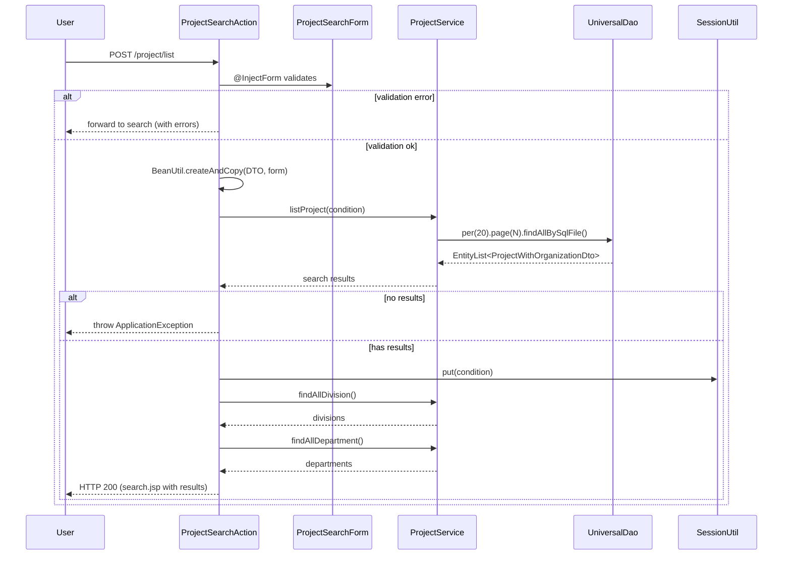

# Code Analysis: ProjectSearchAction

**Generated**: 2026-03-05 21:32:44
**Target**: プロジェクト検索処理
**Modules**: proman-web
**Analysis Duration**: 約2分9秒

---

## Overview

ProjectSearchActionは、proman-webモジュールにおけるプロジェクト検索機能を提供するWebアクションクラスです。検索画面の初期表示、検索実行、ページング、詳細画面表示といった検索に関連する複数の処理を担当します。

主な機能:
- 検索画面の初期表示（事業部・部門リストの取得）
- 複数条件によるプロジェクト検索とページング
- 検索結果の一覧表示
- セッションを使った検索条件の保持（詳細画面からの戻り対応）
- プロジェクト詳細画面の表示

NablarchフレームワークのUniversalDao（ページング機能）、フォームインジェクション、セッション管理、BeanUtilによるオブジェクト変換を活用した実装となっています。

---

## Architecture

### Dependency Graph

```mermaid
classDiagram
    class ProjectSearchAction
    class ProjectSearchForm {
        <<Form>>
    }
    class ProjectService
    class ProjectSearchConditionDto {
        <<DTO>>
    }
    class ProjectWithOrganizationDto {
        <<DTO>>
    }
    class UniversalDao {
        <<Nablarch>>
    }
    class ExecutionContext {
        <<Nablarch>>
    }
    class SessionUtil {
        <<Nablarch>>
    }
    class BeanUtil {
        <<Nablarch>>
    }

    ProjectSearchAction ..> ProjectSearchForm : validates
    ProjectSearchAction ..> ProjectService : delegates to
    ProjectSearchAction ..> ExecutionContext : uses
    ProjectSearchAction ..> SessionUtil : uses
    ProjectSearchAction ..> BeanUtil : uses
    ProjectSearchAction ..> ProjectSearchConditionDto : creates
    ProjectService ..> UniversalDao : queries
    ProjectService ..> ProjectWithOrganizationDto : returns
    ProjectSearchForm --|> SearchFormBase : extends
```



**Note**: This diagram uses Mermaid `classDiagram` syntax to show class names and their relationships. Use `--|>` for inheritance (extends/implements) and `..>` for dependencies (uses/creates).

### Component Summary

| Component | Role | Type | Dependencies |
|-----------|------|------|--------------|
| ProjectSearchAction | プロジェクト検索処理の制御 | Action | ProjectSearchForm, ProjectService, ExecutionContext, SessionUtil, BeanUtil |
| ProjectSearchForm | 検索条件の入力検証 | Form | SearchFormBase, @Domain, @Valid |
| ProjectService | プロジェクトデータアクセス | Service | UniversalDao, Organization, Project |
| ProjectSearchConditionDto | 検索条件保持 | DTO | なし |
| ProjectWithOrganizationDto | 検索結果（組織情報付き） | DTO | なし |

---

## Flow

### Processing Flow

プロジェクト検索の主な処理フロー（listメソッド）:

1. **フォームバリデーション**: @InjectFormによりProjectSearchFormを自動インジェクトし、入力値を検証
2. **DTO変換**: BeanUtil.createAndCopyで入力フォームをProjectSearchConditionDtoに変換
3. **ページ番号設定**: 初回検索時はページ番号を"1"に設定（ページング時は送信値を使用）
4. **検索実行**: ProjectService経由でUniversalDaoのページング機能（per/page）を使用し、検索を実行
5. **セッション保存**: 詳細画面からの戻りに備え、検索条件をセッションに保存
6. **結果表示**: 検索結果と選択肢（事業部・部門）をリクエストスコープに設定し、JSPに転送

エラー時は@OnErrorにより検索画面（forward://search）にフォワードされ、エラーメッセージが表示されます。

### Sequence Diagram



---

## Components

### ProjectSearchAction

**Role**: プロジェクト検索に関する各種リクエストのコントローラ

**File**: [ProjectSearchAction.java](../../.lw/nab-official/v6/nablarch-system-development-guide/Sample_Project/Source_Code/proman-project/proman-web/src/main/java/com/nablarch/example/proman/web/project/ProjectSearchAction.java)

**Key Methods**:
- `search()` [:35-40] - 検索画面初期表示。セッション削除と選択肢設定。
- `list()` [:49-69] - 一覧検索実行。フォーム検証、DTO変換、検索実行、セッション保存を行う。
- `backToList()` [:78-91] - 検索画面に戻る。セッションから検索条件を復元して再検索。
- `detail()` [:101-109] - プロジェクト詳細画面表示。

**Dependencies**: ProjectSearchForm, ProjectService, ExecutionContext, SessionUtil, BeanUtil

**Implementation Points**:
- @InjectFormでフォーム自動バインド・検証
- @OnErrorでバリデーションエラー時のフォワード先指定
- セッションに検索条件を保存し、詳細画面からの戻りに対応

### ProjectSearchForm

**Role**: プロジェクト検索条件の入力検証

**File**: [ProjectSearchForm.java](../../.lw/nab-official/v6/nablarch-system-development-guide/Sample_Project/Source_Code/proman-project/proman-web/src/main/java/com/nablarch/example/proman/web/project/ProjectSearchForm.java)

**Key Methods**:
- `isValidProjectSalesRange()` [:294-297] - 売上高FROM/TOの妥当性検証（@AssertTrue）
- `isValidProjectStartDateRange()` [:306-309] - 開始日FROM/TOの妥当性検証
- `isValidProjectEndDateRange()` [:318-321] - 終了日FROM/TOの妥当性検証

**Dependencies**: SearchFormBase（ページング用の親クラス）, @Domain, @Valid

**Implementation Points**:
- Jakarta EE Bean Validation（@Domain, @Valid, @AssertTrue）による宣言的バリデーション
- 日付・金額の範囲チェックを@AssertTrueでカスタム実装
- 内部クラスでプロジェクト種別・分類のBean定義

### ProjectService

**Role**: プロジェクトデータアクセスのビジネスロジック層

**File**: [ProjectService.java](../../.lw/nab-official/v6/nablarch-system-development-guide/Sample_Project/Source_Code/proman-project/proman-web/src/main/java/com/nablarch/example/proman/web/project/ProjectService.java)

**Key Methods**:
- `listProject()` [:99-104] - ページング付き検索。UniversalDao.per().page().findAllBySqlFile()を使用。
- `findAllDivision()` [:50-52] - 全事業部取得（SQLファイル: FIND_ALL_DIVISION）
- `findAllDepartment()` [:59-61] - 全部門取得（SQLファイル: FIND_ALL_DEPARTMENT）

**Dependencies**: UniversalDao（DaoContext）, Organization, Project, ProjectWithOrganizationDto

**Implementation Points**:
- 1ページ20件固定（RECORDS_PER_PAGE = 20L）
- findAllBySqlFileでSQLファイルベースのクエリ実行
- DaoContextを使ったDAO操作のカプセル化

---

## Nablarch Framework Usage

### UniversalDao - ページング機能

**クラス**: `nablarch.common.dao.UniversalDao`（実体はDaoContext）

**説明**: SQLファイルを使った検索にページング機能を提供。per()でページサイズ、page()でページ番号を指定。

**使用方法**:
```java
// ProjectService.listProject()の実装
return universalDao
        .per(RECORDS_PER_PAGE)      // 1ページあたり20件
        .page(condition.getPageNumber())  // ページ番号
        .findAllBySqlFile(ProjectWithOrganizationDto.class, "FIND_PROJECT_WITH_ORGANIZATION", condition);
```

**重要ポイント**:
- ✅ **必ずper()とpage()をfindAllBySqlFile()の前に呼ぶ**: チェインメソッドで順序指定
- ⚡ **件数取得SQLが自動発行される**: 性能劣化時はカウントSQLをカスタマイズ可能
- 💡 **EntityListのgetPagination()で情報取得**: 総件数、総ページ数、現在ページ等の情報を取得可能

**このコードでの使い方**:
- ProjectService.listProject()でper(20).page(N)を指定（Line 100-103）
- 検索条件オブジェクトをfindAllBySqlFileの第3引数に渡す
- 戻り値はEntityList<ProjectWithOrganizationDto>

**詳細**: [Universal Dao](../../.claude/skills/nabledge-6/docs/component/libraries/libraries-universal_dao.md#paging)

### @InjectForm - フォーム自動バインド

**アノテーション**: `nablarch.common.web.interceptor.InjectForm`

**説明**: HTTPリクエストパラメータを自動でFormオブジェクトにバインドし、Bean Validationで検証。

**使用方法**:
```java
@InjectForm(form = ProjectSearchForm.class, prefix = "form")
@OnError(type = ApplicationException.class, path = "forward://search")
public HttpResponse list(HttpRequest request, ExecutionContext context) {
    ProjectSearchForm form = context.getRequestScopedVar("form");
    // formはバリデーション済みで使用可能
}
```

**重要ポイント**:
- ✅ **@OnErrorと併用してエラーハンドリング**: バリデーションエラー時の遷移先を指定
- 💡 **prefixでリクエストスコープの変数名指定**: デフォルトは"form"
- 🎯 **Bean Validationの制約アノテーションが自動実行**: @Domain, @Valid, @AssertTrue等

**このコードでの使い方**:
- list()メソッドで@InjectForm(form = ProjectSearchForm.class, prefix = "form")（Line 49）
- @OnErrorでバリデーションエラー時にforward://searchへ（Line 50）

### BeanUtil - オブジェクト変換

**クラス**: `nablarch.core.beans.BeanUtil`

**説明**: JavaBeansのプロパティをコピーしてオブジェクト変換。FormからDTOへの変換等に使用。

**使用方法**:
```java
ProjectSearchConditionDto condition = BeanUtil.createAndCopy(ProjectSearchConditionDto.class, form);
```

**重要ポイント**:
- ✅ **同名プロパティを自動コピー**: getter/setterの命名規則に従う
- ⚠️ **型変換はサポート外**: String→Integerなどの型変換は行われない（同じ型のみコピー）
- 💡 **不要なバリデーション情報を除外**: Formの@Validアノテーション等はDTOに不要なため、BeanUtilで純粋なデータオブジェクトを作成

**このコードでの使い方**:
- list()メソッドでProjectSearchFormをProjectSearchConditionDtoに変換（Line 58）

### SessionUtil - セッション管理

**クラス**: `nablarch.common.web.session.SessionUtil`

**説明**: HTTPセッションへのオブジェクト保存・取得・削除を簡潔に行うユーティリティ。

**使用方法**:
```java
// セッションに保存
SessionUtil.put(context, "searchCondition", condition);

// セッションから取得
ProjectSearchConditionDto condition = SessionUtil.get(context, "searchCondition");

// セッションから削除
SessionUtil.delete(context, "searchCondition");
```

**重要ポイント**:
- ✅ **セッションスコープのキー名を明示**: "searchCondition"等の文字列キーで管理
- 💡 **詳細画面からの戻りに最適**: 検索条件を保持し、戻り時に復元できる
- 🎯 **ExecutionContextを経由**: Nablarchのコンテキスト管理に統合

**このコードでの使い方**:
- 検索実行時に検索条件をセッション保存（Line 66）
- 検索画面初期表示時にセッション削除（Line 36）
- 詳細から戻る際にセッションから検索条件を復元（Line 81）

---

## References

### Source Files

- [ProjectSearchAction.java (.lw/nab-official/v6/nablarch-system-development-guide/en/Sample_Project/Source_Code/proman-project/proman-web/src/main/java/com/nablarch/example/proman/web/project)](../../.lw/nab-official/v6/nablarch-system-development-guide/en/Sample_Project/Source_Code/proman-project/proman-web/src/main/java/com/nablarch/example/proman/web/project/ProjectSearchAction.java) - ProjectSearchAction
- [ProjectSearchAction.java (.lw/nab-official/v6/nablarch-system-development-guide/Sample_Project/Source_Code/proman-project/proman-web/src/main/java/com/nablarch/example/proman/web/project)](../../.lw/nab-official/v6/nablarch-system-development-guide/Sample_Project/Source_Code/proman-project/proman-web/src/main/java/com/nablarch/example/proman/web/project/ProjectSearchAction.java) - ProjectSearchAction
- [ProjectSearchForm.java (.lw/nab-official/v6/nablarch-system-development-guide/en/Sample_Project/Source_Code/proman-project/proman-web/src/main/java/com/nablarch/example/proman/web/project)](../../.lw/nab-official/v6/nablarch-system-development-guide/en/Sample_Project/Source_Code/proman-project/proman-web/src/main/java/com/nablarch/example/proman/web/project/ProjectSearchForm.java) - ProjectSearchForm
- [ProjectSearchForm.java (.lw/nab-official/v6/nablarch-system-development-guide/Sample_Project/Source_Code/proman-project/proman-web/src/main/java/com/nablarch/example/proman/web/project)](../../.lw/nab-official/v6/nablarch-system-development-guide/Sample_Project/Source_Code/proman-project/proman-web/src/main/java/com/nablarch/example/proman/web/project/ProjectSearchForm.java) - ProjectSearchForm
- [ProjectService.java (.lw/nab-official/v6/nablarch-system-development-guide/en/Sample_Project/Source_Code/proman-project/proman-web/src/main/java/com/nablarch/example/proman/web/project)](../../.lw/nab-official/v6/nablarch-system-development-guide/en/Sample_Project/Source_Code/proman-project/proman-web/src/main/java/com/nablarch/example/proman/web/project/ProjectService.java) - ProjectService
- [ProjectService.java (.lw/nab-official/v6/nablarch-system-development-guide/Sample_Project/Source_Code/proman-project/proman-web/src/main/java/com/nablarch/example/proman/web/project)](../../.lw/nab-official/v6/nablarch-system-development-guide/Sample_Project/Source_Code/proman-project/proman-web/src/main/java/com/nablarch/example/proman/web/project/ProjectService.java) - ProjectService
- [ProjectSearchConditionDto.java (.lw/nab-official/v6/nablarch-system-development-guide/en/Sample_Project/Source_Code/proman-project/proman-web/src/main/java/com/nablarch/example/proman/web/project)](../../.lw/nab-official/v6/nablarch-system-development-guide/en/Sample_Project/Source_Code/proman-project/proman-web/src/main/java/com/nablarch/example/proman/web/project/ProjectSearchConditionDto.java) - ProjectSearchConditionDto
- [ProjectSearchConditionDto.java (.lw/nab-official/v6/nablarch-system-development-guide/Sample_Project/Source_Code/proman-project/proman-web/src/main/java/com/nablarch/example/proman/web/project)](../../.lw/nab-official/v6/nablarch-system-development-guide/Sample_Project/Source_Code/proman-project/proman-web/src/main/java/com/nablarch/example/proman/web/project/ProjectSearchConditionDto.java) - ProjectSearchConditionDto

### Knowledge Base (Nabledge-6)

- [Libraries Universal_dao](../../.claude/skills/nabledge-6/docs/component/libraries/libraries-universal_dao.md)
- [Libraries Data_bind](../../.claude/skills/nabledge-6/docs/component/libraries/libraries-data_bind.md)

### Official Documentation


- [BasicDaoContextFactory](https://nablarch.github.io/docs/LATEST/javadoc/nablarch/common/dao/BasicDaoContextFactory.html)
- [BeanUtil](https://nablarch.github.io/docs/LATEST/javadoc/nablarch/core/beans/BeanUtil.html)
- [ConnectionFactory](https://nablarch.github.io/docs/LATEST/javadoc/nablarch/core/db/connection/ConnectionFactory.html)
- [CsvDataBindConfig](https://nablarch.github.io/docs/LATEST/javadoc/nablarch/common/databind/csv/CsvDataBindConfig.html)
- [CsvFormat](https://nablarch.github.io/docs/LATEST/javadoc/nablarch/common/databind/csv/CsvFormat.html)
- [Csv](https://nablarch.github.io/docs/LATEST/javadoc/nablarch/common/databind/csv/Csv.html)
- [Data Bind](https://nablarch.github.io/docs/LATEST/doc/application_framework/application_framework/libraries/data_io/data_bind.html)
- [DataBindConfig](https://nablarch.github.io/docs/LATEST/javadoc/nablarch/common/databind/DataBindConfig.html)
- [DatabaseMetaDataExtractor](https://nablarch.github.io/docs/LATEST/javadoc/nablarch/common/dao/DatabaseMetaDataExtractor.html)
- [Date](https://nablarch.github.io/docs/LATEST/javadoc/java/sql/Date.html)
- [DeferredEntityList](https://nablarch.github.io/docs/LATEST/javadoc/nablarch/common/dao/DeferredEntityList.html)
- [Dialect](https://nablarch.github.io/docs/LATEST/javadoc/nablarch/core/db/dialect/Dialect.html)
- [EntityList](https://nablarch.github.io/docs/LATEST/javadoc/nablarch/common/dao/EntityList.html)
- [Field](https://nablarch.github.io/docs/LATEST/javadoc/nablarch/common/databind/fixedlength/Field.html)
- [FileResponse](https://nablarch.github.io/docs/LATEST/javadoc/nablarch/common/web/download/FileResponse.html)
- [FixedLengthDataBindConfigBuilder](https://nablarch.github.io/docs/LATEST/javadoc/nablarch/common/databind/fixedlength/FixedLengthDataBindConfigBuilder.html)
- [FixedLengthDataBindConfig](https://nablarch.github.io/docs/LATEST/javadoc/nablarch/common/databind/fixedlength/FixedLengthDataBindConfig.html)
- [FixedLength](https://nablarch.github.io/docs/LATEST/javadoc/nablarch/common/databind/fixedlength/FixedLength.html)
- [GenerationType](https://nablarch.github.io/docs/LATEST/javadoc/jakarta/persistence/GenerationType.html)
- [H2Dialect](https://nablarch.github.io/docs/LATEST/javadoc/nablarch/core/db/dialect/H2Dialect.html)
- [Integer](https://nablarch.github.io/docs/LATEST/javadoc/java/lang/Integer.html)
- [LineNumber](https://nablarch.github.io/docs/LATEST/javadoc/nablarch/common/databind/LineNumber.html)
- [Long](https://nablarch.github.io/docs/LATEST/javadoc/java/lang/Long.html)
- [MultiLayoutConfig.RecordIdentifier](https://nablarch.github.io/docs/LATEST/javadoc/nablarch/common/databind/fixedlength/MultiLayoutConfig.RecordIdentifier.html)
- [MultiLayout](https://nablarch.github.io/docs/LATEST/javadoc/nablarch/common/databind/fixedlength/MultiLayout.html)
- [ObjectMapperFactory](https://nablarch.github.io/docs/LATEST/javadoc/nablarch/common/databind/ObjectMapperFactory.html)
- [ObjectMapper](https://nablarch.github.io/docs/LATEST/javadoc/nablarch/common/databind/ObjectMapper.html)
- [OnError](https://nablarch.github.io/docs/LATEST/javadoc/nablarch/fw/web/interceptor/OnError.html)
- [OptimisticLockException](https://nablarch.github.io/docs/LATEST/javadoc/jakarta/persistence/OptimisticLockException.html)
- [Package-summary](https://nablarch.github.io/docs/LATEST/javadoc/nablarch/common/databind/fixedlength/converter/package-summary.html)
- [Pagination](https://nablarch.github.io/docs/LATEST/javadoc/nablarch/common/dao/Pagination.html)
- [PartInfo](https://nablarch.github.io/docs/LATEST/javadoc/nablarch/fw/web/upload/PartInfo.html)
- [SimpleDbTransactionManager](https://nablarch.github.io/docs/LATEST/javadoc/nablarch/core/db/transaction/SimpleDbTransactionManager.html)
- [TransactionFactory](https://nablarch.github.io/docs/LATEST/javadoc/nablarch/core/transaction/TransactionFactory.html)
- [Universal Dao](https://nablarch.github.io/docs/LATEST/doc/application_framework/application_framework/libraries/database/universal_dao.html)
- [UniversalDao.Transaction](https://nablarch.github.io/docs/LATEST/javadoc/nablarch/common/dao/UniversalDao.Transaction.html)
- [UniversalDao](https://nablarch.github.io/docs/LATEST/javadoc/nablarch/common/dao/UniversalDao.html)

---

**Note**: This documentation was generated by the code-analysis workflow of the nabledge-6 skill.
